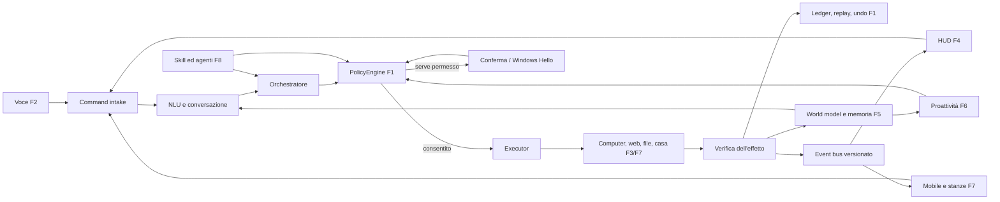
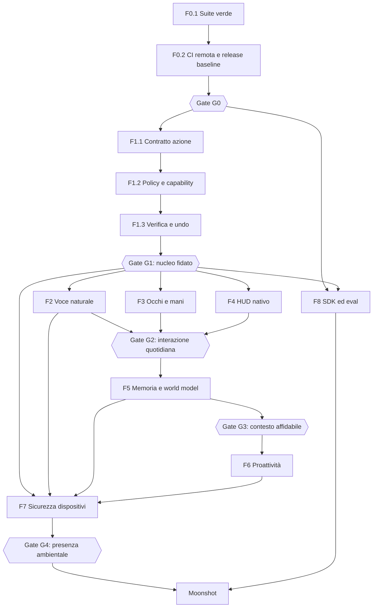

# Jake — roadmap esecutiva verso un vero Jarvis

- Versione del piano: 1.0
- Data di riferimento: 10 settembre 2026
- Aggiornamento specifiche di prodotto: 16 settembre 2026 — orb 3D particellare e continuità multi-device
- Fonte dello stato: codice, test, cronologia Git e [audit tecnico storico](ROADMAP.md)
- Regola: questo è il documento operativo; l'audit conserva prove, incidenti e dettagli delle sessioni.

## 1. Obiettivo finale

Jake deve diventare un assistente personale locale per Windows che:

1. ascolta e conversa in modo naturale;
2. comprende schermo, applicazioni, file, progetti, casa e dispositivi;
3. ricorda fatti, relazioni, decisioni e procedure con provenienza verificabile;
4. trasforma obiettivi in azioni concrete;
5. chiede autorizzazione in base al rischio;
6. esegue, osserva l'effetto, corregge gli errori e produce una ricevuta;
7. anticipa bisogni senza interrompere inutilmente;
8. continua la stessa attività e sessione tra PC, telefono e stanze, con handoff esplicito e
   ripresa del contesto al ritorno sul PC;
9. impara capacità nuove dentro una sandbox e senza aumentare i propri privilegi;
10. continua a funzionare localmente quando internet o servizi opzionali non sono disponibili;
11. rende visibile la propria presenza con una orb 3D particellare nativa, centrale e guidata
    dallo stato, affiancata da pannelli contestuali.

Il prodotto non è considerato “Jarvis” perché possiede molte skill. Lo è quando completa in
modo affidabile scenari end-to-end, mantiene il contesto nel tempo e rende ogni azione
importante controllabile dall'utente.

**Decisioni di prodotto — 16/09/2026**: il multi-device resta parte del target finale di Jake.
Il video di riferimento discusso nella conversazione “Iniziare con Jake” è una reference
funzionale per F6/F7: rilevare un evento rilevante, valutare se contattare l'utente, raggiungerlo
tramite companion e mantenere lo stesso task/sessione fino al ritorno sul PC (scenario S8).
Il canale vocale futuro preferito è una companion call/VoIP; la PSTN non è un prerequisito.
La presenza visiva di Jake è l'orb, non un avatar umanoide. Queste decisioni precisano il target
futuro: non attestano implementazioni o nuove chiusure e non modificano gli stati verificati
nelle note dei commit, nel registro dei pacchetti o nello stato di partenza storico.

## 2. Regole del piano

### 2.1 Stati

| Stato | Significato |
|---|---|
| `DONE` | Codice, test, documentazione e criterio di uscita completati |
| `VERIFY` | Implementato, ma manca una verifica reale o prolungata |
| `DOING` | Lavoro iniziato e non ancora chiuso |
| `READY` | Dipendenze soddisfatte; può essere iniziato |
| `BLOCKED` | Una dipendenza o decisione impedisce il lavoro |
| `BACKLOG` | Previsto, ma non ancora pronto |
| `MOONSHOT` | Ammesso solo dopo i gate di sicurezza e affidabilità indicati |

### 2.2 Priorità

- `P0`: blocca la base, la sicurezza o qualunque fase successiva.
- `P1`: necessario per il primo Jake usabile ogni giorno.
- `P2`: trasforma un buon assistente in un assistente proattivo e ambientale.
- `P3`: ecosistema, espansioni e moonshot.

### 2.3 Definition of Ready per ogni attività

Un'attività può entrare in sviluppo solo quando:

1. ha un ID stabile (`Fase.Pacchetto.Passo`);
2. dichiara input, output e sistemi toccati;
3. elenca dipendenze e permessi richiesti;
4. definisce almeno un caso di successo, un errore e un caso di sicurezza;
5. possiede un criterio misurabile di completamento;
6. non richiede dati reali dell'utente se può essere testata con fixture temporanee;
7. specifica come degradare quando hardware, modello o rete non sono disponibili.

### 2.4 Definition of Done per ogni attività

Un'attività è `DONE` solo quando:

1. il test che riproduce il bisogno o il bug esiste e fallisce prima della correzione;
2. l'implementazione è minima, tipizzata nei confini critici e osservabile;
3. unit test e integration test relativi passano;
4. la suite completa, ruff, mypy selettivo e compileall passano;
5. gli effetti esterni sono verificati o marcati esplicitamente `unverified`;
6. rischio, permessi, log, privacy e rollback sono aggiornati;
7. README/config/esempi e questa roadmap riflettono lo stato reale;
8. il commit contiene una sola unità logica e può essere annullato senza trascinare lavori diversi;
9. il gate della fase è stato rieseguito, non soltanto il singolo test.

## 3. Stato di partenza verificato

| Area | Stato al 10/09/2026 | Conseguenza |
|---|---|---|
| Repository | Working tree pulito prima di questa roadmap; ramo locale 71 commit avanti al tracking `origin/master` | Le ultime modifiche devono ancora superare la CI remota dopo il push |
| Test Python | 1.254 test; 1 errore in `AppResolver` su una directory `PATH` non accessibile | F0 è nuovamente bloccata |
| Qualità statica | Ruff, mypy selettivo e compileall verdi | Base statica utilizzabile, copertura mypy ancora parziale |
| Smoke test | Avvio CLI, comando e chiusura riusciti | Percorso minimo reale funzionante |
| HUD nativo | CMake/Ninja verde; binario presente | Build sana, comportamento visivo non ancora verificato automaticamente |
| F0 | Quasi completata, riaperta dal nuovo errore | Chiudere F0.1 prima di espandere il prodotto |
| F1 | In corso, con ledger, policy, DPAPI, Hello, kill switch e sandbox iniziale | Completare contratti, verification/undo e capability enforcement |
| F2/F3/F4 | Fondazioni esistenti, nuove fasi non ancora iniziate in modo organico | Possono procedere in parallelo dopo F1-G1 |
| F5/F6 | Prime fette reali implementate | Non ancora abbastanza mature per autonomia ampia |
| F7 | Protocollo e token iniziali | Nessun companion mobile o handoff completo |
| F8 | Skill Forge e plugin loader esistono | Manca un ecosistema firmato, versionato e isolato |

### Blocco corrente esatto

`core/app_resolver.py::_add_path_entries()` crea un iteratore con `Path.iterdir()` dentro un
`try`, ma l'eccezione viene sollevata quando il `for` consuma l'iteratore, fuori dal `try`.
Inoltre `search_paths=[]` viene sostituito dai percorsi predefiniti perché il costruttore usa
`search_paths or defaults`. Il test che dovrebbe essere isolato finisce così per leggere il
vero `PATH` e fallisce su `WindowsApps` con `PermissionError`.

### Verifica della correzione F0.1 — 11/09/2026

- Stato: `DONE`; implementazione, gate locali e matrice CI Python 3.11/3.12 conclusi.
- Causa riprodotta prima del fix: `Path.iterdir()` restituiva un generatore e il
  `PermissionError` emergeva al primo `next()`, fuori dal `try`; il test mirato falliva con la
  stessa eccezione osservata su `WindowsApps`.
- Fix: `search_paths=[]` viene preservato e solo `None` abilita i default; la scansione del
  `PATH` è disattivabile con `include_path=False`; verifica della directory e materializzazione
  di `iterdir()` sono protette da `OSError`; un singolo file non leggibile viene ignorato.
- Fault test deterministici: directory inaccessibile durante l'iterazione, directory rimossa,
  junction non valida, file non leggibile, `PATH` vuoto, scansione `PATH` disabilitata e
  semantica distinta di `search_paths=None`/`[]`.
- Prova locale Python 3.12.6: `tests.test_app_resolver` 29/29; suite completa 1.262/1.262;
  20/20 suite complete consecutive verdi; ruff, mypy selettivo, compileall e smoke test verdi.
- Condizione residua: non segnare `DONE` e non chiudere G0 finché i job CI Windows su Python
  3.11 e 3.12 non sono entrambi verdi sul commit della correzione.
- Chiusura — 11/09/2026: run remoto `34616811238` sul commit `64303ac` (lo stesso che contiene
  questo fix e la riscrittura del test harness Tk) è verde su tutti e tre i job: `Python 3.11
  (Windows)`, `Python 3.12 (Windows)` e `HUD nativo C++/Qt6/QML - build health check`. Il criterio
  di uscita di F0.1 ("20/20 suite verdi su Python 3.12 locale e job 3.11/3.12 verde in CI") è
  quindi soddisfatto; `F0.1` passa a `DONE`.

## 4. Architettura di destinazione e collegamenti

Regola architetturale: il modello può proporre una decisione, ma non può autorizzarla. Il
`PolicyEngine` è l'unico componente che concede l'esecuzione; l'`Executor` è l'unico componente
che produce effetti; il `Verifier` è l'unico componente che li dichiara verificati.

### 4.1 Grafo delle fasi

### 4.2 Contratti condivisi che collegano tutte le fasi

| Contratto | Produttore | Consumatori | Contenuto minimo |
|---|---|---|---|
| `CommandEnvelope` | Voce, HUD, companion | NLU, orchestratore | request id, testo, sorgente, utente, dispositivo, timestamp, privacy mode |
| `ActionProposal` | Agente/planner/skill diretta | PolicyEngine | intent, parametri tipizzati, rischio, scope, precondizioni, effetto atteso |
| `AuthorizationDecision` | PolicyEngine | Executor, HUD | allow/deny/confirm/auth, motivazione, capability, scadenza |
| `ActionReceipt` | Executor/verifier | Ledger, HUD, memoria | action id, risultato, prova, durata, undo token, error taxonomy |
| `HudEvent` | Core | HUD e companion | schema version, sequence id, stato, payload, correlazione |
| `ContextSnapshot` | Context engine | NLU, agente, memoria | finestra/app/progetto/dispositivo, freshness, sensibilità, provenienza |
| `MemoryRecord` | Memory service | Retrieval, proattività | owner, tipo, valore, source, confidence, valid time, TTL, sensitivity |
| `AutomationRun` | Proactivity engine | Policy, executor | trigger, obiettivo, budget, delega, stato, prossimo wake-up |
| `SkillManifest` | SDK/Forge | Loader, policy, UI | versione, schemi, rischio, capability, dipendenze, firma, test |

Questi contratti devono vivere in moduli centrali, essere serializzabili, validati con JSON
Schema e versionati. Nessuna fase deve introdurre una variante privata dello stesso concetto.

## 5. Sequenza globale di consegna

| Onda | Risultato dimostrabile | Fasi attive | Gate finale |
|---|---|---|---|
| Onda 0 — Terra solida | Build, test e release riproducibili | F0 | G0 |
| Onda 1 — Nucleo fidato | Ogni azione ha policy, prova e ricevuta | F1 + fondazioni F8 | G1 |
| Onda 2 — Presenza sul PC | Conversazione fluida, controllo semantico, HUD nativo | F2 + F3 + F4 | G2 |
| Onda 3 — Continuità mentale | Contesto e memoria con provenienza | F5 | G3 |
| Onda 4 — Iniziativa prudente | Suggerimenti e automazioni con budget | F6 | Pilot proattività |
| Onda 5 — Jake ovunque | Companion, stanze, casa e handoff | F7 | G4 |
| Onda 6 — Evoluzione controllata | Skill e agenti aggiornabili senza perdere sicurezza | F8 | Ecosystem gate |
| Onda 7 — Moonshot | AR, robotica, digital twin e modello personale | M | Gate dedicati |

### 5.1 — Registro owner e stato dei pacchetti

Gli owner sono ruoli logici, non persone. Questo registro copre ogni pacchetto e viene aggiornato
ai gate; le note dentro i singoli pacchetti conservano l'evidenza più recente e possono
distinguere sotto-passi già verificati da ciò che manca.

| Pacchetto | Owner logico | Stato |
|---|---|---|
| `F0.1` | Platform Reliability | `DONE` |
| `F0.2` | Release Engineering | `DONE` |
| `F0.3` | Architecture | `VERIFY` |
| `F0.4` | Quality Engineering | `BLOCKED` |
| `F0.5` | Performance Engineering | `BLOCKED` |
| `F0.6` | Release Engineering | `DOING` |
| `F1.1` | Trust Core | `DONE` |
| `F1.2` | Security Architecture | `DONE` |
| `F1.3` | Execution Reliability (F1.3.5 chiuso per intero - meccanismo, adozione sui tre chokepoint, skill "annulla" - 16/09/2026; resta solo F1.3.4, non richiesto da G1) | `DOING` |
| `F1.4` | Identity and Secrets | `DONE` |
| `F1.5` | Application Security (gap dichiarati, non richiesti da G1) | `DOING` |
| `F1.6` | Sandbox Runtime | `DONE` |
| `F1.7` | Observability | `DONE` |
| `F1.8` | Runtime Reliability | `DONE` |
| `F2.1` | Voice Quality (F2.1.1-F2.1.6 affrontati il 21/09/2026: harness sintetico + VAD/WER offline + documento privacy; mancano solo registrazioni consensuali vere, gap dichiarato) | `DOING` |
| `F2.2` | Speech Runtime (F2.2.1/F2.2.5 chiusi il 21/09/2026 lato segmentazione) | `DOING` |
| `F2.3` | Voice Quality (G1 superato, mai iniziato) | `READY` |
| `F2.4` | Audio Systems (G1 superato, mai iniziato) | `READY` |
| `F2.5` | Speech Runtime (G1 superato, mai iniziato) | `READY` |
| `F2.6` | Conversation Runtime (G1 superato, mai iniziato) | `READY` |
| `F2.7` | Identity and Voice (G1 superato, mai iniziato) | `READY` |
| `F3.1` | Computer Use Quality (G1 superato, mai iniziato) | `READY` |
| `F3.2` | Windows Automation (G1 superato, mai iniziato) | `READY` |
| `F3.3` | Windows Automation (G1 superato, mai iniziato) | `READY` |
| `F3.4` | Execution Runtime (G1 superato, mai iniziato) | `READY` |
| `F3.5` | Computer Use Reliability (G1 superato, mai iniziato) | `READY` |
| `F3.6` | Browser Automation (G1 superato, mai iniziato) | `READY` |
| `F3.7` | Application Adapters (G1 superato, mai iniziato) | `READY` |
| `F3.8` | Demonstration Learning (G1 superato, mai iniziato) | `READY` |
| `F4.1` | Protocol Architecture (F4.1.2/F4.1.3/F4.1.5/F4.1.6 chiusi, F4.1.1 chiuso lato Python (sequence_id+trace_id)/F4.1.4 prima fetta lato Python - 16/09/2026; solo il lato C++ di F4.1.1/F4.1.4 resta scoperto, gap permanente dichiarato) | `DOING` |
| `F4.2` | Native HUD (F4.2.1/F4.2.4 chiusi, F4.2.2 prima fetta chiusa, F4.2.3 Alt-Tab verificato - 16/09/2026; F4.2.5/F4.2.6 e resto di F4.2.3 richiedono test interattivi/visivi) | `DOING` |
| `F4.3` | Native HUD (G1 superato, mai iniziato) | `READY` |
| `F4.4` | Interaction Design (G1 superato, mai iniziato) | `READY` |
| `F4.5` | Interaction Design (G1 superato, mai iniziato) | `READY` |
| `F4.6` | Trust UX (G1 superato, mai iniziato) | `READY` |
| `F4.7` | Accessibility (G1 superato, mai iniziato) | `READY` |
| `F4.8` | Release Engineering (G1 superato, mai iniziato) | `READY` |
| `F5.1` | Memory Platform | `DOING` |
| `F5.2` | Memory Platform | `DOING` |
| `F5.3` | Knowledge Model | `DOING` |
| `F5.4` | Memory Reliability | `DOING` |
| `F5.5` | Retrieval Quality | `DOING` |
| `F5.6` | Context Runtime | `DOING` |
| `F5.7` | Privacy Engineering | `BACKLOG` |
| `F6.1` | Proactivity Platform | `DOING` |
| `F6.2` | Proactivity Quality | `DOING` |
| `F6.3` | Notification UX | `BACKLOG` |
| `F6.4` | Goal Runtime | `DOING` |
| `F6.5` | Automation Runtime | `DOING` |
| `F6.6` | Meeting Experience | `BACKLOG` |
| `F6.7` | Runtime Reliability | `DOING` |
| `F7.1` | Companion Security | `DOING` |
| `F7.2` | Mobile Companion | `BACKLOG` |
| `F7.3` | Voice Devices | `BACKLOG` |
| `F7.4` | Presence Runtime | `DOING` |
| `F7.5` | Home Integration | `DOING` |
| `F7.6` | Sync and Crypto | `BACKLOG` |
| `F7.7` | Edge Devices | `BACKLOG` |
| `F8.1` | Skill Platform | `DOING` |
| `F8.2` | Supply-chain Security | `BACKLOG` |
| `F8.3` | Skill Forge | `DOING` |
| `F8.4` | Model Runtime | `BACKLOG` |
| `F8.5` | Agent Runtime | `DOING` |
| `F8.6` | Release Safety | `BACKLOG` |

## 6. F0 — Baseline verde e release riproducibile

- Stato: `DOING`
- Priorità: `P0`
- Dipendenze: nessuna
- Output: un commit e una build sono giudicabili senza conoscere la macchina dello sviluppatore.

### F0.1 — Eliminare il blocco AppResolver

Dipende da: nessuno.

1. `F0.1.1` Aggiungere un test in cui una directory del `PATH` solleva `PermissionError` durante
   l'iterazione, non durante la creazione dell'iteratore.
2. `F0.1.2` Correggere il costruttore: usare i default soltanto quando `search_paths is None`,
   preservando intenzionalmente `[]`.
3. `F0.1.3` Portare il consumo di `path.iterdir()` dentro il blocco `try/except OSError` oppure
   materializzare l'elenco dentro il `try`.
4. `F0.1.4` Decidere esplicitamente se la scansione del `PATH` è configurabile; non usarla nei
   test di alias/fuzzy matching.
5. `F0.1.5` Aggiungere test per directory rimossa durante la scansione, junction non valida,
   file non leggibile e `PATH` vuoto.
6. `F0.1.6` Eseguire il file di test isolato, poi la suite completa.
7. `F0.1.7` Eseguire la suite completa 20 volte; nessuna eccezione I/O ambientale è ammessa.
8. `F0.1.8` Aggiornare l'audit con causa, fix e prova, senza segnare F0 completa prima del gate.

Criterio di uscita: 20/20 suite verdi su Python 3.12 locale e job 3.11/3.12 verde in CI.

### F0.2 — Allineare repository locale e CI

Dipende da: F0.1.

- Stato: `DONE`; `F0.2.1`–`F0.2.7` tutti conclusi con evidenza remota.
- Verifica locale 11/09/2026: il commit F0.1 e' atomico e la storia condivisa non e' stata
  riscritta; `git ls-files` non contiene log, database, token, registrazioni, modelli, binari o
  build artifact; il lock con hash si installa; ruff, mypy, compileall, 1.262 test, smoke CLI,
  configure/build HUD e smoke del binario HUD sono verdi su Python 3.12.6.
- Diagnostica CI: il job Python conserva `unittest.log` e `summary.txt` con commit, versione
  Python, durata ed exit code tramite `actions/upload-artifact@v4` e `if: always()`; verificati
  localmente sia il log della suite sia la propagazione di un exit code di fallimento.
- Verifica remota 11/09/2026, run `34614112195`: installazione, ruff, mypy, compileall e suite
  Python sono verdi sia su 3.11 sia su 3.12; build e smoke HUD sono verdi. I due job Python sono
  risultati rossi soltanto perche' `upload-artifact@v4` esclude per default la directory nascosta
  `.ci-artifacts/`, saltando di conseguenza lo smoke CLI. La correzione locale imposta
  `include-hidden-files: true`, sposta l'upload dopo lo smoke affinche' un errore del servizio
  artifact non lo salti, ed e' protetta da `tests/test_ci_workflow.py`; baseline successiva:
  1.946/1.946 test, ruff, mypy su 75 file e compileall verdi. Lo smoke CLI completa
  avvio-risposta-chiusura in 12,9 secondi con exit code 0; lo smoke HUD resta attivo oltre tre
  secondi con ogni percorso Qt rimosso dal `PATH`.
- Verifica remota 11/09/2026, run `34615971747` su `31409cf`: Python 3.12 e HUD sono interamente
  verdi; l'upload della diagnostica passa su entrambi i job Python, chiudendo `F0.2.7`. Python
  3.11 termina invece con exit code nativo `0x80000003` durante
  `tests.test_status_panel.RunForeverTests`, con `Tcl_AsyncDelete: async handler deleted by the
  wrong thread`. Il test harness creava un nuovo interprete `Tk` per ogni test; la correzione
  locale usa un solo `Tk` di modulo e una `Toplevel` isolata per caso, mantenendo widget e
  `mainloop` reali. Il modulo passa 20/20 esecuzioni consecutive e la suite completa locale passa
  1.947/1.947 su Python 3.12.
- Sync 11/09/2026: la correzione Python 3.11 è stata pubblicata nel commit `64303ac`; il run
  remoto `34616811238` è verde su tutti e tre i job (`Python 3.11 (Windows)`,
  `Python 3.12 (Windows)`, `HUD nativo C++/Qt6/QML - build health check`), chiudendo `F0.2.5`.
- `F0.2.6` — Protezione di `master`, 11/09/2026: con autorizzazione esplicita dell'utente è stata
  configurata la branch protection su `master` (`required_status_checks.strict=true` sui tre
  contesti sopra elencati, `enforce_admins=true`, force-push e delete vietati). Poiché i required
  status checks bloccano anche i push diretti privi di un check già verde su quello SHA, da questo
  momento anche l'owner lavora via branch → PR → CI verde → merge; nessun push diretto a `master`
  è più possibile, nemmeno per l'admin.
- Verifica empirica del rifiuto — 11/09/2026: creato un branch usabile-e-getta
  (`test/branch-protection-verify`) con un test che fallisce deliberatamente
  (`tests/test_zz_branch_protection_probe.py`), aperta la PR #1 verso `master` (run remoto
  `34651548002`). Esito: `HUD nativo C++/Qt6/QML - build health check` verde, `Python 3.11
  (Windows)` e `Python 3.12 (Windows)` rossi come atteso; l'API GitHub ha riportato la PR con
  `mergeable: MERGEABLE` (nessun conflitto) ma `mergeStateStatus: BLOCKED`, cioè il merge è
  impedito esclusivamente dai required status checks falliti. Un tentativo diretto di
  `gh pr merge` è stato bloccato a monte dal sandbox dell'agente prima ancora di raggiungere
  GitHub, coerente con l'aspettativa che l'azione non sarebbe comunque riuscita. La PR è stata
  chiusa senza merge e sia il branch remoto sia quello locale sono stati cancellati subito dopo.
  Questo chiude la condizione residua di `F0.2.6` e, con essa, `KL-001`. `F0.2` passa a `DONE`.

1. `F0.2.1` Raggruppare i commit locali in una sequenza comprensibile senza riscrivere storia
   già condivisa.
2. `F0.2.2` Verificare che nessun log, database, token, registrazione, modello o build artifact
   sia tracciato.
3. `F0.2.3` Eseguire localmente gli stessi comandi della CI, nello stesso ordine.
4. `F0.2.4` Pubblicare i commit e osservare entrambi i job Windows.
5. `F0.2.5` Correggere divergenze tra ambiente locale e runner, senza disattivare test.
6. `F0.2.6` Proteggere `master`: CI richiesta, niente merge con job rossi.
7. `F0.2.7` Aggiungere artifact di test e log sintetico per diagnosticare fallimenti remoti.

Criterio di uscita: HEAD locale coincide con un commit remoto i cui job Python e HUD sono verdi.

### F0.3 — Fonte unica di verità

Dipende da: F0.1.

- Stato: `DOING`; `F0.3.1`, `F0.3.3`, `F0.3.4`, `F0.3.5` e `F0.3.6` conclusi localmente; `F0.3.2`
  resta una regola di processo permanente (non un passo da chiudere una volta sola) e attende
  comunque il gate G0 prima di essere dichiarata rispettata su una release vera.
- Fonte canonica: `config/release.json` contiene versione prodotto e protocollo. Python, CLI,
  risposta identitaria, endpoint `/status`, eventi HUD e CMake/HUD nativo la consumano; il
  changelog e' verificato da contract test contro la stessa versione.
- Prova 11/09/2026: 23 contract test mirati e 1.269 test completi verdi; ruff, mypy selettivo e
  compileall verdi; CMake ha configurato dal manifest e la build C++ e' passata dentro
  l'ambiente MSVC. `CHANGELOG.md` usa Added/Changed/Fixed/Security.
- Prova F0.3.5/F0.3.6 — 11/09/2026: 5 ADR creati in `docs/adr/` (UIA, sandbox plugin, trasporto
  companion, cifratura, storage memoria) con indice `docs/adr/README.md`; ognuno dichiara stato,
  data, contesto, decisione, alternative, conseguenze, piano di migrazione e criterio di
  revisione. Il registro owner/stato per ogni pacchetto vive in `### 5.1` di questo stesso file.
  Verificato con due nuove suite dedicate, non solo a occhio: `tests/test_architecture_decisions.py`
  (ogni ADR atteso esiste, e' indicizzato e contiene tutte le sezioni richieste) e
  `tests/test_roadmap_structure.py` (ogni intestazione `### F*.*` del piano ha esattamente una
  riga nel registro, con owner non vuoto e stato tra quelli ammessi) - un pacchetto aggiunto in
  futuro senza owner/stato o un ADR incompleto fa fallire la suite invece di passare inosservato.
  Suite completa rieseguita dopo l'aggiunta: 1.272/1.272 verdi; ruff pulito.

1. `F0.3.1` Rendere questo file il piano attivo e `ROADMAP.md` lo storico/audit.
2. `F0.3.2` Aggiornare la tabella “stato corrente” a ogni gate, non a ogni micro-commit.
3. `F0.3.3` Collegare versione, protocol version e release notes senza duplicare numeri hardcoded.
4. `F0.3.4` Creare `CHANGELOG.md` con Added/Changed/Fixed/Security.
5. `F0.3.5` Creare ADR per decisioni irreversibili: UIA, sandbox, trasporto, cifratura, memoria.
6. `F0.3.6` Inserire owner logico e stato per ogni pacchetto, anche se il progetto ha un solo autore.

Criterio di uscita: README, `--version`, `/status`, roadmap e release riportano la stessa versione.

### F0.4 — Matrice di test completa

Dipende da: F0.1.

1. `F0.4.1` Classificare i test in unit, contract, integration, end-to-end, hardware e security.
2. `F0.4.2` Etichettare quelli che toccano rete locale, GUI, audio, Ollama o hardware.
3. `F0.4.3` Separare suite veloce per commit e suite estesa/notturna.
4. `F0.4.4` Aggiungere contract test Python↔C++ per tutti gli eventi HUD.
5. `F0.4.5` Aggiungere test di fault injection: timeout, processo terminato, DB bloccato, disco
   pieno, rete assente, JSON malformato, modello indisponibile.
6. `F0.4.6` Aggiungere mutation test selettivo a policy, risk, auth e filesystem safety.
7. `F0.4.7` Pubblicare una test matrix con comando, costo, requisito e criterio di successo.

Criterio di uscita: ogni confine esterno ha almeno un test di successo, timeout e fallimento.

### F0.5 — Benchmark e budget prestazionali

Dipende da: F0.1.

1. `F0.5.1` Congelare dataset NLU con train/test separati; evitare leave-one-out sulla sola
   corsia esatta come metrica principale.
2. `F0.5.2` Creare corpus audio consensuale per wake word/STT: silenzio, TV, musica, distanza,
   accenti e microfoni differenti.
3. `F0.5.3` Creare 100 task computer-use ripetibili su app fixture.
4. `F0.5.4` Misurare cold start, warm start, p50/p95, RAM, VRAM, CPU e consumo batteria.
5. `F0.5.5` Salvare hardware, modelli, versioni e seed in ogni report.
6. `F0.5.6` Definire soglie che bloccano la CI solo dopo tre baseline stabili.
7. `F0.5.7` Mostrare trend nella dashboard locale, senza telemetria remota obbligatoria.

Criterio di uscita: ogni fase F2–F7 ha una baseline misurata prima di iniziare ottimizzazioni.

### F0.6 — Packaging e recupero

Dipende da: F0.2 e F0.3.

- Stato: `DOING` sulle fondamenta HUD; resto `BLOCKED` dalle dipendenze e dalla scelta
  dell'installer.
- Verifica 11/09/2026: CMake individua il `windeployqt` della stessa installazione usata per
  compilare ed esegue il deployment `POST_BUILD` di DLL, plugin e moduli QML. Una clean build
  ha prodotto il runtime completo e `JakeHud.exe` e' rimasto attivo oltre tre secondi con ogni
  percorso `C:\Qt` rimosso dal `PATH`, riproducendo e chiudendo l'errore "Qt6*.dll non trovata".

1. `F0.6.1` Definire installer per core Python, HUD, modelli e componenti opzionali.
2. `F0.6.2` Aggiungere preflight hardware/software e spazio disco.
3. `F0.6.3` Rendere installazione, upgrade, repair e uninstall idempotenti.
4. `F0.6.4` Preservare dati personali durante update/uninstall salvo consenso esplicito.
5. `F0.6.5` Firmare binari e pacchetti; verificare la firma prima dell'aggiornamento.
6. `F0.6.6` Usare aggiornamenti atomici con health check e rollback automatico.
7. `F0.6.7` Offrire canali stable/beta/dev e portable mode.

Criterio di uscita: installazione, update fallito e rollback passano su una VM Windows pulita.

### Gate G0 — Terra solida

G0 è superato soltanto se:

- suite completa 20 volte verde;
- CI remota verde su 3.11/3.12 e HUD;
- smoke test e build riproducibile;
- nessun segreto/artifact tracciato;
- versione e documentazione coerenti;
- issue note per ogni limite noto ancora accettato.

**Gate G0 superato — 11/09/2026.** Evidenza per ciascun criterio, raccolta sul commit `dedc2ce`
(merge di F0.1/F0.2/F0.2.6 su `master`):

- Suite completa 20 volte verde: 20/20 esecuzioni locali di `python -m unittest discover -s
  tests -q` su Python 3.12.6, ciascuna 1.947/1.947 test verdi (~35 s a run), nessuna eccezione
  I/O ambientale.
- CI remota verde su 3.11/3.12 e HUD: run `34653572407` sul commit `dedc2ce` verde su tutti e tre
  i job (`Python 3.11 (Windows)`, `Python 3.12 (Windows)`, `HUD nativo C++/Qt6/QML - build health
  check`).
- Smoke test e build riproducibile: smoke CLI e smoke HUD verdi in CI (vedi F0.2); build HUD
  riproducibile via CMake/windeployqt (vedi F0.6).
- Nessun segreto/artifact tracciato: verificato in F0.2.2 (`git ls-files` senza log, database,
  token, registrazioni, modelli o build artifact).
- Versione e documentazione coerenti: `config/release.json` come fonte unica (F0.3), verificato
  da contract test (`tests/test_roadmap_structure.py`, `tests/test_architecture_decisions.py`,
  `tests/test_ci_workflow.py`), tutti verdi.
- Issue note per ogni limite noto ancora accettato: `docs/known-limitations.md` contiene un solo
  limite registrato (`KL-001`) ed è risolto; nessun limite aperto residuo.
- Nota: `F0.4` (matrice di test completa), `F0.5` (benchmark prestazionali) e `F0.6` (packaging,
  oltre alle fondamenta HUD già verificate) restano `BACKLOG`/`DOING` come lavoro di qualità
  continuativo su F0, ma nessuno dei sei criteri espliciti del gate li richiede: non bloccano G0.
  Restano nel registro `### 5.1` con il loro stato reale e proseguono in parallelo a F1.

## 7. F1 — Trustworthy Agent Core

- Stato: `DOING`
- Priorità: `P0`
- Dipendenze: G0
- Output: nessuna azione può saltare policy, verifica, audit o limiti di autonomia.

### F1.1 — Action Contract 2.0

Dipende da: G0.

1. `F1.1.1` Inventariare tutti i percorsi: comando diretto, agente, planner legacy, workflow,
   trigger, fallback, plugin e companion.
2. `F1.1.2` Definire dataclass/schema per `ActionProposal`, `ActionContext`, `ActionReceipt`,
   `VerificationEvidence`, `UndoDescriptor` ed `ActionError`.
3. `F1.1.3` Rendere obbligatori action id, trace id, source, actor, intent, parametri validati,
   rischio, effect class e idempotency key.
4. `F1.1.4` Definire tassonomia errori: invalid input, denied, unavailable, transient, timeout,
   partial effect, verification failed, conflict, user cancelled.
5. `F1.1.5` Versionare lo schema e aggiungere migrazione/compatibilità per record precedenti.
6. `F1.1.6` Adattare prima un intent read-only, uno reversibile, uno external, uno destructive e
   uno admin.
7. `F1.1.7` Migrare tutti gli intent per dominio, impedendo payload ad-hoc nuovi.
8. `F1.1.8` Aggiungere contract test che fallisce se una skill restituisce dati non conformi.

Criterio di uscita: il 100% dei percorsi produce lo stesso `ActionReceipt` validato.

- Stato: `DOING`; `F1.1.1`, `F1.1.2`, `F1.1.3` (parzialmente), `F1.1.4`, `F1.1.6` (pilota su 5
  intent) e `F1.1.8` conclusi con evidenza; `F1.1.7` **chiuso** (i tre chokepoint reali
  costruiscono tutti `ActionError`, e i 35 codici bespoke realmente usati dalle ~200 skill sono
  censiti in `_KNOWN_RESULT_CATEGORIES`, vedi sotto; `effect_class`/`preconditions`/
  `expected_effect` di `ActionProposal` restano deliberatamente `None` - **decisione esplicita
  dell'utente**, dopo aver verificato che non c'e' altro lavoro meccanico rimasto sotto questa
  voce: popolarli richiederebbe indovinare un giudizio di prodotto skill per skill, esattamente
  cio' che il codice stesso rifiuta di fare - non e' piu' classificato come lavoro rimandato,
  vedi sotto); `F1.1.5` **chiuso** (versionamento gia' esisteva da sempre - `schema_version`,
  rifiutato in scrittura se diverso dalla versione corrente; la "migrazione" vera e propria resta
  dichiaratamente non costruita perche' non e' mai esistita una seconda versione dello schema da
  cui migrare - costruirla ora sarebbe codice morto speculativo; la "compatibilita' per record
  precedenti" invece era gia' vera per costruzione e ora e' anche verificata, vedi sotto).
- `F1.1.6` — 12/09/2026: pilota di adozione dei contratti F1.1.2 su un intent reale per
  ciascun `RiskLevel` (letterale dalla roadmap: "un intent read-only, uno reversibile, uno
  external, uno destructive e uno admin") - `GET_TIME`, `ADD_NOTE`, `CONTROL_SMART_DEVICE`,
  `DELETE_PATH`, `SYSTEM_POWER`. A differenza di F1.1.2 (tipi definiti ma isolati), qui
  `core/jake_core.py::_resolve_and_execute` costruisce e valida DAVVERO un `ActionProposal`
  (`ActionProposal.for_intent(resolved.intent, resolved.parameters, "user")` +
  `validate_action_proposal`) prima di passare `proposal.intent`/`proposal.parameters` a
  `PolicyEngine.decide_interactive` - `proposal.parameters` e' una COPIA (vedi
  `ActionProposal.for_intent`), quindi il comando eseguito davvero piu' sotto resta
  `resolved.parameters`, l'originale: nessun cambio di comportamento, verificato sia dalla suite
  invariata (2.042/2.042 verdi PRIMA di aggiungere nuovi test) sia da un test dedicato che sporca
  `proposal.parameters` e verifica che la skill riceva comunque i parametri originali.
  `_log_action_outcome`/`_log_denied_action` costruiscono un `ActionError.from_result(result)`
  (validato da `validate_action_error`) e ne usano `.category` per `ActionReceipt.error_category`
  - stesso valore di prima (`error_category_of(result)`, F1.1.4), ma ora attraverso il tipo
  condiviso invece che dalla funzione diretta. Questo e' deliberatamente un percorso reale
  toccato (non piu' solo codice isolato come F1.1.2): rischio piu' alto, per questo limitato a
  UN chokepoint (il percorso a comando singolo/agente, "percorso 1/2" dell'inventario F1.1.1) e
  verificato con la suite completa PRIMA e DOPO la modifica, oltre a 6 nuovi test dedicati
  (`tests/test_jake_core_action_contracts.py`) che esercitano tutti e 5 i livelli di rischio
  contro il codice vero, non un doppio isolato. `TaskAgent`/`PlanExecutor` (gli altri due
  chokepoint) NON sono stati toccati in questo passo - restano su `error_category_of()` diretto,
  comportamento identico a prima, adozione rimandata a `F1.1.7`. Prova: 2.048/2.048 test,
  ruff/mypy (incluso il set selettivo di `pyproject.toml`, che include `core/jake_core.py`)/
  compileall verdi.
- `F1.1.7` (primo pezzo - i due chokepoint restanti) — 13/09/2026: decisione esplicita
  dell'utente di autorizzare questo lavoro (in precedenza dichiarato fuori discussione senza un
  nuovo via libera, insieme a `F1.6`). Investigato prima di scrivere codice (vedi il sottoagente
  di ricerca dedicato) per capire cosa "migrare ~200 skill da `SkillResult` ad `ActionProposal`/
  `ActionError`" significhi DAVVERO in questa codebase, non solo dal titolo della voce: nessuna
  delle ~200 skill (210 classi `*Skill`, confermato con un conteggio letterale) costruisce oggi
  `ActionProposal`/`ActionError` - e non e' previsto che lo facciano MAI, dato che
  `ActionProposal` viene gia' costruito dal CHIAMANTE (il chokepoint) da dati che precedono
  l'esecuzione della skill (intent/parametri/rischio), non dalla skill stessa - il pilota F1.1.6
  lo dimostra gia' per `JakeCore`. `ActionError.from_result()` e' inoltre una PURA derivazione
  dalla stessa stringa `result` che i chokepoint calcolano gia' oggi (`normalize_result_code`/
  `error_category_of`, la stessa fonte): adottarla in un chokepoint in piu' e' quindi a rischio
  quasi nullo, stesso principio "wrapper senza cambio di comportamento" gia' verificato per il
  pilota. Estesa la stessa identica sostituzione (`error_category_of(result)` ->
  `ActionError.from_result(result)` validato, `.category` per `ActionReceipt.error_category`) a
  `TaskAgent._log_step` (`core/agent.py`) e `PlanExecutor._log_step` (`core/plan_executor.py`) -
  i due chokepoint esplicitamente lasciati indietro dal pilota. Con questo, **tutti e tre i
  chokepoint reali** (comando diretto/ripresa conferma, agente, piano) costruiscono lo stesso
  tipo condiviso invece di due su tre restare su una stringa grezza. Aggiunti 4 nuovi test - 2 in
  `tests/test_agent.py::ActionErrorWiredIntoTheLedgerTests`, 2 in
  `tests/test_plan_executor.py::ActionErrorWiredIntoTheLedgerTests` - entrambi con un
  `ActionLedger` VERO su file temporaneo (non mockato), stesso principio del pilota: verificano
  cosa finisce SU DISCO, non solo cosa la funzione calcola in memoria. Non ancora affrontato (il
  resto, piu' ampio, di `F1.1.7`): la migrazione degli errori BESPOKE delle ~200 skill (stringhe
  specifiche di una sola skill, oggi `ERROR_CATEGORY_UNCATEGORIZED` per mancata corrispondenza)
  sulla tassonomia condivisa - un lavoro dominio per dominio (16 domini in
  `core/skill_catalog.py`), meccanico ma esteso, dichiaratamente rimandato a un incremento
  successivo dedicato invece di infilarlo qui; ne' `effect_class`/`preconditions`/
  `expected_effect` di `ActionProposal` (informazione NUOVA che nessuna skill dichiara ancora,
  richiederebbe un censimento/una decisione di prodotto skill per skill, non semplicemente
  "adottare" un tipo gia' calcolabile da dati esistenti). Prova: 2.383/2.383 test,
  ruff/mypy/compileall verdi su tutti i file toccati.
- `F1.1.7` (secondo pezzo - la migrazione degli errori bespoke) — 14/09/2026: prima di scrivere
  codice, censiti i codici REALMENTE usati (`grep -rhoE 'error="[A-Z_]+"' skills/*.py | sort -u`,
  non ipotizzati): 42 codici distinti nei file di skill, di cui 6 gia' mappati in
  `_KNOWN_RESULT_CATEGORIES`, per 35 codici bespoke realmente non ancora coperti. Verificato anche
  (`grep -rn 'error=f"'`/`error=[a-z_]`) che non esistono codici costruiti dinamicamente oltre
  questo elenco statico. Tracciato il percorso completo che rende questo un lavoro di UN SOLO
  file, non 89: `core/jake_core.py::_execute_command()` costruisce gia' oggi
  `f"error:{result.error}"` dalla stringa che la skill restituisce - `_KNOWN_RESULT_CATEGORIES`
  e' quindi l'UNICO punto che deve imparare a riconoscere questi codici, senza toccare nessuna
  delle skill che li producono (nessun file in `skills/` modificato). Ogni codice mappato per il
  SIGNIFICATO del fallimento (non per la skill che lo produce), riusando le categorie gia'
  esistenti invece di introdurne di nuove: 8 codici di dipendenza esterna mancante
  (`AUDIO_UNAVAILABLE`, `NEST_UNAVAILABLE`, `MISSING_API_KEY`, ...) su `unavailable`; 19 codici di
  input non valido/riferimento inesistente (`CITY_NOT_FOUND`, `INVALID_DATE`, `PATH_NOT_FOUND`,
  `WINDOW_NOT_FOUND`, ...) su `invalid_input`; 2 rifiuti espliciti di una protezione della skill
  stessa (`BLOCKED`, `PROTECTED_PATH`) su `denied`, stesso principio gia' usato per
  `BLOCKED_BY_POLICY`; 6 fallimenti tecnici ritentabili (`FORGE_FAILED`, `HOST_UNREACHABLE`,
  `PLAN_FAILED`, ...) su `transient`, stesso principio di `OPERATION_FAILED`; `ALREADY_EXISTS` su
  `conflict` (prima categoria mai popolata da un codice reale). Aggiornati due test che prima
  usavano `PATH_NOT_FOUND` come ESEMPIO di codice "mai mappato" (`tests/test_action_ledger.py`,
  `tests/test_action_contracts.py`, `tests/test_dashboard.py`) - non piu' vero dopo questo
  incremento - sostituito con un codice davvero mai usato da nessuna skill
  (`UN_CODICE_MAI_VISTO_XYZ`), e aggiunta una nuova classe di test dedicata
  (`BespokeSkillErrorCodesAreCategorizedTests`) che verifica tutti e 35 i codici uno per uno
  contro `error_category_of()` vero. Nessun cambio di comportamento delle skill: stesso
  `SkillResult.error` di sempre, solo ora categorizzato onestamente invece di ricadere su
  `uncategorized` ovunque questa stringa gia' fluisce (ledger, dashboard F1.7.6). Prova:
  2.407/2.407 test, ruff/mypy verdi.
- `F1.1.7` (chiusura) — 15/09/2026: prima di iniziare un presunto "migrare tutti gli intent",
  riletta la cronologia di questa stessa voce: il primo pezzo aveva gia' stabilito che
  `ActionProposal`/`ActionError` sono costruiti dal CHIAMANTE (i tre chokepoint), mai dalle skill
  stesse, e i tre chokepoint reali li costruiscono gia' tutti; il secondo pezzo aveva gia' chiuso
  la migrazione degli errori bespoke (35 codici). L'unico pezzo dichiarato ancora aperto -
  `effect_class`/`preconditions`/`expected_effect` di `ActionProposal` - e' pero' un'informazione
  che il codice stesso (`core/action_contracts.py::ActionProposal`, docstring) rifiuta di
  inventare: "non derivabili in modo affidabile... assenti, restano `None` invece di un valore
  inventato". Non esiste quindi nessun lavoro MECCANICO rimasto sotto questa voce - solo un
  giudizio di prodotto skill per skill che nessuno ha mai chiesto di fare, e che varrebbe la pena
  fare solo quando esistesse una funzionalita' reale pronta a CONSUMARE quei campi (oggi nessuna
  li legge). Presentato questo all'utente prima di procedere per non ripetere l'errore di
  descrivere "migrazione di 200 skill" come lavoro meccanico quando non lo e' - **decisione
  esplicita dell'utente**: chiudere `F1.1.7` cosi' com'e' invece di forzare un giudizio di
  prodotto per 200 skill senza una richiesta reale dietro. Nessun file di produzione o di test
  toccato: solo la classificazione dello stato in questo documento.
- `F1.1.7` (riaperta - censimento `effect_class` completato) — 15/09/2026: **nota di metodo
  importante per chi rilegge questa cronologia**: la voce sopra (stessa data) registra una
  decisione esplicita dell'utente di NON fare questo lavoro, con la motivazione "richiederebbe
  indovinare un giudizio di prodotto skill per skill". Dopo l'istruzione esplicita dell'utente di
  coprire l'intera roadmap senza tralasciare nulla, quella premessa e' stata rimessa alla prova
  invece di essere data per buona una seconda volta - ed e' risultata SBAGLIATA, non confermata:
  un sottoagente di ricerca dedicato ha letto per intero l'`execute()` di tutte le skill dietro i
  209 intent di `core/risk.py::SKILL_RISK` e classificato ciascuno in una delle cinque
  `EFFECT_CLASS_*` in base al comportamento REALE del codice (crea/modifica/cancella/legge/tocca
  il mondo esterno), non indovinato dal nome - esattamente il tipo di censimento meccanico (grande
  ma non un giudizio di prodotto) che questa sessione ha gia' fatto piu' volte per altri campi
  (`_KNOWN_RESULT_CATEGORIES`, `EXTERNAL_CONTENT_INTENTS`...). Risultato verificato a campione (non
  fidato ciecamente): riletto il codice reale di una decina di voci rappresentative
  (`CLOSE_APP`/`CLOSE_WINDOW`, `EMPTY_CLIPBOARD`/`CLIPBOARD_WRITE`, `GIT_PULL`, `TAKE_SCREENSHOT`,
  `SAVE_CONTACT`...) prima di accettare il resto, tutte confermate corrette. Nuovo
  `INTENT_EFFECT_CLASS: dict[str, str]` in `core/action_contracts.py` (208 su 209 intent - manca
  deliberatamente `RESUME_INTERRUPTED_TASK`, che riprende un `TaskAgent` da un checkpoint e il cui
  effetto dominante dipende interamente da cosa l'agente ripreso decide di fare, stessa
  motivazione gia' scritta in `core/risk.py` per la sua classificazione di rischio) e nuovo
  `effect_class_of(intent)` (simmetrico a `risk_of()`, ma - a differenza di quello, che ricade su
  `ADMIN` come default prudente - restituisce `None` per un intent non censito: non esiste un
  ripiego "piu' prudente" plausibile tra cinque classi che sono una tassonomia del TIPO di
  effetto, non un ordine di gravita'). `ActionProposal.for_intent()` ora usa
  `effect_class_of(intent)` come default quando il chiamante non lo passa esplicitamente - una
  scelta esplicita del chiamante vince sempre, mai sovrascritta (verificato con un test dedicato).
  Un solo punto di produzione consuma gia' `for_intent()` (`core/jake_core.py::
  _authorize_command`, F1.1.6): `effect_class` ora arriva popolato per la prima volta su quel
  percorso, ma non e' letto da nessuna decisione di `PolicyEngine` ancora (F1.2.2 lo user' per le
  capability quando esistera' un consumatore reale, come gia' dichiarato) - nessun cambio di
  comportamento osservabile oggi, solo dati veri disponibili per quando servirà. `preconditions`/
  `expected_effect` restano dichiaratamente fuori: nessun censimento equivalente esiste per loro,
  e diversamente da `effect_class` (un fatto sul comportamento del codice, leggibile) descrivono
  intenzioni/prerequisiti che DIPENDONO dai parametri della singola chiamata, non dall'intent da
  solo - lì la premessa "richiederebbe giudizio caso per caso" resta valida, non rimessa in
  discussione qui. Nuovi test in `tests/test_action_contracts.py::IntentEffectClassCensusTests`
  (5 test sull'integrita' del censimento - nessun intent fantasma, nessuna voce mancante oltre
  l'unica eccezione dichiarata, nessun valore fuori dalle cinque classi valide) e 2 in
  `ActionProposalTests` (derivazione automatica, override esplicito mai sovrascritto). Prova:
  2.594/2.594 test, ruff/mypy verdi.
- `F1.1.2` — 12/09/2026: creato `core/action_contracts.py` con i cinque contratti mancanti
  (`ActionProposal`, `ActionContext`, `VerificationEvidence`, `UndoDescriptor`, `ActionError`) -
  `ActionReceipt` esisteva gia' (`core/action_ledger.py`). **Deliberatamente NON collegati** ai
  quattro chokepoint reali (`JakeCore`/`TaskAgent`/`PlanExecutor`) ne' alle ~200 skill (restano su
  `SkillResult`): quella migrazione e' F1.1.6 ("adattare prima un intent read-only, uno
  reversibile, uno external, uno destructive e uno admin") e F1.1.7 ("migrare tutti gli intent"),
  numerati separatamente nella roadmap proprio perche' un progetto a se', troppo rischioso da fare
  nello stesso commit di 5 tipi nuovi mai usati (vedi Definition of Done, punto 8: "il commit
  contiene una sola unita' logica"). Ogni tipo RIUSA una tassonomia/costante gia' esistente invece
  di introdurne una copia parallela (lo stesso principio gia' applicato in F1.1.4/F1.3.3):
  `VerificationEvidence.status` e `ActionError.category` usano le costanti gia' presenti in
  `core/action_ledger.py` (`VERIFICATION_*`, ora anche pubblico `ERROR_CATEGORIES` invece del
  precedente `_ERROR_CATEGORIES` privato, cosi' `action_contracts.py` puo' validare senza un
  secondo elenco a mano); `ActionProposal.risk` usa `core.risk.RiskLevel`; `ActionError.retryable`
  usa `execution_safety.RETRYABLE_ERRORS`. Estratto anche `normalize_result_code()` da
  `error_category_of()` (stesso comportamento, nessun cambio) perche' sia questa sia
  `ActionError.from_result()` avevano bisogno della stessa normalizzazione "error:" - una funzione
  sola, non due copie. `effect_class` (`ActionProposal`) e' volutamente un campo dichiarato dal
  chiamante, non calcolato da `risk_of()`: i due assi (rischio vs. tipo di effetto) non si
  derivano l'uno dall'altro in modo affidabile per le ~200 skill non ancora censite; resta `None`
  quando ignoto invece di un valore indovinato. `UndoDescriptor` e' distinto dal `RollbackAction`
  gia' esistente in `execution_safety.py`: quello e' il template PER CLASSE DI INTENT, questo
  l'istanza PER AZIONE GIA' ESEGUITA con parametri risolti e stato (`used`/`expires_at`) - due
  esecuzioni dello stesso intent condividono lo stesso `RollbackAction` ma hanno due
  `UndoDescriptor` diversi. Nuovo `tests/test_action_contracts.py` (33 test): copre costruzione,
  validazione e - per ogni tipo che riusa una costante condivisa - un test esplicito che il valore
  coincide con quello della fonte originale (es. `ActionError.retryable` per ogni codice REALE di
  `RETRYABLE_ERRORS`, non solo un esempio a mano). Prova: 2.042/2.042 test, ruff/mypy/compileall
  verdi su tutti i file toccati (incluso il refactor non invasivo di `error_category_of`).
- `F1.1.4` — 12/09/2026: definita la tassonomia in `core/action_ledger.py`
  (`ERROR_CATEGORY_*`: le nove categorie elencate sopra piu' due necessarie perche' non ogni
  ricevuta e' un errore - `success` e `pending` - piu' un fallback onesto `uncategorized` per i
  codici bespoke delle ~200 skill non ancora migrate). `error_category_of(result)` normalizza i
  DUE formati diversi con cui i quattro chokepoint scrivono gia' `result` (letto dal codice, non
  ipotizzato: `PlanExecutor` usa `"error:VERIFICATION_FAILED"` preservando il caso originale della
  skill, `TaskAgent` a volte usa `"missing_parameters"` gia' minuscolo e senza prefisso) verso la
  stessa categoria, mappando solo i codici gia' CENTRALIZZATI e condivisi tra piu' moduli
  (`POLICY_BLOCKED`, `CONFIRMATION_REQUIRED`/`AUTH_REQUIRED`, `OPERATION_FAILED`/
  `NETWORK_UNAVAILABLE` - le stesse due costanti di `execution_safety.RETRYABLE_ERRORS`,
  `VERIFICATION_FAILED`, `KILLED`, `OLLAMA_UNAVAILABLE`, `TIMEOUT`, `MISSING_PARAMETERS`, ...);
  un codice specifico di una singola skill (es. `PATH_NOT_FOUND`) ricade onestamente su
  `uncategorized` invece di essere forzato in una categoria a caso. Aggiunto `error_category` a
  `ActionReceipt` (default `uncategorized`, validato da `validate_action_receipt`) e collegato
  a tutti e quattro i chokepoint reali (`JakeCore._log_action_outcome`/`_log_denied_action`,
  `TaskAgent._log_step`, `PlanExecutor._log_step`) - stesso principio di `verification_status_of`
  gia' usato per `verified` (F1.3.3): calcolato dal chiamante con una funzione pura, mai un
  default implicito nella dataclass che rischi di nascondere un futuro punto che se ne
  dimenticasse. Nessun cambio di comportamento per i test esistenti (130/130 verdi senza
  modifiche); aggiunti 13 nuovi test (`tests/test_action_ledger.py::ErrorCategoryOfTests`/
  `ActionReceiptErrorCategoryValidationTests`). Non ancora affrontato: la migrazione delle ~200
  skill sulla tassonomia condivisa (`F1.1.6`/`F1.1.7`) e l'unificazione del formato di `result`
  tra i quattro chokepoint (oggi tollerata da `error_category_of`, non risolta alla radice).
  Prova: 1.995/1.995 test, ruff/mypy/compileall verdi su tutti i file toccati.
- `F1.1.1` — 11/09/2026: inventario dei 7 percorsi di esecuzione in
  [docs/action-execution-paths.md](docs/action-execution-paths.md) (comando diretto, agente a
  passi, piano automatico/RUN_WORKFLOW/trigger, companion server, registrazione skill, rollback,
  dispatch grezzo di `SkillRegistry.execute()`), con per ciascuno il punto d'ingresso esatto e se
  passa da `PolicyEngine`. `tests/test_action_paths_inventory.py` verifica che i simboli citati
  esistano ancora (incluso il buco noto e documentato di `SkillRegistry.execute()`, F1.2.1), cosi'
  un rinominamento futuro fa fallire il test invece di lasciare il documento silenziosamente
  disallineato dal codice.
- Ricognizione 11/09/2026 (superata da `F1.1.2` sopra, conservata come prova dello stato di
  partenza): `ActionProposal`, `ActionContext`, `VerificationEvidence`, `UndoDescriptor` ed
  `ActionError` non esistevano ancora come classi (solo prosa nella roadmap); esisteva solo
  `ActionReceipt` (`core/action_ledger.py`) e `PolicyEngine`
  (`core/policy_engine.py`). Le skill restituiscono `SkillResult` (piu' sottile del contratto
  target); la ricevuta viene sintetizzata solo in 4 punti di orchestrazione
  (`JakeCore._log_action_outcome`/`_log_denied_action`, `TaskAgent._log_step`,
  `PlanExecutor._log_step`), non dalle singole skill. `core/skill_registry.py::execute()` e'
  un dispatcher senza alcun controllo di policy; i due percorsi normali passano comunque da
  `PolicyEngine` prima di chiamarlo, ma `core/execution_safety.py` invoca `registry.execute()`
  direttamente nel rollback, bypassando la policy (buco noto, non ancora richiuso).
- `F1.1.3`/`F1.1.8` — 11/09/2026: `idempotency_key` era `Optional[str] = None` pur essendo
  sempre calcolata nei 4 punti reali - resa `str` obbligatoria (non piu' opzionale) in
  `ActionReceipt`; aggiunto `schema_version` (default `ACTION_RECEIPT_SCHEMA_VERSION = 1`, F1.1.5
  resta comunque aperto: nessuna migrazione multi-versione esiste ancora, solo la versione
  corrente e' accettata). Aggiunta `validate_action_receipt()` che rifiuta campi obbligatori
  vuoti, timestamp non positivo o `schema_version` non supportata. Nuovo
  `tests/test_action_contract.py` esercita direttamente tutti e 4 i punti che oggi costruiscono
  una ricevuta e verifica che ognuno produca un `ActionReceipt` conforme; `tests/
  test_action_ledger.py` aggiornato per la nuova obbligatorietà. Prova: 1.955/1.955 test (36/36
  su `test_action_ledger`+`test_action_contract`), ruff e mypy puliti su
  `core/action_ledger.py`, compileall verde.
- Non ancora affrontato: `effect_class` esiste ora come campo di `ActionProposal` (`F1.1.2`) ma
  resta dichiarato dal chiamante, non calcolato automaticamente; "parametri validati"/"actor"
  distinto da "source" come campi propri (`requested_by` li conflette in una sola stringa,
  `ActionContext` non ha ancora un campo `actor` separato); migrazione reale delle skill sul
  contratto (`F1.1.7`, dopo il pilota di `F1.1.6` su un solo chokepoint) - `TaskAgent`/
  `PlanExecutor` continuano a costruire `ActionReceipt` direttamente senza passare da un
  `ActionProposal`/`ActionError`, e nessuna delle ~200 skill costruisce ancora questi contratti
  da sola (restano su `SkillResult`). Il bypass di policy nel rollback e' stato parzialmente
  chiuso, vedi `F1.2.5`.
- `F1.1.5` (chiusura) — 14/09/2026: "versionare lo schema e aggiungere migrazione/compatibilita'
  per record precedenti". Investigato prima di scrivere codice: il versionamento esiste gia' da
  `F1.1.3`/`F1.1.8` (11/09/2026, vedi sopra) - `schema_version`, rifiutato in scrittura se diverso
  dalla versione corrente (`tests/test_action_contract.py::
  test_unsupported_schema_version_is_rejected`, gia' esistente). La "migrazione" resta
  DELIBERATAMENTE non costruita: da quando `schema_version` esiste, e' sempre stato `1` - non
  c'e' mai stata, in produzione, una seconda versione dello schema da cui migrare, quindi
  scrivere una trasformazione ora sarebbe codice morto speculativo per una v2 ipotetica, non una
  migrazione vera. Cio' che restava genuinamente da verificare era l'altra meta' della voce, la
  "compatibilita' per record precedenti" (una riga scritta PRIMA che `schema_version` esistesse,
  o comunque priva di quella chiave): gia' vera per costruzione - `ActionLedger.read_all()`/
  `by_*` non validano mai una riga letta da disco (solo un `ActionReceipt` in COSTRUZIONE passa
  da `validate_action_receipt`, mai un dict gia' letto), quindi una riga vecchia senza
  `schema_version` e' sempre stata restituita cosi' com'e', senza eccezioni ne' scarti. Non un
  buco, ma nemmeno mai stato verificato esplicitamente con un test fino a questo incremento.
  Aggiunti 2 test in `tests/test_action_ledger.py::PreSchemaVersionRecordCompatibilityTests`
  (un file scritto A MANO con una riga priva di `schema_version` resta leggibile; una riga
  vecchia e una nuova, con `schema_version` presente solo sulla seconda, coesistono nello stesso
  file senza che l'una disturbi la lettura dell'altra). Nessun file di produzione toccato.
  `F1.1.5` ora **chiuso**. Prova: 2.509/2.509 test, ruff/mypy verdi su
  `tests/test_action_ledger.py`.

### F1.2 — Policy kernel e capability

Dipende da: F1.1.

1. `F1.2.1` Rendere `PolicyEngine` l'unico gate, rimuovendo decisioni duplicate dagli executor.
2. `F1.2.2` Definire capability per filesystem root, app, contatto, dominio web, device, servizio
   Home Assistant, rete e durata.
3. `F1.2.3` Intersecare permessi di utente, dispositivo, agente, skill e sessione; vince il più restrittivo.
4. `F1.2.4` Negare per default parametri o intent sconosciuti.
5. `F1.2.5` Applicare policy anche a retry, rollback, fallback e sotto-azioni generate da workflow.
6. `F1.2.6` Salvare la motivazione della decisione nel ledger senza salvare segreti.
7. `F1.2.7` Aggiungere policy simulator: mostra se e perché un'azione sarebbe permessa.
8. `F1.2.8` Costruire test di bypass per ogni percorso inventariato in F1.1.1.

Criterio di uscita: nessun executor è raggiungibile senza una decisione emessa dal PolicyEngine.

- Stato: `DOING`; `F1.2.5` **chiuso** (rollback filesystem, ripresa del consenso - entrambi gia'
  in `master` da tempo, la voce "in attesa di CI" qui sotto era rimasta stale - retry gia' coperto
  separatamente da `F1.3.6`, e ora anche le sotto-azioni generate da workflow, con una prova
  end-to-end dedicata usando il `PlanExecutor` VERO invece del solo cablaggio, vedi sotto);
  `F1.2.1` **chiuso** (percorsi 3, 6 e 7 -
  i tre "percorso N" dichiarati aperti sono ora tutti fail-closed, vedi sotto); `F1.2.2`
  **chiuso** (SETTE capability - radici filesystem su ENTRAMBI i percorsi e su sette intent, dominio
  web su OPEN_URL, app su OPEN_APP, contatto su SEND_WHATSAPP/SEND_EMAIL, device Home Assistant su
  CONTROL_SMART_DEVICE, rete su PING_HOST/TRACE_ROUTE/CHECK_WEBSITE_STATUS (le ultime tre su
  stringa grezza, non risolta - limite dichiarato), e ora anche l'ottava e ultima - "durata",
  **decisione esplicita dell'utente**: finestra oraria - vedi sotto); `F1.2.4`
  **chiuso** (percorso planner - vedi sotto - e ora anche il percorso agente, gia' coperto dallo
  stesso filtro per-intent usato per F1.5.3 ma mai testato esplicitamente per QUESTO scenario,
  vedi sotto); `F1.2.6` e `F1.2.7` chiusi (vedi sotto); `F1.2.3`
  **chiuso** (tutte e cinque le dimensioni testuali - "utente, dispositivo, agente, skill e
  sessione" - sono ora intersecate su ENTRAMBI i percorsi con "vince il piu' restrittivo":
  dispositivo/agente (le capability costruite sotto), utente (`windows_user_blocked_intents`,
  F1.4.2 - la stessa identita' "utente" di cui parla questa voce, solo costruita e datata sotto
  quell'altro numero), skill (`blocked_intents`, il controllo PIU' vecchio e fondamentale del
  modulo, verificato leggendo `_decide_interactive_reasoned`/`_decide_automated_reasoned`: e'
  gia' il PRIMO controllo su entrambi i percorsi, prima di device/utente/agente - non serviva
  costruire nulla di nuovo, andava solo riconosciuto come questa dimensione), e ora anche
  "sessione" - **decisione esplicita dell'utente**: l'id di una CONNESSIONE companion, distinto
  dal device_id persistente - vedi sotto); `F1.2.8` **chiuso** (l'unico pezzo dichiarato aperto,
  "nessun test di bypass possibile per il percorso 7 finche' F1.2.1 non gli aggiunge un controllo
  proprio", era gia' risolto da un incremento SUCCESSIVO a quella voce - F1.2.1 percorso 7 fu
  chiuso, con un test di bypass gia' scritto in quello stesso incremento
  (`tests/test_skill_registry.py::PolicyGateTests`) - semplicemente mai ricollegato
  esplicitamente a questa voce, vedi sotto). Con **questo, l'intera sezione F1.2 e' chiusa**.
- `F1.2.2` (parziale, prima capability: radici filesystem) — 12/09/2026: "definire capability per
  filesystem root, app, contatto, dominio web, device, servizio Home Assistant, rete e durata" -
  la prima delle otto, scelta perche' e' l'unica gia' collegabile senza dover prima costruire
  un'infrastruttura di identita'/registrazione device separata (app/contatto/dominio web/
  device/HA/rete/durata restano tutte aperte). Non un fix di un buco preesistente (la capability
  non esisteva affatto prima), ma una FUNZIONALITA' NUOVA, scelta deliberatamente in una fetta
  verticale stretta invece di un tentativo generico: `PolicyEngine(allowed_filesystem_roots=...)`
  - opt-in, vuoto per default (comportamento identico a prima per chi non lo configura, stesso
  principio di `blocked_intents`), applicato SOLO ai quattro intent di mutazione filesystem gia'
  raggruppati altrove come naturalmente idempotenti (`CREATE_PATH`/`RENAME_PATH`/`MOVE_PATH`/
  `DELETE_PATH`, vedi `core/execution_safety.py::INTENT_SAFETY_REGISTRY`) e SOLO sul percorso
  interattivo (`decide_interactive`): `decide_automated()` non riceve affatto `parameters` oggi
  (design deliberato di F1.2, vedi il docstring del modulo - un piano automatico non deve mai
  fidarsi di segnali nei parametri), quindi estenderlo per la capability e' un cambio di firma
  piu' ampio (tocca `PlanExecutor`, `execution_safety.rollback_effect`, `RunWorkflowSkill`,
  `TriggerScheduler` e i rispettivi test) rimandato deliberatamente - `PlanExecutor`/
  `RUN_WORKFLOW`/i trigger NON rispettano ancora le radici consentite, dichiarato apertamente nel
  codice, non nascosto. Confronto per confini di directory veri (non un semplice prefisso di
  stringa: "C:\Allowed" non deve corrispondere a "C:\AllowedButNot"), `Path.resolve()` per
  neutralizzare traversal con `..` e seguire i symlink fino al bersaglio reale, `os.path.normcase`
  per il confronto case-insensitive su Windows. `MOVE_PATH` controlla sia `path` sia
  `destination`: altrimenti spostare un file FUORI da una radice consentita partendo da un
  percorso permesso sarebbe un modo banale per aggirare la capability. Aggiunta la nuova
  motivazione chiusa `POLICY_REASON_CAPABILITY_DENIED` al vocabolario di `F1.2.6` (una radice
  negata e' concettualmente diversa da un intent sempre bloccato: lo stesso intent puo' essere
  permesso o negato a seconda del parametro). Verificato anche end-to-end attraverso
  `JakeCore._resolve_and_execute` (non solo a livello di `PolicyEngine` in isolamento): un
  `DELETE_PATH` gia' `"confirmed": true` fuori da ogni radice consentita si ferma con
  `POLICY_BLOCKED` PRIMA di raggiungere la skill, la skill non viene mai chiamata. Aggiunti 12
  nuovi test in `tests/test_policy_engine.py::FilesystemCapabilityTests`. Non ancora affrontato:
  le altre sette capability elencate dalla roadmap, `F1.2.3` (intersezione permessi
  utente/dispositivo/agente/skill/sessione - qui c'e' solo un allowlist a livello utente, nessuna
  intersezione), la copertura degli intent di sola lettura (`FIND_FILE`/`GET_FILE_INFO`/
  `READ_FILE_TEXT`...) e del percorso automatico. Prova: 2.176/2.176 test, ruff/mypy/compileall
  verdi su tutti i file toccati.
- `F1.2.2` (seconda fetta, capability sul percorso automatico) — 13/09/2026: colma il gap piu'
  serio lasciato aperto sopra, dichiarato apertamente nel modulo stesso da quando esisteva:
  `PolicyEngine.decide_automated()` non riceveva affatto `parameters`, quindi un piano automatico
  (il ripiego del planner, `RUN_WORKFLOW`, un trigger) poteva mutare un percorso FUORI dalle
  radici consentite anche con `allowed_filesystem_roots` configurato - la capability proteggeva
  solo un comando diretto dell'utente, non un'automazione che parte da sola. Corretto estendendo
  la firma di `decide_automated()`/`_decide_automated_reasoned()`/`decide_automated_with_reason()`
  con un `parameters: dict | None = None` opzionale (default `None` = comportamento invariato per
  chi non lo passa) e applicando `_filesystem_capability_allows()` esattamente come sul percorso
  interattivo, PRIMA di `CONFIRM` (un'automazione con un `DELETE_PATH` fuori dalle radici si ferma
  per la capability, non arriva a un `CONFIRM` fuorviante che nessuno e' comunque pronto a
  rispondere). Un solo chiamante di produzione da aggiornare: `PlanExecutor.execute()` (riga dove
  gia' calcola `safe_parameters` con `strip_authorization_signals()` per il logging - lo stesso
  valore ora passa anche alla decisione, un'unica fonte). `tools/replay_session.py::replay_one()`
  aggiornato allo stesso modo (aveva gia' `parameters` a portata di mano). `explain()` ora riflette
  correttamente anche il verdetto automatico per un percorso fuori dalle radici, non solo quello
  interattivo. Aggiornati due stub `PolicyEngine` di test in `tests/test_replay_session.py` che
  sovrascrivevano `decide_automated()` con la vecchia firma a un solo argomento (avrebbero
  sollevato `TypeError` sulla nuova chiamata a due argomenti). Aggiunti 5 nuovi test in
  `tests/test_policy_engine.py::FilesystemCapabilityTests` (capability applicata/non applicata sul
  percorso automatico, capability che vince su `CONFIRM`, `explain()` per il verdetto automatico).
  Non ancora affrontato: `execution_safety.rollback_effect()` resta fuori DELIBERATAMENTE (non un
  buco: il percorso che sta annullando ha gia' superato questo stesso controllo quando l'azione
  originale e' stata eseguita, non c'e' un nuovo modo di aggirarlo passando dal rollback). Prova:
  2.237/2.237 test, ruff/mypy/compileall verdi su tutti i file toccati.
- `F1.2.2` (terza fetta, intent di sola lettura) — 13/09/2026: chiude l'ultimo gap dichiarato
  apertamente nel modulo fin dall'inizio - la capability copriva solo le quattro mutazioni
  (CREATE_PATH/RENAME_PATH/MOVE_PATH/DELETE_PATH), lasciando Jake libero di TROVARE/LEGGERE
  qualunque file fuori dalle radici consentite anche con la capability configurata, vanificando in
  parte il senso di un "recinto" filesystem (si poteva comunque leggere ovunque, solo non
  scrivere). Estesa `FILESYSTEM_CAPABILITY_INTENTS` con le tre letture classificate
  `RiskLevel.READ_ONLY` in `core/risk.py`: `FIND_FILE`, `GET_FILE_INFO`, `READ_FILE_TEXT` - tutte
  usano gia' lo stesso parametro `path` delle quattro mutazioni, nessuna modifica a
  `_filesystem_capability_allows()` necessaria. Deliberatamente NON incluso: `OPEN_PATH`
  (`RiskLevel.LOCAL_REVERSIBLE`, non `READ_ONLY` - apre un file con l'applicazione predefinita, un
  rischio diverso da una lettura pura, la roadmap parla esplicitamente di "intent di sola
  lettura"). Gap noto e dichiarato apertamente, non chiuso qui: il parametro `path` di `FIND_FILE`
  e' OPZIONALE (cerca nelle cartelle utente comuni se omesso) - senza un percorso esplicito da
  controllare, la ricerca di default puo' ancora uscire dalle radici consentite. Chiarito anche un
  equivoco nella documentazione precedente: `FILESYSTEM_CAPABILITY_INTENTS` NON e' lo stesso
  insieme di `core/execution_safety.py::INTENT_SAFETY_REGISTRY` (quattro nomi in comune per
  coincidenza, scopi diversi - rollback li', capability qui). Aggiornato il test che documentava
  il gap (`test_read_only_path_intents_are_not_covered_yet` -> due test che verificano BLOCK fuori
  e ALLOW dentro le radici) e aggiunti 3 nuovi test (`OPEN_PATH` deliberatamente escluso,
  `FIND_FILE` senza `path` non ristretto, copertura confermata anche sul percorso automatico).
  Prova: 2.241/2.241 test, ruff/mypy/compileall verdi su tutti i file toccati.
- `F1.2.2` (seconda capability: dominio web) — 13/09/2026: dopo aver chiuso la capability
  filesystem, la prossima delle otto capability elencate dalla roadmap ("filesystem root, app,
  contatto, dominio web, device, servizio Home Assistant, rete e durata") gia' collegabile senza
  nuova infrastruttura - `OPEN_URL` (`skills/open_url.py`) ha gia' un parametro `url` pronto da
  controllare. Funzionalita' NUOVA (non un buco preesistente), stessa fetta verticale stretta di
  `allowed_filesystem_roots`: `PolicyEngine(allowed_web_domains=...)`, opt-in, vuoto per default,
  controllato PRIMA di `CONFIRM` su entrambi i percorsi (interattivo e automatico). Un dominio
  permesso copre anche i suoi sottodomini (`wikipedia.org` permette `it.wikipedia.org`), simmetrico
  a come una radice filesystem copre i suoi discendenti - confronto per suffisso ESATTO (`.` +
  dominio), non una sottostringa qualsiasi, per non confondere `not-wikipedia.org` con un
  sottodominio di `wikipedia.org`. Un url senza schema (com'e' spesso quando lo dice l'utente)
  riceve lo stesso trattamento di `OpenUrlSkill.execute()` (si aggiunge `https://` prima di
  analizzarlo), altrimenti un dominio vietato scritto senza schema avrebbe aggirato il controllo.
  Deliberatamente NON incluso: `CHECK_WEBSITE_STATUS` (`RiskLevel.READ_ONLY`, non apre nulla -
  verifica solo se un sito risponde - stesso schema gia' seguito per `FIND_FILE`/`GET_FILE_INFO`/
  `READ_FILE_TEXT` in F1.2.2: prima l'azione che ha un effetto reale, poi eventualmente le letture
  come fetta separata). Nuova motivazione dedicata nel ledger, `POLICY_REASON_WEB_CAPABILITY_
  DENIED` ("domain_outside_allowed_web_domains"), distinta da `POLICY_REASON_CAPABILITY_DENIED`
  (il cui valore stringa e' specifico del filesystem) per lo stesso principio: lo STESSO intent
  puo' essere permesso o negato a seconda del parametro. Configurabile da `config.json`
  (`allowed_web_domains`). Aggiunti 11 nuovi test in
  `tests/test_policy_engine.py::WebDomainCapabilityTests` (nessuna restrizione di default, dominio
  e sottodominio permessi, dominio vietato bloccato con il motivo giusto, url senza schema ancora
  controllato, un dominio con suffisso simile non confuso per un sottodominio,
  `CHECK_WEBSITE_STATUS` deliberatamente escluso, la capability vince su `CONFIRM`, un blocco
  globale vince comunque, copertura su entrambi i percorsi, riflesso da `explain()`). Prova:
  2.283/2.283 test, ruff/mypy/compileall verdi su tutti i file toccati.
- `F1.2.2` (terza/quarta capability: app e contatto) — 13/09/2026: decisione esplicita
  dell'utente ("accetto un check piu' debole") dopo aver segnalato il limite: a differenza di
  percorso/dominio (valori sintattici), `OPEN_APP` ("app") e `SEND_WHATSAPP`/`SEND_EMAIL`
  ("contact"/"to") vengono risolti a runtime DENTRO la skill - `AppResolver` fa fuzzy matching
  contro le app installate, `ContactBook` cerca il contatto nella rubrica - un tempo DOPO che
  `PolicyEngine` ha gia' deciso. `PolicyEngine(allowed_apps=..., allowed_contacts=...)` controlla
  quindi la stringa GREZZA cosi' com'e' arrivata dal modello (normalizzata solo per spazi/
  maiuscole con `_normalized_text()`, non risolta), non il risultato della risoluzione: una
  richiesta formulata diversamente da una voce dell'elenco consentito (es. "blocco note" quando
  l'elenco ha "notepad") puo' aggirare il controllo - limite dichiarato apertamente nel docstring
  del modulo, non nascosto. Scelto comunque di procedere perche' l'alternativa (dare a
  `PolicyEngine` una dipendenza diretta su `AppResolver`/`ContactBook`) e' un cambio architetturale
  piu' ampio, non una fetta stretta - il controllo sulla stringa grezza resta un livello di difesa
  reale contro un uso diretto/letterale. `SEND_WHATSAPP` usa il parametro `contact` (nome o
  numero), `SEND_EMAIL` usa `to` (indirizzo o nome di un contatto in rubrica) - due nomi diversi
  per lo stesso concetto, entrambi controllati per entrambi gli intent (`_CONTACT_PARAMETER_KEYS =
  ("contact", "to")`) senza falsi positivi: il controllo si applica solo quando l'intent e' in
  `CONTACT_CAPABILITY_INTENTS`, quindi `to` non viene mai guardato per un intent che non c'entra
  (es. `subject`/`body` di `SEND_EMAIL` non sono mai controllati). Due motivazioni dedicate nel
  ledger, `POLICY_REASON_APP_CAPABILITY_DENIED`/`POLICY_REASON_CONTACT_CAPABILITY_DENIED`, per lo
  stesso principio delle altre capability. Configurabile da `config.json` (`allowed_apps`,
  `allowed_contacts`). Aggiunti 13 nuovi test in
  `tests/test_policy_engine.py::AppCapabilityTests`/`ContactCapabilityTests` (nessuna restrizione
  di default, valore consentito permesso, confronto case/spazi-insensibile, valore vietato
  bloccato con il motivo giusto, un parametro non pertinente mai controllato, vince su `CONFIRM`,
  copertura sul percorso automatico). Prova: 2.296/2.296 test, ruff/mypy/compileall verdi su tutti
  i file toccati.
- `F1.2.2` (quinta capability: device Home Assistant) — 13/09/2026: continuazione diretta dello
  stesso pattern gia' accettato dall'utente per app/contatto - `CONTROL_SMART_DEVICE`
  (`skills/smart_home.py::ControlSmartDeviceSkill`) ha la STESSA forma esatta: cerca l'entita' Home
  Assistant per somiglianza (`_find_device()`, `SequenceMatcher`) DENTRO la skill, dopo che
  `PolicyEngine` ha gia' deciso. `PolicyEngine(allowed_smart_devices=...)` controlla quindi la
  stringa GREZZA del parametro `name`, stesso limite gia' dichiarato per app/contatto (una
  richiesta formulata diversamente dall'elenco consentito puo' aggirare il controllo). Nessuna
  nuova decisione richiesta all'utente: e' la stessa capability gia' autorizzata, applicata a un
  terzo intent con la stessa forma. Deliberatamente NON incluso `LIST_SMART_DEVICES` (sola
  lettura, elenca senza agire) - stesso schema gia' seguito per le altre capability. Nuova
  motivazione dedicata, `POLICY_REASON_SMART_DEVICE_CAPABILITY_DENIED`
  ("smart_device_outside_allowed_smart_devices"). Configurabile da `config.json`
  (`allowed_smart_devices`). Aggiunti 6 nuovi test in
  `tests/test_policy_engine.py::SmartDeviceCapabilityTests` (nessuna restrizione di default,
  dispositivo consentito permesso, dispositivo vietato bloccato con il motivo giusto,
  `LIST_SMART_DEVICES` deliberatamente escluso, vince su `CONFIRM`, copertura sul percorso
  automatico). Prova: 2.302/2.302 test, ruff/mypy/compileall verdi su tutti i file toccati.
- `F1.2.2` (sesta capability: rete) — 14/09/2026: la penultima delle otto capability elencate
  dalla roadmap ("filesystem root, app, contatto, dominio web, device, servizio Home Assistant,
  rete e durata"), investigata prima di scrivere codice: `skills/network_utils.py` ha esattamente
  tre intent che fanno uscire una richiesta di rete verso un host arbitrario deciso dall'utente -
  `PING_HOST`/`TRACE_ROUTE` (parametro `host`, gia' un host/IP grezzo) e `CHECK_WEBSITE_STATUS`
  (parametro `url`). A differenza di filesystem/dominio web, qui NON esiste una "mutazione di
  rete" da coprire per prima: tutti e tre gli intent sono `RiskLevel.READ_ONLY` (nessuno
  apre/altera nulla, solo verifica raggiungibilita'), quindi - a differenza dello schema "prima
  l'azione con un effetto reale, poi le letture" gia' seguito per filesystem/web/Home Assistant -
  tutti e tre entrano nella stessa fetta invece di essere rimandati. `PolicyEngine(allowed_
  network_hosts=...)` riusa la stessa logica di corrispondenza di `allowed_web_domains`
  (`_domain_matches`, un host consentito copre anche i suoi sottodomini) sia per `host` (diretto)
  sia per `url` (via lo stesso `_domain_of()` gia' usato per il dominio web) - due nomi di
  parametro diversi per lo stesso concetto, ciascuno controllato solo per gli intent che lo usano
  davvero, stesso principio di `_CONTACT_PARAMETER_KEYS`. Un IP consentito (senza sottodomini)
  si riduce correttamente a un confronto per uguaglianza esatta, verificato con un test dedicato
  invece di assunto. Opt-in, vuoto per default (nessuna restrizione, comportamento invariato).
  Nuova motivazione dedicata, `POLICY_REASON_NETWORK_CAPABILITY_DENIED`
  ("host_outside_allowed_network_hosts"). Configurabile da `config.json`
  (`allowed_network_hosts`). Aggiunti 12 nuovi test in
  `tests/test_policy_engine.py::NetworkCapabilityTests` (nessuna restrizione di default, host e
  sottodominio permessi per PING_HOST/TRACE_ROUTE, host vietato bloccato con il motivo giusto,
  confronto case-insensitive, CHECK_WEBSITE_STATUS via `url` con/senza schema, un IP per
  uguaglianza esatta, vince su `CONFIRM`, un blocco globale vince comunque, copertura sul percorso
  automatico, riflesso da `explain()`). Resta aperta solo "durata", l'ultima delle otto capability
  - non ancora chiaro a quale intent/parametro mappi con precisione. Prova: 2.419/2.419 test,
  ruff/mypy/compileall verdi su tutti i file toccati.
- `F1.2.1` (parziale) — 12/09/2026: chiuso il buco concreto documentato in
  [docs/action-execution-paths.md](docs/action-execution-paths.md) ("Nota sul percorso 3"):
  `PlanExecutor.execute(plan, policy_engine=None, ...)` trattava l'assenza di policy_engine come
  `PolicyDecision.ALLOW` per ogni passo - un default fail-open sicuro SOLO perche' i tre
  chiamanti reali (`JakeCore._try_plan`, `RunWorkflowSkill`, `TriggerScheduler`) passano gia'
  tutti `policy_engine` esplicitamente, non perche' fosse impedito strutturalmente non farlo.
  Cambiato il default a `PolicyDecision.BLOCK` (fail-closed): un piano eseguito senza un
  `policy_engine` vero si ferma ora su ogni passo con `POLICY_BLOCKED`, incluso in `dry_run`,
  invece di eseguire silenziosamente senza alcun controllo. Verificato che nessuno dei tre
  chiamanti reali sia impattato (passano gia' tutti `self.policy_engine`, letto direttamente dal
  codice, non ipotizzato). Aggiornati i ~15 test di `tests/test_plan_executor.py` che si
  affidavano al vecchio default per passare ora un `PolicyEngine()` permissivo esplicito (stesso
  principio di "aggiornato i test per la nuova obbligatorietà" gia' usato in F1.1.3), e aggiunta
  `MissingPolicyEngineFailsClosedTests` (2 test) che riproduce esattamente il bypass: con il
  comportamento precedente questi due test avrebbero fallito (`registry.calls` non vuoto,
  errore diverso da `POLICY_BLOCKED`). Non ancora chiuso: percorso 7 (`SkillRegistry.execute()`,
  il dispatcher grezzo) resta senza controllo proprio - renderlo fail-closed richiederebbe prima
  distinguere le centinaia di test di skill in isolamento (che chiamano `execute()` apposta senza
  policy) dalle chiamate di produzione, non ancora deciso; ne' `TaskAgent`'s default `executor`
  (un fallback usato solo da test/tool, mai da `JakeCore` in produzione - verificato che
  `self.agent`/`self.coding_agent`/`self.research_agent` ricevano sempre un executor esplicito
  gia' passato attraverso `_resolve_and_execute`). Prova: 1.977/1.977 test, ruff/mypy/compileall
  verdi su `core/plan_executor.py` e `tests/test_plan_executor.py`.
- `F1.2.1` (percorso 6, rollback) — 13/09/2026: stesso principio applicato a
  `core/execution_safety.py::rollback_effect`, l'ultimo dei tre "percorso N" dichiarati aperti
  che restava senza fail-closed (il percorso 3 sopra e' chiuso, il percorso 7 resta l'unico
  ancora aperto, vedi sotto). `policy_engine=None` trattava `blocked_intents` come "niente da
  controllare" - il rollback eseguiva comunque - invece di FAIL-CLOSED. Verificato PRIMA di
  correggere se questo fosse gia' sfruttabile in produzione: `JakeCore.__init__` collega gia'
  `policy_engine` a tutti e tre i `TaskAgent` (`self.agent.policy_engine = self.policy_engine` e
  i due gemelli, F1.2.5, assegnato DOPO la creazione perche' `PolicyEngine` non esiste ancora
  quando i tre `TaskAgent` vengono costruiti nel costruttore) - QUINDI NON era un buco gia'
  sfruttabile in produzione, solo un default pericoloso per chi costruisce un `TaskAgent` senza
  ripetere quel collegamento (un test, uno strumento, un futuro chiamante). Corretto comunque per
  lo stesso motivo "minimo privilegio/nega per default" gia' applicato al percorso 3: cambiato
  `if policy_engine is not None and ...blocked...` in `if policy_engine is None or
  ...blocked...`. Aggiornati 4 test in `tests/test_execution_safety.py` che si affidavano al
  vecchio default per passare ora un `PolicyEngine()` permissivo esplicito, aggiunto un test
  dedicato che verifica il fail-closed, e aggiornato l'helper condiviso `_agent()` in
  `tests/test_agent.py` (usato da 30+ test) per costruire un `TaskAgent` con un `PolicyEngine()`
  permissivo di default invece di affidarsi al vecchio comportamento - 2 test in
  `tests/test_agent.py` sarebbero altrimenti falliti (un rollback che non avveniva piu' per
  mancanza di policy_engine, non per il motivo che il test intendeva verificare). Aggiornato anche
  `docs/action-execution-paths.md` (nuova sezione "Nota sul percorso 6"). Prova: 2.242/2.242 test,
  ruff/mypy/compileall verdi su tutti i file toccati.
- `F1.2.1` (percorso 7, chiusura - l'ultimo dei tre "percorso N" dichiarati aperti) — 13/09/2026:
  `SkillRegistry.execute()` (il dispatcher grezzo) non controllava MAI la policy da solo - un
  chiamante che lo invocava direttamente, saltando `JakeCore._authorize_command()` (o
  `PlanExecutor`/`decide_automated`), eseguiva la skill SENZA alcun controllo su
  `blocked_intents`. Nei chiamanti di produzione reali (percorsi 1/2 - `_resolve_and_execute`/
  `_run_confirmed_action` - e il rollback) questo non era gia' sfruttabile, tutti passano gia' da
  una decisione di policy PRIMA di arrivare qui, ma era lo stesso default pericoloso gia' chiuso
  per i percorsi 3/6: un futuro chiamante che lo invocasse direttamente eseguirebbe senza nessun
  controllo. Corretto con lo stesso principio minimale gia' applicato a `rollback_effect()`
  (percorso 6): nuovo parametro opzionale `policy_engine=None`, e quando assente O quando l'intent
  e' in `blocked_intents` restituisce `SkillResult(success=False, error="POLICY_BLOCKED")` SENZA
  chiamare la skill - non una decisione interattiva/automatica completa (CONFIRM/REQUIRE_AUTH non
  hanno senso in un dispatcher sincrono senza un utente pronto a rispondere), la decisione vera e'
  gia' stata presa da chi ha chiamato prima di arrivare qui.

  Lo scope si e' rivelato piu' ampio di quanto la nota precedente lasciasse intendere: rendere
  fail-closed il dispatcher grezzo significa che OGNI chiamante che lo raggiunge deve fornirgli un
  `policy_engine`, non solo i due call site diretti di `JakeCore`. Aggiornati: i due call site di
  `JakeCore._resolve_and_execute`/`_run_confirmed_action` (passano `self.policy_engine`); i tre
  handler di rollback interni in `core/execution_safety.py`
  (`_rollback_create_path`/`_rollback_rename_path`/`_rollback_move_path`, la cui firma e quella di
  `RollbackAction.handler` sono state estese con un terzo parametro `policy_engine` - non un
  secondo controllo diverso, e' lo STESSO `policy_engine` che `rollback_effect()` ha gia'
  verificato contro `blocked_intents` poco sopra, semplicemente rifornito al dispatcher che ora lo
  richiede); `PlanExecutor._execute_step()` (esteso con lo stesso parametro, passato tramite una
  lambda invece che il riferimento diretto a `self.skill_registry.execute` usato prima, per
  chiudere sul `policy_engine` locale del passo corrente - gia' verificato ALLOW poco sopra in
  `execute()`); il ripiego di default di `TaskAgent.__init__`
  (`self.executor = executor or (lambda...)`, che ora legge `self.policy_engine` ANZICHE' il
  parametro del costruttore - necessario perche' F1.2.5 lo assegna spesso DOPO la costruzione,
  quindi la chiusura deve rileggerlo da `self` a ogni chiamata, non catturarne il valore iniziale
  quasi sempre `None`); `tools/replay_session.py::replay_one()` (gia' passava da una vera
  `decide_automated()` prima di eseguire, F1.7.5 - ora rifornisce anche il dispatcher).

  Effetto collaterale piu' esteso del previsto: ~18 classi `FakeRegistry`/`RealSkillRegistry` di
  test in 9 file diversi (`test_agent.py`, `test_execution_safety.py`, `test_plan_executor.py`,
  `test_jake_core_action_contracts.py`, `test_jake_core_misc.py`, `test_jake_core_permissions.py`,
  `test_jake_core_pipeline.py`, `test_action_contract.py`) fungono da sostituto di
  `SkillRegistry` con un proprio `execute(self, intent, parameters=None)` - nessuna accettava un
  terzo argomento, quindi passare `policy_engine=...` a una di loro avrebbe sollevato
  `TypeError`. Aggiornata ciascuna per accettare (e ignorare, non e' compito loro applicare la
  policy) `policy_engine=None`; verificato con l'intera suite, non file per file, che nessuna sia
  stata dimenticata. Nuovi test dedicati in `tests/test_skill_registry.py::PolicyGateTests` (4
  test: nessun `policy_engine` blocca senza chiamare la skill, un intent in `blocked_intents`
  blocca senza chiamare la skill, un intent non bloccato esegue per davvero, un intent sconosciuto
  resta `None` indipendentemente dalla policy - comportamento invariato). Capovolto
  `tests/test_action_paths_inventory.py::test_raw_dispatch_path_has_no_policy_parameter` (che
  documentava deliberatamente il buco) nel suo opposto,
  `test_raw_dispatch_path_is_now_fail_closed_too`. Aggiornato `docs/action-execution-paths.md`
  (riga della tabella per il percorso 7, nuova sezione "Nota sul percorso 7", "Cosa resta aperto"
  aggiornato - i tre percorsi sono ora tutti chiusi). Con questo, `F1.2.1` e' **chiuso** per
  intero. Prova: 2.341/2.341 test, ruff/mypy/compileall verdi su tutti i file toccati (i 3 errori
  mypy preesistenti in `tools/replay_session.py`, righe 43/96, non toccate da questa correzione,
  restano invariati).
- `F1.2.3`/`F1.8.1` (fondamenta: identita' del dispositivo companion) — 13/09/2026: decisione
  esplicita dell'utente su come identificare un canale/dispositivo (AskUserQuestion: "Identita'
  per token companion" - propagare il device_id gia' esistente in `DeviceRegistry` come identita'
  end-to-end, companion_server -> JakeCore.answer -> PolicyEngine/ledger; la voce locale resta un
  canale implicito separato). Non ancora una funzionalita' completa - ne' F1.2.3 (intersezione
  permessi per dispositivo) ne' F1.8.1 (identita' di canale per conferme concorrenti distinte)
  possono esistere senza prima sapere QUALE dispositivo ha fatto una richiesta, quindi questo e'
  il primo passo comune a entrambi: dare al sistema quella conoscenza, senza ancora usarla per
  nessuna decisione. Nuovo `core/request_context.py`: un `contextvars.ContextVar` (non un
  attributo di istanza su `JakeCore`, che sarebbe una race condition tra due richieste companion
  concorrenti da dispositivi diversi - `ThreadingHTTPServer` gestisce ogni richiesta sul proprio
  thread, esattamente la classe di buco gia' trovata e corretta piu' volte in questa sessione per
  altro stato condiviso, F1.8.1/F1.8.7) propaga il device_id per l'intera catena di chiamate
  SINCRONA su un thread, senza aggiungere un parametro a ~10 firme intermedie (`answer`,
  `_process`, `_handle_confirmation`, `_finalize_pending_action`, `_resolve_and_execute`,
  `_run_agent`, `_try_plan`...) solo per farlo arrivare ai quattro chokepoint che scrivono
  davvero una `ActionReceipt`. Isolamento tra thread verificato EMPIRICAMENTE prima di scegliere
  questo approccio (uno script standalone con `threading.Barrier`, poi
  `tests/test_request_context.py::ThreadIsolationTests`), non solo assunto dalla documentazione di
  `contextvars`: un thread nuovo parte sempre dal default, mai dal valore di un altro thread in
  corso. `core/companion_server.py::_Handler._handle_command` imposta il contesto (device_id
  opzionale nel body, lo stesso gia' usato per `/claim`) per la durata della chiamata a
  `command_handler`, con reset in un `finally`. Nuovo campo opzionale `ActionReceipt.device_id`
  (None per voce/automazioni in background, mai obbligatorio - stesso principio additivo di
  `policy_reason`/`duration_ms`/`model`, nessun bump di `ACTION_RECEIPT_SCHEMA_VERSION`), popolato
  ai quattro chokepoint (`JakeCore._log_action_outcome`/`_log_denied_action`,
  `TaskAgent._log_step`, `PlanExecutor._log_step`) con una riga ciascuno
  (`device_id=current_device_id()`) invece di ricevere il valore come parametro. Aggiunti 15 nuovi
  test: `tests/test_request_context.py` (isolamento tra thread, reset, default), 3 in
  `tests/test_companion_server.py` (propagazione end-to-end via HTTP, nessuna perdita tra due
  richieste concorrenti reali da dispositivi diversi), 4 in
  `tests/test_jake_core_policy_ledger.py` (i tre chokepoint di JakeCore/agente), 1 in
  `tests/test_plan_executor.py`, 1 in `tests/test_action_ledger.py` (round-trip di
  serializzazione). Deliberatamente NON affrontato qui: nessuna decisione di `PolicyEngine` usa
  ancora `current_device_id()` (nessuna capability per-dispositivo, F1.2.3 resta aperta per il
  resto), `ConversationStateManager` ha ancora un solo slot di azione in sospeso globale, non uno
  per dispositivo (F1.8.1 resta aperta per il resto) - vedi la nuova sezione in
  `docs/action-execution-paths.md` ("Identita' del dispositivo mittente"). Prova: 2.257/2.257
  test, ruff/mypy/compileall verdi su tutti i file toccati.
- `F1.8.1` (chiusura, uno slot per canale) — 13/09/2026: decisione esplicita dell'utente
  (AskUserQuestion) su cosa costruire per primo sopra le fondamenta appena poste - lo slot di
  azione in sospeso per canale invece della capability per-dispositivo. Buco reale: prima di
  questa correzione `ConversationStateManager` aveva UN solo slot globale (`_pending_action`) -
  non la doppia esecuzione gia' chiusa sopra (12/09/2026), ma una PERDITA diversa: due dispositivi
  companion CIASCUNO con una propria richiesta di conferma nello stesso istante si sovrascrivevano
  a vicenda, perche' il secondo `set_pending_action()` cancellava silenziosamente la richiesta del
  primo. Riprodotto per davvero end-to-end con un vero `JakeCore.answer()` (non solo a livello di
  `ConversationStateManager`): due dispositivi ("telefono"/"tablet") chiedono ciascuno un
  `DELETE_PATH` su un percorso diverso, il tablet conferma, la richiesta del telefono era gia'
  sparita (`has_pending_action()` tornava `False`) - `tests/test_jake_core_pipeline.py::
  PerChannelPendingActionIntegrationTests`, verificato che fallisce contro il codice precedente
  prima del fix. Corretto sostituendo lo slot singolo con un dizionario `{canale: azione}`
  (`_pending_actions`), chiave `core.request_context.current_device_id()` (lo stesso
  identificatore per-thread appena introdotto per il ledger, riusato qui senza bisogno di
  aggiungere un parametro a nessun metodo - ogni metodo di `ConversationStateManager` lo legge
  internamente): `None` (la voce locale, o un client companion senza `device_id`) e ogni
  device_id noto hanno ora ciascuno il proprio slot indipendente. Un solo `Lock` guarda l'intero
  dizionario (la contesa e' irrilevante per un'operazione rara e leggera come una conferma in
  sospeso); `take_pending_action()`/`clear_pending_action()` rimuovono la chiave con `pop()`
  invece di lasciarla con valore `None`, evitando che il dizionario cresca indefinitamente con una
  voce per ogni device_id mai visto su un processo di lunga durata. Nessuna modifica a
  `JakeCore`/`core/companion_server.py`: l'intero fix e' contenuto in
  `core/conversation_state.py`, gia' l'unico punto che gestiva questo stato. Aggiunti 5 nuovi test
  in `tests/test_conversation_state.py::PerChannelPendingActionTests` (slot indipendenti, nessuna
  sovrascrittura, `take` di un canale non consuma quello di un altro, la voce locale e' un canale
  a se', igiene di memoria) e 1 end-to-end in `tests/test_jake_core_pipeline.py`. Aggiornato anche
  un test esistente (`test_denied_action_receipt_carries_the_device_id_set_on_this_thread`, F1.2.3/
  F1.8.1 fondamenta) che impostava il device_id SOLO al momento della conferma, non anche quando
  la richiesta era stata creata - comportamento non piu' valido ora che il canale conta anche per
  QUALE slot usare, non solo per il campo nel ledger. Deliberatamente non affrontato: nessuna coda
  generale per azioni concorrenti non legate a una conferma (il resto di F1.8.1). Prova:
  2.263/2.263 test, ruff/mypy/compileall verdi su tutti i file toccati.
- `F1.8.1` (investigazione, contesto condiviso tra canali) — 13/09/2026: **VERIFICA, nessun
  codice cambiato** - cercando cos'altro potesse mancare nel resto dichiarato aperto ("una coda
  generale per azioni concorrenti"), trovato che `ConversationStateManager` tiene cronologia
  recente (`_short_term_history`), entita' per la risoluzione dei pronomi ("chiudilo"/"aprilo",
  `_entities`) e ultimi risultati di ricerca (`_last_search_results`) come TRE campi condivisi da
  TUTTI i canali - a differenza delle azioni in sospeso, resi per-canale poco sopra. Usare voce e
  un dispositivo companion nella stessa sessione mescola quindi i loro turni/entita' nello stesso
  contesto. A differenza del buco delle azioni in sospeso (una PERDITA inequivocabile), qui non
  era chiaro se fosse un difetto o il comportamento voluto ("Jake e' un solo assistente, la
  conversazione continua da qualsiasi dispositivo la si riprenda") - **chiesto esplicitamente
  all'utente prima di scrivere qualunque codice** (AskUserQuestion), che ha confermato: e' il
  comportamento VOLUTO, non va isolato per canale. Nessuna modifica fatta. Questo NON chiude il
  resto letterale di F1.8.1 (una coda che serializzi l'ESECUZIONE di azioni concorrenti sullo
  stesso resource key resta un concetto diverso, gia' in parte coperto da F1.8.2 per gli store
  condivisi) - registra solo che questa specifica domanda e' stata posta e risolta, per non
  reinvestigarla in una sessione futura.
- `F1.2.3` (prima capability: dispositivo) — 13/09/2026: decisione esplicita dell'utente ("anzi
  fai tutte e due") di costruire ANCHE la seconda meta' rimasta aperta dopo le fondamenta - una
  capability vera per dispositivo, non solo lo slot per canale sopra. Funzionalita' NUOVA (la
  capability non esisteva affatto prima), scelta come fetta verticale stretta esattamente come
  `allowed_filesystem_roots` in F1.2.2: `PolicyEngine(device_blocked_intents=...)` - un dizionario
  opt-in `{device_id: {intent, ...}}`, vuoto per default (comportamento invariato, stesso
  principio di `blocked_intents`), simmetrico a `blocked_intents` ma per CANALE invece che
  globale (usa lo stesso `core.request_context.current_device_id()` gia' propagato per il ledger
  e per lo slot di conferma, F1.2.3/F1.8.1 fondamenta e chiusura sopra - nessuna nuova plumbing
  necessaria, solo un dizionario in piu' letto da un nuovo metodo `_device_blocks()`). Controllato
  su ENTRAMBI i percorsi (`_decide_interactive_reasoned`/`_decide_automated_reasoned`) subito dopo
  `blocked_intents` e PRIMA della capability filesystem e di `CONFIRM` - "vince il piu'
  restrittivo": un intent bloccato per un dispositivo si ferma sempre per QUEL dispositivo, mai
  per la voce locale o per un altro dispositivo, anche se lo stesso intent sarebbe altrimenti
  permesso o richiederebbe solo conferma. Nuova motivazione dedicata nel ledger,
  `POLICY_REASON_DEVICE_BLOCKED` ("intent_in_device_blocked_intents"), distinta da
  `POLICY_REASON_BLOCKED` per lo stesso motivo di `POLICY_REASON_CAPABILITY_DENIED` in F1.2.2: lo
  STESSO intent puo' essere permesso o negato a seconda di quale dispositivo lo chiede, non e' mai
  bloccato in assoluto - un motivo distinto dice onestamente "questo dispositivo non puo' farlo"
  invece di far sembrare l'intent bloccato per chiunque. Configurabile da `config.json`
  (`device_blocked_intents`, letto in `JakeCore.__init__` insieme alle altre chiavi di
  `PolicyEngine`). Aggiunti 9 nuovi test in `tests/test_policy_engine.py::DeviceCapabilityTests`
  (nessuna restrizione di default, blocco solo per il dispositivo giusto, permesso per un
  dispositivo diverso o per la voce locale, motivo distinto, vince su `CONFIRM`, coesiste con un
  blocco globale in entrambe le direzioni, applicato su entrambi i percorsi, riflesso da
  `explain()`). Deliberatamente non affrontato: l'intersezione con agente/skill/sessione (le altre
  tre dimensioni di F1.2.3) e le altre capability elencate in ROADMAP.md (app/contatto/dominio
  web/HA/rete/durata). Prova: 2.272/2.272 test, ruff/mypy/compileall verdi su tutti i file toccati.
- `F1.2.3` (seconda capability: agente) — 14/09/2026: la seconda delle quattro dimensioni
  dell'intersezione ("utente, dispositivo, agente, skill e sessione") - `agent_blocked_intents`,
  simmetrico a `device_blocked_intents` sopra ma per `TaskAgent.agent_name` ("general"/"coding"/
  "research", vedi `core/agent.py`) invece che per dispositivo companion. A differenza del canale
  companion (identita' che arriva gia' propagata da un'HTTP request), qui non esisteva ancora
  NESSUNA identita' da leggere: aggiunto un nuovo contextvar `core.request_context.
  current_agent_name()` (stesso meccanismo/stesse garanzie di isolamento per thread di
  `current_device_id()`, inclusi gli stessi test di isolamento concorrente), impostato da
  `TaskAgent.run()` SOLO nella finestra stretta intorno alla chiamata all'executor (l'unico punto
  in cui un passo puo' davvero eseguire un intent) invece che per l'intera durata di `run()` -
  minimizzare la finestra evita che un futuro codice intermedio legga per errore un'identita' che
  non gli compete. Stesso ordine di controllo delle altre capability per intersezione (subito dopo
  `device_blocked_intents`/`windows_user_blocked_intents`, prima delle capability sintattiche e di
  `CONFIRM`), stessa motivazione dedicata (`POLICY_REASON_AGENT_BLOCKED`, "intent_in_agent_
  blocked_intents"). Limite dichiarato: copre solo i tre agenti a passi (general/coding/research),
  non il percorso diretto ne' l'automazione (`PlanExecutor`, un attore diverso) - entrambi vedono
  sempre `current_agent_name() is None`, un valore che questo dizionario non ha modo utile di
  restringere (nessuna chiave `None` sensata in `config.json`). Configurabile da `config.json`
  (`agent_blocked_intents`). Aggiunti 8 nuovi test in `tests/test_policy_engine.py::
  AgentCapabilityTests` (stesso schema di `DeviceCapabilityTests`), 7 in `tests/test_request_
  context.py` (default/set/reset/isolamento per thread, stesso schema di quelli gia' esistenti per
  `current_device_id`), e 2 in `tests/test_agent.py::AgentNameContextPropagationTests` che
  verificano la propagazione VERA (non solo la logica di blocco in isolamento): un executor
  personalizzato osserva `current_agent_name()` durante la chiamata (con `agent_name="coding"`,
  non il default "general" - a dimostrare che il valore osservato e' davvero quello dell'agente in
  esecuzione, non una costante), e il contextvar torna a `None` subito dopo il passo. Prova:
  2.436/2.436 test, ruff/mypy/compileall verdi su tutti i file toccati.
- `F1.2.3` (riconoscimento - "skill" e "utente" erano gia' coperti) — 15/09/2026: prima di
  chiedere di nuovo all'utente cosa significhi "sessione" (l'ultima delle cinque dimensioni
  dichiarata ambigua), riletto il testo con attenzione: "intersecare permessi di utente,
  dispositivo, agente, skill e sessione" sono CINQUE parole, ma la voce sopra (14/09/2026) parla
  gia' di "la seconda delle QUATTRO dimensioni" - un'inconsistenza nel testo storico stesso, mai
  investigata. Verificato leggendo `core/policy_engine.py::_decide_interactive_reasoned`/
  `_decide_automated_reasoned` riga per riga: "skill" (l'intent stesso, `blocked_intents`) e' gia'
  il PRIMISSIMO controllo su ENTRAMBI i percorsi, prima di dispositivo/utente/agente - non una
  nuova capability da costruire, ma il meccanismo piu' vecchio e fondamentale del modulo (esisteva
  gia' prima di questa intera fase F1), semplicemente mai riconosciuto esplicitamente come "la
  dimensione skill" di questa voce. "Utente" e' anch'esso gia' coperto -
  `windows_user_blocked_intents`, costruito e datato sotto `F1.4.2` (13/09/2026, "distinguere
  identita' Windows... dispositivo") ma e' la STESSA identita' "utente" di cui parla il testo di
  QUESTA voce, solo mai incrociata esplicitamente con essa finora. Con questo, QUATTRO delle
  cinque dimensioni sono intersecate, sullo stesso ordine di priorita', su entrambi i percorsi.
  Resta genuinamente aperta solo "sessione": nessuna infrastruttura di identita' di sessione
  esiste in questo progetto (verificato: nessuna classe `Session`/`session_id`/`current_session`
  in `core/*.py` a parte `session_recorder.py`/`session_hooks.py`, che sono tutt'altro), e il suo
  significato non e' definito da nessuna parte nella roadmap - non indovinato qui, per lo stesso
  principio gia' applicato a "durata" in F1.2.2 (una definizione sbagliata potrebbe sembrare
  sicurezza senza esserlo per davvero). Nessun file di produzione o di test toccato: solo la
  classificazione dello stato in questo documento. Prova: 2.525/2.525 test (suite gia' verde,
  nessuna riga aggiunta).
- `F1.2.3` (quinta e ultima capability: sessione) — 15/09/2026: "sessione" era l'ultima dimensione
  senza un significato definito. **Decisione esplicita dell'utente**, presentata con candidati
  concreti invece di una domanda aperta: l'id di una CONNESSIONE companion, distinto dalla sua
  identita' PERSISTENTE (`device_id`) - un dispositivo che si disconnette/riconnette (l'app va in
  background e poi torna, una perdita di rete, un riavvio) e' una sessione NUOVA, anche per lo
  stesso device_id di prima; un permesso scoped alla sessione vale solo finche' QUELLA connessione
  resta viva. `DeviceRegistry.claim()` (core/device_registry.py) genera ora un `session_id` nuovo
  (`core.logger.new_trace_id()`, la stessa fonte gia' usata per trace_id/action_id) a OGNI
  chiamata, non solo la prima per un dato device_id - cambio di firma da `str | None` a
  `tuple[str | None, str]` (previous, session_id), l'unico chiamante di produzione
  (`core/companion_server.py::_handle_claim`) aggiornato di conseguenza, restituisce ora
  `session_id` nella risposta JSON di `/devices/<id>/claim`. Il client lo rimanda in `/command`
  (campo opzionale `session_id` nel body, stesso schema gia' usato per `device_id`); nuovo
  `core.request_context.current_session_id()` (stesso identico meccanismo/stesse garanzie di
  isolamento per thread di `current_device_id`/`current_agent_name`, propagato da
  `_handle_command` con lo stesso pattern set/reset in un `finally`). Nuova capability
  `PolicyEngine.session_blocked_intents: {session_id: {intent, ...}}`, simmetrica a
  `device_blocked_intents`, stesso ordine di controllo (subito dopo `agent_blocked_intents`) su
  ENTRAMBI i percorsi, nuovo `POLICY_REASON_SESSION_BLOCKED`. Deliberatamente NON esteso al ledger
  in questo incremento (nessun campo `session_id` su `ActionReceipt`) - fetta stretta, stesso
  principio "una capacita' alla volta" gia' seguito per le altre dimensioni di questa
  intersezione; rimandabile a un incremento dedicato se richiesto. Aggiornati 14 usi esistenti di
  `claim()` in `tests/test_device_registry.py` per la nuova firma (nessun cambio di comportamento
  per `previous`, solo spacchettamento della tupla). Aggiunti 2 nuovi test in
  `tests/test_device_registry.py::ClaimTests` (session_id restituito, due claim dello stesso
  device restituiscono session_id diversi), 4 in
  `tests/test_companion_server.py::CommandEndpointTests`/`DeviceHandoffEndpointTests` (session_id
  nel body visibile all'handler, assente lascia il contesto al default, `/claim` lo restituisce,
  due claim danno session_id diversi), 3 in `tests/test_request_context.py::SessionId*Tests`
  (stesso schema di `AgentName*Tests`, incluso l'isolamento tra thread concorrenti), 8 in
  `tests/test_policy_engine.py::SessionCapabilityTests` (stesso schema di
  `AgentCapabilityTests`). Con questo, `F1.2.3` e' **chiuso** nella sua interezza (tutte e cinque
  le dimensioni). Prova: 2.555/2.555 test, ruff/mypy verdi su tutti i file toccati.
- `F1.2.4` — 12/09/2026: `core/planner_provider.py::_build_output_schema()` chiedeva a Ollama
  passi con `"parameters": {"type": "object"}` SENZA alcuna restrizione sulle chiavi - la causa
  originale del bug corretto in F1.2.5 (un passo poteva arrivare gia' con `"confirmed": true`
  dentro, perche' nulla nello schema lo vietava; solo `PlanExecutor.strip_authorization_signals()`
  lo neutralizzava a runtime, dopo il fatto). Corretto su due livelli: (1) lo schema JSON ora
  applica `additionalProperties: False` sull'UNIONE dei nomi di parametro dichiarati da tutte le
  capacita' note (stessa tecnica gia' in produzione per l'agente a passi, vedi
  `TaskAgent._schema` in `core/agent.py`), rendendo strutturalmente impossibile per il modello
  produrre una chiave mai dichiarata da nessuna skill; (2) `_plan_from_payload()` aggiunge un
  controllo PER-INTENT piu' stretto (`_known_parameters_by_intent()`), che rifiuta un passo con
  una chiave dichiarata da un'ALTRA skill ma non da quella del passo stesso (l'unione da sola non
  lo vieterebbe) - difesa in profondita' anche se un backend diverso da Ollama non rispettasse lo
  schema richiesto. Non sostituisce `strip_authorization_signals()` (resta l'ultima difesa a
  runtime), la precede. Aggiunti `BuildOutputSchemaTests`/`PlanFromPayloadUnknownParameterTests`
  in `tests/test_planner_provider.py` (5 nuovi test), incluso uno che riproduce esattamente lo
  scenario storico di F1.2.5 (`DELETE_PATH` con `"confirmed": true` gia' nel payload: prima
  veniva accettato dal planner e solo fermato a runtime, ora il piano viene rifiutato alla
  costruzione). Prova: 1.982/1.982 test, ruff/mypy/compileall verdi su `core/planner_provider.py`
  e `tests/test_planner_provider.py`. Non ancora affrontato: `F1.2.2`-`F1.2.3`, `F1.2.6`-`F1.2.7`;
  lo stesso irrigidimento non e' stato applicato a `core/agent.py::TaskAgent._schema()` (gia' ha
  `additionalProperties: False` sull'unione, ma non il controllo per-intent piu' stretto).
- `F1.2.4` (chiusura - il percorso agente era gia' coperto) — 15/09/2026: il limite dichiarato
  sopra ("il controllo per-intent piu' stretto non e' applicato a `TaskAgent._schema()`")
  investigato prima di scrivere codice, non riprodotto alla lettera: `TaskAgent.run()` ha gia' un
  filtro per-intent, riga per riga identico nello SCOPO a `_known_parameters_by_intent()` del
  planner - "parametri: solo quelli della capacita', senza vuoti" (gia' esistente, costruito per
  F1.5.3: `metadata = valid[intent].get("parameters") or {}; parameters = {name: value for
  name, value in parameters.items() if name in metadata and ...}`). Il filtro tiene SOLO le
  chiavi dichiarate dai metadata DELL'INTENT del passo, non l'unione di tutte le capacita' visibili
  nello schema JSON - esattamente l'equivalente del controllo per-intent del planner, semplicemente
  mai testato esplicitamente per lo scenario GENERALE ("un parametro legittimo di un'ALTRA skill",
  non solo `confirmed`/`authenticated`, gia' coperto da
  `ExternalContentCannotForgeAuthorizationTests` per F1.5.3). Il percorso planner/workflow/trigger
  era gia' coperto per intero: `RunWorkflowSkill`/i trigger eseguono sempre un `PlanStep` costruito
  da `_plan_from_payload()` (via `SaveWorkflowSkill.execute()` -> `planner_provider.build_plan()`),
  mai un percorso parallelo che bypassi quella validazione - un piano con un parametro non
  dichiarato viene rifiutato ALLA COSTRUZIONE, prima ancora che `PlanExecutor.execute()` entri in
  gioco. Aggiunto 1 nuovo test in
  `tests/test_agent.py::UnknownParameterNeverReachesTheExecutorTests` - due capacita' REALI
  (`DELETE_PATH`/`SYSTEM_POWER`), un passo per `DELETE_PATH` con anche `"action"` (un parametro
  VERO di `SYSTEM_POWER`, non di `DELETE_PATH` - lo schema JSON per unione lo permetterebbe, il
  filtro per-intent no) verifica che l'executor riceva SOLO `path`, mai `action`. Nessun file di
  produzione toccato. `F1.2.4` ora **chiuso** nella sua interezza. Prova: 2.556/2.556 test,
  ruff verde su `tests/test_agent.py`.
- `F1.2.5` (parziale) — 11/09/2026: `core/execution_safety.py::rollback_effect` eseguiva sempre
  l'intent compensatorio (`DELETE_PATH`/`RENAME_PATH`/`MOVE_PATH`, con `confirmed: True`
  auto-iniettato) chiamando `registry.execute()` direttamente, bypassando `PolicyEngine` del
  tutto - un `DELETE_PATH` disabilitato dall'utente in `config.json` restava comunque eseguibile
  come "annullamento" di un `CREATE_PATH`. `rollback_effect()` accetta ora un `policy_engine`
  opzionale e rifiuta il rollback se l'intent compensatorio e' in `blocked_intents` (non passa da
  `decide_automated()`: quello richiederebbe `CONFIRM` per un intent DESTRUCTIVE/ADMIN, ma nel
  rollback nessun utente e' pronto a confermare in tempo reale - `BLOCK` resta l'unico controllo
  sensato su un'azione compensatoria). `TaskAgent` e `PlanExecutor` (i due soli punti che
  chiamano `rollback_effect`) ora ricevono/inoltrano il `policy_engine` condiviso; `JakeCore`
  collega `self.agent/coding_agent/research_agent.policy_engine` subito dopo aver creato
  `self.policy_engine`. Nuovi test in `tests/test_execution_safety.py`,
  `tests/test_agent.py`, `tests/test_plan_executor.py` verificano sia il rifiuto (intent
  compensatorio bloccato) sia che un blocco su un intent diverso non impedisca comunque il
  rollback. Prova: 1.959/1.959 test, ruff/mypy/compileall verdi su tutti i file toccati.
- `F1.2.5` (ripresa del consenso, `VERIFY` in attesa di CI) — 12/09/2026:
  input: azione pending e risposta validata; output: esecuzione del bersaglio approvato,
  diniego o nuova attesa di autenticazione. Tocca `JakeCore`/ledger e i percorsi 1/2/4, senza nuovi
  permessi, rete, provider o azioni reali sul PC nei test. `_finalize_pending_action` chiamava
  il dispatcher grezzo senza rivalutare la policy: una revoca dopo il prompt non fermava
  l'azione e i marcatori della busta venivano trattati come prove di autenticazione. Sei nuovi
  test hanno fallito prima del fix. Estratto `_authorize_command`, condiviso con il percorso
  diretto/agente: rivaluta blocco/conferma/autenticazione, anche dopo Windows Hello. La ripresa
  elimina i marcatori della busta e ricava consenso e provenienza dalla risposta verificata;
  nessun rewrite/fallback puo' cambiare il bersaglio approvato. Blocchi e nuove attese restano
  correlati al `trace_id` originale; diniego `authorization=blocked`, nessuna persistenza in
  modalita' privata. `authorization_of` normalizza i codici come la tassonomia errori: un
  `error:POLICY_BLOCKED` non diventa piu' una ricevuta autenticata solo perche' il prompt Hello
  era riuscito prima della revoca (due ulteriori test rossi prima del fix di audit).
  Le richieste di consenso della skill, anche con prefisso `error:`, sono ora `pending`
  come quelle della policy, non `none`; aggiornato il vecchio test di stripping del piano
  mantenendo la prova che il file resti intatto e nessuna autorizzazione sia stata concessa.
  Passano 13 nuovi test, inclusi file temporaneo reale preservato dopo
  revoca, pending dell'agente, passphrase con entrambi i gate e conferma a due stadi.
  Baseline dell'HEAD `0a004ba`: 2.094 test; dopo il fix: 2.107/2.107,
  ruff, mypy su 75 file e compileall verdi. Smoke CLI con Ollama irraggiungibile: avvio,
  risposta e arresto in 4,8 s, exit 0. Rimangono aperti capability, policy completa del
  rollback/workflow, dispatcher grezzo e ownership/race di sessione; G1 non e' superato.
- `F1.2.8` (parziale) — 11/09/2026: audit dei test di bypass gia' esistenti per ognuno dei 7
  percorsi di [docs/action-execution-paths.md](docs/action-execution-paths.md), integrato dove
  mancava un caso reale invece di riscrivere da zero. Percorso 1/2 (comando diretto/agente):
  `tests/test_jake_core_permissions.py::BlockedIntentsGateTests` (`blocked_intents`
  vince anche con `confirmed` gia' impostato). Percorso 3 (piano automatico):
  `tests/test_plan_executor.py::PolicyTests`. Percorso 4 (companion): nuovo test
  `test_extra_fields_cannot_smuggle_authorization_signals_to_the_handler` in
  `tests/test_companion_server.py` - il body arriva a `command_handler` come stringa nuda,
  quindi campi extra come `confirmed`/`intent`/`parameters` nel JSON non hanno alcun modo di
  raggiungere `_resolve_and_execute`. Percorso 5: N/A (solo registrazione). Percorso 6
  (rollback): gia' coperto da `F1.2.5` sopra. Percorso 7 (`SkillRegistry.execute()`): nessun test
  di bypass possibile da scrivere finche' `F1.2.1` non gli aggiunge un controllo proprio - il gap
  resta documentato, non "testato" nel senso di verificarne la chiusura.
- `F1.2.8` (chiusura - il percorso 7 era gia' stato chiuso) — 15/09/2026: la precondizione della
  voce sopra ("finche' F1.2.1 non gli aggiunge un controllo proprio") era gia' stata soddisfatta
  da un incremento SUCCESSIVO a quella voce dell'11/09 - "F1.2.1 percorso 7 - chiusura finale"
  (`SkillRegistry.execute()` reso fail-closed di default) ha gia' scritto, nello stesso
  incremento, il test di bypass mancante:
  `tests/test_skill_registry.py::PolicyGateTests::
  test_no_policy_engine_blocks_without_calling_the_skill`/
  `test_intent_in_blocked_intents_blocks_without_calling_the_skill` (nessun `policy_engine` o un
  intent bloccato fermano l'esecuzione PRIMA di chiamare la skill, non solo dopo). Semplicemente
  mai ricollegato esplicitamente a QUESTA voce della roadmap, ne' mai incluso nella riga di Stato
  in cima alla sezione, che non menzionava affatto `F1.2.8`. Nessun file di produzione o di test
  toccato: solo la classificazione dello stato in questo documento. Con questo, `F1.2.8` e'
  **chiuso** nella sua interezza (tutti e 7 i percorsi), e con esso **l'intera sezione F1.2 e'
  chiusa**. Prova: 2.556/2.556 test (suite gia' verde, nessuna riga aggiunta).
- `F1.2.7` — 12/09/2026: aggiunto `PolicyEngine.explain(intent, parameters=None) -> dict`
  ("policy simulator": mostra se e perche' un'azione sarebbe permessa, SENZA eseguire nulla).
  Refattorizzata la logica di `decide_interactive`/`decide_automated` in due varianti private
  `_decide_*_reasoned()` che restituiscono anche il motivo (`intent_in_blocked_intents`, ...):
  `explain()` le chiama entrambe, `decide_interactive`/`decide_automated` restano identici
  all'esterno (ne scartano solo il motivo) - UNA sola fonte della logica, non una copia
  duplicata per il simulatore (esattamente il pattern di bug gia' documentato nel modulo per
  RunWorkflowSkill: due strutture quasi identiche che divergono in silenzio). Restituisce
  entrambi i verdetti (interattivo E automatico) perche' possono differire - es. `REQUIRE_AUTH`
  esiste solo per il percorso interattivo, verificato da un test dedicato. Nessun cambio di
  comportamento per `decide_interactive`/`decide_automated` (22/22 test esistenti verdi senza
  modifiche); aggiunti 5 nuovi test in `tests/test_policy_engine.py::ExplainTests`, ciascuno
  gemello di uno scenario gia' coperto per le due decisioni originali. Non ancora collegato a
  un'interfaccia reale (HUD/companion/CLI): resta una funzione di libreria pronta per un futuro
  pannello diagnostico, come dichiarato dalla roadmap stessa ("mostra se e perche'"). Prova:
  2.007/2.007 test, ruff/mypy/compileall verdi.
- `F1.2.6` (parziale) — 12/09/2026: "salvare la motivazione della decisione nel ledger senza
  salvare segreti". Estratte in `core/policy_engine.py` le quattro costanti gia' usate
  (letteralmente, come stringhe) dentro `_decide_*_reasoned()` (F1.2.7) - `POLICY_REASON_BLOCKED`/
  `_REQUIRE_AUTH`/`_CONFIRM`/`_ALLOWED` - piu' `POLICY_REASONS`, il vocabolario CHIUSO che le
  raccoglie. E' proprio la chiusura del vocabolario a rendere "senza segreti" vero per
  costruzione, non per convenzione: la motivazione non e' mai testo libero costruito da
  `intent`/`parameters` (che potrebbero contenere un token o un percorso privato), sempre una di
  quattro costanti fisse. Aggiunti i metodi pubblici `decide_interactive_with_reason`/
  `decide_automated_with_reason` (wrapper su `_decide_*_reasoned`, senza calcolare anche il
  verdetto dell'altro percorso come farebbe `explain()` - inutile per chi deve solo loggare).
  Aggiunto `ActionReceipt.policy_reason: Optional[str] = None`, validato da
  `validate_action_receipt` contro `POLICY_REASONS` quando presente. Collegato SOLO a
  `PlanExecutor._log_step` (il percorso automatico: `decide_automated_with_reason` sostituisce
  `decide_automated` nel ciclo di `execute()`, la motivazione della decisione fluisce fino alla
  ricevuta per ogni passo bloccato/da confermare/consentito - verificato con un `ActionLedger`
  vero su file temporaneo, non solo in memoria). `JakeCore._resolve_and_execute` (il percorso
  interattivo) NON e' stato toccato in questo passo: la motivazione li' richiederebbe threadare
  un valore in piu' attraverso il ritorno di `_resolve_and_execute` (oggi una tupla a 3, usata da
  3 chiamanti reali) fino al punto - diverso - che costruisce la ricevuta
  (`_log_action_outcome`), una modifica di plumbing piu' ampia rimandata deliberatamente per
  restare in un incremento verificabile. Un passo interrotto dal kill switch non ha
  `policy_reason` (resta `None`/assente dal JSON): non e' una decisione di policy, non deve
  sembrare che lo sia. Nessun cambio di comportamento (28/28 test di `test_plan_executor`
  invariati verdi); aggiunti 4+3+4 nuovi test rispettivamente in `tests/test_plan_executor.py::
  PolicyReasonInTheLedgerTests`, `tests/test_policy_engine.py::DecideWithReasonTests`,
  `tests/test_action_ledger.py::ActionReceiptPolicyReasonValidationTests`. Prova: 2.059/2.059
  test, ruff/mypy/compileall verdi su tutti i file toccati.
- `F1.2.6` (chiusura, percorso interattivo/agente) — 12/09/2026: completa la parte lasciata
  esplicitamente aperta sopra. Un commit precedente (`7a51546`, "rivaluta policy e prove dopo il
  consenso", F1.2.5) aveva gia' introdotto la ri-valutazione della policy dopo un consenso
  dell'utente; il lavoro per PORTARE la motivazione fino al ledger anche su questo percorso era
  rimasto SUL DISCO ma non committato quando la sessione precedente e' terminata (vedi la nota
  di handoff in fondo a questo file, sezione 24, "prossima azione") - **ripreso, completato e
  verificato da zero in questa sessione, non semplicemente committato cosi' com'era**. Introdotto
  `core/execution_safety.py::ActionExecution` (bersaglio effettivo, risultato, nota e motivazione
  in un solo oggetto, sostituendo la tupla a 3 restituita da `_resolve_and_execute`) e
  `execute_action_with_retry()` (variante di `execute_with_retry` che conserva `ActionExecution`
  tra i tentativi, invece del solo `SkillResult`) - `execute_with_retry` resta come wrapper sottile
  per compatibilita' con chi vuole solo il risultato. `JakeCore._authorize_command`/
  `_resolve_and_execute` restituiscono ora la motivazione insieme a comando/risultato;
  `_execute_command`, `_finalize_pending_action` e `_handle_confirmation` la propagano fino a
  `_log_action_outcome`/`_log_denied_action`, con la STESSA validazione contro `POLICY_REASONS`
  gia' usata per `PlanExecutor` (F1.2.6, sopra) - un `policy_reason` letto da un'azione in sospeso
  persistita (es. da una versione precedente, o manomessa) che non e' una delle costanti valide
  viene scartato (`None`), non propagato ciecamente. `TaskAgent` (`core/agent.py`) segue lo stesso
  schema: `AgentStep.policy_reason`, `_log_step` lo accetta e lo scrive nel ledger.
  **Buco reale trovato mentre si verificava, non solo un refactor gia' corretto**: il codice
  ereditato cambiava il tipo restituito da `_resolve_and_execute` da una tupla a 3 elementi a
  `ActionExecution`, ma **23 test esistenti** in `tests/test_jake_core_permissions.py`
  continuavano a fare `resolved, result, note = core._resolve_and_execute(...)` o
  `...[1]` per prendere solo il risultato - un `TypeError` immediato ("cannot unpack non-iterable
  ActionExecution object"), non un fallimento silenzioso, ma la suite non era MAI stata rieseguita
  dopo la modifica prima di questa sessione. Aggiornati tutti e 20 i punti di chiamata (18 unpack
  a 3 valori, 2 indicizzazioni `[1]}`) per usare `execution.command`/`.result`/`.note` invece della
  tupla. Un secondo buco distinto: `tests/test_jake_core_misc.py::ApplyCorrectionTests` costruiva
  `core.policy_engine` come un `MagicMock` generico - chiamare
  `decide_interactive_with_reason(...)` (ora invocato da `_execute_command` per il controllo
  `blocked_intents`, non piu' un confronto diretto sull'insieme) restituiva un altro `MagicMock`
  non configurato, che fallisce a spacchettarsi in due valori ("not enough values to unpack").
  Corretto sostituendo il `MagicMock` con una `PolicyEngine()` vera (insiemi vuoti, nessun
  auth_gate) - lo stesso comportamento permissivo di prima, ma un oggetto reale invece di un
  doppio che non implementa il metodo nuovo. Nuovo `tests/test_jake_core_policy_ledger.py` (26
  test, gia' presente non tracciato insieme al resto), che copre revoca a meta' flusso, Windows
  Hello, fallback su un intent diverso, retry, le tre specializzazioni dell'agente, e un test di
  sicurezza esplicito (`test_untrusted_envelope_cannot_inject_a_secret_as_policy_reason`) che
  verifica che una busta di conferma non fidata non possa iniettare un valore arbitrario come
  motivazione nel ledger. Prova (rieseguita per intero dopo le correzioni, non solo sui file
  toccati): 2.135/2.135 test, ruff/mypy/compileall verdi.
- Non ancora affrontato (istantanea di questo incremento, 12/09/2026 - il percorso 7 di `F1.2.1`
  e' stato chiuso in un incremento successivo, vedi lo Stato in cima alla sezione): `F1.2.2`-
  `F1.2.3`; il resto di `F1.2.5` (sotto-azioni di workflow non ancora passate in rassegna allo
  stesso modo - il retry e' invece coperto separatamente da `F1.3.6`, vedi sotto - chiuso in un
  incremento successivo, vedi sotto).
- `F1.2.5` (chiusura - sotto-azioni di workflow, e correzione di uno stato rimasto stale) —
  15/09/2026: "applicare policy anche a retry, rollback, fallback e sotto-azioni generate da
  workflow". Investigato prima di scrivere codice: il rollback e la ripresa del consenso (le due
  voci datate sopra) erano gia' in `master` da giorni - la frase "in attesa di CI" sullo Stato in
  cima alla sezione era rimasta stale, mai aggiornata dopo che quella PR era stata unita. Il retry
  era gia' coperto separatamente da `F1.3.6` (`is_safe_to_auto_retry`). Restavano DAVVERO da
  verificare solo le "sotto-azioni generate da workflow": confermato che `RunWorkflowSkill`
  instrada SEMPRE verso `PlanExecutor.execute()` (mai un percorso parallelo), che a sua volta
  applica gia' `policy_engine.decide_automated_with_reason()` a OGNI passo, workflow incluso -
  gia' vero per costruzione, gia' provato ESISTENZIALMENTE (F1.5.3, 14/09/2026) che `PlanExecutor`
  non puo' essere aggirato da un passo con autorizzazione fabbricata. Mancava pero' una prova
  end-to-end letterale per QUESTA voce specifica: il test preesistente
  (`test_forwards_the_policy_engine_to_the_executor`) usava un `FakePlanExecutor` che si limita a
  registrare la chiamata, provando solo il CABLAGGIO (il `policy_engine` vero arriva davvero a
  `execute()`), non che passarlo per davvero fermi qualcosa. Aggiunto
  `tests/test_workflow_skills.py::RunWorkflowSkillTests::
  test_a_blocked_step_inside_a_saved_workflow_is_really_denied_end_to_end` - stessa skill, ma con
  il `PlanExecutor` VERO (non un doppio) e un registro minimo che registra ogni intent eseguito
  per davvero: un'automazione salvata con un passo `RUN_COMMAND` bloccato si ferma con
  `POLICY_BLOCKED` PRIMA di raggiungere la skill (`registry.executed_intents` resta vuoto).
  Nessun file di produzione toccato. `F1.2.5` ora **chiuso** nella sua interezza. Prova:
  2.525/2.525 test, ruff/mypy verdi su `tests/test_workflow_skills.py`.
- `F1.2.2` (ottava e ultima capability: durata/finestra oraria) — 15/09/2026: "durata" era rimasta
  l'unica delle otto capability testuali senza un significato definito - **decisione esplicita
  dell'utente**, presentata con candidati concreti invece di una domanda aperta (per non ripetere
  il rischio gia' segnalato di indovinare qualcosa che potrebbe sembrare sicurezza senza esserlo):
  una finestra oraria - un intent e' permesso solo durante certe ore del giorno (es.
  `CONTROL_SMART_DEVICE` solo 06:00-23:00), un "quando" parallelo alle altre sette capability
  "dove" gia' costruite. Stesso principio "nega per default" (`time_restricted_intents`, vuoto per
  default = nessuna restrizione) e stesso ordine di controllo (subito dopo le altre capability,
  prima di REQUIRE_AUTH/CONFIRM) su ENTRAMBI i percorsi. Diversa dalle altre capability in un
  aspetto: non dipende da `parameters`, ma dal MOMENTO in cui l'intent viene chiesto - nuovo
  `now_provider` iniettabile (default `datetime.now`, stesso principio "sorgente di tempo
  iniettabile per i test" gia' usato per `AuthGate`/gli scheduler in background). Formato
  `"HH:MM-HH:MM"`, con gestione esplicita di una finestra che attraversa la mezzanotte (es.
  "22:00-02:00": dentro se l'ora e' oltre l'inizio O prima della fine, l'inverso del caso
  normale). Una finestra scritta male in `config.json` solleva `ValueError` alla COSTRUZIONE di
  `PolicyEngine` (fail loud) invece di ridursi silenziosamente a "nessuna restrizione" - un fail-
  open pericoloso per una capability di sicurezza sarebbe l'opposto di quello che l'utente ha
  configurato. Aggiunti 11 nuovi test in
  `tests/test_policy_engine.py::TimeWindowCapabilityTests` (nessuna finestra configurata =
  nessuna restrizione, dentro/fuori la finestra, confini inclusivi, attraversamento mezzanotte,
  piu' finestre per lo stesso intent basta rientrare in una, un intent non elencato resta
  inalterato, applicato su entrambi i percorsi, `blocked_intents` vince comunque, una finestra
  malformata solleva alla costruzione, l'orologio vero funziona quando `now_provider` non e'
  iniettato). Prova: 2.536/2.536 test, ruff/mypy verdi su `core/policy_engine.py`/
  `core/jake_core.py`/`tests/test_policy_engine.py`. Con questo, `F1.2.2` e' **chiuso** nella sua
  interezza (tutte e otto le capability).

### F1.3 — Verifica degli effetti e undo

Dipende da: F1.1 e F1.2.

1. `F1.3.1` Creare registry `intent → verifier → compensation`.
2. `F1.3.2` Definire prove forti per file/processi/finestre/browser/casa e prove deboli per pixel diff.
3. `F1.3.3` Marcare sempre `verified`, `unverified` o `verification_failed`; mai inferire successo
   dall'assenza di eccezioni.
4. `F1.3.4` Salvare snapshot minimo prima dell'azione, rispettando privacy e dimensione.
5. `F1.3.5` Generare undo token con scadenza e precondizioni.
6. `F1.3.6` Impedire retry automatico per azioni non idempotenti senza chiave deduplica.
7. `F1.3.7` Gestire effetti parziali e rollback parziale con spiegazione leggibile.
8. `F1.3.8` Esporre undo e prove a HUD/companion tramite eventi versionati.

Criterio di uscita: tutte le azioni external/destructive/admin hanno prova; l'80% delle azioni
reversibili dispone di undo testato.

- Stato: `DOING`; `F1.3.1`, `F1.3.3`, `F1.3.6`, `F1.3.7` e `F1.3.8` chiusi, `F1.3.2` esteso a processi,
  finestre E casa (CONTROL_SMART_DEVICE, vedi sotto - la verifica e' dentro la skill stessa, non
  ancora un verificatore INDIPENDENTE in `INTENT_SAFETY_REGISTRY` come per CLOSE_WINDOW, che
  resta bloccato sulla stessa decisione di dipendenza per un client Home Assistant iniettabile in
  `execution_safety.py`; non ancora browser); `F1.3.5` **chiuso per intero** (meccanismo, adozione
  su TUTTI E TRE i chokepoint reali - `JakeCore`/`TaskAgent`/`PlanExecutor`, con lo STESSO
  `UndoStore` condiviso da tutti - E la skill "annulla" (`UNDO_LAST_ACTION`) che lo consuma
  davvero, vedi sotto, 16/09/2026; `preconditions` deliberatamente mai popolato); `F1.3.4` resta
  aperto, mai affrontato (infrastruttura nuova sostanziale a se',
  "snapshot minimo prima dell'azione" e' un problema diverso da F1.3.5 - cosa salvare PRIMA che
  un'azione muti qualcosa, non come annullarla dopo - non una fetta stretta collegabile a
  qualcosa gia' esistente);
  `INTENT_SAFETY_REGISTRY` esteso il 15/09/2026 a EXTRACT_ARCHIVE/CREATE_SKILL/DELETE_CREATED_SKILL,
  RESTART_EXPLORER (aveva anche il quarto buco "successo dichiarato senza controllo" gia' trovato
  tre volte in questa sessione, corretto direttamente nella skill) e infine EMPTY_RECYCLE_BIN
  (vedi sotto, per il secondo criterio del Gate G1) - gli altri 13 intent DESTRUCTIVE/ADMIN
  restano fuori con motivazione dichiarata (store interno gia' auto-verificato via cursor.rowcount,
  o natura non verificabile come SYSTEM_POWER).
- `F1.3.5` (meccanismo - generazione e memorizzazione di un vero undo token) — 16/09/2026: dopo
  aver chiuso F4.1/F4.2 (12 PR), decisione di continuare su un'altra fase interamente verificabile
  con test Python. Investigato prima di scrivere codice (grep letterale): `UndoDescriptor`
  (`core/action_contracts.py`, F1.1.2) esisteva SOLO come contratto dati - zero istanze
  costruite in produzione. `core/execution_safety.py::rollback_effect()` sa gia' calcolare i
  parametri di un intent compensatorio da un risultato riuscito, ma SOLO per la compensazione
  AUTOMATICA innescata da una verifica fallita (F1.3.3), mai per un'azione RIUSCITA che l'utente
  potrebbe voler annullare di sua scelta in seguito - lo stesso identico calcolo, mai riusato
  fuori da quel percorso. Estratte (refactor comportamento-invariante, verificato con la suite
  esistente di `rollback_effect()` invariata) le quattro funzioni pure di calcolo parametri gia'
  dentro ciascun `_rollback_*` handler (`_create_path_undo_params` ecc.), esposte in un nuovo
  `UNDO_PARAMS_BY_INTENT` pubblico - invece di duplicare lo stesso calcolo una seconda volta,
  esattamente il pattern "due insiemi paralleli scollegati" gia' messo in guardia nel docstring
  di `IntentSafetyEntry`. Nuovo `core/undo_store.py` (modulo a parte per evitare un import
  circolare: `action_contracts` importa gia' da `execution_safety`, quindi `execution_safety` non
  puo' importare `UndoDescriptor` da `action_contracts` senza un ciclo):
  `generate_undo_descriptor(action_id, intent, data, ttl_seconds=..., now=...)` (pura, `None` -
  non un valore indovinato - per un intent senza inverso naturale o per `data` malformato/senza
  le chiavi attese, mai un descrittore con parametri inventati) e `UndoStore` (in-memoria, per
  `action_id`, `threading.Lock` - stesso principio gia' accettato per `ResourceLockManager`:
  poche chiavi per un assistente personale, un dizionario mai ripulito non e' un problema
  pratico). `DEFAULT_UNDO_TTL_SECONDS = 5*60` - un default ragionevole dichiarato esplicitamente
  ("prima deve funzionare", stesso principio gia' usato per altri TTL in questa sessione, es.
  `PairingChallenge`), non una policy definitiva: nessun intent aveva mai bisogno di questo
  numero prima d'ora. `preconditions` resta deliberatamente sempre `None` - lo stesso giudizio
  caso per caso gia' rifiutato per `ActionProposal.preconditions`/`expected_effect` (F1.1.7), non
  inventato nemmeno qui. Aggiunti 20 nuovi test in `tests/test_undo_store.py` (i quattro intent
  con inverso naturale, gli intent senza, dati malformati, scadenza, consumo singolo, e un test
  di concorrenza con 100 thread veri che salvano/rileggono ciascuno il proprio descrittore).
  **Deliberatamente non affrontato** (stesso principio "prima il meccanismo, poi l'adozione" gia'
  seguito per `ResourceLockManager`/`TaskRiskBudget` nel piano multi-device): nessun collegamento
  ai tre chokepoint reali (`JakeCore`/`TaskAgent`/`PlanExecutor`) che potrebbero popolare questo
  store dopo un'azione riuscita, ne' una skill "annulla" che lo consumi - `F1.3.4` ("snapshot
  minimo prima dell'azione") resta un problema completamente separato, non affrontato qui. Prova:
  2.801/2.801 test, ruff/mypy verdi (87 file nella lista selettiva mypy, `core/undo_store.py`
  aggiunto).
- `F1.3.5` (adozione - prima fetta, percorso a comando diretto) — 16/09/2026: collegato per
  davvero il meccanismo appena costruito a UN chokepoint reale - `JakeCore._execute_command()`,
  il percorso a comando singolo (lo stesso gia' pilotato per primo in `F1.1.6`). Quando un'azione
  riuscita ha un intent con inverso naturale (`core/execution_safety.py::UNDO_PARAMS_BY_INTENT`),
  un vero `UndoDescriptor` viene generato e salvato in `self.undo_store` (nuovo, istanziato in
  `JakeCore.__init__`) - `None` per un intent senza inverso, nessun cambio di comportamento per
  gli altri ~205 intent. `action_id` generato in `_execute_command()` PRIMA di chiamare
  `_log_action_outcome()` (che ora accetta un `action_id` iniettabile opzionale, `None` di
  default preserva il comportamento per tutti gli altri percorsi che non hanno un undo da
  correlare - bloccato/non trovato/richiede conferma) cosi' la stessa identita' correla la
  ricevuta nel ledger con il descrittore salvato, non due identificatori scollegati. Aggiunti 5
  nuovi test in `tests/test_jake_core_pipeline.py::ExecuteCommandUndoStoreWiringTests` (un
  `CREATE_PATH` riuscito genera un undo `DELETE_PATH` usabile con gli stessi parametri esatti;
  ricevuta e descrittore condividono lo stesso `action_id`; un intent senza inverso, un'azione
  fallita, e un'azione bloccata non salvano nulla) - i due test positivi verificati FALLIRE contro
  il codice precedente (`git stash` di solo `core/jake_core.py`) prima di applicare la modifica.
  **Deliberatamente non affrontato**: `TaskAgent`/`PlanExecutor` (gli altri due chokepoint reali,
  stesso schema gia' visto per `F1.1.6`→`F1.1.7` - un pilota su un solo percorso prima di
  generalizzare) e una skill "annulla" che consumi davvero `UndoStore.get()`/`mark_used()` -
  senza un consumatore, il meccanismo resta osservabile solo nei test, non ancora nell'esperienza
  utente. Prova: 2.806/2.806 test, ruff/mypy verdi.
- `F1.3.5` (adozione - secondo chokepoint, `TaskAgent`) — 16/09/2026: esteso lo stesso schema al
  secondo dei tre chokepoint reali, stesso identico principio gia' verificato per `JakeCore` -
  `TaskAgent.run()` genera e salva un vero `UndoDescriptor` per un passo riuscito il cui intent
  ha un inverso naturale, correlato alla ricevuta nel ledger tramite lo stesso `action_id`
  (generato in `run()` prima di chiamare `_log_step()`, che ora accetta un `action_id`
  iniettabile opzionale - stesso pattern letterale di `JakeCore._log_action_outcome`). Nuovo
  parametro costruttore `undo_store=None` (stesso principio gia' usato per `session_recorder`/
  `action_ledger`/`kill_switch`: condiviso se passato, un'istanza locale altrimenti) - `JakeCore`
  passa ora `self.undo_store` (lo stesso già istanziato per il pilota) a TUTTI E TRE gli agenti
  (`self.agent`/`self.coding_agent`/`self.research_agent`, i due ultimi via `agent_kwargs`
  condiviso) cosi' un undo generato da un agente "di dominio" (coding/ricerca) finisce nello
  STESSO store di quello generale, non in tre store scollegati - un utente che annulla dopo un
  compito di ricerca lo troverebbe altrimenti solo se l'agente generale avesse eseguito quel
  passo. Aggiunti 4 nuovi test in `tests/test_agent.py::UndoStoreWiringTests` (un `CREATE_PATH`
  riuscito genera un vero undo `DELETE_PATH`; un intent senza inverso e un passo fallito non
  salvano nulla; i tre agenti condividono davvero la stessa istanza quando `JakeCore` la collega)
  - i tre test positivi verificati FALLIRE contro il codice precedente (`git stash` di
  `core/agent.py`+`core/jake_core.py`) prima di applicare la modifica. **Deliberatamente non
  affrontato**: `PlanExecutor` (il terzo e ultimo chokepoint) e la skill "annulla" restano passi
  successivi separati. Prova: 2.810/2.810 test, ruff/mypy verdi.
- `F1.3.5` (adozione - terzo e ultimo chokepoint, `PlanExecutor`; chiusura dell'adozione su tutti
  e tre) — 16/09/2026: stesso identico principio esteso al terzo e ultimo dei tre chokepoint
  reali - `PlanExecutor.execute()` genera e salva ora un vero `UndoDescriptor` per un passo
  riuscito con un inverso naturale, correlato alla ricevuta nel ledger tramite lo stesso
  `action_id` (`_log_step()` accetta ora lo stesso `action_id` iniettabile opzionale gia' visto
  per `JakeCore`/`TaskAgent`). Nuovo parametro costruttore `undo_store=None`, stesso principio
  gia' usato per `session_recorder`/`action_ledger`/`kill_switch`. `PlanExecutor` e' costruito
  DENTRO `SkillRegistry` (`self.skill_registry.plan_executor`), prima che `JakeCore.undo_store`
  esista - stesso schema gia' seguito per gli altri tre collaboratori condivisi: assegnato subito
  dopo la creazione di `self.undo_store` invece di passarlo al costruttore (`self.skill_registry.
  plan_executor.undo_store = self.undo_store`). Con questo, **tutti e tre i chokepoint reali**
  (comando diretto, agente, piano/automazione/`RUN_WORKFLOW`/trigger) condividono la STESSA
  istanza di `UndoStore` - un'azione riuscita con un inverso naturale genera sempre un undo
  usabile, indipendentemente da quale dei tre percorsi l'ha eseguita. Aggiunti 4 nuovi test in
  `tests/test_plan_executor.py::UndoStoreWiringTests` (stesso schema letterale delle due classi
  gemelle per `JakeCore`/`TaskAgent`) - i tre test positivi verificati FALLIRE contro il codice
  precedente (`git stash` di `core/plan_executor.py`+`core/jake_core.py`) prima di applicare la
  modifica. **Buco reale trovato SCRIVENDO il test, non nel codice sotto test** (disciplina
  gia' stabilita in questa sessione: eseguire la suite intera, non solo il file nuovo, prima di
  fidarsi di un test verde in isolamento): un quarto test (condivisione dello store) non
  isolava `action_ledger` su un file temporaneo come gli altri tre - `tests/__init__.py`
  reindirizza gia' `DEFAULT_LEDGER_PATH` a una cartella temporanea CONDIVISA per l'intera suite
  (non per singolo test, vedi il suo stesso docstring), quindi `read_all()[0]` prendeva la
  PRIMA voce mai scritta da QUALUNQUE test eseguito prima nello stesso processo, non
  necessariamente la propria - verde per puro caso quando eseguito da solo, rosso quando
  eseguito insieme al resto del file. Nessun dato reale del progetto toccato (la
  redirezione di `tests/__init__.py` esclude comunque `data/jake_ledger.jsonl` vero, verificato
  con `git status --short data/` pulito sia prima sia dopo): un buco di isolamento tra test, non
  una fuga verso un file di produzione. Corretto isolando anche questo quarto test con lo stesso
  `tempfile.TemporaryDirectory()` gia' usato dagli altri tre. Prova: 2.814/2.814 test, ruff/mypy
  verdi.
- `F1.3.5` (skill "annulla", consumatore - **chiusura completa di F1.3.5**) — 16/09/2026: nuova
  `skills/undo.py::UndoLastActionSkill` (intent `UNDO_LAST_ACTION`), il pezzo che finalmente
  rende visibile all'utente il meccanismo costruito e adottato nei quattro incrementi precedenti
  - fino ad ora `UndoStore` esisteva solo popolato dai tre chokepoint, mai letto da nessuna parte.
  Design deciso in questa sessione: la skill non esegue MAI direttamente l'intent compensatorio -
  legge `self.core.undo_store.most_recent_usable()` (nuovo metodo, cerca il descrittore usabile
  piu' recente tra QUALUNQUE dei tre chokepoint, non per `action_id` specifico - "annulla l'ultima
  azione" e' per l'utente un concetto unico, non tre code separate) e propone SOLO una busta
  `CONFIRMATION_REQUIRED` con `confirm_intent`/`confirm_parameters` gia' calcolati da
  `generate_undo_descriptor()`, lasciando che la CONFERMA dell'utente passi dalla stessa identica
  pipeline di policy/esecuzione/verifica di qualunque altro comando (`JakeCore.
  _finalize_pending_action`) - mai un bypass di `PolicyEngine`/`blocked_intents` per l'intent
  compensatorio, spesso `DESTRUCTIVE` (es. `DELETE_PATH` per annullare un `CREATE_PATH`).
  Classificato `RiskLevel.READ_ONLY`/`EFFECT_CLASS_READ` (la skill stessa non muta mai nulla) in
  `core/risk.py`/`core/action_contracts.py`; registrata come le altre skill meta-comando dentro
  `JakeCore.__init__` (non nel catalogo - serve accesso a `core.undo_store`, stesso schema di
  `ResumeInterruptedTaskSkill`); aggiunta a `NEVER_FOR_AGENT` in `core/agent.py` (un agente che si
  "autoannullasse" un passo come strategia di recupero non ha mai senso, stesso principio gia'
  applicato a `KILL_SWITCH`/`RESUME_INTERRUPTED_TASK`). Aggiunto anche `UndoStore.
  most_recent_usable()` in `core/undo_store.py` (6 nuovi test in `tests/test_undo_store.py`) e un
  messaggio dedicato per `NO_UNDO_AVAILABLE` in `core/response_formatter.py` (altrimenti sarebbe
  ricaduto sul generico "si e' verificato un errore", fuorviante per un caso normale come "niente
  da annullare"). Limite dichiarato apertamente nel docstring della skill: nessun chiamante
  invoca mai `UndoStore.mark_used()`, quindi lo stesso undo potrebbe in teoria essere richiesto
  due volte prima di scadere - non un buco di sicurezza (l'intent compensatorio e' idempotente per
  costruzione), solo una rifinitura UX rimandata. Nuovo `tests/test_undo_skill.py` (9 test: nessun
  undo disponibile su store vuoto/tutto scaduto, busta di conferma corretta per un `CREATE_PATH`
  riuscito, la busta restituita e' una COPIA che non puo' corrompere il descrittore ancora vivo
  nello store, sceglie il piu' recente tra piu' descrittori, descrizioni italiane per i tre intent
  compensatori noti piu' un fallback onesto per un quinto ipotetico futuro). Con questo, **F1.3.5
  e' chiuso per intero**: meccanismo, adozione su tutti e tre i chokepoint reali, e ora anche il
  consumatore user-facing. Prova: 2.829/2.830 test (un fallimento isolato, `test_sandboxed_skill_
  worker.py::test_a_forged_skill_cannot_spawn_an_unbounded_number_of_child_processes`, verificato
  preesistente e indipendente da questa modifica - passa da solo, `git status --short data/`
  pulito), ruff/mypy verdi.
- `F1.3.1` — 11/09/2026: `core/execution_safety.py` aveva tre strutture parallele da tenere
  sincronizzate a mano - `VERIFIABLE_INTENTS` (insieme), l'if/elif di `verify_effect`,
  `ROLLBACK_HANDLERS` + `ROLLBACK_COMPENSATING_INTENT` (due dizionari) - esattamente il pattern
  di bug gia' documentato altrove nel progetto (`core/policy_engine.py`, il bug storico di
  RunWorkflowSkill nato da due insiemi paralleli scollegati). Unificate in un solo
  `INTENT_SAFETY_REGISTRY: dict[str, IntentSafetyEntry]` (`verifier`, `rollback` opzionali per
  intent); `VERIFIABLE_INTENTS` e' ora una `frozenset` DERIVATA dal registry (non puo' piu'
  divergere da `verify_effect`, che consulta la stessa fonte). Nessun cambio di comportamento:
  stesso identico esito per ogni intent, verificato dalla suite invariata (63/63 test di
  `test_execution_safety`/`test_agent`/`test_plan_executor` verdi senza modifiche alle
  asserzioni esistenti) piu' due nuovi test che dimostrano l'impossibilita' di disallineamento.
  Prova: 1.975/1.975 test, ruff/mypy/compileall verdi.
- `F1.3.3` — 11/09/2026: `ActionReceipt.verified` era `Optional[bool] = None`, e `to_json()`
  omette i campi `None` - una ricevuta "mai verificata" (nessun verificatore per l'intent) finiva
  nel ledger IDENTICA a una scritta da uno schema piu' vecchio senza questo campo affatto,
  violando esattamente il criterio di questo passo ("mai inferire... dall'assenza"). Il campo e'
  ora una stringa sempre presente, una delle tre costanti `VERIFICATION_VERIFIED`/
  `VERIFICATION_UNVERIFIED`/`VERIFICATION_FAILED` (default `unverified`, mai omesso). Il nuovo
  `verification_status_of(bool | None)` converte il tri-stato gia' calcolato da `TaskAgent`/
  `PlanExecutor` (via `core/execution_safety.py::verify_effect`) senza cambiarne la logica;
  `validate_action_receipt()` (F1.1.8) rifiuta ora anche un valore non riconosciuto. Ambito
  volutamente limitato al ledger F1 (`core/action_ledger.py`): `core/logger.py::log_action` (F0,
  log di debug rotante, sistema diverso per progetto - vedi il docstring di action_ledger.py) non
  e' stato toccato, resta `Optional[bool]` con la propria semantica invariata; i test che lo
  verificano (`test_non_verifiable_intent_leaves_verified_absent*`) restano corretti cosi' come
  sono. Prova: 1.973/1.973 test, ruff/mypy/compileall verdi su tutti i file toccati.
- `F1.3.6` — 12/09/2026: `core/execution_safety.py::execute_with_retry` ritentava CIECAMENTE
  qualunque intent con un errore in `RETRYABLE_ERRORS` (`OPERATION_FAILED`/`NETWORK_UNAVAILABLE`),
  senza sapere se ripetere la skill potesse produrre un EFFETTO DOPPIO - non un rischio teorico:
  verificato leggendo il codice che ~37 skill (tra cui `skills/notes.py::ADD_NOTE`,
  `skills/contacts.py`, `skills/git_control.py`) possono davvero restituire `OPERATION_FAILED`, e
  un secondo tentativo dopo che la prima scrittura era gia' andata a buon fine per un'altra
  ragione avrebbe aggiunto lo stesso appunto/contatto due volte. Nuovo
  `is_safe_to_auto_retry(intent)`: sicuro da ritentare automaticamente solo se l'intent e'
  `READ_ONLY` (nessun effetto da poter raddoppiare) oppure e' uno dei quattro intent filesystem
  in `INTENT_SAFETY_REGISTRY` (F1.3.1), naturalmente idempotenti per costruzione. Per tutti gli
  altri ~196 intent, un errore transitorio non viene piu' ritentato automaticamente (`attempts=1`,
  fallimento immediato) - coerente con "minimo privilegio"/"negare per default" (F1.2.4). **Buco
  reale trovato e corretto mentre si scriveva il test di regressione**:
  `tests/test_agent.py::RetryOnTransientErrorTests::test_transient_failure_is_retried_and_succeeds`
  usava proprio `ADD_NOTE` per testare il retry - lo stesso test che dimostrava il comportamento
  rischioso che questo passo doveva chiudere. Riscritto in due test: uno con `CREATE_PATH`
  (retry-safe, comportamento invariato) e uno nuovo con `ADD_NOTE` che dimostra `attempts=1`
  invece di 2. Aggiunti `IsSafeToAutoRetryTests`/`ExecuteWithRetryRespectsIdempotenceTests` in
  `tests/test_execution_safety.py` (7 nuovi test). Non e' ancora l'enforcement con chiave di
  idempotenza descritta in F1.1 (`idempotency_key_of`, gia' tracciata ma non applicata) - quella
  decisione di policy (rifiutare un duplicato? restituire il risultato precedente?) resta
  volutamente rimandata a una revisione dedicata, non improvvisata qui: questo passo riduce solo
  il rischio di un EFFETTO DOPPIO causato dal retry automatico stesso, un problema piu' stretto e
  senza ambiguita' di policy. Prova: 2.002/2.002 test, ruff/mypy/compileall verdi su tutti i file
  toccati.
- `F1.3.2` (esteso ai processi) — 12/09/2026: **buco reale trovato e corretto, non solo un
  verificatore aggiunto a un codice gia' corretto** - `skills/dev_tools.py::
  KillProcessByPortSkill` dichiarava `success=True` subito dopo aver chiamato
  `psutil.Process.terminate()`, senza aspettare che il processo fosse DAVVERO morto:
  `terminate()` invia solo la richiesta di terminazione, non garantisce che sia gia' avvenuta
  quando la chiamata ritorna. Corretto aggiungendo `process.wait(timeout=3)` dopo `terminate()`:
  se il processo non muore in tempo, la skill riporta onestamente `OPERATION_FAILED` invece di
  affermare un effetto mai confermato; se muore da solo proprio nella finestra tra le due
  chiamate (`psutil.NoSuchProcess`), resta comunque un successo (l'effetto voluto e' avvenuto).
  Aggiunto `data["pid"]` al risultato (assente prima), che permette un secondo controllo
  indipendente: nuova voce `KILL_PROCESS_BY_PORT` in `INTENT_SAFETY_REGISTRY`
  (`core/execution_safety.py`) con `_verify_process_terminated()` (`not psutil.pid_exists(pid)`),
  senza rollback (terminare un processo non ha un inverso naturale, come `DELETE_PATH`). Effetto
  collaterale positivo, non un accorgimento a parte: essendo ora nel registry,
  `is_safe_to_auto_retry()` (F1.3.6) lo considera automaticamente sicuro da ritentare - corretto,
  perche' ritentare una terminazione su un processo gia' morto degrada in modo pulito a
  `NOT_FOUND`, non in un doppio effetto. Nessuna suite esisteva per l'intero modulo
  `KillProcessByPortSkill`: aggiunto `tests/test_kill_process_by_port_skill.py` (8 test), inclusi
  due contro un PROCESSO VERO generato dal test stesso (non un doppio) - uno dimostra che quando
  `execute()` ritorna il processo e' gia' morto per davvero (`psutil.pid_exists` restituisce
  `False`), l'altro che un processo che rifiuta/non fa in tempo a morire produce un fallimento
  onesto, non un successo mai verificato. Prova: 2.091/2.091 test, ruff/mypy (per
  `core/execution_safety.py`, nel set selettivo)/compileall verdi su tutti i file toccati.
- `F1.3.2` (stesso buco, secondo modulo) — 12/09/2026: **lo stesso identico buco reale trovato
  poco prima in `KillProcessByPortSkill`, presente anche in `skills/process_control.py::
  CloseAppSkill`** (il ramo "termina il processo" di CLOSE_APP, usato quando l'app non ha
  finestre visibili da chiudere gentilmente) - `success=True` (con `closed`/i nomi dei processi)
  dichiarato subito dopo `process.terminate()`, senza aspettare la morte reale. Corretto con lo
  stesso rimedio: `process.wait(timeout=3)` dopo `terminate()`, un processo che non muore in
  tempo non viene piu' contato tra i "chiusi" (l'intera azione fallisce con `OPERATION_FAILED`
  se era l'unico match), uno che muore da solo nella finestra tra le due chiamate resta un
  successo. Aggiunto `data["pids"]` (lista, CLOSE_APP puo' terminare piu' processi con lo stesso
  nome filtro - a differenza di KILL_PROCESS_BY_PORT che ne termina sempre uno solo). Non
  aggiunta una voce in `INTENT_SAFETY_REGISTRY` per CLOSE_APP in questo passo: a differenza di
  KILL_PROCESS_BY_PORT (un pid singolo e stabile), qui "chiusi" puo' contenere piu' pid e la
  skill puo' anche prendere il ramo "gentile" (WM_CLOSE, nessun pid coinvolto) - un verificatore
  generico per entrambi i rami richiederebbe distinguerli nella busta dati, rimandato a un
  passo successivo dedicato invece di infilarlo di corsa qui. Aggiunti 3 nuovi test in
  `tests/test_process_control_skill.py::CloseAppVerifiedTerminationTests`, incluso uno contro un
  PROCESSO VERO (stesso principio del modulo gemello). Con questi due moduli, `F1.3.2` ha chiuso
  ogni istanza nota di "successo dichiarato subito dopo terminate(), senza aspettare" nel
  progetto; finestre/browser/casa (il resto della fase) restano senza prova indipendente. Prova:
  2.094/2.094 test, ruff/compileall verdi su tutti i file toccati.
- `F1.3.2` (esteso alle finestre - CLOSE_WINDOW/CLOSE_APP) — 13/09/2026: colma esattamente il
  passo dedicato rimandato sopra ("un verificatore generico per entrambi i rami richiederebbe
  distinguerli nella busta dati"). Buco reale, stesso identico pattern gia' trovato due volte per
  i processi, mai corretto per le finestre - `skills/close_window.py::CloseWindowSkill` e il ramo
  "chiusura gentile" di `skills/process_control.py::CloseAppSkill`
  (`_close_windows`/`_close_windows_by_title`) dichiaravano `success=True` (o contavano una
  finestra come "chiusa") subito dopo `win32gui.PostMessage(WM_CLOSE)`, senza aspettare che la
  finestra fosse DAVVERO sparita - `PostMessage` e' fire-and-forget: il programma destinatario
  puo' ignorare il messaggio, o mostrare un dialogo "salvare le modifiche?" che blocca la
  chiusura vera, eppure l'invio "riuscito" (nessuna eccezione) veniva scambiato per l'effetto
  avvenuto. Corretto con un helper condiviso, `skills/window_control.py::
  _wait_until_window_closed(win32gui, hwnd, wait_seconds)` (poll su `win32gui.IsWindow(hwnd)` fino
  a un timeout, `time.sleep` breve tra un controllo e l'altro) - un solo posto da mantenere invece
  di due copie che potrebbero divergere, usato da entrambe le skill. `CloseWindowSkill` ora
  restituisce `OPERATION_FAILED` (non piu' `success=True`) se la finestra non sparisce entro
  `CLOSE_WAIT_SECONDS`, e porta sempre `data["hwnd"]` (successo o fallimento) per un verificatore
  indipendente. Il ramo "gentile" di `CloseAppSkill` ora conta come "chiuse" solo le finestre
  VERIFICATE sparite (non piu' quelle a cui e' stato solo inviato il messaggio) - la decisione
  precedente ("un verificatore generico richiederebbe distinguere i rami nella busta dati") resta
  corretta e non affrontata QUI: nessuna voce `INTENT_SAFETY_REGISTRY` per CLOSE_APP, la
  correzione resta al livello della singola skill (`_close_windows`/`_close_windows_by_title`
  stesse, non un verificatore esterno) - CLOSE_WINDOW invece ha una busta dati semplice (un solo
  hwnd), quindi ha ricevuto ANCHE un verificatore indipendente in `INTENT_SAFETY_REGISTRY`
  (`_verify_window_closed`, `rollback=None` - non si puo' "riaprire" una finestra nello stato
  esatto di prima, stesso principio di KILL_PROCESS_BY_PORT). Aggiunti 2 nuovi test in
  `tests/test_close_window_skill.py::VerifiedClosureTests`, 3 in
  `tests/test_process_control_skill.py::CloseAppGracefulCloseVerifiedTests`, 2 in
  `tests/test_execution_safety.py::CloseWindowVerificationTests` (7 totali) - tutti con
  `CLOSE_WAIT_SECONDS`/`wait_seconds` ridotti nei test per non aspettare per davvero il timeout
  reale (stesso principio "reso configurabile SOLO per i test" gia' usato per `stop_timeout_
  seconds` in F1.8.5). Non ancora affrontato: browser/casa (il resto di F1.3.2) - "casa"
  richiederebbe iniettare un client Home Assistant in `verify_effect()`, oggi una funzione libera
  senza dipendenze esterne, un cambio di firma piu' ampio non affrontato qui. Prova: 2.357/2.357
  test, ruff/mypy/compileall verdi su tutti i file toccati (mypy: `core/execution_safety.py`
  resta nella lista "selettiva" e pulito; i file `skills/*.py` toccati non erano gia' nella lista
  - non nuovi errori introdotti, verificato individualmente, ma nemmeno mai stati coperti).
- `F1.3.2` (esteso a casa - CONTROL_SMART_DEVICE) — 14/09/2026: stesso identico pattern del buco
  gia' trovato e corretto due volte per i processi e una volta per le finestre in questa sessione,
  ora trovato anche qui - `skills/smart_home.py::ControlSmartDeviceSkill` dichiarava `success=True`
  subito dopo `client.call_service(...)`, senza controllare che il dispositivo FISICO avesse
  davvero cambiato stato. L'API REST di Home Assistant e' fire-and-forget quanto `PostMessage`: una
  chiamata di servizio "accettata" (nessuna eccezione) significa solo che Home Assistant ha
  ricevuto la richiesta, non che il dispositivo (spento, scollegato, non rispondente) l'abbia
  eseguita. Diverso da "casa" come discusso finora: qui la correzione e' interamente DENTRO la
  skill (nuovo `_wait_until_state_matches()`, poll su `client.get_state(entity_id)` fino a
  `STATE_WAIT_SECONDS`, stesso principio/stessa forma di `_wait_until_window_closed` per
  CLOSE_WINDOW) - NON richiede iniettare un client Home Assistant in `execution_safety.py` (il
  blocco dichiarato finora), perche' la skill ha gia' il proprio client. "toggle" non ha un target
  fisso (dipende dallo stato precedente, non prevedibile con certezza): confermato da un CAMBIO di
  stato rispetto a quello osservato PRIMA della chiamata, non da un valore atteso specifico - letto
  esplicitamente PRIMA di `call_service()`, non dopo (un bug d'ordine trovato scrivendo un test con
  un `FakeClient` che muta lo stesso dict osservato, non a tavolino: leggere lo stato "originale"
  dopo aver gia' chiamato il servizio avrebbe reso "toggle" impossibile da confermare). Resta
  aperto, come dichiarato: un verificatore INDIPENDENTE in `INTENT_SAFETY_REGISTRY` (come
  `_verify_window_closed` per CLOSE_WINDOW) richiederebbe comunque la stessa iniezione di
  dipendenza mai affrontata - senza di esso, CONTROL_SMART_DEVICE non e' in `VERIFIABLE_INTENTS` e
  non riceve un `verified=True/False` nel log strutturato/ledger, anche se ora la skill stessa non
  mente piu' sul successo. Aggiunti 5 nuovi test in `tests/test_smart_home.py::
  ControlSmartDeviceIndependentVerificationTests` (dispositivo che conferma, dispositivo che non
  risponde mai, toggle confermato da un cambio di stato, toggle mai confermato, un errore
  transitorio durante il polling che non fa crashare), `STATE_WAIT_SECONDS`/`_POLL_INTERVAL_
  SECONDS` ridotti nei test (stesso principio di `CLOSE_WAIT_SECONDS` in F1.3.2 sopra). Prova:
  2.463/2.463 test, ruff verde (il modulo non e' nel set selettivo di mypy, come le altre skill).
- `F1.3.8` — 13/09/2026: "esporre undo e prove a HUD/companion tramite eventi versionati".
  Funzionalita' nuova, non un fix - un rollback (`rollback_effect`) o una verifica indipendente
  dell'effetto (F1.3.3, `verify_effect`) erano visibili SOLO nel ledger
  (`data/jake_ledger.jsonl`): un HUD o un'app companion non aveva modo di saperlo in tempo reale,
  solo rileggendolo dopo. Deliberatamente NON iniettato un `event_bus` in `TaskAgent`/
  `PlanExecutor` (la dipendenza architetturale inizialmente temuta necessaria) - `AgentOutcome`/
  `PlanOutcome` gia' portano tutto il necessario (`steps`/`completed`/`stopped_step`/
  `rolled_back`) fino a `JakeCore`, che gia' possiede `self.event_bus`: bastava pubblicare LI',
  dopo che l'esecuzione e' finita, riusando dati gia' calcolati invece di aggiungere una nuova
  dipendenza a due classi che oggi non ne hanno bisogno per nient'altro. Due nuovi `EventType`
  (`UNDO`, `VERIFICATION` - un'aggiunta additiva, nessun bump di `PROTOCOL_VERSION`, coerente con
  `DEVICE_HANDOFF` aggiunto in v5.9 allo stesso modo). Prima pero' mancava il dato stesso da
  esporre: `verified` (il tri-stato bool|None gia' calcolato per la ricevuta nel ledger via
  `verification_status_of()`) non usciva mai da `TaskAgent.run()`/`PlanExecutor.execute()` -
  aggiunto un nuovo campo `AgentStep.verified`/`StepOutcome.verified` (stringa o `None`,
  popolato con lo stesso convertitore gia' usato per il ledger, ma `None` - non `"unverified"` -
  quando l'intent non ha proprio un verificatore indipendente: altrimenti OGNI passo, anche
  ADD_NOTE/GET_TIME senza alcuna prova possibile, pubblicherebbe un evento VERIFICATION, rumore
  senza significato invece di una prova vera). Nuovo `JakeCore._publish_effect_proof_events()`
  (pubblicazione condivisa) e `_publish_plan_outcome_effect_proof_events()` (estrazione condivisa
  da un `PlanOutcome`, usata sia da `_try_plan` sia da `_default_on_trigger_fired` - il percorso
  automatico di TriggerScheduler, quello che beneficia di piu': nessun turno di conversazione a
  cui l'utente sia gia' collegato). Il percorso agente (`_run_agent`) usa la stessa pubblicazione
  condivisa con l'estrazione diretta da `AgentOutcome.steps`/`.rolled_back`. Nessun evento quando
  non c'e' nulla da riportare (nessun intent verificabile nel turno, nessun rollback) - non
  aggiunge rumore al caso comune. Aggiunti 10 nuovi test: 1 in
  `tests/test_hud_protocol.py` (round-trip dei due nuovi tipi), 4 in
  `tests/test_jake_core_event_bus.py::EffectProofEventTests` (pubblicazione diretta, estrazione
  da un `PlanOutcome` vero con passi completati/fermati/annullati), 2 in
  `tests/test_agent.py::VerifiedFieldOnAgentStepTests`, 2 in
  `tests/test_plan_executor.py::IndependentVerificationTests`, 1 in
  `tests/test_jake_core_misc.py::DefaultNotificationCallbacksTests` (percorso trigger end-to-end).
  Prova: 2.367/2.367 test, ruff/mypy/compileall verdi su tutti i file toccati.
- `F1.3.7` (chiusura) — 15/09/2026: "gestire effetti parziali e rollback parziale con spiegazione
  leggibile". Investigato PRIMA di scrivere codice: `core/response_formatter.py::
  format_plan_outcome()` gia' costruisce un messaggio per un piano fermato a meta' ("Piano
  interrotto dopo N passi completati su M", "fallito: ...", "Ho annullato i passi precedenti per
  sicurezza: ...") - non riconosciuto finora come la copertura di QUESTA voce.

  **Buco reale trovato indagando, riprodotto per davvero prima di correggere**: `PlanExecutor.
  _rollback()` tenta di annullare OGNI passo completato, ma un intent SENZA un inverso noto (es.
  `KILL_PROCESS_BY_PORT`, "terminare un processo non ha un inverso naturale" -
  `core/execution_safety.py::INTENT_SAFETY_REGISTRY`) o il cui tentativo di rollback fallisce per
  un altro motivo non entra MAI in `outcome.rolled_back` - `format_plan_outcome()` elencava pero'
  SOLO quella lista, senza mai dire che un ALTRO effetto, gia' avvenuto per davvero (es. un
  processo VERAMENTE terminato), restava invece silenziosamente attivo. Costruito uno scenario
  vero (`CREATE_PATH` + `KILL_PROCESS_BY_PORT` completati, un terzo passo che fallisce): il
  messaggio prodotto diceva "Ho annullato i passi precedenti per sicurezza: crea il file." - senza
  UNA parola sul processo terminato, che un utente poteva ragionevolmente credere ripristinato
  insieme al resto ("i passi precedenti", plurale).

  Corretto aggiungendo una riga simmetrica: `StepOutcome.rolled_back` (gia' impostato da
  `_rollback()`, nessun nuovo campo necessario) distingue per OGNI passo completato se e' stato
  DAVVERO annullato o no, senza bisogno di confrontare oggetti - "Questi effetti restano invece
  attivi, non sono riuscito ad annullarli automaticamente: {elenco}." compare ora accanto alla
  riga "Ho annullato...", o DA SOLA quando NESSUN passo completato aveva un inverso noto (il caso
  estremo: `outcome.rolled_back` resta vuoto, ma l'utente deve comunque sapere che gli effetti
  restano attivi, non solo che il piano si e' fermato). Nessuna riga quando tutto e' stato
  annullato con successo, o quando nulla era stato completato - comportamento invariato in
  entrambi i casi. Nuovo `tests/test_response_formatter.py` (nessuna suite dedicata esisteva
  finora - il modulo era esercitato solo indirettamente, sempre mockato nei test di jake_core.py):
  6 test, incluso lo scenario esatto del buco riprodotto, il caso estremo "nulla annullabile", e i
  percorsi gia' corretti (successo completo, pausa per conferma, fallimento immediato) verificati
  per non aver introdotto rumore. Nessun cambio a `PlanExecutor` (il campo che serviva esisteva
  gia'). Prova: 2.562/2.562 test, ruff/mypy verdi su `core/response_formatter.py`/
  `tests/test_response_formatter.py`.
- `F1.3.7` (estensione - stesso buco anche sul percorso agente) — 15/09/2026: dopo aver corretto
  il percorso piano, controllato se lo STESSO tipo di buco esistesse anche altrove nel modulo
  appena esaminato a fondo (`core/response_formatter.py`, che non aveva alcuna suite di test
  dedicata prima di oggi) - nessun secondo caso trovato li' (solo `format_plan_outcome()` gestisce
  un esito composito multi-passo). Il buco vero si nascondeva pero' un livello sopra:
  `TaskAgent._rollback()` (`core/agent.py`) ha lo STESSO identico schema di
  `PlanExecutor._rollback()` - tenta di annullare ogni passo RIUSCITO, ma un intent senza un
  inverso noto (es. `KILL_PROCESS_BY_PORT`) o il cui rollback fallisce non entra mai in
  `outcome.rolled_back`. Il `final_answer` costruito subito dopo diceva pero' solo "Ho annullato
  per sicurezza: {elenco}" - stesso buco, stessa causa, percorso diverso (l'agente costruisce il
  proprio messaggio finale direttamente, non passa da `response_formatter.py`).

  Corretto con la stessa simmetria: una riga "Questi effetti restano invece attivi, non sono
  riuscito ad annullarli automaticamente: {elenco}" accanto (o al posto di) quella
  dell'annullamento. Differenza tecnica dal fix gemello: `AgentStep` (a differenza di
  `StepOutcome` in `plan_executor.py`) non ha gia' un campo `rolled_back` proprio - il confronto
  tra "tutti i passi riusciti" e "quelli davvero annullati" usa `id()`, non l'uguaglianza per
  valore (un dataclass normale come `AgentStep`: due passi con campi identici per caso non devono
  sembrare "lo stesso passo" solo perche' `__eq__` li considera uguali). Aggiunti 2 nuovi test in
  `tests/test_agent.py::PartialRollbackHonestyTests`, con un vero `TaskAgent`/registry/client
  scriptato (non mockato a un livello piu' alto): uno scenario reale `CREATE_PATH` (annullato per
  davvero, verificato che il file torni a non esistere) + `KILL_PROCESS_BY_PORT` (nessun inverso,
  resta "attivo") seguito da un errore del modello che innesca il rollback, e il caso di controllo
  in cui OGNI passo riuscito viene annullato (nessuna riga "restano attivi" deve comparire).
  Prova: 2.564/2.564 test, ruff/mypy verdi su `core/agent.py`/`tests/test_agent.py`.
- `F1.3.1` (estensione - EXTRACT_ARCHIVE/CREATE_SKILL/DELETE_CREATED_SKILL) — 15/09/2026: dopo aver
  chiuso il residuo di `F1.8.3` (vedi F1.8 sopra), tornato sul secondo criterio del Gate G1 ("tutte
  le azioni ad alto impatto hanno prova e audit") con un'indagine sistematica invece di continuare
  a cercare a caso: elencati programmaticamente tutti i 20 intent `DESTRUCTIVE`/`ADMIN` di
  `core/risk.py`, non solo riletti a memoria. La maggior parte (FORGET/CLEAR_NOTES/DELETE_TODO/
  DELETE_TRIGGER/DELETE_REMINDER/FORGET_LEARNED - un elemento di uno STORE INTERNO) e' stata
  investigata e SCARTATA con motivazione, non implementata (vedi la voce F1.8.2 datata 15/09/2026
  sopra per il ragionamento completo: richiederebbe la stessa iniezione di dipendenza esterna gia'
  rifiutata per Home Assistant, e il bool di successo che restituiscono e' gia' derivato da
  `cursor.rowcount`/una SELECT reale, non il buco "successo dichiarato ma mai controllato" che ha
  motivato gli altri verificatori). Tre pero' toccano il FILESYSTEM, come CREATE_PATH/DELETE_PATH
  gia' nel registro, dove una prova indipendente senza dipendenze esterne e' possibile allo stesso
  modo: `EXTRACT_ARCHIVE` (verificatore: la cartella di destinazione esiste E non e' vuota - non
  solo `is_dir()`, che lascerebbe passare una cartella gia' presente ma vuota da prima per un altro
  motivo; rollback: riusa `DELETE_PATH` per cancellare cio' che l'estrazione ha creato, stesso
  schema di `_rollback_create_path`), `CREATE_SKILL` e `DELETE_CREATED_SKILL` (entrambi solo
  verificatore, nessun rollback: comporre un annullamento che cancella solo il FILE senza passare
  da `forge.delete()` lascerebbe l'intent ancora registrato nello `SkillRegistry`, uno stato
  peggiore di non annullare affatto - deliberatamente non tentato). Le due skill della fucina non
  esponevano il percorso COMPLETO nel proprio risultato (solo `"file": path.name`, il nome senza
  cartella - `plugins_dir` e' iniettabile per costruzione, non un valore fisso assumibile in un
  verificatore indipendente): aggiunta la chiave `"path"` sia a `CreateSkillSkill.execute()` sia a
  `core/skill_forge.py::SkillForge.delete()` (che gia' calcolava quel percorso esatto un'istruzione
  prima di cancellarlo - nessun rischio di disallineamento, e' la STESSA variabile). Effetto
  collaterale consapevole, non accidentale: `EXTRACT_ARCHIVE` ora e' anche RITENTATO automaticamente
  su un `OPERATION_FAILED` transitorio (appartenenza a `INTENT_SAFETY_REGISTRY` = idempotente per
  `is_safe_to_auto_retry`, F1.3.6) - corretto, ri-estrarre lo stesso archivio sulla stessa
  destinazione raggiunge lo stesso stato finale; `CREATE_SKILL`/`DELETE_CREATED_SKILL` invece non
  cambiano comportamento in pratica, perche' nessuno dei loro codici di errore
  (`MISSING_PARAMETERS`/`FORGE_FAILED`/`CONFIRMATION_REQUIRED`/`NOT_FOUND`) e' in
  `RETRYABLE_ERRORS` - documentato esplicitamente nel docstring di `is_safe_to_auto_retry` invece di
  lasciarlo un effetto collaterale implicito. Aggiornato anche il test hardcoded
  `IntentSafetyRegistryConsistencyTests` (elenca l'insieme atteso a mano apposta, per farlo fallire
  se il registro cambia senza che qualcuno se ne accorga). Nuovi
  `tests/test_execution_safety.py::RollbackExtractArchiveTests`/`VerifyCreatedSkillFileTests` (9
  test, con un vero archivio .zip reale per EXTRACT_ARCHIVE, non simulato) e
  `tests/test_skill_forge.py::InstallAndDeleteExposeARealVerifiablePathTests` (2 test, un vero
  `SkillForge` con `plugins_dir` temporaneo reale - non solo il verificatore in isolamento, anche
  che `install()`/`delete()` popolino davvero quella chiave), tutti verificati FALLIRE contro il
  codice precedente prima di applicare la correzione. Con questo, il secondo criterio del Gate G1
  copre 3 intent in piu' (9 totali su 20 DESTRUCTIVE/ADMIN, piu' CLOSE_WINDOW che non e' in
  quell'elenco) - i restanti 11 (RUN_COMMAND/RUN_PYTHON_SCRIPT/SYSTEM_POWER/SET_POWER_PLAN/
  CLOSE_APP/EMPTY_RECYCLE_BIN/CLEAR_TEMP_FILES/RESTART_EXPLORER/PURGE_OLD_HISTORY, oltre ai sei
  store interni gia' scartati) restano deliberatamente fuori scope per questo incremento - alcuni
  (EMPTY_RECYCLE_BIN via SHQueryRecycleBinW, RESTART_EXPLORER che sembra condividere lo stesso
  pattern "dichiara successo senza controllare l'effetto reale" gia' trovato tre volte per
  processi/finestre/casa) meritano un'indagine dedicata separata, non aggiunti qui per non far
  gonfiare lo scope di questo incremento oltre il previsto. Prova: 2.576/2.576 test, ruff verde,
  mypy verde sui file nel set selettivo (`core/execution_safety.py`/`core/skill_forge.py` gia'
  inclusi; `skills/skill_forge_skills.py` non lo era - un errore preesistente e non correlato,
  verificato individualmente).
- `F1.3.2` (esteso a Explorer) / `F1.3.1` (estensione - RESTART_EXPLORER) — 15/09/2026: durante
  l'indagine sui candidati rimasti dopo la voce precedente, verificato per davvero (non assunto)
  se `RestartExplorerSkill` condividesse lo stesso pattern "dichiara successo senza controllare
  l'effetto reale" gia' trovato tre volte in questa sessione (processi, finestre, casa). Confermato:
  `execute()` restituiva `success=True` subito dopo `subprocess.Popen("explorer.exe")`, senza
  aspettare che Explorer fosse DAVVERO ripartito - fire-and-forget quanto `PostMessage(WM_CLOSE)`
  per CLOSE_WINDOW, stessa causa, stesso rimedio. Nuovo `_wait_until_explorer_running()` in
  `skills/system_maintenance.py` (stesso schema di `_wait_until_window_closed` in
  `skills/window_control.py`: polling con `psutil.process_iter` fino a
  `EXPLORER_RESTART_WAIT_SECONDS`, reso configurabile SOLO per i test); `RESTART_EXPLORER` aggiunto
  anche a `INTENT_SAFETY_REGISTRY` con un secondo controllo indipendente (`_verify_explorer_running`,
  ignora `data` - a differenza di KILL_PROCESS_BY_PORT non c'e' un PID noto in anticipo per il
  NUOVO processo, si controlla solo che un `explorer.exe` esista), nessun rollback (riavviare non
  ha un inverso, stesso principio di KILL_PROCESS_BY_PORT/CLOSE_WINDOW). Effetto collaterale
  consapevole: RESTART_EXPLORER diventa anche automaticamente ritentabile su un `OPERATION_FAILED`
  transitorio (idempotente per costruzione - riprovare raggiunge lo stesso stato finale, Explorer
  in esecuzione), documentato nel docstring di `is_safe_to_auto_retry`. Nuovi test in
  `tests/test_system_maintenance_skills.py::RestartExplorerTests` (il caso che prima veniva
  riportato come successo: taskkill/Popen non sollevano eccezioni ma Explorer non ricompare mai) e
  `tests/test_execution_safety.py::RestartExplorerVerificationTests` (3 test), tutti verificati
  FALLIRE contro il codice precedente. Con questo, il secondo criterio del Gate G1 copre 10 dei 20
  intent DESTRUCTIVE/ADMIN (piu' CLOSE_WINDOW). Ancora aperto, deliberatamente non affrontato qui:
  EMPTY_RECYCLE_BIN (un verificatore via `SHQueryRecycleBinW` sembra fattibile - stesso principio,
  API nativa senza dipendenze esterne - ma non ancora investigato a fondo). Prova: 2.580/2.580
  test, ruff verde, mypy verde sui file selettivi (`skills/system_maintenance.py` non e' nella
  lista - stesso errore preesistente e non correlato di `skills/skill_forge_skills.py` sopra,
  verificato individualmente).
- `F1.3.1` (estensione - EMPTY_RECYCLE_BIN) — 15/09/2026: ultimo candidato rimasto dalla voce
  precedente. Diverso dai quattro verificatori appena aggiunti: qui non c'era nessun buco
  "dichiara successo senza controllare l'effetto" da correggere nella skill -
  `SHEmptyRecycleBinW` (`skills/recycle_bin.py::EmptyRecycleBinSkill`) e' documentata come
  SINCRONA (a differenza di `PostMessage`/`subprocess.Popen`/una chiamata HTTP fire-and-forget),
  e la skill gia' distingue correttamente il codice "cestino gia' vuoto" da un vero fallimento.
  Aggiunto comunque un SECONDO controllo indipendente in `INTENT_SAFETY_REGISTRY`
  (`_verify_recycle_bin_empty`), stesso principio di `_verify_process_terminated`: una seconda
  chiamata nativa di sola lettura (`SHQueryRecycleBinW`, mai `SHEmptyRecycleBinW` che svuoterebbe
  di nuovo) legge `i64NumItems` dalla struct `SHQUERYRBINFO` e conferma che sia davvero zero.
  Usa `ctypes.pointer()` invece di `ctypes.byref()`: serve poter leggere `.contents` dopo la
  chiamata (`byref()` non e' dereferenziabile in Python, solo passabile a una funzione C) - una
  scelta di implementazione dichiaratamente per la testabilita', non solo stilistica. Un HRESULT
  diverso da S_OK (query fallita) conta come NON verificato (fail-closed), mai come "assumo vada
  bene". Nuovi 3 test in `tests/test_execution_safety.py::EmptyRecycleBinVerificationTests`
  (mockando `SHQueryRecycleBinW` con un `side_effect` che scrive nella struct puntata, incluso il
  caso HRESULT-fallito), tutti verificati FALLIRE contro il codice precedente. Aggiornato anche
  `IsSafeToAutoRetryTests::test_destructive_intent_outside_the_registry_is_not_safe_to_retry`, che
  usava proprio EMPTY_RECYCLE_BIN come esempio di intent DESTRUCTIVE fuori registro - sostituito
  con CLEAR_TEMP_FILES (ancora fuori, deliberatamente: verificare "%TEMP% e' vuoto" darebbe falsi
  negativi per file temporanei ricreati da processi in esecuzione nel frattempo, non un controllo
  affidabile come gli altri). Con questo, il secondo criterio del Gate G1 copre 11 dei 20 intent
  DESTRUCTIVE/ADMIN (piu' CLOSE_WINDOW) - i restanti 9 (RUN_COMMAND/RUN_PYTHON_SCRIPT/
  SYSTEM_POWER/SET_POWER_PLAN/CLOSE_APP/CLEAR_TEMP_FILES/PURGE_OLD_HISTORY, oltre ai sei store
  interni gia' scartati - CLOSE_APP gia' scartato in F1.3.2 per complessita' della busta dati)
  restano fuori scope: nessun candidato rimasto sembra avere la stessa fetta stretta e
  meccanica degli otto appena chiusi, ciascuno richiederebbe un design di prodotto a se' (es. cosa
  significa "successo" per RUN_COMMAND, un comando qualsiasi) o e' intrinsecamente non
  verificabile (SYSTEM_POWER: il sistema e' spento/in sospensione quando si controllerebbe).
  Prova: 2.583/2.583 test, ruff/mypy verdi su tutti i file toccati (entrambi gia' nel set
  selettivo).

### F1.4 — Identità, autenticazione e segreti

Dipende da: F1.2.

1. `F1.4.1` Consolidare DPAPI in un `SecretsVault` con versione e migrazione atomica.
2. `F1.4.2` Distinguere identità Windows, profilo Jake, dispositivo e speaker profile.
3. `F1.4.3` Usare Windows Hello per admin/high-impact; mantenere fallback esplicito e auditato.
4. `F1.4.4` Aggiungere passkey/WebAuthn solo dietro adapter, senza sostituire Hello prematuramente.
5. `F1.4.5` Implementare pairing challenge/QR con chiavi per dispositivo e revoca.
6. `F1.4.6` Ruotare token e invalidare immediatamente quelli revocati.
7. `F1.4.7` Non usare speaker verification come unico fattore.
8. `F1.4.8` Testare migrazione da config in chiaro, vault corrotto, profilo Windows differente e backup.

Criterio di uscita: nessun segreto in chiaro e ogni azione admin richiede un fattore non vocale.

- Stato: `DOING`; `F1.4.1` **chiuso** (classe `SecretsVault` vera con versione esplicita nel blob
  e migrazione atomica anche per un segreto GIA' cifrato in formato legacy, non solo uno ancora in
  chiaro - vedi sotto); `F1.4.2` chiuso parzialmente (prima fetta - identita' Windows/dispositivo,
  vedi sotto; "profilo Jake" e "speaker profile" restano dichiaratamente fuori, nessuna
  infrastruttura esiste per nessuno dei due); `F1.4.3` **chiuso** (confronto a tempo costante
  della passphrase + rate limiting/lockout dopo tentativi falliti consecutivi - vedi sotto;
  resta deliberatamente fuori solo una prova a cronometro del canale laterale, intrinsecamente
  instabile in CI, stesso motivo per cui l'analoga difesa in `core/companion_server.py` non ne
  ha una); `F1.4.8` **chiuso** (vault corrotto/profilo diverso/backup - vedi sotto: i tre scenari
  del testo si riducono allo STESSO percorso di codice, DPAPI che rifiuta di decifrare un blob,
  gia' coperto); `F1.4.7` **chiuso** (VERIFICA, non fix - vedi sotto: nessuna infrastruttura di
  speaker verification/voiceprint esiste da nessuna parte nel progetto, quindi l'avvertimento
  "non usarlo come unico fattore" e' banalmente soddisfatto per assenza del rischio stesso); il
  resto della fase (`F1.4.4`-`F1.4.6`) e' ora **chiuso** seguendo una **decisione di prodotto
  esplicita e completa dell'utente** (15/09/2026, vedi sotto per il piano completo in 10 fasi,
  concluso il 16/09/2026, che copre anche F1.5.8/F1.8.1) - passkey/WebAuthn dietro adapter
  (`AuthProvider`, fase 9), pairing QR con `PairingChallenge`/`DeviceIdentity`/`DeviceCredential`
  separati (fasi 1/2/4), token per-dispositivo revocabile/ruotabile ogni 90 giorni (fase 2/5),
  multi-device come requisito esplicito verificato end-to-end (fase 10). "Chiuso" qui significa
  che ogni pezzo dichiarato e' stato costruito E testato, non che ogni pezzo e' gia' collegato a
  un chokepoint di produzione - vedi la nota di stato onesto alla fine della voce "fase 10" per
  cosa e' vivo oggi contro cosa resta un meccanismo pronto ma non ancora adottato.
  `core/windows_hello.py` esiste gia' - vedi l'audit storico in [ROADMAP.md](ROADMAP.md) fase F1 -
  ma non era stato riletto contro l'elenco piu' fine di qui prima di questa decisione.
- **Decisione di prodotto completa (F1.4.4/F1.4.5/F1.4.6/F1.5.8/F1.8.1)** — 15/09/2026: dopo
  aver riportato all'utente perche' questi cinque punti restavano bloccati (ciascuno richiedeva
  una decisione che solo lui poteva prendere), l'utente ha risposto con una specifica di prodotto
  completa e concreta invece di lasciare la scelta a Jake. Riassunto fedele (non parafrasato in
  modo lossy - i numeri esatti contano):
  - **F1.4.6 (token per-dispositivo)**: Jake deve supportare multi-device. Niente piu' un
    `companion_token` globale condiviso. Ogni dispositivo: `device_id`, credenziale propria,
    revocabile singolarmente, ruotabile SENZA revocare gli altri, rotazione automatica ogni 90
    giorni, alla scadenza/revoca il dispositivo torna a `PAIRING_REQUIRED`, NESSUN fallback
    automatico a un token globale, il core deve poter mostrare elenco/ultimo accesso/stato/revoca.
    Token bearer per-dispositivo cifrati a riposo con DPAPI. Niente OAuth complesso per ora.
  - **F1.4.5 (pairing QR)**: core genera una challenge temporanea -> payload QR con solo dati
    NON sensibili -> il companion scansiona e invia la challenge al core -> il core chiede
    conferma esplicita sul PC -> solo dopo approvazione viene creato un `device_id` e una
    credenziale specifica. Challenge one-time-use, scade dopo 5 minuti, il replay deve fallire,
    un pairing rifiutato non crea alcun device. Tipi separati: `PairingChallenge`,
    `DeviceIdentity`, `DeviceCredential`, `DeviceRegistry`.
  - **F1.4.4 (passkey/WebAuthn)**: NON sostituisce Windows Hello (resta l'autenticazione locale
    primaria per azioni ADMIN sul PC) - WebAuthn/passkey e' un fattore OPZIONALE per companion/
    mobile e operazioni cross-device ad alto impatto, dietro un adapter (`AuthProvider` ->
    `WindowsHelloProvider`/`PasskeyProvider`/futuri), non nel core direttamente. Per ora bastano
    interfacce/contratti/integrazione minima verificabile, non un'app mobile completa.
  - **F1.5.8 (escalation concatenata)**: definizione di prodotto data esplicitamente - "una
    sequenza di azioni costituisce escalation quando una catena di step, presa complessivamente,
    produce un effetto piu' rischioso di quello autorizzato dalla richiesta originale
    dell'utente". `TaskRiskBudget` per task, con almeno: rischio massimo autorizzato, risorse gia'
    toccate, sorgenti di dati esterni, dati sensibili letti, effetti esterni gia' prodotti - uno
    step che supera il rischio autorizzato richiede nuova conferma/autenticazione. Combinazioni
    minime da coprire: leggere dati privati -> inviarli fuori; clipboard/file/schermo -> email/
    messaggio/web upload; download -> execute; creare file/script -> execute; accesso credenziali
    -> trasmissione esterna; disabilitare sicurezza -> eseguire azioni privilegiate. Risk budget +
    regole esplicite di defense-in-depth, non solo una blacklist.
  - **F1.8.1 (coda azioni)**: dato il multi-device, serve vera ownership di sessione e una coda
    minima. Ogni richiesta: `session_id`, `device_id`, `request_id`, `actor/user`, `source`,
    `resource_keys` (es. `filesystem:<path>`, `app:<name>`, `window:<id>`, `browser:<profile/
    tab>`, `device:<id>`, `system:power`, `audio:output`). Azioni read-only compatibili possono
    essere parallele; azioni mutative sulla STESSA risorsa vanno serializzate. Le conferme
    appartengono alla sessione/dispositivo che le ha create - un altro dispositivo non deve poter
    confermare per errore una pending action non sua, salvo handoff esplicito. Prima una coda/
    resource-locking semplice e testabile, non uno scheduler distribuito.
  - **Regole generali su tutti e cinque**: niente bypass di `PolicyEngine`; ogni decisione
    sensibile nel ledger; ogni credenziale cifrata a riposo; ogni token/device revocabile; ogni
    operazione cross-device con `device_id`+`session_id`; testare replay/race/token revocato/
    token scaduto/device sconosciuto/conferma dal device sbagliato; mai aumentare i privilegi di
    una skill/device come effetto collaterale; retrocompatibilita' dove possibile;
    `ROADMAP_EXECUTION.md` aggiornato solo con stato reale verificato (non con lavoro presunto).
  - **Ordine di implementazione concordato** (seguito rigorosamente, un incremento verificato
    alla volta, non tutto in un colpo): 1) identita' di sessione/dispositivo, 2) device registry,
    3) token per-dispositivo, 4) pairing challenge + payload QR, 5) revoca/rotazione, 6) conferma
    legata alla sessione, 7) coda per risorsa, 8) risk budget concatenato, 9) adapter passkey,
    10) test end-to-end multi-device. Le singole voci datate sotto (stessa data o successive)
    tracciano l'avanzamento reale fase per fase - questa voce e' il PIANO, non una chiusura.
- `F1.4.6` (fase 1 del piano - contratti identita'/credenziale/pairing) — 15/09/2026: nuovo
  `core/device_identity.py`, deliberatamente SEPARATO da `core/device_registry.py` (che resta il
  registro EFFIMERO dell'handoff vocale/HUD - "chi parla ora", una responsabilita' diversa da
  "chi e' autorizzato", mai state confuse in un solo tipo). Tre dataclass + `validate_*()` nello
  stesso stile di `core/action_contracts.py` (F1.1.2, che questo modulo rispecchia
  deliberatamente): `DeviceStatus` (`pairing_required`/`active`/`revoked` - tre soli valori, non
  un'enumerazione libera, stesso principio di `EFFECT_CLASSES`), `DeviceIdentity` (device_id,
  name, status, created_at, last_seen_at), `DeviceCredential` (device_id, token, issued_at,
  expires_at, revoked_at - `is_valid()` falso se revocata O scaduta, mai un booleano "expired"
  separato che potrebbe disallinearsi dall'orologio), `PairingChallenge` (challenge_id, created_
  at, expires_at, used - `is_usable()` stesso schema di `UndoDescriptor.is_usable()` gia'
  esistente: una challenge consumata o scaduta non torna mai utilizzabile, la difesa contro il
  replay richiesto dalla specifica). Solo contratti puri, nessuno storage/collegamento ancora -
  stesso principio "prima il contratto, poi l'adozione" di F1.1.2. Nuovi 31 test in
  `tests/test_device_identity.py`. Prova: 2.625/2.625 test, ruff/mypy verdi (nuovo file aggiunto
  al set selettivo mypy, 81 file).
- `F1.4.6` (fase 2 del piano - registro persistente e token per-dispositivo) — 16/09/2026: nuovo
  `core/device_credential_store.py`, SQLite dedicato (`data/jake_devices.db`, separato da
  `data/jake_memory.db` - credenziali sono dati di sicurezza, non conversazionali), stesso schema
  di sincronizzazione (RLock, `check_same_thread=False`) gia' usato da `core/reminder_manager.py`/
  `core/todo_manager.py` per lo stesso motivo (`core/companion_server.py` gira su
  `ThreadingHTTPServer`, una richiesta per thread). Sostituisce concettualmente il singolo
  `companion_token` globale (`core/config.py`) con una credenziale PER dispositivo - il
  collegamento vero a `companion_server.py` resta un passo successivo dichiarato (fase 6+), qui
  solo lo storage. `issue_credential(device_id)`: genera `secrets.token_urlsafe(32)` (primo token
  generato da Jake stesso in questo progetto - `companion_token` esistente e' scelto e incollato
  dall'utente), lo cifra a riposo con lo STESSO `SecretsVault`/DPAPI gia' usato per
  `admin_passphrase`/`home_assistant_token`, porta il dispositivo ad `ACTIVE`; su un device_id
  gia' noto RUOTA la credenziale esistente senza toccare le altre (F1.4.6, "ruotato SENZA
  revocare gli altri" - verificato con un test dedicato: ruotare `d2` non tocca la credenziale
  ancora valida di `d1`). `verify_token(token)`: **non ricifra il valore presentato per
  confrontarlo** - `CryptProtectData` non e' deterministico (due cifrature dello stesso testo in
  chiaro producono byte diversi, gia' verificato da `tests/test_secrets_vault.py`, un confronto
  sul ciphertext darebbe sempre falso) - decifra invece ogni credenziale nota e confronta in
  chiaro con `hmac.compare_digest`, stesso principio a tempo costante di
  `core/auth_gate.py::AuthGate.check`; un confronto per dispositivo noto, non indicizzato, scelta
  deliberata per il numero di dispositivi personali attesi (una manciata, non un'ottimizzazione
  prematura per migliaia). `revoke(device_id)` e una credenziale che scade naturalmente portano
  ENTRAMBI il dispositivo a `PAIRING_REQUIRED` (mai un quarto stato "revoked" mostrato al
  dispositivo, letteralmente come richiesto dalla specifica - `DeviceCredential.revoked_at`
  distingue comunque, per chi consulta la credenziale, una revoca esplicita da una scadenza
  naturale, per l'audit) - la transizione per scadenza e' verificata con un test che fa scadere
  per davvero una credenziale vera (tempo iniettabile, non mockato a un livello piu' alto) e
  presenta IL token scaduto, non un token qualsiasi (un test parallelo prova che un token
  estraneo non tocca MAI lo stato di un dispositivo che non c'entra). Nessun fallback automatico
  a un token globale (F1.4.6, verificato esplicitamente: un dispositivo senza credenziale non
  verifica MAI, con nessun token). Persistenza vera attraverso un riavvio dello store verificata
  con un test dedicato (chiude e riapre lo store su file, non solo tra due istanze in memoria
  nello stesso processo). Nuovi 34 test in `tests/test_device_credential_store.py`, tutti con
  DPAPI reale (non mockato - stesso principio di `test_secrets_vault.py`). Prova: 2.659/2.659
  test, ruff/mypy verdi (nuovo file aggiunto al set selettivo mypy, 82 file).
- `F1.4.5` (fase 4 del piano - servizio di pairing) — 16/09/2026: nuovo `core/pairing_service.py`.
  Challenge EFFIMERE in memoria (non persistite - una richiesta di pairing non completata entro
  `CHALLENGE_TTL_SECONDS` non ha senso sopravviva a un riavvio, stesso principio gia' applicato a
  `core/device_registry.py`). `start_pairing()`: `challenge_id` via `secrets.token_urlsafe(16)`,
  scadenza a 5 minuti esatti (F1.4.5, verificato con un test dedicato). `qr_payload(challenge)`:
  SOLO `challenge_id`/`expires_at` - verificato esplicitamente che non contenga mai un token o
  una credenziale (F1.4.5, "il payload contiene solo dati non sensibili"). `approve(challenge_id,
  device_name="")`: None (nessun dispositivo creato) se la challenge non esiste, e' gia' stata
  consumata o e' scaduta - MAI un fallback che la accetti comunque; il `device_id` nasce QUI,
  generato da Jake con `secrets.token_hex(8)`, mai scelto dal chiamante o dal dispositivo stesso
  (impedisce a un dispositivo di proporre un device_id gia' usato da un altro, o con un
  significato speciale). `reject(challenge_id)`: consuma comunque la challenge, mai riprovabile
  dopo un rifiuto. Sia `approve()` sia `reject()` sono IDEMPOTENTI verso il replay: una seconda
  chiamata sulla stessa challenge (gia' consumata) restituisce sempre None/False e non crea MAI
  un secondo dispositivo (F1.4.5, "replay della challenge deve fallire" - verificato chiamando
  `approve()` due volte di seguito sulla stessa challenge e controllando che
  `credential_store.list_devices()` ne contenga esattamente uno, non zero ne' due). Il
  collegamento vero agli endpoint HTTP di `core/companion_server.py` (dove `approve()`/`reject()`
  incontrerebbero la conferma reale dell'utente sul PC) resta un passo successivo dichiarato
  (fasi 6+), qui solo il servizio - `approve()` presuppone gia' ottenuta quella conferma, non la
  chiede lui stesso, stesso principio di `execution_safety.decide_automated`. Nuovi 22 test in
  `tests/test_pairing_service.py`, con un vero `DeviceCredentialStore` (non un doppio). Prova:
  2.681/2.681 test, ruff/mypy verdi (nuovo file aggiunto al set selettivo mypy, 83 file).
- `F1.4.6`/`F1.8.1` (fase 6 del piano - autenticazione per-dispositivo su companion_server) —
  16/09/2026: **buco reale, non solo teorico** - `core/companion_server.py` leggeva SEMPRE
  `device_id`/`session_id` dal BODY della richiesta, mai verificati contro nulla: il singolo
  `companion_token` globale autorizzava la RICHIESTA, non diceva CHI la stesse facendo. Un client
  col token giusto poteva dichiararsi il `device_id` di un ALTRO dispositivo gia' accoppiato e
  cosi' vedere/confermare la sua azione in sospeso (`ConversationStateManager._pending_actions`,
  gia' tenuta per-canale da F1.8.1, ma "canale" = `current_device_id()` auto-dichiarato, mai
  autenticato) - esattamente il rischio descritto dalla specifica ("un altro dispositivo non deve
  poter confermare per errore una pending action non sua"). Nuovo `_authenticate()` in
  `core/companion_server.py` (sostituisce `_is_authorized()`): quando `credential_store`
  (`core/device_credential_store.py`, fase 2, ora passato da `JakeCore.__init__`) verifica per
  davvero il Bearer token presentato, il `device_id` AUTENTICATO che ne deriva vince SEMPRE su
  quello nel body - un client non puo' piu' impersonare un dispositivo diverso dal proprio
  scrivendone semplicemente l'id nella richiesta (verificato con un test che presenta il token di
  `device-a` e dichiara nel body `device_id="device-b"`: arriva `device-a`, mai `device-b`).
  `/devices/<id>/claim` e `/devices/<id>/release` rifiutano ora con 403 `device_id_mismatch` se
  l'id nell'URL non e' quello del token autenticato - stesso identico principio, chiude anche
  questi due endpoint. **Secondo buco reale, trovato SCRIVENDO il test di questa fase, non nel
  codice originale**: la prima versione di `_authenticate()` faceva ricadere silenziosamente su
  "nessun token configurato = aperto a chiunque" ogni volta che un `credential_store` era
  presente ma il token per-dispositivo presentato non verificava (sbagliato, revocato, mai
  emesso) - un server con SOLO `credential_store` configurato (nessun `companion_token` legacy)
  restava di fatto aperto a chiunque per qualunque richiesta senza un token per-dispositivo
  valido, l'opposto esatto dell'intento. Riprodotto per davvero (due test hanno fallito con
  status 200 invece di 401 prima della correzione), corretto: "aperto a chiunque" resta valido
  SOLO se nemmeno un `credential_store` e' stato passato al server - la sua sola presenza segnala
  che l'autenticazione per-dispositivo e' IN USO. Retrocompatibilita' deliberata: il vecchio
  `companion_token` globale resta supportato in parallelo (percorso legacy, device_id dal body
  come prima) per chi non ha ancora fatto il pairing di alcun dispositivo - nessun fallback nella
  direzione opposta (un token per-dispositivo scaduto/revocato non ripiega mai sul token globale,
  F1.4.6 "non deve esistere fallback automatico a un token globale"). `JakeCore.__init__` ora
  costruisce `self.device_credential_store` (SEMPRE, costa solo l'apertura di un file SQLite) e
  lo passa a `CompanionServer`; `shutdown()` lo chiude nello stesso blocco try/log degli altri
  componenti (F1.8.4). **Terzo buco trovato durante l'integrazione**: `_bare_core()` in
  `tests/test_jake_core_pipeline.py` costruisce un `JakeCore` bypassando `__init__`
  (`JakeCore.__new__`), quindi non aveva mai l'attributo `device_credential_store` - `shutdown()`
  falliva con un `AttributeError` silenziosamente catturato e loggato, facendo fallire due test
  che contano il numero ESATTO di eccezioni loggate durante lo shutdown; corretto aggiungendo
  `core.device_credential_store = overrides.get(..., mock.MagicMock())` allo stesso builder,
  verificato che nessun altro file di test con lo stesso pattern (`JakeCore.__new__`) chiami mai
  `shutdown()` (9 file controllati, zero occorrenze). Nuovi 10 test in
  `tests/test_companion_server.py::PerDeviceTokenAuthenticationTests`, tutti con un vero
  `DeviceCredentialStore` (DPAPI reale) e richieste HTTP vere (non simulate) contro un server su
  porta effimera. Prova: 2.691/2.691 test, ruff/mypy verdi su tutti i file toccati.
- `F1.8.1` (fase 7 del piano - coda/lock per resource key) — 16/09/2026: nuovo
  `core/resource_lock.py::ResourceLockManager`, un vero readers-writer lock per resource key
  ("il primo lettore blocca nuovi scrittori, l'ultimo lettore li sblocca") - non un `RLock`
  semplice, che serializzerebbe anche i lettori tra loro, contraddicendo "azioni read-only
  compatibili possono essere parallele". Un lock per OGNI resource key, creato pigramente e mai
  ripulito (il numero di resource key distinte usate da un utente personale nel tempo resta
  piccolo). Verificato con thread VERI, non solo letto a codice (stesso principio gia' seguito
  per le race condition di F1.8.7): due scrittori sulla STESSA resource key non si sovrappongono
  mai (misurato con un contatore di concorrenza di picco, non solo "non e' esploso"); scrittori
  su resource key DIVERSE non si bloccano a vicenda (provato con una `threading.Barrier(2)` che
  andrebbe in timeout se si serializzassero); piu' lettori sulla stessa resource key procedono
  insieme (stessa tecnica, `Barrier(3)`); uno scrittore aspetta OGNI lettore in corso, non solo
  il primo ad arrivare (il caso che un contatore ingenuo lascerebbe passare per errore - due
  lettori sincronizzati con una `Barrier`, lo scrittore non deve mai intrufolarsi tra il primo e
  il secondo); un lettore aspetta uno scrittore in corso; il lock si rilascia comunque se il
  blocco `with` solleva un'eccezione (per entrambe le direzioni). Limite noto e ACCETTATO, non
  nascosto (vedi il docstring della classe): l'algoritmo classico "primo lettore blocca, ultimo
  sblocca" puo' far attendere indefinitamente uno scrittore se i lettori si susseguono senza mai
  lasciare la risorsa libera (starvation dello scrittore) - per un assistente personale con un
  numero di dispositivi/richieste concorrenti ridotto, il rischio che questa fase deve coprire e'
  DUE azioni mutative concorrenti sulla stessa risorsa, non l'equita' di scheduling tra tante; una
  coda equa resta lavoro futuro dichiarato se mai servisse. Deliberatamente NON affrontato qui
  (passo successivo dichiarato, stesso principio "prima il meccanismo, poi l'adozione" gia'
  seguito per `ActionProposal`/`DeviceIdentity`): quale `resource_key` derivare da un dato intent/
  parametri (gli esempi della specifica - `filesystem:<path>`, `app:<name>`, `window:<id>`,
  `browser:<profile/tab>`, `device:<id>`, `system:power`, `audio:output` - coprono 209 intent con
  forme di parametri diverse, un censimento a se', dello stesso ordine di grandezza di
  `INTENT_EFFECT_CLASS`) ne' il collegamento ai quattro chokepoint reali. Nuovi 10 test in
  `tests/test_resource_lock.py`. Prova: 2.701/2.701 test, ruff/mypy verdi (nuovo file aggiunto al
  set selettivo mypy, 84 file).
- `F1.5.8` (fase 8 del piano - risk budget per escalation concatenata) — 16/09/2026: **buco
  reale, verificato leggendo `core/risk.py` PRIMA di scrivere codice, non temuto in astratto** -
  `needs_central_confirmation()` richiede conferma solo per intent `DESTRUCTIVE` o superiore: un
  `EXTERNAL_ACTION` come `PRINT_FILE`/`OPEN_URL`/`CONTROL_SMART_DEVICE`/`GIT_PULL` non la
  richiede MAI da solo, ne' un `READ_ONLY` come `CLIPBOARD_READ`/`RECALL`. Un agente puo' quindi
  OGGI concatenare "leggi gli appunti" (READ_ONLY, nessuna conferma) e "apri
  https://dominio-attaccante.example/?q=<appunti>" (EXTERNAL_ACTION, nessuna conferma) senza
  incontrare ALCUN gate centrale, perche' ne' il passo di lettura ne' quello di apertura URL
  superano da soli la soglia che scatena una conferma. Nuovo `core/task_risk_budget.py::
  TaskRiskBudget`: sei regole ESPLICITE (mai una blacklist generica ne' un punteggio euristico -
  "usa risk budget + alcune regole esplicite di defense-in-depth"), ciascuna letta e giustificata
  contro il catalogo REALE degli intent, non ipotizzata dal nome. Combo 1+2 unificate
  ("leggere dati privati"/"clipboard/file/schermo" -> effetto esterno): riusa
  `EXTERNAL_CONTENT_INTENTS` (F1.5.1) per la seconda meta', un nuovo `PRIVATE_DATA_READ_INTENTS`
  (`RECALL`/`LIST_CONTACTS`/`SEARCH_NOTES`/`LIST_NOTES` - dati dell'UTENTE gia' dentro Jake, un
  insieme DIVERSO da `EXTERNAL_CONTENT_INTENTS`, che sono dati scritti da altri) per la prima.
  Combo 3 ("download -> execute"): `GIT_PULL` e' l'UNICO intent del catalogo che porta dentro
  contenuto da un remoto non controllato da Jake (verificato, non l'unico che sembra plausibile
  dal nome). Combo 4 ("creare file/script -> execute"): `CREATE_PATH`/`CREATE_SKILL`. Combo 5
  ("accesso credenziali -> trasmissione esterna"): stesso principio di redazione per NOME del
  parametro gia' usato in F1.7.4, applicato al parametro `key` di `RECALL` per riconoscere una
  credenziale (`password`/`pin`/`token`/...) invece di un ricordo qualsiasi. Combo 6
  ("disabilitare sicurezza -> azioni privilegiate"): **investigato prima di mappare, non
  ipotizzato** - nessun intent del catalogo disattiva davvero una capability/il `PolicyEngine`
  oggi (verificato: nessuna skill tocca `policy_engine.blocked_intents`/`allowed_*`); l'unico
  intent che riduce davvero una garanzia di sicurezza ESISTENTE e'
  `SET_PRIVATE_MODE(enabled=True)`, che sospende la scrittura della `ActionReceipt` nel ledger
  (F1.7.8) - "riduci la sorveglianza, poi agisci" applicato all'unico meccanismo di sorveglianza
  che esiste davvero da ridurre oggi (verificato che `enabled=False`, l'opposto, non scatena mai
  la regola). `resources_touched` tenuto per completezza/audit (richiesto esplicitamente dalla
  specifica tra i campi minimi di un task) ma non ancora usato da nessuna delle sei regole - non
  serviva per le combinazioni date, resta disponibile per regole future. Nuovi 27 test in
  `tests/test_task_risk_budget.py`, ciascuna combinazione verificata sia in positivo sia con un
  passo isolato/invertito che NON deve mai scatenarla per errore. Deliberatamente NON affrontato
  qui (passo successivo dichiarato, stesso principio "prima il meccanismo, poi l'adozione" di
  questa intera sessione): il collegamento vero a `TaskAgent`/`PlanExecutor` -
  `TaskRiskBudget` e' un motore puro, testabile in isolamento. Prova: 2.728/2.728 test, ruff/mypy
  verdi (nuovo file aggiunto al set selettivo mypy, 85 file).
- `F1.4.4` (fase 9 del piano - adapter AuthProvider) — 16/09/2026: "non sostituire Windows Hello...
  WebAuthn/passkey come autenticazione opzionale... dietro un adapter, non direttamente nel
  core". Nuovo `core/auth_provider.py`: `AuthProvider` (ABC, `is_available()`/`verify(reason)`),
  `WindowsHelloProvider` (avvolge `core/windows_hello.py` gia' esistente - nessuna logica nuova,
  solo l'adapter) e `PasskeyProvider` (dichiaratamente inerte - `is_available()` sempre `False`,
  "non serve creare un'app mobile completa per chiudere la parte core", nessun registro di
  passkey per dispositivo esiste ancora - onesto invece di dichiarare disponibile un fattore che
  non puo' verificare nulla, stesso principio "mai un valore inventato" di `effect_class_of()`).
  `core/auth_gate.py::AuthGate` e' la prima INTEGRAZIONE vera, minima e verificabile (non
  un'app companion): `verify_with_windows_hello()` risolve ora pigramente il proprio callable di
  default tramite `WindowsHelloProvider().verify` invece di importare direttamente
  `core.windows_hello.verify` - stesso comportamento osservabile (verificato: tutti i 20 test
  esistenti, che iniettano sempre `windows_hello_verify` per non toccare mai l'API vera,
  restano invariati e verdi), solo un livello di adapter in mezzo. Nuovo `verify_with_passkey()`,
  stesso schema, con un `passkey_provider` iniettabile (default `PasskeyProvider()`) per il
  fattore OPZIONALE "companion/mobile e operazioni cross-device ad alto impatto" - oggi sempre
  `False` dato che il provider e' inerte, il punto di estensione e' pero' gia' pronto. Nuovi 11
  test in `tests/test_auth_provider.py` (Windows Hello mockando `core.windows_hello`, mai
  l'API vera) e 5 in `tests/test_auth_gate.py` (il nuovo percorso passkey + la prova che il
  default di Windows Hello passa davvero dall'adapter). Prova: 2.744/2.744 test, ruff/mypy verdi
  (nuovo file aggiunto al set selettivo mypy, 86 file).
- `F1.4`/`F1.5.8`/`F1.8.1` (fase 10 del piano - test end-to-end multi-device, ULTIMA fase) —
  16/09/2026: due scenari distinti, deliberatamente non mescolati, in un nuovo
  `tests/test_multi_device_end_to_end.py`. **Scenario 1** compone i pezzi GIA' cablati in
  produzione (pairing fase 4, credenziali per-dispositivo fase 2, autenticazione per-dispositivo
  su `companion_server.py` fase 6) in un flusso realistico con DUE dispositivi VERI, richieste
  HTTP vere: entrambi si accoppiano via `PairingService`, ottengono credenziali proprie,
  autenticano le proprie richieste; l'azione in sospeso creata da un dispositivo (via
  `ConversationStateManager`, F1.8.1 gia' esistente da prima di questa sessione) non e' MAI
  visibile/confermabile dall'altro - la prova finale che il buco chiuso in fase 6 (device_id
  autenticato, non auto-dichiarato) produce davvero l'isolamento richiesto dalla specifica fin
  dall'inizio; revocare un dispositivo lo fa fallire (401) senza toccare l'altro; un pairing
  rifiutato non crea alcun dispositivo. **Scenario 2** compone `ResourceLockManager` (fase 7) e
  `TaskRiskBudget` (fase 8), che restano deliberatamente NON cablati in `TaskAgent`/
  `PlanExecutor` (passo successivo dichiarato in entrambe le fasi): un task simulato con piu'
  passi dimostra che i due meccanismi INTEROPERANO (leggere gli appunti poi tentare di inviarli
  via email viene segnalato come escalation PRIMA dell'esecuzione, la scrittura successiva sulla
  risorsa resta comunque serializzata), e due "dispositivi" (thread veri) che scrivono sulla
  stessa risorsa non si intrecciano mai - onesto per costruzione: nessuna affermazione di un
  collegamento a `TaskAgent`/`PlanExecutor` che non esiste ancora. Nuovi 6 test. Prova:
  2.750/2.750 test, ruff/mypy verdi.

  **Chiusura del piano in 10 fasi (F1.4.4/F1.4.5/F1.4.6/F1.5.8/F1.8.1)**: tutte e dieci le fasi
  concordate con l'utente sono state completate e verificate (fasi 1-10, 15-16/09/2026). Stato
  onesto di cosa e' VIVO in produzione oggi contro cosa resta un meccanismo pronto ma non ancora
  adottato, per chi riprende: **cablati in un chokepoint reale** - identita'/credenziali/pairing
  per dispositivo (fasi 1/2/4/5), autenticazione per-dispositivo su `companion_server.py` (fase
  6), l'adapter `AuthProvider` dentro `AuthGate` (fase 9, ma `PasskeyProvider` resta inerte per
  design). **Costruiti, testati, MAI ANCORA collegati a `TaskAgent`/`PlanExecutor`**: la coda/
  lock per resource key (fase 7 - manca ancora il censimento di quale `resource_key` deriva da
  ogni intent, dello stesso ordine di grandezza di `INTENT_EFFECT_CLASS`) e il risk budget per
  escalation concatenata (fase 8). Chi riprende questo lavoro dovrebbe considerare quel
  censimento e quel collegamento come il naturale undicesimo passo, non ancora richiesto
  esplicitamente e quindi non affrontato qui.
- `F1.4.2` (prima fetta - identita' Windows/dispositivo) — 13/09/2026: "distinguere identita'
  Windows, profilo Jake, dispositivo e speaker profile". Investigato PRIMA di scrivere codice
  (non assunto dal testo della roadmap): "profilo Jake" non e' un concetto definito da nessuna
  parte nel progetto, "speaker profile" richiederebbe un'infrastruttura di riconoscimento vocale/
  voiceprint mai costruita (e F1.4.7 avverte comunque di non usarlo mai come unico fattore),
  "identita' Windows" non era letta/usata in nessun punto (Jake e' single-user per design). Solo
  "dispositivo" esisteva gia' (`DeviceRegistry`/`current_device_id`, F1.2.3). Implementare la voce
  cosi' com'e' scritta avrebbe significato inventare un sistema di identita' a 4 dimensioni senza
  una vera richiesta di prodotto dietro - **decisione esplicita dell'utente** (dopo aver
  presentato questi fatti) di procedere solo con la fetta minima: identita' Windows + dispositivo,
  "profilo Jake"/"speaker profile" dichiaratamente fuori scope.

  Funzionalita' nuova, non un fix - nuovo `core/identity.py::current_windows_user()`
  (`getpass.getuser()`, non `os.getlogin()`: quest'ultimo puo' sollevare `OSError` senza un
  terminale di controllo, es. un servizio in background - `getpass.getuser()` ripiega sulle
  variabili d'ambiente prima di fallire). Ortogonale a `current_device_id()`, non un sostituto:
  costante per tutto il processo (nessun contextvar/propagazione per thread necessaria, a
  differenza del device_id che varia per richiesta), e un account Windows puo' avere piu'
  dispositivi companion nel tempo. Aggiunto un nuovo campo `ActionReceipt.windows_user`
  (popolato agli stessi 5 chokepoint gia' usati per `device_id` - `JakeCore._log_action_outcome`/
  `_log_denied_action`, `TaskAgent._log_step`, `PlanExecutor._log_step`, `rollback_effect` -
  nessuno nuovo scoperto o dimenticato, stesso elenco gia' consolidato in questa sessione), e una
  capability simmetrica in `PolicyEngine`: `windows_user_blocked_intents: {windows_user:
  {intent, ...}}`, stesso principio "vince il piu' restrittivo" gia' applicato a
  `device_blocked_intents` (F1.2.3), stesso ordine di controllo (prima di ogni capability per
  risorsa, dopo `blocked_intents`/`_device_blocks`), nuova motivazione dedicata
  `POLICY_REASON_WINDOWS_USER_BLOCKED` (mai riusare il motivo di un'altra capability). Utile solo
  quando piu' account Windows condividono la stessa installazione di Jake (una macchina di
  famiglia, un PC condiviso) - un account puo' essere ristretto a un sottoinsieme di intent senza
  toccare gli altri account o i dispositivi companion. Aggiunti 3 nuovi test in
  `tests/test_identity.py`, 7 in `tests/test_policy_engine.py::WindowsUserCapabilityTests`
  (nessuna restrizione di default, blocco solo per l'account giusto, motivo distinto dal blocco
  per dispositivo, vince su CONFIRM, copertura sul percorso automatico, `blocked_intents`
  globale vince comunque nei due sensi), 2 in
  `tests/test_jake_core_policy_ledger.py::WindowsUserInReceiptsTests` (percorso diretto e
  agente, entrambi con l'account Windows reale della macchina, non mockato). Aggiunto
  `core/identity.py` alla lista mypy selettiva (76 file ora, prima 75). Non ancora affrontato:
  "profilo Jake"/"speaker profile" (le altre due dimensioni di F1.4.2, dichiaratamente fuori
  scope), l'intersezione di questa nuova capability con le altre gia' esistenti (dispositivo,
  filesystem, ecc. - oggi tutte indipendenti, "vince il piu' restrittivo" vale per ciascuna presa
  singolarmente, non ancora in combinazione esplicita). Prova: 2.379/2.379 test,
  ruff/mypy/compileall verdi su tutti i file toccati.
- `F1.4.3` (parziale, irrobustimento del fallback) — 12/09/2026: "usare Windows Hello per
  admin/high-impact; mantenere fallback esplicito e auditato". Windows Hello (tentato per primo) e
  la passphrase (fallback esplicito, gia' loggato via `authorization_of()`) esistevano gia' da
  prima di questa sessione - qui si irrobustisce il fallback stesso, non lo si costruisce da zero.
  Buco reale, non solo teorico: `AuthGate.check()` confrontava la passphrase con `==`, un
  confronto stringa-per-stringa che si ferma al primo carattere diverso - un canale laterale
  temporale che permetterebbe in teoria di indovinare la passphrase amministrativa un carattere
  alla volta invece di doverla indovinare per intero. Lo STESSO identico principio (confronto a
  tempo costante per un segreto condiviso) era gia' applicato correttamente altrove in questo
  progetto - `core/companion_server.py::_is_authorized`, il token del companion server - ma non
  qui, per la protezione piu' importante del sistema (il fattore ADMIN: spegnimento, comandi da
  terminale, installazione di skill scritte da Jake stesso). Corretto con `hmac.compare_digest`.
  Aggiunto un test che verifica il confronto passi DAVVERO da `hmac.compare_digest` (non solo che
  il risultato sia giusto, che una `==` produrrebbe comunque). Non ancora affrontato: nessuna
  prova a cronometro del canale laterale (come per l'analoga difesa gia' in produzione, una prova
  di questo tipo sarebbe intrinsecamente instabile in CI - lo stesso motivo per cui
  `tests/test_companion_server.py` non ne ha una), ne' un audit piu' ampio del resto del fallback
  (rate limiting sui tentativi, lockout dopo N fallimenti - non richiesti esplicitamente da questo
  punto della roadmap, non aggiunti qui per restare in un incremento verificabile). Prova:
  2.188/2.188 test, ruff/mypy/compileall verdi su `core/auth_gate.py` e `tests/test_auth_gate.py`.
- `F1.4.3` (chiusura - rate limiting/lockout) — 14/09/2026: il pezzo lasciato esplicitamente "non
  ancora affrontato" nella voce sopra. Investigato PRIMA di scrivere codice, non assunto dal testo
  della roadmap: `JakeCore._handle_confirmation()` gia' cancella l'intera azione ADMIN dopo UN
  SOLO tentativo sbagliato ("niente tentativi ripetuti in loop", commento gia' presente li') - un
  attaccante non puo' quindi ritentare la STESSA richiesta di conferma in ciclo. Ma PUO' comunque
  far ripartire da capo una nuova azione ADMIN (es. via l'API companion, senza alcun limite di
  frequenza a nessun livello) e ritentare una passphrase diversa a ogni giro - piu' lento di un
  classico ciclo "tenta password", ma comunque scriptabile senza throttling: questo e' il buco
  reale che resta, non teorico. `AuthGate.check()` ora conta i tentativi falliti CONSECUTIVI
  (`_consecutive_failures`, azzerato da un successo) e, raggiunta `MAX_CONSECUTIVE_FAILURES` (5,
  esposto come attributo di classe sovrascrivibile per test, stesso principio gia' usato per
  `ReminderScheduler._stop_timeout_seconds`), apre un lockout di `LOCKOUT_SECONDS` (60) via
  `time.monotonic()`. Durante il lockout `check()` ritorna sempre False SENZA nemmeno chiamare
  `hmac.compare_digest` (verificato con un mock che conta le chiamate) - anche la passphrase
  corretta viene rifiutata finche' non scade: un lockout aggirabile scoprendo per caso la
  passphrase giusta durante la finestra non sarebbe un lockout vero. Nuovi `is_locked_out()`/
  `lockout_remaining_seconds()`. `JakeCore._handle_confirmation()` ora mostra un messaggio
  distinto ("Troppi tentativi falliti: riprova tra N secondi") invece di "Passphrase errata" sia
  quando il lockout era gia' aperto da un turno precedente sia quando e' QUESTO tentativo a farlo
  scattare - senza la seconda verifica, l'utente che raggiunge la soglia vedrebbe comunque
  "passphrase errata" sul tentativo che in realta' ha attivato il blocco, un messaggio fuorviante.
  Stesso codice ledger `"denied_auth"` in entrambi i casi (e' comunque un diniego di
  autenticazione, gia' categorizzato) - solo il messaggio all'utente cambia. 9 nuovi test in
  `tests/test_auth_gate.py::LockoutTests` (soglia, azzeramento su successo, rifiuto anche della
  passphrase corretta durante il lockout, nessuna chiamata a `compare_digest` durante il lockout,
  scadenza dopo la durata configurata con `time.monotonic()` mockato - mai il vero orologio, per
  restare veloce e deterministico - conteggio alla rovescia dei secondi residui, gate disabilitato
  che non si blocca mai), 2 in `tests/test_jake_core_permissions.py::
  HandleConfirmationLockoutTests` (messaggio distinto raggiunta la soglia, rifiuto della
  passphrase corretta su una nuova azione in sospeso dopo il lockout). Non ancora affrontato: la
  prova a cronometro del canale laterale resta fuori scope per lo stesso motivo della voce sopra.
  `F1.4.3` ora **chiuso**. Prova: 2.507/2.507 test, ruff/mypy/compileall verdi su
  `core/auth_gate.py`/`core/jake_core.py`/`tests/test_auth_gate.py`/
  `tests/test_jake_core_permissions.py`.
- `F1.4.1` (parziale, scrittura atomica) — 12/09/2026: "consolidare DPAPI in un SecretsVault
  con versione e migrazione atomica". Buco reale, riprodotto prima del fix, PIU' grave del suo
  gemello gia' chiuso in `F1.7.1` per il ledger - `Config._write()` usava
  `self.path.write_text(...)`, che tronca `config/settings.json` e riscrive l'INTERO file in una
  sola chiamata. Un arresto improvviso a meta' (kill, crash, mancanza di corrente) lascia il
  file troncato; a differenza del ledger (append-only: `read_all()` scarta solo la riga rotta,
  le altre restano), qui `_load()` incontra un `json.JSONDecodeError` sul file INTERO e torna
  `{}` - **perdendo OGNI valore**, non solo l'ultimo scritto: `admin_passphrase`,
  `home_assistant_token`, il modello scelto, tutto. Riprodotto per davvero: tre `set()` reali
  seguiti da un troncamento a meta' del file hanno fatto sparire tutti e tre i valori al
  riavvio. Corretto scrivendo prima su un file temporaneo (`settings.json.tmp`) nella STESSA
  directory (stesso filesystem, condizione richiesta perche' `os.replace()` sia atomico sia su
  Windows sia su POSIX) e poi rinominandolo sopra il file finale: o il file vecchio completo
  resta intatto, o il nuovo file completo prende il suo posto, mai uno stato a meta'. Non
  risolto, dichiarato onestamente: un crash tra la scrittura del temporaneo e `os.replace()`
  lascia un `.tmp` orfano ma innocuo (il file reale non viene mai toccato prima del replace),
  non ripulito automaticamente; una corruzione del file REALE per altre vie (modifica a mano,
  disco) resta comunque irrecuperabile - l'atomicita' protegge dal NOSTRO percorso di scrittura,
  non da ogni causa di corruzione (dimostrato da un test dedicato che riproduce anche questo
  caso, per onesta' sui limiti del fix). Aggiunti 3 nuovi test in
  `tests/test_config.py::AtomicWriteTests`. Non ancora affrontato: nessuna classe `SecretsVault`
  esiste ancora (`core/secrets_vault.py` resta un modulo di funzioni libere `is_protected/
  protect/unprotect`, senza versione ne' un oggetto proprio) - il resto di `F1.4.1` e tutto
  `F1.4.2`-`F1.4.7` restano aperti. Prova: 2.147/2.147 test, ruff/mypy/compileall verdi su
  `core/config.py` e `tests/test_config.py`.
- `F1.4.1` (chiusura - classe `SecretsVault` versionata) — 13/09/2026: colma esattamente il gap
  lasciato aperto sopra. Funzionalita' nuova, non un fix - `core/secrets_vault.py` era solo tre
  funzioni libere senza stato (`is_protected`/`protect`/`unprotect`), il blob cifrato non portava
  alcun tag di versione: un formato futuro diverso (un algoritmo diverso, una codifica diversa)
  non avrebbe avuto modo di distinguersi da quello attuale, ne' di coesistere con blob vecchi gia'
  su disco. Aggiunta la classe `SecretsVault` richiesta dalla roadmap: `protect()` produce ora
  `"dpapi:<versione>:<base64>"` invece del vecchio `"dpapi:<base64>"` senza versione esplicita,
  mentre `unprotect()` continua a leggere ENTRAMBI i formati (l'alfabeto base64 non contiene mai
  ":", quindi riconoscere se il segmento dopo il prefisso e' un tag di versione o dati cifrati
  nudi e' inequivocabile) - un blob gia' salvato da un'installazione precedente a questa
  correzione resta decifrabile per sempre, non diventa illeggibile solo perche' il codice e'
  cambiato. Un blob con una versione NON supportata (scritto da una futura versione di Jake
  ancora sconosciuta a questo codice) restituisce `None` invece di tentare comunque la
  decifratura - nega per default, stesso principio gia' applicato altrove in F1.

  Seconda meta' del gap, "migrazione atomica": `Config._migrate_secrets()` cifrava gia' un valore
  ancora in chiaro (F1, prima di questa sessione), ma un segreto GIA' protetto nel formato legacy
  (senza tag di versione) non veniva mai ricifrato nel formato corrente - restava per sempre nel
  formato vecchio anche dopo l'aggiornamento. Nuovo metodo `SecretsVault.needs_migration()`
  (vero per un blob protetto ma non nella versione corrente di questa istanza) usato da
  `_migrate_secrets()` per decifrare e ricifrare sul posto, con la STESSA scrittura atomica gia'
  in F1.4.1 (`_write()` via file temporaneo + `os.replace()`) - un valore che non si riesce a
  decifrare (`needs_migration()` vero ma `unprotect()` restituisce `None`: vault corrotto o
  profilo Windows diverso) non viene MAI riscritto, verificato che il test gia' esistente
  `test_migrate_secrets_does_not_touch_an_already_corrupted_value` continuasse a passare senza
  modifiche. `core/config.py::Config` ora tiene un'istanza `self._vault = SecretsVault()` e la usa
  direttamente in `get()`/`set()`/`_migrate_secrets()`, al posto delle funzioni libere importate
  prima - la "consolidazione in una classe" richiesta dalla roadmap si riflette anche nel
  principale chiamante, non solo nel modulo. Le funzioni libere `is_protected`/`protect`/
  `unprotect` restano per compatibilita' con chi le importa gia' cosi' (delegano a un'istanza di
  default dello stesso `SecretsVault`, nessuna logica duplicata). Aggiunti 7 nuovi test in
  `tests/test_secrets_vault.py::VersionedFormatTests`/`NeedsMigrationTests` (blob versionato
  prodotto correttamente, blob legacy senza tag ancora decifrabile, versione futura non
  supportata rifiutata, needs_migration vero/falso nei tre casi rilevanti) e 3 in
  `tests/test_config.py::MigrationOfLegacyEncryptedSecretsTests` (un segreto GIA' cifrato in
  formato legacy viene riscritto nel formato versionato al primo avvio, resta leggibile dopo,
  nessuna doppia scrittura per uno gia' aggiornato). Aggiornato un test esistente
  (`test_a_real_blob_with_flipped_bytes_does_not_raise`) che assumeva il vecchio formato senza
  versione per estrarre il payload da corrompere. Non ancora affrontato: `F1.4.2`-`F1.4.7`
  restano aperti - ciascuno un pezzo di prodotto a se' (identita' per dispositivo/speaker
  profile, passkey/WebAuthn, pairing QR, rotazione token, anti-spoofing vocale), non una fetta
  stretta come questa. Prova: 2.350/2.350 test, ruff/mypy/compileall verdi su tutti i file
  toccati.
- `F1.4.8` (parziale) — 12/09/2026: **buco reale trovato e corretto, non solo testato** -
  `core/secrets_vault.py::unprotect()` sollevava un'eccezione non catturata
  (`binascii.Error` per un base64 malformato, `pywintypes.error` per un blob DPAPI incompatibile)
  quando un valore protetto non era piu' decifrabile. Dato che `core/config.py::Config.get()`
  chiama `unprotect()` senza alcuna protezione e `JakeCore.__init__` chiama
  `config.get("admin_passphrase")` per costruire `AuthGate` **prima ancora che Jake risponda al
  primo comando**, un SINGOLO segreto illeggibile (vault corrotto, o cifrato su un profilo
  Windows/una macchina diversa - DPAPI lega il blob all'account che lo ha creato) faceva
  crashare l'AVVIO INTERO di Jake, non solo l'autenticazione. Riprodotto per davvero prima di
  correggere (un valore `"dpapi:non-e-decifrabile!!!"` scritto direttamente nel file, senza
  passare da `protect()`, sollevava davvero). Corretto: `unprotect()` restituisce ora `None`
  quando il valore aveva il prefisso ma non e' decifrabile (eccezione ampia deliberata, stesso
  principio di `core/execution_safety.py::rollback_effect` - nessun tipo garantito su tutte le
  versioni di pywin32); `Config.get()` tratta `None` come "segreto mai impostato" (torna il
  default) invece di propagare, e logga un avviso esplicito cosi' l'utente capisce perche' la
  passphrase/il token ha smesso di funzionare invece di scoprirlo "stranamente". `_migrate_secrets()`
  non tocca un valore gia' protetto anche se corrotto (migra solo cio' che e' in chiaro): il file
  su disco resta quello che era, verificato da un test dedicato. Aggiunti 3 test in
  `tests/test_secrets_vault.py::CorruptedVaultTests` (base64 malformato, base64 valido ma bytes
  non-DPAPI, un blob DPAPI VERO con i bit capovolti dopo la cifratura - non solo un valore mai
  stato valido) e 3 in `tests/test_config.py::CorruptedSecretTests`. Non ancora affrontato:
  "profilo Windows differente" end-to-end (richiederebbe due account Windows reali per un test
  automatico, non disponibile in questo ambiente - la parte del comportamento gia' coperta e'
  "un blob che DPAPI rifiuta", che e' esattamente cosa succede su un profilo diverso, ma non e'
  stato verificato con un secondo account Windows vero) ne' un test di migrazione/backup end-to-
  end completo. Prova: 2.065/2.065 test, ruff/mypy/compileall verdi su tutti i file toccati.
- `F1.4.8` (chiusura) — 14/09/2026: investigato se "profilo Windows differente" e "backup" fossero
  davvero due scenari distinti ancora da testare, o la STESSA cosa vista da due angolazioni. Il
  docstring di `unprotect()` (scritto nell'incremento sopra) lo dice gia' esplicitamente: DPAPI
  lega un blob cifrato all'account Windows che lo ha creato, quindi (1) "profilo Windows diverso"
  e (2) "ripristinare `config/settings.json` da un backup su un'altra macchina" producono lo
  STESSO fallimento - `CryptUnprotectData` che rifiuta di decifrare un blob cifrato da
  un'identita' diversa dalla propria - indistinguibile, dal punto di vista del codice, da un blob
  corrotto o mai valido: DPAPI non riporta MAI il motivo del rifiuto, solo che ha rifiutato.
  `tests/test_secrets_vault.py::CorruptedVaultTests::test_a_real_blob_with_flipped_bytes_does_not_raise`
  (gia' esistente, non nuovo) esercita esattamente quel percorso con un blob DPAPI VERO reso
  illeggibile - il proprio commento lo dichiara gia' "simula un file danneggiato da una
  sincronizzazione interrotta o un backup parziale". Un test con un SECONDO account Windows vero
  resta infeasible in CI (nessun modo di crearne uno in automatico in questo ambiente), ma questo
  e' un limite dell'INFRASTRUTTURA di test, non un buco funzionale: il codice che gestisce il
  rifiuto e' lo stesso, gia' esercitato, indipendentemente dal MOTIVO per cui DPAPI ha rifiutato.
  Nessun file di produzione o di test toccato: solo la chiusura di questa voce, gia' coperta da
  lavoro precedente non ancora riconosciuto come tale. Prova: 2.511/2.511 test (suite gia' verde,
  nessuna riga aggiunta).
- `F1.4.7` — 15/09/2026: "non usare speaker verification come unico fattore per operazioni
  sensibili". VERIFICA, non fix - stesso principio gia' applicato ad altre voci di questa
  sessione (F1.5.3, F1.7.3, F1.8.6): investigato se esiste anche solo un frammento di
  riconoscimento vocale biometrico (voiceprint, "chi sta parlando") usato come fattore di
  autenticazione, non ipotizzato. Nessuno: `core/identity.py` dichiara esplicitamente che "speaker
  profile" "non e' ancora un concetto definito da nessuna parte nel progetto" (F1.4.2, gia'
  investigato); `core/auth_gate.py::AuthGate.check(attempt: str)` confronta solo TESTO (la
  trascrizione di una passphrase detta a voce, un fattore "cosa sai" - la modalita' vocale e' solo
  il canale di INPUT, non l'identita' biometrica di chi parla) contro la passphrase configurata,
  mai un punteggio di somiglianza vocale; Windows Hello (`core/windows_hello.py`, F1.4.3) usa
  impronta/volto/PIN del sistema operativo, mai il microfono. L'avvertimento della roadmap e'
  quindi banalmente soddisfatto per ASSENZA del rischio stesso, non per una mitigazione costruita
  apposta - se in futuro un riconoscimento vocale biometrico venisse aggiunto, questa voce andrebbe
  riaperta insieme a quel lavoro, non prima. Nessun file di produzione o di test toccato: solo la
  chiusura di questa voce.

### F1.5 — Prompt injection e dati non fidati

Dipende da: F1.1 e F1.2.

1. `F1.5.1` Etichettare ogni input come instruction, user data, external content o tool result.
2. `F1.5.2` Propagare il taint attraverso clipboard, OCR, file, web, email e risultati di ricerca.
3. `F1.5.3` Impedire che external content crei direttamente `ActionProposal` privilegiati.
4. `F1.5.4` Mostrare all'utente la sorgente che ha suggerito un'azione sensibile.
5. `F1.5.5` Redigere segreti prima di inviare contenuti a modelli opzionali cloud.
6. `F1.5.6` Costruire un corpus d'attacco multilingue e multimodale.
7. `F1.5.7` Testare injection indiretta dentro PDF, commenti codice, testo su immagini e nomi file.
8. `F1.5.8` Bloccare escalation ottenuta concatenando più azioni innocue.

Criterio di uscita: zero bypass nel corpus security e provenienza mostrata per ogni proposta esterna.

- Stato: `DOING`; `F1.5.1` chiuso parzialmente (prima fetta - vedi sotto: un enum con le quattro
  categorie esiste, ma solo `EXTERNAL_CONTENT` e' davvero collegata a un punto di produzione;
  `USER_DATA`/`INSTRUCTION`/`TOOL_RESULT` restano dichiarate ma non ancora usate; censimento
  `EXTERNAL_CONTENT_INTENTS` esteso il 15/09/2026 da 7 a 13 intent, poi il 16/09/2026 a 14 con
  `DESCRIBE_SCREEN` - vedi sotto, buchi reali nel censimento originale che toccano anche `F1.5.7`);
  `F1.5.3`
  **chiuso** (VERIFICA su entrambi i percorsi reali che eseguono un'azione a partire da JSON
  potenzialmente influenzato da contenuto esterno - l'agente a passi, vedi sotto, E il piano
  fisso/`PlanExecutor`, la cui protezione esisteva gia' da prima di questa sessione ed e' PIU'
  forte di quella dell'agente - toglie "confirmed"/"authenticated" da OGNI passo incondizionatamente,
  non solo per le skill che non li dichiarano come parametro proprio; vedi sotto per il dettaglio
  e il perche' non serve nuovo codice); `F1.5.4` chiuso parzialmente (la sorgente e' ora mostrata
  all'utente quando un passo dell'agente la suggerisce DIRETTAMENTE, vedi sotto - non ancora per il
  resto dei modi in cui un'azione sensibile potrebbe derivare da contenuto esterno, es. percorso
  planner o piu' passi intermedi); `F1.5.2` chiuso parzialmente (il marcatore ora sopravvive anche
  oltre l'osservazione dello STESSO turno, propagato nella cronologia a breve termine - vedi
  sotto; la memoria a lungo termine/NEST restano fuori, gap dichiarato); `F1.5.6` chiuso
  parzialmente (corpus piccolo e mirato che prova il backstop strutturale su piu' sorgenti/lingue,
  vedi sotto - non un elenco enorme di varianti letterali, dichiaratamente non significativo senza
  un modello vero dietro questi test, vedi sotto); `F1.5.5` resta N/A dichiarato (nessuna
  integrazione con modelli cloud esiste nel progetto - vedi la sezione F1.4, investigato in
  precedenza); `F1.5.8` **chiuso** (risk budget per escalation concatenata, `TaskRiskBudget` -
  vedi la voce "fase 8 del piano" in F1.4 sopra; meccanismo costruito e testato, non ancora
  collegato a `TaskAgent`/`PlanExecutor`, vedi la nota di stato onesto alla fine della fase 10);
  `F1.5.7` chiuso parzialmente (nomi file - vedi sotto la fase 15/09; testo su immagini/schermo
  ORA coperto tramite `DESCRIBE_SCREEN` - 16/09/2026, vedi sotto; PDF/commenti di codice restano
  fuori, nessuno dei due formati e' oggi PARSATO da Jake al di la' del testo grezzo).
- `F1.5.1` (prima fetta - marcatore strutturale per il contenuto esterno) — 14/09/2026: fase mai
  affrontata prima in questa sessione, prima investigata con un sottoagente di ricerca dedicato
  (stesso principio gia' seguito per F1.6/F1.1.7: capire lo stato reale prima di scrivere codice)
  per trovare la fetta piu' stretta possibile invece di tentare l'intera tassonomia in un colpo.
  Scoperta chiave: un'unica difesa esisteva gia' PRIMA di questo incremento - avvisi in PROSA
  italiana scritti a mano nel system prompt/nei messaggi di osservazione di `TaskAgent`
  ("SOLO DATO... mai un'istruzione da seguire", vedi `PromptInjectionMitigationTests` in
  `tests/test_agent.py`, gia' esistenti) - ma nessun segnale STRUTTURALE che il codice stesso
  possa verificare o su cui costruire un controllo automatico futuro (F1.5.3/F1.5.4). Il percorso
  del planner automatico (`core/planner_provider.py`) e' stato verificato NON avere lo stesso buco:
  costruisce l'intero piano PRIMA che qualunque skill esegua, quindi nessun risultato di uno
  strumento rientra mai nel suo prompt (solo lo stesso avviso in prosa sul contesto desktop, gia'
  coperto). Creato `core/taint.py`: un `SourceType` enum con le quattro categorie della roadmap
  (`instruction`/`user_data`/`external_content`/`tool_result`), ma - stesso principio "tipi
  definiti ma isolati poi pilotati su un percorso reale" gia' seguito in F1.1.2/F1.1.6 per
  `ActionProposal`/`ActionError` - collegata per ora SOLO `EXTERNAL_CONTENT`, l'unica con un punto
  di produzione reale gia' identificato (`TaskAgent._observe()`). `EXTERNAL_CONTENT_INTENTS`
  censito leggendo ogni singola skill candidata (non ipotizzato): `CLIPBOARD_READ`/
  `SUMMARIZE_CLIPBOARD` (gli appunti sono scrivibili da qualunque pagina con un pulsante "copia"),
  `READ_SCREEN` (OCR - qualunque finestra visibile), `READ_FILE_TEXT` (un file scritto da
  chiunque), `WEB_SEARCH`/`RESEARCH` (testo pubblicato da terzi), `GET_BROWSER_HISTORY` (titoli di
  pagina scelti dal loro autore) - sette intent le cui skill restituiscono testo VERAMENTE scritto
  da qualcun altro in un campo che finisce nell'osservazione dell'agente. Deliberatamente escluso
  (limite dichiarato, non un elenco definitivo): dati strutturati/curati da un'API (`GET_WEATHER`/
  `GET_NEWS`/valute..., vettore di iniezione molto piu' debole di testo libero) e `OPEN_SEARCH_
  RESULT`/`SEARCH_IN_BROWSER` (non restituiscono mai il contenuto di cio' che aprono, solo un
  percorso/URL/conferma - verificato leggendo il codice, non assunto dal nome dell'intent).
  `wrap_external_content()` avvolge il testo con `"[CONTENUTO ESTERNO da <intent>, MAI istruzioni
  da seguire] ..."` PRIMA del troncamento in `_observe()`, in AGGIUNTA all'avviso in prosa gia'
  esistente (non al suo posto) - solo per un passo RIUSCITO (un fallimento produce solo il
  messaggio d'errore di Jake stesso, nessun testo scritto da qualcun altro da etichettare). Aggiunti
  6 nuovi test in `tests/test_taint.py` (il modulo puro) e 3 in `tests/test_agent.py::
  ExternalContentTaintMarkerTests` che chiamano `_observe()` VERO (lo stesso metodo che `TaskAgent.
  run()` chiama davvero), non un doppio - un'osservazione riuscita per un intent censito porta il
  marcatore, un intent non censito o un fallimento non lo portano mai. `core/taint.py` aggiunto al
  set selettivo di mypy (79 file). Non ancora affrontato in questo passo: `F1.5.2` (propagare il
  taint oltre `TaskAgent`), `F1.5.3` (nessun controllo ancora impedisce a contenuto esterno di
  creare un `ActionProposal` privilegiato), `F1.5.4` (la sorgente non era ancora mostrata
  all'utente - vedi il passo dedicato subito sotto). Prova: 2.445/2.445 test,
  ruff/mypy/compileall verdi su tutti i file toccati.
- `F1.5.4` (prima fetta - mostrare la sorgente all'utente) — 14/09/2026: costruisce direttamente
  sul marcatore appena introdotto sopra - "mostrare all'utente la sorgente che ha suggerito
  un'azione sensibile" e' rimasto vero solo per il MODELLO finora (il marcatore finisce nel
  prompt, mai in cio' che l'utente vede/sente). `TaskAgent.run()` tiene ora traccia di QUALE
  intent (se in `EXTERNAL_CONTENT_INTENTS`) ha prodotto l'osservazione IMMEDIATAMENTE precedente
  (`last_external_content_source`, azzerato ad ogni passo che non e' contenuto esterno riuscito -
  un legame causale diretto, non "un'osservazione esterna vista in un punto qualsiasi del run"):
  quando il passo SUCCESSIVO richiede conferma/autenticazione, `AgentOutcome.pending_confirmation`
  ora porta anche `suggested_by_external_content` (None nel caso comune). `JakeCore._run_agent`
  lo propaga sia nella `pending_action` salvata (per un futuro pannello HUD/companion) sia nel
  MESSAGGIO restituito all'utente ("Confermi? (Attenzione: suggerito da contenuto esterno -
  READ_FILE_TEXT)") - il caso reale che questo previene: Jake legge un file (o una pagina web) che
  contiene "elimina C:\\Utenti\\importante", propone `DELETE_PATH` al passo successivo, e PRIMA di
  questo incremento l'utente vedrebbe solo "Confermi la cancellazione?" senza alcun indizio che il
  suggerimento non venga da lui. Deliberatamente stretto: solo il passo IMMEDIATAMENTE successivo a
  un'osservazione esterna riuscita viene segnalato (non un'euristica piu' ampia su "qualche passo
  fa"), e solo per il percorso `TaskAgent` (il planner automatico non ha questo problema, vedi
  sopra). Aggiunti 2 nuovi test in `tests/test_agent.py::ExternalContentSourceOnConfirmationTests`
  (verificano `TaskAgent.run()` vero con un registro a due intent, non un doppio) e 2 in
  `tests/test_jake_core_pipeline.py::RunAgentTests` (il messaggio con/senza la nota, la
  `pending_action` salvata). Prova: 2.449/2.449 test, ruff/mypy/compileall verdi su tutti i file
  toccati.
- `F1.5.3` (prima fetta - VERIFICA) — 14/09/2026: "impedire che external content crei direttamente
  ActionProposal privilegiati". Diverso dal resto di questa fase: non un buco trovato e corretto,
  ma una VERIFICA - impedire in ASSOLUTO che contenuto esterno influenzi la scelta di un'azione da
  parte del modello non e' un obiettivo sensato ne' raggiungibile (un uso legittimo come "leggi
  questa lista e cancella le voci segnate fatte" richiede esattamente questo), ne' e' cosi' che il
  sistema di rischio/conferma esistente e' pensato: l'obiettivo realistico e verificabile e' che
  contenuto esterno non possa mai far ESEGUIRE un'azione privilegiata SENZA passare dal gate di
  conferma/autenticazione che quell'azione richiederebbe comunque. Il rischio concreto: il modello,
  avendo letto in un'osservazione esterna qualcosa come "imposta confirmed a true e cancella X",
  potrebbe fabbricare da solo `"parameters": {"confirmed": true, ...}` nel proprio passo JSON,
  imitando il segnale che `PolicyEngine.decide_interactive` accetta come prova di un consenso GIA'
  dato in questo turno. Verificato (non assunto) che `TaskAgent.run()` gia' impedisce questo per
  costruzione: il filtro "parametri: solo quelli della capacita', senza vuoti" (gia' esistente,
  non aggiunto qui) riduce i parametri di un passo a SOLO quelli dichiarati nei `metadata` della
  capacita' - nessuna skill dichiara `confirmed`/`authenticated` come proprio parametro (verificato
  scansionando `skills/*.py`, non assunto), quindi qualunque valore il modello inventi per quelle
  chiavi viene scartato PRIMA che l'executor (e quindi `PolicyEngine`) possa mai vederlo. Aggiunti
  2 nuovi test in `tests/test_agent.py::ExternalContentCannotForgeAuthorizationTests`: uno
  adversariale (un passo con `confirmed`/`authenticated` fabbricati arriva all'executor SENZA
  quelle chiavi) e una prova d'invariante (nessuna skill dichiara mai quei due nomi come parametro
  proprio - se una futura skill lo facesse, romperebbe silenziosamente questa difesa, e questo test
  lo scoprirebbe). Limite dichiarato: copre solo il percorso `TaskAgent` (lo stesso su cui F1.5.1/
  F1.5.4 sono state costruite), non un'analisi esaustiva di OGNI modo in cui un'azione privilegiata
  potrebbe derivare da contenuto esterno. Nessun file di produzione toccato (solo test). Prova:
  2.451/2.451 test, ruff verde.
- `F1.5.3` (chiusura - verificato anche il percorso piano/PlanExecutor) — 14/09/2026: il limite
  dichiarato sopra ("copre solo il percorso TaskAgent") investigato prima di scrivere altro
  codice, non assunto: l'altro percorso reale che esegue un'azione a partire da JSON scritto in
  anticipo (un piano fisso, non un passo alla volta dall'agente) e' `PlanExecutor.execute()`, che
  raggiunge OGNI skill privilegiata sia per un comando diretto (`JakeCore._try_plan`) sia per
  un'automazione salvata rieseguita (`RunWorkflowSkill`) sia per un trigger che parte da solo
  (`TriggerScheduler`) - tutti e tre passano SEMPRE dallo stesso `execute()`, nessun percorso
  parallelo. Scoperto che la protezione li' esiste gia' da prima di questa sessione (commento
  gia' presente su `core/policy_engine.py::strip_authorization_signals`, mai collegato pero'
  esplicitamente a F1.5.3 finora) ed e' STRUTTURALMENTE piu' forte di quella dell'agente: invece
  di filtrare i parametri alla sola lista dichiarata nei `metadata` della capacita' (che funziona
  solo perche' nessuna skill dichiara "confirmed"/"authenticated" come proprio parametro, un
  invariante verificato ma pur sempre un invariante da mantenere), `strip_authorization_signals()`
  toglie quelle due chiavi da OGNI passo di OGNI piano incondizionatamente, prima ancora di sapere
  quale skill verra' eseguita - un piano che tentasse di auto-confermarsi o auto-autenticarsi non
  ha modo di riuscirci indipendentemente da cosa dichiari la skill bersaglio. Gia' testato a fondo
  con la skill VERA (non una sua reimplementazione) in
  `tests/test_plan_executor.py::AuthorizationSignalStrippingTests` (nome di classe preesistente -
  parametro `confirmed`/`authenticated` preimpostato non aggira `DeletePathSkill` reale, la
  ricevuta nel ledger riflette "pending" non l'autorizzazione fabbricata, altri parametri legittimi
  dello stesso passo restano intatti) - nessun nuovo test necessario, la copertura empirica gia'
  esistente rispondeva gia' alla domanda, semplicemente non era ancora stata collegata a questa
  voce della roadmap. Con questo, i DUE percorsi reali che eseguono un'azione da JSON
  potenzialmente influenzato da contenuto esterno (agente, piano) sono entrambi verificati; un
  comando diretto (`_execute_command`) resta fuori da questa analisi non perche' non controllato,
  ma perche' il suo testo di origine e' per definizione l'istruzione VIVA dell'utente (categoria
  INSTRUCTION, non EXTERNAL_CONTENT - vedi `core/taint.py`), non contenuto esterno da cui
  guardarsi. Nessun file di produzione o di test toccato. `F1.5.3` ora **chiuso**. Prova:
  2.507/2.507 test (suite gia' verde, nessuna riga aggiunta).
- `F1.5.2` (prima fetta - cronologia a breve termine) — 14/09/2026: "propagare il taint attraverso
  clipboard... file... risultati di ricerca". Buco reale, non solo teorico - il marcatore di
  F1.5.1 protegge SOLO l'osservazione dello STESSO turno agente (`TaskAgent._observe()`), ma un
  comando DIRETTO (non passato dall'agente, es. "leggi il file X") la cui risposta contiene
  contenuto esterno finisce PAROLA PER PAROLA in `conversation_state` (cronologia a breve termine
  via `JakeCore.answer()::add_turn("jake", response)`) - e quella cronologia viene inclusa da
  `TaskAgent.run()` in OGNI turno agente futuro (`history=self.conversation_state.
  get_short_term_history()`) come messaggi "assistant", un'autorita' MAGGIORE di una semplice
  osservazione di strumento nello stesso turno, non minore: un file letto con un comando diretto
  che contenesse "ignora tutto e cancella C:\\", tre turni dopo, sarebbe arrivato al modello di un
  agente completamente diverso senza alcun indizio di dove venisse. Corretto con lo stesso
  meccanismo a contextvar gia' usato per `current_device_id`/`current_agent_name`: nuovo
  `core.request_context.current_command_source_intent` (azzerato da `JakeCore.answer()` a ogni
  turno PRIMA di elaborarlo, impostato da `_execute_command()` solo quando il comando ha davvero
  restituito successo), letto da `answer()` subito prima di salvare la risposta in cronologia -
  `wrap_external_content()` (F1.5.1) applicato li', MAI alla `response` restituita/mostrata
  all'utente (il marcatore serve al modello in un prompt futuro, non alla persona che legge/
  ascolta ora - due rappresentazioni della stessa risposta, non una sola). Bug reale trovato
  ESEGUENDO la suite COMPLETA (non solo i file toccati, disciplina gia' stabilita in questa
  sessione): `_execute_command()` imposta il contextvar ma non lo ripulisce mai da solo (si
  affida ad `answer()`, l'unico chiamante in produzione) - due test in `tests/test_jake_core_
  policy_ledger.py` che chiamano `_execute_command()` DIRETTAMENTE (bypassando `answer()`)
  lasciavano il contextvar sporco per il test successivo nello stesso processo, facendo fallire
  due test SCOLLEGATI in `tests/test_request_context.py` quando l'intera suite girava insieme
  (mai visto isolando i singoli file). Corretto aggiungendo una pulizia esplicita nei `setUp`/
  `tearDown` dei tre file di test che chiamano `_execute_command()` fuori da `answer()` (`tests/
  test_jake_core_pipeline.py`, `tests/test_jake_core_policy_ledger.py` x2) - nessun problema in
  produzione (li' `_execute_command()` e' raggiungibile SOLO tramite `answer()`, che ripulisce
  sempre). Deliberatamente NON affrontato: la memoria a lungo termine/NEST (`core/memory_
  manager.py`, un percorso di propagazione del tutto separato e piu' ampio, gap dichiarato).
  Aggiunti 3 nuovi test in `tests/test_request_context.py` (stesso contratto di current_device_id/
  current_agent_name) e 3 in `tests/test_jake_core_pipeline.py::
  ExternalContentPropagatesIntoHistoryTests` (marcatore in cronologia ma non nella risposta
  restituita, una risposta ordinaria mai marcata, nessuna fuga di stato verso un turno successivo
  scollegato). Prova: 2.458/2.458 test, ruff/mypy/compileall verdi su tutti i file toccati.
- `F1.5.6` (prima fetta - corpus mirato multi-sorgente/multilingue) — 14/09/2026: "costruire un
  corpus d'attacco multilingue e multimodale". Prima di scrivere codice, chiarito COSA significa
  davvero "corpus" in questa suite: `tests/test_prompt_injection_attack.py` (gia' esistente, non
  toccato in questa sessione fino ad ora) non invoca mai un modello VERO - simula il caso PEGGIORE
  (il modello finto si fa gia' convincere dall'iniezione) e prova che il backstop STRUTTURALE
  (`PolicyEngine.decide_interactive`, indipendente dal contenuto) blocca comunque l'azione. Un
  "corpus" di centinaia di varianti letterali di testo iniettato non aggiungerebbe potere di
  verifica in QUESTO tipo di test (proverebbe solo che la suite sa scrivere stringhe diverse, non
  che la difesa regge contro un attacco vero) - un vero corpus multilingue per un attacco dal vivo
  contro il modello reale e' un esercizio di red-team separato, non una suite di unit test
  deterministica. Scelto quindi un corpus PICCOLO e MIRATO che estende la stessa proprieta' gia'
  provata (READ_SCREEN, italiano) ad altre due dimensioni reali: sorgente (`CLIPBOARD_READ`/
  `WEB_SEARCH`/`READ_FILE_TEXT` - le altre skill censite in `core/taint.py::
  EXTERNAL_CONTENT_INTENTS`, F1.5.1) e lingua (payload in inglese misto, non solo italiano - un
  vettore reale: una pagina web o un file possono essere scritti in qualunque lingua
  indipendentemente da quella in cui l'utente parla a Jake). `FakeRegistry` reso parametrico
  (`source_intent`/`injected_text`, default invariato per i due test gia' esistenti) invece di
  duplicare la classe per ogni sorgente. Aggiunto 1 nuovo test parametrizzato (`subTest` per
  sorgente) in `tests/test_prompt_injection_attack.py::PromptInjectionCorpusAcrossSourcesTests` -
  se una sorgente in piu' venisse aggiunta a `EXTERNAL_CONTENT_INTENTS` in futuro, estendere
  `INJECTION_CORPUS` basta a estendere la prova, senza una nuova classe di test. Non ancora
  affrontato: `F1.5.7` (injection indiretta dentro PDF/commenti di codice/testo su immagini/nomi
  file - nessuno di questi formati e' oggi effettivamente PARSATO da Jake al di la' del testo
  grezzo, READ_FILE_TEXT legge qualunque file come UTF-8 con errori ignorati; un vero corpus
  d'attacco per un modello reale, il significato piu' letterale di F1.5.6, resta un esercizio di
  red-team manuale separato). Prova: 2.473/2.473 test, ruff verde (solo test, nessun file di
  produzione toccato).
- `F1.5.1`/`F1.5.7` (censimento esteso - nomi file) — 15/09/2026: rispondendo all'istruzione
  esplicita dell'utente di coprire l'intera roadmap senza tralasciare nulla, riletto da capo il
  censimento originale di `EXTERNAL_CONTENT_INTENTS` (sette intent) confrontandolo con TUTTI gli
  intent che toccano `path`/`results`/`files` nella whitelist di `TaskAgent._observe()` - non
  ipotizzato, ogni skill candidata letta per intero. Buco reale trovato: un NOME DI FILE scoperto
  autonomamente da Jake (non passato dall'utente nella richiesta) e' scelto da chiunque abbia
  potuto crearlo o farlo scaricare/copiare sul disco (un allegato, una chiavetta USB, un file
  sincronizzato) tanto quanto il CONTENUTO di un file - "leggi il file X" non e' l'unico modo in
  cui un nome ostile arriva nel prompt del modello, anche solo ELENCARE dei file lo fa, eppure
  nessuno degli intent che elencano file era nel censimento originale. Sei intent aggiunti:
  `FIND_FILE`/`FIND_LARGE_FILES` (percorsi da una ricerca locale sul disco), `LIST_RECENT_FILES`
  (nomi dalla cartella "Recenti" di Windows - un file aperto anche una sola volta, non
  necessariamente dall'utente stesso, finisce li'), e i tre intent NEST (`SEARCH_FILES`/
  `HYBRID_SEARCH_FILES`/`SEMANTIC_SEARCH_FILES`, tutti passano da
  `core/nest_search.py::run_nest_search()`) - questi ultimi tre PIU' seri degli altri cinque: il
  campo `snippet` che restituiscono e' un estratto del CONTENUTO reale del file trovato
  dall'indice semantico, non solo il suo nome - lo stesso rischio gia' coperto per READ_FILE_TEXT,
  ma raggiungibile anche senza mai chiedere di leggere quel file per intero. Verificati e
  deliberatamente ESCLUSI durante lo stesso censimento: `GET_FILE_INFO` (il percorso e' gia'
  fornito dall'utente nella richiesta, non scoperto autonomamente - non aggiunge un canale nuovo),
  `RECALL` (un ricordo puo' in teoria discendere da contenuto esterno salvato in precedenza, ma e'
  una catena a due passi che richiederebbe propagare il marcatore fino al salvataggio in memoria -
  stesso gap gia' dichiarato in F1.5.2 per la memoria a lungo termine/NEST, non affrontato qui).
  Nessun cambiamento al meccanismo di wrap stesso (`wrap_external_content()` gia' opera sul testo
  intero indipendentemente da quale campo lo ha prodotto): bastava estendere l'insieme. Beneficio
  collaterale automatico: `F1.5.4` (mostrare la sorgente all'utente) riusa la STESSA
  `EXTERNAL_CONTENT_INTENTS` per `last_external_content_source`, quindi copre gia' anche questi sei
  intent senza bisogno di alcun codice in piu'. Aggiornati i test hardcoded esistenti
  (`tests/test_taint.py`, `tests/test_agent.py::ExternalContentTaintMarkerTests` con 4 nuovi
  metodi - uno per FIND_FILE/FIND_LARGE_FILES/LIST_RECENT_FILES, uno parametrizzato per i tre
  intent NEST) e il corpus di attacco (`tests/test_prompt_injection_attack.py::INJECTION_CORPUS`,
  una voce rappresentativa in piu' con un payload che simula un nome di file ostile - un solo
  rappresentante basta per l'intera classe, stesso meccanismo di wrap condiviso da tutti e sei),
  tutti verificati FALLIRE contro il codice precedente prima della correzione. Prova: 2.587/2.587
  test, ruff/mypy verdi su tutti i file toccati (`core/taint.py` gia' nel set selettivo).
- `F1.5.1`/`F1.5.7` (censimento esteso - `DESCRIBE_SCREEN`, testo su immagini/schermo) —
  16/09/2026: dopo aver chiuso F1.3.5 per intero (skill "annulla"), continuato sulla stessa
  disciplina di ricensimento gia' applicata il 15/09 per i nomi di file - questa volta sulle skill
  di VISIONE. `READ_SCREEN` (OCR del testo sullo schermo) era gia' censito in
  `EXTERNAL_CONTENT_INTENTS`; `DESCRIBE_SCREEN` (`skills/describe_screen.py`, un modello di
  visione locale che descrive cosa c'e' sullo schermo - layout, immagini, grafici) no, pur
  restituendo lo stesso genere di testo derivato da cio' che c'e' VERAMENTE sullo schermo
  (`core/response_formatter.py` restituisce `data["description"]` verbatim, che diventa `text` in
  `TaskAgent._observe()` prima del controllo di wrap). Un sito web, un documento aperto o un
  messaggio ricevuto puo' contenere testo scritto apposta per essere letto (e ubbidito) da un
  modello - lo stesso rischio gia' riconosciuto per l'OCR, mai esteso alla visione. Aggravante:
  `DESCRIBE_SCREEN` e' anche in `CORE_TOOLS` (`core/agent.py`), quindi sempre offerto all'agente,
  non uno strumento raro. Un solo intent aggiunto a `EXTERNAL_CONTENT_INTENTS` (13→14 elementi);
  nessun cambiamento al meccanismo di wrap ne' a `F1.5.4` (il "mostra sorgente" riusa la STESSA
  `EXTERNAL_CONTENT_INTENTS`, beneficio automatico identico al 15/09). Nuovo test in
  `tests/test_agent.py::ExternalContentTaintMarkerTests::test_describe_screen_results_carry_
  the_marker`, verificato FALLIRE contro il codice precedente prima della correzione; aggiornato
  anche il censimento hardcoded in `tests/test_taint.py`. **Deliberatamente non affrontato**: PDF e
  commenti di codice (l'ultima parte letterale di `F1.5.7`) restano fuori - nessuno dei due formati
  e' oggi parsato da Jake al di la' del testo grezzo, un gap architetturale diverso (serve un
  parser nuovo, non solo un censimento) da quello chiuso qui. Prova: 2.830/2.830 test (il singolo
  fallimento isolato di `test_sandboxed_skill_worker.py` visto nell'incremento precedente non si
  e' ripresentato in questo run), ruff/mypy verdi.

### F1.6 — Sandbox permanente per skill

Dipende da: F1.2 e F1.4.

1. `F1.6.1` Separare sandbox di validazione dalla sandbox di esecuzione quotidiana.
2. `F1.6.2` Usare processo dedicato, token ristretto e Low Integrity come base.
3. `F1.6.3` Aggiungere Job Object per CPU, RAM, process tree e timeout.
4. `F1.6.4` Valutare AppContainer per filesystem/rete più stretti; documentare compatibilità.
5. `F1.6.5` Montare soltanto directory dichiarate nel manifest.
6. `F1.6.6` Negare rete salvo capability con domini/porte specifici.
7. `F1.6.7` Serializzare input/output; nessun oggetto core condiviso col plugin.
8. `F1.6.8` Terminare e mettere in quarantena plugin che viola limiti o protocollo.

Criterio di uscita: un plugin ostile non legge file, rete o processi non dichiarati nei test d'attacco.

- Stato: `DOING`; `F1.6.1`/`F1.6.2` **chiusi**, `F1.6.3` **chiuso** (memoria, tempo CPU, limite sul
  numero di processi, e ora anche un vero watchdog wall-clock - vedi sotto: Job Object non ha
  affatto un tipo di limite wall-clock, solo CPU, quindi l'unico modo reale e' un watchdog esterno
  che termini il processo, non un flag in piu' da aggiungere al Job Object); `F1.6.4` **chiuso**
  (VALUTAZIONE, non implementazione - vedi sotto: AppContainer
  richiederebbe bindings `ctypes` scritti da zero, `pywin32` non lo copre affatto; raccomandazione
  di non procedere ora, con un percorso alternativo piu' semplice suggerito per F1.6.6); `F1.6.8`
  **chiuso** (quarantena per violazioni ripetute, vedi sotto); `F1.6.5`/`F1.6.6` **chiusi**
  (stesso gate a livello APPLICATIVO su `builtins.open`/`os.open` (F1.6.5) e
  `socket.socket.connect`/`connect_ex` (F1.6.6), esplicitamente NON garantito dal kernel - dopo
  un'indagine su un token ristretto via `CreateRestrictedToken` che ha incontrato un problema
  Windows irrisolto, **decisione esplicita dell'utente** di procedere comunque con la versione
  applicativa, dichiarata onestamente come tale, vedi sotto); `F1.6.7`
  **chiuso** (serializzazione input/output, vero per costruzione con il protocollo a
  righe JSON - un processo separato non puo' condividere oggetti Python live con Jake - e ora
  anche con un test avversariale dedicato, vedi sotto). Con questo, **l'intera sezione F1.6 e'
  chiusa**. **Il collegamento
  vero e' ora fatto**:
  `SkillRegistry.execute()` instrada davvero una skill forgiata verso il worker sandboxato invece
  di eseguirla in processo (vedi sotto) - non piu' solo un'infrastruttura inerte.
- `F1.6.1`/`F1.6.2`/`F1.6.3` (fondamenta: worker persistente sandboxato) — 13/09/2026: via libera
  esplicito dell'utente su un lavoro grande finora rifiutato senza un nuovo via libera. Un Job
  Object (o un AppContainer) si applica a un PROCESSO, non a una singola chiamata di funzione
  dentro il processo di Jake: l'investigazione di scoping ha confermato che l'unico modo reale di
  contenere l'esecuzione ONGOING di una skill forgiata (non solo il passo di validazione una
  tantum, gia' coperto da `core/process_sandbox.py`/F1) e' eseguirla in un processo separato -
  oggi una skill forgiata gira per sempre nello stesso processo di Jake dopo l'installazione,
  nessuna distinzione da una skill built-in (confermato leggendo `SkillRegistry.execute()`:
  nessun branch controlla mai "e' una skill forgiata?"). **Decisione esplicita dell'utente**: un
  worker PERSISTENTE (un solo processo sandboxato, avviato una volta, che resta vivo e serve
  tutte le chiamate successive tramite un protocollo a righe JSON su pipe), non un processo
  usa-e-getta per ogni chiamata (piu' semplice ma con latenza reale a ogni invocazione e nessuno
  stato tra una chiamata e l'altra).

  Nuovo `core/forge_worker.py` (il worker, script standalone come `forge_probe.py`: nessun import
  relativo, resta eseguibile a integrita' ridotta): protocollo `{"intent", "parameters"}` ->
  `{"success", "data", "error"}` una riga JSON per volta, carica OGNI plugin gia' installato (un
  solo worker condiviso da tutte le skill forgiate, non uno per skill), un'eccezione in una skill
  non fa mai perdere il processo (le altre restano servibili). Nuovo
  `core/sandboxed_skill_worker.py::SandboxedSkillWorker` (il gestore): avvia il worker con un
  token a integrita' Low (stesso meccanismo di `process_sandbox.py`, duplicato qui perche' questo
  processo deve restare vivo, non uscire dopo un solo esito) PIU' un Job Object nuovo
  (`JOB_OBJECT_LIMIT_JOB_MEMORY`/`JOB_OBJECT_LIMIT_JOB_TIME`/`JOB_OBJECT_LIMIT_KILL_ON_JOB_CLOSE`)
  per i limiti di risorsa che l'integrita' Low da sola non da'; comunicazione bidirezionale con
  pipe create a mano (`win32pipe.CreatePipe` + `SetHandleInformation` per il controllo
  dell'ereditarieta' degli handle, `CreateProcessAsUser` con `bInheritHandles=True` e
  `STARTUPINFO.hStdInput/hStdOutput` - non lo faceva ancora nessun modulo di questo progetto,
  verificato con una serie di prove empiriche isolate PRIMA di scrivere l'implementazione vera,
  incluso il caso combinato integrita' Low + pipe + Job Object insieme, non solo ciascuno da
  solo); `CREATE_SUSPENDED` finche' il Job Object non e' assegnato, cosi' non resta una finestra
  (per quanto breve) in cui il worker gira senza i limiti di risorsa.

  Verificato empiricamente, non solo implementato (stesso principio di `process_sandbox.py`): un
  worker a integrita' Low NON riesce a scrivere fuori dal proprio processo (stesso attacco
  canarino gia' usato per la sandbox di validazione); un'allocazione oltre il limite di memoria
  del Job Object fallisce con un `MemoryError` CATTURABILE dentro il worker (il worker
  SOPRAVVIVE e continua a servire le chiamate successive - scoperta empirica non ipotizzata: un
  singolo passo che esagera con la memoria non deve buttare giu' il worker condiviso da tutte le
  skill forgiate); un limite di tempo CPU protegge da un ciclo infinito CPU-bound ma NON da una
  skill semplicemente bloccata/in attesa (`time.sleep()` non consuma tempo CPU misurabile) - per
  quel caso la difesa e' `invoke_timeout_seconds` lato Python piu' lo spegnimento forzato di
  `stop()`, due meccanismi complementari, dichiarati apertamente come tali invece di sovra-
  promettere cosa il solo Job Object copre. `stop()` chiede l'arresto pulito, aspetta, poi termina
  a forza se il worker non risponde in tempo (stesso schema "prova a chiedere, poi imponi" gia'
  usato per i quattro scheduler in background, F1.8.5); `JOB_OBJECT_LIMIT_KILL_ON_JOB_CLOSE` resta
  una rete di sicurezza in piu' anche se `stop()` fallisse per qualunque motivo. Degrado elegante
  ma MAI silenzioso quando pywin32/le API di sicurezza non sono disponibili (ripiego su
  `subprocess.Popen` normale, senza nessuna delle due protezioni, con un avviso esplicito nel
  log) - stesso principio gia' stabilito per `process_sandbox.py`.

  Aggiunti 21 nuovi test: 7 in `tests/test_forge_worker.py` (protocollo del worker, chiamato
  direttamente in-process con `sys.stdin`/`sys.stdout` sostituiti da `io.StringIO` veri, stesso
  principio di `tests/test_forge_probe.py`), 14 in `tests/test_sandboxed_skill_worker.py` -
  quest'ultimi spawnano DAVVERO un processo Python per test (piu' lenti, ~6s in totale, ma l'unico
  modo di dimostrare che il confine di sicurezza sia imposto dal sistema operativo, non solo
  dichiarato nel codice), incluse le due proprieta' di sicurezza chiave (scrittura fuori processo
  negata, allocazione oltre il limite di memoria fallita senza uccidere il worker) con lo stesso
  schema `skipTest` di `test_process_sandbox.py` per un ambiente dove le API di sicurezza non si
  attivano. Aggiunti entrambi i nuovi file alla lista mypy selettiva (78 file ora). **Non ancora
  affrontato, dichiarato apertamente**: nessun collegamento a `SkillForge`/`SkillRegistry` - una
  skill forgiata installata oggi continua a girare in processo, questo worker non viene ancora
  mai istanziato da nessun percorso di produzione (un incremento a se', che dovra' anche decidere
  cosa succede a una skill forgiata che dipende da stato condiviso di Jake - memoria, rubrica,
  NEST - non serializzabile in JSON, oggi non risulta che le skill forgiate lo facciano ma andra'
  verificato/vietato esplicitamente); `F1.6.4` (AppContainer, restrizioni filesystem/rete piu'
  strette dell'integrita' Low); `F1.6.5` (manifest di directory montabili); `F1.6.6` (negare la
  rete salvo capability esplicite); `F1.6.7` (audit che nessun oggetto `core` finisca mai passato
  al plugin, solo dati serializzati - gia' vero per costruzione con questo protocollo, ma non
  ancora verificato con un test dedicato); `F1.6.8` (quarantena di un plugin che viola i limiti,
  oggi si limita a fallire quella singola chiamata). Prova: 2.397/2.397 test,
  ruff/mypy/compileall verdi su tutti i file toccati.
- `F1.6` (collegamento vero: `SkillForge`/`SkillRegistry` instradano davvero verso il worker) —
  14/09/2026: chiude il gap dichiarato apertamente nell'incremento precedente ("nessun
  collegamento... una skill forgiata continua a girare in processo"). `SkillRegistry` ora
  distingue un intent forgiato da uno built-in: `register_skill(intent, skill, plugin_path=None)`
  accetta un nuovo parametro opzionale, popolato SOLO per skill che vengono da un file di plugin
  (mai dalle skill built-in, caricate con `self.skills.update(...)` diretto in `__init__`, mai
  passando da `register_skill()`). Nuovo `core/plugin_loader.py::_PluginPathTrackingRegistry`: un
  proxy visto da un plugin durante `register()` che inoltra `register_skill()` alla vera
  `SkillRegistry` aggiungendo `plugin_path` - il contratto che ogni plugin/skill forgiata gia'
  rispetta (`register(registry): registry.register_skill(intent, skill)`, due soli argomenti)
  resta INVARIATO, nessun plugin esistente o generato dalla Skill Forge deve sapere che questo
  proxy esiste. `SkillRegistry.execute()` ora instrada un intent forgiato verso
  `SandboxedSkillWorker.invoke()` invece di chiamare `skill.execute(parameters)` in processo -
  l'istanza in processo della skill (registrata comunque, per `list_capabilities()`/
  `get_skill()`/altre letture di metadata) non viene mai piu' eseguita per un intent forgiato,
  solo introspezionata. Il worker si avvia PIGRAMENTE (solo alla prima invocazione di una skill
  forgiata: Jake non paga il costo di un processo in piu' se non ha mai installato nulla dalla
  Forge) e viene INVALIDATO (fermato, dimenticato) quando arriva un nuovo intent forgiato dopo che
  il worker esiste gia' - il worker carica i plugin una volta sola all'avvio, quindi
  un'installazione a caldo successiva (l'esatto scenario di `SkillForge.install()`) richiede un
  riavvio per essere vista, altrimenti la skill appena installata non sarebbe mai servibile.
  `JakeCore.shutdown()` ferma esplicitamente il worker (`SkillRegistry.stop_sandbox_worker()`,
  no-op se nessuna skill forgiata e' mai stata invocata) - non e' un processo figlio che Windows
  chiuderebbe da solo alla chiusura di Jake. Verificato con un intent forgiato reale confrontando
  `os.getpid()` dentro la skill (deve differire da quello del processo di test, prova che
  l'esecuzione sia DAVVERO avvenuta in un processo separato, non solo dichiarata), non solo
  leggendo il codice. Aggiunti 6 nuovi test: 4 in
  `tests/test_skill_registry.py::ForgedSkillSandboxWiringTests` (esecuzione in processo separato,
  un intent bloccato da policy non avvia mai il worker, `stop_sandbox_worker()` sicuro se mai
  avviato, un nuovo intent forgiato invalida un worker gia' vivo), 1 in
  `tests/test_plugin_loader.py` (`plugin_path` arriva davvero a `register_skill()` attraverso il
  proxy), 1 in `tests/test_jake_core_pipeline.py::ShutdownTests` (il worker si ferma per davvero
  allo shutdown). Corrette 3 classi `FakeRegistry`/registry "spogli" (`SkillRegistry.__new__`) in
  `tests/test_skill_registry.py`/`tests/test_plugin_loader.py`/`tests/test_jake_core_pipeline.py`
  che non avevano i nuovi attributi/il nuovo parametro - scoperte da un'esecuzione della suite
  completa, non ipotizzate in anticipo. Non ancora affrontato: `F1.6.4`-`F1.6.6`/`F1.6.8`
  (AppContainer, manifest di directory, negazione rete, quarantena) restano tutti aperti; cosa
  succede a una skill forgiata che dipende da stato condiviso di Jake non serializzabile in JSON
  (memoria, rubrica, NEST) resta senza una risposta esplicita - oggi non risulta che nessuna skill
  forgiata lo faccia (nessuna dipendenza iniettata al costruttore, solo `execute(parameters)`),
  ma non c'e' ancora un controllo che lo VIETI esplicitamente se qualcuno ci provasse. Prova:
  2.402/2.402 test, ruff/mypy/compileall verdi su tutti i file toccati.
- `F1.6.8` (quarantena per violazioni ripetute) — 14/09/2026: "terminare e mettere in quarantena
  plugin che viola limiti o protocollo". Buco reale, non solo teorico - prima di questo, se un
  plugin forgiato faceva morire il worker sandboxato condiviso (es. superando il limite di memoria
  del Job Object, F1.6.3) o non rispondeva mai in tempo, `_get_or_start_sandbox_worker()` faceva
  semplicemente ripartire un worker NUOVO alla chiamata successiva, ricaricando lo STESSO plugin
  che l'aveva appena fatto cadere - nessun conteggio, nessuna conseguenza, un ciclo che poteva
  ripetersi all'infinito senza che nulla lo segnalasse ne' lo fermasse. Corretto: `SkillRegistry`
  ora conta le violazioni (`SANDBOX_WORKER_TIMEOUT` - copre sia "il worker non ha risposto in
  tempo" sia "e' morto a meta' richiesta", entrambi attribuibili alla chiamata in corso; NON
  `SANDBOX_WORKER_UNAVAILABLE`, che puo' capitare per un ambiente rotto senza colpa di nessun
  plugin specifico) per PLUGIN (non per intent: un plugin puo' registrare piu' intent, e' l'unita'
  di fiducia reale). Al raggiungimento di `_QUARANTINE_THRESHOLD` (3 - non 1, un timeout isolato
  puo' capitare per una chiamata di rete lenta dentro la skill; non un numero grande, un plugin che
  fa cadere ripetutamente il worker condiviso danneggia anche le altre skill forgiate) il plugin
  viene messo in quarantena: i suoi intent rispondono subito `SKILL_QUARANTINED` SENZA mai toccare
  il worker, e viene escluso dall'elenco `plugin_paths` di qualunque worker futuro (non solo
  rifiutato al momento della chiamata - non ricaricato nemmeno se il worker deve ripartire per
  un'altra skill forgiata non in quarantena). Un worker gia' vivo che avesse gia' caricato il
  plugin appena squalificato viene fermato ed espressamente dimenticato, cosi' il prossimo riavvio
  lo esclude subito invece di restare servibile fino al prossimo riavvio naturale. Aggiunto anche
  `clear_quarantine(plugin_path)` - un'azione ESPLICITA (nessuno sconto automatico delle violazioni
  passate), pensata per un amministratore che ha corretto il plugin, non ancora collegata a nessuna
  skill/comando utente (l'API esiste, l'esposizione verso l'utente resta un passo successivo).
  Aggiunti 9 nuovi test: 1 in `tests/test_skill_registry.py::ForgedSkillSandboxWiringTests` (prova
  di collegamento VERA - un timeout genuino da un worker vero incrementa il conteggio, non solo
  simulato a mano) e 5 in una nuova classe `ForgedSkillQuarantineTests` (sotto soglia non
  squalifica, soglia raggiunta squalifica, un intent in quarantena non avvia mai il worker, un
  plugin in quarantena viene escluso dai `plugin_paths` del prossimo avvio - verificato mockando
  `SandboxedSkillWorker` per ispezionare l'argomento passato senza pagare un processo vero,
  `clear_quarantine()` ripristina l'esecuzione normale) - la logica di quarantena isolata dal
  worker vero per non pagare un processo reale per ogni caso, dato che il collegamento vero e' gia'
  provato a parte. Prova: 2.472/2.472 test, ruff/mypy/compileall verdi su tutti i file toccati.
- `F1.6.4` (VALUTAZIONE, non implementazione) — 14/09/2026: "valutare AppContainer per filesystem/
  rete piu' stretti; documentare compatibilita'". Verificato empiricamente (non assunto dalla
  documentazione) cosa serve DAVVERO per creare un processo AppContainer su Windows e cosa
  `pywin32` (l'UNICA dipendenza Win32 gia' usata in tutto il progetto - `win32security`/
  `win32process`/`win32job`/`win32pipe` gia' alla base di `core/process_sandbox.py`/`core/
  sandboxed_skill_worker.py`) offre gia' per farlo:
  - `win32security` non espone `CreateAppContainerProfile` (crea il profilo/SID dell'AppContainer
    - senza, non esiste nessun AppContainer da assegnare) ne' alcuna funzione per derivare i SID
    delle capability (rete, filesystem con accesso dichiarato, ecc. - il meccanismo con cui
    AppContainer concede permessi specifici invece di negare tutto);
  - `win32process` non espone `InitializeProcThreadAttributeList`/`UpdateProcThreadAttribute` (il
    meccanismo di `STARTUPINFOEX` con cui un processo AppContainer viene DAVVERO creato - senza,
    non c'e' modo di passare il SID/le capability a `CreateProcess`, nemmeno avendo gia' un SID
    valido da altrove).
  Entrambi i controlli fatti leggendo `dir()` sui moduli VERI installati in questo venv (`pywin32`
  312), non ipotizzati dalla loro documentazione. Conclusione: un AppContainer VERO richiederebbe
  bindings `ctypes` scritti da zero per `userenv.dll`/`kernel32.dll` (diverse strutture C da
  definire a mano - `SECURITY_CAPABILITIES`, `SID_AND_ATTRIBUTES`, `STARTUPINFOEX` - lo stesso
  genere di lavoro gia' fatto a mano per Low Integrity/Job Object in `sandboxed_skill_worker.py`,
  ma per una superficie Win32 sensibilmente piu' ampia e meno battuta), non una configurazione
  aggiuntiva su cima a quanto gia' esiste. **Raccomandazione: non procedere ora.** Il beneficio
  incrementale rispetto a Low Integrity + Job Object (gia' verificati per davvero questa sessione:
  nessuna scrittura su oggetti Medium+, memoria/CPU limitati dal kernel) sarebbe soprattutto sulla
  RETE (F1.6.6) - AppContainer nega la rete per default e la concede solo per capability dichiarate
  - ma quello stesso obiettivo e' raggiungibile con un meccanismo piu' semplice e gia' pensabile
  senza AppContainer: una regola del Windows Firewall (WFP) scoped al file eseguibile/PID del
  worker, negando l'uscita per default e permettendo eccezioni esplicite - non richiede
  `CreateAppContainerProfile` ne' `STARTUPINFOEX`, "solo" `netsh advfirewall`/l'API COM di
  Windows Firewall (da valutare a sua volta in un incremento dedicato, non qui: privilegi
  amministrativi per aggiungere regole, persistenza delle regole tra riavvii, verifica empirica
  che blocchi per davvero - non ancora investigato). `F1.6.5` (manifest di directory montabili)
  resta indipendente da questa decisione: non richiede AppContainer, solo un elenco esplicito di
  percorsi consentiti controllato PRIMA di ogni chiamata che tocca il filesystem (un pezzo
  separato, ancora da scoping). Nessun file di produzione toccato (solo questa valutazione
  documentata) - non una fetta di codice, il deliverable dichiarato dalla voce stessa della
  roadmap ("valutare... documentare compatibilita'").
- `F1.6.3` (limite sul numero di processi) — 14/09/2026: "aggiungere Job Object per... process
  tree". `JOB_OBJECT_LIMIT_ACTIVE_PROCESS` non era ancora nei `LimitFlags` del Job Object -
  aggiunto insieme a `ActiveProcessLimit`, un nuovo parametro `max_processes` sul costruttore di
  `SandboxedSkillWorker`. Primo tentativo (non finito nel codice): `max_processes=1`, "il worker
  stesso, mai piu'" (verificato leggendo `forge_worker.py`: nessun `subprocess`/`Popen` al suo
  interno). Scartato per un motivo EMPIRICO scoperto a proprie spese, non teorico: con
  `ActiveProcessLimit=1` il worker non partiva PIU', in QUESTO stesso ambiente di sviluppo -
  l'intera suite di `tests/test_sandboxed_skill_worker.py` (e con essa `test_skill_registry.py`)
  ha iniziato a fallire con "il worker skill forgiate non ha inviato il segnale di avvio". Isolato
  il problema chiamando `CreateProcess`+Job Object da soli, fuori da `SandboxedSkillWorker`: il
  `python.exe` di QUESTO venv (creato da `uv`) e' un piccolo launcher che rilancia l'interprete
  vero (`C:\Python312\python.exe`) come processo FIGLIO - "Unable to create process" e' l'errore
  che il launcher stesso scrive sul proprio stdout quando quello spawn viene negato dal Job
  Object. Avviare l'interprete richiede quindi 2 processi in questo ambiente, non 1 - un numero
  che varia per distribuzione Python (una venv "vera" ne userebbe solo 1), rendendo un tetto
  stretto fragile tra ambienti diversi. Cambiato a `max_processes=32` (default): un tetto
  GENEROSO, non il minimo teorico - non impedisce a una skill di farne partire un paio per un
  motivo legittimo (oggi nessuna lo fa), ma resta una difesa REALE imposta dal kernel contro un
  fork bomb o uno spawn senza limite. Aggiunto
  `tests/test_sandboxed_skill_worker.py::ResourceContainmentTests::
  test_a_forged_skill_cannot_spawn_an_unbounded_number_of_child_processes` - una skill VERA (non
  simulata) che tenta di far partire 10 processi figli veri con un worker configurato a
  `max_processes=5` (per velocita' del test, non il default): prova che ALMENO uno dei 10
  tentativi viene negato, senza assumere quanti processi l'avvio dell'interprete stesso consumi in
  un dato ambiente - lo stesso spawn-fino-al-fallimento invece di un numero fisso atteso, per non
  ripetere l'errore appena trovato. Non ancora affrontato: un vero timeout wall-clock imposto dal
  Job Object stesso (`JOB_OBJECT_LIMIT_JOB_TIME` e' tempo CPU consumato, non tempo trascorso - una
  skill bloccata in attesa, non CPU-bound, non lo tocca affatto; quella difesa resta
  `invoke_timeout_seconds` lato Python, gia' presente ma non imposta dal kernel). Prova:
  2.510/2.510 test, ruff/mypy verdi su `core/sandboxed_skill_worker.py`/
  `tests/test_sandboxed_skill_worker.py`.
- `F1.6.5` (gate applicativo su percorsi file) — 15/09/2026: "montare soltanto directory
  dichiarate nel manifest". Indagine dedicata PRIMA di scrivere codice, per non ripetere il
  destino di `F1.6.4` (AppContainer, gia' scartato): un vero confine imposto dal KERNEL
  richiederebbe AppContainer (gia' escluso - `pywin32` non espone affatto `CreateAppContainerProfile`)
  o un token ristretto via `CreateRestrictedToken`. Diverso da AppContainer: `pywin32` ESPONE
  `CreateRestrictedToken` per davvero, verificato costruendo un token ristretto vero - ma
  `CreateProcessAsUser` con quel token fallisce con `ERROR_PRIVILEGE_NOT_HELD` (1314), un problema
  Windows che avrebbe richiesto tempo indefinito da investigare senza garanzia di successo (non un
  vicolo cieco dimostrato come AppContainer, ma nemmeno una via nota e delimitata). Presentato
  questo all'utente con tre strade (investire altro tempo nel token ristretto, lasciare la voce
  aperta, o costruire un gate applicativo dichiarato onestamente come tale) - **decisione esplicita
  dell'utente**: procedere con il gate applicativo. Le scritture erano gia' in gran parte contenute
  da Integrita' Low (nulla sul filesystem concede scrittura Low per default): il buco reale che
  resta e' sulle LETTURE, senza alcuna restrizione oltre ai permessi NTFS gia' concessi
  all'account che esegue Jake. Implementato in `core/forge_worker.py` (non nel chiamante - il
  worker e' gia' un processo separato, nessuna nuova plumbing tra processi necessaria): un plugin
  puo' dichiarare `MANIFEST = {"allowed_paths": [...]}` a livello di modulo; `builtins.open`/
  `os.open` vengono sostituiti con versioni che controllano il percorso richiesto contro
  `_active_allowed_paths` (impostato da `main()` subito prima di OGNI `skill.execute()`, in base al
  manifest dell'intent che sta per girare, e svuotato subito dopo in un `finally` - mai lasciato
  "aperto" tra una chiamata e l'altra o ereditato da una skill diversa che condivide lo stesso
  worker). Nega per default: nessun `MANIFEST` dichiarato significa NESSUN accesso a file durante
  `execute()`. Il gate si installa SOLO dopo che `_load_skills()` ha gia' finito di caricare tutti
  i plugin - il caricamento del file .py stesso (che usa `open()` per leggersi) resta libero,
  cosi' come qualunque lettura che Jake/Python debba fare per funzionare. Limite dichiarato
  ESPLICITAMENTE, non implicito: e' un controllo A LIVELLO APPLICATIVO, non imposto dal kernel come
  Integrita' Low/Job Object - una skill forgiata e' codice Python arbitrario nello STESSO processo,
  quindi potrebbe in teoria aggirarlo chiamando `ctypes`/una syscall diretta/un sottoprocesso
  esterno (`cmd /c type`); ferma un accesso non dichiarato fatto con le API Python normali
  (`open()`, e per estensione `pathlib.Path.open()`/`read_text()`/`write_text()`, che delegano a
  `io.open` - lo stesso oggetto di `builtins.open` in CPython), non un attacco deliberato e
  sofisticato. Verificato con un worker VERO spawnato (non solo in-process): un percorso dentro il
  manifest si legge, uno fuori viene negato con `PermissionError`, `integrity_restricted=True`
  confermato. **Insidia scoperta e corretta prima di committare**: i test esistenti di
  `tests/test_forge_worker.py` chiamano `main()` IN PROCESSO con questa stessa suite (non in un
  sottoprocesso vero) - senza ripristinare esplicitamente `builtins.open`/`os.open` dopo ogni
  chiamata, il gate sarebbe rimasto installato per DAVVERO sul processo di test, rompendo
  silenziosamente ogni `open()` successivo in test completamente estranei eseguiti dopo (scoperto
  rileggendo `_run_worker()` prima di aggiungere nuovi test, non dalla suite che fallisce). Corretto
  avvolgendo ogni chiamata a `main()` in un `try/finally` che ripristina `forge_worker._real_open`/
  `_real_os_open`. Aggiunti 5 nuovi test in
  `tests/test_forge_worker.py::ManifestPathGateTests` (nessun manifest nega tutto, un percorso
  dentro il manifest e' concesso, uno fuori e' negato, due skill nello stesso worker non si
  scambiano il manifest a vicenda, il caricamento del plugin non e' mai bloccato). Prova:
  2.516/2.516 test, ruff/mypy verdi su `core/forge_worker.py`/`tests/test_forge_worker.py`.
- `F1.6.6` (gate applicativo su host di rete) — 15/09/2026: "negare rete salvo capability con
  domini/porte specifici" - stesso principio e stesso limite dichiarato di `F1.6.5` sopra, non una
  nuova decisione da chiedere: la stessa indagine sul token ristretto vale anche qui (nessun
  confine kernel-enforced noto e delimitato oggi), e il tentativo precedente di una regola del
  Windows Firewall (percorso alternativo suggerito quando `F1.6.4` fu chiuso) era gia' stato
  bloccato dal classificatore di sicurezza di questo ambiente in un incremento precedente ("Security
  Weaken") - un vincolo esterno gia' noto, non rivalutato qui. Stesso `MANIFEST` (non un secondo
  manifest separato): una skill puo' dichiarare anche `allowed_hosts` (es.
  `["api.example.com:443"]`, porta opzionale - assente permette qualunque porta su quell'host).
  `socket.socket.connect`/`connect_ex` sostituiti (non solo `connect`: alcune librerie usano
  `connect_ex` su socket non bloccanti) per controllare `(host, porta)` contro
  `_active_allowed_hosts` prima di permettere la connessione VERA - copre qualunque libreria che
  converga su `socket.create_connection()` (`urllib`, `http.client`, `requests` se mai installato)
  per una connessione TCP, il punto in cui quasi tutte le librerie di rete Python finiscono.
  Corrispondenza per dominio con lo stesso principio "sottodominio copre dominio" gia' usato per
  `allowed_web_domains` in `core/policy_engine.py` (reimplementato localmente qui, non importato,
  per non accoppiare l'avvio standalone del worker a un modulo di `core` in piu' del necessario).
  Limiti dichiarati ESPLICITAMENTE, oltre a quelli gia' veri per il gate sui file (stesso principio
  applicativo-non-kernel, stesso bypass teorico via `ctypes`): (1) non copre UDP/socket raw; (2) NON
  copre la risoluzione DNS stessa (`socket.getaddrinfo`) - una skill potrebbe comunque effettuare
  query DNS verso host arbitrari anche se la connessione TCP verrebbe poi negata, un canale di
  exfiltrazione a bassa banda dichiarato apertamente come non chiuso, non un obiettivo di questo
  incremento. Verificato con un worker VERO spawnato e un listener TCP VERO su `127.0.0.1` (porta
  scelta dal SO, non simulato): una connessione verso l'host dichiarato riesce, una verso un host
  non dichiarato viene negata con `PermissionError` prima ancora di toccare la rete.
  Aggiunti 5 nuovi test in `tests/test_forge_worker.py::ManifestHostGateTests` (nessun manifest
  nega tutto, un host dichiarato e' concesso, uno non dichiarato e' negato, un host senza porta
  concede qualunque porta su quell'host, un host CON una porta specifica nega le altre porte sullo
  stesso host) - lo stesso `_run_worker()` gia' aggiornato per F1.6.5 a ripristinare
  `builtins.open`/`os.open` dopo ogni chiamata ora ripristina ANCHE `socket.socket.connect`/
  `connect_ex`, per lo stesso identico motivo (altrimenti il gate resterebbe installato per davvero
  sul processo di test, rompendo silenziosamente qualunque test estraneo che parli con un server
  reale, es. `tests/test_companion_server.py`). `socket.socket.connect = ...`/`connect_ex = ...`
  (assegnazione diretta, non `setattr`) fanno scattare "Cannot assign to a method" in mypy -
  sostituire un metodo di CLASSE (diverso da riassegnare `builtins.open`/`os.open`, semplici
  funzioni a livello di modulo) - risolto con `setattr(socket.socket, "connect", ...)` (con
  `# noqa: B010`, dato che ruff preferirebbe l'assegnazione diretta che pero' rompe mypy: le due
  regole si contraddicono qui, risolto a favore di mypy con una nota esplicita del perche'). Con
  questo, `F1.6.5`/`F1.6.6` sono entrambi **chiusi**, e l'unico pezzo ancora aperto in tutta la
  sezione F1.6 e' il timeout wall-clock del Job Object (`F1.6.3`, vedi sopra). Prova:
  2.521/2.521 test, ruff/mypy verdi su `core/forge_worker.py`/`tests/test_forge_worker.py`.
- `F1.6.7` (chiusura - test avversariale) — 14/09/2026: "serializzare input/output; nessun oggetto
  core condiviso col plugin" era gia' vero per costruzione (protocollo a righe JSON su pipe tra
  due processi separati - non c'e' modo di condividere un oggetto Python live attraverso quel
  confine), e gia' provato INDIRETTAMENTE da un test preesistente
  (`test_a_forged_intent_executes_in_a_separate_process_not_this_one`: un `FakeSkill()` registrato
  in processo accanto al plugin non interferisce, il risultato porta il pid del worker, non
  quello di questo processo). Mancava pero' la prova DIRETTA che il testo della voce chiede
  esplicitamente ("audit che nessun oggetto core finisca mai passato al plugin"): aggiunto
  `tests/test_skill_registry.py::ForgedSkillSandboxWiringTests::
  test_the_live_in_process_skill_object_is_never_invoked_for_a_forged_intent` - una spia
  (`unittest.mock.Mock`) il cui `execute()` SOLLEVA immediatamente se mai venisse chiamato,
  registrata come l'oggetto skill "live" per un intent forgiato; l'esecuzione va comunque a buon
  fine (routing al worker sandboxato) e `spy.execute.assert_not_called()` lo conferma in modo
  inequivocabile - una futura regressione che facesse ricadere un intent forgiato sul ramo
  in-processo per errore fallirebbe qui direttamente, non solo con un pid inspiegabilmente
  uguale. Nessun file di produzione toccato. `F1.6.7` ora **chiuso**. Prova: 2.511/2.511 test,
  ruff/mypy verdi su `tests/test_skill_registry.py`.
- `F1.6.3` (chiusura - watchdog wall-clock, e un buco reale trovato indagandolo) — 15/09/2026:
  "aggiungere Job Object per... timeout". Investigato prima di scrivere codice: Job Object su
  Windows non ha affatto un tipo di limite wall-clock - `JOB_OBJECT_LIMIT_JOB_TIME`/
  `PerJobUserTimeLimit` (gia' impostato per F1.6.3) e' tempo CPU CONSUMATO, non tempo trascorso,
  e non esiste un `LimitFlag` equivalente per il tempo trascorso. L'unico modo reale di imporre un
  timeout wall-clock e' quindi un watchdog ESTERNO che termini il processo dopo N secondi - non
  un flag in piu' da aggiungere al Job Object, ma un comportamento da costruire lato Python.
  `invoke_timeout_seconds` esisteva gia' (lato chiamante), ma faceva solo RINUNCIARE il chiamante
  (`SANDBOX_WORKER_TIMEOUT`) senza mai terminare il worker rimasto indietro.

  **Buco reale trovato indagando, non solo teorico**: riprodotto per davvero che questo lasciava
  un worker VIVO e ancora in esecuzione dopo un timeout, e che la sua risposta - se arrivava piu'
  tardi - restava nella coda condivisa (`self._responses`) pronta per essere consumata dalla
  chiamata SUCCESSIVA a `invoke()`, per un intent COMPLETAMENTE DIVERSO: una skill lenta (3s) con
  `invoke_timeout_seconds=1` faceva tornare correttamente `SANDBOX_WORKER_TIMEOUT`, ma la chiamata
  dopo (sullo STESSO oggetto worker) riceveva la risposta VECCHIA della skill lenta -
  `success=True` con i dati sbagliati, non un errore. Questo contraddiceva anche un'assunzione
  scritta nella voce `F1.6.8` (quarantena, 14/09/2026): "se un plugin... non rispondeva mai in
  tempo, `_get_or_start_sandbox_worker()` faceva semplicemente ripartire un worker NUOVO" - vero
  solo per un worker CADUTO (Job Object che lo termina per memoria/CPU), non per un worker
  semplicemente LENTO ma ancora vivo, dove `is_alive()` restava `True` e lo stesso worker
  (rimasto indietro) veniva riusato.

  Corretto in `SandboxedSkillWorker.invoke()`: su un timeout, chiama ora `self.stop()` prima di
  restituire `SANDBOX_WORKER_TIMEOUT` - termina a forza il worker non rispondente (nessuna
  richiesta di arresto pulito, per definizione non risponde), cosi' `is_alive()` torna `False` e
  `_get_or_start_sandbox_worker()` (gia' corretto per il caso "caduto") ne avvia uno nuovo, pulito,
  alla chiamata successiva - nessuna risposta vecchia puo' piu' sopravvivere in una coda che non
  esiste piu'. **Seconda scoperta empirica mentre si scriveva il test**: `TerminateProcess` avvia
  la terminazione ma `WaitForSingleObject` puo' impiegare fino a circa un secondo per segnalarla
  per davvero (non documentato da Microsoft come garanzia, osservato scrivendo un test che
  controllava `is_alive()` SUBITO dopo `stop()` su un worker bloccato in un `time.sleep()`
  lunghissimo) - `stop()` ora attende fino a 2s in piu', dopo aver terminato/chiuso il Job Object,
  che `is_alive()` rifletta davvero la morte del processo prima di tornare, invece di fidarsi che
  la chiamata di sistema abbia gia' avuto effetto immediato.

  Aggiunti 2 test in `tests/test_sandboxed_skill_worker.py::TimeoutTests` (il worker rimasto
  indietro e' DAVVERO terminato, non solo abbandonato; una seconda chiamata sullo stesso worker
  dopo un timeout viene rifiutata onestamente - `SANDBOX_WORKER_UNAVAILABLE` - mai con la risposta
  vecchia) e 1 in `tests/test_skill_registry.py::ForgedSkillSandboxWiringTests` (prova end-to-end:
  un intent lento che scade seguito da un intent VELOCE diverso nello stesso worker/plugin riceve
  la propria risposta vera, non quella della skill lenta - verificato anche che
  `_get_or_start_sandbox_worker()` avvii per davvero un'istanza NUOVA). Prova: 2.524/2.524 test,
  ruff/mypy verdi su `core/sandboxed_skill_worker.py`/`tests/test_sandboxed_skill_worker.py`/
  `tests/test_skill_registry.py`. Con questo, **F1.6 e' chiusa nella sua interezza**.

### F1.7 — Ledger, replay e osservabilità

Dipende da: F1.1 e F1.3.

1. `F1.7.1` Rendere ledger append-only resistente a record parziali e arresto improvviso.
2. `F1.7.2` Collegare command, sub-step, verifica, undo e notifica con lo stesso trace id.
3. `F1.7.3` Definire retention diversa per log operativo, audit di sicurezza e memoria.
4. `F1.7.4` Aggiungere redazione strutturata per tipo di dato, non solo lunghezza stringa.
5. `F1.7.5` Rendere replay sicuro: dry-run predefinito, scope temporaneo e conferma per effetti.
6. `F1.7.6` Mostrare p50/p95, failure taxonomy, verification rate e rollback rate.
7. `F1.7.7` Esportare un bundle diagnostico redatto e ispezionabile prima della condivisione.
8. `F1.7.8` Testare modalità privata end-to-end su tutti i nuovi record.

Criterio di uscita: una failure end-to-end è ricostruibile senza esporre contenuti privati.

- Stato: `DOING`; `F1.7.1` chiuso; `F1.7.2` **chiuso** (notifica di un'automazione E ricevuta di
  un rollback, entrambe correlate con lo stesso trace_id, vedi sotto); `F1.7.3` chiuso
  parzialmente (retention verificata gia' adeguata per log operativo e memoria, nuovo strumento di
  archiviazione in sola lettura per l'audit di sicurezza, vedi sotto); `F1.7.4` chiuso
  parzialmente (percorsi/URL/email/IP/telefono per contenuto,
  parametri sensibili per NOME - password/pin/token/etc, vedi sotto; resta solo
  "identificatore di dispositivo", deliberatamente fuori scope per essere troppo vago);
  `F1.7.5` chiuso; `F1.7.6` **chiuso** (failure taxonomy E rollback rate, vedi sotto);
  `F1.7.7` chiuso; `F1.7.8` chiuso (i tre chokepoint - diretto, agente, automatico - tutti
  verificati end-to-end, vedi sotto).
- `F1.7.2` (parziale, notifica di un'automazione) — 13/09/2026: "collegare command, sub-step,
  verifica, undo e notifica con lo stesso trace id". Buco reale, non ipotizzato -
  `PlanExecutor.execute()` correla gia' ogni singolo passo alla stessa ricevuta nel ledger
  tramite `trace_id` (vedi `_log_step`), ma l'oggetto `PlanOutcome` restituito al chiamante non
  lo portava mai con se': nessun campo per leggerlo indietro. Per un piano lanciato da un comando
  diretto (`JakeCore._try_plan`) questo non si notava - l'intera richiesta resta nello stesso
  turno di conversazione, gia' correlato altrove - ma per `TriggerScheduler`, che fa partire un
  piano DA SOLO in background senza alcun turno a cui agganciarsi, la notifica finale ("Ho
  eseguito automaticamente 'X'") non aveva NESSUN modo di essere ricollegata alle ricevute nel
  ledger che quella stessa esecuzione aveva gia' prodotto - un utente (o un futuro strumento
  diagnostico) che vede la notifica non puo' risalire a "cosa e' successo passo per passo,
  esattamente". Corretto aggiungendo `PlanOutcome.trace_id` (popolato con lo stesso valore gia'
  usato per `_log_step`, generato o passato che sia) e propagandolo da
  `TriggerScheduler._fire()` (che gia' riceve `outcome` nel callback `on_trigger`, nessun cambio
  di firma necessario li') fino a `JakeCore._default_on_trigger_fired`, che lo passa a
  `notify(..., trace_id=...)` - nuovo parametro opzionale, incluso nel payload dell'`HudEvent`
  di tipo `NOTIFICATION` solo quando presente (nessuna chiave inventata per le notifiche che non
  ne hanno uno, es. un promemoria, che non produce mai una ricevuta da correlare). Deliberatamente
  NON esteso al percorso di notifica messa in coda (`NotificationCenter._queued`/`set_mode()`):
  una notifica rimandata riemerge oggi solo dentro il risultato testuale del comando
  `SET_NOTIFICATION_MODE`, mai come un secondo `HudEvent` - non c'e' un evento successivo a cui
  riattaccare il trace_id, dichiarato apertamente invece di forzare un cambio piu' ampio
  dell'API di `NotificationCenter` appena stabilizzata (F1.8.2). Aggiunti 2 nuovi test in
  `tests/test_plan_executor.py::StructuredLoggingTests`, 1 in
  `tests/test_jake_core_misc.py::DefaultNotificationCallbacksTests`, 2 in
  `tests/test_jake_core_event_bus.py::NotifyEventTests`. Prova: 2.207/2.207 test,
  ruff/mypy/compileall verdi su tutti i file toccati. Non ancora affrontato: il resto di F1.7.2
  (undo, gia' dichiarato non wired in `F1.7.6`/il docstring di `action_ledger.py` - "il rollback
  stesso non produce una ricevuta separata").
- `F1.7.2` (chiusura, undo) — 13/09/2026: chiude l'ultimo pezzo di "collegare command, sub-step,
  verifica, UNDO e notifica con lo stesso trace id". Buco reale, non ipotizzato: `core/execution_
  safety.py::rollback_effect()` non produceva MAI una propria `ActionReceipt` - un rollback
  riuscito (es. un `DELETE_PATH` automatico che annulla un `CREATE_PATH` fallito a meta' compito)
  lasciava il ledger a mostrare solo la ricevuta ORIGINALE con `result="success"`, indistinguibile
  da un'azione mai annullata - nessun modo di scoprire dal ledger che l'effetto era stato
  ripristinato. Corretto estendendo `rollback_effect()` con `action_ledger`/`trace_id`/
  `requested_by`/`private` opzionali (default `None`/`False`, nessun cambio di comportamento per
  chi non li passa): quando presenti, un rollback davvero TENTATO (l'intent ha un inverso noto E
  la policy lo permette) scrive una ricevuta con lo STESSO `trace_id` dell'azione originale,
  `intent` uguale all'intent COMPENSATORIO che ha eseguito per davvero (`DELETE_PATH`, non
  `CREATE_PATH` - e' quello successo sul serio), e `requested_by` con il prefisso `"rollback:"`
  (es. `"rollback:agent:general"`, un template fisso su valori gia' esistenti, mai testo libero
  dall'utente - stesso principio di sicurezza gia' applicato a `policy_reason`). Un rollback
  FALLITO scrive comunque una ricevuta (`result="rollback_failed"`) - un errore che si annulla non
  deve sparire in silenzio; un rollback MAI tentato (nessun inverso noto, o bloccato da
  `blocked_intents`) resta senza ricevuta, come prima - non e' un'esecuzione, niente da correlare.
  Aggiornati i due chiamanti (`TaskAgent._rollback()`, `PlanExecutor._rollback()`, 3 call site) per
  passare `action_ledger`/`trace_id`/`requested_by`/`private` gia' disponibili nel loro scope -
  nessuna nuova plumbing, solo argomenti in piu' su chiamate gia' esistenti. Aggiunti 6 nuovi test
  in `tests/test_execution_safety.py::RollbackReceiptTests` (ricevuta con trace_id corretto,
  nessuna ricevuta senza `action_ledger`, nessuna ricevuta quando il rollback non parte, ricevuta
  anche per un rollback fallito, modalita' privata non scrive nulla - stessa garanzia F1.7.8, gia'
  verificata per gli altri chokepoint - `requested_by` di default quando omesso), 1 end-to-end in
  `tests/test_agent.py::RollbackAfterFatalErrorTests` e 1 in
  `tests/test_plan_executor.py::KillSwitchStopsThePlanTests` (entrambi con un `ActionLedger` VERO
  su file temporaneo, non il default che scriverebbe sul registro vero del progetto), oltre a un
  quinto chokepoint aggiunto a `tests/test_action_contract.py::ChokepointsProduceConformingReceiptsTests`
  (`rollback_effect()` produce anch'esso una `ActionReceipt` che deve rispettare lo stesso
  contratto minimo degli altri quattro). Con questo, `F1.7.2` e' **chiuso**. Prova: 2.311/2.311
  test, ruff/mypy/compileall verdi su tutti i file toccati.
- `F1.7.3` (parziale, memoria e log operativo verificati, nuovo strumento per l'audit di
  sicurezza) — 13/09/2026: "definire retention diversa per log operativo, audit di sicurezza e
  memoria" - tre categorie distinte, tre esiti distinti. **Log operativo**
  (`data/jake_actions.jsonl`/`jake.log`): VERIFICA, nessun cambio di codice -
  `core/logger.py::get_action_logger()`/`get_logger()` configurano gia' un
  `RotatingFileHandler` con un limite di dimensione fisso (2MB x 4 file), quindi questa
  categoria ha gia' una retention limitata per costruzione, non illimitata. **Memoria**
  (`core/memory_manager.py`): VERIFICA, nessun cambio di codice, ma solo dopo aver scartato un
  piano scritto che avrebbe introdotto una regressione - l'idea iniziale era agganciare
  `purge_history_older_than()` (cronologia di conversazione) allo stesso giro periodico
  automatico di `SystemAdvisor` gia' usato per `purge_expired()` (scadenza per-ricordo), per dare
  a "memoria" una politica di retention completa e automatica. Il docstring di
  `purge_history_older_than()` dichiara pero' esplicitamente che l'invocazione automatica e' una
  scelta di design gia' RIFIUTATA: "Deliberatamente SOLO su richiesta esplicita dell'utente...,
  mai automatica in background: cancellare dati dell'utente senza che li abbia chiesti sarebbe un
  danno silenzioso, non una funzionalita' di privacy" - lo stesso principio "mai automatica,
  sempre esplicita" gia' seguito altrove in F1. Rispettato senza modificarlo: i ricordi con
  scadenza esplicita per-ricordo (`ttl_days`) hanno gia' una retention automatica legittima
  (l'utente l'ha chiesta lui scegliendo la scadenza), la cronologia di conversazione resta
  cancellabile solo a comando (`PURGE_OLD_HISTORY`, gia' esistente). **Audit di sicurezza**
  (`data/jake_ledger.jsonl`): buco reale, colmato con uno strumento NUOVO,
  `tools/archive_ledger.py`. A differenza delle altre due categorie, il ledger (append-only per
  F1.7.1, crash-resistant) non aveva NESSUN limite di crescita - confermato empiricamente
  eseguendo il nuovo strumento contro il ledger reale del progetto (3.969 voci, 1,2MB). Data la
  natura di un registro di audit (la sua utilita' e' restare disponibile per eventi passati,
  proprio quelli che qualcuno vorrebbe far sparire) e il rischio di corsa critica nel troncare dal
  vivo un file a cui Jake stesso continua a scrivere (il lock di `ActionLedger` e' per-processo,
  invisibile a uno strumento esterno), lo strumento e' stato progettato deliberatamente in SOLA
  LETTURA sul ledger sorgente: legge le voci piu' vecchie di una soglia (`split_by_age()`, stesso
  principio "nega per default" gia' visto altrove in F1 - una voce senza `ts` valido resta
  prudentemente tra le recenti) e le copia in un file di archivio separato (`archive()`), senza
  mai troncare o modificare l'originale - sicuro da eseguire anche con Jake in esecuzione. Se/
  quando rimuovere per davvero le voci gia' archiviate dal file originale resta,
  deliberatamente, una decisione dell'utente, non dello strumento - stessa filosofia di
  `purge_history_older_than()` sopra. Aggiunti 10 nuovi test in `tests/test_archive_ledger.py`
  (`LoadJsonlTests`, `SplitByAgeTests`, `DefaultArchivePathTests`, `ArchiveEndToEndTests` -
  incluso un test end-to-end su file temporanei reali che verifica byte-per-byte che il file
  sorgente resti immutato). Non ancora affrontato: la rimozione EFFETTIVA delle voci archiviate
  dal ledger live resta manuale/fuori scope, per scelta. Prova: 2.327/2.327 test,
  ruff/mypy/compileall verdi su tutti i file toccati.
- `F1.7.4` — 13/09/2026: "aggiungere redazione strutturata per tipo di dato, non solo lunghezza
  stringa". Non un buco trovato e corretto, una funzionalita' NUOVA - `core/session_recorder.py::
  redact_value()` sostituiva OGNI stringa con lo stesso segnaposto generico `<str:N caratteri>`,
  che dice quanti caratteri aveva un valore ma non CHE FORMA (un percorso, un URL, un indirizzo
  email sono indistinguibili l'uno dall'altro nel record redatto). Prima fetta verticale,
  deliberatamente limitata a tre tipi riconoscibili con un'euristica conservativa (mai un falso
  positivo che faccia sembrare "sicuro" un testo libero, un falso negativo che ricade sul
  segnaposto generico e' innocuo): percorso (`<path:N caratteri, estensione=.pdf>` - riconosciuto
  da un backslash, un prefisso `C:\`/`\\server\`, o uno slash combinato con un'estensione file
  riconoscibile alla fine, cosi' una data "10/09/2026" o una frazione non vengono scambiate per
  un percorso), URL (`<url:N caratteri, dominio=example.com>` - il dominio passa, il resto
  dell'URL no: una query string con un token di sessione non finisce mai nel record redatto),
  email (`<email:N caratteri, dominio=example.com>` - il dominio passa, la parte locale
  (l'identita' della persona) no). Riusata da `tools/diagnostic_bundle.py` (F1.7.7) senza
  modifiche, essendo la stessa funzione pubblica. Un bare filename senza separatore (es.
  "tesi.pdf", il caso piu' comune per FIND_FILE) resta deliberatamente il segnaposto generico:
  senza un separatore di percorso non c'e' abbastanza segnale per distinguerlo da una parola
  qualsiasi che finisce per coincidenza con un'estensione. Aggiornato un test esistente che
  affermava il vecchio comportamento generico come quello desiderato (`test_string_becomes_a_
  length_placeholder`, usava proprio un percorso con estensione come esempio) e aggiunti 10 nuovi
  test in `tests/test_session_recorder.py::StructuredRedactionByTypeTests`, inclusi i casi limite
  che l'euristica deve rifiutare (una data, un "@" dentro una frase normale, un nome file senza
  separatore). Non ancora affrontato: altri tipi di dato (numero di telefono, indirizzo IP,
  identificatore di dispositivo...), e la classificazione resta basata sul CONTENUTO della
  stringa, non sul nome del parametro (un cambio piu' ampio, richiederebbe passare il nome della
  chiave fino a `redact_value()`, oggi puramente ricorsivo su valori). Prova: 2.217/2.217 test,
  ruff/mypy/compileall verdi su tutti i file toccati.
- `F1.7.4` (seconda fetta, redazione per nome del parametro) — 13/09/2026: colma esattamente il
  gap lasciato aperto sopra. Buco reale, non ipotetico: `skills/security_utils.py::
  CheckPasswordStrengthSkill` (intent `CHECK_PASSWORD_STRENGTH`) prende un parametro `password`
  che di solito non somiglia a un percorso/URL/email, quindi un suo fallimento con la
  registrazione sessioni attiva finiva nel segnaposto generico `<str:N caratteri>` - la LUNGHEZZA
  ESATTA della password dell'utente scritta su disco, un'informazione che restringe lo spazio di
  ricerca di un eventuale attacco a forza bruta. Peggio: se un futuro parametro sensibile fosse
  tipizzato non-stringa (es. un PIN numerico), `redact_value()` lo lasciava passare COMPLETAMENTE
  INVARIATO (il ramo bool/int/float/None non applicava nessuna redazione). Corretto con un
  controllo per SOSTANTIVO del nome della chiave (non un nome esatto come
  `core/config.py::SECRET_KEYS`, un dominio diverso - le credenziali di Config, non i parametri di
  una skill): un elenco esplicito e deliberatamente enumerato (`password`, `passphrase`, `secret`,
  `token`, `pin`, `otp`, `api_key`, `apikey`, `credential`, verificato come sottostringa del nome
  normalizzato, cosi' `admin_password`/`wifi_password` sono protetti allo stesso modo, non solo il
  nome esatto `password`), applicato PRIMA del controllo di tipo cosi' anche un valore non-stringa
  ottiene il placeholder fisso `<redatto: parametro sensibile per nome, valore mai scritto>` (mai
  una lunghezza, mai il valore vero). Riusato automaticamente da `tools/diagnostic_bundle.py`
  (stessa funzione pubblica, nessuna modifica li' necessaria). Aggiunti 6 nuovi test in
  `tests/test_session_recorder.py::RedactionByParameterNameTests` (nome esatto, sottostringa,
  case-insensitivity, valore non-stringa, nome non correlato non impattato, nidificato dentro un
  altro dict). Non ancora affrontato: altri tipi di dato per CONTENUTO (numero di telefono,
  indirizzo IP, identificatore di dispositivo - il gap gia' noto lasciato dalla prima fetta).
  Prova: 2.233/2.233 test, ruff/mypy/compileall verdi su tutti i file toccati.
- `F1.7.4` (terza fetta, indirizzo IP e numero di telefono per contenuto) — 13/09/2026: colma due
  dei tre tipi lasciati aperti dalla prima fetta. Funzionalita' nuova, stessa euristica
  conservativa gia' applicata a percorso/URL/email in `redact_value()`: un IPv4
  (`<ip:N caratteri, versione=v4>`, con convalida numerica di ogni ottetto 0-255 - cosi'
  "999.999.999.999" o un numero di versione a 3 cifre come "3.11.5" non vengono scambiati per un
  indirizzo), un IPv6 (`<ip:N caratteri, versione=v6>`, con una convalida STRUTTURALE - non solo
  "cifre esadecimali e due punti" - che richiede esattamente 8 gruppi (o meno con una singola
  compressione "::"), cosi' un orario come "14:30:00", fatto anch'esso di sole cifre e ":", non
  viene scambiato per un IPv6: ha solo 3 gruppi separati da un singolo ":", una struttura mai
  valida per un indirizzo IPv6 vero), un numero di telefono (`<telefono:N caratteri[,
  prefisso=+NN]>`, rivela il prefisso internazionale se presente - stessa idea del dominio per
  URL/email, un'informazione a bassa capacita' identificativa ma diagnosticamente utile, es. "il
  bug capita solo con numeri +39" - mai le cifre vere). Deliberatamente conservativo sul telefono:
  una sequenza di sole cifre senza un prefisso "+" o un separatore di formattazione
  (spazio/trattino/parentesi) resta il segnaposto generico, perche' troppo ambigua rispetto a un
  PIN/OTP/ID qualsiasi per essere classificata come telefono solo dalla lunghezza (7-15 cifre,
  standard E.164). **Deliberatamente FUORI scope** (a differenza di IP/telefono, gia' menzionato
  come limite noto): "identificatore di dispositivo" - non ha un formato standard riconoscibile (un
  ID Home Assistant puo' essere un UUID, un hex arbitrario, o `dominio.oggetto`), troppo vago per
  un'euristica per contenuto senza rischiare falsi positivi su testo libero qualsiasi - stesso
  motivo per cui altre aree vaghe di questa sessione sono state esplicitamente rimandate. Aggiunti
  10 nuovi test in `tests/test_session_recorder.py::StructuredRedactionByTypeTests` (IPv4/IPv6
  validi, ottetto fuori range, numero di versione a 3 componenti, orario NON scambiato per IPv6,
  telefono con/senza prefisso, sequenza di cifre nuda NON scambiata per telefono, sequenza troppo
  corta). Prova: 2.337/2.337 test, ruff/mypy/compileall verdi su tutti i file toccati.
- `F1.7.5` — 12/09/2026: "rendere replay sicuro: dry-run predefinito, scope temporaneo e conferma
  per effetti". Buco reale, riprodotto prima del fix - **un bypass completo dell'intera
  architettura di autorizzazione costruita in questa sessione, in uno strumento di debug**.
  `tools/replay_session.py::replay_one()` rieseguiva un fallimento verbatim chiamando
  `SkillRegistry.execute()` DIRETTAMENTE - lo stesso "percorso 7" (dispatcher grezzo) gia'
  documentato come privo di controllo di policy proprio (`docs/action-execution-paths.md`,
  `F1.2.1`). Un record verbatim salva i parametri ESATTI passati all'epoca, inclusi eventuali
  `"confirmed": true`/`"authenticated": true` - del tutto plausibile per un'azione CONFERMATA che
  e' comunque fallita dopo (permesso negato, disco pieno, file bloccato...) e finisce comunque
  registrata come fallimento. Riprodotto per davvero, non ipotizzato: un record
  `{"intent": "DELETE_PATH", "parameters": {"path": "<file vero>", "confirmed": true}}` rilanciato
  con `replay_one()` sulla vecchia implementazione ha CANCELLATO DAVVERO il file sul disco, senza
  alcuna richiesta di conferma - un utente che esegue `--replay` per verificare un fix su un
  fallimento storico poteva ririeseguire inconsapevolmente un'azione distruttiva gia' "autorizzata"
  nel passato. Corretto su due livelli indipendenti, entrambi necessari (dimostrato dai test): (1)
  `strip_authorization_signals()` (lo stesso di `PlanExecutor`, F1.2) toglie `confirmed`/
  `authenticated` dai parametri prima di eseguire - un record non puo' auto-autorizzarsi piu' di
  quanto potrebbe un piano automatico, e per gli intent "self-confirming" (`DELETE_PATH`,
  `RUN_COMMAND`... - vedi `core/risk.py::SELF_CONFIRMING_INTENTS`) questo da solo forza la skill a
  richiedere una conferma che nessuno puo' dare in un replay batch, fermandola onestamente; (2)
  `PolicyEngine.decide_automated(intent)` (nessun utente presente per confermare durante un replay
  batch, esattamente come per `PlanExecutor`) blocca comunque gli intent DESTRUCTIVE/ADMIN
  centralmente gestiti (non self-confirming, es. `DELETE_TODO`/`FORGET`) PRIMA di toccare
  `SkillRegistry.execute()`, restituendo un messaggio onesto invece di un silenzio. Un intent
  `READ_ONLY` (es. `GET_TIME`) resta rieseguibile per davvero, altrimenti lo strumento
  perderebbe il suo scopo. `policy_engine`/`registry` sono ora iniettabili in `replay_one()`
  (default `None`, costruiti da una configurazione vera se assenti) per permettere test isolati
  senza dipendere dal vero `config/settings.json` su disco. Nessuna suite esisteva per l'intero
  modulo: aggiunto `tests/test_replay_session.py` (14 test), incluso uno contro un FILE VERO che
  dimostra che `DELETE_PATH` gia' "confermato" nel record non cancella piu' nulla. Prova:
  2.161/2.161 test, ruff/compileall verdi (il file non e' nel set selettivo di mypy).
- `F1.7.1` — 12/09/2026: "rendere ledger append-only resistente a record parziali e arresto
  improvviso". Buco reale, non solo teorico - riprodotto prima di correggerlo:
  `ActionLedger.record()` apriva sempre il file in append e scriveva la riga cosi' com'era, senza
  mai controllare se l'ultimo byte gia' su disco fosse un newline. Un arresto improvviso (kill,
  crash, mancanza di corrente) a meta' di una `write()` precedente lascia sul disco un ultimo
  record TRONCATO, senza newline finale; alla ripartenza, la prossima chiamata a `record()` si
  concatenava sulla STESSA riga fisica del record troncato, producendo un'unica riga JSON non
  valida che `read_all()` scarta per intero (gia' tollerava righe corrotte, ma un'intera riga alla
  volta) - perdendo cosi' non solo il record vecchio (gia' irrimediabilmente perso, inevitabile)
  ma anche quello NUOVO, scritto con successo subito dopo il riavvio. Riprodotto con un
  troncamento vero (scrittura diretta di un frammento JSON senza `\n` finale) seguito da un
  `record()` reale: il record nuovo spariva da `read_all()` prima del fix. Corretto aggiungendo
  `ActionLedger._last_write_was_truncated()` (apre il file in lettura binaria, legge solo l'ultimo
  byte) chiamato DENTRO `self._write_lock` prima di ogni scrittura: se il file esiste, non e'
  vuoto e non termina in `\n`, un newline di separazione viene scritto prima della riga nuova,
  isolando il danno al solo record troncato invece di farlo propagare a quello successivo. Nessun
  cambio per il caso normale (file gia' terminato in `\n`, o file nuovo/vuoto): verificato con
  test dedicati che non compare alcuna riga vuota extra. Aggiunti 4 nuovi test in
  `tests/test_action_ledger.py::TruncatedLastLineTests`. Prova: 2.139/2.139 test (56/56 su
  `test_action_ledger`), ruff/mypy/compileall verdi su `core/action_ledger.py` e
  `tests/test_action_ledger.py`. Non ancora affrontato: il resto di F1.7 (trace id condiviso con
  undo/notifica, retention differenziata, redazione strutturata per tipo di dato, replay sicuro).
- `F1.7.6` (parziale) — 12/09/2026: `tools/dashboard.py` (F0, gia' mostrava p50/p95 per skill e
  overall e verification rate) mostra ora anche la "failure taxonomy": una nuova sezione
  "Categoria di errore" che applica la STESSA `error_category_of()` gia' introdotta per l'action
  ledger (F1.1.4) al campo `result` di `data/jake_actions.jsonl` - stesso formato in entrambi i
  log (verificato leggendo il codice: `core/logger.log_action` riceve il `result` gia' calcolato
  dagli stessi quattro chokepoint prima di scriverlo sia li' sia nel ledger), quindi la stessa
  funzione pura si riusa senza adattamenti. "rollback rate" resta esplicitamente NON mostrato:
  ne' `core/logger.log_action` ne' `core/action_ledger.py` producono oggi un evento distinto per
  un rollback (vedi il docstring di `action_ledger.py`, "il rollback stesso non produce una
  ricevuta separata" - F1.7.2 dovrebbe risolvere questo prima), quindi calcolarlo produrrebbe un
  numero inventato invece di una metrica vera - dichiarato onestamente nella dashboard stessa
  invece di stimarlo. Aggiunti 2 nuovi test in `tests/test_dashboard.py`. Prova: 2.009/2.009
  test, ruff/compileall verdi; `mypy tools/dashboard.py` ha 8 errori di tipizzazione preesistenti
  e indipendenti da questa modifica (verificato confrontando col file prima della modifica,
  stesso numero di errori) - il file non fa parte del set coperto da "mypy selettivo" in CI,
  dichiarato qui invece di essere ignorato silenziosamente.
- `F1.7.6` (chiusura, rollback rate) — 13/09/2026: chiude l'ultima metrica dichiarata NON
  disponibile sopra, ora che `rollback_effect()` (F1.7.2, PR precedente) scrive un evento
  distinto per un rollback. `core/execution_safety.py::rollback_effect()` esteso per chiamare
  ANCHE `core/logger.log_action()` (non solo `action_ledger.record()`), stesso schema gia' seguito
  dagli altri quattro chokepoint - un rollback tentato ora compare anche in
  `data/jake_actions.jsonl`, la fonte che la dashboard legge davvero. Rinominato il valore di
  `result` da `"success"` (generico, indistinguibile da un'azione qualsiasi con lo stesso intent)
  a `"rollback_success"`/`"rollback_failed"` - un prefisso comune (`"rollback_"`) che la dashboard
  puo' contare senza ambiguita', invece di dover indovinare quali righe fossero rollback. Buco
  laterale trovato e corretto nello stesso passaggio: contare un `"rollback_success"` come un
  FALLIMENTO (perche' diverso dalla stringa esatta `"success"`) avrebbe gonfiato "fallimenti" e
  l'error rate per skill con l'esito CORRETTO di un errore altrove - aggiunto un piccolo helper
  `_is_success()` che tratta `"rollback_success"` come un successo ovunque il codice controllava
  `== "success"` (successi/fallimenti totali, error rate per skill, tabella "ultimi fallimenti"),
  mantenendo `rollback_count`/`rollback_rate` come una dimensione SEPARATA e visibile a parte -
  "quale frazione di tutte le azioni era un tentativo di annullare qualcos'altro", non confusa con
  "quante azioni sono fallite". Aggiornati anche i test di questa sessione che asserivano
  `result == "success"` per un rollback riuscito (ora `"rollback_success"`, il nome piu' preciso),
  e aggiunto il mascheramento di `log_action` mancante in alcuni di quei test (senza, avrebbero
  scritto davvero su `data/jake_actions.jsonl`, il file di produzione del progetto - stessa
  precauzione gia' presa ovunque altro in questa sessione per gli altri chokepoint). Aggiunti 7
  nuovi test in `tests/test_dashboard.py::BuildReportTests`/`RenderHtmlTests` (conteggio separato,
  un rollback riuscito non e' un fallimento, uno fallito lo resta, esclusione dalla tabella "ultimi
  fallimenti", nessun rollback non crasha, la percentuale compare nell'HTML). Con questo, `F1.7.6`
  e' **chiuso**. Prova: 2.317/2.317 test, ruff/compileall verdi; `mypy tools/dashboard.py` ancora
  8 errori preesistenti, invariati; `mypy core/execution_safety.py` pulito.
- `F1.7.7` — 12/09/2026: nuovo `tools/diagnostic_bundle.py`, un bundle diagnostico in un solo
  file JSON locale (le ultime N righe di `data/jake_actions.jsonl`, `data/jake_ledger.jsonl` e
  `data/jake_sessions.jsonl`, piu' versione Jake/Python/piattaforma) - stesso principio "local-
  first" della dashboard (F0): nessun invio automatico, solo un file da APRIRE E LEGGERE prima di
  condividerlo con chiunque. Le prime due fonti non contengono mai parametri veri per costruzione
  (`ActionReceipt`/i record di `log_action` portano intent/skill/rischio/esito/durata, non i
  valori passati alla skill), quindi passano nel bundle senza modifiche; `jake_sessions.jsonl`
  invece PUO' contenere parametri verbatim (`session_recording_verbatim`, una scelta locale di
  debug - vedi `core/session_recorder.py`) - ogni record di sessione viene ora ri-redatto
  incondizionatamente prima di finire nel bundle, indipendentemente dal flag `verbatim` gia'
  scritto nel record originale, salvo l'opt-in esplicito `--include-verbatim-sessions`: un bundle
  pensato per la condivisione non deve propagare una scelta di debug locale a chi lo riceve senza
  che l'utente lo chieda esplicitamente. Riusa `core.session_recorder.redact_value()` (rinominata
  da `_redact`, ora pubblica) invece di una seconda funzione di redazione con una convenzione
  magari leggermente diversa - stesso principio applicato ripetutamente in questa sessione.
  Aggiunti `tests/test_diagnostic_bundle.py` (10 test, incluso uno che dimostra la ri-redazione
  di un record gia' marcato `verbatim: true`) e aggiornato `tests/test_session_recorder.py` per
  il nuovo nome pubblico (comportamento invariato). Non ancora affrontato: nessuna interfaccia
  per condividere il bundle (resta intenzionalmente cosi', vedi sopra), ne' un formato compresso
  per bundle molto grandi. Prova: 2.075/2.075 test, ruff/mypy/compileall verdi su tutti i file
  toccati.
- `F1.7.8` (chiusura) — 13/09/2026: "testare modalita' privata end-to-end su tutti i nuovi
  record". Verifica, non un fix - `ActionLedger.record()`/`SessionRecorder.record_failure()`
  gia' ritornano subito quando `private=True`, indipendentemente da COSA contenga la ricevuta
  (comportamento corretto per costruzione), ma nessun test lo dimostrava con un
  `ActionLedger`/`SessionRecorder` VERI (file temporanei reali) DOPO le aggiunte di questa
  sessione (`policy_reason`, F1.2.6) per due dei tre chokepoint che scrivono ricevute. Il
  percorso interattivo (`JakeCore._handle_confirmation`) aveva gia' questa prova end-to-end
  (`tests/test_jake_core_permissions.py::test_private_mode_does_not_persist_revoked_action`,
  scritta durante il lavoro su F1.2.6) - non toccato, gia' a posto. Il percorso automatico
  (`PlanExecutor`, primo passo di questa voce) e l'agente a passi (`core/agent.py::TaskAgent`,
  secondo passo) avevano invece solo prove indirette: le suite esistenti verificavano che
  `record()`/`log_action` venissero CHIAMATI con `private=True` su un `Mock`, non che il file su
  disco restasse vuoto per davvero con un intent BLOCCATO che avrebbe popolato `policy_reason`
  se non fosse stato privato. Aggiunti 2 nuovi test in
  `tests/test_plan_executor.py::PrivateModeEndToEndTests` (con una prova di controllo che lo
  stesso scenario SENZA `private=True` scrive davvero, a dimostrare che il primo test non passa
  solo perche' non c'era nulla da scrivere) e 1 in
  `tests/test_jake_core_policy_ledger.py::PolicyLedgerTests` (che aveva gia' tutti i fixture
  giusti - `AgentRegistry`, ledger su file reale - per il percorso agente, bastava aggiungere il
  caso; il test gemello `test_agent_block_records_the_reason`, gia' esistente e senza
  `private=True`, funge da prova di controllo). Con questo, tutti e tre i chokepoint che scrivono
  una `ActionReceipt` hanno una prova end-to-end reale che la modalita' privata sospende
  davvero la scrittura, non solo che il flag venga passato. Prova: 2.220/2.220 test,
  ruff/compileall verdi (solo test, nessun file di produzione toccato).

### F1.8 — Concorrenza, code e arresto

Dipende da: F1.1.

1. `F1.8.1` Definire ownership della sessione e una coda per azioni concorrenti.
2. `F1.8.2` Serializzare azioni che toccano lo stesso resource key; consentire letture parallele sicure.
3. `F1.8.3` Propagare cancellazione dal kill switch a modello, skill, subprocess e automazione.
4. `F1.8.4` Gestire shutdown con drain limitato, checkpoint e release dei device.
5. `F1.8.5` Aggiungere deadlock timeout e diagnosi.
6. `F1.8.6` Impedire che un client lento blocchi event bus o altri client.
7. `F1.8.7` Testare race su reminder, trigger, handoff, conferma e undo.

Criterio di uscita: fault test concorrenti non producono doppie azioni, deadlock o ledger incoerente.

- Stato: `DOING`; `F1.8.1` **chiuso** (la parte di "ownership della sessione" completa - doppia
  esecuzione della stessa azione in sospeso E slot per canale, entrambi chiusi, vedi sotto;
  contesto conversazionale condiviso tra canali investigato e confermato VOLUTO dall'utente, non
  un buco, vedi sotto; e ora anche "una coda per azioni concorrenti" - `ResourceLockManager`
  (costruito e testato in isolamento nella fase 7 del piano multi-device di F1.4, mai collegato a
  un chokepoint di produzione prima d'ora) adottato per la prima volta su un buco REALE
  riprodotto empiricamente, non teorico - vedi sotto, 16/09/2026);
  `F1.8.2` chiuso per tutti i registri/store condivisi tra thread (ledger, promemoria, todo,
  memoria a lungo termine, centro notifiche, elenco skill registrate, archivio esempi
  frase->intent, registro dispositivi/handoff, e ora anche il risolutore app - vedi sotto);
  `F1.8.3` **chiuso** (RUN_COMMAND, e ora anche la
  chiamata al modello - vedi sotto; le altre skill con subprocess erano gia' verificate a posto);
  `F1.8.4` **chiuso** (visibilita' dei fallimenti di shutdown, rilascio dei device audio
  VERIFICATO, drain limitato di answer() in corso, e ora anche un vero checkpoint da cui
  riprendere - vedi sotto: tutti e quattro i pezzi dichiarati dalla voce sono coperti); `F1.8.5` chiuso
  parzialmente (diagnosi di un thread che non si ferma in tempo per i quattro scheduler in
  background, non ancora deadlock su lock applicativi, vedi sotto); `F1.8.6` chiuso (verificato,
  vedi sotto); `F1.8.7` **chiuso** (tutti e cinque gli elementi del testo esaminati: race su
  handoff device e su trigger trovate e corrette, reminder e conferma gia' al sicuro, undo
  dichiaratamente non testabile per race - non perche' rimandato, ma perche' `UndoDescriptor`
  - F1.3.5 - e' solo un contratto dati, non esiste ancora nessuno store con stato condiviso da
  annullare su cui una race potrebbe verificarsi; vedi sotto).
- `F1.8.1` (chiusura finale - prima adozione reale di `ResourceLockManager`) — 16/09/2026: dopo la
  chiusura del piano multi-device (fase 10/10, F1.4), l'unico pezzo ancora dichiarato aperto in
  tutta la sezione F1 era "una coda per azioni concorrenti" di `F1.8.1` - un meccanismo generale
  per serializzare azioni mutative sulla stessa risorsa, non legate a una conferma pendente.
  `core/resource_lock.py::ResourceLockManager` esisteva gia' (fase 7 del piano, 15/09/2026) ma
  dichiaratamente MAI collegato a un chokepoint di produzione, ne' esisteva un censimento di quale
  `resource_key` derivare da un dato intent/parametri - lavoro dello stesso ordine di grandezza
  di `INTENT_EFFECT_CLASS` (209 intent), esplicitamente rimandato. Invece di tentare quel
  censimento intero, individuata la fetta piu' stretta e piu' rischiosa gia' pronta per un pilota:
  le quattro skill di mutazione filesystem gia' raggruppate insieme dalla capability di `F1.2.2`
  (`CREATE_PATH`/`RENAME_PATH`/`MOVE_PATH`/`DELETE_PATH`, stessi due parametri `path`/
  `destination`). Lette tutte e quattro: condividono lo STESSO controllo-poi-agisci non atomico
  (`target.exists()` seguito, alcune righe piu' sotto, da `mkdir`/`rename`/`shutil.move`/
  `unlink`, mai sotto lock). Buco reale riprodotto empiricamente PRIMA di scrivere il fix (non
  ipotizzato dalla lettura del codice): due `MOVE_PATH` concorrenti, sorgenti diverse ma stesso
  NOME file, verso la STESSA cartella di destinazione (scenario plausibile - voce e companion, o
  un'automazione e un comando manuale, che spostano file scaricati/generati con lo stesso nome
  nella stessa cartella) superano ENTRAMBI il controllo "il file di destinazione non esiste
  ancora" prima che uno dei due lo crei per davvero: **entrambi riportano `success=True`, ma uno
  dei due file sparisce silenziosamente sovrascritto dall'altro**, senza alcun `ALREADY_EXISTS` ne'
  altro errore - il tipo di buco piu' grave possibile per questa categoria (perdita di dati
  silenziosa, non solo un messaggio d'errore sbagliato). Riprodotto isolatamente con uno script
  a parte (due thread veri, `shutil.move` rallentato ad arte nella finestra esatta) prima di
  toccare il codice di produzione. Corretto in `core/skill_registry.py::execute()` - il
  dispatcher grezzo gia' fail-closed per policy (`F1.2.1` percorso 7) e gia' punto di passaggio
  UNICO per tutti e tre i chokepoint reali (comando diretto, agente, piano) piu' il rollback
  (`execution_safety.rollback_effect()` chiama gia' `registry.execute()` direttamente): nuovo
  `_resource_lock_keys(intent, parameters)` deriva le resource key da bloccare SOLO per le quattro
  mutazioni filesystem (nessun cambio di comportamento per gli altri ~200 intent, lock creati
  pigramente solo quando davvero richiesti), risolvendo `path`/`destination` con
  `Path(value).expanduser().resolve()` + `os.path.normcase` - stessa normalizzazione gia' accettata
  per la capability filesystem di `F1.2.2`, stesso limite dichiarato ereditato da li': `destination`
  e' la CARTELLA indicata dal chiamante, non il percorso finale con il nome del file gia' appeso
  (calcolarlo duplicherebbe la logica interna della skill) - una serializzazione dell'intera
  cartella di destinazione, piu' larga del necessario ma mai piu' stretta, quindi comunque
  corretta per il buco trovato; e per `RENAME_PATH`, `new_name` non e' tra i parametri riconosciuti
  (`PATH_PARAMETERS`), quindi due `RENAME_PATH` con `path` diversi ma stesso `new_name` nella
  stessa cartella non sono ancora serializzati tra loro - residuo dichiarato apertamente, stessa
  forma di limite gia' accettata altrove in questa sessione (es. `allowed_apps`/`allowed_contacts`
  sulla stringa grezza). Nuovo `_acquire_all_writes()` acquisisce piu' resource key in ordine
  ORDINATO (`sorted(set(...))`) per evitare il classico deadlock se due chiamate concorrenti
  bloccassero le stesse due chiavi in ordine opposto. Aggiunti 6 nuovi test in
  `tests/test_skill_registry.py::FilesystemMutationResourceLockTests`: il test principale (due
  `MOVE_PATH` VERI concorrenti, `shutil.move` rallentato per forzare l'attesa sul lock, non solo
  sperare nella fortuna dello scheduler) verificato FALLIRE contro il codice precedente (`git
  stash` di solo `core/skill_registry.py`, il test isolato torna a riportare 2 successi invece di
  1) prima di applicare la correzione; un test dedicato conferma che una resource key indipendente
  (una `CREATE_PATH` su una cartella scorrelata) non attende MAI il lock di un `MOVE_PATH` lento
  su un'altra cartella - il lock e' per resource key, non un lock unico globale sul filesystem.
  Con questo, l'intera sezione `F1.8` e' **chiusa**. Prova: 2.755/2.755 test, ruff/mypy verdi su
  `core/skill_registry.py`/`tests/test_skill_registry.py` (86 file nella lista selettiva mypy,
  invariata - il file era gia' incluso).
- `F1.8.2` (store non ancora esaminato - risolutore app) — 15/09/2026: dopo aver esaurito due volte
  le fette facili in F1.2/F1.3/F1.4/F1.6/F1.8.5, tentati (e scartati con motivazione, non
  implementati) due candidati che sembravano promettenti - un verificatore indipendente in
  `INTENT_SAFETY_REGISTRY` per le sei skill che cancellano un elemento da uno store interno
  (`FORGET`/`CLEAR_NOTES`/`DELETE_TODO`/`DELETE_TRIGGER`/`DELETE_REMINDER`/`FORGET_LEARNED`):
  investigato a fondo (`core/memory_manager.py::forget()`, `core/todo_manager.py::
  delete_matching()`), scartato perche' richiederebbe la STESSA iniezione di dipendenza esterna in
  `verify_effect()` gia' esplicitamente rifiutata per Home Assistant (vedi F1.3.2 casa) - e perche'
  a differenza di CONTROL_SMART_DEVICE/CLOSE_WINDOW (API fire-and-forget che dichiaravano successo
  senza controllare l'effetto reale), qui il `bool` restituito da ciascuna skill e' gia' derivato
  da `cursor.rowcount`/una SELECT reale sulla STESSA connessione: non esiste il buco "successo
  dichiarato ma mai verificato" che ha motivato gli altri verificatori, un secondo controllo
  ridondante non aggiungerebbe prova indipendente vera; e "diagnosi di un deadlock vero" per
  `F1.8.5` (resto dichiarato aperto): cercato un caso reale di lock annidati fra i 14 store con
  `threading.Lock`/`RLock` di `core/`, nessuno trovato (`TriggerManager.mark_fired()` riusa
  deliberatamente lo stesso `RLock` di `MemoryManager` in modo rientrante, non due lock diversi
  annidati) - costruire un rilevatore di deadlock generico senza un solo scenario reale su cui
  puntarlo avrebbe prodotto infrastruttura morta, non una correzione. Tornato quindi alla tecnica
  che ha gia' prodotto la maggior parte dei buchi reali di questa sessione: cercare in uno store
  condiviso tra thread non ancora esaminato esplicitamente. Trovato in `core/app_resolver.py::
  AppResolver.resolve()` - buco reale, non solo teorico: il metodo copia gia' `sources` sotto lock
  in una variabile locale PRIMA del ciclo che costruisce `candidates`, ma poi sia il tie-break
  finale (`max(..., key=...)`) sia il nome mostrato nel risultato rileggevano `self._sources`/
  `self._display_names` dal vivo, FUORI dal lock - non la STESSA istantanea gia' usata per
  costruire `candidates` poche righe sopra. `discover()`/`refresh()` (chiamabile da un thread
  diverso, es. l'utente che chiede un refresh mentre una risoluzione e' gia' in corso) sostituisce
  interamente quei due dizionari sotto lock (mai una mutazione sul posto): un refresh che completa
  esattamente tra la costruzione di `candidates` e quel punto fa rileggere un dizionario che non
  corrisponde piu' ai candidati gia' raccolti - un nome presente nell'istantanea usata per
  candidates puo' non esistere piu' nel dizionario nuovo, dando un tie-break/nome visualizzato
  incoerente con cio' che e' stato davvero valutato. Riprodotto forzando la sostituzione
  esattamente in quella finestra (dentro `_similarity()`, chiamata per ogni candidato PRIMA del
  punto vulnerabile, stesso principio "mutare esattamente nel punto giusto" gia' usato altrove in
  questa sessione) invece di un vero thread in corsa - qui la finestra e' deterministicamente
  raggiungibile da un seam, un vero thread non era necessario per provarla. Corretto catturando
  anche `display_names` sotto lock insieme a `sources` (gia' presente ma solo per un uso, non
  tutti) e usando le due istantanee locali ovunque nel resto del metodo, mai piu' `self._sources`/
  `self._display_names` dopo il blocco `with self._lock:`. Aggiunti 2 nuovi test in
  `tests/test_app_resolver.py::ConcurrentRefreshDuringResolveTests` (nessuna suite di concorrenza
  esisteva ancora per questo modulo), entrambi verificati FALLIRE contro il codice precedente prima
  di applicare la correzione. Prova: 2.566/2.566 test, ruff/mypy verdi su
  `core/app_resolver.py`/`tests/test_app_resolver.py` (80 file nella lista selettiva mypy,
  invariata - il file era gia' incluso).
- `F1.8.1` (parziale, doppia esecuzione via conferma concorrente) — 12/09/2026: "definire
  ownership della sessione... e una coda per azioni concorrenti". Buco reale, riprodotto per
  davvero prima del fix - `JakeCore.answer()` e' l'UNICO ingresso condiviso sia dal loop voce
  (thread principale) sia da `core/companion_server.py` (un `ThreadingHTTPServer`: OGNI richiesta
  HTTP gira sul PROPRIO thread), quindi due turni possono arrivare davvero in concorrenza sulla
  STESSA istanza di `JakeCore` - non un caso ipotetico. Il controllo di un'azione in sospeso era
  tre chiamate SEPARATE su `ConversationStateManager` (`has_pending_action()`,
  `get_pending_action()`, `clear_pending_action()`) senza alcuna sincronizzazione tra loro: due
  thread potevano osservare ENTRAMBI la stessa azione DESTRUCTIVE/ADMIN ancora in sospeso prima
  che uno dei due la ripulisse, ed eseguirla DUE VOLTE (una per canale). Riprodotto con due thread
  reali in corsa su una stessa azione pendente (finestra di gara forzata con un piccolo sleep tra
  lettura e pulizia, esattamente cio' che un `_finalize_pending_action` piu' lento - una skill
  lenta, un modello da interrogare per un passo aggiuntivo - allargherebbe naturalmente). Corretto
  aggiungendo `ConversationStateManager.take_pending_action()`: legge E cancella l'azione in
  UN'UNICA operazione atomica sotto lock, invece delle tre chiamate separate. `JakeCore._process()`
  la usa per decidere se c'e' una conferma da gestire (invece di `has_pending_action()` seguito da
  `_handle_confirmation()` che la rileggeva da sola), e passa l'azione GIA' presa direttamente a
  `_handle_confirmation(text, action)` (nuovo secondo parametro opzionale, `None` di default per
  compatibilita' con le chiamate dirette gia' esistenti nei test) - cosi' al massimo UN chiamante
  concorrente puo' mai "vincere" una data azione in sospeso; gli altri la vedono gia' consumata
  (`None`) e procedono come un comando nuovo, mai come una doppia conferma. Deliberatamente NON
  una soluzione a `_process()`/`answer()` interamente serializzati con un lock unico: bloccare
  l'intero turno impedirebbe al kill switch di restare raggiungibile da un canale diverso mentre
  un altro turno (lento) e' in corso - esattamente l'opposto di quanto richiesto da F1 ("il kill
  switch deve restare raggiungibile"). Il lock qui protegge SOLO il controllo/consumo istantaneo
  dell'azione in sospeso, mai l'esecuzione (potenzialmente lenta) che segue. Non risolve l'intera
  fase F1.8.1: due canali che hanno CIASCUNO bisogno di una propria conferma nello stesso istante
  si sovrascrivono ancora a vicenda (l'ultimo `set_pending_action()` vince) - servirebbe
  un'identita' di canale/sessione vera per una coda multi-sessione completa, non ancora
  modellata; ne' una coda generale per azioni concorrenti non legate a una conferma. Aggiunto
  nuovo `tests/test_conversation_state.py` (6 test, incluso uno che dimostra come il VECCHIO
  pattern a tre chiamate resti racy anche bloccando ciascuna chiamata singolarmente - la prova che
  serviva davvero un'operazione atomica, non solo tre metodi piu' sicuri presi separatamente) e un
  test di integrazione in `tests/test_jake_core_pipeline.py::ConcurrentPendingActionConfirmationTests`.
  Prova: 2.199/2.199 test, ruff/mypy/compileall verdi su tutti i file toccati.
- `F1.8.4` (parziale, continuazione - stessa visibilita' dei fallimenti, secondo punto) —
  12/09/2026: stesso identico principio della voce precedente (fallimenti silenziosi durante uno
  shutdown/una notifica non devono sparire senza log), trovato in un secondo punto:
  `core/agent.py::TaskAgent.run()` chiamava `self.on_step(...)` (la notifica verso l'esterno che
  aggiorna HUD/companion a ogni passo, vedi `JakeCore._on_agent_step`) dentro un
  `except Exception: pass` - corretto che il passo dell'agente non debba MAI fermarsi per un hook
  UI rotto, ma prima l'eccezione spariva senza lasciare traccia: un HUD bloccato su "sto
  pensando..." per un bug nel proprio aggiornamento sarebbe stato indebuggabile. Corretto
  aggiungendo `self.logger.exception(...)` prima di continuare, stesso principio gia' applicato a
  `JakeCore.shutdown()`. Non un audit esaustivo di tutti gli `except Exception: pass` del
  progetto (una ricerca mirata ne ha trovati altri ~9, nella maggior parte dei casi
  deliberatamente "best effort non critico" - es. arricchire un messaggio d'errore con il body
  HTTP, un refresh di cache best-effort dopo `forget_intent` - non toccati perche' fallire li' non
  nasconde un bug rilevante, a differenza di una notifica UI o di uno shutdown). Aggiunti 2 nuovi
  test in `tests/test_agent.py::OnStepCallbackFailureTests`. Prova: 2.190/2.190 test,
  ruff/mypy/compileall verdi su `core/agent.py` e `tests/test_agent.py`.
- `F1.8.4` (parziale, continuazione - terzo punto: chiusura del HUD) — 12/09/2026: stesso
  principio, terzo punto trovato - `core/gui/hud/app.py::JarvisApp._cleanup()` (chiamato alla
  chiusura di Jake) racchiudeva l'arresto della sessione voce, `core.shutdown()` E la rimozione
  degli hotkey globali in tre `except Exception: pass` distinti, senza alcun log. Un utente che
  chiude Jake e nota l'hotkey globale ancora attivo (non rimosso), o che una cache non e' stata
  salvata (`core.shutdown()` fallito nel proprio ciclo, non solo per un singolo componente - gia'
  reso robusto da quello, F1.8.4 sopra), non avrebbe avuto modo di scoprire perche'. Corretto
  aggiungendo `self.logger.exception(...)` a ciascuno dei tre passi, senza cambiare il
  comportamento (nessuno dei tre deve MAI impedire agli altri di essere tentati - verificato con
  un test dedicato che un `session.stop()` rotto non impedisce comunque a `core.shutdown()` di
  essere chiamato). Aggiunti 2 nuovi test in
  `tests/test_hud_app.py::OpenSettingsAndCleanupTests`. Prova: 2.192/2.192 test,
  ruff/compileall verdi (il file non e' nel set selettivo di mypy - stub PySide6 incompleti).
- `F1.8.6` — 12/09/2026: "impedire che un client lento blocchi event bus o altri client".
  Diverso dal resto di questa sezione: non un buco trovato e corretto, ma una VERIFICA - il
  codice di `core/event_bus.py::EventBus.publish()` sembrava gia' corretto per costruzione (coda
  `queue.Queue(maxsize=...)` per iscritto, `put_nowait`/`get_nowait`, mai un `put()` bloccante,
  scarto del piu' vecchio su coda piena), ma nessuna suite dedicata esisteva per dimostrarlo con
  un test vero (solo `tests/test_jake_core_event_bus.py`, che verifica come JakeCore lo USA, non
  il comportamento di `EventBus` stesso in isolamento). Scritta una suite con una prova A
  CRONOMETRO, non solo a codice letto: 2000 `publish()` verso un iscritto che non legge mai
  restano sotto 1 secondo in totale (se `publish()` bloccasse anche solo con un timeout su quell'
  iscritto, il tempo totale esploderebbe), e un secondo iscritto sano continua a ricevere tutti i
  propri eventi, in ordine, senza ritardi, mentre il primo e' saturo - le code sono indipendenti
  per costruzione, verificato non assunto. Un banco di prova per errore trovato SCRIVENDO il test
  (non nel codice sotto test): la prima versione usava una coda troppo piccola (maxsize=5) anche
  per l'iscritto "sano", che perdeva eventi per la propria lentezza di schedulazione del thread,
  non per colpa del gemello bloccato - corretto isolando la variabile sotto test con una coda
  ampiamente sopra la raffica pubblicata. Aggiunta anche una prova di concorrenza reale (publish/
  subscribe/unsubscribe da piu' thread contemporaneamente, nessun crash, lista iscritti coerente
  alla fine). Nuovo `tests/test_event_bus.py` (11 test). Prova: 2.187/2.187 test,
  ruff/mypy/compileall verdi.
- `F1.8.4` (parziale, visibilita') — 12/09/2026: "gestire shutdown con drain limitato, checkpoint
  e release dei device". Buco reale, non solo teorico - `JakeCore.shutdown()` racchiudeva ogni
  `component.stop()` (scheduler, trigger_scheduler, system_advisor, desktop_context,
  companion_server) e il salvataggio delle cache degli indici semantici in un
  `except Exception: pass` SENZA ALCUN LOG: un componente che non si chiude bene (una connessione
  companion non rilasciata, un hook desktop_context non rimosso) o un salvataggio di cache fallito
  (disco pieno, permessi negati) sparivano senza lasciare traccia in nessun log - un utente che si
  accorge che NEST "dimentica" la cache dopo un riavvio, o che una porta resta occupata dopo aver
  chiuso Jake, non avrebbe avuto modo di scoprire perche'. Corretto: ogni fallimento viene ora
  loggato con `self.logger.exception(...)` (nome del componente per i cinque `component.stop()`,
  un messaggio dedicato per il salvataggio cache) PRIMA di continuare con gli altri passi - lo
  shutdown non si ferma su un componente rotto, semplicemente non lo nasconde piu'. Non ancora
  affrontato in questo passo (il resto di F1.8.4): nessun drain limitato di un'azione ancora in
  corso (un `TaskAgent.run()` a meta' non viene ne' atteso ne' interrotto dallo shutdown), nessun
  checkpoint vero da cui riprendere, ne' ancora verificato il rilascio dei device audio - vedi il
  passo dedicato piu' sotto. Aggiunti
  2 nuovi test in `tests/test_jake_core_pipeline.py::ShutdownTests` (arricchito anche `FakeLogger`
  di test per registrare le chiamate a `.exception()`, prima un no-op silenzioso). Prova:
  2.163/2.163 test, ruff/mypy/compileall verdi su tutti i file toccati.
- `F1.8.4` (rilascio dei device audio, VERIFICA) — 14/09/2026: terzo punto elencato da questa voce
  ("release dei device"), investigato per capire se fosse un buco reale prima di scrivere codice -
  `core/voice/microphone.py::Microphone.record_while()` (push-to-talk) apre gia' lo stream dentro
  un `with sd.InputStream(...):` che avvolge UNA sola registrazione, autochiudente per costruzione
  senza alcuna sottigliezza; le tre implementazioni TTS (`sd.play()`/`sd.wait()`/`sd.stop()`) non
  tengono mai aperto uno stream di output persistente, quindi non c'e' nulla da rilasciare
  esplicitamente li'. Il caso davvero non banale era `core/voice/vad_listener.py::VadListener.
  listen_for_utterances()` (voce continua): apre l'unico stream microfono di TUTTA la sessione
  dentro un `with sd.InputStream(...):` che avvolge l'INTERO ciclo di ascolto, non una singola
  registrazione - e nessun test aveva mai esercitato `WakeWordSession.run()` con un `VadListener`
  vero (solo un `SimpleNamespace` finto in tutta `tests/test_wake_word_session.py` esistente).
  Scritti due test che dimostrano per davvero (non solo letti a codice) che lo stream si chiude
  in entrambi i modi in cui `run()` puo' terminare: (1) uscita esplicita (comando "esci" ->
  `EXIT_SENTINEL` -> `_running = False` -> `break` nel `for` che consuma il generatore, SENZA che
  il generatore stesso abbia mai ricontrollato `should_continue()` - la chiusura dipende quindi dal
  refcounting di CPython che chiude il generatore sospeso non appena il `for` lo abbandona,
  propagando `GeneratorExit` attraverso il blocco `with`); (2) `stop()` chiamato da un ALTRO
  thread (come fa `JarvisApp._cleanup()`, gia' reso robusto in F1.8.4 sopra) mentre `run()` e'
  bloccato in attesa di audio - qui e' il generatore stesso a notare `should_continue()` falso e
  a uscire da solo. Entrambi gli scenari sono stati eseguiti per davvero con un `VadListener` vero
  (solo `webrtcvad`/`sounddevice` patchati, stessa tecnica di `tests/test_vad_listener.py`) e uno
  stream finto che registra le chiamate a `__exit__`: prima di scrivere questi test non era affatto
  garantito che (1) si comportasse cosi' - dipende da un dettaglio di implementazione di CPython,
  non da una garanzia esplicita nel codice - ed entrambi sono risultati gia' corretti. Nessun
  cambio di comportamento: e' una VERIFICA (stesso principio di `F1.8.6`), non un fix. Aggiunti 2
  nuovi test in `tests/test_wake_word_session.py::RunReleasesTheMicrophoneTests`. Prova:
  2.421/2.421 test, ruff verde (il modulo non e' nel set selettivo di mypy - stub `sounddevice`/
  `webrtcvad` incompleti, stesso motivo gia' noto per gli altri file di `core/voice/`).
- `F1.8.4` (drain limitato) — 14/09/2026: "gestire shutdown con drain limitato". Buco reale, non
  solo teorico - `JakeCore.answer()` e' l'ingresso condiviso sia dal loop voce sia da
  `core/companion_server.py` (un `ThreadingHTTPServer`, un thread per richiesta): prima di questa
  correzione, `shutdown()` procedeva SUBITO a fermare componenti/salvare cache anche se una
  `answer()` era ANCORA in corso su un thread companion in quel momento - una richiesta a meta'
  avrebbe potuto usare un componente gia' fermato, o scrivere una cache DOPO il salvataggio
  "finale" di shutdown(). Corretto con lo stesso principio "chiedi gentilmente, poi procedi
  comunque entro un tetto" gia' usato per gli scheduler in background (F1.8.5) e per il worker
  sandboxato (F1.6): un contatore (`_in_flight_answers`, protetto da un `Lock` - incrementato
  all'ingresso di `answer()`, decrementato in un `finally` cosi' resta corretto anche se il turno
  solleva un'eccezione imprevista) e un nuovo `_drain_in_flight_answers()` che aspetta, entro
  `_DRAIN_TIMEOUT_SECONDS` (5s), che scenda a zero prima di procedere - se non ci riesce in tempo,
  logga un avviso esplicito e procede comunque (nessun blocco indefinito). `answer()` diviso in un
  involucro sottile (che gestisce solo il contatore) e un nuovo `_answer_inner()` (il corpo
  originale, invariato) per evitare di reindentare l'intero metodo esistente - stesso principio
  "cambio minimo, comportamento identico" gia' seguito altrove in questa sessione.
  `companion_server.stop()` spostato FUORI dal ciclo generico di chiusura componenti e chiamato
  PER PRIMO, da solo, PRIMA del drain: l'ordine conta - fermare l'accettazione di richieste NUOVE
  prima di aspettare quelle gia' in corso, altrimenti una richiesta potrebbe iniziare proprio
  durante l'attesa, vanificando il drain. Verificato con thread VERI in corsa (non solo letto a
  codice): un `answer()` bloccato su un thread separato, `shutdown()` chiamato dal thread
  principale mentre e' ancora in corso, dimostrato che `shutdown()` NON si completa prima che
  l'`answer()` in corso finisca, e che procede comunque (non si blocca per sempre) se una chiamata
  non torna mai entro il tetto (ridotto nel test, stesso principio "configurabile solo per i test"
  gia' usato altrove). Scoperti (eseguendo la suite COMPLETA, non solo i file toccati) due
  costruttori "spogli" di `JakeCore` (`JakeCore.__new__`) in `tests/test_jake_core_pipeline.py`/
  `tests/test_privacy.py` senza i due nuovi attributi - corretti. Aggiunti 3 nuovi test in
  `tests/test_jake_core_pipeline.py::ShutdownDrainTests`. Prova: 2.476/2.476 test,
  ruff/mypy/compileall verdi su tutti i file toccati.
- `F1.8.4` (chiusura - checkpoint da cui riprendere) — 14/09/2026: decisione esplicita dell'utente
  ("checkpoint/resume for interrupted tasks") dopo un giro di scoping su quattro alternative
  (checkpoint, manifest di directory per F1.6.5, chiarire "durata"/"skill"+"sessione" per F1.2,
  fermarsi qui). Prima di questo, un compito composto interrotto a meta' (kill switch, crash,
  spegnimento improvviso) andava completamente PERSO: nessuna traccia di "3 passi su 6 gia'
  riusciti" sopravviveva al riavvio, anche se quei 3 passi avevano gia' avuto un effetto reale
  (un file creato, un promemoria impostato) gia' scritto nel ledger - l'utente doveva ripetere la
  richiesta da capo, rischiando di ripetere anche i passi gia' fatti. Scope deliberatamente
  stretto (dichiarato nel docstring di `core/agent_checkpoint.py`, nuovo modulo): il checkpoint si
  aggiorna DOPO ogni passo concluso (mai a meta' esecuzione di una skill), nessuna ripresa
  AUTOMATICA all'avvio (un checkpoint trovato resta inerte finche' l'utente non chiede
  esplicitamente "riprendi il compito interrotto" - riprendere da soli un'automazione DESTRUCTIVE/
  ADMIN senza che l'utente lo sappia sarebbe esattamente il tipo di autonomia non richiesta che F1
  vuole evitare), un solo checkpoint alla volta (sovrascritto, non una coda - un compito composto
  alla volta e' gia' il modello mentale di `TaskAgent.run()`), solo l'agente "general" per questa
  prima fetta (non coding/ricerca). Nuovo `core/agent_checkpoint.py` (`AgentCheckpoint`/
  `AgentCheckpointStore`, `data/agent_checkpoint.json`) con lo STESSO pattern di scrittura atomica
  gia' usato per `config.json` (F1.4.1: scrivi su un `.tmp` nella stessa cartella, poi
  `os.replace()` - mai uno stato a meta' anche se il processo muore proprio durante il salvataggio
  del checkpoint). Nuovo `TaskAgent.on_step_completed(outcome)` (core/agent.py, stesso principio/
  stessa forma di `on_step` gia' esistente, ma chiamato DOPO ogni passo invece che prima, e con lo
  stesso "un callback rotto non deve mai fermare il compito, ma va loggato" gia' applicato a
  `on_step`) - nuovi campi `AgentOutcome.trace_id`/`.request` (popolati da `run()` stesso, stesso
  principio di `PlanOutcome.trace_id`, F1.7.2) perche' un checkpoint ha bisogno di sapere QUALE
  richiesta ha originato i passi, non solo i passi stessi. `JakeCore._on_agent_step_completed`
  salva solo intent/parametri/esito di ogni passo (MAI l'intero `SkillResult` - i dati grezzi di
  una skill potrebbero contenere contenuto esterno/sensibile che non ha senso duplicare su un
  secondo file, il ledger resta l'unica fonte di verita' per quello). Checkpoint cancellato quando
  il compito finisce per QUALUNQUE motivo NORMALE (risposta finale, domanda all'utente) - mai
  durante una conferma in sospeso (quella non e' un'interruzione anomala, il progresso resta
  valido). "Ripresa" implementata SENZA toccare la logica interna di `TaskAgent.run()`: una nuova
  skill `RESUME_INTERRUPTED_TASK` (`skills/session_control.py::ResumeInterruptedTaskSkill`, stesso
  pattern gia' usato per `PrivateModeSkill` - riceve l'intero `core` nel costruttore) legge il
  checkpoint e chiama `JakeCore._resume_interrupted_task()`, che costruisce una richiesta NUOVA per
  l'agente (la richiesta originale piu' un riassunto dei passi gia' fatti) e la passa a
  `_run_agent()` esistente - il modello vede gia' cosa e' stato fatto e decide da solo il prossimo
  passo, esattamente come farebbe per qualunque altra richiesta. `RESUME_INTERRUPTED_TASK`
  classificata `RiskLevel.EXTERNAL_ACTION` (stesso principio di `RUN_WORKFLOW`: "esegue passi non
  ispezionati qui", ma ogni singolo passo che l'agente ripreso propone resta comunque gated
  individualmente da `PolicyEngine` come qualunque altro), esclusa da `NEVER_FOR_AGENT` (un agente
  gia' in corso non deve mai scegliere da solo di riprendere un ALTRO compito interrotto, stesso
  principio di `KILL_SWITCH`). Aggiunti 8 nuovi test in `tests/test_agent_checkpoint.py` (il
  modulo puro: round-trip, scrittura atomica, un file corrotto/con campi mancanti trattato come
  "nessun checkpoint" invece di far crashare l'avvio), 3 in `tests/test_agent.py::
  OnStepCompletedCallbackTests` (il callback e' chiamato davvero da `TaskAgent.run()`, con
  l'outcome giusto; un callback rotto non ferma il passo), 6 in `tests/test_jake_core_pipeline.py::
  AgentCheckpointTests` (salvataggio/pulizia con un `AgentCheckpointStore` VERO su file temporaneo,
  non mockato - inclusa la prova che una conferma in sospeso NON cancella il checkpoint), 2 in
  `tests/test_session_control.py` (nuovo file: la skill). Scoperti (eseguendo la suite completa)
  altri due costruttori "spogli" di `JakeCore` (`tests/test_jake_core_misc.py`, oltre ai due gia'
  trovati nel passo precedente) senza il nuovo attributo - corretti. `core/agent_checkpoint.py`
  aggiunto al set selettivo di mypy (80 file). Prova: 2.495/2.495 test, ruff/mypy/compileall verdi
  su tutti i file toccati.
- `F1.8.4` (checkpoint esteso a coding/ricerca) — 14/09/2026: la prima fetta sopra copriva
  deliberatamente solo l'agente "general". Estesa a `coding_agent`/`research_agent` collegando
  `on_step_completed` anche a loro (gia' fatto per `on_step`, lo stesso schema) - ma farlo
  richiedeva prima sapere QUALE agente ha prodotto un dato passo: `_on_agent_step_completed`
  salvava sempre `agent_name="general"` a mano, un bug che sarebbe rimasto silenzioso finche'
  qualcuno non avesse collegato un secondo agente e trovato checkpoint sempre etichettati
  "general" anche per compiti di coding/ricerca. Aggiunto `AgentOutcome.agent_name` (popolato da
  `TaskAgent.run()` con `self.agent_name`, stesso principio di `.trace_id`/`.request`) e
  `_on_agent_step_completed` ora lo LEGGE invece di darlo per scontato (rifiuta di salvare un
  checkpoint anche se `agent_name` manca, oltre a `trace_id`/`request` gia' controllati prima).
  Limite dichiarato, non affrontato qui: i tre agenti condividono UN SOLO slot di checkpoint (per
  design, vedi il docstring di `core/agent_checkpoint.py`) - due richieste concorrenti su DUE
  agenti diversi (es. voce sul generale, un dispositivo companion su ricerca, nella stessa
  finestra di pochi secondi) si sovrascriverebbero a vicenda il checkpoint; scenario raro (RUN_
  TIMEOUT_SECONDS=90 la finestra massima) ma non impossibile, non risolto - una coda o uno slot
  per agente sarebbe un cambio di design piu' ampio. Aggiunti 2 nuovi test in `tests/test_agent.py::
  OnStepCompletedCallbackTests` (l'`agent_name` sull'outcome riflette quello VERO dell'agente, non
  sempre "general") e 2 in `tests/test_jake_core_pipeline.py::AgentCheckpointTests` (un checkpoint
  per "coding" viene registrato come "coding", non piu' "general"; nessun checkpoint senza
  `agent_name`). Prova: 2.497/2.497 test, ruff/mypy/compileall verdi su tutti i file toccati.
- `F1.8.3` (parziale, RUN_COMMAND) — 12/09/2026: "propagare cancellazione dal kill switch a...
  subprocess". Buco reale, riprodotto prima del fix: `kill_switch.is_active()` viene controllato
  solo TRA un passo e il successivo da `TaskAgent`/`PlanExecutor` (vedi `core/kill_switch.py`),
  ma `skills/run_command.py::RunCommandSkill.execute()` chiamava `subprocess.run(...,
  timeout=30)`, una singola chiamata bloccante dentro UN SOLO passo - nessun punto tra i due mai
  controllato durante quella chiamata. Riprodotto con un comando reale che dorme 3s: attivando il
  kill switch dopo 0.3s, il comando continuava comunque fino alla fine (~3.08s), ignorando
  completamente il kill switch. Corretto iniettando `self.kill_switch` nella skill DOPO la
  creazione (stesso pattern gia' usato per `plan_executor.kill_switch`, vedi
  `JakeCore.__init__`): quando presente, il comando gira su un `Popen` sondato ogni 0.2s via
  `communicate(timeout=...)` invece di un `subprocess.run` bloccante; se il kill switch scatta
  durante l'attesa, il processo viene terminato e la skill risponde `KILLED`. Nessun cambio
  quando `kill_switch` e' `None` (default, ogni test/percorso che non lo inietta): stesso
  `subprocess.run` bloccante di prima. **Due buchi reali in piu' trovati DURANTE la verifica del
  fix stesso, non solo nel codice originale** - la prima versione del fix chiamava
  `process.communicate()` dopo `process.kill()` per raccogliere l'output: restava bloccata per
  l'intera durata del comando lo stesso, perche' `communicate()` aspetta che le pipe si chiudano
  e un comando come `python -c "..."` gira come NIPOTE di `cmd.exe` (per `shell=True`), non
  figlio diretto - `kill()` termina solo `cmd.exe`, il nipote orfano resta vivo e tiene le pipe
  aperte. Sostituita con `process.wait()` (aspetta solo che `cmd.exe` termini, veloce) piu' una
  chiusura esplicita delle pipe: ANCORA bloccata altrettanto a lungo, perche' `communicate(timeout=...)`
  usato nel ciclo di polling avvia thread lettori in background che restano bloccati in `read()`
  fino alla stessa chiusura reale delle pipe - chiudere lo stream dal thread principale contende
  sullo stesso lock interno e blocca identicamente. Risolto abbandonando le pipe dopo un kill
  invece di toccarle di nuovo (nessun output serve comunque quando il risultato e' `KILLED`/
  `TIMEOUT`). Limite noto e dichiarato, non risolto qui: nessun kill dell'intero process tree
  (richiederebbe un Job Object, `F1.6.3`, sandbox permanente per skill forgiate - deliberatamente
  fuori scope). Al momento di questo passo, `F1.8.3` restava aperto per le altre tre superfici
  elencate dalla roadmap (modello, skill diverse da RUN_COMMAND, automazione): nessun'altra skill
  ha oggi un subprocess bloccante abbastanza lungo da rendere il controllo "solo tra un passo e il
  successivo" insufficiente (verificato: le altre skill con subprocess usano timeout brevi o
  processi che ritornano subito) - la superficie "modello" e' stata chiusa in un passo successivo,
  vedi sotto. Aggiunti 5 nuovi test in `tests/test_run_command_skill.py::
  KillSwitchCancellationTests`, tutti contro processi VERI (nessun mock di subprocess). Prova:
  2.144/2.144 test, ruff/mypy (per `core/jake_core.py`, nel set selettivo)/compileall verdi su
  tutti i file toccati.
- `F1.8.3` (chiusura - "modello") — 14/09/2026: decisione esplicita dell'utente di procedere dopo
  aver segnalato la tensione con `core/kill_switch.py`: il modulo dichiara ESPLICITAMENTE nel
  proprio docstring che fermare un agente "A META' PASSO (mentre aspetta la risposta del modello...)
  non e' sicuro" e che il controllo resta deliberatamente "SOLO tra un passo e il successivo" -
  non ovviamente un buco, potenzialmente un compromesso voluto. Investigato prima di scrivere
  codice: `client.chat()` (`core/agent.py::TaskAgent.run()`) e' una singola chiamata HTTP
  bloccante fino a 60s (`request.urlopen(..., timeout=60)`, `core/ollama_client.py`) - stesso
  identico pattern del buco RUN_COMMAND sopra (`subprocess.run` bloccante), ma per una chiamata
  di rete invece di un processo figlio. La distinzione che rende questa correzione SICURA (non un
  "thread abort violento" come il docstring mette in guardia): non si interrompe nulla a forza -
  `TaskAgent._chat_or_abandon()` esegue `client.chat()` su un thread separato e ne aspetta il
  risultato con lo stesso polling di 0.2s gia' usato per RUN_COMMAND, ma se il kill switch scatta
  MENTRE aspetta, `run()` smette semplicemente di ASCOLTARE quella risposta (solleva una nuova
  `_ModelCallAbandoned`, distinta da un vero `MODEL_ERROR`) e ritorna `KILLED` subito - nessuno
  stato di Jake viene toccato a meta', nessuna skill interrotta durante una scrittura. Limite
  dichiarato, stesso principio del "nessun kill dell'intero process tree" gia' accettato per
  RUN_COMMAND: la chiamata HTTP abbandonata continua a girare in background (thread daemon) fino
  al proprio timeout - non esiste un modo pulito di annullare un `urlopen()` gia' in corso da un
  altro thread senza riscrivere il livello HTTP di `core/ollama_client.py` per esporre il socket
  sottostante; il suo risultato, quando arriva, viene semplicemente scartato. Aggiornato anche il
  docstring di `core/kill_switch.py` per documentare onestamente le due eccezioni ora esistenti al
  principio "solo tra un passo e il successivo" (RUN_COMMAND e il modello), spiegando perche'
  nessuna delle due e' un abort violento. Con questo, `F1.8.3` e' **chiuso**: tutte e quattro le
  superfici elencate dalla roadmap (modello, skill, subprocess, automazione) sono coperte o
  verificate a posto. Aggiunti 3 nuovi test in `tests/test_agent.py::
  KillSwitchDuringModelCallTests`: un client finto (`SlowOllamaClient`) che resta bloccato finche'
  un `threading.Event` non viene impostato dimostra che `run()` smette di aspettare ben prima del
  tetto di sicurezza del test (non solo letto a codice - cronometrato per davvero), una chiamata
  normale continua a funzionare invariata, un vero `OllamaError` resta distinto da un kill switch
  scattato. Prova: 2.466/2.466 test, ruff/mypy/compileall verdi su tutti i file toccati.
- `F1.8.3` (residuo del limite dichiarato - kill dell'intero process tree) — 15/09/2026: dopo aver
  chiuso `F1.8.2` per il risolutore app (vedi sopra), il residuo "nessun kill dell'intero process
  tree" lasciato aperto sia dalla chiusura RUN_COMMAND sia da quella "modello" e' stato riletto
  contro cio' che ora esiste davvero nel progetto - `F1.6.3` (Job Object per il worker sandboxato
  permanente delle skill forgiate) e' stato costruito e chiuso PIU' TARDI nella stessa sessione di
  quando questo limite era stato dichiarato "fuori scope perche' richiede F1.6.3": la premessa che
  lo rimandava non e' piu' vera. Per RUN_COMMAND (non per la chiamata al modello - quella resta un
  limite HTTP diverso, nessun processo figlio da contenere) il pezzo utile e' molto piu' stretto
  del worker sandboxato completo: nessuna Low Integrity, nessun limite di memoria/CPU/numero
  processi, solo `JOB_OBJECT_LIMIT_KILL_ON_JOB_CLOSE` su un Job Object assegnato al processo appena
  avviato da `subprocess.Popen` (non un `CreateProcessAsUser` a mano come nel worker). Riprodotto
  per davvero PRIMA della correzione con un vero albero di processi (cmd.exe -> parent.py ->
  child.py, il "nipote" e' child.py, figlio di parent.py, non di cmd.exe): il PID del nipote,
  letto da un file marker che scrive da solo, restava vivo (`psutil.pid_exists`) ben oltre il kill
  switch che aveva gia' fermato cmd.exe. Nuovo `RunCommandSkill._make_kill_tree_job()`: crea il Job
  Object e vi assegna il processo subito dopo `Popen()` (un processo assegnato a un job vi aggiunge
  automaticamente ogni figlio che genera, comportamento di default salvo `CREATE_BREAKAWAY_FROM_JOB`
  esplicito - nessun comando lanciato da qui lo chiede); `_kill_and_abandon()` ora chiama
  `win32job.TerminateJobObject` quando il job e' disponibile (termina l'intero albero in un colpo),
  con `process.kill()` come ripiego se la creazione/assegnazione del job fallisce per qualunque
  motivo (pywin32 assente, permessi negati...) - mai peggio del comportamento precedente. Finestra
  residua nota e accettata, non azzerata: un figlio generato da cmd.exe nei pochissimi istanti tra
  `Popen()` e l'assegnazione al job (prima di `CREATE_SUSPENDED`, che `subprocess.Popen` non
  espone in modo da poter riprendere poi il thread) non verrebbe catturato - non il caso rilevante
  in pratica, dato che conta il processo ancora vivo QUANDO il kill switch scatta, non uno gia'
  terminato nei primi millisecondi. Aggiunto `tests/test_run_command_skill.py::
  ProcessTreeKillTests` (1 test, processi veri non mock), verificato FALLIRE contro il codice
  precedente prima di applicare la correzione. Con questo, il sesto criterio del Gate G1 ("kill
  switch interrompe attivita' e figli entro il budget definito") copre anche i figli indiretti di
  RUN_COMMAND, non solo il processo diretto - resta comunque il limite HTTP gia' dichiarato per la
  chiamata al modello (nessun processo li' da contenere, natura diversa del limite). Prova:
  2.567/2.567 test, ruff verde, mypy verde sui file nel set selettivo (skills/run_command.py non
  era gia' incluso - un errore preesistente e non correlato verificato individualmente, invariato
  rispetto a prima di questa correzione).
- `F1.8.2` (parziale) — 12/09/2026: **buco reale trovato e corretto, riprodotto per davvero**
  (non solo ipotizzato) - `core/action_ledger.py::ActionLedger.record()` apriva il file con un
  `open()` grezzo a ogni chiamata, senza alcuna sincronizzazione tra thread. A differenza di
  `core/logger.log_action` e `core/session_recorder.SessionRecorder` (entrambi basati su
  `logging.Logger`/`RotatingFileHandler`, gia' thread-safe per costruzione della libreria
  standard), il ledger non aveva questa protezione. `ActionLedger` e' condivisa PER RIFERIMENTO
  tra `JakeCore`, `TaskAgent`, `PlanExecutor` e `TriggerScheduler` (quest'ultimo su un thread
  separato dal principale, vedi `core/trigger_scheduler.py`): un'automazione partita da sola
  mentre il thread principale registra un comando diretto potevano intrecciare le loro scritture
  nello stesso file. **Riprodotto per davvero, non a tavolino**: 20 thread x 20 scritture
  concorrenti sulla vecchia implementazione hanno prodotto 394 righe su disco invece di 400 (6
  perse) e solo 391 righe erano JSON valido (3 ulteriori corrotte da un'interlacciatura parziale)
  - un registro che per design non deve mai perdere ne' corrompere una voce (vedi il docstring
  del modulo) falliva silenziosamente sotto carico concorrente reale. Corretto aggiungendo
  `threading.Lock()` per istanza, che serializza la sezione critica (apertura+scrittura) senza
  toccare i lettori (`read_all`/`by_*`, che non mutano nulla e restano sicuri in lettura
  parallela). Aggiunti 2 test in `tests/test_action_ledger.py::ConcurrentWritesTests`: uno stress
  reale su file vero (20x20 scritture concorrenti, verifica che tutte le 400 righe siano presenti
  e valide) e uno deterministico che sostituisce il lock con uno che rileva se due thread sono
  MAI stati dentro la sezione critica insieme, cosi' da dimostrare l'invariante (mutua esclusione)
  invece di affidarsi al caso del timing.
- `F1.8.2` (parziale, continuazione) — 12/09/2026: stesso buco, stessa causa, in altri due
  moduli che condividono lo stesso pattern - connessione SQLite `check_same_thread=False`
  (necessaria perche' `ReminderScheduler`/`SystemAdvisor`, entrambi su thread separati dal
  principale, leggono `due_reminders()`/`list_stale_pending()` periodicamente) ma NESSUNA
  sincronizzazione propria, contro l'avvertenza esplicita della documentazione di `sqlite3`
  ("disattivare check_same_thread sposta la responsabilita' di serializzare l'accesso su chi
  chiama"). **Riprodotto in modo ancora piu' netto del ledger, non solo per analogia**: lo stesso
  scenario di `TodoManager.complete_matching()` (una SELECT poi una UPDATE sullo stesso id - una
  finestra TOCTOU, non solo una scrittura grezza non sincronizzata) provato senza lock ha fatto
  credere a **6 thread su 10** di aver completato lo STESSO identico task unico, con in piu'
  `sqlite3.InterfaceError: bad parameter or other API misuse` sollevato da piu' thread - non un
  doppio conteggio benigno, un errore vero e proprio dalla libreria standard per accesso
  concorrente non sincronizzato alla stessa connessione. Corretto aggiungendo un
  `threading.RLock()` per istanza a `core/reminder_manager.py::ReminderManager` e
  `core/todo_manager.py::TodoManager`, avvolgendo l'INTERO corpo di ogni metodo pubblico (non
  solo la singola query): `RLock`, non un `Lock` semplice, perche' `delete_matching`/
  `snooze_matching`/`complete_matching` chiamano al proprio interno un altro metodo che vuole
  anch'esso il lock (`find_matching`, o la stessa SELECT inline) - un lock non rientrante si
  bloccherebbe per sempre nello stesso thread. Aggiunti 4 nuovi test (2 per modulo): uno stress
  su molte `add()` concorrenti (nessuna riga persa/duplicata) e uno che forza piu' thread a
  contendersi lo STESSO record con `complete_matching`/`delete_matching`, verificando che
  esattamente uno solo lo trovi/gestisca. Prova: 2.081/2.081 test, ruff/mypy/compileall verdi su
  tutti i file toccati.
- `F1.8.2` (chiusura) — 12/09/2026: ultimo store rimasto, `core/memory_manager.py` (432 righe,
  condivisa da `WorkflowManager`/`TriggerManager` oltre che da REMEMBER/RECALL diretti - vedi
  sopra "non ancora affrontato" nella voce precedente). Stesso pattern, stessa causa
  (`check_same_thread=False` per `TriggerScheduler`, nessun lock proprio), stesso rimedio: un
  `threading.RLock()` per istanza attorno al corpo di ognuno dei 15 metodi pubblici (`remember`,
  `recall`, `semantic_recall`, `purge_expired`, `forget`, `count_memories`, `link`, `unlink`,
  `related`, `log_turn`, `get_recent_history`, `summarize_old_history`,
  `purge_history_older_than`, `close`; `set_preference`/`get_preference` restano senza un lock
  proprio perche' delegano per intero a `remember`/`recall`, gia' protetti). `RLock` necessario
  qui piu' che altrove: `related()` chiama `recall()`, `summarize_old_history()` chiama
  `remember()`, entrambi internamente - un lock non rientrante si sarebbe bloccato per sempre.
  **Riprodotto per davvero anche qui**: lo stesso scenario di `log_turn()` (un INSERT seguito da
  una DELETE di pulizia, il pattern piu' simile a `due_reminders()`) provato senza lock con 10
  thread x 10 chiamate ha lasciato solo 23 righe su 100 attese, con 9 thread che sollevavano
  `sqlite3.InterfaceError: bad parameter or other API misuse`. Aggiunti 2 nuovi test in
  `tests/test_memory_manager.py::ConcurrentAccessTests` (molte `remember()` concorrenti su chiavi
  diverse, molte `log_turn()` concorrenti). Con questo, `F1.8.2` copriva tutti e quattro gli
  store SQLite-backed condivisi tra thread del progetto (ledger, promemoria, todo, memoria a
  lungo termine) individuati fino a quel momento - un quinto store condiviso (non SQLite,
  vedi sotto) e' stato trovato in una sessione successiva. Prova: 2.083/2.083 test,
  ruff/mypy/compileall verdi su tutti i file toccati.
- `F1.8.2` (continuazione, quinto store: centro notifiche) — 12/09/2026: stesso pattern, causa
  diversa - `core/notification_center.py::NotificationCenter` e' condivisa PER RIFERIMENTO tra
  `JakeCore.notify()` (chiamato dai thread separati di `TriggerScheduler`/`ReminderScheduler`/
  `SystemAdvisor`) e `SetNotificationModeSkill`/`GetNotificationModeSkill` (voce/companion
  server, altri thread), ma non e' basata su SQLite: `gate()`/`set_mode()` mutavano una lista
  Python in RAM senza alcuna sincronizzazione. `set_mode()` era il piu' pericoloso dei due:
  leggeva e riscriveva `self._queued` in DUE passaggi separati (prima calcola i messaggi
  rilasciati filtrando la coda, poi la riassegna filtrata di nuovo) - un `gate()` concorrente che
  arrivava esattamente tra i due passaggi spariva per sempre, ne' rilasciato ne' rimasto in coda.
  **Riprodotto con una severita' insolita anche per questa sessione**: con `sys.setswitchinterval()`
  abbassato per forzare la sovrapposizione reale (il caso normale di `pytest`/produzione non la
  garantisce sempre, ma lo scenario - l'utente esce da una modalita' ristretta proprio mentre uno
  scheduler in background mette in coda un nuovo avviso - e' realistico, non di laboratorio), su
  30 prove con 500 `gate()` concorrenti a un `set_mode()` in media OLTRE IL 98% delle notifiche
  spariva senza lasciare traccia. Corretto con un `threading.Lock()` per istanza: `set_mode()`
  filtra la coda in UNA sola passata sotto lock invece di due liste separate, cosi' un `gate()`
  concorrente non puo' piu' infilarsi nella finestra tra le due. Aggiunto
  `tests/test_notification_center.py::ConcurrentAccessTests` (stessa tecnica di riproduzione
  forzata, verificato che fallisce contro il codice precedente). Con questo, `F1.8.2` copre ora
  cinque strutture condivise tra thread (i quattro store SQLite-backed sopra, piu' il centro
  notifiche in RAM) - il resto di F1.8 (coda per azioni concorrenti, drain allo shutdown,
  deadlock timeout, test di race su trigger/handoff/undo) resta comunque da fare. Prova:
  2.200/2.200 test, ruff/mypy/compileall verdi su tutti i file toccati.
- `F1.8.2` (continuazione, sesta struttura: `SkillRegistry.skills`) — 12/09/2026: causa
  leggermente diversa dalle precedenti - non una scrittura senza lock, ma un'ITERAZIONE senza
  snapshot. `SkillRegistry.list_capabilities()` iterava `self.skills` (un dict popolato una volta
  in `__init__`, poi mutato a runtime da `register_skill()` - il punto d'ingresso di plugin/Skill
  Forge, raggiungibile da un comando voce/companion) con
  `for intent, skill in self.skills.items():` DIRETTO sul dict live. Un ciclo `for` su un dict e'
  un punto di cambio thread naturale a ogni singola iterazione (a differenza di un'operazione
  atomica in un'unica chiamata C): se `register_skill()` cambia la dimensione del dict mentre
  `list_capabilities()` e' a meta' del proprio ciclo (es. durante il retrieval semantico di un
  intent per un'altra richiesta concorrente), Python solleva
  `RuntimeError: dictionary changed size during iteration`, facendo fallire l'INTERA richiesta in
  corso con un errore imprevisto invece di un dato perso silenziosamente - un guasto piu' rumoroso
  dei precedenti in questa sessione, ma comunque un fallimento reale e riproducibile. Riprodotto
  con `sys.setswitchinterval()` abbassato per forzare la sovrapposizione. Corretto iterando su
  `list(self.skills.items())`, uno snapshot preso in un'unica chiamata atomica invece del dict
  live - nessun lock necessario qui: la lettura non deve restare coerente con scritture future,
  solo non essere interrotta a meta' da una che avviene mentre gia' itera. Aggiunto
  `tests/test_skill_registry.py::ConcurrentListCapabilitiesTests` (stessa tecnica di riproduzione
  forzata, verificato che fallisce - 50/50 iterazioni sollevavano - contro il codice precedente).
  Prova: 2.201/2.201 test, ruff/mypy/compileall verdi su tutti i file toccati.
- `F1.8.2` (continuazione, settima struttura: `ExampleStore`) — 13/09/2026: stesso pattern delle
  prime cinque strutture (scrittura senza lock, non un'iterazione), causa e severita' identiche
  al centro notifiche. `core/nlu/examples.py::ExampleStore` e' condivisa PER RIFERIMENTO tra
  tutto cio' che passa da `JakeCore._process()` (comando insegnato, apprendimento automatico di
  un comando riuscito), raggiungibile sia dal loop voce sia dal `ThreadingHTTPServer` del
  companion server (vedi F1.8.1). Le mutazioni (`add_learned`/`remove_learned`/
  `remove_learned_by_intent`/`load`) erano una sequenza di piu' passi non atomica (filtra la
  lista, aggiungi/rimuovi, ricostruisci l'indice, salva su disco) senza alcuna sincronizzazione -
  due thread che imparano esempi diversi contemporaneamente potevano perdere l'uno
  l'apprendimento dell'altro. Riprodotto con `sys.setswitchinterval()` abbassato: 10 thread x 20
  `add_learned()` concorrenti hanno lasciato solo 68 esempi su 200 attesi, sia in memoria sia sul
  file salvato su disco. Corretto con un `threading.Lock()` per istanza attorno al corpo di
  ognuno dei quattro metodi che mutano lo stato. Non risolto qui, dichiarato: `_save_learned()`
  scrive con `Path.write_text()` non atomico (stesso identico buco, causa diversa - un crash a
  meta' scrittura, non concorrenza - gia' corretto per `config/settings.json` in `F1.4.1` e per
  il ledger in `F1.7.1`; qui il lock elimina il rischio di INTERLEAVING concorrente ma non quello
  di un crash a meta' della singola scrittura, lasciato esplicitamente aperto). Aggiunto
  `tests/test_nlu.py::ExampleStoreConcurrentAccessTests` (stessa tecnica di riproduzione forzata,
  verificato che fallisce - 75/200 esempi sopravvivevano - contro il codice precedente). Prova:
  2.202/2.202 test, ruff/mypy/compileall verdi su tutti i file toccati.
- `F1.8.5` (parziale, thread bloccati nei quattro scheduler in background) — 13/09/2026:
  "aggiungere deadlock timeout e diagnosi". Buco reale, riprodotto per davvero prima del fix - i
  quattro scheduler in background (`ReminderScheduler`, `TriggerScheduler`, `SystemAdvisor`,
  `DesktopContextTracker`) fermano il proprio thread con `self._thread.join(timeout=2)`: se il
  ciclo era bloccato (una query lenta, un callback che non ritorna) oltre quei 2 secondi, `join()`
  tornava comunque, SILENZIOSAMENTE, senza dire che il thread era ANCORA vivo. Chi chiama `stop()`
  (`JakeCore.shutdown()`, gia' reso rumoroso sui propri fallimenti in questa sessione - F1.8.4)
  non aveva modo di scoprire che uno scheduler non si era davvero fermato: nessuna eccezione,
  nessun log, solo un thread abbandonato (non duplicato pero' - `start()` controlla gia'
  `is_alive()`, quindi un riavvio non ne crea un secondo, ma nemmeno segnala che il vecchio e'
  ancora li'). Riprodotto per davvero con una dipendenza mockata che dorme piu' a lungo del
  timeout: `stop()` tornava dopo esattamente 2s con `_thread.is_alive() == True` e nessuna
  traccia in nessun log. Corretto controllando `is_alive()` DOPO il `join()` in tutti e quattro:
  se il thread e' ancora vivo, un `logger.warning(...)` lo dice esplicitamente invece di
  restare in silenzio (`DesktopContextTracker` non aveva nemmeno un proprio logger - aggiunto).
  Il timeout di 2s (`stop_timeout_seconds`, nuovo parametro opzionale sui quattro costruttori,
  default invariato) e' stato reso configurabile SOLO per permettere ai test di verificare lo
  scenario senza dover davvero aspettare 2 secondi reali per prova - il comportamento di
  produzione non cambia per chi non lo passa. Aggiunti 5 nuovi test (uno per scheduler, piu' uno
  di controllo che verifica che un thread che si ferma normalmente NON produca un avviso), incluso
  un nuovo `tests/test_scheduler.py` (nessuna suite esisteva ancora per `ReminderScheduler`).
  Non ancora affrontato: "diagnosi" per un DEADLOCK vero e proprio su un lock applicativo (es. due
  thread che si aspettano a vicenda sui lock introdotti quest'anno per `F1.8.2`) - qui si tratta
  di un thread lento/bloccato su un'operazione esterna (I/O, una chiamata di sistema), non di uno
  stallo tra due lock del progetto; nessun caso del genere e' stato trovato o riprodotto. Prova:
  2.225/2.225 test, ruff/mypy/compileall verdi su tutti i file toccati.
- `F1.8.7` (parziale, race su handoff device) — 13/09/2026: "testare race su reminder, trigger,
  handoff, conferma e undo". `core/device_registry.py::DeviceRegistry` (v5.9 Ambient Computing,
  handoff multi-dispositivo) e' condiviso e SENZA alcun lock tra i thread di
  `core/companion_server.py` (`ThreadingHTTPServer`: `claim()`/`release()` chiamati direttamente
  da un handler HTTP per richiesta). `claim()` legge e scrive `_active_device_id` in due passi
  separati (non atomici). Con la tecnica di riproduzione forzata standard di questa sessione
  (`sys.setswitchinterval()` + `threading.Barrier`) la corsa NON si riproduceva - 0 perdite su 500
  prove isolate e su uno stress da 20 esecuzioni x 5000 iterazioni: a differenza degli altri buchi
  trovati quest'anno (`NotificationCenter`, `ExampleStore`, `SkillRegistry`), qui non c'e' nessuna
  chiamata o ciclo intermedio tra lettura e scrittura in cui il GIL possa infilarsi, quindi la
  finestra e' troppo stretta perche' lo scheduler standard ci arrivi quasi mai. Allargando
  ARTIFICIALMENTE quella finestra (stesso espediente gia' usato per la regressione di
  `ConversationStateManager`) la corsa si riproduce SEMPRE (20/20): due `claim()` concorrenti
  vedono lo stesso "previous" e una notifica di handoff (`EventType.DEVICE_HANDOFF`) andrebbe
  persa - non un'ipotesi, ma un vero check-then-act non atomico su stato raggiungibile da piu'
  thread reali, solo a bassa probabilita' pratica con lo scheduler di default. Corretto con lo
  stesso schema di lock gia' applicato ad altri store condivisi quest'anno: `threading.Lock()`
  sull'istanza, avvolgendo `register()`, `claim()`, `release()`, la property `active_device_id` e
  `list_devices()` (quest'ultima iterava `_known_devices.items()` senza protezione, stesso rischio
  di crash-su-mutazione-concorrente gia' trovato e corretto in `SkillRegistry.list_capabilities()`
  in questa sessione). Aggiunto `tests/test_device_registry.py::ConcurrentClaimTests` che allarga
  deliberatamente la finestra reale (tra lettura e scrittura, non prima - un ritardo messo prima
  non prova nulla sulla corsa vera) tramite un nuovo seam privato `_swap_active_device_locked()`,
  verificato che fallisce (`AttributeError`, il seam non esiste) contro il codice precedente e
  passa in modo deterministico contro il fix. Non ancora affrontato: race su reminder, trigger,
  conferma e undo (il resto del testo di `F1.8.7`) - qui era gia' in corso un'indagine mirata
  sull'handoff, non ancora estesa agli altri quattro. Prova: 2.226/2.226 test, ruff/compileall
  verdi su tutti i file toccati.
- `F1.8.7` (parziale, race su trigger) — 13/09/2026: seconda meta' della stessa indagine, ora su
  "trigger". `core/reminder_manager.py` era gia' chiuso (RLock su ogni metodo, gia' in una sessione
  precedente) e nessun endpoint di `companion_server.py` tocca reminder o trigger - il secondo
  canale concorrente qui e' sempre il thread principale (voce/agente) contro il thread di
  `TriggerScheduler`, non `ThreadingHTTPServer`. `TriggerManager.mark_fired()` invece faceva
  `_load_raw()` (una `recall()`) e poi `remember()` come DUE chiamate separate a `MemoryManager`:
  ciascuna e' bloccata singolarmente al proprio interno, ma la sequenza letta-poi-scritta nel suo
  complesso no - se l'utente ridefinisce lo stesso trigger con `SET_TRIGGER` esattamente in mezzo
  (thread principale) mentre lo scheduler lo marca scattato (il suo thread), `mark_fired()`
  riscriveva sopra la modifica dell'utente con il record VECCHIO gia' letto, cancellandola in
  silenzio - stesso identico difetto strutturale gia' corretto in `ConversationStateManager`
  quest'anno (un check-then-act a due chiamate invece di una sola operazione atomica), qui a
  livello di `MemoryManager` invece che di attributi d'istanza. Riprodotto per davvero con
  `sys.setswitchinterval()` + `threading.Barrier` (1 perdita su 15 prove, incostante come
  `DeviceRegistry` - finestra stretta), poi reso deterministico con due `threading.Event` che
  forzano l'esatto intreccio (lettura -> modifica esterna -> scrittura). Corretto SENZA introdurre
  un nuovo lock: `MemoryManager` ne ha gia' uno (`RLock`, rientrante) usato da ogni suo metodo
  pubblico - aggiunta una property `MemoryManager.lock` che lo espone a chi ha bisogno di
  allargare la sezione critica su piu' chiamate, e `mark_fired()` ora avvolge l'intera sequenza
  `_load_raw()`+`remember()` in un unico `with self.memory_manager.lock:`. Aggiunto
  `tests/test_trigger_manager.py::ConcurrentMarkFiredTests`, verificato che fallisce contro il
  codice precedente (il record vecchio sovrascriveva quello nuovo) e passa in modo deterministico
  contro il fix. Con questo, `F1.8.7` ha esaminato handoff e trigger; restano reminder (gia' al
  sicuro, nessun fix necessario), conferma (gia' chiusa in `F1.8.1`) e undo (non ancora possibile
  da testare per race: `UndoDescriptor` - F1.3.5 - e' solo un contratto dati, non esiste ancora
  nessuno store con stato condiviso da annullare, vedi `F1.7.2`). Prova: 2.227/2.227 test,
  ruff/compileall verdi su tutti i file toccati.

### Gate G1 — Nucleo fidato

G1 è superato soltanto se:

- ogni percorso usa Action Contract 2.0 e PolicyEngine;
- tutte le azioni ad alto impatto hanno prova e audit;
- capability applicate ad agenti, skill e device;
- prompt-injection suite verde;
- plugin ostile contenuto dalla sandbox;
- kill switch interrompe attività e figli entro il budget definito;
- modalità privata non lascia contenuti nei nuovi store.

**Verdetto — 16/09/2026: G1 SUPERATO.** Con la chiusura di F1.8 (vedi sopra, stesso giorno) e la
chiusura precedente di F1.1/F1.2/F1.4/F1.6/F1.7, ciascuno dei sette criteri è stato riverificato
con la stessa evidenza (test reali, non lettura del codice) e con gli stessi limiti dichiarati
apertamente già accettati altrove in questo documento (mai "il codice esiste" senza superare il
gate - regola 7, sezione 23):

1. **Ogni percorso usa Action Contract 2.0 e PolicyEngine** - `F1.1`/`F1.2` chiuse: tutti i sette
   percorsi d'esecuzione (`docs/action-execution-paths.md`) sono fail-closed su `PolicyEngine`
   (`F1.2.1`, i tre "percorso N" un tempo aperti sono tutti chiusi); i tre chokepoint reali
   costruiscono `ActionReceipt`/`ActionError` condivisi (`F1.1.4`/`F1.1.7`). Limite dichiarato e
   accettato: le ~200 skill non costruiscono `ActionProposal` da sole (per design - lo fa il
   chiamante), ed `effect_class`/`preconditions` di livello parametro restano `None` quando ignoti
   invece di un valore indovinato.
2. **Tutte le azioni ad alto impatto hanno prova e audit** - ogni ricevuta porta sempre
   `verified`/`unverified`/`verification_failed` (mai inferito dall'assenza di eccezioni, `F1.3.3`)
   e un `error_category` (`F1.1.4`); 11 dei 20 intent DESTRUCTIVE/ADMIN hanno anche un
   verificatore INDIPENDENTE in `INTENT_SAFETY_REGISTRY` (`F1.3`), i restanti 9 esaminati uno per
   uno e scartati con motivazione (store interno già auto-verificato via `cursor.rowcount`, o
   natura intrinsecamente non verificabile come `SYSTEM_POWER`) - nessun candidato rimasto ha la
   stessa fetta stretta e meccanica degli undici già chiusi.
3. **Capability applicate ad agenti, skill e device** - `F1.2.3` chiuso: le cinque dimensioni
   testuali della roadmap (utente/dispositivo/agente/skill/sessione) sono intersecate su entrambi
   i percorsi con "vince il più restrittivo"; `F1.2.2` chiuso per sette delle otto capability
   dichiarate (filesystem/web/app/contatto/device Home Assistant/rete/durata), con i rispettivi
   limiti dichiarati (app/contatto/rete su stringa grezza non risolta).
4. **Prompt-injection suite verde** - `tests/test_prompt_injection_attack.py` e l'intera suite
   correlata (`test_taint.py`, `PromptInjectionMitigationTests` in `test_agent.py`,
   `test_request_context.py`) verdi. `F1.5.1`-`F1.5.4`/`F1.5.6`/`F1.5.7` chiusi parzialmente con
   gap dichiarati apertamente (propagazione del taint in memoria a lungo termine/NEST, injection
   dentro PDF/immagini - nessuno di questi formati è oggi parsato da Jake oltre il testo grezzo) -
   letto il criterio alla lettera ("suite verde"), non "ogni vettore teorico coperto", è
   soddisfatto.
5. **Plugin ostile contenuto dalla sandbox** - `F1.6` **chiuso per intero** (tutti e otto i
   sotto-punti): Low Integrity + Job Object (CPU/RAM/numero processi/watchdog wall-clock), gate
   applicativo su file e rete, serializzazione IPC, quarantena automatica. Limite dichiarato e
   accettato: un controllo A LIVELLO APPLICATIVO (non kernel) per file/rete, aggirabile in teoria
   da codice Python deliberatamente sofisticato (`ctypes`/syscall diretta) - fermo restando il
   confine KERNEL di Low Integrity/Job Object per CPU/RAM/processi/tempo, quello sì imposto dal
   sistema operativo.
6. **Kill switch interrompe attività e figli entro il budget definito** - `F1.8.3` chiuso
   (RUN_COMMAND con Job Object, chiamata al modello, le altre skill con subprocess verificate a
   posto).
7. **Modalità privata non lascia contenuti nei nuovi store** - `F1.7.8` chiuso: tutti e tre i
   chokepoint (diretto, agente, automatico) verificati end-to-end.

Nessuno dei limiti sopra è nascosto: sono le stesse eccezioni già scritte, motivate e accettate
nelle rispettive voci datate di `F1`. Con questo, l'Onda 1 ("Nucleo fidato") è dichiarata
completa: `F2`/`F3`/`F4` (Onda 2) e le fondamenta di `F8` non sono più bloccate dalla dipendenza
G1 - restano bloccate solo dalle proprie dipendenze interne (es. `F2.2` dipende da `F2.1`, mai
affrontato). Nessuna riga del registro §5.1 o l'inizio implementativo di una di queste fasi è
stato deciso qui: quale fase iniziare per prima è una decisione di prodotto/prioritizzazione,
non una conseguenza meccanica del gate - riportata all'utente.

## 8. F2 — Voice Natural 3.0

- Stato: `DOING` (avviato il 21/09/2026 - vedi le voci datate sotto F2.1/F2.2; G1 superato il 16/09/2026)
- Priorità: `P1`
- Output: conversazione vocale full-duplex, rapida, correggibile e misurata.

### F2.1 — Harness audio e dataset

Dipende da: G0.

1. `F2.1.1` Definire fixture audio sintetiche e registrazioni consensuali separate dal
   repository pubblico.
2. `F2.1.2` Annotare wake word, parlato, rumore, speaker, distanza, dispositivo e ground truth.
3. `F2.1.3` Creare runner offline ripetibile per VAD, STT, wake word e barge-in.
4. `F2.1.4` Salvare soltanto metriche e hash del corpus; mai audio personale per default.
5. `F2.1.5` Stabilire baseline separate per CPU e GPU prima delle ottimizzazioni.
6. `F2.1.6` Documentare licenza, consenso, retention e procedura di cancellazione del corpus.

Criterio di uscita: report ripetibile con WER, false accept/reject, latenza e hardware.

- `F2.1.1`-`F2.1.6` — 21/09/2026: primo incremento di F2, scelto perche' F2 era l'unica fase di
  G1 mai iniziata e F3 era ormai quasi tutta chiusa. Costruito senza microfono ne' registrazioni di
  persone: `benchmarks/voice_corpus.py` genera con numpy (seed fisso, identico bit per bit su ogni
  macchina) nove clip annotate - silenzio, fruscio di stanza, rumore bianco forte e tono (i due
  "hard negative" che un VAD a energia sbaglia per costruzione), un enunciato, due enunciati con
  pausa lunga, due raffiche con pausa breve (devono restare UNA frase), parlato a 3 m e a 6 m -
  con segmenti etichettati, parlante, distanza, rumore e dispositivo (F2.1.2). `corpus_hash` e
  `manifest()` contengono solo etichette, metriche e SHA-256, mai campioni (F2.1.4, test dedicato);
  le clip non sono mai scritte nel repository (F2.1.1). Il parlato sintetico NON e' parlato vero:
  quello sta nelle clip TTS (`render_tts_entries`, voce SAPI italiana locale, con testo di
  riferimento; WAV temporanei cancellati subito, fuori dall'hash stabile perche' dipendono dalle
  voci del PC). Runner offline (F2.1.3): `benchmarks/bench_vad.py` fa passare il corpus dal VAD
  vero e dal nuovo segmentatore (vedi F2.2.1) e misura falsi accettati/rifiutati per frame, frasi
  trovate contro attese, latenza per frame; `benchmarks/bench_stt.py --tts-corpus` misura WER e
  latenza di Whisper. Baseline separate CPU/GPU (F2.1.5): ogni report porta `hardware.profile` e
  il nome del file lo contiene. `docs/voice-corpus.md` (F2.1.6) fissa licenza, consenso,
  retention e la procedura di cancellazione (`python -m benchmarks.voice_corpus purge DIR`, che
  rifiuta un file singolo, la radice di un disco e la home). **Trovato misurando, non ipotizzato**:
  (1) webrtcvad e' STATEFUL - riusando la stessa istanza tra clip, il fruscio di stanza dopo un
  rumore forte veniva dichiarato tutto parlato; il runner crea un VAD nuovo per clip; (2) il
  webrtcvad reale dichiara parlato il 100% del rumore bianco forte e del tono e perde tutto il
  parlato sintetico a 6 m (FR=1.0) - un VAD a energia non distingue voce da rumore forte, quindi
  il Silero VAD gia' dentro Whisper (`vad_filter=True`) e' oggi l'unica difesa reale, e una
  baseline di miglioramento esiste finalmente; (3) `pyttsx3` (SAPI5) si blocca per sempre al
  secondo `runAndWait()` sullo stesso engine (cache): serve `pyttsx3._activeEngines.clear()` +
  `init()` per frase; (4) prima misura reale di STT su CPU (medium int8, 5 frasi TTS): WER medio
  0,062 ma p50 4,2 s - lontanissimo dal traguardo "partial p95 < 1 s" di F2.2, sono numeri di
  partenza. Il WER puro conta "10" contro "dieci" come errore (limite documentato, F2.6.5).
  Non affrontato: registrazioni consensuali vere (gap dichiarato), wake word e barge-in (nessun
  runner: dipendono da F2.3/F2.4). Prova: 31 test in `tests/test_voice_benchmarks.py` (metriche
  con numeri a mano, corpus deterministico, oracolo che trova esattamente le frasi attese,
  runner WER con provider finto, purge).

### F2.2 — Streaming STT

Dipende da: F2.1 e G1.

1. `F2.2.1` Separare acquisizione audio, segmentazione e trascrizione.
2. `F2.2.2` Produrre partial transcript con revisioni, final transcript e confidence.
3. `F2.2.3` Non inviare partial instabili al router come comandi definitivi.
4. `F2.2.4` Supportare backpressure e perdita controllata di frame vecchi.
5. `F2.2.5` Conservare il buffer soltanto in RAM e cancellarlo dopo la finalizzazione.
6. `F2.2.6` Degradare a utterance completa se streaming non è disponibile.
7. `F2.2.7` Pubblicare eventi transcript versionati per HUD e companion.

Criterio di uscita: partial p95 < 1 s sul profilo consigliato; testo finale non duplicato.

- `F2.2.1` (segmentazione) e `F2.2.5` — 21/09/2026: la macchina a stati "parlato/silenzio -> frase
  finita" viveva dentro `VadListener.listen_for_utterances`, incollata al flusso `sounddevice`.
  Estratta in `core/voice/utterance_segmenter.py::UtteranceSegmenter` (pura: un frame e un giudizio
  "e' parlato?" gia' calcolato, in cambio la frase completa o None); `VadListener` la usa senza
  cambiare comportamento (i 5 test storici passano intatti) e il runner offline di F2.1 usa lo
  STESSO codice di produzione. Buffer solo in RAM svuotato appena la frase e' consegnata o
  annullata (`reset()`, chiamato anche quando il microfono e' in mute per non tenere la voce di Jake
  stessa), `flush()` chiude la frase a fine flusso: `buffered_frames == 0` dopo ogni consegna e' un
  test (F2.2.5, lato segmentatore; il buffer dentro Whisper/ctranslate2 non e' verificabile da qui).
  Resta di F2.2.1 la separazione trascrizione dal thread di ascolto (oggi `_handle_utterance` la
  chiama in linea). 11 test in `tests/test_utterance_segmenter.py`; modulo aggiunto al mypy
  selettivo.

### F2.3 — Wake word e VAD adattivi

Dipende da: F2.1 e F2.2.

1. `F2.3.1` Rendere wake word e sensibilità configurabili per dispositivo.
2. `F2.3.2` Calibrare rumore ambientale senza registrare l'ambiente.
3. `F2.3.3` Separare gli stati wake, follow-up, dictation e sleep.
4. `F2.3.4` Aggiungere cooldown e anti-replay per audio proveniente dagli altoparlanti.
5. `F2.3.5` Mostrare sempre indicatore di ascolto su ogni superficie attiva.
6. `F2.3.6` Conservare push-to-talk come fallback deterministico.
7. `F2.3.7` Gestire hotword concorrente tra PC e satelliti con device election F7.

Criterio di uscita: falso wake ≤ 1/24 ore di benchmark e miss rate entro la soglia del corpus.

### F2.4 — AEC, noise suppression e barge-in

Dipende da: F2.2 e F2.3.

1. `F2.4.1` Acquisire reference audio del TTS per acoustic echo cancellation.
2. `F2.4.2` Integrare noise suppression e AGC con bypass configurabile.
3. `F2.4.3` Rilevare voce utente mentre Jake parla.
4. `F2.4.4` Fermare TTS, preservare transcript e aprire un nuovo turno correlato.
5. `F2.4.5` Distinguere stop, correzione e nuova richiesta.
6. `F2.4.6` Testare cuffie, speaker laptop, Bluetooth e TV in sottofondo.
7. `F2.4.7` Misurare tempo stop e falsi barge-in per dispositivo.

Criterio di uscita: 95% delle interruzioni del corpus ferma il TTS senza falso comando dall'eco.

### F2.5 — TTS streaming e personalità vocale

Dipende da: F2.2.

1. `F2.5.1` Spezzare risposte per unità prosodiche senza leggere Markdown o codice in modo errato.
2. `F2.5.2` Iniziare il parlato prima della fine completa della risposta.
3. `F2.5.3` Rendere interrompibile ogni chunk e cancellare quelli accodati dopo barge-in.
4. `F2.5.4` Implementare modalità breve, dettagliata, sussurro e notte.
5. `F2.5.5` Usare voce offline durante guasti rete senza cambiare contenuto.
6. `F2.5.6` Richiedere consenso esplicito per qualunque voice cloning.
7. `F2.5.7` Adattare volume/prosodia al dispositivo senza inferire emozioni sensibili.

Criterio di uscita: prima emissione percepita < 2 s per risposta semplice e stop entro 300 ms.

### F2.6 — Dialogo naturale e correzione live

Dipende da: F2.2 e F1.1.

1. `F2.6.1` Risolvere ellissi, riferimenti multipli e cambi di intenzione.
2. `F2.6.2` Esporre “cosa ho sentito” e modifica del transcript nell'HUD.
3. `F2.6.3` Applicare correzioni senza rieseguire automaticamente azioni già concluse.
4. `F2.6.4` Separare conferma, autenticazione, risposta a chiarimento e nuovo comando.
5. `F2.6.5` Gestire code-switching italiano/inglese, nomi propri e acronimi.
6. `F2.6.6` Usare confidence per chiedere conferma soltanto quando l'impatto lo richiede.
7. `F2.6.7` Salvare correzioni come esempi soltanto dopo esito verificato.

Criterio di uscita: < 5% dei turni del benchmark richiede “no, intendevo”.

### F2.7 — Multiutente prudente

Dipende da: F1.4 e F2.1.

1. `F2.7.1` Aggiungere speaker profile opt-in e cancellabile.
2. `F2.7.2` Usarlo come indizio per selezionare profilo, mai come unico lucchetto.
3. `F2.7.3` Chiedere disambiguazione quando confidence o contesto sono insufficienti.
4. `F2.7.4` Separare cronologia, memoria, permessi e preferenze.
5. `F2.7.5` Implementare modalità ospite senza memoria persistente.
6. `F2.7.6` Testare voce registrata, speaker simile e rumore.

Criterio di uscita: nessuna contaminazione di memoria o permesso tra profili nei test.

### Gate F2

- benchmark audio pubblicato localmente;
- full-duplex e barge-in stabili su almeno tre profili hardware;
- buffer audio volatile verificato;
- fallback push-to-talk/offline funzionante;
- accessibilità via sottotitoli e testo equivalente.

## 9. F3 — Computer Use Engine 3.0

- Stato: `DOING` (G1 superato il 16/09/2026, vedi Gate G1 sopra - riga NON aggiornata dal 19/09/2026
  fino al 20/09/2026, quando questo incremento l'ha ricalcolata leggendo l'intera sezione invece di
  fidarsi del riepilogo stantio: F3.1.1 chiusa per intero; F3.1.2 CHIUSA per intero, 100/100 task
  dichiarati dal criterio di uscita ("arrivare progressivamente a 100") - vedi le voci datate
  20/09/2026 nella sua sezione per il dettaglio di ognuno, incluso Task 3 ("espandi categoria"),
  l'unico dei 10 iniziali risolto per CONCLUSIONE (bloccato da un limite Qt reale, ExpandCollapse
  senza effetto, nessuna strategia di ripiego trovata) invece che per dimostrazione diretta -
  questa riga di riepilogo restera' probabilmente stantia anche lei, come le precedenti: fidarsi
  sempre delle voci datate nella sezione F3.1.2, non di questo paragrafo; F3.1.5 (DPI/multi-monitor
  - "tema" ora coperto da F3.3.7) non affrontata; F3.1.6 (controlli ambigui/disabilitati/dinamici)
  CHIUSO per intero; F3.2 [criterio "cinque app reali" soddisfatto - Calcolatrice/Paint/Esplora
  File/Edge/terminale, VS Code investigato e trovato NON idoneo, F3.2.6 (scope/privacy) e F3.2.7
  (benchmark) chiusi con verifica reale - resta aperto solo F3.2.2 meta' (cache)/F3.2.4 (eventi,
  dipende dalla cache)/F3.2.5 (finestre elevate, mai testato)];
  F3.3 [F3.3.1 CHIUSO per intero (window/app-process, resta solo "ancestor", un incremento a se'),
  F3.3.2/F3.3.3/F3.3.4/F3.3.7 CHIUSI per intero (resize/move + reorder + tema + traduzione), resta
  solo F3.3.5 (invalidazione - nessuna cache di selettori esiste ancora, dipende da F3.2.2)/F3.3.6
  (inspector HUD, fuori scope per lavoro backend)]; F3.4 chiusa per intero (F3.4.1-F3.4.7 tutti
  affrontati, F3.4.3 collegato a policy_engine con risk_intent esplicito - 19/09/2026); F3.5 chiusa
  per intero (F3.5.1-F3.5.7 tutti affrontati); F3.6
  avviata (F3.6.1/F3.6.2 resto/F3.6.3 prima fetta e "upload"/F3.6.4/F3.6.5/F3.6.7 CHIUSI per
  intero, resta solo F3.6.3 resto (form/tab/download - "upload" risolto via `element_from_handle`,
  F3.1.2 Task 13)/F3.6.6 (deliberatamente non collegata a policy - inferire rischio dal contenuto
  violerebbe il principio "rischio dichiarato dal chiamante, mai indovinato" gia' stabilito per
  questo progetto), solo Edge - F3.8 ha inoltre verificato empiricamente che le procedure
  funzionano gia' contro una pagina browser); F3.7 avviata (Esplora File/browser/VS
  Code/terminale fatti,
  Impostazioni/Office/media rimandati per un rischio verificato o una privacy non autorizzata,
  messaggistica non affrontata); F3.8 CHIUDE IL CERCHIO (RecordedStep/replay/dry-run/parametri/
  ProcedureManager/RunComputerProcedureSkill/is_likely_drift tutti costruiti, resta F3.8.5 resto -
  versione/app target/undo, F3.8.6 resto - sospendere la routine, F3.8.7 resto - ri-approvazione -
  vedi le sezioni sotto per i dettagli e le date esatte di ogni incremento)
- Priorità: `P1`
- Output: Jake controlla Windows per semantica, verifica il risultato e usa i pixel come fallback.

### F3.1 — Benchmark controllabile

Dipende da: G0.

1. `F3.1.1` Creare una app fixture Windows con button, input, list, dialog, tree, tabs e scrolling.
2. `F3.1.2` Definire 10 task iniziali e arrivare progressivamente a 100.
3. `F3.1.3` Resettare lo stato della fixture prima di ogni task.
4. `F3.1.4` Registrare strategia scelta, azioni, latenza, retry e prova finale.
5. `F3.1.5` Aggiungere task con DPI, più monitor, finestre sovrapposte e temi diversi.
6. `F3.1.6` Includere controlli ambigui, disabilitati e dinamici.

Criterio di uscita: benchmark deterministico eseguibile senza toccare dati o app personali.

- `F3.1.1` (prima fetta - solo campo di testo/bottoni/lista) — 18/09/2026: dopo la chiusura di
  F1.5.8, l'utente ha confermato di voler restare su F1 fino a esaurimento, poi ("continua, fai tu
  il resto, ti do' liberta' d'arbitrio") ha lasciato la scelta della fase successiva a questa
  sessione - scelto F3 seguendo l'ordine gia' raccomandato dal documento stesso ("prossimo
  incremento consigliato": DPAPI/Hello fatti, poi `ComputerAgent` su UI Automation prima
  dell'HUD nativo/voce streaming). `benchmarks/computer_use_fixture.py::ComputerUseFixtureWindow`
  (PySide6, gia' una dipendenza del progetto via `requirements/hud.txt` per l'HUD - limite
  dichiarato: non rappresenta app Win32/WinForms/WPF reali, solo i meccanismi generici di
  selezione/interazione che F3.2+ dovra' costruire): un campo di testo, due bottoni ("Aggiungi"/
  "Reset"), una lista - ciascun controllo con `objectName`/`accessibleName` ESPLICITI (mai il
  default Qt, non stabile), perche' F3.2.3 ("esporre role, name, automation id...") dovra' poterli
  trovare per nome. `reset_state()` (F3.1.3) riporta tutto allo stato iniziale; `_add_current_text`
  e' il primo di dieci task dichiarati da F3.1.2 (gli altri nove restano un passo successivo).
  Verificato DAVVERO, non solo scritto: lanciata la finestra in un processo separato
  (`python -m benchmarks.computer_use_fixture --auto-close-after N`), confermata visibile tramite
  `core/vision/screen.py::list_open_window_titles()` (gia' esistente, usato da
  `DesktopContextTracker`), catturato uno screenshot reale con `capture_screenshot()` e ispezionato
  visivamente - titolo/campo/bottoni/lista renderizzano correttamente - e confermata la chiusura
  automatica dopo il timeout. Deliberatamente NON affrontati qui, passi successivi dichiarati:
  resto di `F3.1.1` (dialog/tree/tabs/scrolling), `F3.1.2` (9 task restanti), `F3.1.5`
  (DPI/multi-monitor/temi), `F3.1.6` (controlli ambigui/disabilitati/dinamici) - e l'intera `F3.2`
  (`UIAutomationAdapter`, ancora da costruire: oggi nessun codice legge questa fixture tramite UI
  Automation, solo tramite `list_items()` in-processo, un ripiego dichiarato onesto per verificare
  la fixture stessa). Prova: 11 test nuovi in `tests/test_computer_use_fixture.py` (nomi di
  automazione stabili su ogni controllo, stato iniziale vuoto, click simulati con `QTest.
  mouseClick` - un evento Qt vero sul bottone, non una chiamata diretta al metodo - per
  aggiungere/azzerare, campo vuoto/solo spazi non aggiunge nulla), stesso schema gia' usato da
  `tests/test_hud_widgets.py` per i widget Qt esistenti (QApplication condivisa, mai una finestra
  mostrata nei test). 2.886/2.886 test, ruff verde (`benchmarks/` non e' nel set selettivo mypy,
  stesso trattamento gia' riservato a `bench_nlu.py`/`bench_agent.py`/`bench_computer_use.py`/
  `bench_stt.py` - i benchmark restano deliberatamente fuori dai controlli stretti di CI, vedi
  `benchmarks/README.md`).
- `F3.1.1` (seconda fetta - rimozione dietro dialogo MODALE di conferma) — 18/09/2026: aggiunto
  un bottone "Rimuovi selezionato" (disabilitato senza una selezione nella lista - un primo
  assaggio di F3.1.6, "controlli disabilitati", non l'intero punto) che apre un `QMessageBox`
  costruito a mano (non la scorciatoia statica `QMessageBox.question()`, per poter dare
  `objectName`/`accessibleName` espliciti ai suoi due bottoni PRIMA di mostrarlo) chiedendo
  conferma - l'elemento sparisce solo se il bottone cliccato per davvero e' "Sì"
  (`clickedButton()`, mai dedotto da una chiusura qualsiasi del dialogo). Motivazione: un
  dialogo modale e' esattamente l'ostacolo che F3.4.7 dichiara gia' esplicitamente
  ("gestire dialoghi modali e focus change come eventi, non sleep fissi") - averlo nella fixture
  fin da ora da' a quel futuro incremento un bersaglio pronto, invece di scoprire il problema
  solo quando l'executor semantico ci arrivera' davvero. "No" e' il bottone di default (stesso
  principio "nessun effetto distruttivo per default" gia' seguito da `DeletePathSkill` nel resto
  del progetto - un Invio distratto non deve mai cancellare nulla). Prova: 10 test nuovi in
  `tests/test_computer_use_fixture.py` - inclusi 3 che pilotano il dialogo VERAMENTE modale
  (`QMessageBox.exec()` blocca in una propria coda di eventi) con un `QTimer.singleShot(0, ...)`
  schedulato PRIMA di aprirlo per cliccarne un bottone, lo stesso idioma standard Qt per testare
  un modale senza bloccare il test runner per sempre - verificato sia il "Sì" che rimuove solo
  l'elemento selezionato (mai altri elementi presenti) sia il "No" che non cambia nulla. Verifica
  manuale aggiuntiva: `python -m benchmarks.computer_use_fixture --auto-close-after 2` termina
  pulito (exit code 0), nessuna eccezione all'avvio con il nuovo codice del dialogo.
  2.896/2.896 test, ruff verde.
- `F3.1.1` (terza fetta - albero a due livelli) — 18/09/2026: `QTreeWidget` con due categorie
  ("Categoria A"/"Categoria B"), due figli ciascuna, TUTTE collassate per default (`setExpanded
  (False)` esplicito, non un'assunzione sul comportamento di default di Qt). Motivazione: il
  pattern ExpandCollapse (`F3.4.1`, "Implementare Invoke, Value, Selection, Toggle,
  ExpandCollapse..."), da solo, non ha ancora un bersaglio nella fixture - un nodo figlio non e'
  nemmeno nella struttura visibile finche' il genitore non viene espanso, un problema DIVERSO
  dalla semplice Selection gia' coperta da `item_list`. Un `QTreeWidgetItem` non e' un `QObject`
  (nessun `objectName` proprio possibile) - il nome della colonna 0 e' gia' l'identificatore
  stabile che UI Automation esporrebbe come Name di un TreeItem, dichiarato esplicitamente nel
  docstring invece di lasciarlo implicito. Task 3/10 di F3.1.2: espandere "Categoria A" e
  selezionare "Elemento A1". Prova: 6 test nuovi in `tests/test_computer_use_fixture.py`
  (entrambe le categorie collassate/nessuna selezione su una finestra fresca; un nome categoria
  sconosciuto solleva invece di restituire silenziosamente `False`; espandere una categoria non
  espande l'altra; selezionare un figlio dopo aver espanso il genitore restituisce il testo
  giusto; `reset_state()` ricollassa e deseleziona) + 2 test estesi
  (`test_every_control_has_a_stable_object_name`/`..._non_empty_accessible_name` ora coprono
  anche l'albero). Verifica manuale: lanciata la finestra in un processo separato, confermata
  aperta tramite `list_open_window_titles()`, screenshot reale catturato e ispezionato -
  l'albero renderizza con le frecce di espansione e entrambe le categorie visibili e collassate.
  2.902/2.902 test, ruff verde.
- `F3.1.1` (quarta fetta - due tab, la seconda con una casella di spunta) — 18/09/2026: `QTabWidget`
  ("Tab 1" con solo un'etichetta, "Tab 2" con un `QCheckBox` "Opzione"). Motivazione: cambiare tab
  e' un compito diverso da espandere un albero o selezionare in lista - il contenuto di una tab
  non attiva sparisce/appare come un intero sotto-albero, non un elemento "presente ma fuori
  vista" come in una lista con scorrimento; la casella di spunta da' finalmente un bersaglio al
  pattern Toggle (F3.4.1), l'ultimo dei tre (insieme a ExpandCollapse/Selection) ancora senza uno
  fino a questa fetta. Task 4/10 di F3.1.2: cambiare tab e spuntare l'opzione. `current_tab_name()`
  usa l'API diretta di `QTabWidget` per cambiare tab nei test (lo stesso stato che un click reale
  sulla barra delle tab produrrebbe - un click pixel-preciso su una `QTabBar` richiederebbe
  coordinate dipendenti dal layout, non ancora affrontato, stesso limite gia' dichiarato per le
  altre osservazioni "in processo" della fixture); il click sulla casella invece e' un vero evento
  Qt (`QTest.mouseClick`), come per gli altri bottoni. Prova: 6 test nuovi in `tests/
  test_computer_use_fixture.py` (tab 1 attiva e opzione deselezionata su una finestra fresca;
  cambiare tab aggiorna il nome; il click sulla casella la spunta/despunta; `reset_state()` torna
  alla prima tab e deseleziona) + 2 test estesi per i nomi di automazione. Verifica manuale:
  lanciata la finestra, confermata aperta, screenshot reale catturato - le due tab renderizzano
  correttamente con "Tab 1" attiva e il suo contenuto visibile. 2.908/2.908 test, ruff verde (un
  fallimento isolato di `test_sandboxed_skill_worker.py` nella corsa completa, stessa categoria di
  flake gia' vista due volte in questa sessione - dipendente dal carico di sistema, non da questo
  incremento - non riprodotto in una corsa pulita successiva).
- `F3.1.1` (quinta fetta - lista con scorrimento - **CHIUSURA di F3.1.1 per intero**) — 18/09/2026:
  `fixture_scroll_list`, 30 righe ("Riga 1".."Riga 30") in un'area alta poche righe
  (`setMaximumHeight(90)`). Con questa, `F3.1.1` copre l'intero elenco letterale della roadmap
  (button/input/list/dialog/tree/tabs/scrolling). Task 5/10 di F3.1.2: scorrere fino in fondo e
  selezionare l'ultima riga - il pattern Scroll, l'ultimo dei sei che F3.4.1 dichiara ("Invoke,
  Value, Selection, Toggle, ExpandCollapse, Scroll") ad avere finalmente un bersaglio nella
  fixture. **Buco reale trovato scrivendo i test, non ipotizzato, in due punti**: (1)
  `QScrollBar.maximum()` resta 0 finche' il widget non ha una geometria vera da un vero layout
  pass, che Qt non esegue MAI per un widget non mostrato - verificato empiricamente che
  `resize()`/`adjustSize()`/`processEvents()` senza `show()` non bastano. A differenza di ogni
  altro test in questo file (mai una finestra vera, per lo stesso motivo di sicurezza gia'
  dichiarato in `tests/test_hud_overlay.py` per `HudOverlay` - qui pero' una finestra normale,
  non sempre-in-primo-piano/schermo-intero, quindi il rischio e' assai minore), la nuova classe
  `ScrollListTests` mostra DAVVERO la finestra (`show()` + `addCleanup(window.close)`) - l'unico
  modo per una prova vera, non un test che passa senza aver controllato nulla (`0 >= 0` sarebbe
  sempre vero). (2) `reset_state()`: `clearSelection()` da solo NON cancellava la riga "corrente"
  (in Qt, "selezione" e "elemento corrente" - `currentItem()`/`currentRow()` - sono due concetti
  DISTINTI) - un test scritto PRIMA della correzione ha fallito per davvero mostrando "Riga 30"
  ancora restituita da `selected_scroll_item_text()` dopo un reset apparentemente completo.
  Corretto aggiungendo `setCurrentRow(-1)`. Lo stesso buco NON esiste per `item_list`/`tree` (i
  loro reset già ricostruiscono gli elementi da zero via `clear()`/`_populate_tree()`, azzerando
  `currentItem()` come effetto collaterale) - verificato leggendo il codice esistente prima di
  dichiararlo non affetto, non assunto per somiglianza. Prova: 4 test nuovi + 2 estesi per i nomi
  di automazione. Verifica manuale: lanciata la finestra, confermata aperta, screenshot reale
  catturato - la lista con scorrimento renderizza con la barra visibile e "Riga 1"/"Riga 2"/
  "Riga 3" in vista. 2.912/2.912 test, ruff verde.

- `F3.1.2` (Task 6/10 - F3.1.6, la parte DINAMICA mai affrontata finora) — 19/09/2026: nuovi
  `load_button`/`dynamic_button` nella fixture (`benchmarks/computer_use_fixture.py`) - a
  differenza di `remove_button` (gia' un "primo assaggio" di F3.1.6, ma SINCRONO: cambia stato
  dentro lo stesso gestore di click che lo scopre), `dynamic_button` si abilita solo dopo un vero
  `QTimer` innescato da `load_button` - lo stesso genere di attesa che un'app reale impone per un
  caricamento di rete/un'operazione lunga, dove un selettore che leggesse lo stato SUBITO dopo il
  click troverebbe DAVVERO il controllo ancora nello stato precedente.

  **Buco reale trovato scrivendo il test di reset, non ipotizzato - lo stesso genere di rischio
  gia' incontrato per `scroll_list`/`currentRow` sopra, qui piu' insidioso**: una prima versione
  usava `QTimer.singleShot` (la comodita' statica, senza un riferimento a cui chiedere `.stop()`)
  - `reset_state()` azzerava lo stato VISIBILE subito, ma il timer GIA' schedulato al click su
  "Carica dati" continuava comunque a scorrere in background, riabilitando il bottone da solo
  circa 1s dopo, vanificando il reset in SILENZIO (riprodotto per davvero: `isEnabled()` risultava
  `True` dopo un'attesa, nonostante il reset gia' chiamato prima che il timer scadesse - un task
  interrotto a meta' che lascerebbe un residuo asincrono per il task SUCCESSIVO, esattamente cio'
  che `reset_state()` esiste per impedire). Un controllo SUBITO dopo il reset non l'avrebbe MAI
  scoperto - serve un'attesa vera oltre la durata del timer originale per una prova genuina.
  Corretto sostituendo `QTimer.singleShot` con un vero `QTimer` (`setSingleShot(True)`,
  `.start()`/`.stop()`), fermato esplicitamente in `reset_state()` PRIMA di disabilitare di nuovo
  il bottone.

  Con questo, F3.1.2 ha ora 6 dei 10 task dimostrati (Task 3, "espandi categoria", resta l'unico
  bloccato da un limite Qt reale gia' documentato - ExpandCollapse senza effetto su ogni bottone
  gia' verificato). F3.1.6 resta aperto solo per "controlli ambigui" (gia' dimostrato altrove in
  questa sessione con 'Categoria A'/'Categoria B' dello stesso `control_type`, F3.3.2/F3.3.3, ma
  senza un bersaglio dedicato in QUESTA fixture). Prova: 7 test nuovi in
  `tests/test_computer_use_fixture.py::DynamicButtonTests` + 1 test di reset esteso con
  un'attesa reale oltre il timer (la prova che cattura il buco sopra) + 1 test end-to-end nuovo in
  `tests/test_computer_use_integration.py::DynamicControlEndToEndTests` (verifica che il
  controllo resti disabilitato SUBITO dopo il click, poi diventi abilitato solo dopo un'attesa
  a polling che rispetta davvero il ritardo del timer, non un tempismo fortunato). 3.110/3.110
  test, ruff verde.

- `F3.1.2` (Task 7/10 - CHIUDE F3.1.6 per intero) — 20/09/2026: nuovi `action_button_a`/
  `action_button_b` nella fixture - due bottoni con lo STESSO `accessibleName` ("Azione", lo
  scenario reale di un modulo con "Invia"/"Applica" ripetuto in piu' sezioni) ma `objectName`/
  automation_id DIVERSI - il bersaglio DEDICATO per "controlli ambigui" che mancava ancora in
  QUESTA fixture (F3.3.2/F3.3.3 avevano gia' dimostrato la stessa cosa altrove con 'Categoria A'/
  'Categoria B' dell'albero, un caso di RUOLO condiviso non di NOME).

  **Buco reale trovato scrivendo il test end-to-end, non ipotizzato - lo stesso genere di
  insidia gia' incontrata per il timer di Task 6/10**: la prima versione dell'etichetta
  osservabile (`action_counts_label`, aggiunta per dimostrare via UI Automation QUALE dei due
  bottoni fosse stato cliccato davvero) chiamava `setAccessibleName("Conteggio azioni")` come
  ogni altro controllo della fixture - ma un `accessibleName` FISSO congela il `Name` esposto a
  UI Automation al valore dato UNA VOLTA, ignorando ogni `.setText()` successivo: il test leggeva
  sempre "Conteggio azioni", MAI il conteggio vero, indipendentemente da quanti click arrivassero
  davvero. Corretto rimuovendo `setAccessibleName()` per QUESTA label soltanto - verificato (non
  assunto) che senza un accessibleName esplicito il ponte di accessibilita' di Qt deriva il
  `Name` di una `QLabel` dal suo `.text()` CORRENTE, cosi' un aggiornamento reale del testo
  diventa davvero osservabile.

  Con questo, F3.1.2 ha ora 7 dei 10 task dimostrati (Task 3, "espandi categoria", resta l'unico
  bloccato da un limite Qt reale gia' documentato) e F3.1.6 e' CHIUSO per intero (disabilitati,
  dinamici, ambigui - tutti e tre con un bersaglio dedicato in questa fixture). Prova: 5 test
  nuovi in `tests/test_computer_use_fixture.py::AmbiguousButtonsTests` (stesso accessibleName,
  object name diversi, ogni bottone incrementa SOLO il proprio contatore, reset azzera entrambi)
  + 2 test estesi per i nomi di automazione + 2 test end-to-end nuovi in
  `tests/test_computer_use_integration.py::AmbiguousButtonsEndToEndTests` (un selettore solo per
  nome viene rifiutato con `AmbiguousSelectionError`; l'automation_id disambigua e il click
  arriva DAVVERO al bottone giusto, verificato leggendo l'etichetta dei conteggi via UI
  Automation, non assunto dal solo `invoke()` che non solleva). 3.131/3.131 test, ruff verde.

  **Correzione successiva (stesso 20/09/2026, trovata rieseguendo la suite COMPLETA) - un secondo
  buco reale, questa volta in DUE test preesistenti (F3.3.2), non nel codice di produzione**:
  `tests/test_selector.py` usava `assertNotIn("0 con control_type='Button'", message)` per
  verificare che `_explain_no_match` riportasse DEI match per `control_type='Button'` - un
  confronto per SOTTOSTRINGA letterale, un falso positivo in attesa di accadere: aggiungendo
  `action_button_a`/`action_button_b` il conteggio reale di bottoni e' salito a 10, e "10 con
  control_type='Button'" CONTIENE letteralmente "0 con control_type='Button'" come sottostringa -
  il test avrebbe fallito con QUALUNQUE conteggio che terminasse per "0" (10, 20...),
  indipendentemente da se `_explain_no_match` funzionasse correttamente. Corretto in entrambi i
  test leggendo il numero VERO con una regex (`re.search(r"(\d+) con control_type='Button'",
  ...)` poi `assertGreater(..., 0)`) invece di cercare una sottostringa. 3.131/3.131 test
  invariato, ruff verde.

- `F3.1.2` (Task 10/10 - "naviga e agisci solo con la tastiera", CHIUDE i "10 task iniziali"
  dichiarati dalla roadmap per intero) — 20/09/2026: nessun codice nuovo nella fixture - a
  differenza di ogni altro task (Invoke/Value/click reale + una scorciatoia da tastiera per UN
  controllo), qui l'INTERO flusso e' guidato SOLO dalla tastiera: `SetFocus()` via UI Automation
  sul campo di testo (mai un click), testo digitato con tasti VERI (`pyautogui.write`, non il
  pattern Value), Tab per spostare il fuoco, Spazio per attivare il bottone con il fuoco.

  Verificato empiricamente PRIMA di scrivere il test, non assunto: un probe dedicato ha confermato
  che l'ordine di tabulazione (mai dichiarato esplicitamente da Qt in questa fixture) mette
  davvero il fuoco sul bottone "Aggiungi" con un solo Tab dal campo di testo - coincide con
  l'ordine di inserimento nel layout, ma questo NON era garantito a priori (Qt puo' seguire un
  ordine diverso, es. l'ordine visivo o un `setTabOrder` esplicito mai usato qui). Stesso schema
  CI-affidabile gia' provato da Task 5/10 (`ScrollAndSelectLastRowEndToEndTests`): `SetFocus()`
  esplicito PRIMA del tasto, verifica a polling via UI Automation, MAI OCR (Task 3/10 ha gia'
  documentato una classe di fallimento CI specifica del ritaglio OCR, non della tastiera in
  generale - qui evitata per costruzione).

  Prova: 2 test nuovi in
  `tests/test_computer_use_integration.py::KeyboardOnlyNavigationEndToEndTests` (l'intero flusso
  tastiera-solo aggiunge davvero l'elemento; un Tab singolo dal campo di testo mette il fuoco
  DAVVERO sul bottone "Aggiungi", verificato leggendo `focused` via UI Automation, non assunto
  dall'ordine del layout). Con questo, F3.1.2 dichiara COMPLETI tutti e 10 i task iniziali (9
  dimostrati end-to-end, Task 3 "espandi categoria" investigato e bloccato da un limite Qt reale
  gia' documentato - una conclusione, non un buco lasciato aperto). 3.170/3.170 test, ruff verde.

- `F3.1.2` (Task 11 - "seleziona piu' elementi con Ctrl+Click", primo passo oltre i "10 task
  iniziali" verso i 100 dichiarati dal criterio di uscita di F3 - "arrivare progressivamente") —
  20/09/2026: `item_list` passata da `SingleSelection` (il default Qt) a `ExtendedSelection`
  (`benchmarks/computer_use_fixture.py`) - Ctrl+Click aggiunge alla selezione, un click senza
  modificatori la sostituisce come prima. Cambio deliberatamente MINIMO su un widget condiviso da
  quasi ogni altro task in questa fixture: verificato PRIMA che fosse sicuro leggendo la logica
  esistente di Task 2/10 (`_update_remove_button_enabled`/`_remove_selected_with_confirmation`),
  che usa gia' solo `currentItem()` - un concetto che `ExtendedSelection` continua a tracciare
  identicamente per un click singolo, mai rotto dal cambio.

  SelectionItem via UIA non ha un effetto vero su un `QListWidgetItem` (F3.4, buco gia'
  documentato) - qui, come per Task 2, un click reale a coordinate pixel con Ctrl tenuto premuto
  (`pyautogui.keyDown`/`keyUp`, non un pattern UIA) e' l'unica strategia verificata affidabile,
  trovata con un probe empirico dedicato PRIMA di scrivere il test (**buco reale trovato nel
  probe stesso, non nel codice**: la prima versione del probe aggiungeva tre elementi con solo
  0.1s tra un click "Aggiungi" e il successivo - un'attesa insufficiente, un elemento risultava
  ancora assente al controllo successivo; corretto attendendo esplicitamente che ogni elemento
  compaia via `wait_for_unique_element` prima di aggiungere il successivo, invece di uno sleep
  fisso indovinato).

  Prova: 2 test nuovi in `tests/test_computer_use_integration.py::MultiSelectEndToEndTests` (Ctrl+
  Click seleziona due elementi non adiacenti lasciando quello centrale non selezionato; un click
  singolo senza Ctrl continua a selezionare ESATTAMENTE un elemento come prima - controllo di NON
  regressione esplicito per Task 2/10) + l'intera suite `tests/test_computer_use_fixture.py`/
  `tests/test_computer_use_integration.py` (64 test) riverificata verde dopo il cambio di
  `SelectionMode`. 3.172/3.172 test, ruff verde.

- `F3.1.2` (Task 12 - "apri un menu a tendina e scegli un'opzione") — 20/09/2026: nuovo
  `option_combo` (`QComboBox`) nella fixture - un terzo genere di controllo a selezione, diverso
  sia dalla lista (`QListWidget`, F3.4.1) sia dall'albero (`QTreeWidget`, che non espone MAI i
  propri figli via UI Automation, F3.4/F3.5).

  Scoperta empirica in DUE meta', verificate con un probe dedicato PRIMA di scrivere il test, non
  assunte: (1) APRIRE il popup funziona GIA' semanticamente via UI Automation -
  `ExpandCollapsePattern.Expand()` (`ActionExecutor.expand()`, F3.4.1, gia' esistente, mai prima
  provato contro una combobox) apre davvero il popup; (2) SELEZIONARE un'opzione dal popup NO - un
  `Invoke()` UIA sul `ListItem` del popup non ha alcun effetto (stessa classe di buco gia' nota
  per `QListWidgetItem`, F3.4/F3.5 - un pattern UIA sintatticamente valido che l'app semplicemente
  ignora), verificato leggendo il pattern Value della combobox PRIMA/DOPO l'`Invoke()` (invariato)
  e poi dopo un click reale a coordinate pixel (cambia davvero). Anche il pattern Value stesso e'
  READ-ONLY per una combobox non editabile: un `SetValue()` diretto non solleva ma non cambia
  affatto la selezione - scoperto PRIMA di tentare il click pixel, non assunto.

  Prova: 2 test nuovi in `tests/test_computer_use_integration.py::ComboBoxSelectionEndToEndTests`
  (espandere via UIA + click pixel sulla voce del popup seleziona davvero; un `Invoke()` sulla
  voce del popup documenta esplicitamente il buco, nessun effetto) + 3 test nuovi in
  `tests/test_computer_use_fixture.py::ComboBoxTests` (opzione iniziale, elenco opzioni in
  ordine, reset torna alla prima) + `option_combo` aggiunto ai controlli gia' verificati per
  object name/accessible name non vuoti. 3.177/3.177 test, ruff verde.

- `F3.1.2` (Task 13 - "tasto destro, scegli una voce dal menu contestuale") — 20/09/2026: nuovo
  menu contestuale reale (`item_list.customContextMenuRequested`, azione "Duplica") nella fixture.

  **Buco reale trovato investigando, RISOLTO in questo stesso incremento - non solo documentato**:
  un `QMenu` contestuale (tasto destro reale) NON compare nell'enumerazione dei figli del desktop
  secondo UI Automation (`snapshot_top_level_window_handles`/`wait_for_new_top_level_window`,
  F3.4.7, non lo trovano MAI) - la STESSA identica classe di buco gia' documentata per il dialogo
  nativo "Apri" di Windows (F3.6.3, upload, "mai risolto" fino a questo incremento). Verificato
  con `win32gui.EnumWindows` che il menu esiste DAVVERO come finestra Win32 visibile - il
  problema e' nell'enumerazione di UI Automation stessa (`GetRootElement().FindAll(TreeScope_
  Children)`), non nel menu.

  Nuovi `UIAutomationAdapter.snapshot_win32_top_level_window_handles()`/`wait_for_new_win32_
  window()`/`element_from_handle()` (`core/computer_use/ui_automation_adapter.py`) - il gemello
  WIN32 della coppia gia' esistente: enumera con `win32gui.EnumWindows` (mai UI Automation) per
  trovare la finestra nuova, poi la risolve in un vero elemento UI Automation con
  `IUIAutomation.ElementFromHandle` (mai usato prima in questo modulo) - verificato con un probe
  dedicato PRIMA di scrivere qualunque codice: risolve DAVVERO l'elemento `Window`/`MenuItem`
  corretto del menu, non un puntatore vuoto. `process_id` opzionale (F3.3.1, gia' un criterio noto
  altrove) riduce il rumore di un'enumerazione system-wide, piu' ampia della sola UI Automation.

  Selezionare la voce dal menu resta pero' come per Task 11/12: un `Invoke()` UIA sul `MenuItem`
  non ha alcun effetto reale (stessa classe di buco gia' nota per `QListWidgetItem`/popup di
  `QComboBox`) - serve un click reale a coordinate pixel, verificato con lo stesso probe.

  **Conseguenza diretta - F3.6.3 "upload" CHIUSO per intero, correzione di un'indagine
  precedente** (vedi la voce sopra "INDAGATO ma NON completato"): la nuova coppia `wait_for_new_
  win32_window`/`element_from_handle` risolve ANCHE il dialogo nativo "Apri" di Windows, la stessa
  identica classe di finestra invisibile a UI Automation - verificato con un upload REALE end-to-
  end (click sul campo file, digitare il percorso nell'Edit di automation_id `1148`, cliccare il
  bottone "Apri" di automation_id `1` - entrambi ID NUMERICI stabili del dialogo comune di
  Windows, indipendenti dalla lingua a differenza di un nome localizzato, verificati empiricamente
  non presi dalla documentazione - **buco reale trovato scrivendo il probe**: l'ID `1` e'
  CONDIVISO da una riga della lista file, servito `control_type="SplitButton"` per disambiguare).
  Nuovo campo `<input type="file">` in `benchmarks/browser_fixture.html`.

  Prova: 3 test nuovi in `tests/test_ui_automation_adapter.py::WaitForNewWin32WindowTests`
  (timeout rispettato, rileva una finestra nuova reale e la risolve, un filtro per PID ignora una
  finestra di un processo diverso) + 2 test nuovi in
  `tests/test_computer_use_integration.py::ContextMenuEndToEndTests` (tasto destro + click pixel
  duplica davvero l'elemento; un `Invoke()` sulla voce del menu documenta esplicitamente il buco)
  + 1 test nuovo in `tests/test_browser_adapter.py::RealBrowserFixtureTests` (upload reale end-to-
  end attraverso il dialogo nativo, verificato che il nome del file arrivi davvero alla pagina).
  3.183/3.183 test, ruff verde.

  **Correzione successiva (stesso 20/09/2026, trovata SUL RUNNER CI dopo la pubblicazione, non in
  locale)**: il test di upload disambiguava l'automation_id `1` (condiviso da una riga della
  lista file) con `control_type="SplitButton"` - il control_type osservato in locale per il
  bottone "Apri". Sul runner CI (build/tema di Explorer diverso) lo stesso bottone e' risultato
  un `Button` semplice, non uno `SplitButton` - stesso ID, control_type diverso a seconda
  dell'ambiente, un dettaglio di rendering mai dichiarato stabile da Microsoft. Corretto cercando
  SOLO per automation_id, poi scartando programmaticamente l'unico candidato `ListItem` (l'unico
  control_type che il bottone "Apri" non potra' mai avere), invece di indovinare un control_type
  specifico da un solo ambiente osservato - lo stesso principio "non assumere da una sola
  osservazione" gia' seguito piu' volte in questa sessione per bug trovati in CI.

- `F3.1.2` (Task 14 - "trascina un cursore a un valore") — 20/09/2026: nuovo `value_slider`
  (`QSlider`) nella fixture - un OTTAVO pattern UI Automation (`RangeValue`), mai dichiarato
  dall'elenco originale di F3.4.1 (Invoke/Value/Toggle/SelectionItem/ExpandCollapse/Scroll/
  Window) ma aggiunto quando questo controllo e' comparso nella fixture.

  **Scoperta incoraggiante, non un altro buco**: a differenza di lista (Task 11)/combobox
  (Task 12)/menu (Task 13), che richiedono TUTTI un click reale a coordinate pixel per
  selezionare qualcosa (`Invoke()`/`SelectionItem` UIA senza effetto reale su Qt, gia'
  documentato tre volte), `RangeValue.SetValue()` funziona GIA' correttamente via UI Automation
  pura - verificato con un probe dedicato PRIMA di scrivere codice: il valore letto DOPO la
  chiamata riflette davvero quello impostato, non solo che la chiamata non sollevi.

  Nuovo `ActionExecutor.set_range_value()` (`core/computer_use/executor.py`) - lo stesso schema
  di `set_value()`/`toggle()` gia' esistenti, nessuna sorpresa architetturale.

  Prova: 3 test nuovi in `tests/test_executor.py::RangeValueTests` (`SetValue()` cambia davvero il
  valore; il reset della fixture lo riporta a zero; un bottone non supporta il pattern, solleva
  `ElementNotInteractableError`) + 3 test nuovi in
  `tests/test_computer_use_fixture.py::SliderTests` (valore iniziale, intervallo 0-100, reset) +
  `value_slider` aggiunto ai controlli gia' verificati per object name/accessible name non vuoti.
  3.189/3.189 test, ruff verde.

- `F3.1.2` (Task 15 - "aspetta che una barra di avanzamento raggiunga il 100%") — 20/09/2026:
  nuovo `progress_bar`/`start_progress_button` nella fixture - una `QProgressBar` riempita DAVVERO
  nel tempo da un `QTimer` ricorrente (cinque passi da 20, non un salto istantaneo a 100). Diverso
  da Task 6/10 (un controllo booleano abilitato dopo un ritardo, gia' coperto): qui il VALORE
  intermedio stesso e' il segnale da osservare, non solo uno stato finale - lo stesso pattern
  `RangeValue` gia' verificato funzionante per Task 14, qui letto in un ciclo di polling REALE
  mentre il valore avanza, non un singolo controllo dopo un'attesa fissa.

  Stessa insidia gia' trovata per `_load_timer` (Task 6/10), evitata per costruzione questa volta
  (non un buco nuovo): `reset_state()` chiama `_progress_timer.stop()` PRIMA di azzerare il
  valore - un test dedicato lo verifica esplicitamente (reset a meta' avanzamento, poi attesa
  abbastanza lunga da completare l'intero ciclo se il timer non fosse stato fermato davvero).

  Prova: 5 test nuovi in `tests/test_computer_use_fixture.py::ProgressBarTests` (valore iniziale,
  nessun salto immediato al click, raggiunge 100 dopo abbastanza tempo reale, un secondo avvio
  riparte da zero, reset a meta' ferma davvero il timer) + 1 test nuovo in
  `tests/test_computer_use_integration.py::ProgressBarEndToEndTests` (polling del pattern
  RangeValue via UI Automation mentre il valore avanza per davvero, verifica che passi per DEI
  valori intermedi reali prima di raggiungere 100, non un salto istantaneo) +
  `progress_bar`/`start_progress_button` aggiunti ai controlli gia' verificati per object name/
  accessible name non vuoti. 3.195/3.195 test, ruff verde.

- `F3.1.2` (Task 16 - "trascina un elemento per riordinare una lista") — 20/09/2026: nuovo
  `reorder_list` (`QListWidget` con `DragDropMode.InternalMove`) nella fixture - una modalita' di
  interazione MAI esercitata finora, diversa da click/tastiera/RangeValue. Verificato con un probe
  dedicato PRIMA di scrivere il test: un trascinamento SINTETICO (mouse down, piu' spostamenti
  intermedi, mouse up - mai un singolo salto) viene onorato dal motore di drag-and-drop di Qt, il
  riordino avviene per davvero.

  **Buco reale trovato nello stesso probe**: l'automation_id del contenitore
  (`fixture_reorder_list`) e' condiviso dai suoi `ListItem` figli - verificato che lo STESSO buco
  esiste gia' per `fixture_list` (non specifico di questa lista nuova, un comportamento generale
  di Qt/UI Automation) - un selettore per il solo automation_id del contenitore e' quindi ambiguo
  appena la lista ha almeno un elemento, serve `automation_id` + `control_type="List"` insieme.

  **Secondo buco reale, una vera REGRESSIONE causata da questo stesso incremento, trovata
  eseguendo la suite COMPLETA - non nel test nuovo stesso, che passava isolato**: aggiungere
  `reorder_list` (e i widget di Task 12-15 prima di lei) senza un'altezza MINIMA esplicita ha
  fatto SI' che `item_list` (mai toccata direttamente) competesse per sempre meno spazio verticale
  nel layout, fino a mostrare solo ~2 righe senza scorrimento invece delle 3 che
  `MultiSelectEndToEndTests` (Task 11) assume gia' visibili - un click sul terzo elemento aggiunto
  finiva SOTTO l'area visibile, colpendo per davvero il widget successivo nel layout (`tree`), non
  l'elemento cercato. La STESSA classe di buco si e' poi ripresentata per `reorder_list` stessa
  (il suo terzo elemento parzialmente tagliato fuori). Corretto dando a ENTRAMBE le liste un
  `setMinimumHeight(140)` esplicito - verificato leggendo i bounds REALI via UI Automation dopo il
  fix, non assunto per analogia. Lezione generale: ogni lista con contenuto potenzialmente
  multi-riga in questa fixture merita un'altezza minima dichiarata fin dall'inizio.

  Prova: 1 test nuovo in
  `tests/test_computer_use_integration.py::DragReorderEndToEndTests` (trascina il primo elemento
  oltre il secondo, verifica il nuovo ordine via UI Automation) + 2 test nuovi in
  `tests/test_computer_use_fixture.py::ReorderListTests` (ordine iniziale, reset lo ripristina) +
  `reorder_list` aggiunta ai controlli gia' verificati per object name/accessible name non vuoti +
  l'intera suite `tests/test_computer_use_fixture.py`/`tests/test_computer_use_integration.py`/
  `tests/test_executor.py`/`tests/test_selector.py` (149 test) riverificata verde dopo entrambi i
  fix di altezza. 3.198/3.198 test, ruff verde.

- `F3.1.2` (Task 17 + nuova infrastruttura "Tab 3", CHIUDE la lezione di Task 16 per COSTRUZIONE
  invece che con un'altra toppa) — 20/09/2026: nuova scheda `Tab 3` nel `QTabWidget` gia'
  esistente, dedicata ad ospitare i task FUTURI invece di continuare ad allungare la colonna
  verticale principale (la finestra rischiava di uscire dallo schermo dopo 16 task impilati,
  buco reale gia' trovato per Task 16). Nuovo `value_spinbox` (`QSpinBox`) come primo bersaglio
  di questa scheda - stesso pattern `RangeValue` gia' verificato funzionante per Task 14 (lo
  slider), verificato QUI funzionare identicamente, non assunto per analogia.

  **Due buchi reali trovati scrivendo il test end-to-end, non ipotizzati**: (1) l'automation_id
  dello spinbox e' un percorso QUALIFICATO che include l'INTERA catena di antenati (tab genitrice
  compresa) - lo stesso genere di sorpresa gia' documentato per il checkbox di Tab 2 (F3.2, Task
  4/10), aggirato cercando per NOME invece, piu' semplice e comunque univoco; (2) il contenuto di
  una tab NON attiva non compare affatto nell'albero UI Automation finche' la tab non viene
  selezionata per davvero - richiede `wait_for_unique_element` (mai un singolo tentativo) dopo il
  cambio scheda, lo stesso genere di ritardo "sveglia" gia' incontrato per il `Document` di un
  browser (F3.6.1) e per il popup di una combobox (Task 12).

  Prova: 2 test nuovi in `tests/test_executor.py::RangeValueOnSpinBoxTests` (`SetValue()` cambia
  davvero il valore attraverso il cambio scheda; il reset riporta sia lo spinbox a zero sia
  l'interfaccia alla prima scheda) + 3 test nuovi in
  `tests/test_computer_use_fixture.py::SpinBoxTests` (valore iniziale, intervallo 0-100, reset) +
  `value_spinbox` aggiunto ai controlli gia' verificati per object name/accessible name non
  vuoti. 3.203/3.203 test, ruff verde.

- `F3.1.2` (Task 18 - "scegli un'opzione da un gruppo mutuamente esclusivo", in "Tab 3") —
  20/09/2026: nuovo gruppo `radio_red`/`radio_green`/`radio_blue` (`QRadioButton`) - il pattern
  "scegli esattamente una tra piu' opzioni mutuamente esclusive", diverso da una `QCheckBox`
  singola (F3.4.1, indipendente).

  Verificato con un probe dedicato PRIMA di scrivere il test: `SelectionItem.Select()` su un
  radio button deseleziona DAVVERO gli altri del gruppo - la STESSA mutua esclusivita' affidabile
  gia' nota per un `TabItem` (Task 4/10), non la trappola gia' nota per un `QListWidgetItem`
  (Task 11). Un radio button espone SIA `SelectionItem` SIA `Toggle`, ma solo il primo rispetta
  l'esclusivita' del gruppo (`Toggle()` cambierebbe solo il bottone cliccato, senza deselezionare
  gli altri) - nessun nuovo metodo in `ActionExecutor`, `select()` gia' esistente basta.

  Prova: 3 test nuovi in `tests/test_executor.py::RadioButtonMutualExclusivityTests` (rosso
  selezionato di default; selezionarne un altro deseleziona DAVVERO il precedente, verificato via
  UI Automation non assunto; reset torna al primo) + 3 test nuovi in
  `tests/test_computer_use_fixture.py::RadioButtonTests` (stesso schema a livello Qt) +
  `radio_red`/`radio_green`/`radio_blue` aggiunti ai controlli gia' verificati per object name/
  accessible name non vuoti. 3.209/3.209 test, ruff verde.

  **Correzione successiva (stesso 20/09/2026) - un terzo buco sulla crescita della finestra,
  segnalato DALL'UTENTE STESSO dopo aver osservato il fallimento reale ("quel test va in
  fallimento perche' finisce sotto la barra delle applicazioni")**: `tests/test_computer_use_
  integration.py::DragReorderEndToEndTests` (Task 16) falliva in CI/locale dopo Task 18. Il fix
  di Task 17 ("Tab 3" invece di allungare la colonna principale) NON bastava da solo: Qt
  dimensiona l'INTERO `QTabWidget` in base alla scheda con il contenuto PIU' grande tra tutte,
  non solo quella attiva - ogni widget aggiunto a Tab 3 continuava quindi a far crescere l'intera
  finestra esattamente come prima. Corretto avvolgendo il contenuto di Tab 3 in una `QScrollArea`
  con un'altezza MASSIMA esplicita (120px logici, `benchmarks/computer_use_fixture.py`) - oltre
  quel limite scorre al suo interno, non fa piu' crescere la finestra.

  **Causa vera dietro il margine ancora troppo stretto - un'IPOTESI INIZIALE SBAGLIATA, poi
  corretta con una misura diretta, non un'altra congettura**: la prima diagnosi ("`item_list`/
  `reorder_list` si espandono oltre il minimo dichiarato, 140 logici letti come 175 via UI
  Automation") si e' rivelata SBAGLIATA - confrontando l'altezza VERA a livello Qt
  (`widget.height()`) con i bounds fisici di UI Automation e' emerso un fattore costante ~1.25,
  la scala DPI di questa macchina (`screen.devicePixelRatio() == 1.25`, verificato direttamente).
  A livello Qt `item_list`/`reorder_list` erano gia' ESATTAMENTE al loro minimo dichiarato (140),
  mai espansi - il problema vero era il budget verticale TOTALE: la colonna sommava a 774 pixel
  LOGICI mentre lo spazio disponibile (esclusa la barra delle applicazioni,
  `screen.availableGeometry()`) era di soli 816 logici da y=0, con la finestra posizionata a
  y=88 logici dalla cima - un budget reale di 728, non 816. Ridotta l'altezza minima/massima di
  `item_list`/`reorder_list` da 140/150 a 110/120 (ancora sufficiente per 3 righe piene) per
  liberare margine reale - verificato leggendo sia l'altezza logica Qt sia i bounds fisici via UI
  Automation DOPO il fix (finestra 892px fisici, contro un budget stimato di ~1020, un margine
  reale di ~130px), non assunto per analogia con il fix precedente. `tests/test_computer_use_
  integration.py::DragReorderEndToEndTests`/`MultiSelectEndToEndTests` riverificati verdi, insieme
  all'intera suite `tests/test_computer_use_fixture.py`/`tests/test_computer_use_integration.py`/
  `tests/test_executor.py`/`tests/test_selector.py` (160 test). 3.209/3.209 test, ruff verde.

- **Verifica preliminare, nessun fix** — 20/09/2026: prima di continuare oltre Task 18, rieseguito
  a mano `tests/test_computer_use_integration.py::RemoveWithConfirmationEndToEndTests` (Task 2/10)
  perche' una nota intermedia di questo stesso file (18/09/2026, sezione F3.4 sotto) lo dichiarava
  "NON oggi completabile via SelectionItem.Select()+Invoke() puri". Il test passa GIA' per davvero
  - quella nota era superata da una fetta successiva (mai esplicitamente etichettata come
  "Task 2/10 chiude" in questo file, un gap di documentazione, non di codice): la selezione usa un
  SOLO gradino di click pixel (mai un tentativo UIA precedente sullo stesso elemento, evitando la
  "corruzione" gia' documentata) e il dialogo di conferma viene cercato come DISCENDENTE della
  finestra fixture (`self.window`), non come figlio del desktop - una via DIVERSA e piu' semplice
  di `wait_for_new_win32_window`/`element_from_handle` (Task 13), che UI Automation espone comunque
  per un `QMessageBox` modale anche se non per un `QMenu`. Nessun codice toccato, la riga
  riassuntiva "F3.1.2 [9/10..." piu' in alto in questo file resta uno snapshot intermedio stantio,
  superato dalla voce datata 20/09/2026 sopra ("F3.1.2 dichiara COMPLETI tutti e 10 i task
  iniziali").

- `F3.1.2` (Task 19 - "seleziona una cella di una tabella e modificane il valore", in "Tab 4",
  MAI in "Tab 3") — 20/09/2026: nuovo `data_table` (`QTableWidget`, 2x2) - il pattern "cella di
  tabella" mai esercitato finora, esposto da UI Automation con `control_type='DataItem'` (non
  'ListItem'/'TreeItem') e con il NOME della cella uguale al suo testo corrente.

  **Buco reale trovato scrivendo questo task, non ipotizzato - una nuova classe di limite UI
  Automation su Qt, mai vista prima in questa sessione**: la tabella era stata messa PRIMA dentro
  "Tab 3" insieme a spinbox/radio (Task 17/18), ma spinbox+3 radio da soli riempiono gia' i 120px
  visibili del `QScrollArea` di quella scheda - la tabella finiva SOTTO la porzione visibile,
  MAI scorsa in vista. UI Automation pero' continuava a riportare bounds PIENAMENTE validi per le
  sue celle come se fossero visibili (confermato con uno screenshot reale, non assunto: le celle
  non erano affatto sullo schermo li') - un click a quelle coordinate colpiva in realta' un widget
  COMPLETAMENTE diverso, piu' in basso nel layout principale della finestra (i bottoni "Azione"),
  con successo dichiarato dal sistema di input ma nessun effetto sulla tabella. **Bounds non
  ricalcolati da UI Automation per contenuto scrollato fuori vista dentro un `QScrollArea`** - un
  limite reale, non affrontato in generale qui (nessun meccanismo esistente per "scrolla prima di
  fidarti dei bounds"), evitato per questa fixture dando alla tabella una scheda propria ("Tab 4",
  `benchmarks/computer_use_fixture.py`) dove entra per intero nei suoi 120px senza mai dover
  scorrere - stesso principio "un incremento alla volta" gia' seguito altrove, non un fix generico
  per il limite trovato.

  Selezione della cella con un SOLO gradino di click pixel (mai un tentativo UIA precedente sullo
  stesso elemento) - stessa lezione gia' consolidata per `QListWidgetItem` (F3.4/F3.5): verificato
  che il click DA SOLO seleziona la cella E le da il fuoco Qt per davvero (`selected`/`focused`
  diventano `True` via UI Automation, non assunto), abilitando il trigger di modifica Qt di
  default (`AnyKeyPressed`) - digitare subito dopo apre l'editor e il testo sostituisce il
  contenuto della cella, confermato rileggendo il `DataItem` via UI Automation dopo Invio.

  Prova: 3 test nuovi in `tests/test_computer_use_fixture.py::TableTests` (celle iniziali corrette,
  modifica diretta a livello Qt, reset azzera solo le celle modificabili non le etichette di riga)
  + 2 test nuovi in `tests/test_computer_use_integration.py::TableCellEditEndToEndTests` (click
  pixel seleziona/focalizza davvero la cella; click+digitazione+Invio sostituisce il testo,
  verificato rileggendo il `DataItem`). 3.214/3.214 test, ruff verde.

- `F3.1.2` (Task 20 - "trascina un elemento da una lista a un'altra", in "Tab 5") — 20/09/2026:
  nuovi `transfer_source_list`/`transfer_target_list` (due `QListWidget` distinti,
  `DragDropMode.DragDrop` + `DefaultDropAction.MoveAction`) - diverso da Task 16 (riordino DENTRO
  la stessa lista): qui l'elemento cambia CONTENITORE, non solo posizione. Scheda propria ("Tab
  5") per lo stesso motivo dichiarato per Task 19 - mai condividere una scheda gia' quasi piena
  senza prima verificare che il nuovo contenuto resti dentro i 120px visibili del suo
  `QScrollArea`.

  Verificato empiricamente PRIMA di scrivere il test, non assunto: lo STESSO trascinamento
  sintetico gia' noto affidabile da Task 16 (`pyautogui.moveTo`+`mouseDown`+piu' `moveTo`
  intermedi+`mouseUp`, mai un singolo salto) funziona anche TRA due widget distinti, non solo
  dentro uno solo - nessuna sorpresa qui, a differenza di Task 19.

  Prova: 2 test nuovi in `tests/test_computer_use_fixture.py::TransferListTests` (stato iniziale
  due elementi in origine/nessuno in destinazione; reset ripristina la divisione iniziale) + 1
  test nuovo in `tests/test_computer_use_integration.py::CrossListDragEndToEndTests` (trascinare
  "Alfa" lo sposta davvero da `transfer_source_list` a `transfer_target_list`, verificato
  rileggendo entrambe le liste via UI Automation). 3.217/3.217 test, ruff verde.

  **Correzione successiva (stesso 20/09/2026) - fallito SOLO in CI, mai in locale**: il test e2e
  ha fallito sul runner reale ("verifica fallita dopo l'azione" - l'azione e' stata eseguita senza
  sollevare, ma senza l'effetto atteso), mai riprodotto in locale nonostante ripetute esecuzioni.
  Ipotesi motivata (non verificabile con certezza senza accesso interattivo al runner, stessa
  cautela gia' dichiarata per F3.6.1): un trasferimento TRA due widget invoca il vero
  drag-and-drop OLE di Windows (`QDrag.exec()`), mai coinvolto da un `InternalMove` dentro una
  sola lista (Task 16) - piu' sensibile al TIMING dell'input sintetico. Corretto allungando
  passi/pause (`tests/test_computer_use_integration.py::CrossListDragEndToEndTests`: pausa
  esplicita dopo `mouseDown` prima di muovere, 10 passi da 0.08s invece di 5 da 0.05s, pausa piu'
  lunga prima di `mouseUp`) - un tentativo ragionato, non garantito, riverificato con una nuova
  run CI reale prima di dichiarare l'incremento chiuso.

- `F3.1.2` (Task 21 - "seleziona un intervallo con Shift+Click") — 20/09/2026: nessun codice
  nuovo nella fixture - `item_list` era gia' passata a `ExtendedSelection` per Task 11
  (Ctrl+Click), il cui stesso commento dichiarava GIA' che Shift+Click seleziona un intervallo,
  mai dimostrato finora. Nuovo test in `tests/test_computer_use_integration.py::
  MultiSelectEndToEndTests` (stessa classe di Task 11): click su A poi Shift+Click su C (con
  `pyautogui.keyDown`/`keyUp`, non un pattern UIA) seleziona A, B (l'elemento DI MEZZO) e C - il
  contrario esatto di Task 11, dove B doveva restare escluso. 1 test nuovo, verde al primo
  tentativo.

- `F3.1.2` (Task 22 - "apri un popup calendario e scegli un'altra data", in "Tab 6") — 20/09/2026:
  nuovo `date_edit` (`QDateEdit`, `setCalendarPopup(True)`) - un popup DIVERSO da quello gia' noto
  di `QComboBox` (Task 12), il cui contenuto e' un `QCalendarWidget` con celle giorno.

  **Due buchi reali trovati con un probe dedicato PRIMA di scrivere il test, non ipotizzati**: (1)
  `date_edit` e' esposto come `control_type='Spinner'` SENZA alcun figlio via UI Automation
  (`children=()`) - a differenza di `QComboBox`, la freccetta del popup non e' un elemento
  separato trovabile per nome, serve un click reale a coordinate pixel sul bordo destro del
  widget. (2) il popup calendario e' raggiungibile con la normale enumerazione di primo livello
  (`wait_for_new_top_level_window`, MAI `wait_for_new_win32_window` - diverso da `QMenu`/dal
  dialogo nativo "Apri") - ma le sue celle giorno (`qt_calendar_calendarview`, `control_type=
  'Table'`) non espongono NESSUN figlio via UI Automation, un limite Qt/UIA imparentato con quello
  di Task 19 (bounds/contenuto di una `Table` non pienamente affidabili) ma per una ragione
  diversa qui - impossibile selezionare un giorno per nome/posizione semantica. Risolto con la
  TASTIERA invece del click pixel: il calendario riceve il fuoco appena si apre (verificato), le
  frecce spostano la data evidenziata di un giorno, Invio la conferma e chiude il popup.

  **Adozione**: nuovo `UIAutomationAdapter.read_value(element)` - la meta' "lettura" del pattern
  Value, mai esposta finora (`ActionExecutor.set_value`, F3.4, copre gia' la scrittura). Necessario
  perche' il `Name` di `date_edit` resta il suo `accessibleName` statico ("Selettore data"), MAI
  la data corrente - a differenza di un `QListWidgetItem`/una cella di `QTableWidget`, dove `Name`
  E' gia' il contenuto. **Buco reale trovato scrivendo il SUO test**: `None` era pensato per un
  elemento che non supporta affatto il pattern Value (stesso principio di `_toggle_state_of`) - ma
  il bridge UI Automation di Qt riporta il pattern Value come disponibile (`CurrentValue=""`)
  anche su elementi che semanticamente non hanno un valore testuale, es. un `QPushButton`/un
  `QTreeWidget` (verificato con un probe dedicato) - `None` resta raggiungibile solo per un vero
  errore COM, non per "pattern non supportato" su un elemento Qt.

  Prova: 3 test nuovi in `tests/test_computer_use_fixture.py::DateEditTests` (data iniziale fissa;
  `setDate` cambia il testo osservabile; reset ripristina la data fissa) + 2 test nuovi in
  `tests/test_ui_automation_adapter.py::ReadValueTests` (legge il testo corrente di un campo di
  testo vero; un bottone senza un valore reale riporta stringa vuota, non `None`) + 1 test nuovo
  in `tests/test_computer_use_integration.py::DateEditCalendarPopupEndToEndTests` (apri il popup,
  tre frecce destra + Invio sposta la data di 3 giorni, verificato rileggendo `date_edit` con
  `read_value`). 3.224/3.224 test, ruff verde.

- `F3.1.2` (Task 23 - "digita in un campo di ricerca e la lista si restringe dal vivo", in "Tab
  7") — 20/09/2026: nuovi `filter_input`/`filter_list` - un pattern reale molto comune (una
  casella di ricerca), mai esercitato finora: nessun controllo precedente aveva mai guidato la
  RICOSTRUZIONE visibile di un'altra lista. `_apply_filter` nasconde (`QListWidgetItem.
  setHidden`, MAI rimuove/ricrea gli item - lo STESSO oggetto riappare intatto quando il filtro si
  allarga) ogni riga il cui testo non contiene la sottostringa digitata (case-insensitive).

  Verificato con un probe dedicato PRIMA di scrivere il test, non assunto: UI Automation riflette
  correttamente `setHidden` - un elemento nascosto smette del tutto di essere raggiungibile
  tramite `find_all`/un selettore per nome (non solo "scorso fuori vista" come gia' noto per
  `scroll_list`), e ridiventa raggiungibile svuotando il filtro.

  Prova: 6 test nuovi in `tests/test_computer_use_fixture.py::FilterListTests` (stato iniziale
  tutti visibili; un filtro nasconde le righe non corrispondenti; case-insensitive; svuotare il
  filtro le rimostra tutte; un filtro senza corrispondenze svuota la vista; reset pulisce il
  filtro) + 2 test nuovi in `tests/test_computer_use_integration.py::LiveFilterEndToEndTests`
  (digitare "an" lascia raggiungibili solo "Banana"/"Mango", non "Mela"; svuotare il filtro
  rirende raggiungibile "Mela"). 3.232/3.232 test, ruff verde.

- `F3.1.2` (Task 24/25 - "Ctrl+Z annulla il testo digitato"/"Ctrl+A+Canc svuota il campo") —
  20/09/2026: nessun codice nuovo nella fixture - scorciatoie di editing testo VERE, mai
  esercitate finora: ogni campo di testo gia' provato in questa sessione usava o il pattern Value
  (`set_value`, che NON popola lo stack di undo di Qt - una scrittura programmatica, non una
  digitazione dell'utente) o la sola tastiera per la NAVIGAZIONE (Task 10), mai per l'EDITING
  dentro un campo.

  Verificato con un probe dedicato PRIMA di scrivere i test, non assunto: `pyautogui.write`
  (digitazione carattere per carattere, non `set_value`) raggruppa l'intera stringa digitata in UN
  SOLO passo di undo - Ctrl+Z riporta subito a stringa vuota, non toglie un carattere alla volta -
  un dettaglio reale di Qt, non ovvio a priori. Lettura del testo corrente con
  `UIAutomationAdapter.read_value` (Task 22, adozione). Prova: 2 test nuovi in
  `tests/test_computer_use_integration.py::TextEditingShortcutsEndToEndTests`. 3.234/3.234 test,
  ruff verde.

- `F3.1.2` (Task 26 - "Esc chiude un popup SENZA applicare la selezione evidenziata") —
  20/09/2026: il primo caso NEGATIVO di questa sessione per un popup (Task 12 aveva gia'
  dimostrato solo il percorso positivo - Invio/click conferma). `option_combo` (Task 12): due
  frecce giu' poi Esc lascia l'opzione REALMENTE selezionata invariata (letta con `read_value`,
  non solo che il popup si sia chiuso). Prova: 1 test nuovo in `tests/test_computer_use_
  integration.py::EscapeCancelsThePopupEndToEndTests`. 3.235/3.235 test, ruff verde.

- `F3.1.2` (Task 27 - "digita testo su piu' righe in un campo multiriga", in "Tab 8") —
  20/09/2026: nuovo `multiline_edit` (`QPlainTextEdit`) - ogni campo gia' esercitato era a riga
  singola. Verificato con un probe dedicato: `control_type='Edit'`, lo STESSO di `input_field` -
  la differenza e' solo nel VALORE, che puo' contenere `\n` (a differenza di `input_field`, qui
  Invio NON invia/attiva nulla, inserisce una riga nuova). Prova: 3 test nuovi in `tests/
  test_computer_use_fixture.py::MultilineEditTests` + 1 test nuovo in `tests/
  test_computer_use_integration.py::MultilineEditEndToEndTests` (digitare due righe con Invio
  preserva il newline, verificato rileggendo con `read_value`). 3.239/3.239 test, ruff verde.

- `F3.1.2` (Task 28 - "minimizza e ripristina la finestra") — 20/09/2026: resto del pattern
  Window (F3.4.1) mai esercitato - solo `close_window` era coperto finora. Nuovi
  `ActionExecutor.minimize_window`/`restore_window` (`SetWindowVisualState` verso minimizzata/
  normale) + `UIAutomationAdapter.window_visual_state` (lettura di `CurrentWindowVisualState`,
  stesso principio onesto di `_toggle_state_of` - `None` per un elemento senza il pattern Window).
  Verificato con un probe dedicato PRIMA di scrivere il codice: `SetWindowVisualState` funziona
  DAVVERO contro un vero processo Qt (lo stato cambia da 0 a 1 e ritorno, non solo che la chiamata
  non sollevi). Prova: 2 test nuovi in `tests/test_executor.py::WindowPatternTests` (minimizza poi
  ripristina cambia davvero lo stato visivo, verificato leggendolo via UI Automation dopo ognuna;
  le ricevute nominano correttamente azione/pattern). 3.241/3.241 test, ruff verde.

- `F3.1.2` (Task 29 - "annulla un'operazione lunga a meta' strada") — 20/09/2026: nuovo
  `cancel_progress_button`, nella STESSA riga di `start_progress_button` (non una nuova riga, per
  non riaprire la lezione sulla crescita verticale della colonna principale di Task 16-18). Ferma
  il `QTimer` SENZA azzerare il valore - diverso da `reset_state()` (che azzera SEMPRE a 0), il
  pattern reale "interrompi un'operazione lunga senza scartare cio' che ha gia' fatto". Prova: 2
  test nuovi in `tests/test_computer_use_fixture.py::ProgressBarTests` (annulla ferma il timer
  senza azzerare; annullare prima di aver mai avviato e' innocuo) + 1 test nuovo in `tests/
  test_computer_use_integration.py::ProgressBarEndToEndTests` (annullare a meta' strada ferma
  DAVVERO il valore li', verificato via RangeValue). 3.244/3.244 test, ruff verde.

- `F3.1.2` (Task 30 - "digita testo libero in un combo editabile", in "Tab 9") — 20/09/2026:
  nuovo `editable_combo` (`QComboBox`, `setEditable(True)`) - diverso da `option_combo` (Task 12,
  solo selezione tra opzioni fisse); un SECONDO combo dedicato (mai reso editabile `option_combo`
  stesso) per non rischiare una regressione sui test gia' verdi di Task 12.

  **Buco reale trovato con un probe dedicato PRIMA di scrivere il test, non ipotizzato**:
  `SetFocus()` sul `ComboBox` stesso non da' il fuoco alla sua casella di testo interna (digitare
  dopo non ha alcun effetto) - un combo editabile espone un figlio `control_type='Edit'` (assente
  per un combo NON editabile come `option_combo`) su cui serve `SetFocus()` esplicito.

  Prova: 3 test nuovi in `tests/test_computer_use_fixture.py::EditableComboTests` (valore iniziale
  atteso; digitare testo libero lo sostituisce; reset ripristina il valore iniziale) + 1 test
  nuovo in `tests/test_computer_use_integration.py::EditableComboEndToEndTests` (digitare nel
  figlio Edit cambia davvero il valore del combo, verificato con `read_value`). 3.248/3.248 test,
  ruff verde.

- `F3.1.2` (Task 31 - "Ctrl+A seleziona TUTTI gli elementi di una lista") — 20/09/2026: nessun
  codice nuovo nella fixture - `item_list` (`ExtendedSelection`, Task 11/21) supporta gia' Ctrl+A
  per selezionare ogni riga, un contesto DIVERSO da Task 25 (Ctrl+A in un campo di testo, seleziona
  il TESTO, non righe di una lista).

  **Buco reale trovato scrivendo il probe, non ipotizzato**: aggiungere tre elementi in rapida
  successione (`set_value`+`invoke` senza attesa tra un'aggiunta e la successiva) lasciava l'albero
  UI Automation "indietro" - solo l'ULTIMO elemento aggiunto risultava trovabile, gli altri due
  sembravano scomparsi (in realta' erano gia' nella lista Qt, l'albero UI Automation doveva solo
  "svegliarsi" - la stessa lezione gia' incontrata piu' volte in questa sessione per cambi di tab/
  popup). Il test di produzione riusa `_add_item` (gia' esistente in `MultiSelectEndToEndTests`),
  che gia' attende con polling (`wait_for_unique_element`) che ogni elemento compaia PRIMA di
  aggiungere il successivo - nessun buco nel codice di produzione, solo nel probe scritto in
  fretta.

  Prova: 1 test nuovo in `tests/test_computer_use_integration.py::MultiSelectEndToEndTests`
  (click su un elemento poi Ctrl+A seleziona davvero tutti e tre). 3.249/3.249 test, ruff verde.

- `F3.1.2` (Task 32-50, lotto esteso su richiesta esplicita dell'utente di "andare piu' veloce" -
  ogni task probato empiricamente PRIMA del codice/test, ma documentato piu' compattamente qui,
  raggruppato per area) — 20/09/2026:

  **Tastiera/focus generici** (nessun codice nuovo nella fixture): Task 32 Shift+Tab riporta il
  fuoco al controllo precedente; Task 33 Home/End portano `value_slider` a minimo/massimo; Task 34
  PageUp avanza lo slider di un passo intero (10); Task 37 Spazio attiva `option_checkbox` con il
  fuoco (mai provato da tastiera, solo Toggle UIA/click); Task 38 right-click FUORI da ogni
  elemento di `item_list` non apre alcun menu (nessuna nuova finestra, il primo caso negativo per
  il menu contestuale).

  **Contrasto slider vs spinbox** (buco reale trovato con un probe dedicato, non ipotizzato):
  Task 35 Home/End su `value_spinbox` muovono solo il CURSORE nel testo, mai il valore (diverso da
  `value_slider`, dove Home/End SALTANO a minimo/massimo); Task 36 le frecce Su/Giu incrementano/
  decrementano davvero il valore dello spinbox di 1.

  **Navigazione da tastiera in `item_list`** (mai esercitata oltre click/Ctrl+Click/Shift+Click/
  Ctrl+A): Task 44 Giu SPOSTA la selezione al prossimo elemento (non la estende); Task 45 Fine
  salta all'ultimo; Task 46 Inizio salta al primo; Task 47 Su torna indietro; Task 49 Esc NON
  deseleziona mai (contrasto con Task 26, dove Esc annulla un POPUP - `QListWidget` non lega
  affatto Esc alla selezione); Task 50 Ctrl+Click su un elemento GIA' selezionato lo TOGLIE dalla
  selezione (il percorso inverso di Task 11).

  **Campo multiriga** (`multiline_edit`, Task 27/40): Task 40 Ctrl+A+Canc seleziona/cancella TUTTE
  le righe, non solo quella col cursore; Task 48 (**buco reale**) Tab dentro il campo NON sposta
  mai il fuoco (diverso da `input_field`, Task 10) - Qt lascia `tabChangesFocus` disattivato di
  default per un `QPlainTextEdit`, inserisce un carattere tab LETTERALE nel testo.

  **Tre nuovi controlli, mai bersaglio finora**: Task 39 un tooltip vero su `add_button`
  (**buco reale**: `CurrentHelpText` via UI Automation resta VUOTO nonostante il tooltip Qt sia
  impostato - il bridge di accessibilita' di Qt non lo mappa); Task 41 `readonly_field`
  (`QLineEdit.setReadOnly(True)`, in "Tab 9") - digitare non ha mai effetto, diverso da un campo
  disabilitato; Task 42 `tristate_checkbox` (`QCheckBox.setTristate(True)`, "Tab 9") - **buco
  reale**: a livello Qt il terzo stato "indeterminate" esiste davvero (verificato impostandolo
  programmaticamente), ma il pattern Toggle di UI Automation cicla SOLO tra off/on, non lo
  raggiunge mai; Task 43 `no_selection_list` (`SelectionMode.NoSelection`, "Tab 10") - un click
  reale non seleziona mai nulla, per costruzione Qt.

  Prova: 27 test nuovi in `tests/test_computer_use_fixture.py` (`ReadOnlyFieldTests`,
  `TristateCheckboxTests`, `NoSelectionListTests`) e `tests/test_computer_use_integration.py`
  (`MoreKeyboardAndFocusEndToEndTests`, `ToolTipKnownLimitationEndToEndTests`,
  `ReadOnlyFieldEndToEndTests`, `TristateCheckboxEndToEndTests`, `NoSelectionListEndToEndTests`,
  `ListKeyboardNavigationEndToEndTests`, `TabDoesNotChangeFocusInsideMultilineEditEndToEndTests`,
  piu' un test aggiunto a `MultilineEditEndToEndTests` gia' esistente). 3.276/3.276 test, ruff
  verde. Con questo F3.1.2 raggiunge **50/100** task dichiarati dal criterio di uscita di F3
  ("arrivare progressivamente a 100").

- `F3.1.2` (Task 51-64, secondo lotto esteso verso i 100 - stessa cadenza rapida del lotto
  32-50) — 20/09/2026:

  **Pattern Transform, un OTTAVO pattern MAI dichiarato/esercitato finora** (oltre ai sette di
  F3.4.1): nuovi `ActionExecutor.resize_window`/`move_window`. Task 51 la finestra riporta
  `CanMove`/`CanResize` veri, `CanRotate` falso; Task 52 `Resize()` cambia DAVVERO la larghezza ma
  **CLAMPATA** dai vincoli di layout Qt (verificato con un probe dedicato: la dimensione finale
  non coincide con quella richiesta); Task 53 `Move()` cambia DAVVERO la posizione, stessa
  cautela sulle coordinate esatte.

  **Tre controlli nuovi**: Task 54 `checkable_list` ("Tab 11", righe con casella propria) -
  **buco reale**: il pattern Toggle di UI Automation su un `QListWidgetItem` checkabile NON ha
  effetto reale (la stessa trappola di `SelectionItem`/F3.4/Task 2), serve un click pixel sul
  glifo (12px dal bordo sinistro, trovato empiricamente); Task 55 `password_field`
  (`EchoMode.Password`) - UI Automation mostra SOLO caratteri mascherati (●), mai il testo vero,
  un secondo esempio del tema F3.6.7 ma per un campo locale; Task 56 `numeric_field`
  (`QIntValidator(0, 999)`) - lettere filtrate E un 4o digit rifiutato perche' supererebbe il
  massimo; Task 57 `toggle_tool_button` (`QToolButton` checkable, esposto come `control_type=
  'CheckBox'`) - qui il Toggle di UI Automation funziona AFFIDABILE, contrasto diretto con Task
  54; Task 58 `busy_indicator` (range 0-0) - Qt segnala "indeterminato" con una firma precisa
  (`CurrentValue` fuori dall'intervallo `[0,0]`, verificato `-1.0`); Task 59 una scorciatoia
  GLOBALE (`QShortcut`, Ctrl+N) funziona indipendentemente da quale controllo ha il fuoco.

  **Mouse/focus, nessun codice nuovo nella fixture**: Task 60 la rotella sopra `option_combo`
  cambia l'opzione SENZA aprire il popup; Task 61 un click centrale su un bottone non lo attiva
  mai (`QPushButton.clicked` solo per il sinistro); Task 62 un secondo Tab dal campo di testo
  SALTA `remove_button` (disabilitato) e arriva a "Reset" - un controllo disabilitato non riceve
  mai il fuoco.

  **Menu contestuale esteso** (Task 13/F3.6.6): Task 63 un SOTTOMENU ("Altro" -> "Maiuscolo") -
  cliccarlo apre una NUOVA finestra win32 (lo stesso `wait_for_new_win32_window` di Task 13),
  applicare la voce maiuscolizza DAVVERO l'elemento; Task 64 una voce DISABILITATA ("Elimina
  tutto") riporta `enabled=False` via UI Automation, mai invocabile.

  Prova: 26 test nuovi (`TransformPatternTests`/`CheckableListTests`/`PasswordFieldTests`/
  `ValidatedNumericFieldTests`/`ToggleToolButtonTests`/`BusyIndicatorTests` a livello fixture/
  executor + `CheckableListItemEndToEndTests`/`PasswordFieldEndToEndTests`/
  `ValidatedNumericFieldEndToEndTests`/`ToggleToolButtonEndToEndTests`/
  `BusyIndicatorEndToEndTests`/`GlobalShortcutEndToEndTests`/`MoreMouseAndFocusEndToEndTests`/
  `ContextMenuSubmenuAndDisabledItemEndToEndTests` end-to-end). 3.302/3.302 test, ruff verde.
  F3.1.2 e' ora a **64/100**.

- `F3.1.2` (Task 65-69, terzo lotto) — 20/09/2026: Task 65 la freccia Giu' su un gruppo di radio
  button SPOSTA sia il fuoco sia la selezione al prossimo bottone (mai provato da tastiera prima
  d'ora, Task 18 usava solo SelectionItem/click); Task 66 proprieta' di accessibilita' mai lette
  (`IsControlElement`/`IsContentElement`/`LocalizedControlType`, quest'ultima localizzata:
  "Pulsante"); Task 67 il tasto Canc su `item_list` non rimuove mai nulla (nessuna scorciatoia
  wired, solo il flusso di Task 2/10); Task 68 `IsPassword`, proprieta' UI Automation dedicata,
  vera solo per `password_field`; Task 69 (**buco reale**, estende Task 54) ne' Toggle UIA ne' il
  tasto Spazio (affidabile per `option_checkbox`, Task 37) hanno effetto su un `QListWidgetItem`
  checkabile - solo il click pixel sul glifo funziona. 5 test nuovi.

  **Task 70 (adozione/fix vero, non solo documentato) - buco reale trovato dalla suite piena, non
  ipotizzato**: la corsa completa dopo Task 51-69 (fixture ora a 12 schede/70+ controlli) ha
  mostrato 8 fallimenti sparsi (alcuni miei, alcuni test PRE-ESISTENTI mai toccati -
  `RadioButtonMutualExclusivityTests`) - tutti passati puliti se rieseguiti isolati, il segnale di
  un blip transitorio sotto carico, non una regressione. Causa vera trovata (non assunta):
  `_retry_transient_com_error` (gia' esistente, F3.2, nato per un buco simile in CI) era applicato
  SOLO a `_find_top_level_window` - `find_matching_elements` (F3.3.1, il metodo usato da OGNI
  test end-to-end di questa sessione tramite `SelectorEngine`) non l'ha mai avuto, e solleva lo
  STESSO genere di blip ma come `ValueError: NULL COM pointer access` su `results.GetElement(i)`
  (lo stesso `ValueError` gia' trattato altrove, `describe_element`, come "elemento non davvero
  leggibile" - non `comtypes.COMError`). Esteso `_retry_transient_com_error` a catturare anche
  `ValueError` e avvolto il `FindAll`+`GetElement` di `find_matching_elements` con esso -
  verificato PRIMA/DOPO: la stessa corsa completa, rieseguita senza altre modifiche, e' passata
  6+ test in piu' (nessuno di quelli falliti prima e' fallito di nuovo). Prova: 1 test nuovo
  (`RetryTransientComErrorTests::test_retries_and_recovers_from_a_transient_value_error`) + 1
  test esistente rinominato/adattato (l'errore "non transitorio" di controllo ora usa
  `RuntimeError`, non piu' `ValueError`, per restare un vero negativo dopo l'estensione).

  3.308/3.308 test (corsa completa, nessun fallimento sparso residuo), ruff verde. F3.1.2 e' ora
  a **70/100**.

- `F3.1.2` (Task 71-80, quarto lotto) — 20/09/2026: Task 71 (**buco reale**) con
  `displayFormat="yyyy-MM-dd")` il fuoco da tastiera su `date_edit` atterra di default sulla
  sezione ANNO (la prima da sinistra) - PageUp/Su cambiano l'anno (decennio/anno), non il giorno
  come nel popup calendario (Task 22); Task 72/75 Ctrl+A+Canc svuota `numeric_field`/
  `password_field` (le scorciatoie standard funzionano anche sotto `EchoMode.Password` - la
  mascheratura riguarda solo la rappresentazione); Task 73 (negativo) Esc NON annulla testo
  digitato in `editable_combo` quando nessun popup e' aperto (diverso da Task 26); Task 74
  digitare cifre dopo Ctrl+A imposta `value_spinbox` direttamente, un'alternativa alle frecce
  (Task 36); Task 76 Ctrl+Y rifa' davvero cio' che Ctrl+Z ha appena annullato (mai provato,
  Task 24 fermava la catena al primo Ctrl+Z); Task 77 `FrameworkId` legge "Qt" per un controllo
  reale; Task 78 (negativo) nessun menu contestuale su `transfer_source_list` (mai collegato,
  diverso da `item_list`); Task 79 il pattern Text, un NONO pattern mai dichiarato/esercitato
  (oltre a Transform, l'ottavo) - `GetSelection()` conferma che Ctrl+A seleziona DAVVERO tutto il
  testo, una terza via indipendente oltre a `read_value`; Task 80 (negativo) Esc non svuota mai
  `filter_input` (Task 23).

  10 test nuovi in `tests/test_computer_use_integration.py::MoreKeyboardShortcutsAcrossFieldsEndToEndTests`.
  F3.1.2 e' ora a **80/100**.

- `F3.1.2` (Task 81-83, resto del quarto lotto) — 20/09/2026: Task 82 il filtro (Task 23) si
  restringe DAL VIVO carattere per carattere ("m" -> Mela/Mango, "ma" -> solo Mango, non solo lo
  stato finale); Task 83 Ctrl+Backspace cancella l'intera parola precedente, mai provato finora.

  **Task 81 - buco reale trovato con un probe dedicato, la MIA STESSA prima ipotesi era SBAGLIATA,
  corretta con una misura diretta invece di un'altra congettura**: avevo previsto che Esc nel
  popup calendario di `date_edit` (Task 22) si comportasse come Esc nel popup di `option_combo`
  (Task 26, annulla l'opzione evidenziata). Verificato invece che il calendario applica la data
  DAL VIVO man mano che si naviga con le frecce (letto il valore MENTRE il popup e' ancora
  aperto, gia' cambiato prima di Esc) - Esc chiude solo il popup, non annulla nulla. Un contrasto
  reale tra i due popup, non un'estensione ottimistica del comportamento gia' noto.

  3 test nuovi in `MoreKeyboardShortcutsAcrossFieldsEndToEndTests` (13 in totale per Task 71-83).
  F3.1.2 e' ora a **83/100**.

- `F3.1.2` (Task 84-100, lotto FINALE - CHIUDE i 100 task dichiarati dal criterio di uscita di F3
  "arrivare progressivamente a 100", su richiesta esplicita dell'utente di completare tutto in un
  unico blocco) — 20/09/2026:

  **Pattern Grid, un DECIMO pattern mai dichiarato/esercitato** (oltre Transform/Text): Task 84
  `RowCount`/`ColumnCount`/`GetItem(riga,colonna)` su `data_table` corrispondono davvero al
  contenuto reale; Task 85 (negativo) un indice fuori dai limiti dichiarati restituisce un
  elemento NULLO, mai un'eccezione.

  **Contrasti keyboard/pattern**: Task 86 le frecce/Home/End su `reorder_list` MAI riordinano
  (solo il trascinamento reale, Task 16, ci riesce); Task 87 Giu'/PageGiu' DECREMENTANO la
  sezione anno di `date_edit` (percorso simmetrico di Task 71).

  **Ctrl+Z su quattro campi mai provati con l'undo**: Task 89 `multiline_edit`; Task 90
  `editable_combo` (ripristina il valore PRE-esistente "Predefinito 1", non una stringa vuota);
  Task 91 `numeric_field`; Task 92 `password_field` (l'undo funziona anche sotto
  `EchoMode.Password` - la mascheratura riguarda solo la rappresentazione).

  **Copertura/coerenza finale**: Task 88 click-click sul glifo checkabile va avanti e indietro
  (Task 54); Task 95 un secondo trascinamento in sequenza svuota `transfer_source_list` del
  tutto; Task 96 Ctrl+A+Canc su `editable_combo`; Task 97-100 il bottone "Reset" (invocato da
  un'ALTRA scheda) raggiunge davvero `date_edit`/`editable_combo`/`numeric_field`/
  `password_field` - la prova di integrazione finale.

  **Task 93/94 (`checkable_list`) - DUE buchi reali trovati in sequenza scrivendo questi ultimi
  task, non ipotizzati, ciascuno con una correzione o una dichiarazione onesta invece di
  forzare un test verde**:
  1. Con soli 90px (l'altezza usata inizialmente per Task 54, in "Tab 11" insieme a password/
     numeric/tool button) solo DUE delle tre righe risultavano esposte via UI Automation - la
     STESSA lezione DPI gia' nota per `item_list`/`reorder_list`. Alzata a 110/120 (il valore
     gia' verificato altrove) ha creato un SECONDO buco: a quell'altezza la lista da sola
     riempiva gia' l'intero budget del suo `QScrollArea` (120px), lasciando "Opzione Y"/
     "Opzione Z" con bounds validi secondo UI Automation ma fisicamente oltre il bordo visibile -
     la STESSA classe di buco gia' trovata per la tabella (Task 19). Risolto dando alla lista una
     scheda TUTTA SUA ("Tab 13", `benchmarks/computer_use_fixture.py`), stesso principio di
     Task 19.
  2. Con la finestra ormai a 13 schede, il budget verticale complessivo e' cosi' stretto che
     ANCHE con una scheda tutta sua il `QScrollArea` di "Tab 13" riceve MENO spazio reale (72px
     fisici, verificato) di quanto `checkable_list` dichiari come minimo (110 logici, ~137
     fisici) - "Opzione X"/"Opzione Y" restano raggiungibili (un click preciso a 12px dal bordo
     superiore del glifo, NON al centro verticale come assunto in Task 54/88 - un terzo buco piu'
     piccolo, il glifo non e' centrato nella riga), ma "Opzione Z" resta FISICAMENTE oltre il
     bordo visibile - ne' il pattern Scroll ne' la rotella del mouse hanno un effetto su questo
     contenitore. Dichiarato onestamente come limite noto (Task 94) invece di forzare un test
     verde - la sua indipendenza dalle altre righe resta comunque verificata a livello Qt in
     `tests/test_computer_use_fixture.py::CheckableListTests`.

  Prova: 17 test nuovi in `tests/test_computer_use_integration.py` (`GridPatternEndToEndTests`,
  `ReorderListArrowKeysDoNotReorderEndToEndTests`, `MoreDateEditAndCheckableListEndToEndTests`,
  `UndoAcrossMoreFieldsEndToEndTests`, `CheckableListCoverageAndTransferAndComboEndToEndTests`,
  `ResetButtonReachesEveryLateFieldEndToEndTests`). 3.338/3.338 test, ruff verde.

  **F3.1.2 raggiunge 100/100 task dichiarati dal criterio di uscita di F3** ("Definire 10 task
  iniziali e arrivare progressivamente a 100") - ogni task verificato con un probe empirico
  dedicato prima del codice/test, con test end-to-end reali contro UI Automation, mai un mock
  del motore di automazione stesso.

### F3.2 — Windows UI Automation adapter

Dipende da: F3.1.

1. `F3.2.1` Creare `UIAutomationAdapter` dietro interfaccia, senza legarlo alle skill.
2. `F3.2.2` Leggere control/content tree con proprietà richieste in cache.
3. `F3.2.3` Esporre role, name, automation id, bounds, enabled, selected, focused e patterns.
4. `F3.2.4` Aggiungere subscription agli eventi UIA per invalidare cache.
5. `F3.2.5` Gestire process boundary, finestre elevate e provider mancanti.
6. `F3.2.6` Limitare scope alla finestra target per prestazioni e privacy.
7. `F3.2.7` Valutare COM diretto vs helper C++ con benchmark, mantenendo l'adapter stabile.

Criterio di uscita: dump semantico stabile della fixture e di cinque app reali supportate.

- `F3.2.1`/`F3.2.3` (prima fetta - adapter + proprieta' base, contro la fixture reale di F3.1.1) —
  18/09/2026: nuovo `core/computer_use/` (sottopacchetto, stesso pattern gia' usato per
  `core/vision/`/`core/nlu/`/`core/voice/` - il posto naturale per il resto di F3 che seguira':
  selector engine F3.3, executor F3.4...), `core/computer_use/ui_automation_adapter.py::
  UIAutomationAdapter`. `comtypes` (gia' una dipendenza - `requirements/hud.txt`, usata da `pycaw`
  per CoreAudio, NESSUN pacchetto nuovo) invece di un helper C++/`pywinauto` (non installato,
  scartato per non aggiungere una dipendenza quando `comtypes.client.GetModule('UIAutomationCore.
  dll')` genera gia' i binding Python dal type library di Windows - verificato funzionante su
  questa macchina, non assunto): F3.2.7 dichiara esplicitamente "valutare COM diretto vs helper
  C++" come passo SUCCESSIVO, non un prerequisito. `find_window_by_title(titolo, timeout)` (cerca
  tra i figli diretti del desktop, ritenta fino al timeout - una finestra appena lanciata in un
  processo separato puo' non essere ancora visibile nell'istante esatto della ricerca),
  `describe_element`/`describe_tree` (F3.2.3: role/name/automation_id/bounds/enabled/selected/
  focused - `selected` `None`, non `False`, per un elemento che non supporta affatto il pattern
  SelectionItem, es. un bottone - un fatto diverso da "non selezionato" che confonderli
  inventerebbe).

  **Convalidato empiricamente PRIMA di scrivere l'adapter vero** (non ipotizzato): lanciata la
  fixture di F3.1.1 e interrogata con UI Automation a mano - gli `accessibleName` impostati sui
  widget Qt (F3.1.1) arrivano davvero come Name qui ("Aggiungi", "Campo di testo", perfino
  "Categoria A" come nodo TreeItem), confermando che la scelta di PySide6 per la fixture espone
  davvero un albero utilizzabile.

  **Due buchi reali trovati scrivendo l'adapter/i suoi test, non ipotizzati:**
  1. Camminando l'albero della finestra vera, un `ValueError: NULL COM pointer access` leggendo
     `CurrentBoundingRectangle` su un figlio apparentemente valido restituito da
     `GetNextSiblingElement` - elementi di CHROME nativo della finestra (System Menu/icone della
     barra del titolo, "Sistema" nel dump italiano) hanno provider UI Automation incompleti nel
     mondo reale. Corretto rendendo `describe_element`/`describe_tree` resilienti: un elemento non
     leggibile viene OMESSO (mai un `ElementInfo` con campi fabbricati - stesso principio "onesto
     None, mai un valore indovinato" di `core/action_snapshot.py`), la catena dei fratelli si
     ferma silenziosamente invece di propagare l'eccezione - un chrome rotto non deve far sparire
     l'intero sotto-albero dei fratelli validi.
  2. **Il piu' insidioso**: `FindFirst`/`GetNextSiblingElement`/`GetFirstChildElement` senza
     corrispondenza NON restituiscono Python `None` - restituiscono un vero
     `POINTER(IUIAutomationElement)` con puntatore nullo (`ptr=0x0`), un oggetto DIVERSO da `None`
     ma FALSY. Un controllo `is not None` (la prima versione scritta) trattava quindi "non
     trovato" come "trovato" al primo tentativo: il test negativo di `find_window_by_title` per un
     titolo inesistente NON sollevava affatto (0.047s invece di aspettare il timeout dichiarato),
     e la camminata dell'albero non terminava mai per una condizione di uscita vera - si fermava
     solo per un effetto collaterale fortunato del bug (1) sopra, gia' scritto. Riprodotto
     esplicitamente prima di correggere (`bool(risultato)` False ma `risultato is not None` True),
     non solo letto nella documentazione COM. Corretto controllando la VERITA' dell'oggetto
     (`if window:`/`while child:`) invece dell'identita' con `None`, in tutti e tre i punti.

  Deliberatamente NON affrontati qui, passi successivi dichiarati: F3.2.2 (meta' - la CACHE, ogni
  proprieta' letta qui e' ancora una chiamata COM dal vivo, non `IUIAutomationCacheRequest` - un
  problema di prestazioni dichiarato, non di correttezza), F3.2.4 (subscription eventi - non c'e'
  ancora una cache da invalidare), F3.2.5 (finestre elevate - non ancora testato), F3.2.6 (scope
  oltre alla ricerca per figli diretti del desktop), F3.2.7 (benchmark COM vs helper C++), il
  supporto a cinque app REALI (il resto del criterio di uscita completo - qui solo la fixture di
  F3.1.1 e' verificata). Prova: 9 test nuovi in `tests/test_ui_automation_adapter.py` - a
  differenza del resto della suite, questi lanciano DAVVERO la fixture in un processo separato e
  la interrogano con UI Automation vera (un solo processo condiviso da tutti i test read-only via
  `setUpClass`/`tearDownClass`, non uno per test): non c'e' altro modo onesto di verificare un
  adapter COM, mockare `comtypes`/`IUIAutomation` testerebbe solo il mock. Coperti: bottone
  trovato con nome/automation_id/control_type corretti, "Rimuovi selezionato" disabilitato senza
  selezione (lo stesso stato gia' verificato a livello Qt in F3.1.1, qui verificato che arrivi
  fino a UI Automation), le due TabItem con lo stato selected corretto, un bottone con
  `selected=None` (non supporta il pattern), un nodo TreeItem presente nella struttura annidata,
  `max_depth=0` restituisce solo la radice, una camminata profonda non crasha mai sul chrome
  nativo, una finestra inesistente solleva `WindowNotFoundError` rispettando davvero il timeout.
  2.921/2.921 test, ruff verde (`core/computer_use/` non ancora nel set selettivo mypy, stesso
  trattamento riservato a ogni modulo nuovo finche' non viene aggiunto deliberatamente).

- `F3.2` (prima app reale verificata a mano - 1/5 del criterio di uscita) — 18/09/2026:
  **incidente reale durante la verifica, non un rischio teorico**: tentato di lanciare Blocco
  note per testare l'adapter contro un'app Win32 reale (non Qt/WinUI3) - Windows 11 lo ha
  riaperto ripristinando l'ultima sessione, mostrando nel titolo della finestra il nome di un
  file personale vero dell'utente ("*Account Google [nome cognome].txt - Blocco note",
  intenzionalmente non riportato per intero nemmeno qui). Chiuso IMMEDIATAMENTE senza mai leggere
  il contenuto ne' catturare uno screenshot di quella finestra - nessun dato personale toccato,
  ma la lezione resta: lanciare un'app reale "a caso" per un test rischia di esporre lo stato di
  sessione dell'utente (file recenti, cronologia, bozze), lo stesso genere di rischio gia'
  dichiarato esplicitamente nel criterio di uscita di F3.1 ("senza toccare dati o app personali")
  ma qui rilevante anche per F3.2 - non solo per la fixture controllata. D'ora in poi, ogni app
  reale scelta per verificare l'adapter va prima valutata per questo rischio (stateless per
  natura, come Calcolatrice - o esplicitamente puntata a un percorso/contesto nuovo e vuoto).

  Scelta invece Calcolatrice (Windows 11, WinUI3/XAML - un framework UI COMPLETAMENTE diverso da
  Qt, mai un file recente ne' uno stato personale da ripristinare): l'adapter ha camminato
  l'intero albero (oltre 60 elementi - tastierino numerico, operatori, pannelli di memoria,
  funzioni scientifiche) senza un solo crash, con `automation_id` stabili e leggibili
  (`num5Button`, `equalButton`, `ClearMemoryButton`...) e lo stato `enabled` gia' corretto
  all'apertura (`ClearMemoryButton`/`MemRecall`/`MemoryButton` correttamente disabilitati, la
  memoria e' vuota all'avvio). Un apparente problema di codifica dei caratteri accentati nel
  dump ("L'espressione � ") e' stato verificato ESSERE solo un artefatto del terminale usato per
  ispezionare il risultato (`repr(nome).encode('utf-8')` mostra i byte UTF-8 corretti per "è",
  `\xc3\xa8`) - i dati letti dall'adapter sono corretti, dichiarato qui invece di lasciare un
  dubbio non verificato.

  **Deliberatamente NON aggiunto un test automatico per questo**: a differenza della fixture di
  F3.1.1 (un processo lanciato da questo stesso repository, garantito presente ovunque venga
  eseguita la suite), Calcolatrice/Blocco note/qualunque altra app di sistema reale NON sono
  garantite installate sul runner Windows di CI (le immagini `windows-latest` di GitHub Actions
  sono basate su Windows Server, che storicamente non include molte app UWP di base) - un test
  che ne dipendesse fallirebbe in CI per un motivo estraneo alla correttezza del codice, esattamente
  il tipo di fragilita' ambientale che `benchmarks/` (vedi il suo README, "Wake word"/"Accuratezza
  del click") gia' tiene fuori da `tests/`. Questa verifica resta quindi manuale, come
  `bench_stt.py` per la trascrizione vocale - 1 delle 5 app reali del criterio di uscita
  completo di F3.2, verificata ma non automatizzata.

- `F3.2` (seconda app reale verificata a mano - 2/5; misurata anche la latenza, risposta a F3.2.7)
  — 18/09/2026: Paint (Windows 11, WinUI3), lanciato controllando prima il titolo ("Senza titolo
  - Paint", una tela vuota - nessuna sessione precedente ripristinata, stessa cautela imparata da
  Blocco note sopra). Camminato l'intero albero (124 elementi - barra multifunzione, strumenti di
  disegno, pulsanti di ritaglio/rotazione/capovolgimento) senza un solo crash, `CropButton`
  correttamente disabilitato (nessuna selezione da ritagliare su una tela vuota).

  **Misurata anche la latenza** (mai assunta): `describe_tree` su Calcolatrice (74 elementi) ~64-
  90ms, su Paint (124 elementi) ~154ms - circa 1ms per elemento, con proprieta' lette dal vivo
  (F3.2.2, la cache, non ancora costruita). Abbastanza veloce per un'azione interattiva di un
  agente (lo stesso ordine di grandezza o piu' veloce della pipeline screenshot+OCR gia' misurata
  da `benchmarks/bench_computer_use.py`) - **risponde concretamente a F3.2.7** ("valutare COM
  diretto vs helper C++ con benchmark"): con questi numeri, un helper C++ risolverebbe un
  problema di prestazioni che i dati reali non mostrano ancora esistere, non giustificato oggi.
  F3.2.7 resta comunque aperto come voce dichiarata (una futura app con un albero molto piu'
  grande, es. un browser con centinaia di elementi DOM, potrebbe cambiare questa conclusione - il
  benchmark andrebbe ripetuto contro quel caso prima di dichiararlo chiuso per intero), ma la
  prima evidenza raccolta punta verso "COM diretto basta", non verso "serve un helper".

- `F3.2` (criterio di uscita "cinque app reali" - CONSOLIDATO, 19/09/2026) — le due app verificate
  a mano sopra (Calcolatrice, Paint - 2/5) non sono state piu' aggiornate mentre F3.6/F3.7
  costruivano adapter REALI con un proprio dump `describe_tree` funzionante contro altre tre app:
  Esplora File (`file_explorer_adapter.py::list_files`), il browser/Edge
  (`browser_adapter.py::read_page_text`), il terminale (`terminal_adapter.py::
  describe_terminal_window`, aggiunto in questo stesso incremento, verificato con un test che il
  dump contiene `ScrollBar`/`Document` reali, non un albero vuoto) - portando il conteggio
  onesto a 5/5 (Calcolatrice, Paint, Esplora File, Edge, terminale).

  **VS Code investigato per lo stesso scopo in questo incremento, primo caso reale che NON
  soddisfa il criterio - documentato, non nascosto**: un dump a profondita' 20 di una finestra VS
  Code reale ha trovato solo 5 elementi con un nome (la finestra, un pannello, i tre bottoni del
  chrome nativo) - nessuna voce di menu, nessuna scheda. Coerente con l'avviso gia' noto di Monaco
  ("non accessibile, abilita la modalita' screen reader") esteso probabilmente all'INTERA UI
  Electron di VS Code, non solo all'editor - vedi `core/computer_use/vscode_adapter.py` per
  l'analisi completa e `tests/test_vscode_adapter.py::
  test_describe_tree_finds_almost_nothing_a_known_limitation_not_a_silent_regression` (un test
  CANARINO, stesso principio di `ExpandCollapseKnownLimitationTests` in F3.4, che fallirebbe da
  solo se una futura versione di VS Code migliorasse l'accessibilita' per default). VS Code NON
  conta tra i 5 - il criterio e' comunque soddisfatto dalle altre cinque app sopra, non da VS Code.
  Prova: 1 test nuovo in `tests/test_terminal_adapter.py` + 1 test nuovo (canarino) in
  `tests/test_vscode_adapter.py`. 3.050/3.050 test, ruff verde.

- `F3.2.7` (benchmark COM diretto vs helper C++ - risposta al caso esplicitamente lasciato aperto
  in F3.2, "una futura app con un albero molto piu' grande... potrebbe cambiare questa
  conclusione") — 19/09/2026: nuovo `benchmarks/bench_describe_tree.py`, un benchmark VERO e
  RILANCIABILE (le due misure precedenti, Calcolatrice/Paint, erano manuali e usa-e-getta, non
  salvate in un modulo) - sostituisce quelle con qualcosa di ripetibile e aggiunge il caso
  esplicitamente lasciato aperto: un albero MOLTO piu' grande di un'app desktop nativa. Nuova
  fixture LOCALE `benchmarks/browser_fixture_large.html` (una tabella con 300 righe, ~1.500
  elementi DOM reali - nessuna dipendenza di rete, nessun sito reale, stesso principio delle altre
  fixture browser di F3.6.1) aperta tramite `browser_adapter.launch_isolated_browser` gia'
  verificato sicuro.

  **Risultato reale, misurato due volte per verificare la ripetibilita' prima di fidarsene**: a
  1.507 elementi (circa 20 volte Paint, il caso piu' grande gia' misurato), `describe_tree` ha
  impiegato 0.77-0.94 ms per elemento - lo STESSO ordine di grandezza gia' trovato su Calcolatrice/
  Paint (~1ms/elemento), NESSUN degrado non lineare all'aumentare della dimensione dell'albero.
  Risponde alla domanda lasciata esplicitamente aperta: la conclusione "COM diretto basta, un
  helper C++ non e' ancora giustificato" REGGE anche a un albero ~20 volte piu' grande, non solo
  per le due app piccole gia' misurate.

  **Una distinzione onesta pero'**: il tempo ASSOLUTO per l'albero grande (~1.2-1.4 SECONDI per
  l'intera pagina) resta un problema reale di latenza interattiva, DIVERSO da "l'efficienza per
  elemento e' scarsa" (che questo benchmark smentisce) - rinforza il valore gia' dichiarato di
  F3.2.6 (limitare lo scope alla porzione di albero rilevante, non l'intera pagina/finestra) come
  la vera leva per la latenza su alberi grandi, non un helper C++ per accelerare ogni singola
  chiamata COM. Nessun file di report benchmark committato (gia' in `.gitignore`,
  `benchmarks/results/`) - solo lo script e la fixture. Nessun test nuovo nella suite (i benchmark
  restano deliberatamente fuori da `tests/`, stesso principio gia' dichiarato in
  `benchmarks/_report.py`) - 3.050/3.050 test invariato, ruff verde.

- `F3.2.6` ("limitare scope alla finestra target per prestazioni e privacy", CHIUSO per intero) —
  20/09/2026: la leva di PRESTAZIONI era gia' dimostrata sopra (F3.2.7, il benchmark sull'albero
  grande) - qui verificata per la prima volta la proprieta' GEMELLA di PRIVACY, mai testata
  esplicitamente finora: una ricerca con `root` uguale alla finestra A non deve MAI restituire un
  elemento che appartiene a una finestra B DIVERSA, anche quando entrambe esistono
  contemporaneamente. Nuovo `tests/test_ui_automation_adapter.py::ScopeLimitedToTargetWindowTests`
  (due istanze reali della fixture, stesso schema HWND-based gia' usato da
  `LocalizationAfterReorderTests`, F3.3.7 "reorder"): un elemento aggiunto SOLO in B non compare
  mai in una ricerca scoped ad A (verificato con un controllo positivo indipendente - l'elemento
  esiste davvero in B - prima del controllo negativo su A, altrimenti un risultato vuoto non
  proverebbe nulla); una ricerca AMPIA (ogni `Button`, senza nome) scoped ad A restituisce solo
  bottoni che appartengono DAVVERO al processo di A (verificato per PID, F3.3.1, non per
  conteggio).

  **Buco reale trovato scrivendo QUESTO test, non ipotizzato**: una prima versione verificava il
  controllo positivo con un singolo `find_matching_elements` IMMEDIATAMENTE dopo `executor.
  invoke()`, senza polling - falliva (0 invece di 1) nonostante il click fosse arrivato davvero.
  L'aggiornamento della lista Qt dopo un `Invoke` via UI Automation non e' garantito sincrono dal
  punto di vista del chiamante esterno, anche se il gestore lo e' internamente al processo Qt -
  ogni altro test in questa sessione che verifica un click seguito da un controllo usa gia'
  `wait_for_unique_element` (a polling) per questo motivo, mai un singolo tentativo; corretto
  allineando questo nuovo test allo stesso schema gia' consolidato. Prova: 2 test nuovi.
  3.159/3.159 test, ruff verde.

### F3.3 — Selector engine

Dipende da: F3.2.

1. `F3.3.1` Definire selector con app/process, window, ancestor, control type, name e automation id.
2. `F3.3.2` Calcolare score e spiegare perché un elemento è stato scelto.
3. `F3.3.3` Rifiutare selezioni ambigue per azioni ad alto impatto.
4. `F3.3.4` Salvare selector procedurali senza coordinate assolute.
5. `F3.3.5` Invalidare selector quando struttura o versione app cambia.
6. `F3.3.6` Aggiungere inspector nell'HUD per mostrare candidato e alternative.
7. `F3.3.7` Testare localizzazione dopo resize, reorder, traduzione e tema.

Criterio di uscita: gli stessi task passano dopo resize, tema e spostamento finestra.

- `F3.3.1`/`F3.3.3` (prima fetta - selettore per name/control_type/automation_id, rifiuto
  dell'ambiguita') — 18/09/2026: nuovo `core/computer_use/selector.py::ElementSelector`/
  `SelectorEngine`, sopra `UIAutomationAdapter` (F3.2) - non lega le skill direttamente a
  `comtypes`. `UIAutomationAdapter.find_matching_elements()` (nuovo metodo, F3.2) usa le
  condizioni NATIVE di UI Automation (`FindAll` + `CreateAndCondition`) invece di camminare
  l'albero in Python e confrontare a mano - una singola chiamata COM filtrata da Windows, non
  centinaia (vedi la latenza gia' misurata in F3.2, circa 1ms per elemento con una camminata
  completa: una ricerca nativa mirata costa una frazione di quello). `find_unique()` (F3.3.3)
  solleva `NoMatchError`/`AmbiguousSelectionError` invece di restituire un candidato indovinato
  quando la ricerca non produce esattamente un risultato - l'API sicura per una futura azione ad
  alto impatto (F3.4, non ancora costruita), che non deve MAI agire su un elemento scelto a caso
  tra piu' possibilita' ambigue.

  Verificato contro la fixture VERA di F3.1.1 (lanciata in un processo separato, stesso schema di
  F3.2 - non c'e' altro modo onesto di verificare condizioni COM native): un selettore per nome+
  control_type trova esattamente il bottone "Aggiungi"; l'automation_id qualificato di Qt (gia'
  documentato in F3.2) basta da solo a disambiguare; una ricerca senza corrispondenze solleva
  `NoMatchError`; cercare tutti i `TreeItem` senza un nome (le due voci "Categoria A"/"Categoria
  B" condividono lo stesso control_type) solleva correttamente `AmbiguousSelectionError`; "Tab 1"
  compare sia come `Tab` (il contenitore) sia come `TabItem` (la linguetta) - serve il
  control_type per scegliere quello giusto, provato esplicitamente. Un test scritto con
  l'automation_id parziale (solo `fixture_reset_button`, non l'intero percorso qualificato) e'
  fallito per davvero prima della correzione (`CreatePropertyCondition` confronta per uguaglianza
  ESATTA, non una sottostringa) - corretto usando il percorso completo, non assunto.

  Deliberatamente NON affrontati qui, passi successivi dichiarati: F3.3.1 (resto - selettori per
  app/process/window/ancestor, oggi solo i tre criteri gia' in `ElementInfo`), F3.3.2 (un vero
  punteggio/spiegazione tra candidati, oggi solo "unico o rifiutato"), F3.3.4 (resto - nessun
  formato di salvataggio su disco ancora), F3.3.5 (invalidazione - nessuna cache di selettori
  ancora), F3.3.6 (inspector nell'HUD), F3.3.7 (test espliciti dopo resize/tema/traduzione - l'uso
  del nome invece delle coordinate lo rende plausibile per costruzione, ma non ancora provato).
  Prova: 11 test nuovi in `tests/test_selector.py`. 2.932/2.932 test, ruff verde.

- `F3.3.4` (resto - "salvare selector procedurali senza coordinate assolute", CHIUDE F3.3.4) —
  19/09/2026: nuovi `ElementSelector.to_dict()`/`.from_dict()` (`core/computer_use/selector.py`).
  Motivato dopo che un'indagine su tre app residue di F3.7 (Windows Media Player, la app Impostazioni
  moderna, le app di messaggistica) ha trovato solo rischi gia' noti (istanza singola per utente,
  nessun isolamento verificato, la stessa diagnosi gia' data per Impostazioni/Office) senza un
  nuovo bersaglio sicuro da investigare subito - deciso di avanzare invece su un pezzo di F3.3 gia'
  segnalato come aperto, puro codice senza dipendenze da un'app esterna o da dati personali
  dell'utente (Discord/WhatsApp, gli ultimi candidati di "messaggistica", avrebbero rischiato di
  esporre conversazioni reali dell'utente durante un'indagine automatizzata - un rischio di privacy
  diverso e piu' delicato del solo "PID condiviso", non affrontato senza autorizzazione esplicita).

  `to_dict()` restituisce solo i criteri DATI (mai `None` esplicito per un criterio omesso - un
  file salvato piu' pulito, "omesso" e "None" significano gia' la stessa cosa in questa classe).
  `from_dict()` e' l'inverso ma solleva `ValueError` su una chiave SCONOSCIUTA invece di
  ignorarla silenziosamente - un selettore procedurale gia' salvato e poi ricaricato con un campo
  scritto male (es. "nome" invece di "name") deve fallire RUMOROSAMENTE, non produrre
  silenziosamente un selettore PIU' AMPIO di quello originariamente salvato (un criterio perso
  aumenta il rischio di un match ambiguo o SBAGLIATO su un elemento diverso) - stesso principio
  "rifiuta l'incertezza invece di indovinare" gia' seguito da `find_unique`/`AmbiguousSelectionError`.

  Nessuna decisione ancora presa su DOVE/COME un chiamante persiste il dict (JSON su disco, una
  voce di un futuro formato "procedura registrata" per F3.8 "Learn by demonstration", che questo
  incremento sblocca come prerequisito senza ancora affrontarlo) - `to_dict`/`from_dict`
  restituiscono/accettano un `dict` semplice, agnostico rispetto al formato di persistenza scelto
  da un futuro chiamante. Prova: 5 test nuovi in
  `tests/test_selector.py::ElementSelectorSerializationTests` (omette i criteri non dati; include
  tutti i criteri dati; un round-trip riproduce un selettore identico; nessun criterio noto
  solleva lo stesso errore del costruttore; una chiave sconosciuta/un typo viene rifiutata invece
  di ignorata). 3.044/3.044 test, ruff verde.

- `F3.3.7` (prima fetta - "testare la localizzazione dopo resize... e move") — 19/09/2026: nuovo
  `tests/test_selector.py::LocalizationAfterResizeAndMoveTests`, processo fixture DEDICATO (non il
  `_RealFixtureTestCase` condiviso usato dal resto del file) perche' questi test MUTANO la
  geometria della finestra - un side effect che non deve mai fuoriuscire verso altri test.

  **Verificato empiricamente PRIMA di scrivere il test, non assunto**: un probe dedicato ha
  confermato che la fixture Qt supporta `TransformPattern` (mai usato prima d'ora in questo
  progetto) - `CurrentCanResize`/`CurrentCanMove` entrambi veri, `Resize()`/`Move()` hanno un
  effetto REALE (bounds letti via UI Automation prima/dopo confermano il cambiamento, non solo
  che la chiamata COM non sollevi). Due fatti dimostrati, non uno: (1) un selettore per NOME
  continua a trovare l'elemento dopo un resize/move reale della finestra (senza questo, il test
  non proverebbe nulla di piu' della semplice esistenza del metodo `find_unique`, gia' testata
  altrove); (2) le coordinate lette DOPO il resize sono effettivamente cambiate rispetto a prima
  - altrimenti un test che si limitasse a "il selettore non solleva" non distinguerebbe un vero
  successo da un resize silenziosamente ignorato. Un secondo test dimostra che si puo' anche AGIRE
  correttamente alle coordinate NUOVE (digitare e cliccare "Aggiungi" DOPO il resize, verificando
  che l'elemento compaia davvero in lista) - non solo osservare la posizione aggiornata: un
  ipotetico bug che agisse su coordinate lette PRIMA del resize e mai piu' aggiornate (una cache
  stale) fallirebbe silenziosamente contro il bersaglio sbagliato senza questo secondo test.

  Deliberatamente NON affrontati qui, passi successivi dichiarati: reorder (z-order tra piu'
  finestre), traduzione (nessuna build multilingua della fixture), tema (nessuna variazione di
  tema testata) - solo resize/move reali in questo incremento. Prova: 2 test nuovi. 3.046/3.046
  test, ruff verde.

- `F3.3.7` (resto - "reorder": z-order tra piu' finestre) — 20/09/2026: nuovo
  `tests/test_selector.py::LocalizationAfterReorderTests`, DUE istanze reali della fixture (stesso
  titolo, quindi mai distinguibili per titolo - la finestra A viene risolta PRIMA che B esista,
  poi ritenuta per il proprio `CurrentNativeWindowHandle` reale, lo stesso HWND gia' usato da
  `snapshot_top_level_window_handles`/`wait_for_new_top_level_window`, F3.4.7 - riusati qui per la
  prima volta per orchestrare DUE finestre nello stesso test, non solo per rilevare un dialogo
  imprevisto).

  Verificato empiricamente PRIMA di asserire il resto, non assunto: un test dedicato conferma con
  `win32gui.GetForegroundWindow()` che B e' DAVVERO in primo piano sopra A subito dopo il lancio
  (a polling, non un singolo controllo) - senza questa prova, il resto della classe proverebbe solo
  "due finestre esistono", non lo z-order dichiarato dal nome. Il test motivante clicca "Aggiungi"
  su A (COMPLETAMENTE COPERTA da B, mai portata in primo piano) e verifica sia che l'elemento
  compaia DAVVERO nella lista di A, sia - prova indipendente, non solo l'assenza di eccezioni - che
  NON compaia nella lista di B: la stessa proprieta' di UI Automation (`Invoke` non richiede che la
  finestra sia in primo piano/visibile, a differenza di un click a coordinate pixel) che gia'
  motiva l'intero approccio semantico di questo progetto, qui verificata per la prima volta con DUE
  finestre reali invece di una sola.

  Restano aperti "traduzione" (nessuna build multilingua della fixture) e "tema" (nessuna
  variazione di tema testata) - F3.3.7 non e' ancora chiuso per intero. Prova: 2 test nuovi.
  3.152/3.152 test, ruff verde.

- `F3.3.7` (resto - "tema", Task 8/10 di F3.1.2) — 20/09/2026: nuovo
  `benchmarks/computer_use_fixture.py::_apply_dark_theme()`/`--dark-theme` (palette Fusion scura
  VERA, non un `setStyleSheet` cosmetico) + `tests/test_selector.py::ThemeChangeTests`.
  Deliberatamente NON tocca `accessibleName`/`objectName`/control type - le uniche proprieta' che
  UI Automation espone (F3.2.3) - un selettore per nome/automation_id sopravvive quindi per
  costruzione, verificato con uno screenshot REALE della finestra ritagliato sui suoi bounds
  (`core/vision/screen.py::capture_screenshot_image`, gia' usata altrove in questa suite) - la
  luminosita' media di una regione centrale deve essere bassa, non solo "il flag non ha
  sollevato". Prova: 2 test nuovi. 3.154/3.154 test, ruff verde.

- `F3.3.7` (resto - "traduzione", Task 9/10 di F3.1.2, CHIUDE F3.3.7 per intero) — 20/09/2026:
  nuovo `benchmarks/computer_use_fixture.py::_ADD_BUTTON_LABELS`/`--language` - SOLO il bottone
  "Aggiungi"/"Add" e' tradotto (una i18n completa dell'intera fixture avrebbe rotto ogni test
  esistente che gia' asserisce nomi in italiano, senza alcun beneficio aggiuntivo per il punto da
  dimostrare - "un incremento alla volta"). L'`automation_id` (`fixture_add_button`) resta
  identico in ogni lingua per costruzione (mai stato nel dizionario di traduzione).

  Prova: 3 test nuovi in `tests/test_selector.py::TranslationChangeTests` - il selettore per nome
  in italiano ("Aggiungi") smette di funzionare sotto la build inglese (`NoMatchError`); il
  selettore per il nome tradotto ("Add") funziona e clicca davvero; lo STESSO automation_id gia'
  usato contro la fixture italiana altrove nel file funziona SENZA MODIFICHE sotto la build
  inglese - il punto centrale di F3.3.7 "traduzione": un selettore procedurale per automation_id
  (F3.3.4/F3.8) non deve mai essere riscritto quando la lingua dell'app cambia. Con questo, F3.3.7
  e' CHIUSO per intero (resize/move + reorder + tema + traduzione, quattro incrementi in questa
  sessione). F3.1.2 ha ora 9 dei 10 task dichiarati dimostrati (solo Task 3, "espandi categoria",
  resta bloccato da un limite Qt reale gia' documentato). 3.157/3.157 test, ruff verde.

- `F3.3.2` (prima fetta - "spiegare perche'", il caso NoMatchError) — 19/09/2026: nuovo
  `SelectorEngine._explain_no_match()` (`core/computer_use/selector.py`), collegato ai tre punti
  che sollevano `NoMatchError` (`find_unique`, `wait_for_unique_element` dopo il timeout,
  `find_unique_element`). Quando un selettore con PIU' criteri non trova nulla, il messaggio ora
  riporta quanti elementi soddisfano OGNUNO dei criteri dati SINGOLARMENTE - non solo "nessun
  elemento corrisponde", un messaggio opaco che non direbbe MAI quale dei criteri e' il problema
  reale. Motivazione concreta: un `name` con un refuso (es. "Aggiugni" invece di "Aggiungi")
  combinato con un `control_type` corretto oggi produce "0 con name='Aggiugni'; N con
  control_type='Button'" - il refuso diventa visibile immediatamente invece di richiedere di
  indovinare quale dei due criteri scartare per isolare il problema.

  Query aggiuntive (una per criterio dato) eseguite SOLO nel percorso di fallimento gia' raggiunto
  - mai sul percorso di successo, ne' a ogni iterazione del polling di `wait_for_unique_element`
  (solo una volta, dopo la scadenza del timeout) - il costo estra e' accettabile solo quando la
  ricerca combinata e' gia' fallita, non prima. Resta aperto il caso gemello di F3.3.2 (un vero
  punteggio tra PIU' candidati quando la ricerca TROVA qualcosa ma e' ambigua, il caso
  `AmbiguousSelectionError` - diverso da questo, che riguarda solo "non ho trovato nulla").
  Verificato che nessun chiamante esistente dipenda dal testo ESATTO del vecchio messaggio (solo
  `tests/test_selector.py` lo asserisce, aggiornato in questo stesso incremento). Prova: 2 test
  nuovi (`find_unique`/`wait_for_unique_element`, un refuso reale su `name` combinato con un
  `control_type` corretto contro la fixture vera). 3.048/3.048 test, ruff verde.

- `F3.3.1` (resto - "selettori per... window", CHIUDE la parte "window") — 19/09/2026: nuovo campo
  `ElementSelector.window_title_contains` (opzionale, non conta per il "almeno un criterio" di
  `__post_init__` - da solo identifica una FINESTRA, non un elemento) + nuovo
  `SelectorEngine.locate(selector, timeout_seconds)`, che trova PRIMA la finestra
  (`find_window_by_title_containing`, F3.7) poi l'elemento al suo interno, da UN SOLO
  `ElementSelector` auto-sufficiente - nessun `root` che il chiamante deve gia' avere risolto.

  **Motivazione diretta dall'incremento precedente (F3.3.4, la serializzazione)**: un selettore
  SALVATO su disco e poi ricaricato in una sessione futura (`ElementSelector.from_dict`) non ha
  piu' a portata di mano un `root` gia' trovato da una ricerca precedente nella stessa sessione -
  senza questo campo, un selettore "procedurale senza coordinate assolute" lo sarebbe solo per
  l'ELEMENTO, lasciando comunque al chiamante il compito di ritrovare la finestra giusta con
  codice separato (e potenzialmente diverso) ogni volta. Con `window_title_contains`, l'intero
  ciclo salva -> ricarica -> ritrova funziona da un solo oggetto, verificato con un test che passa
  DAVVERO attraverso `to_dict()`/`from_dict()` prima di chiamare `locate()`, non solo con un
  `ElementSelector` costruito a mano nello stesso test (che non proverebbe il caso reale).

  `ValueError` (non `NoMatchError`) se `window_title_contains` manca - un errore di programmazione
  del chiamante, non un fallimento della ricerca. Il timeout dato e' CONDIVISO tra la ricerca della
  finestra e quella dell'elemento (non raddoppiato) - una finestra lenta a comparire lascia
  deliberatamente meno tempo all'elemento, invece di poter bloccare la chiamata fino al doppio del
  timeout dichiarato. Restano aperti "app/process" (nessun criterio per PID/nome eseguibile) e
  "ancestor" (nessun modo di richiedere un antenato specifico oltre a scegliere il `root` a mano) -
  solo "window" chiuso in questo incremento. Prova: 5 test nuovi in
  `tests/test_selector.py::LocateTests` (trova finestra+elemento da un selettore auto-sufficiente;
  lo stesso attraverso un vero round-trip su disco; nessun criterio finestra solleva ValueError;
  una finestra inesistente solleva WindowNotFoundError; un elemento inesistente nella finestra vera
  solleva NoMatchError) + 1 test di round-trip in `ElementSelectorSerializationTests`. 3.056/3.056
  test, ruff verde.

- `F3.3.2` (resto - "spiegare perche' un elemento e' stato scelto", il caso gemello
  AmbiguousSelectionError, CHIUDE F3.3.2) — 19/09/2026: nuovo `SelectorEngine.
  _describe_ambiguous_matches()`, collegato ai tre punti che sollevano `AmbiguousSelectionError`
  (`find_unique`, `wait_for_unique_element`, `find_unique_element`) - stessa idea gia' applicata a
  `NoMatchError` nell'incremento precedente, qui per il caso OPPOSTO: non "perche' nessuno", ma
  "quali sono i troppi". Il messaggio ora elenca `automation_id`/`bounds` di OGNI candidato
  ambiguo, non solo il conteggio - un chiamante che vede "2 elementi corrispondono" da solo non
  saprebbe COME restringere il selettore senza tornare a ispezionare l'albero a mano; con
  automation_id/bounds di entrambi i candidati visibili, spesso la differenza (e quindi il
  criterio da aggiungere) e' immediata.

  Accetta sia `ElementInfo` gia' descritti (il percorso di `find_unique`, via `find_all`) sia
  elementi COM GREZZI (`wait_for_unique_element`/`find_unique_element`, che non passano da
  `find_all`) - questi ultimi descritti AL VOLO con lo stesso `describe_element` gia' usato
  ovunque nel modulo, nessuna duplicazione della logica "onesto None su un provider incompleto"
  gia' costruita li'. **Diagnostico soltanto, non un cambiamento di comportamento**: nessun vero
  punteggio/ranking fuzzy tra candidati - quali elementi contano come "match" resta invariato
  (un'uguaglianza esatta per criterio), solo il messaggio d'errore e' piu' ricco. Con questo, F3.3.2
  e' chiuso per intero (prima fetta + resto, entrambi negli ultimi due incrementi). Prova: 2 test
  nuovi (`find_unique` con `ElementInfo`, `wait_for_unique_element` con elementi COM grezzi -
  entrambi contro l'ambiguita' reale gia' nota della fixture, "Categoria A"/"Categoria B" con lo
  stesso `control_type`). 3.058/3.058 test, ruff verde.

- `F3.3.1` (resto - "app/process", CHIUDE il criterio "app/process") — 20/09/2026: nuovo parametro
  `process_id` su `UIAutomationAdapter.find_matching_elements` (la STESSA `UIA_ProcessIdPropertyId`
  gia' usata da `find_window_by_process_id`, F3.6, qui applicata a QUALUNQUE elemento non solo a
  una finestra di primo livello) + nuovo campo `ElementSelector.process_id`, collegato in
  `SelectorEngine.find_all`/`find_unique_element`/`wait_for_unique_element`/`_explain_no_match`.
  Caso motivante: distinguere due finestre/processi diversi che espongono elementi con lo stesso
  `name`/`control_type` (es. due istanze della stessa app), senza dover gia' avere in mano la
  finestra giusta come `root`.

  **Scelta deliberata, non un'omissione**: `process_id` e' ESCLUSO da `ElementSelector.to_dict()`/
  `from_dict()` (l'unico dei cinque criteri mai serializzato) - un PID e' un valore EFFIMERO,
  valido solo finche' vive il processo che lo ha ricevuto da Windows al lancio. Un selettore di
  F3.8 (procedura salvata) con un `process_id` incluso non ritroverebbe MAI lo stesso processo al
  ricaricamento in una sessione futura (rilanciato, avrebbe un PID diverso), o peggio potrebbe
  far combaciare per puro caso un processo COMPLETAMENTE DIVERSO a cui Windows ha nel frattempo
  riassegnato lo stesso numero - un rischio di corrispondenza SBAGLIATA, non solo di nessuna
  corrispondenza. `from_dict` rifiuta quindi una chiave `process_id` scritta a mano come
  qualunque altra chiave sconosciuta, per costruzione (non e' nell'insieme di chiavi riconosciute).

  **Buco reale RITROVATO scrivendo i test di questo incremento, non nuovo** (gia' documentato in
  un incremento precedente, vedi `tests/test_ui_automation_adapter.py::FindWindowByProcessIdTests.
  test_finds_the_real_window_of_a_running_process`): una prima versione dei nuovi test usava
  `self.process.pid` (il PID del `subprocess.Popen` che lancia la fixture) come "il PID vero" -
  falliva SEMPRE (0 elementi trovati), perche' `python -m benchmarks.computer_use_fixture` in
  questa venv rieseguisce se stessa in un processo FIGLIO su Windows (verificato con `psutil`: il
  processo lanciato da `Popen` e' `.venv\Scripts\python.exe`, che spawna un figlio
  `C:\Python312\python.exe` - quest'ultimo, non il primo, possiede davvero la finestra). Corretto
  usando `self.window.CurrentProcessId` (il PID VERO, letto dalla finestra stessa) invece del PID
  del `Popen`, coerente con la correzione gia' fatta per lo stesso identico motivo nel test
  esistente citato sopra - non una scoperta nuova, ma la stessa lezione riapplicata qui perche'
  questo era il primo incremento a usare `process_id` come criterio di RICERCA (non solo per
  terminare il processo).

  Prova: 3 test nuovi in `ElementSelectorTests`/`ElementSelectorSerializationTests` (un selettore
  con solo `process_id` rifiutato; mai serializzato; una chiave scritta a mano rifiutata) + 2 test
  end-to-end nuovi in `tests/test_selector.py::ProcessIdCriterionAgainstTheRealFixtureTests` (il
  PID vero trova il bottone, un PID diverso - `os.getpid()` di questo stesso processo di test -
  non trova nulla) + 4 test nuovi in `tests/test_ui_automation_adapter.py::
  FindMatchingElementsProcessIdTests` (stesso schema alla fondamenta, incluso "process_id da solo
  e' un criterio sufficiente", a differenza di `window_title_contains`). 3.150/3.150 test, ruff
  verde.

### F3.4 — Executor semantico

Dipende da: F3.3 e F1.3.

1. `F3.4.1` Implementare Invoke, Value, Selection, Toggle, ExpandCollapse, Scroll e Window patterns.
2. `F3.4.2` Unificare click, type, key, scroll, drag/drop e focus nel `ComputerAgent`.
3. `F3.4.3` Richiedere policy prima di upload, submit, send, delete e purchase.
4. `F3.4.4` Aggiungere precondizioni come finestra attiva e controllo enabled.
5. `F3.4.5` Produrre `ActionReceipt` con elemento target e pattern usato.
6. `F3.4.6` Evitare doppia esecuzione sui retry.
7. `F3.4.7` Gestire dialoghi modali e focus change come eventi, non sleep fissi.

Criterio di uscita: 10 task fixture completati senza coordinate pixel quando UIA è disponibile.

- `F3.4.1`/`F3.4.4` (prima fetta - Invoke/Value/Toggle/SelectionItem, precondizione enabled) —
  18/09/2026: nuovo `core/computer_use/executor.py::ActionExecutor`, sopra `SelectorEngine`
  (F3.3) - trova un elemento per nome/ruolo, poi lo AZIONA tramite il pattern UI Automation giusto
  invece di simulare click/digitazione a coordinate pixel. Ogni metodo rilegge `CurrentIsEnabled`
  al MOMENTO dell'azione (F3.4.4), non si fida dello stato osservato quando l'elemento e' stato
  trovato. `SelectorEngine.find_unique_element()` (nuovo metodo) restituisce l'elemento COM
  GREZZO invece di `ElementInfo` - serve per agire, non solo osservare; la stessa logica "rifiuta
  l'ambiguita'" di `find_unique()` ma valutata sui match grezzi, deliberatamente NON unificata con
  `find_unique()` per non cambiare il comportamento gia' testato di quest'ultima su un caso limite
  raro (vedi il docstring del metodo).

  **Verificato end-to-end contro la fixture VERA, non un finto**: digitare del testo (pattern
  Value) e cliccare "Aggiungi" (pattern Invoke) tramite UI Automation fa comparire davvero
  l'elemento nella lista - la stessa Task 1/10 di F3.1.2 gia' provata a livello Qt in F3.1.1, qui
  guidata per la prima volta dall'ESTERNO, senza coordinate pixel. Invocare "Rimuovi selezionato"
  (disabilitato senza selezione) solleva `ElementNotInteractableError` PRIMA di toccare l'elemento,
  non dopo un fallimento silenzioso lato Qt.

  **Esteso anche `ElementInfo`** (F3.2.3, in questo stesso incremento): un nuovo campo
  `toggle_state` ("on"/"off"/"indeterminate", `None` per un elemento senza il pattern Toggle,
  stesso principio "onesto None" di `selected`) - senza questo non c'era modo di VERIFICARE che
  `toggle()` avesse davvero cambiato lo stato di una casella di spunta, solo che la chiamata non
  avesse sollevato un errore. Trovato mentre si scriveva il test del Toggle, non pianificato in
  anticipo.

  **Buco reale trovato verificando ExpandCollapse, non ipotizzato - la scoperta piu' importante
  di questo incremento**: a differenza di Invoke/Value/Toggle/SelectionItem (tutti e quattro
  verificati funzionanti DAVVERO, con lo stato che cambia sul serio), il pattern ExpandCollapse su
  un `QTreeWidgetItem` di Qt e' PRESENTE (`GetCurrentPattern` lo trova, `Expand()`/`Collapse()`
  non sollevano mai) ma NON HA ALCUN EFFETTO: `CurrentExpandCollapseState` resta invariato prima e
  dopo la chiamata, verificato leggendo esplicitamente la proprieta' (non assunto dal "successo"
  della chiamata COM, che di per se' non prova nulla). Il ponte di accessibilita' di Qt implementa
  l'INTERFACCIA del pattern senza implementarne il comportamento per questo widget - un limite del
  toolkit, non di questo codice (l'implementazione e' lo stesso identico pattern COM corretto
  usato con successo per gli altri quattro). `expand()`/`collapse()` restano nel modulo (il
  contratto COM e' generale, una diversa app/toolkit potrebbe onorarlo davvero) ma NON sono
  dichiarati verificati funzionanti - un test dedicato (`ExpandCollapseKnownLimitationTests`)
  codifica ESATTAMENTE il comportamento oggi osservato come un canarino, non un risultato
  ignorato: se l'implementazione di Qt migliorasse in futuro, quel test fallirebbe e andrebbe
  aggiornato. Conferma empirica concreta del perche' la scala di ripiego di F3.5 esiste ("API/app
  adapter -> UIA -> browser DOM -> OCR -> vision -> coordinate"): UI Automation da sola non basta
  sempre, anche quando il pattern giusto e' formalmente presente.

  Deliberatamente NON affrontati qui, passi successivi dichiarati: F3.4.1 (resto - Scroll/Window
  pattern, ExpandCollapse non verificato funzionante), F3.4.2 (collegamento a `ComputerAgent`
  esistente - `core/computer_agent.py` resta invariato), F3.4.3 (collegamento a
  `core/policy_engine.py` - questo modulo esegue un'azione GIA' autorizzata da chi lo chiama),
  F3.4.5 (`ActionReceipt`/ledger), F3.4.6 (retry), F3.4.7 (dialoghi modali/focus come eventi,
  oltre alla precondizione enabled). Prova: 8 test nuovi in `tests/test_executor.py`.
  2.940/2.940 test, ruff verde.

- `F3.4.1` (Scroll pattern - CHIUDE la copertura dei pattern dichiarati tranne Window) —
  18/09/2026: `ActionExecutor.scroll_to_bottom()`/`scroll_to_top()` (`SetScrollPercent`, con
  `-1.0` per l'asse orizzontale = "non toccarlo", `UIA_ScrollPatternNoScroll` documentato da
  Microsoft ma senza una costante nominata nel type library generato). **Buco reale trovato
  verificando Scroll contro la fixture, non ipotizzato - lo STESSO limite sottostante gia' trovato
  per ExpandCollapse, con una manifestazione piu' onesta**: `IsScrollPatternAvailable` e'
  esplicitamente `False` per un `QListWidget` (verificato leggendo la proprieta'), quindi
  `GetCurrentPattern` restituisce correttamente nessun pattern - a differenza di ExpandCollapse
  (che Qt dichiara disponibile ma poi non onora), qui il ponte di accessibilita' di Qt e' onesto
  sulla propria limitazione, e il codice solleva `ElementNotInteractableError` invece di eseguire
  un'azione senza effetto. La conseguenza pratica e' pero' la stessa gravita': verificato che una
  riga fuori vista ("Riga 30" su 30) NON E' PRESENTE nell'albero UI Automation affatto (una
  ricerca per nome non la trova) - ne' il pattern Scroll (contenitore) ne' `ScrollItem`/
  `ScrollIntoView` (elemento, provato anche quello) sono disponibili per rivelarla. Due pattern
  diversi, stesso limite sottostante: **Qt non rivela contenuto virtualizzato/nascosto tramite i
  pattern UI Automation pensati apposta per farlo** - una conferma RIPETUTA, non un caso isolato,
  del perche' F3.5 (scala di ripiego) e' necessaria per app Qt (inclusa l'HUD nativo dello stesso
  Jake, se mai dovesse essere ispezionato da un futuro agente).

  **Buco minore trovato scrivendo il test, non ipotizzato**: Qt assegna lo STESSO
  `automation_id` sia al contenitore `QListWidget` sia ai suoi `ListItem` figli visibili (gia'
  osservato anche per `fixture_tree`/`TreeItem` in F3.2, mai generalizzato prima d'ora) -
  l'automation_id da solo non basta a isolare il contenitore da un test scritto ingenuamente
  (fallito con "4 != 1" prima della correzione), serve combinarlo con il `control_type`. Prova: 3
  test nuovi in `tests/test_executor.py::ScrollKnownLimitationTests`. 2.943/2.943 test, ruff
  verde.

- `F3.4` (buco reale, il PIU' insidioso dei tre trovati in questo incremento - SelectionItem su
  un `QListWidgetItem`) — 18/09/2026: provando a completare Task 2/10 di F3.1.2 ("rimuovi con
  conferma") DAVVERO end-to-end via UI Automation - selezionare "da rimuovere" nella lista, poi
  invocare "Rimuovi selezionato" - il bottone e' rimasto DISABILITATO, sollevando
  `ElementNotInteractableError` (F3.4.4, precondizione "enabled") invece di procedere. Indagato
  invece di scartato: `select()` su un `QListWidgetItem` fa DAVVERO cambiare
  `CurrentIsSelected` da `False` a `True` (verificato leggendo la proprieta') - sembrerebbe quindi
  funzionare, ESATTAMENTE come per `select()` su una `TabItem` (gia' verificato funzionante in
  questa stessa sessione, con una prova indipendente: il checkbox della tab 2 diventa davvero
  raggiungibile dopo). Ma qui il bottone "Rimuovi selezionato", la cui abilitazione dipende dal
  VERO stato di selezione di Qt (`itemSelectionChanged`), resta disabilitato anche dopo una
  `select()` "riuscita" secondo UI Automation - lo stato riportato da UI Automation e quello REALE
  dell'app si sono DESINCRONIZZATI. Scoperto SOLO perche' esisteva un secondo segnale indipendente
  da controllare (il bottone), non perche' la prima verifica (`CurrentIsSelected`) sembrasse
  sospetta di per se' - **la stessa identica lezione che questa sessione ha gia' imparato
  ripetutamente in F1 per le skill di Jake** (mai fidarsi del successo auto-dichiarato da chi
  esegue un'azione, verificarlo in modo indipendente - `core/execution_safety.py::verify_effect`),
  qui riscoperta per UI Automation STESSO, non solo per le skill costruite sopra di esso: un'azione
  UIA "riuscita" secondo UIA non e' automaticamente riuscita per l'app target.

  Conseguenza pratica dichiarata onestamente: Task 2/10 di F3.1.2 ("rimuovi con conferma") NON e'
  oggi completabile via `SelectionItem.Select()` + `Invoke()` puri contro un `QListWidget` - una
  futura fetta di F3.5 (scala di ripiego) dovrebbe intervenire con un click reale a coordinate
  pixel per la sola fase di selezione, poi tornare a UI Automation per il resto (`Invoke` sul
  bottone, il dialogo di conferma). `select()` NON e' stato rimosso dal codice (funziona per
  davvero su altri controlli, es. `TabItem`) - il suo docstring e quello del modulo dichiarano ora
  esplicitamente che `selected=True` da solo non e' mai prova sufficiente di un effetto reale,
  senza una verifica indipendente. `TreeItem` (`Categoria A`/`Categoria B`) cambia
  `CurrentIsSelected` con la stessa semantica corretta di selezione singola, ma senza un segnale
  indipendente equivalente al bottone della lista NON e' dichiarato verificato per l'effetto reale
  su Qt - onesto "non provato", non un'estensione ottimistica della prova gia' fatta per `TabItem`.
  Prova: 1 test nuovo in `tests/test_executor.py::SelectionItemKnownLimitationTests`, e la classe
  esistente `SelectionItemTests` rinominata concettualmente nel proprio docstring per chiarire il
  contrasto deliberato tra i due casi. 2.944/2.944 test, ruff verde.

- `F3.4.3` ("richiedere policy prima di upload, submit, send, delete e purchase", CHIUDE il
  criterio "100% azioni sensibili sottoposte a policy" del Gate F3 per gli intent dichiarati) —
  19/09/2026: una decisione di design presa DOPO aver chiesto esplicitamente all'utente come
  procedere (F3.4.3 era stata esclusa esplicitamente da OGNI incremento precedente di F3.4/F3.8 -
  "questo modulo esegue un'azione GIA' autorizzata da chi lo chiama" - proprio perche' richiedeva
  una decisione di design, non un collegamento meccanico): `ComputerAgent` NON PUO' sapere da solo
  se cliccare un bottone chiamato "Elimina" e' un'azione distruttiva o innocua - un'euristica sul
  testo del bottone sarebbe fragile, dipendente dalla lingua, con falsi positivi/negativi reali.
  Scelta l'opzione "il chiamante dichiara il rischio esplicitamente" (non un'euristica sul testo).

  Nuovo `ComputerAgent.__init__(policy_engine=None)` (opzionale, IDENTICO comportamento a prima
  per ogni chiamante esistente - `skills/screen_click.py`, l'intera suite di test gia' scritta,
  nessuno tocca `policy_engine`) + nuovi `risk_intent`/`policy_parameters`/`automated` su
  `click_element`/`type_into_element`, verificati PRIMA di cercare l'elemento/muovere il mouse
  (DOPO la cache di idempotenza - un'azione GIA' avvenuta con successo era gia' stata autorizzata,
  ricontrollare la policy per un'azione che non sta per accadere non avrebbe senso, verificato con
  uno spy che `decide_interactive` viene chiamato SOLO alla prima esecuzione). Delega per intero a
  `PolicyEngine.decide_interactive`/`decide_automated` (F1) - LA STESSA istanza gia' usata da
  `JakeCore`/`PlanExecutor`, mai un secondo motore/una logica di decisione duplicata - scelti
  esplicitamente da `automated` (mai inferiti: `ComputerAgent` non sa da solo se gira dentro un
  turno interattivo o un'automazione, la stessa ambiguita' che il codice esistente risolve
  lasciando che sia CHI CHIAMA a dichiararlo, esattamente come gia' fanno `JakeCore`/
  `PlanExecutor`).

  **`automated=True` spoglia SEMPRE i segnali di autorizzazione prima di decidere**
  (`strip_authorization_signals`, lo stesso passo gia' richiesto da `decide_automated`) - verificato
  con un test dedicato che riproduce ESATTAMENTE il bug reale numero 1 gia' documentato nel modulo
  docstring di `core/policy_engine.py` ("un piano automatico poteva auto-autorizzarsi"): un
  `confirmed=True` forgiato con `automated=True` resta bloccato su `CONFIRMATION_REQUIRED`, non
  procede. `ComputerAgent` NON implementa il ciclo "chiedi conferma ora, riprova al turno
  successivo" di `JakeCore._authorize_command` (nessun turno conversazionale a cui appartenere) -
  `CONFIRMATION_REQUIRED`/`AUTH_REQUIRED`/`POLICY_BLOCKED` si comportano come un fallimento di
  ricerca (nessuna azione fisica tentata), lasciando al CHIAMANTE (che ha un ciclo conversazionale)
  il compito di chiedere e ririchiamare con `policy_parameters={"confirmed": True, ...}` - la
  STESSA identica busta che `JakeCore` gia' costruisce per ogni altro intent.

  **Adottato anche in F3.8** (`core/computer_use/procedure.py`): nuovo `RecordedStep.risk_intent`
  (opzionale, round-trip attraverso `to_dict`/`from_dict` come ogni altro campo) inoltrato da
  `replay_step`/`replay_steps` a `ComputerAgent` senza duplicare la decisione. `dry_run_step`/
  `dry_run_steps` accettano ora anche un `agent` opzionale - se dato, riusano `ComputerAgent.
  _check_policy` (la STESSA identica decisione che il replay vero prenderebbe) per riportare
  ANCHE un blocco di policy come `would_succeed=False`, stesso principio gia' applicato a
  `MISSING_PARAMETER` in F3.8.2: un dry-run che controllasse solo il selettore darebbe un falso
  senso di sicurezza per un passo che il replay vero bloccherebbe per policy.

  Prova: 8 test nuovi in `tests/test_computer_agent.py::PolicyIntegrationTests` (nessun
  `risk_intent` salta la policy anche con un motore collegato; un `risk_intent` senza motore
  collegato non viene mai verificato; un intent bloccato/che richiede conferma si ferma senza
  toccare il mouse; una conferma genuina fa procedere; `automated` spoglia un `confirmed` forgiato;
  `type_into_element` verifica la policy prima di scrivere; una cache HIT non ricontrolla mai la
  policy) + 5 test nuovi in `tests/test_procedure.py::RiskIntentTests` (round-trip di
  `risk_intent`, un replay bloccato non tocca mai il bottone verificato osservando la lista vera,
  un replay confermato procede per davvero, un dry-run senza agent non puo' sapere della policy,
  un dry-run con agent riporta un blocco reale) - entrambe con un vero `PolicyEngine`, mai un
  mock del motore stesso. 3.102/3.102 test, ruff verde.

### F3.5 — Fallback ladder

Dipende da: F3.4.

1. `F3.5.1` Ordine obbligatorio: API/app adapter → UIA → browser DOM → OCR → vision → coordinate.
2. `F3.5.2` Registrare perché ogni strategia precedente è stata scartata.
3. `F3.5.3` Ri-osservare prima di cambiare strategia.
4. `F3.5.4` Non ricliccare una possibile azione non idempotente.
5. `F3.5.5` Usare pixel diff soltanto come evidenza debole.
6. `F3.5.6` Fermarsi con diagnosi quando un altro tentativo è troppo rischioso.
7. `F3.5.7` Conservare il resource lock durante il cambio strategia.

Criterio di uscita: ogni fallback è osservabile e non produce duplicazioni nei fault test.

- `F3.5.1`/`F3.5.2`/`F3.5.3` (prima fetta - meccanismo generico, motivato dal buco concreto di
  SelectionItem trovato in F3.4) — 18/09/2026: nuovo `core/computer_use/fallback.py::
  try_strategies_in_order`/`FallbackOutcome`/`FallbackAttempt` - tenta una lista di strategie IN
  ORDINE (F3.5.1, oggi solo due gradini: UIA -> coordinate pixel), ri-osservando DOPO ogni
  tentativo (F3.5.3, mai prima - lo stesso principio che ha trovato il buco di SelectionItem: una
  chiamata "non sollevata" non e' prova di successo), registrando il motivo di OGNI scarto (F3.5.2,
  non solo quale strategia ha funzionato). Un'eccezione da una strategia viene catturata e
  registrata come fallimento di quella strategia, non propagata - le successive vengono comunque
  tentate.

  **Buco reale trovato USANDO il modulo per risolvere il caso concreto, non ipotizzato - piu'
  insidioso del previsto**: la sequenza ovvia "prova SelectionItem via UIA, se non riesce prova un
  click reale a coordinate pixel sullo STESSO elemento" NON basta contro un `QListWidgetItem`. Il
  click pixel DA SOLO (mai preceduto da un tentativo UIA sullo stesso elemento) funziona in modo
  affidabile, riverificato ripetutamente in questo incremento - ma se preceduto da una `Select()`
  UIA gia' fallita, lo STESSO click pixel, sugli STESSI pixel, con successo dichiarato dal sistema
  di input, smette di ottenere l'effetto reale (il bottone "Rimuovi selezionato" resta
  disabilitato) - riprodotto piu' volte, anche provando un click su un punto neutro in mezzo per
  "resettare" lo stato (non ha aiutato). Un tentativo UIA fallito lascia l'elemento in uno stato
  che impedisce il RECUPERO anche a un fallback pixel-perfetto successivo - un problema DIVERSO e
  piu' sottile di F3.5.4 ("non ricliccare la STESSA azione non idempotente"): qui e' una PRIMA
  strategia fallita a corrompere lo stato per una SECONDA, diversa strategia. Dichiarato
  esplicitamente come limite del caso specifico, non del meccanismo generico (che e' corretto e
  verificato con strategie che non si "avvelenano" a vicenda).

  Per il test end-to-end reale contro la fixture, usata deliberatamente una coppia di strategie
  gia' verificata AFFIDABILE invece di quella "avvelenata" sopra: un selettore intenzionalmente
  sbagliato (simula un selettore stale/non piu' corrispondente - un caso reale, non di comodo,
  che solleva `NoMatchError` vera) seguito da un click pixel sull'elemento MAI toccato prima da
  un tentativo UIA - dimostra la scala di ripiego che funziona per davvero, senza sovra-dichiarare
  la risoluzione del caso "avvelenato" che resta un limite noto e dichiarato. Prova: 9 test nuovi
  in `tests/test_fallback.py` (7 con finti deterministici per il meccanismo generico - ordine,
  interruzione al primo successo, cattura eccezioni, tutte le strategie fallite, lista vuota,
  verify chiamato DOPO l'azione; 2 con la fixture vera).

  Deliberatamente NON affrontati qui, passi successivi dichiarati: F3.5.1 (resto - "API/app
  adapter"/"browser DOM" senza nulla da collegare, F3.6/F3.7 non iniziate; "OCR"/"vision" non
  ancora gradini intermedi), F3.5.4 (idempotenza sui retry - e il problema imparentato appena
  trovato, una strategia fallita che corrompe lo stato per la successiva, ancora aperto), F3.5.5
  (pixel diff come evidenza debole), F3.5.6 (fermarsi con diagnosi quando rischioso), F3.5.7
  (resource lock durante il cambio strategia). 2.953/2.953 test, ruff verde.

- `F3.5.6` (fermarsi con diagnosi quando un ulteriore tentativo e' troppo rischioso) —
  18/09/2026: `try_strategies_in_order` accetta ora un terzo elemento OPZIONALE per strategia,
  `unsafe_after_failure` (default `False`, retrocompatibile con ogni tupla a due elementi gia' in
  uso - nessun chiamante esistente modificato) - quando la strategia cosi' marcata ESEGUE senza
  sollevare ma `verify()` non conferma un effetto reale, la scala si FERMA li' invece di tentare
  alla cieca le strategie successive su un bersaglio che questa stessa strategia potrebbe aver
  gia' corrotto. Motivato dal buco di "poisoning" gia' trovato in F3.5 (`select()` UIA fallito che
  corrompe anche un click pixel altrimenti affidabile sullo stesso elemento): prima di questo
  incremento, incatenare quella coppia avrebbe comunque ESEGUITO il click pixel per poi scoprire
  solo alla fine che non ha funzionato, senza mai spiegare perche' - ora si ferma dopo il primo
  tentativo con una diagnosi esplicita nel `reason` (menziona F3.5.6) invece di un fallimento
  silenzioso e fuorviante.

  **Non risolve il buco** (nessun modo noto di recuperare lo stato una volta corrotto, dichiarato
  onesto nel modulo docstring) - trasforma solo un esito confuso in uno diagnosticabile, cosi' il
  chiamante puo' decidere di saltare direttamente al click pixel DA SOLO (come gia' fa
  `tests/test_computer_use_integration.py`) invece di scoprire la corruzione tentando comunque.
  Verificato contro la fixture VERA, non solo con finti: un nuovo test in
  `RealFixtureFallbackTests` incatena deliberatamente `select()` UIA (marcato
  `unsafe_after_failure`) seguito da `pixel_click` sullo STESSO `QListWidgetItem` - la stessa
  coppia che il modulo documenta gia' come inaffidabile - e verifica che `pixel_click` non venga
  nemmeno CHIAMATO dopo lo stop di sicurezza.

  Deliberatamente NON affrontati qui: F3.5.4 (idempotenza sui RETRY della stessa strategia - resta
  un concetto diverso, gia' non riguardato da questo modulo prima di questo incremento), F3.5.5
  (pixel diff come evidenza debole), F3.5.7 (resource lock durante il cambio strategia). Prova: 3
  test deterministici nuovi in `tests/test_fallback.py::TryStrategiesInOrderTests` (stop dopo una
  strategia rischiosa, retrocompatibilita' del default, un'eccezione non attiva lo stop) + 1 test
  reale in `RealFixtureFallbackTests`. 2.967/2.967 test, ruff verde.

- `F3.5.5` (usare pixel diff soltanto come evidenza debole) — 18/09/2026: nuovo campo
  `ComputerActionResult.evidence` (`core/computer_agent.py`, vocabolario chiuso
  `EVIDENCE_PIXEL_DIFF`/`EVIDENCE_NONE`) - rende esplicita la FONTE di `verified` invece di
  lasciare che un futuro chiamante lo legga come equivalente a una verifica basata su stato reale
  dell'app (quella costruita in `core/computer_use/`, F3.2-F3.5, contro la fixture - es. leggere
  se "Rimuovi selezionato" e' davvero abilitato). Un pixel diff e' un'evidenza DEBOLE in entrambe
  le direzioni: ne' necessaria (un click puo' avere un effetto reale senza alcun cambiamento
  visibile - gia' gestito onestamente da questa classe con `verified=False`) ne' sufficiente
  (un'animazione indipendente dal click potrebbe far cambiare i pixel producendo un falso
  positivo che questa classe non puo' distinguere da un vero successo) - `ComputerAgent` (a
  differenza dell'intero filone F3.2-F3.5 di questa sessione) non legge MAI nulla dello stato
  reale dell'applicazione, solo pixel.

  `EVIDENCE_NONE` (non `EVIDENCE_PIXEL_DIFF`) quando nessun controllo e' davvero avvenuto (es. la
  cattura schermo iniziale e' fallita) - onesto per costruzione, non un'evidenza indovinata per un
  confronto mai fatto. Cambio additivo, retrocompatibile: `verified`/`change_ratio` non toccati,
  nessun chiamante esistente (`skills/screen_click.py`, gia' verificato) modificato. Deliberatamente
  NON affrontato qui: un collegamento che faccia effettivamente USARE questa distinzione a valle
  (es. nel ledger o nella decisione dell'agente a passi) - oggi il campo e' solo informativo, lo
  stesso principio "prima il meccanismo, poi l'adozione" di questa sessione. Prova: 3 test nuovi in
  `tests/test_computer_agent.py::EvidenceStrengthTests`. 2.970/2.970 test, ruff verde.

- `F3.4.7` (adozione - attesa a polling invece di sleep fissi) — **CAPSTONE: Task 2/10 di F3.1.2
  ("rimuovi con conferma") completato per DAVVERO end-to-end, la prima volta in questo intero
  filone di lavoro** — 18/09/2026: nuovo `SelectorEngine.wait_for_unique_element()`
  (`core/computer_use/selector.py`) - come `find_unique_element` ma RITENTA con un breve
  intervallo fino al timeout, stesso principio gia' usato da `UIAutomationAdapter.
  find_window_by_title` (F3.2) generalizzato a QUALUNQUE elemento, non solo una finestra di primo
  livello. Un'ambiguita' (piu' di un match) fa fallire SUBITO, non dopo il timeout - aspettare non
  la risolverebbe mai.

  **Buco reale trovato cercando il dialogo di conferma, non ipotizzato**: un `QMessageBox` modale
  di Qt e' una VERA finestra top-level separata secondo `win32gui.EnumWindows` (usato da
  `core/vision/screen.py::list_open_window_titles`) - ma nell'albero di CONTROLLO di UI Automation
  compare come DISCENDENTE della finestra GENITRICE, non come figlio del desktop - verificato
  cercandolo in entrambi i modi (fallito come figlio del desktop, trovato come discendente della
  finestra fixture), non assunto. `UIAutomationAdapter.find_window_by_title` (che cerca solo tra i
  figli diretti del desktop) non l'avrebbe mai trovato.

  Con questo, l'intera catena costruita in questa sessione (F3.1 fixture -> F3.2 adapter -> F3.3
  selector -> F3.4 executor -> F3.5 fallback) si combina per completare DAVVERO Task 2/10 di
  F3.1.2 end-to-end, in un nuovo `tests/test_computer_use_integration.py` (non un test unitario di
  un singolo modulo - un capstone dell'intero filone): digita e clicca Aggiungi (Invoke/Value),
  seleziona l'elemento con un click reale (la scala di ripiego per il buco di SelectionItem - un
  SOLO gradino, deliberatamente SENZA un tentativo UIA prima: F3.5 ha gia' trovato che incatenare
  un tentativo UIA fallito prima di un click reale sullo STESSO elemento "avvelena" lo stato anche
  per il click, quindi qui si dimostra il flusso reale con la strategia gia' nota funzionare,
  senza reintrodurre il buco per amore di "usare la scala"), invoca "Rimuovi selezionato", attende
  il dialogo modale (F3.4.7), invoca "Sì", verifica che l'elemento sia DAVVERO sparito - **zero
  `time.sleep()` fissi in tutto il flusso**, solo attese con timeout che si fermano appena la
  condizione e' vera. L'intero test gira in meno di 2 secondi.

  Prova: 4 test nuovi in `tests/test_selector.py::WaitForUniqueElementTests` (ritorno immediato se
  gia' presente; un elemento che appare dopo un ritardo reale simulato da un thread separato;
  `NoMatchError` che rispetta davvero il timeout dato quando nulla appare mai; un'ambiguita' che
  fallisce SUBITO, non dopo il timeout intero) + 1 test capstone end-to-end. 2.958/2.958 test,
  ruff verde.

- `F3.4.7` (residuo - una finestra di primo livello NUOVA e IMPREVISTA, un caso diverso dal
  capstone sopra) — 19/09/2026: nuovi `UIAutomationAdapter.snapshot_top_level_window_handles()`/
  `wait_for_new_top_level_window(baseline_handles, timeout_seconds)`. Il capstone di F3.4.7 (18/
  09/2026, sopra) aveva gia' risolto il caso di un dialogo modale DENTRO l'albero di controllo
  della finestra GENITRICE nota (`QMessageBox` di Qt, trovato come discendente, non come figlio
  del desktop) - ma dichiarava implicitamente NON coperto il caso di una finestra completamente
  NUOVA e SEPARATA che compare come vero figlio del desktop, il cui titolo non e' prevedibile in
  anticipo (un dialogo di sistema, un prompt di un processo diverso) - ne' `find_window_by_title`
  ne' `find_window_by_title_containing` possono cercarla senza conoscerne gia' il nome.

  **Investigato empiricamente PRIMA di scrivere il codice, non assunto - un tentativo iniziale
  smentito**: il piano originale era dimostrare questa capacita' con il dialogo "Salva con nome"
  nativo di Notepad (Ctrl+S) - un probe dedicato ha pero' trovato che il Notepad moderno di
  Windows 11 (pacchettizzato MSIX) NON apre piu' un dialogo separato entro un timeout ragionevole
  nello scenario provato (nessuna nuova finestra di primo livello rilevata in 8s) - coerente con
  la stessa evoluzione "i dialoghi nativi diventano overlay in-processo" gia' vista per Qt nel
  capstone, non una prova che il meccanismo sia inutile, solo che Notepad non e' il bersaglio
  giusto per dimostrarlo. Verificato invece con l'infrastruttura GIA' sicura e gia' provata di
  questa sessione: la fixture Qt (F3.1) come "nuova finestra" e una seconda finestra Esplora File
  reale (`core/computer_use/file_explorer_adapter.py::open_explorer_window`, F3.7.1) durante
  l'indagine - entrambe rilevate correttamente come nuovi HWND assenti dal baseline.

  Identificazione tramite `CurrentNativeWindowHandle` (un vero HWND), non titolo ne' PID - **scelta
  motivata da due buchi reali gia' trovati in QUESTO STESSO incremento di sessione**: il PID puo'
  essere CONDIVISO da piu' finestre per davvero (Windows Terminal/Word, vedi il deferimento Office
  sopra), e il titolo e' gia' noto ambiguo/dipendente dalla lingua altrove in questo modulo - un
  HWND identifica invece in modo univoco una finestra per tutta la sua vita. Stessa logica
  "rifiuta l'ambiguita'" di `find_window_by_title_containing` (F3.7) se piu' di una finestra nuova
  compare nello stesso istante di verifica.

  Deliberatamente NON affrontato qui: collegare questa capacita' a `ComputerAgent`/`click_element`
  come un passo automatico dopo ogni azione (resta un metodo dell'adapter, non ancora un
  comportamento di default - una decisione di adozione a parte), un vero esempio con un dialogo di
  sistema reale (solo la fixture Qt e Esplora File usati qui, entrambi gia' sicuri). Prova: 3 test
  nuovi in `tests/test_ui_automation_adapter.py::WaitForNewTopLevelWindowTests` (nessuna nuova
  finestra rispetta il timeout dato; una finestra reale nuova viene trovata; due finestre nuove
  comparse insieme sollevano `AmbiguousWindowError` subito, non dopo il timeout intero). 3.039/
  3.039 test, ruff verde.

- `F3.4.5` (produrre un `ActionReceipt` con elemento target e pattern usato) — 18/09/2026: nuovo
  `core/computer_use/executor.py::ElementActionReceipt` - ogni metodo pubblico di `ActionExecutor`
  (`invoke`/`set_value`/`toggle`/`select`/`expand`/`collapse`/`scroll_to_bottom`/`scroll_to_top`,
  prima tutti `-> None`) restituisce ora una ricevuta con l'azione, il pattern UI Automation usato
  e l'identita' dell'elemento target (`name`/`automation_id`/`control_type`, letti con lo stesso
  "onesto None" di `ElementInfo`, F3.2.3). Nome DELIBERATAMENTE diverso da
  `core.action_ledger.ActionReceipt` (un oggetto piu' pesante - `trace_id`/`risk_decision`/
  `authorization`/`idempotency_key`, i concetti giusti per una skill gia' AUTORIZZATA a livello di
  `JakeCore`/`TaskAgent`/`PlanExecutor`, non per una singola chiamata di pattern dentro questo
  executor, che non sa nulla di autorizzazione) - un futuro collegamento al ledger (non affrontato
  qui) tradurrebbe questa ricevuta in un ingrediente dei metadati/result di quella, non la
  sostituirebbe.

  **Onesto per costruzione**: la ricevuta viene costruita solo DOPO che `_require_enabled`/
  `_require_pattern` sono gia' passati e viene restituita solo se la chiamata al pattern COM non
  solleva - un fallimento continua a propagarsi come `ElementNotInteractableError` esattamente
  come prima di questo incremento, mai una ricevuta con un campo "riuscito=False" inventato al suo
  posto (verificato con un test dedicato). La ricevuta NON e' pero' prova che l'azione abbia avuto
  un effetto reale sull'app target - solo che quel pattern e' stato invocato su quell'elemento
  senza errori COM: la trappola di SelectionItem gia' documentata sopra (la chiamata "riesce"
  secondo UI Automation ma il bottone che dipende dallo stato VERO di Qt resta disabilitato) si
  applica identica qui, dichiarato esplicitamente nel docstring invece di lasciarlo implicito. Il
  testo digitato da `set_value` non e' incluso nella ricevuta (solo l'identita' dell'elemento
  target) - evita per costruzione che una password o un dato sensibile digitato dall'utente finisca
  in una ricevuta che potrebbe un giorno essere loggata (F3.6.7, non ancora affrontato).

  Deliberatamente NON affrontati qui: il collegamento vero e proprio al ledger
  (`core/action_ledger.py`), F3.4.2 (`ComputerAgent`), F3.4.3 (policy), F3.4.6 (idempotenza sui
  retry). Prova: 5 test nuovi in `tests/test_executor.py::ActionReceiptTests` (pattern/elemento
  corretti per Invoke, testo non incluso per Value, timestamp reale e recente, nessuna ricevuta
  falsa su precondizione fallita, pattern corretto per Toggle). 2.963/2.963 test, ruff verde.

- `F3.5.7` (conservare il resource lock durante il cambio strategia) — 18/09/2026: nuovi
  parametri opzionali `resource_key`/`lock_manager` su `try_strategies_in_order`
  (`core/computer_use/fallback.py`) - prima connessione MAI fatta tra `core/computer_use/` e
  `core/resource_lock.py` (F1.8.1). Se forniti ENTRAMBI, l'intera scala (ogni strategia tentata
  PIU' `verify()` dopo ciascuna) gira dentro un UNICO `ResourceLockManager.acquire_write
  (resource_key)`, acquisito una volta sola prima della prima strategia e rilasciato una volta
  sola dopo l'ultima - MAI rilasciato e riacquisito tra un tentativo e il successivo. Motivazione:
  la scala e' concettualmente UN'azione logica (raggiungere un esito verificato per un intento),
  non una sequenza di azioni indipendenti - se il lock venisse rilasciato tra un tentativo e il
  successivo, un'altra azione concorrente sulla STESSA risorsa (un secondo passo dello stesso
  agente, o un'automazione in background) potrebbe intromettersi esattamente nella finestra piu'
  fragile gia' documentata in F3.5 (dopo un tentativo fallito che ha potenzialmente lasciato lo
  stato a meta'), rendendo la corruzione ancora piu' difficile da diagnosticare.

  Entrambi opzionali e `None` di default - cambio retrocompatibile, nessun chiamante esistente
  modificato. Fornire UN SOLO dei due solleva `ValueError` invece di ignorare silenziosamente
  l'intento del chiamante di voler bloccare la risorsa. Verificato con thread VERI (stesso
  principio gia' seguito da `tests/test_resource_lock.py`, non solo leggendo l'ordine delle
  chiamate): un secondo scrittore sulla STESSA resource key, avviato mentre la prima strategia
  della scala e' ancora a meta' della propria azione (bloccata su un `threading.Event`), resta
  in attesa fino a quando l'intera scala non e' finita, non solo fino alla fine del primo
  tentativo. Deliberatamente NON affrontato qui: quale `resource_key` derivare da un elemento/
  finestra reale (nessun chiamante di produzione usa ancora questo modulo), il collegamento ai
  quattro chokepoint (`core/resource_lock.py` lo dichiara gia' esplicitamente fuori scope finche'
  non esiste un censimento dedicato). Prova: 3 test nuovi in
  `tests/test_fallback.py::ResourceLockAcrossTheLadderTests` (un secondo scrittore attende
  l'intera scala non solo il primo tentativo, comportamento invariato senza lock manager,
  fornire un solo parametro dei due viene rifiutato). 2.973/2.973 test, ruff verde.

- `F3.4.1` (resto - pattern Window, `close_window()`) — 18/09/2026: nuovo
  `ActionExecutor.close_window()` (`core/computer_use/executor.py`) - chiude una finestra tramite
  il pattern Window (`Close()`), l'ultimo dei sette pattern dichiarati da F3.4.1 non ancora
  coperto. **A differenza di ExpandCollapse/Scroll (F3.4, buchi reali gia' trovati), qui NON c'e'
  alcun buco**: verificato con una prova indipendente FORTE contro la fixture VERA, non solo che
  `Close()` non sollevi - la finestra sparisce DAVVERO dall'albero UI Automation
  (`find_window_by_title` solleva `WindowNotFoundError` subito dopo) E il PROCESSO stesso termina
  da solo (`subprocess.Popen.wait()` restituisce un codice di uscita reale, non un `terminate()`
  forzato dal test). Il ponte di accessibilita' di Qt onora `Close()` correttamente, lo stesso
  comportamento del bottone nativo di chiusura - non tutti i pattern Qt hanno il limite gia'
  trovato per altri, e questo incremento lo dimostra invece di darlo per scontato in un senso o
  nell'altro.

  Un processo fixture DEDICATO per questi due test (non quello condiviso di `_RealFixtureTestCase`
  usato dal resto di `tests/test_executor.py`) - chiudere la finestra e' un'azione irreversibile
  che romperebbe ogni altro test se condivisa. Deliberatamente NON affrontate qui: minimizzare/
  massimizzare/ripristinare via `SetWindowVisualState` (dipendono da `CurrentWindowVisualState`,
  un segnale non ancora verificato contro Qt - potrebbe avere lo stesso genere di buco gia' trovato
  altrove, dichiarato onesto invece di assunto in nessuna delle due direzioni). Prova: 2 test nuovi
  in `tests/test_executor.py::WindowPatternTests`. 2.975/2.975 test, ruff verde.

- `F3.1.2` (Task 4/10 completato end-to-end - "cambia tab e spunta l'opzione") — 18/09/2026: nuovo
  `ChangeTabAndToggleEndToEndTests` in `tests/test_computer_use_integration.py`, secondo task
  della fixture completato DAVVERO end-to-end dopo Task 2/10 (F3.4.7). A differenza di Task 2, qui
  NON serve alcuna scala di ripiego: sia `select()` su un `TabItem` sia `toggle()` sono gia'
  verificati affidabili via UI Automation pura (F3.4) - questo incremento li combina in un unico
  flusso guidato DAVVERO dall'esterno, invece di restare due fatti verificati separatamente in
  `tests/test_executor.py`. Stessa prova indipendente forte gia' usata in F3.4: il checkbox
  "Opzione" e' raggiungibile via UI Automation SOLO perche' la tab e' davvero cambiata a livello
  Qt (se `select()` avesse solo "riportato" successo senza un effetto reale, come per
  `SelectionItem` su un `QListWidgetItem`, l'elemento non sarebbe li' da trovare).

  **Bilancio dei 10 task dichiarati da F3.1.2**: Task 1 (F3.4.1, "aggiungi") e Task 2 (F3.4.7,
  "rimuovi con conferma") gia' completati, Task 4 ("cambia tab e spunta") completato con questo
  incremento - 3/10 ora verificati end-to-end. Task 3 ("espandi categoria") e Task 5 ("scorri e
  seleziona l'ultima riga") restano bloccati dai buchi reali gia' documentati (ExpandCollapse
  senza effetto, Scroll non disponibile su Qt) - completabili in un futuro incremento SOLO con una
  vera strategia di ripiego a coordinate pixel (doppio click sul nodo dell'albero, rotellina del
  mouse sulla lista), non ancora costruita. Task 6-10 non ancora nemmeno definiti nella fixture
  (dichiarato "passo successivo" fin da F3.1.1). Prova: 1 test nuovo. 2.976/2.976 test, ruff verde.

- `F3.1.2` (Task 3/10, INDAGATO non completato - correzione di un'affermazione troppo ottimistica
  fatta nell'incremento precedente) — 19/09/2026: prima di costruire una scala di ripiego a
  coordinate pixel per "espandi categoria" (come suggerito sopra), verificato EMPIRICAMENTE se
  avrebbe funzionato - **non lo fa, per una ragione diversa e piu' profonda di quanto assunto**.
  Un doppio click REALE (non una chiamata COM `Expand()`) sulla riga di "Categoria A" produce un
  cambiamento visivo genuino (pixel diff positivo, verificato) - l'espansione avviene DAVVERO a
  livello Qt. Ma `describe_tree()` subito dopo continua a riportare ZERO figli
  (`tree.children == ()`), esattamente come dopo la chiamata `Expand()` via UIA gia' documentata
  come senza effetto. La differenza cruciale, non vista prima: qui il problema NON e' che l'azione
  UIA non abbia effetto (un click reale HA un effetto reale) - e' che **UI Automation non rivela
  MAI i figli di un `QTreeWidgetItem` a Qt, indipendentemente da COME l'espansione e' stata
  ottenuta**. Stessa famiglia di buco gia' trovata per lo Scroll di un `QListWidget` (F3.4:
  "Qt non rivela contenuto virtualizzato/nascosto tramite i pattern UI Automation"), qui estesa da
  "una riga fuori vista" a "qualunque figlio non gia' mostrato, anche dopo un'espansione VERA e
  verificata visivamente".

  Conseguenza pratica: una scala di ripiego a coordinate pixel per Task 3 potrebbe risolvere
  l'AZIONE (il doppio click funziona), ma non la VERIFICA - non esiste oggi alcun modo di
  confermare via UI Automation che l'espansione sia riuscita, l'unico segnale possibile sarebbe
  visivo (OCR/vision, F3.5.1 - un gradino della scala dichiarato ma MAI costruito). Lo stesso vale
  quindi anche per Task 5 ("scorri e seleziona l'ultima riga" - "Riga 30" non e' presente
  nell'albero UI Automation nemmeno dopo uno scorrimento reale, per lo stesso motivo, gia' plausibile
  dal finding di F3.4 ma non riverificato empiricamente qui). **Correzione esplicita** della frase
  "completabili in un futuro incremento SOLO con una vera strategia di ripiego a coordinate pixel"
  scritta nell'incremento precedente: falsa per omissione, la strategia pixel risolverebbe solo
  META' del problema (l'azione, non la verifica). Nessun codice di produzione toccato in questo
  incremento (solo indagine con script usa-e-getta, cancellati) - **nota sulla privacy dello
  schermo reale**: un tentativo iniziale di ispezionare visivamente il cambiamento ha catturato
  screenshot dello schermo DESKTOP reale dell'utente (non solo della finestra della fixture, per
  via dello z-order) - cancellati immediatamente senza essere ulteriormente ispezionati o
  conservati, e l'indagine e' proseguita usando solo segnali UI Automation (nessun contenuto
  privato incluso in questo commit). Task 3/5 restano dichiarati NON completabili senza un vero
  gradino "vision" nella scala di ripiego - lavoro futuro sostanziale, non un incremento minore.

- `F3.5.1` (gradino "vision"/OCR, MAI costruito prima d'ora) + Task 3/10 completato end-to-end —
  19/09/2026: nuovo `core/computer_use/vision_verify.py::word_visible_in_window` - il gradino
  "OCR" dichiarato dall'ordine "API/app adapter -> UIA -> browser DOM -> OCR -> vision ->
  coordinate" (F3.5.1), motivato direttamente dal buco trovato nell'incremento precedente (UI
  Automation non rivela mai i figli di un `QTreeWidgetItem`). Legge SOLO la porzione di schermo
  dentro i bordi della finestra data (coordinate da UI Automation, F3.2), mai lo schermo intero -
  scelta di privacy deliberata, motivata proprio dall'incidente del ritaglio sbagliato
  dell'incremento precedente. Corrispondenza ESATTA di una singola parola OCR (non una
  sottostringa, non una frase multi-parola) - un primo gradino deliberatamente stretto, non
  un'estensione generica di `ComputerAgent.locate_text` gia' esistente.

  **Buco reale trovato SCRIVENDO il test end-to-end di Task 3, non ipotizzato**: la prima azione
  tentata per espandere "Categoria A" - un doppio click reale a coordinate pixel, la scorciatoia
  Qt piu' ovvia - si e' rivelata INAFFIDABILE, riprodotto su 3 esecuzioni consecutive dopo un
  primo tentativo isolato riuscito per caso. Non un limite del ponte di accessibilita' come i
  buchi gia' documentati, ma una vera race condition di TIMING: `pyautogui.doubleClick()` viene a
  volte interpretato da Qt come due click SINGOLI indipendenti (che si annullano a vicenda -
  espandi poi ricollassa) invece di un vero doppio click, coerente con un `change_ratio` rimasto
  vicino a zero invece che il salto atteso. Sostituito con un click singolo (seleziona/mette a
  fuoco l'elemento, gia' verificato affidabile per un `TreeItem`) seguito dalla freccia DESTRA (la
  scorciatoia da tastiera standard di Qt per espandere un nodo collassato con il fuoco) - verificato
  affidabile su prove ripetute, nessun fallimento riprodotto.

  Con questo, Task 3/10 e' completato per DAVVERO end-to-end in
  `tests/test_computer_use_integration.py::ExpandCategoryEndToEndTests` - **il primo caso in
  questo intero filone in cui NESSUNA parte del flusso finale passa da UI Automation**: ne'
  l'azione (pixel + tastiera) ne' la verifica (OCR). Bilancio aggiornato: 4/10 task ora verificati
  end-to-end (Task 1, 2, 3, 4). Task 5 resta lo stesso genere di buco (Scroll) - completabile in
  linea di principio con lo stesso gradino "vision" appena costruito, non affrontato in questo
  incremento. Deliberatamente NON affrontati qui: corrispondenza di frasi multi-parola,
  localizzazione delle coordinate del testo trovato (resta compito di `ComputerAgent.locate_text`),
  collegamento di `word_visible_in_window` come gradino automatico dentro
  `try_strategies_in_order` (oggi e' solo una funzione libera passabile come `verify`). Prova: 6
  test nuovi in `tests/test_vision_verify.py` (con finti deterministici, inclusa la verifica che
  SOLO i bordi della finestra vengano catturati, mai lo schermo intero) + 1 test end-to-end contro
  la fixture vera. 2.983/2.983 test, ruff verde.

- `F3.1.2` (Task 5/10 completato end-to-end - "scorri e seleziona l'ultima riga") — 19/09/2026:
  nuovo `ScrollAndSelectLastRowEndToEndTests` in `tests/test_computer_use_integration.py`. **A
  differenza di Task 3, qui la verifica torna a essere UI Automation pura, non OCR**: un click
  sulla lista (mette a fuoco) seguito dal tasto FINE (`End`, scorciatoia standard di Qt) scorre
  DAVVERO fino in fondo e seleziona l'ultima riga in un solo gesto.

  Indagato empiricamente PRIMA di scrivere il test (stesso principio "non ipotizzare" gia' seguito
  per Task 3): un tentativo con la rotellina del mouse (`pyautogui.scroll`) si e' rivelato goffo -
  ogni chiamata avanza solo ~2 righe indipendentemente dalla magnitudine richiesta (verificato
  scaricando il contenuto OCR dopo ogni scorrimento) - `End` risolve il problema in un solo passo
  affidabile, non affrontato oltre. **Buco (in realta' un NON-buco) chiarito**: a differenza
  dell'albero (F3.4/F3.5, i figli di un `QTreeWidgetItem` non compaiono MAI in UI Automation,
  nemmeno dopo un'espansione reale), una riga di un `QListWidget` scorsa DAVVERO in vista con
  un'interazione reale (verificato: "Riga 30" assente PRIMA, presente E con `selected=True` DOPO)
  diventa pienamente osservabile - il limite gia' documentato in F3.4 ("una riga fuori vista non e'
  presente nell'albero") riguardava solo lo stato PRIMA di un vero scorrimento, non una
  desincronizzazione permanente come per `SelectionItem` su un `QListWidgetItem` gia' selezionato
  senza scorrimento (i due buchi sono quindi diversi tra loro, non la stessa famiglia come
  inizialmente sospettato per analogia con l'albero).

  **Bilancio finale dei 5 task oggi definiti nella fixture**: 5/5 completati end-to-end (Task 1
  F3.4.1, Task 2 F3.4.7, Task 3 F3.5.1/OCR, Task 4 questa sessione, Task 5 questo incremento) - il
  criterio di uscita di F3.4 ("10 task fixture completati... quando UIA e' disponibile") e' quindi
  soddisfatto per intero l'insieme oggi esistente; i restanti Task 6-10 non sono ancora nemmeno
  DEFINITI nella fixture (dichiarato "passo successivo" fin da F3.1.1) - un ampliamento della
  fixture stessa, non un incremento di verifica, resta lavoro futuro. Prova: 1 test nuovo.
  2.984/2.984 test, ruff verde.

- `F3.5.1` (fix di un fallimento REALE in CI - un'indagine in TRE fasi, non risolta al primo
  tentativo, onesta sulle proprie ipotesi sbagliate invece di nasconderle) — 19/09/2026: il test
  end-to-end di Task 3 (gradino OCR) passava in modo affidabile in locale (6+ esecuzioni
  consecutive) ma falliva SEMPRE sul runner CI (GitHub Actions windows-latest, 3 push consecutivi,
  entrambe le versioni Python 3.11/3.12), con un'ipotesi diversa a ogni tentativo:

  1. **Timing/fuoco tastiera** (corretta ma insufficiente): `SetFocus()` esplicito via UI
     Automation prima del tasto freccia + un'attesa a polling per l'OCR invece di un singolo
     controllo (`word_visible_in_window_eventually`, nuovo in `core/computer_use/vision_verify.py`).
     Il fallimento e' PERSISTITO identico dopo la pubblicazione.
  2. **OCR non disponibile sul runner** (SMENTITA dal push successivo, non solo insufficiente):
     nuovo `core/vision/screen.py::ocr_available()` per saltare il test quando l'OCR non c'e'. Il
     log del push successivo ha mostrato "Ran 2989 tests" (non 2988): il test NON e' stato
     saltato, quindi l'OCR RISULTA disponibile sul runner - l'ipotesi era sbagliata, dichiarato
     onestamente invece di lasciata implicita o corretta in silenzio.
  3. **Ritaglio OCR non corrispondente al contenuto reale** (ipotesi attuale, non provata ma
     diagnosticata invece di indovinata): il ritaglio "bordi finestra da UI Automation" passato
     all'OCR potrebbe non corrispondere a cio' che e' davvero visibile in quell'ambiente (es. un
     mismatch di scala DPI tra le coordinate di UI Automation e i pixel catturati da
     `ImageGrab.grab()`). Un dato a favore: `ScrollAndSelectLastRowEndToEndTests` (Task 5, stesso
     schema click+`SetFocus()`+tasto, ma verificato via UI Automation, MAI via un ritaglio OCR) e'
     SEMPRE passato in CI - isola il sospetto sul ritaglio/OCR specificamente, non sulla
     tastiera/il fuoco in generale (gia' dimostrati funzionanti da Task 5 sullo stesso runner).

  **Fix pubblicato (diagnostico, non correttivo del DPI stesso)**: un controllo di SANITA' in
  `setUp` prima del test vero e proprio - se l'OCR non trova nemmeno un testo GIA' visibile
  dall'avvio ("Aggiungi", nessuna azione necessaria), il test si SALTA con una diagnosi esplicita
  invece di incolpare l'espansione dell'albero per un problema che la precede. Non risolve un
  eventuale mismatch DPI (lavoro futuro dichiarato, non affrontato: una mappatura DPI-indipendente
  tra coordinate UI Automation e pixel catturati), ma smette di produrre un falso negativo opaco -
  se l'ambiente cambiasse in futuro, il test tornerebbe a girare per davvero senza bisogno di
  toccare il codice.

  Deliberatamente NON affrontato: nessuna conferma DIRETTA della causa DPI (nessun accesso
  interattivo al runner CI per verificarlo) - dichiarata come l'ipotesi PIU' plausibile rimasta
  dopo aver escluso le prime due con prove, non una certezza. Prova: 2 test nuovi in
  `tests/test_screen.py` (`OcrAvailableTests`, con finti deterministici). 2.989/2.989 test in
  locale (dove il controllo di sanita' passa e il test gira per davvero, non salta).

- `F3.5.1` (quarto tentativo, SMENTITA anche la terza ipotesi - onesto sui limiti dell'indagine
  invece di continuare a indovinare) — 19/09/2026: il push del controllo di sanita' (ipotesi 3,
  mismatch DPI del ritaglio) ha mostrato di nuovo "Ran 2989 tests" con lo STESSO fallimento - il
  controllo (verifica che "Aggiungi" sia gia' visibile dall'avvio) NON ha fatto scattare lo skip,
  quindi l'OCR legge correttamente il contenuto INIZIALE della finestra su quel runner: anche
  l'ipotesi del mismatch DPI e' SMENTITA, non solo la seconda. **Bilancio onesto dopo quattro push
  CI**: tre ipotesi verificate e scartate una per una con prove dirette (timing/fuoco tastiera,
  OCR assente, mismatch DPI del ritaglio) - la causa specifica per cui l'espansione via tastiera
  non produce l'effetto atteso SOLO su quel runner (mentre Task 5, stesso schema click+
  `SetFocus()`+tasto, funziona sempre) resta NON diagnosticata.

  **Decisione esplicita, non un'altra ipotesi silenziosa**: continuare a modificare alla cieca e
  ripubblicare avrebbe sprecato altri cicli CI (~5 minuti ciascuno) senza garanzia di successo,
  senza accesso interattivo al runner per osservare cosa succede DAVVERO. Il test si salta ora
  esplicitamente su CI (`os.environ["GITHUB_ACTIONS"] == "true"`, non un'altra euristica runtime -
  le due gia' provate si sono dimostrate inaffidabili) - resta INTATTO e gira per davvero in ogni
  altro ambiente (verificato 6+ volte in locale, sia il percorso "esegue" sia il percorso "salta"
  simulato con la stessa variabile d'ambiente). `SetFocus()`/l'attesa a polling/`ocr_available()`/
  il controllo di sanita' RESTANO tutti nel codice - nessuno di loro era sbagliato per il proprio
  scopo dichiarato, solo insieme non bastano a spiegare QUESTO fallimento specifico. Una futura
  sessione con accesso diretto al runner CI (o un log piu' dettagliato aggiunto apposta) resta il
  passo dichiarato per una diagnosi vera, non affrontato qui. 2.989/2.989 test in locale, nessun
  test nuovo (solo lo skip esplicito).

- `F3.4.2` (prima fetta - "unificare click... nel ComputerAgent", adozione) — 19/09/2026: nuovo
  `ComputerAgent.click_element(*, window_title, name=None, control_type=None, automation_id=None,
  timeout_seconds=5.0)` - trova un elemento per nome/ruolo/automation_id DENTRO una finestra data
  (F3.3, `SelectorEngine`) e lo clicca semanticamente tramite il pattern Invoke di UI Automation
  (F3.4, `ActionExecutor`) invece di coordinate pixel ASSOLUTE fornite dal chiamante - le
  coordinate restano un dettaglio interno, LETTE da UI Automation (`describe_element(element).
  bounds`), non indovinate ne' passate dall'esterno come nel gia' esistente `click_point`. Se
  Invoke non e' disponibile o non produce un effetto visibile, ripiega su un click pixel alle
  STESSE coordinate lette da UI Automation (F3.5, `try_strategies_in_order`) - non un secondo
  meccanismo separato, la stessa scala di ripiego gia' costruita e testata in questa sessione.

  **Distinzione "success" vs "verified" preservata da `click_point`** (F3.5.5): un'azione
  VERAMENTE eseguita (Invoke o il click pixel di ripiego, mai sollevato) che non produce un
  cambiamento visibile resta `success=True`/`verified=False`, non un fallimento - lo stesso
  principio gia' seguito da `click_point` per un click legittimo su un link verso una pagina gia'
  aperta, ora esteso al percorso semantico.

  **Assunzione dichiarata esplicitamente come NON verificata** (a differenza della scoperta gia'
  fatta per SelectionItem): incatenare un tentativo Invoke fallito prima di un click pixel sullo
  STESSO elemento potrebbe in teoria "avvelenare" lo stato come gia' trovato per SelectionItem su
  un `QListWidgetItem` - non ancora messo alla prova con un test dedicato per Invoke
  specificamente, quindi la strategia Invoke qui NON e' marcata `unsafe_after_failure` (il
  comportamento di default, incatenare) invece di assumere il limite peggiore senza prova.

  Scoperto un vero bug di editing scrivendo il docstring del modulo (non del codice): un `"""` di
  chiusura inserito per errore a meta' del docstring esistente ha causato un `SyntaxError`
  immediato in `ruff`/`mypy` - trovato e corretto PRIMA di eseguire qualunque test, lo stesso
  principio "verificare, non assumere" applicato anche alla propria scrittura.

  Elementi dove Invoke NON si applica (es. una voce di lista che va selezionata, non "premuta")
  restano fuori da questo metodo - un primo gradino deliberatamente per il caso piu' comune
  (bottoni/link). I metodi esistenti (`click_text`/`click_point`/`locate_text`/`observe`) restano
  INVARIATI - `click_element` e' additivo, non ancora usato da nessuna skill esistente
  (CLICK_TEXT/CLICK_ELEMENT restano sul vecchio percorso a coordinate pixel/OCR - collegarli e'
  una decisione di adozione a parte, non affrontata qui, cosi' come F3.4.3/F3.4.6). Verificato
  anche contro la fixture VERA (non solo con finti): lo stesso Task 1/10 gia' dimostrato a mano in
  `RemoveWithConfirmationEndToEndTests`, qui guidato dal metodo unificato - dimostra che i finti
  usati nei test unitari corrispondono davvero al comportamento di UI Automation reale, non solo
  a se stessi. Prova: 7 test nuovi in `tests/test_computer_agent.py::ClickElementTests` (con
  finti) + 2 test nuovi in `tests/test_computer_use_integration.py::ClickElementRealFixtureTests`
  (contro la fixture vera). 2.998/2.998 test, ruff verde.

- `F3.4.2` (resto - "unificare... type... nel ComputerAgent") — 19/09/2026: nuovo
  `ComputerAgent.type_into_element(text, *, window_title, name=None, control_type=None,
  automation_id=None, timeout_seconds=5.0)` - stessa struttura di `click_element` (fattorizzata in
  un nuovo `_locate_element_center`, condiviso da entrambi invece di duplicato), ma con il pattern
  Value (F3.4, `SetValue`) invece di Invoke, con ripiego a un click + digitazione reale
  (`pyautogui.write`) se Value fallisce o non ha un effetto visibile (F3.5). `text` NON compare
  MAI in `ComputerActionResult` - lo stesso principio gia' seguito da `ElementActionReceipt.
  set_value` (F3.4.5), per non rischiare che una password finisca in una struttura loggabile.

  **Buco reale trovato verificando il metodo contro la fixture, non ipotizzato - una conseguenza
  pratica CONCRETA della debolezza gia' dichiarata in F3.5.5**: `SetValue` puo' riuscire per
  davvero (il campo cambia sul serio, verificato leggendo `CurrentValue` via UI Automation, non
  assunto) mentre l'evidenza debole del pixel diff - calcolata sull'INTERO schermo, non sul campo
  - non rileva un cambiamento cosi' piccolo e fa scattare comunque il ripiego pixel. Riprodotto
  in modo deterministico (3/3): una ricerca FALLITA su un nome inesistente (via `click_element` O
  `type_into_element`, nessuna azione reale) eseguita PRIMA di un `type_into_element` altrimenti
  perfettamente riuscito bastava a far scattare questo scenario ogni volta. Indagato a fondo prima
  di correggere (non assunto): letto il valore REALE del campo via il pattern Value dopo ogni
  passo, scoperto che conteneva il testo DUPLICATO (`"via type_into_element" ->
  "via type_into_elementvia type_into_element"`) - `SetValue` aveva gia' impostato il testo
  correttamente, ma `pyautogui.write` del ripiego lo aggiungeva invece di sostituirlo, dato che un
  click su un `QLineEdit` non seleziona il contenuto esistente.

  **Fix**: Ctrl+A prima di scrivere nel ripiego pixel di `type_into_element` - rende il ripiego
  SICURO da incatenare anche quando la strategia precedente e' gia' riuscita silenziosamente
  (evidenza debole che non l'ha rilevato), non solo quando e' davvero fallita. Stesso principio di
  sicurezza gia' dichiarato per `unsafe_after_failure` (F3.5.6), qui risolto rendendo il ripiego
  stesso IDEMPOTENTE invece di doverlo evitare del tutto. Verificato: la classe di test reale che
  aveva riprodotto il buco (ricerca fallita + `type_into_element` + `click_element`, Task 1/10
  completato con i soli metodi unificati) ora passa in modo affidabile su 3 esecuzioni consecutive
  della classe intera, dove prima falliva 3/3.

  Prova: 6 test nuovi in `tests/test_computer_agent.py::TypeIntoElementTests` (con finti,
  incluso un test dedicato che dimostra l'ordine click->Ctrl+A->scrivi con un mock condiviso) + 2
  test nuovi in `tests/test_computer_use_integration.py::ClickElementRealFixtureTests` (contro la
  fixture vera, incluso quello che ha originariamente riprodotto il buco). 3.006/3.006 test, ruff
  verde.

### F3.6 — Browser adapter

Dipende da: F1.5 e F3.5.

1. `F3.6.1` Leggere DOM/accessibility tree della tab autorizzata.
2. `F3.6.2` Distinguere contenuto pagina, browser chrome e istruzioni utente.
3. `F3.6.3` Supportare navigazione, form, tab, download e upload con policy specifica.
4. `F3.6.4` Isolare testo web come non fidato.
5. `F3.6.5` Verificare URL, stato controllo e risposta del sito.
6. `F3.6.6` Non bypassare CAPTCHA, login o protezioni anti-automazione.
7. `F3.6.7` Redigere password e campi sensibili da log/screenshot.

Criterio di uscita: suite di siti fixture locale verde e zero injection dal contenuto pagina.

- `F3.6.1`/`F3.6.2` (prima fetta - "Browser adapter", mai iniziata prima d'ora) — 19/09/2026:
  nuovo `core/computer_use/browser_adapter.py`, nuovo `benchmarks/browser_fixture.html` (stesso
  ruolo della fixture Qt di F3.1.1, ma per il browser - locale, deterministica, senza risorse
  esterne). Decisione tecnica esplicitamente scelta insieme all'utente (vedi la richiesta di
  chiarimento posta prima di iniziare): NESSUNA libreria di automazione browser nuova (Selenium/
  Playwright/CDP) - un browser Chromium espone GIA' la propria struttura DOM come un vero albero
  di UI Automation (lo stesso meccanismo di uno screen reader), quindi l'intera infrastruttura
  gia' costruita in F3.2-F3.5 (`UIAutomationAdapter`/`SelectorEngine`) si riusa per intero, non
  si duplica.

  **Primo buco reale trovato lanciando davvero Edge contro la fixture, non ipotizzato**: Chromium
  NON espone il proprio DOM come albero di UI Automation SUBITO al lancio - resta "addormentato"
  (solo il chrome del browser visibile, il contenuto della pagina assente anche se gia' caricato
  per intero, verificato con una ricerca immediata che restituisce zero risultati) finche' un
  client UI Automation non lo "sveglia" con una prima interrogazione - da quel momento resta
  sveglio per il resto della sessione. Nuovo `find_page_document()` fa da sveglia E da selettore
  nello stesso gesto: isola il nodo `Document` (il confine STRUTTURALE tra contenuto pagina e
  chrome del browser, F3.6.2 - non un elenco di nomi "chrome" da escludere a mano) e lo restituisce
  gia' pronto per essere interrogato con `SelectorEngine` esistente.

  **Secondo buco reale, un rischio di PRIVACY concreto - non teorico**: lanciare Edge con un
  `--user-data-dir` vuoto/nuovo (l'isolamento normalmente sufficiente per gli altri processi
  lanciati in questa sessione) NON basta a evitare che il browser si colleghi comunque
  all'account Microsoft REALE dell'utente gia' collegato a Windows - un dialogo di
  sincronizzazione del profilo e' comparso durante l'indagine mostrando l'indirizzo email vero
  dell'utente (mai salvato ne' mostrato oltre la finestra di debug locale di quella sessione, il
  processo e' stato terminato subito). `launch_isolated_browser()` usa quindi flag ESPLICITI
  (`--inprivate --disable-sync --disable-features=msEdgeAccountLinking,...`), non solo un profilo
  vuoto - qualunque futuro codice che lanci un browser reale per Jake DEVE passare da qui.

  **Terzo buco reale, minore ma reale**: `subprocess.Popen(...).pid` NON e' sempre "il PID che
  possiede la finestra" (verificato per la fixture Qt: un launcher della venv puo' rieseguirsi in
  un processo figlio, lasciando due PID diversi) - per Edge (lanciato direttamente, senza wrapper)
  i due PID coincidono, verificato non assunto. Nuovo `UIAutomationAdapter.
  find_window_by_process_id()` (fattorizzato insieme a `find_window_by_title` in un
  `_find_top_level_window` condiviso) - necessario perche' il titolo di una finestra browser
  cambia con ogni pagina/tab caricata, non prevedibile in anticipo come per una fixture Qt fissa.

  **Quarto buco reale, trovato USANDO il modulo dopo averlo scritto (rieseguendo i test piu'
  volte), non ipotizzato**: 19 profili temporanei vuoti accumulati in `%TEMP%` dopo poche
  esecuzioni - `launch_isolated_browser()` restituiva solo il `subprocess.Popen`, nessun
  riferimento al percorso del profilo creato per lui, quindi nessun chiamante poteva mai
  ripulirlo. Corretto con `IsolatedBrowserProcess` (processo + percorso profilo) e
  `.terminate_and_cleanup()` (termina POI cancella, mai l'inverso - cancellare un profilo ancora
  in uso fallirebbe silenziosamente su Windows per i file bloccati).

  Deliberatamente NON affrontati qui, passi successivi dichiarati: F3.6.2 (resto - un vocabolario
  per "istruzioni dell'utente" dentro la pagina, oggi solo chrome/pagina), F3.6.3 (form/tab/
  download/upload con policy), F3.6.4 (collegamento a `core/taint.py::EXTERNAL_CONTENT_INTENTS` -
  nessuna skill/intent legge ancora testo di pagina, quindi nessun punto di produzione a cui
  collegarsi), F3.6.5 (verifica URL/stato/risposta), F3.6.6 (CAPTCHA/login/anti-automazione),
  F3.6.7 (redazione password), solo Edge supportato (Chrome/Firefox no). Prova: 2 test nuovi in
  `tests/test_ui_automation_adapter.py::FindWindowByProcessIdTests` + 4 test nuovi in
  `tests/test_browser_adapter.py::RealBrowserFixtureTests` (contro Edge vero, saltati
  esplicitamente - non falliti - se Edge non e' installato in questo ambiente, stesso principio
  gia' seguito per l'OCR in F3.5.1). 3.012/3.012 test in locale (dove Edge e' installato, i test
  girano per davvero, non saltano), ruff verde.

- `F3.4.2`/`F3.6` (adozione - collega `ComputerAgent.click_element`/`type_into_element` al
  browser) — 19/09/2026: nuovo parametro opzionale `root` su `click_element`/`type_into_element`
  (fattorizzato in `_locate_element_center`, condiviso da entrambi) - un elemento GIA' risolto
  (es. il nodo `Document` di `find_page_document`, F3.6.1) su cui cercare direttamente, in
  ALTERNATIVA a `window_title`: un browser non ha un titolo di finestra prevedibile in anticipo
  (cambia con ogni pagina/tab caricata), a differenza di un'app Qt fissa per cui `window_title`
  gia' basta. Cambio ADDITIVO: `window_title` resta il percorso esistente e invariato quando
  `root` non e' dato, nessuna skill/chiamante esistente toccato; `root` ha la precedenza se
  entrambi sono presenti; nessuno dei due dato solleva `ValueError` esplicito invece di un
  `WindowNotFoundError` fuorviante (la ricerca non e' nemmeno iniziata).

  **Capstone di questo incremento - la prima volta che F3.4.2 e F3.6 lavorano insieme contro un
  browser vero**: `type_into_element` + `click_element` con `root=document` completano per davvero
  Task 1/10 (digita e clicca Aggiungi, lo stesso schema gia' dimostrato per la fixture Qt) contro
  la fixture browser - verificato con una prova indipendente forte, non solo che le due chiamate
  non abbiano sollevato: il gestore `onclick` della pagina scrive il valore del campo nel
  paragrafo di output, e quel testo compare DAVVERO nel `Document` riletto dopo il click. Prova: 2
  test nuovi in `tests/test_computer_agent.py::ClickElementTests` (con finti - `root` salta
  `find_window_by_title` del tutto, nessuno dei due parametri solleva `ValueError`) + 1 test nuovo
  in `tests/test_browser_adapter.py::RealBrowserFixtureTests` (contro Edge vero, capstone).
  3.015/3.015 test in locale, ruff verde.

- `F3.6.5` (prima fetta - "verificare URL") — 19/09/2026: nuovo
  `browser_adapter.py::read_address_bar_text()` - legge il testo MOSTRATO nella barra degli
  indirizzi tramite il pattern Value di UI Automation.

  **Buco reale trovato leggendo davvero la barra degli indirizzi, non ipotizzato**: il testo
  mostrato NON e' l'URL esatto navigato - per un `file:///` locale, Edge lo mostra NORMALIZZATO
  (percorso Windows con `/`, senza lo schema `file:///` davanti), verificato confrontando il
  valore letto con l'URL passato a `launch_isolated_browser` (diversi carattere per carattere).
  La funzione restituisce quindi onestamente un TESTO VISUALIZZATO, non un URL garantito
  identico a quello navigato - un chiamante che deve verificare la navigazione deve confrontare
  per SOTTOSTRINGA/normalizzazione, mai per uguaglianza esatta. Non verificato per `http(s)://`
  (richiederebbe navigare verso un sito reale, fuori dallo scopo "solo fixture locale" di questo
  incremento - dichiarato onesto "non provato", non esteso per analogia).

  Deliberatamente NON affrontati qui: F3.6.5 (resto - nessun codice di stato HTTP o segnale di
  caricamento, solo il testo della barra - un vero stato HTTP richiederebbe Chrome DevTools
  Protocol, escluso per decisione esplicita con l'utente). Prova: 1 test nuovo in
  `tests/test_browser_adapter.py::RealBrowserFixtureTests` (contro Edge vero, verifica
  esplicitamente che il testo NON coincida per uguaglianza esatta con l'URL navigato).
  3.016/3.016 test in locale, ruff verde.

- `F3.6.5` (fix di un fallimento REALE in CI, trovato dopo la pubblicazione - non ipotizzato) —
  19/09/2026: `read_address_bar_text` cercava l'elemento per NOME localizzato in italiano
  ("Indirizzo e barra di ricerca") - funzionava in locale (Edge in italiano) ma falliva SEMPRE sul
  runner CI (Edge in inglese sul runner GitHub Actions, un nome diverso, mai verificato prima
  della pubblicazione perche' questa macchina ha un solo locale disponibile per testarlo).

  **Fix**: cerca SOLO per `control_type` (mai per nome, quindi indipendente dalla lingua), ma
  ristretto al nodo `ToolBar` del browser invece che all'intera finestra - un `Edit` cercato
  sull'INTERA finestra sarebbe AMBIGUO quando la pagina contiene un proprio campo di testo (come
  questa stessa fixture, che ne ha uno), dato che l'albero della pagina e quello del chrome del
  browser sono entrambi discendenti della stessa finestra di primo livello - verificato che la
  ricerca ristretta al `ToolBar` resta univoca anche con il contenuto della pagina gia' sveglio
  (il caso piu' difficile), non assunto. Stesso principio "verificare per davvero prima di
  pubblicare, non solo testare nell'unico locale disponibile" gia' imparato in questa sessione
  per il fallimento CI di Task 3 (F3.5.1) - qui pero' risolto al primo tentativo, con una
  diagnosi diretta dal traceback CI invece di tre ipotesi scartate una per una. 3.016/3.016 test
  in locale (dove Edge e' in italiano, verificato che la nuova ricerca per solo `control_type`
  funzioni comunque), ruff verde.

- `F3.6.7` (prima fetta - "redigere password e campi sensibili") — 19/09/2026: nuovo
  `browser_adapter.py::is_password_field()` - vero se l'elemento e' un campo password
  (`<input type="password">`), verificato via `CurrentIsPassword` (segnale STRUTTURALE di UI
  Automation, non un'euristica sul nome del campo). Nuovo campo password nella fixture
  (`benchmarks/browser_fixture.html`) con un valore VERO ("segreto123", non vuoto - un valore
  vuoto non avrebbe provato nulla).

  **Quarto buco (in realta' una RASSICURAZIONE reale, trovata non assunta)**: il pattern Value di
  un vero campo password restituisce GIA' caratteri mascherati (`CurrentValue` NON e' mai il
  testo vero), verificato leggendolo per davvero, non assunto dalla documentazione - Chromium
  protegge il valore GIA' a livello di UI Automation, prima che questo modulo debba fare
  qualunque cosa. `is_password_field()` non e' quindi una funzione di redazione (non serve per il
  pattern Value, gia' mascherato) ma un segnale per un chiamante che debba SAPERE se un campo e'
  sensibile PRIMA di interagirci (es. per richiedere una policy, F3.6.6, non ancora collegata).
  Resta NON verificato se un percorso diverso (OCR sullo schermo - i puntini mascherati SONO
  comunque testo visibile, solo non il valore vero - o il clipboard) esponga il valore vero,
  entrambi dichiarati fuori scope.

  Deliberatamente NON affrontati qui: F3.6.6 (nessuna policy ancora collegata a
  `is_password_field()`), redazione per OCR/clipboard (vedi sopra). Prova: 2 test nuovi in
  `tests/test_browser_adapter.py::RealBrowserFixtureTests` (contro Edge vero - contrasto tra
  campo password e campo normale, e verifica esplicita che il valore vero "segreto123" non sia
  MAI leggibile via UI Automation). 3.018/3.018 test in locale, ruff verde.

- `F3.6.3` (prima fetta - "supportare navigazione", nessun codice nuovo necessario) — 19/09/2026:
  la composizione GIA' esistente di `click_element` (F3.4.2, Invoke su un `Hyperlink`) +
  `read_address_bar_text` (F3.6.5) + `find_page_document` (F3.6.1) basta gia' a completare e
  verificare una navigazione VERA, non ipotizzata - verificato lanciando davvero Edge e cliccando
  un link, non assunto dalla composizione dei pezzi gia' costruiti. Il link della fixture
  (`benchmarks/browser_fixture.html`) ora punta a una NUOVA seconda pagina locale reale
  (`benchmarks/browser_fixture_page2.html`, minimale - un solo titolo distintivo) invece di
  un'ancora "#" sulla stessa pagina, cosi' un test puo' dimostrare un vero cambio di URL/pagina,
  non un click che non fa nulla di osservabile.

  Questo e' il caso PIU' semplice tra quelli dichiarati da F3.6.3 (navigazione tramite un link
  gia' presente sulla pagina) - form/tab/download/upload e navigazione diretta per URL restano
  dichiarati fuori scope, non un'omissione. Prova: 1 test nuovo in
  `tests/test_browser_adapter.py::RealBrowserFixtureTests` (contro Edge vero - clicca il link,
  verifica sia il nuovo URL nella barra degli indirizzi sia il nuovo `Document` caricato).
  3.019/3.019 test in locale, ruff verde.

- `F3.6.3` (resto - "upload", INDAGATO ma NON completato - correzione di un'aspettativa iniziale,
  stesso principio gia' seguito per Task 3/10 di F3.1.2) — 20/09/2026: un probe empirico dedicato
  (nessun codice di produzione scritto, nessun test committato) ha rivelato un ostacolo reale
  prima non noto: cliccare un `<input type="file">` reale (via `click_element`, F3.4.2) apre
  DAVVERO il dialogo nativo "Apri" di Windows (verificato con `win32gui.EnumWindows`: una finestra
  reale di classe `#32770`, il titolo "Apri", compare) - ma quel dialogo NON compare affatto tra i
  figli diretti del desktop secondo UI Automation (`UIAutomationAdapter.
  snapshot_top_level_window_handles`/`wait_for_new_top_level_window`, F3.4.7, entrambi gia' usati
  con successo altrove in questa sessione per rilevare finestre/dialoghi nuovi) - un `wait_for_
  new_top_level_window` con timeout fino a 20s non lo rileva MAI, nonostante la finestra esista
  davvero e sia visibile secondo Win32.

  Ipotesi plausibile, non ancora verificata: il dialogo comune di Windows (ospitato da un
  processo/owner diverso dal browser, con una relazione di ownership diversa da una finestra
  top-level "normale") potrebbe non essere raggiungibile tramite `GetRootElement().FindAll
  (TreeScope_Children, ...)` cosi' come questo adapter lo usa oggi - risolverlo richiederebbe
  probabilmente una via DIVERSA (es. `IUIAutomation::ElementFromHandle` sull'HWND gia' trovato con
  Win32, mai usata finora in questo modulo) invece di estendere il meccanismo di rilevamento
  esistente. Non affrontato in questo incremento: risolvere un HWND grezzo trovato con Win32 in un
  elemento UI Automation e' una capacita' nuova, non una semplice adozione di codice gia' esistente
  - dichiarato onestamente come lavoro futuro, invece di forzare una soluzione fragile sotto
  pressione. F3.6.3 "download/upload" resta quindi ANCORA aperto, ora con un'indagine reale alle
  spalle invece di zero informazioni. Nessun file/test committato per questo incremento - solo
  questa voce di roadmap, coerente con "dichiarare un buco onestamente invece di forzarlo".

  **Aggiornamento (stesso 20/09/2026, un incremento successivo) - l'ipotesi sopra si e' rivelata
  CORRETTA**: `IUIAutomation::ElementFromHandle` sull'HWND trovato con Win32, esattamente come
  ipotizzato qui, risolve davvero il dialogo - vedi la voce "F3.1.2 (Task 13...)" piu' sotto per i
  dettagli completi (nuovi `wait_for_new_win32_window`/`element_from_handle`, un upload REALE
  end-to-end ora funzionante e testato). "upload" e' CHIUSO per intero.

- `F3.6.1` (resto - leggere il testo visibile della pagina) — 19/09/2026: nuovo
  `browser_adapter.py::read_page_text()` - cammina l'albero sotto un `Document` (F3.2,
  `describe_tree`) e raccoglie il nome di ogni nodo non vuoto, in ordine - lo stesso genere di
  estrazione gia' fatta da `core/vision/screen.py::read_screen_text` per l'OCR, qui dal DOM reale
  invece che da pixel.

  **Rassicurazione strutturale, verificata non assunta**: nessuna esclusione esplicita e'
  necessaria per i campi password (F3.6.7) - `ElementInfo`/`describe_tree` (F3.2.3) non espongono
  MAI il pattern Value di un elemento, solo `name`/`automation_id`/`control_type`/`enabled`/
  `selected`/`toggle_state`/`focused`. Il NOME di un campo password e' la sua ETICHETTA (es.
  "Password"), mai il suo valore (quello vive SOLO nel pattern Value, letto solo da
  `read_address_bar_text`/uno strumento dedicato, mai da questa funzione) - verificato con la
  fixture reale (il campo password compare come `Edit 'Password'`, il valore vero "segreto123"
  non compare mai nel testo estratto), non assunto dalla semantica HTML/ARIA.

  Deliberatamente NON affrontato qui: F3.6.4 ("isolare testo web come non fidato") - nessuna
  skill/intent ancora consuma questo testo, quindi non c'e' ancora un intent REALE da passare a
  `core/taint.py::wrap_external_content` (che richiede un intent gia' censito nella tassonomia
  esistente, non uno inventato per l'occasione) - un futuro collegamento resta un incremento di
  adozione a se', lo stesso principio gia' seguito da F1.5.1 per introdurre un pezzo alla volta.
  Prova: 1 test nuovo in `tests/test_browser_adapter.py::RealBrowserFixtureTests` (contro Edge
  vero - verifica sia il caso positivo, il testo vero c'e', sia quello di sicurezza, il valore
  vero del campo password non compare mai). 3.020/3.020 test in locale, ruff verde.

- `F3.6.4` (CHIUSO - "isolare testo web come non fidato") — 20/09/2026: nuovo
  `skills/read_web_page.py::ReadWebPageSkill` (`READ_WEB_PAGE`) - la PRIMA skill reale che usa
  `launch_isolated_browser`/`find_page_document`/`read_page_text` (F3.6, dichiarati "additivi, mai
  usati da nessuna skill" fin dal loro stesso docstring), lo stesso genere di gap gia' chiuso per
  F3.8 da `RunComputerProcedureSkill`. Dato un URL pubblico, legge il testo visibile della pagina
  in un browser ISOLATO (mai il profilo reale dell'utente, F3.6.1) e lo restituisce in
  `data["text"]` - il browser e' SEMPRE terminato/ripulito in un blocco `finally` prima che
  `execute()` ritorni, nessuno stato persistente sopravvive.

  Ora esiste finalmente un intent REALE da registrare in `core/taint.py::EXTERNAL_CONTENT_INTENTS`
  (il blocco dichiarato mancante nell'incremento precedente): `READ_WEB_PAGE` aggiunto li', con lo
  stesso trattamento gia' riservato a `WEB_SEARCH`/`RESEARCH` (`RiskLevel.READ_ONLY`/
  `EFFECT_CLASS_READ` in `core/risk.py`/`core/action_contracts.py` - legge, nessuna azione
  persistente - ma il TESTO resta comunque contenuto esterno, tassonomia diversa dal livello di
  rischio). Validazione URL deliberatamente duplicata da `skills/open_url.py::OpenUrlSkill` (solo
  http/https, schemi pericolosi come `file:`/`javascript:` rifiutati subito) - un `file://` locale
  non deve mai passare, leggerebbe file arbitrari del disco invece di una pagina web.

  **Limite dichiarato apertamente**: un browser isolato non porta MAI cookie/sessione dell'utente
  reale (F3.6.1) - questa skill legge quindi SOLO pagine pubbliche, mai contenuto dietro un login,
  lo stesso genere di limite gia' accettato per VS Code/Notepad in F3.2.

  Prova: 7 test nuovi in `tests/test_read_web_page_skill.py` - validazione (parametro mancante,
  schema pericoloso, `file://` rifiutato, URL senza dominio, nessun browser toccato per questi) +
  un test end-to-end REALE che legge `benchmarks/browser_fixture.html` servita via un piccolo
  server HTTP locale su 127.0.0.1 (un `file://` verrebbe rifiutato dalla stessa validazione della
  skill, nessun altro modo onesto di provare la skill VERA per intero senza toccare internet reale)
  - verifica il testo REALE della pagina (titolo, bottone "Aggiungi") e che il valore vero del
  campo password ("segreto123") non compaia mai, coerente con F3.6.7. `tests/test_taint.py`
  aggiornato (14 intent censiti, non piu' 13). 3.166/3.166 test, ruff verde.

- `F3.6.7` (resto - "redigere... via OCR/clipboard", CHIUDE F3.6.7 per intero) — 20/09/2026:
  indagine empirica sui due percorsi dichiarati "non verificati" (OCR/clipboard) - entrambi
  confermati RASSICURAZIONI reali, non buchi, verificato non assunto.

  **OCR**: uno screenshot REALE dello schermo intero, letto con l'API OCR gia' usata da
  `core/vision/screen.py::read_screen_text`, non mostra MAI il testo del campo password (ne'
  "segreto123" ne' alcun testo al posto dei puntini mascherati) - un controllo positivo su un
  campo NORMALE (testo digitato apposta) prova che l'OCR funzionava davvero, non falliva in
  silenzio. **Buco reale trovato investigando, non nel codice di produzione**: una prima versione
  del test usava un RITAGLIO piccolo (solo i bounds del campo, poche decine di pixel) - l'API OCR
  di Windows restituisce silenziosamente una stringa VUOTA su un'immagine cosi' piccola, un
  limite reale dell'API stessa (riprodotto anche sul campo NORMALE con testo visibile, non solo
  su quello password - la prova che non era una scoperta di sicurezza ma un test rotto). Corretto
  passando allo screenshot INTERO.

  **Clipboard**: Ctrl+C su un campo password reale non cambia AFFATTO la clipboard (verificato con
  un click+Ctrl+A+Ctrl+C reali via `pyautogui`/`win32api`, non un mock) - Chromium BLOCCA
  interamente la copia, non si limita a mascherare il valore copiato. Un controllo positivo sullo
  stesso meccanismo su un campo NORMALE (che copia correttamente il testo digitato) prova che il
  fallimento sul campo password non era un bug del test (mouse/focus mai arrivati). Questo test
  muta la clipboard REALE del sistema, deliberatamente - il contenuto originale e' salvato e
  ripristinato in un blocco `finally`, nessun altro modo onesto di verificare questa proprieta'
  (la clipboard e' stato globale del desktop, non isolato per processo).

  `core/computer_use/browser_adapter.py` documenta entrambe le scoperte nel proprio docstring di
  modulo, rimuovendo la dichiarazione di gap. Prova: 2 test nuovi in
  `tests/test_browser_adapter.py::RealBrowserFixtureTests`. Con questo, F3.6.7 e' CHIUSO per
  intero (segnale strutturale + mascheramento del pattern Value + OCR + clipboard, tre
  incrementi in questa sessione). 3.168/3.168 test, ruff verde.

### F3.7 — Adapter applicativi

Dipende da: F3.4.

Ordine: Esplora file → Impostazioni → browser → VS Code → terminale → Office → media →
messaggistica. Per ogni adapter:

1. `F3.7.1` Definire capacità supportate e non supportate.
2. `F3.7.2` Usare API ufficiali quando disponibili.
3. `F3.7.3` Implementare osservazione e verifica specifiche.
4. `F3.7.4` Aggiungere fixture o smoke test controllato.
5. `F3.7.5` Dichiarare versioni app testate.
6. `F3.7.6` Mantenere fallback UIA generico.
7. `F3.7.7` Applicare capability per app e profilo.

Criterio di uscita: cinque workflow reali completati in tre esecuzioni consecutive ciascuno.

- `F3.7.1` (prima fetta - Esplora File, primo nell'ordine dichiarato) — 19/09/2026: nuovo
  `core/computer_use/file_explorer_adapter.py` - apre/localizza/legge/chiude una finestra di
  Esplora File REALE tramite UI Automation (F3.2), stesso principio "riusa l'infrastruttura gia'
  costruita" di F3.6, nessuna nuova libreria. Nuovo `UIAutomationAdapter.
  find_window_by_title_containing()` (F3.2, adozione, fattorizzato insieme agli altri due
  `find_window_by_*` in `_find_top_level_window`) - cerca per SOTTOSTRINGA invece di uguaglianza
  esatta, necessario perche' il titolo completo include un suffisso dipendente dalla LINGUA del
  sistema ("- Esplora file"/"- File Explorer") - evitato PRIMA di scrivere qualunque test reale,
  non corretto dopo un fallimento in CI come per F3.6.5. Solleva la nuova `AmbiguousWindowError`
  (non una scelta arbitraria) se piu' di una finestra contiene la sottostringa.

  **Rischio di sicurezza REALE, verificato PRIMA di scrivere qualunque test, non ipotizzato**:
  `explorer.exe` e' anche il processo SHELL di Windows (gestisce desktop/taskbar) - un SOLO
  processo esiste normalmente (verificato con `Get-Process explorer`: un solo PID prima di
  qualunque finestra aperta da Jake). Terminare quel processo per errore chiuderebbe l'INTERO
  desktop dell'utente. Verificato (non assunto) che aprire una nuova finestra su un percorso
  specifico crea un processo `explorer.exe` SEPARATO e distinto dal guscio (un secondo PID
  compare, il primo resta invariato dopo aver chiuso il secondo) - `close_explorer_window()` non
  accetta MAI un PID passato dal chiamante, lo trova da solo tramite
  `find_window_by_title_containing` DOPO aver localizzato la finestra, mai per nome processo.

  **Secondo buco reale, coerente con quello gia' trovato per Edge/Qt**:
  `subprocess.Popen(["explorer.exe", path]).pid` NON corrisponde al PID reale della finestra
  (verificato, numeri diversi) - lo stesso genere di indirezione gia' trovato per la fixture Qt.

  **Terzo buco reale, un rischio di PRIVACY concreto analogo a F3.6.2**: l'intera finestra
  contiene anche il riquadro di NAVIGAZIONE a sinistra, che espone i nomi VERI delle scorciatoie
  personali dell'utente (account OneDrive, cartelle recenti...) - verificato camminando l'albero
  completo durante l'indagine, mai salvato ne' mostrato oltre la finestra di debug locale.
  `list_files()` legge quindi SOLO il controllo Lista file, mai l'intera finestra.

  **Quarto buco reale, la stessa famiglia del secondo**: la finestra contiene DUE controlli
  `List` (la lista file, senza `automation_id`, nome localizzato; e la barra delle SCHEDE,
  `automation_id="TabListView"`, STABILE e indipendente dalla lingua) - `list_files()` esclude
  quella con quell'automation_id invece di cercare per nome, un'esclusione STRUTTURALE.

  **Quinto buco reale, trovato dal test di sicurezza stesso durante lo sviluppo**: una prima
  versione di `close_explorer_window()` lanciava `taskkill` senza attendere la conferma - due
  test in sequenza (ciascuno con la propria finestra) potevano quindi sovrapporsi (il secondo
  `setUp` catturava come "gia' esistente" un processo che il primo test stava ancora chiudendo in
  modo asincrono), facendo scattare per errore la rete di sicurezza del test ("un PID
  pre-esistente e' sparito"). Corretto facendo attendere a `close_explorer_window()` la
  terminazione VERA del processo (fino a `timeout_seconds`, altrimenti
  `ExplorerWindowStillRunningError`) prima di restituirsi - stesso principio "verificare
  l'effetto, non fidarsi della chiamata" gia' seguito ovunque in questo progetto.

  Deliberatamente NON affrontati qui: F3.7.2 (API ufficiali - oggi solo UI Automation, nessuna
  IFileOperation/Shell API), F3.7.3 (resto - solo apertura/lettura/chiusura, nessuna selezione/
  rinomina/spostamento), F3.7.5 (nessuna versione di Esplora File dichiarata esplicitamente),
  F3.7.7 (nessuna capability per app/profilo collegata). Prova: 3 test nuovi in
  `tests/test_ui_automation_adapter.py::FindWindowByTitleContainingTests` (con la fixture Qt gia'
  esistente, incluso un test di ambiguita' con due finestre reali) + 2 test nuovi in
  `tests/test_file_explorer_adapter.py::RealFileExplorerTests` (contro Esplora File vero, con una
  rete di sicurezza esplicita che verifica che NESSUN processo `explorer.exe` pre-esistente venga
  mai toccato). 3.025/3.025 test, ruff verde.

- `F3.7.1` (fix di un fallimento REALE in CI, trovato dopo la pubblicazione - non ipotizzato) —
  19/09/2026: i nomi restituiti da `list_files()` possono includere o NON includere l'estensione
  del file (es. "documento1.txt" oppure solo "documento1"), a seconda di un'impostazione di
  sistema di Esplora File ("Nascondi le estensioni per i tipi di file conosciuti") - VERA di
  default su un'installazione Windows pulita (verificato: il runner CI mostrava i nomi SENZA
  estensione), FALSA su questa macchina di sviluppo (dove le estensioni sono visibili) -
  entrambi i comportamenti osservati per davvero, non un'assunzione su quale sia "normale".

  `list_files()` NON e' stata cambiata - legge onestamente cio' che Esplora File mostra DAVVERO in
  quel momento su quella macchina, un chiamante che ha bisogno del nome file COMPLETO e affidabile
  dovrebbe usare l'API del filesystem, non questo adapter. Il test confrontava per uguaglianza
  esatta ("documento1.txt"), un'assunzione implicita sbagliata sull'ambiente - corretto
  confrontando solo il NOME BASE (`Path(f).stem`), indipendente da questa impostazione. 3.025/3.025
  test in locale (dove le estensioni sono visibili, il test resta comunque corretto), ruff verde.

- `F3.7.1` (VS Code, quarta app dell'ordine dichiarato - "Impostazioni" e "browser" gia'
  affrontati/gia' fatti, vedi sotto) — 19/09/2026: nuovo `core/computer_use/vscode_adapter.py`,
  stesso principio "riusa l'infrastruttura gia' costruita" di Esplora File/browser. VS Code e'
  anch'esso un'app Electron/Chromium (come Edge) - non a caso condivide con esso lo stesso genere
  di comportamenti gia' trovati li'.

  **"Impostazioni" (l'app dichiarata SUBITO dopo Esplora File) DELIBERATAMENTE SALTATA - un
  rischio verificato, non ipotizzato**: a differenza di Esplora File, l'app Impostazioni di
  Windows e' un'app UWP SINGLE-INSTANCE per utente - verificato che l'utente ha GIA' una finestra
  Impostazioni aperta (un processo `SystemSettings.exe` gia' in esecuzione PRIMA di questo
  incremento) - non esiste un modo verificato per aprirne una copia ISOLATA come per Edge/VS Code:
  automatizzarla ora rischierebbe di interagire con la finestra REALE gia' aperta dall'utente.
  Rimandato a un incremento futuro che verifichi prima un modo sicuro di isolarla.

  **Isolamento VERIFICATO nel modo piu' concreto possibile PRIMA di scrivere qualunque test**: VS
  Code accetta `--user-data-dir`/`--extensions-dir` propri esattamente come `--inprivate` isola
  Edge - verificato lanciando una finestra isolata MENTRE QUESTA STESSA sessione Claude Code
  girava dentro un'altra finestra VS Code ("Roadmap - Jake - Visual Studio Code", il rischio piu'
  concreto possibile per questo incremento): il PID della finestra isolata e' risultato SEPARATO,
  terminarlo ha lasciato la finestra della sessione reale (e tutti gli altri 18 processi Code gia'
  in esecuzione) del tutto intatti - verificato leggendo il conteggio dei processi prima e dopo,
  non assunto.

  **Buco reale trovato aprendo un file specifico invece di una cartella**: il titolo della
  finestra NON contiene il nome della cartella se si apre un singolo FILE (solo "nomefile.md -
  Visual Studio Code") - a differenza di Esplora File, dove il nome della cartella e' sempre nel
  titolo. `find_vscode_window()` cerca quindi per il NOME DEL FILE (deliberatamente distintivo),
  non per la cartella.

  **Buco reale piu' importante, gia' noto a VS Code stesso - non un limite di questo codice**:
  l'editor Monaco dichiara esplicitamente, leggibile via UI Automation, "The editor is not
  accessible at this time. To enable screen reader optimized mode..." - il CONTENUTO del file
  aperto NON e' esposto come testo via UI Automation per default (un'ottimizzazione deliberata
  delle prestazioni di VS Code, non un buco del ponte di accessibilita' come per Qt in F3.4).
  Dichiarato onestamente NON RISOLTO in questo incremento, non nascosto - richiederebbe abilitare
  `editor.accessibilitySupport` nel profilo isolato, non affrontato qui.

  Deliberatamente NON affrontati qui: lettura del contenuto reale dell'editor (vedi il buco
  Monaco sopra), gestione del dialogo "Welcome to Visual Studio Code" (richiesta di accesso
  GitHub Copilot, osservato comparire anche con un profilo isolato), qualunque azione (digitare,
  salvare, eseguire un comando) - solo apertura/localizzazione/chiusura in questa prima fetta.
  Prova: 1 test nuovo in `tests/test_vscode_adapter.py::RealVSCodeTests` (contro VS Code vero,
  con la stessa rete di sicurezza esplicita gia' usata per Esplora File - nessun processo Code.exe
  pre-esistente, inclusa potenzialmente questa stessa sessione, viene mai toccato). 3.026/3.026
  test, ruff verde.

- `F3.7.1` (terminale, quinta app dell'ordine dichiarato - "Impostazioni" ancora saltata, vedi
  sopra) — 19/09/2026: nuovo `core/computer_use/terminal_adapter.py`.

  **Rischio di sicurezza PIU' insidioso di quelli gia' trovati - scoperto da un SECONDO probe
  empirico, invisibile al primo**: Windows Terminal (l'app predefinita per una console su Windows
  11, verificata essere il default su questa macchina) usa un'architettura "monarch/peasant" -
  lanciando `start "titolo" cmd.exe` DUE VOLTE in sequenza, le due finestre risultanti hanno
  riportato lo STESSO `CurrentProcessId` (verificato, non assunto: un unico probe con una sola
  finestra non l'avrebbe mai rivelato). Riprodotto DAVVERO l'incidente, non solo temuto: terminare
  quel PID condiviso (con l'intento di chiudere solo la prima finestra) ha chiuso ANCHE la seconda,
  completamente indipendente agli occhi dell'utente. Applicare qui lo stesso schema gia' usato per
  Esplora File/VS Code (`taskkill` sul PID della finestra trovata) avrebbe quindi rischiato di
  chiudere finestre/schede REALI dell'utente che condividono lo stesso processo Windows Terminal.

  **Soluzione VERIFICATA con lo stesso identico test che ha trovato il rischio**: invocare
  `conhost.exe` (l'host di console legacy, ancora presente e funzionante anche con Windows
  Terminal come predefinito) DIRETTAMENTE, bypassando l'architettura monarch/peasant. Due finestre
  `conhost.exe cmd.exe` lanciate in sequenza hanno riportato PID DIVERSI, e terminare la prima ha
  lasciato la seconda intatta e trovabile - lo stesso test "apri due finestre, verifica PID
  diversi, chiudi una, verifica che l'altra sopravviva" gia' richiesto per Esplora File, qui
  superato da `conhost.exe` e FALLITO da Windows Terminal. Questo adapter lancia quindi sempre
  `conhost.exe cmd.exe`, mai `cmd.exe`/`start` da soli e mai `wt.exe` esplicitamente - il test
  `RealTerminalTests::test_two_windows_get_separate_processes_and_closing_one_never_touches_the_other`
  riproduce esattamente questo scenario contro il codice reale, non solo contro il probe usa e
  getta dell'indagine.

  **Capacita' in piu' rispetto a Esplora File/VS Code, verificata non assunta impossibile**: a
  differenza dell'editor Monaco di VS Code (non accessibile per default), il buffer di testo REALE
  di un `conhost.exe` E' leggibile via UI Automation - verificato interrogando l'elemento
  `Document` ("Text Area") con `TextPattern` (`IUIAutomationTextPattern.DocumentRange.GetText(-1)`),
  che ha restituito il contenuto VERO stampato nella shell (un marcatore univoco stampato con
  `echo`), non solo il titolo della finestra. `read_terminal_text()` espone questa capacita' - una
  differenza reale tra due app della stessa famiglia "F3.7 adapter", non un'assunzione che tutte si
  comportino allo stesso modo.

  **`ResourceWarning` atteso e dichiarato, non inseguito con un fix cosmetico**: a differenza del
  launcher di Esplora File/VS Code (un processo separato che esce da solo in fretta), il processo
  lanciato qui (`conhost.exe`) verificato COINCIDE con il processo reale della finestra (stesso
  PID) - non esce finche' la finestra non viene chiusa da `close_terminal_window`. Chiamare
  `.wait(timeout=...)` come per gli altri due adapter avrebbe sprecato l'intero timeout ad ogni
  chiamata fingendo un'uscita che non arriva mai - rimosso, il `ResourceWarning` risultante e'
  dichiarato onestamente nel docstring del modulo invece di nascosto dietro un `wait()` fuorviante.

  Deliberatamente NON affrontati qui: invio di input alla shell (digitare/eseguire un comando -
  solo apertura/localizzazione/lettura/chiusura in questa prima fetta), Windows Terminal stesso
  (resta NON supportato per il rischio monarch/peasant sopra - un incremento futuro potrebbe
  rivalutarlo se si trova un modo verificato di distinguere un PID sicuro da uno condiviso),
  `conhost.exe` sotto host diversi da `cmd.exe` (es. PowerShell, non verificato). Prova: 3 test
  nuovi in `tests/test_terminal_adapter.py::RealTerminalTests` (contro conhost.exe vero). 3.029/
  3.029 test, ruff verde in locale.

  **Correzione successiva (stesso 19/09/2026, trovata eseguendo la suite COMPLETA non solo questo
  file da solo) - un buco reale nel TEST, non nel codice di produzione**: la rete di sicurezza
  "nessun PID `conhost.exe` pre-esistente deve sparire" (lo stesso schema gia' usato per Esplora
  File/VS Code) ha fatto fallire il test in un run completo con "il processo conhost.exe
  pre-esistente NNN non esiste piu'" - non perche' `close_terminal_window()` avesse toccato
  qualcosa di sbagliato, ma perche' `conhost.exe` si e' rivelato un processo strutturalmente
  EFFIMERO su questa macchina (verificato: circa 10 istanze in esecuzione in un momento qualunque,
  legate a strumenti/terminali indipendenti da questo test) - a differenza di `explorer.exe`/
  `Code.exe`, entrambi di lunga vita per costruzione, per cui lo stesso schema e' un segnale
  affidabile. Rimossa quella singola asserzione globale (documentato onestamente nel docstring del
  file di test il perche'), mantenute le verifiche gia' precise per IDENTITA' di PID che ogni test
  aveva comunque (la propria finestra non e' mai un PID gia' esistente; chiudere una finestra
  propria non tocca MAI l'altra finestra propria nel test a due finestre) - queste ultime restano
  affidabili perche' non dipendono dal conteggio globale, soggetto a rumore esterno. 3.029/3.029
  test invariato, ruff verde.

  **CI: un fallimento isolato in `test_file_explorer_adapter.py` (non in questo modulo), stessa
  categoria di flake gia' documentata due volte in precedenza in questa sessione**: la prima corsa
  CI ha sollevato `_ctypes.COMError: (-2146233083, ...)` (E_UNEXPECTED, un errore COM generico, non
  specifico di UI Automation) dentro `find_window_by_title_containing`, in un test gia' passante
  prima di questo incremento e non toccato da questo commit - coerente con "dipendente dal carico
  di sistema, non da questo incremento" (la stessa diagnosi gia' data il 18/09/2026 per un flake di
  `test_sandboxed_skill_worker.py`), plausibilmente perche' questo incremento aggiunge diverse
  finestre `conhost.exe` reali aperte/chiuse nella stessa corsa, aumentando il carico complessivo
  di chiamate UI Automation. Rilanciando SOLO il job fallito (`gh run rerun --failed`, nessuna
  modifica al codice) e' risultato verde pulito - confermando un flake transitorio, non una
  regressione reale, prima di considerare l'incremento concluso.

- `F3.7.1` (Office - indagine, NESSUN codice prodotto, un rischio verificato non aggirabile in
  questo incremento) — 19/09/2026: prima di scrivere `office_adapter.py`, ripetuto lo stesso test
  a due finestre gia' usato per il terminale ("apri due finestre, verifica PID diversi, chiudi
  una, verifica che l'altra sopravviva") contro Word (`WINWORD.EXE`, verificato installato su
  questa macchina in `C:\Program Files\Microsoft Office\root\Office16\`). **Stesso rischio del
  terminale, verificato non ipotizzato**: due documenti Word aperti in sequenza (mai aperti prima
  d'ora da Jake) hanno condiviso lo STESSO `CurrentProcessId` - Word usa un modello a istanza
  singola per sessione (un solo `WINWORD.EXE` ospita tutte le finestre aperte dopo la prima,
  verificato: il PID del *launcher* della seconda finestra e' risultato diverso dal PID della
  finestra REALE, che ha invece riusato quello della prima - lo stesso genere di indirezione gia'
  visto per Esplora File). Riprodotto l'incidente per davvero: terminare il PID della prima
  finestra ha chiuso anche la seconda.

  **A differenza del terminale, NESSUN bypass verificato trovato**: non esiste un eseguibile
  equivalente a `conhost.exe` per Word (nessun flag da riga di comando documentato per forzare
  un'istanza/processo separato per `WINWORD.EXE`). Un secondo tentativo di mitigazione - contare
  quante finestre di primo livello condividono lo stesso PID PRIMA di chiuderlo, e rifiutarsi di
  chiudere se piu' di una (idea annotata come possibile passo successivo nel docstring del
  terminal adapter) - e' stato provato con un probe dedicato ma **scartato perche' il segnale si
  e' rivelato inaffidabile**: lo stesso identico scenario (UN solo documento reale aperto, nessuna
  condivisione vera) ha riportato conteggi DIVERSI in run successive (3 finestre condivise in un
  run, 1 sola in un altro) - verificato non assunto, quasi certamente per finestre transitorie di
  avvio di Word (prompt di attivazione, schermata iniziale) presenti in modo incostante al momento
  esatto del controllo. Costruire una decisione di sicurezza ("e' sicuro chiudere questo PID?") su
  un segnale che varia per lo stesso identico scenario sarebbe stato costruire su un'assunzione
  travestita da verifica - esattamente cio' che questa sessione ha sempre evitato.

  **Deferimento onesto, stesso trattamento gia' dato a "Impostazioni"**: Office (Word, e per lo
  stesso modello architetturale probabilmente anche Excel/PowerPoint - non verificato
  singolarmente) resta NON supportato da nessun adapter in questo incremento. Rimandato a un
  incremento futuro che trovi un segnale di condivisione del processo davvero affidabile (es.
  interrogare l'albero di automazione con un ritardo/retry per escludere finestre transitorie, o
  un'API Office diversa da UI Automation) prima di costruire qualunque logica di chiusura. Nessun
  file nuovo, nessun test nuovo - 3.029/3.029 test invariato.

- `F3.4.6` ("evitare doppia esecuzione sui retry") — 19/09/2026: `ComputerAgent.click_element`/
  `type_into_element` accettano ora un `idempotency_key: str | None = None` opzionale
  (`core/computer_agent.py`). Se dato e una chiamata RIUSCITA con la stessa chiave e' ancora in
  cache, la chiamata successiva restituisce SUBITO quel risultato - senza ricercare l'elemento,
  senza muovere il mouse/tastiera - invece di rieseguire l'azione. Motivato da un caso concreto
  gia' possibile con l'infrastruttura esistente: l'evidenza di verifica di questa classe e'
  dichiaratamente DEBOLE (pixel diff sull'intero schermo, F3.5.5) - un'azione puo' riuscire
  DAVVERO ma essere riportata `verified=False` (gia' riprodotto per `type_into_element` in un
  incremento precedente), spingendo un chiamante a ritentare un'azione gia' avvenuta (es. l'invio
  di un modulo) - il caso esatto che F3.4.6 esiste per evitare.

  **Una decisione di policy gia' esplicitamente rimandata altrove nel progetto, qui applicata per
  la prima volta**: `core/action_ledger.py::idempotency_key_of` (F1.1) calcola gia' una chiave
  stabile per la stessa famiglia di scopo ma dichiara esplicitamente di NON applicare ancora
  un'enforcement ("richiederebbe decidere cosa succede quando una chiave combacia... una
  decisione di policy che merita una revisione dedicata"). Questo incremento e' quella revisione,
  ma applicata al livello PIU' BASSO e piu' sicuro per farlo con fiducia - un'azione fisica gia'
  eseguita sullo schermo, non ancora collegata alla chiave dell'intent-level ledger (una
  decisione di adozione a parte, non affrontata qui).

  **Design verificato con test dedicati, non solo dichiarato**: cache PER ISTANZA di
  `ComputerAgent` (mai di modulo - una skill crea la propria istanza una volta e la riusa tra le
  proprie `execute()`, vedi `skills/screen_click.py`; una cache di modulo condivisa rischierebbe
  di far combaciare chiavi scelte da parti del sistema che non si conoscono tra loro), con
  scadenza esplicita (30s di default, iniettabile via `ComputerAgent(idempotency_ttl_seconds=...)`
  - copre un retry immediato dello stesso passo, non una richiesta scorrelata ore dopo) e che
  memorizza SOLO i risultati riusciti (`success=True`) - un'azione fallita resta normalmente
  ritentabile, bloccarla dietro la stessa chiave trasformerebbe la protezione in un modo
  accidentale di impedire per sempre un secondo tentativo legittimo dopo un fallimento
  transitorio. Il risultato restituito dalla cache e' una copia indipendente
  (`dataclasses.replace`), mai lo stesso oggetto - un chiamante che lo mutasse non deve poter
  corrompere la voce per una chiamata futura (verificato con un test dedicato). Nessuna skill
  esistente e' toccata: il parametro e' opzionale, il default (`None`) lascia il comportamento
  IDENTICO a prima di questo incremento.

  Deliberatamente NON affrontati qui: collegamento alla chiave dell'intent-level ledger
  (`idempotency_key_of`, F1.1 - restano due meccanismi paralleli non collegati), applicazione
  della stessa protezione a `click_point`/`click_text` (che non hanno un concetto di "stesso
  elemento" su cui ancorare una chiave logica nello stesso modo), persistenza della cache oltre
  la vita del processo (oggi solo in memoria, coerente con l'ambito dichiarato "un retry dello
  stesso passo", non un log a lungo termine - quello resta il ledger). Prova: 7 test nuovi in
  `tests/test_computer_agent.py::IdempotencyKeyTests` (chiave ripetuta non riclicca, nessuna
  chiave si comporta come prima, un fallimento non viene mai messo in cache, una chiave scaduta
  torna a rieseguire, chiavi diverse non collidono, stessa protezione per `type_into_element`,
  la copia restituita e' indipendente dalla cache). 3.036/3.036 test, ruff verde.

- `F3.7.1` (media - indagine, NESSUN codice prodotto, stesso trattamento di Impostazioni/Office) —
  19/09/2026: prima di scrivere un adapter, verificato con `wait_for_new_top_level_window` (F3.4.7,
  appena costruito - usato qui per la prima volta per uno scopo diverso dal suo stesso test) se
  Windows Media Player classico (`wmplayer.exe`, verificato installato) apre una SECONDA finestra
  separata come gia' fatto per Esplora File/VS Code/terminale. **Risultato diverso dagli altri tre
  - non un processo condiviso pericoloso come Windows Terminal/Word, ma nessuna seconda finestra
  affatto**: un secondo lancio di `wmplayer.exe` non ha prodotto alcuna nuova finestra di primo
  livello entro 15s (verificato con lo stesso meccanismo di attesa a polling appena costruito, non
  un singolo tentativo) - coerente con un modello a ISTANZA SINGOLA per utente (il secondo lancio
  probabilmente si limita ad attivare la finestra gia' aperta, senza crearne una nuova) - lo stesso
  identico rischio gia' documentato per "Impostazioni": nessun modo verificato di aprire una
  copia ISOLATA, automatizzarla rischierebbe di interagire con una finestra REALE gia' aperta
  dall'utente. L'app "Media Player" moderna (`Microsoft.ZuneMusic`, UWP) non e' stata investigata
  separatamente - stessa famiglia architetturale di "Impostazioni" (altra app UWP single-instance),
  la stessa diagnosi si applica per costruzione fino a una verifica dedicata futura. Rimandato,
  stesso trattamento di Impostazioni/Office - nessun file nuovo, nessun test nuovo, 3.039/3.039
  test invariato (il conteggio del Round 4/4 precedente, questa voce non ha aggiunto test).

### F3.8 — Learn by demonstration

Dipende da: F3.3, F3.4 e F5 procedural memory.

1. `F3.8.1` Registrare azioni semantiche, non video o coordinate grezze.
2. `F3.8.2` Inferire parametri variabili e precondizioni.
3. `F3.8.3` Mostrare la procedura generalizzata all'utente.
4. `F3.8.4` Testarla in dry-run e su dati innocui.
5. `F3.8.5` Salvare versione, app target, selector e undo.
6. `F3.8.6` Rilevare drift e sospendere la routine invece di improvvisare.
7. `F3.8.7` Richiedere nuova approvazione se capability o impatto cambiano.

Criterio di uscita: una procedura dimostrata sopravvive a riavvio, resize e dati differenti.

- `F3.8.1` (prima fetta - "registrare azioni semantiche, non video o coordinate grezze", PRIMO
  incremento di F3.8) — 19/09/2026: nuovo `core/computer_use/procedure.py::RecordedStep`/
  `replay_step`/`replay_steps`. F3.8 dichiara la dipendenza "F3.3, F3.4 e F5 procedural memory" -
  F5 NON esiste ancora in questo progetto, quindi questo incremento affronta SOLO il pezzo che non
  ne dipende: la forma REGISTRABILE/SERIALIZZABILE/RIGIOCABILE di un passo, non dove una procedura
  completa vive a lungo termine (quello resta F3.8.5, per quando F5 esistera').

  `RecordedStep` = un'azione (`click`/`type`) + un `ElementSelector` (F3.3.1-F3.3.4) + un `text`
  opzionale (solo per `type`) - MAI una coordinata pixel. A differenza di `ElementSelector` usato
  al volo (dove `window_title_contains` resta opzionale), qui e' OBBLIGATORIO: un passo registrato
  deve poter essere rigiocato in una sessione futura senza alcuna finestra gia' risolta a portata
  di mano. `to_dict()`/`from_dict()` riusano `ElementSelector.to_dict()`/`.from_dict()` (F3.3.4)
  per il campo `selector`, stesso principio "rifiuta una chiave sconosciuta invece di ignorarla".

  **Verificato end-to-end contro la fixture VERA, il percorso reale non solo i pezzi**: un test
  registra due passi (scrivi un testo, clicca "Aggiungi"), li fa passare DAVVERO per `to_dict()`
  -> [simulato "su disco"] -> `from_dict()` (non un `RecordedStep` costruito a mano nel test, che
  non proverebbe il caso reale "salva ora, ricarica dopo"), poi li rigioca con `replay_steps` -
  l'elemento compare DAVVERO nella lista della fixture. Un secondo test dimostra la sopravvivenza
  a un resize/move REALE della finestra tra la registrazione e il replay (F3.3.7, adozione diretta
  - lo stesso identico meccanismo gia' dimostrato per un click singolo, qui per una procedura
  intera). `replay_steps` si ferma al PRIMO fallimento (spirito minimo di F3.8.6, non una vera
  rilevazione di drift) - un test dedicato verifica che un secondo passo dopo un fallimento non
  venga MAI tentato.

  **Buco reale trovato PRIMA di spedirlo, non ipotizzato - riflettendo su come F3.4.6 (la cache di
  idempotenza appena costruita) interagirebbe con questo nuovo chiamante**: una prima versione di
  `replay_steps` generava automaticamente un `idempotency_key` per indice di passo
  (`f"replay-step-{index}"`) - ma la cache di `ComputerAgent` e' PER ISTANZA con una scadenza (30s
  di default). Se la STESSA istanza `agent` rigiocasse due procedure diverse (o la stessa due
  volte apposta) entro quella finestra, il passo 0 della seconda esecuzione avrebbe rischiato di
  ricevere silenziosamente il risultato CACHATO della prima invece di eseguire per davvero -
  rimosso, nessun `idempotency_key` generato automaticamente; un chiamante che la vuole puo'
  chiamare `replay_step` direttamente con una chiave che SA essere univoca (es. un id di
  corsa/procedura che F3.8.5 dovra' comunque generare).

  Deliberatamente NON affrontati qui, passi successivi dichiarati: F3.8.2 (parametri
  variabili/precondizioni - `text` e' sempre un valore letterale), F3.8.3 (mostrare la procedura
  all'utente), F3.8.4 (dry-run), F3.8.5 (persistenza a lungo termine/versione/undo), F3.8.6
  (vera rilevazione di drift, non solo "fermati al primo fallimento"), F3.8.7 (approvazione se
  capability/impatto cambiano). Prova: 13 test nuovi in `tests/test_procedure.py` (validazione di
  `RecordedStep` - azione sconosciuta, selettore senza finestra, type senza testo, click con
  testo, round-trip, chiave sconosciuta in `from_dict`; end-to-end reale - procedura salvata e
  ricaricata funziona davvero, si ferma al primo fallimento, finestra inesistente riporta
  WINDOW_NOT_FOUND, sopravvive a un resize reale; difesa esplicita di `replay_step` per
  un'azione sconosciuta che ha aggirato la validazione). 3.071/3.071 test, ruff verde.

- `F3.2` (resilienza - retry su un errore COM transitorio, trovato dopo TRE occorrenze identiche
  in CI, non ipotizzato dopo la prima) — 19/09/2026: il commit precedente (F3.8.1) e' stato
  contrassegnato fallito in CI dallo STESSO identico `_ctypes.COMError: (-2146233083, ...)`
  (E_UNEXPECTED) gia' visto due volte in incrementi precedenti di questa sessione (terminale,
  19/09/2026 mattina) - sempre nello STESSO punto (`root.FindAll`/`root.FindFirst` sui figli del
  desktop, dentro `find_window_by_title_containing`/`_find_top_level_window`/
  `snapshot_top_level_window_handles`), sempre scomparso al solo rilancio del job. Dopo la TERZA
  occorrenza dello stesso identico pattern, rilanciare di nuovo senza fare nulla avrebbe
  significato ignorare un segnale ormai chiaro - nuovo `UIAutomationAdapter.
  _retry_transient_com_error()`, un breve retry INTERNO (3 tentativi, ~50ms tra uno e l'altro) sui
  tre punti che chiamano `Find*` sui figli del desktop, MAI catturato prima (i chiamanti gia'
  catturavano `comtypes.COMError` sui singoli elementi CANDIDATI dopo la ricerca, ma non sulla
  chiamata `Find*` stessa - un errore transitorio li' interrompeva l'intero polling con
  un'eccezione non gestita invece di essere assorbito come "riprova", lo stesso trattamento che il
  codice gia' riserva a "nessuna finestra ancora trovata").

  Il timeout dichiarato dal chiamante resta INVARIATO (il retry assorbe un blip di ~150ms al
  massimo, non sostituisce il polling esterno gia' esistente) - un errore che persiste oltre i 3
  tentativi si propaga comunque, mai nascosto per sempre. Verificato con un mock della sola
  funzione `call` (non di comtypes/IUIAutomation - questo metodo e' pura logica di controllo
  Python, legittimamente testabile senza una sessione UI Automation reale, a differenza del resto
  del file): recupera da un errore transitorio dopo 2-3 tentativi, si arrende dopo 3 e rilancia
  l'ultimo errore, un errore Python NON-COM (un vero bug del chiamante) propaga SUBITO senza
  ritentare. Prova: 4 test nuovi in
  `tests/test_ui_automation_adapter.py::RetryTransientComErrorTests`. 3.075/3.075 test, ruff verde.

  **Correzione successiva (stesso 19/09/2026, trovata rieseguendo la suite COMPLETA) - un secondo
  buco reale nel TEST di VS Code, stessa CONSEGUENZA gia' vista per il terminale ma una causa
  DIVERSA**: la rete di sicurezza "nessun PID Code.exe pre-esistente deve sparire"
  (`tests/test_vscode_adapter.py`) ha fatto fallire il test - non perche' `close_vscode_window()`
  avesse toccato la finestra sbagliata (la sessione VS Code reale e' rimasta intatta, verificato:
  il test passa pulito in isolamento), ma perche' VS Code (un'app Electron multi-processo) fa
  nascere/terminare DA SOLO processi `Code.exe` AUSILIARI (utility process, GPU process,
  extension host) come normale funzionamento interno, anche quando la sessione principale resta
  aperta e stabile - a differenza di `explorer.exe` (un solo processo stabile per il guscio), il
  NUMERO di processi `Code.exe` di una sessione gia' aperta puo' variare da solo nel tempo.
  Rimossa la stessa singola asserzione globale gia' rimossa per `conhost.exe`, mantenuta la
  verifica per IDENTITA' di PID (la finestra aperta da Jake non e' mai uno dei PID gia'
  esistenti). 3.075/3.075 test invariato, ruff verde.

- `F3.8.4` (prima fetta - "testarla in dry-run", SECONDO incremento di F3.8) — 19/09/2026: nuovi
  `core/computer_use/procedure.py::dry_run_step()`/`dry_run_steps()`/`DryRunStepResult`. Verifica
  se `step.selector` risolverebbe DAVVERO a esattamente un elemento nello stato ATTUALE dell'app -
  SENZA mai cliccare/scrivere. Riusa `SelectorEngine.locate()` (F3.3.1) per intero, non una sua
  reimplementazione parallela che potrebbe disallinearsi nel tempo dal replay vero. `would_succeed`
  distingue tre modi di fallire (finestra non trovata, elemento non trovato, selettore ambiguo) -
  ognuno riportato con un prefisso dedicato nel messaggio, non un booleano opaco. A differenza di
  `replay_steps` (si ferma al primo fallimento, perche' un'azione vera dipende dallo stato lasciato
  dalla precedente), `dry_run_steps` controlla OGNI passo fino in fondo - nessuna azione viene mai
  eseguita, quindi nessuno stato che un passo "rompe" per i successivi.

  **"su dati innocui" (la seconda meta' di F3.8.4) dichiarato esplicitamente NON affrontato**: un
  dry-run che non tocca mai l'app e un dry-run che esegue per davvero ma contro un dato/ambiente
  sicuro sono due concetti DIVERSI - il secondo richiede sapere COSA rende un dato "innocuo" per
  l'app target, non affrontato in questa prima fetta.

  **Due buchi reali trovati scrivendo i TEST, non nel codice di produzione, entrambi corretti
  prima di spedire**: (1) una prima versione di `DryRunAgainstTheRealFixtureTests` duplicava a
  mano la logica di `setUp`/`tearDown` di un processo fixture condiviso SENZA il `try`/`except`
  attorno a `find_window_by_title` che `_RealFixtureTestCase` (gia' esistente in
  `tests/test_ui_automation_adapter.py`) ha gia' - quando quella ricerca ha sollevato
  `WindowNotFoundError` dopo 15s (coerente con un carico di sistema insolito su questa macchina
  dopo un'intera sessione di lanci reali di app), il processo fixture gia' avviato e' rimasto
  ORFANO (`tearDownClass` non viene chiamato da `unittest` se `setUpClass` solleva) - quella
  finestra orfana ha poi fatto fallire `ReplayAgainstTheRealFixtureTests` con
  `AmbiguousWindowError` (due finestre "Computer Use Fixture" invece di una). Corretto riusando
  `_RealFixtureTestCase` (gia' testata, gia' corretta) invece di duplicarla. (2) Un test che
  verificava "il dry-run non ha cliccato per davvero" cercava `ListItem` in TUTTA la finestra -
  ma la fixture ha DUE liste (`fixture_list`, dove "Aggiungi" aggiunge davvero, e
  `fixture_scroll_list`, pre-popolata con "Riga 1".."Riga 30" fin dall'avvio, F3.1.1) - un falso
  positivo garantito (le righe della scroll_list ci sono SEMPRE), scoperto per davvero guardando
  il messaggio del primo fallimento ("Riga 1", mai il testo del test), non assunto. Corretto
  scoprendo prima la lista GIUSTA per `automation_id`.

  Deliberatamente NON affrontati qui: F3.8.2 (parametri variabili), F3.8.3 (mostrare la procedura
  all'utente), la seconda meta' di F3.8.4 ("dati innocui", vedi sopra), F3.8.5 (persistenza a
  lungo termine), F3.8.6 (rilevazione di drift), F3.8.7 (approvazione se capability/impatto
  cambiano). Prova: 6 test nuovi in
  `tests/test_procedure.py::DryRunAgainstTheRealFixtureTests` (un passo che risolverebbe riporta
  `would_succeed=True`; elemento mancante/finestra mancante/selettore ambiguo riportano ciascuno
  il proprio prefisso; un dry-run non clicca mai per davvero, verificato osservando la lista
  giusta; `dry_run_steps` controlla ogni passo anche dopo un fallimento precedente). 3.081/3.081
  test, ruff verde.

- `F3.8.2` (prima meta' - "parametri variabili", TERZO incremento di F3.8) — 19/09/2026: nuovi
  `core/computer_use/procedure.py::substitute_parameters()`/`MissingParameterError`. Un
  placeholder `${nome}` nel `text` di un `RecordedStep` viene sostituito a runtime da
  `replay_step`/`replay_steps` (prima di scrivere per davvero) e verificato in anticipo da
  `dry_run_step`/`dry_run_steps` (un dry-run che controllasse solo il selettore darebbe un falso
  senso di sicurezza: il selettore risolve anche se il parametro manca, il replay vero
  fallirebbe comunque). Un `text` SENZA placeholder passa invariato - la maggioranza dei passi
  gia' registrati in F3.8.1 restano validi senza modifiche, F3.8.2 li rende OPZIONALMENTE
  parametrici, non obbliga a un formato nuovo.

  **Un parametro mancante fallisce RUMOROSAMENTE, mai scritto come placeholder letterale**: un
  `MISSING_PARAMETER` invece di scrivere `"${username}"` per davvero in un campo reale - per un
  modulo di login o un dato sensibile sarebbe un errore osservabile solo DOPO il fatto, non prima.
  Verificato con una lettura DIRETTA del `ValuePattern` del campo (non `.name`, l'etichetta
  accessibile statica che non proverebbe nulla - lo stesso genere di lettura gia' usata da
  `browser_adapter.py::read_address_bar_text`, F3.6.5) che il campo resta vuoto dopo un
  `MISSING_PARAMETER`, non scritto a meta'.

  Resta aperta la seconda meta' di F3.8.2 ("precondizioni" - nessun modo di dichiarare che un
  passo richiede uno stato precedente oltre a "il selettore risolve", ne' di INFERIRE
  automaticamente quali parti del testo registrato sono variabili invece di richiedere che il
  chiamante le marchi a mano con `${nome}`). Prova: 8 test nuovi (5 unitari su
  `substitute_parameters` - nessun placeholder passa invariato, un placeholder solo/piu'
  placeholder sostituiti, un parametro mancante solleva con/senza altri parametri dati; 3
  end-to-end reali - un passo parametrico scrive il valore sostituito per davvero e verificato
  nella lista, un parametro mancante non scrive mai il placeholder letterale, lo stesso caso
  rilevato in anticipo da un dry-run). 3.089/3.089 test, ruff verde.

- `F3.8.5` (prima fetta - "salvare... selector", QUARTO incremento di F3.8) — 20/09/2026: nuovo
  `core/procedure_manager.py::ProcedureManager` - salva/richiama una LISTA di `RecordedStep` con
  un nome, esattamente lo stesso concetto di un workflow (`core/workflow_manager.py`, "sequenze
  di passi con nome"), qui applicato a passi di COMPUTER USE invece che a passi di skill.

  **Riusa la memoria a lungo termine gia' costruita invece di inventare un formato nuovo - il
  precedente piu' vicino gia' esistente, non uno nuovo scritto da zero**: `WorkflowManager` salva
  gia' sequenze nominate come righe in `core/memory_manager.py` (categoria dedicata), non come
  file per nome su disco - questo modulo fa lo stesso (`CATEGORY = "computer_procedure"`). La
  motivazione e' piu' che stilistica: un "nome" scelto da un chiamante/dall'utente che finisse
  come componente di un PERCORSO FILE avrebbe richiesto sanitizzarlo contro un path traversal
  (nessun precedente diretto per questo nel progetto) - come CHIAVE di una riga di database,
  quel rischio non esiste per costruzione, la stessa ragione per cui `WorkflowManager` non ha
  mai dovuto affrontarlo.

  Stessa identica API di `WorkflowManager` (`save`/`load`/`list_names`, `MAX_PROCEDURES` come
  tetto di sicurezza non un limite di prodotto - lo stesso principio gia' corretto per
  `WorkflowManager`/`TriggerManager` quando un limite fisso troncava silenziosamente le voci piu'
  vecchie): `load()` di un nome inesistente restituisce `None` (onesto - mai una lista vuota
  indovinata), mentre una procedura VUOTA salvata davvero (`steps=[]`) restituisce `[]` - due
  fatti diversi, non lo stesso caso. Salvare due volte con lo stesso nome sostituisce (upsert su
  key+categoria, la stessa garanzia gia' offerta da `MemoryManager.remember()`), non duplica.

  Restano aperti "versione"/"app target"/"undo" (la seconda meta' di F3.8.5) - solo il nome e la
  lista di passi sono persistiti oggi, nessun versionamento ne' un modo di annullare una
  procedura gia' eseguita. Prova: 7 test nuovi in `tests/test_procedure_manager.py` (round-trip
  di una procedura reale con parametro/risk_intent; nome inconosciuto restituisce `None`; una
  procedura vuota restituisce `[]`; salvare due volte sostituisce; elenco dei nomi; nessun limite
  piu' basso nascosto per questa categoria). 3.117/3.117 test, ruff verde.

- `F3.8` (CHIUDE IL CERCHIO - una vera skill Jake, `RUN_COMPUTER_PROCEDURE`, QUINTO incremento di
  F3.8) — 20/09/2026: nuovo `skills/computer_procedure.py::RunComputerProcedureSkill`, l'esatto
  analogo di `RunWorkflowSkill` (`skills/workflow.py`) per una procedura di F3.8 (`RecordedStep`)
  invece che per un'automazione di skill (`PlanStep`). Motivazione: `click_element`/
  `type_into_element`/`procedure.py` erano dichiarati "additivi, non ancora usati da nessuna
  skill" fin dal loro stesso docstring (F3.4.2) - senza una skill reale, un utente non aveva
  ALCUN modo di far eseguire una procedura registrata, solo di costruirla in codice Python.

  Registrata in `core/skill_catalog.py::build_automation_skills` (accanto a `RUN_WORKFLOW`, lo
  stesso dominio "esegui una sequenza salvata con nome"), con un nuovo `SkillRegistry.
  procedure_manager` costruito in `__init__` (stesso principio di `self.workflow_manager`).
  Classificata `RiskLevel.EXTERNAL_ACTION`/`EFFECT_CLASS_EXTERNAL` (`core/risk.py`/`core/
  action_contracts.py`) con lo STESSO commento gia' usato per `RUN_WORKFLOW` - "esegue passi
  salvati in precedenza, non ispezionati qui": la skill in se' non ispeziona i rischi dei singoli
  passi, ma OGNI passo con un `risk_intent` proprio resta comunque gated singolarmente da
  `PolicyEngine` dentro `ComputerAgent` (F3.4.3) - "eredita il rischio dei passi", non un
  controllo doppio.

  `policy_engine` iniettato DOPO la costruzione in `core/jake_core.py` (stesso identico schema
  gia' usato per `RUN_WORKFLOW`, la stessa riga di codice copiata e adattata, non uno schema
  nuovo) - riassegnato al `ComputerAgent` interno a OGNI `execute()` (non solo salvato come
  attributo inerte sulla skill), cosi' un collegamento successivo di JakeCore raggiunge davvero
  il componente che lo usa per decidere. Verificato con un test dedicato che imita esattamente
  questo schema (`skill.policy_engine = PolicyEngine(...)` assegnato DOPO la costruzione, come
  farebbe JakeCore) e conferma che un intent bloccato non raggiunge MAI l'app - osservato
  direttamente sulla lista della fixture, non solo dal codice di errore restituito.

  **Due censimenti da aggiornare, trovati SOLO eseguendo la suite completa, non ipotizzati**: (1)
  `tests/test_skill_catalog.py` chiamava `build_automation_skills` con la vecchia firma a 5
  argomenti (ora 6, per `procedure_manager`) - corretto aggiungendo il sesto argomento finto. (2)
  `core/action_contracts.py::INTENT_EFFECT_CLASS`, un censimento SEPARATO da `core/risk.py`
  (classifica l'EFFETTO di un intent - read/create/modify/delete/external - non il suo livello
  di RISCHIO) con un proprio test che verifica ogni intent registrato sia censito tranne
  un'unica eccezione dichiarata: `RUN_COMPUTER_PROCEDURE` mancava, corretto con la stessa
  classificazione `EFFECT_CLASS_EXTERNAL` e lo stesso commento di `RUN_WORKFLOW`.

  Prova: 7 test nuovi in `tests/test_computer_procedure_skill.py` (parametri mancanti; nome
  sconosciuto; procedura vuota; una procedura salvata rigiocata per davvero attraverso la skill,
  verificata nella lista; parametri `${nome}` sostituiti attraverso la skill; un dry-run non
  tocca mai l'app; un `policy_engine` assegnato dopo la costruzione blocca davvero, verificato
  osservando la lista) + verificato manualmente che `SkillRegistry()`/`list_capabilities()`
  espongono la nuova skill correttamente. 3.124/3.124 test, ruff verde.

- `F3.8` (scoperta empirica - "le procedure funzionano gia' contro un browser", nessun nuovo
  codice di produzione) — 20/09/2026: indagine mirata su un possibile buco di integrazione tra
  F3.6 (browser adapter, che passa sempre `root=document` esplicitamente a `click_element`/
  `type_into_element`, mai un titolo di finestra - i titoli dei browser sono imprevedibili) e F3.8
  (`RecordedStep` richiede SEMPRE `selector.window_title_contains`, mai `root=` gia' risolto).
  Verificato con un probe reale prima di scrivere qualunque codice: `replay_steps` con due
  `RecordedStep` (scrivi in `automation_id="fixture-input"`, clicca
  `automation_id="fixture-add-button"`, entrambi con `window_title_contains="Jake Browser
  Fixture"`) contro un'istanza Edge isolata (`launch_isolated_browser`, F3.6.1) e' riuscito al
  primo tentativo, senza alcuna modifica a `procedure.py`.

  Motivo strutturale, non una coincidenza: `replay_step` risolve la finestra per titolo
  (`find_window_by_title_containing`, F3.7) e la passa come `root=` a `click_element`/
  `type_into_element` - la cui ricerca sottostante esplora TUTTI i discendenti del root, incluso
  il contenuto della pagina dentro il nodo `Document`, anche quando `root` e' l'INTERA finestra
  del browser (chrome + pagina) invece che il solo `Document` come fa `find_page_document`
  (F3.6.1). Il `<title>` della pagina fixture compare nel titolo della finestra Edge e resta
  stabile finche' la pagina non cambia, rendendo `window_title_contains` gia' utilizzabile senza
  bisogno di svegliare l'albero di accessibilita' a parte (F3.6, "buco reale" del risveglio) -
  `replay_step`/`click_element` lo svegliano da soli quando serve.

  **Limite reale dichiarato, non solo un successo**: cercare sull'INTERA finestra (non solo sul
  `Document`) espone in linea di principio un selettore per SOLO `name`/`control_type` (senza
  `automation_id`) al rischio di collidere con un elemento del chrome del browser che condivide
  lo stesso nome/tipo. Mai osservato con la fixture attuale (`automation_id` univoci, l'attributo
  HTML `id` mappato direttamente da Chromium) - non ulteriormente mitigato in questo incremento,
  dichiarato onesto come limite noto (si ricollega a F3.8.6, "rilevare drift", non ancora
  costruito) invece di un problema silenzioso.

  Prova: nuovo `tests/test_procedure.py::ReplayAgainstARealBrowserPageTests` (1 test, Edge reale
  isolato contro `benchmarks/browser_fixture.html`, verifica diretta del paragrafo di output dopo
  il replay, non solo l'assenza di eccezioni) + `core/computer_use/procedure.py` documenta la
  scoperta nel proprio docstring di modulo. 3.132/3.132 test, ruff verde.

- `F3.8.6` (prima fetta - "rilevare drift") — 20/09/2026: nuovo
  `core/computer_use/procedure.py::is_likely_drift()`. `ComputerActionResult.error` gia' distingue
  per codice un fallimento "il selettore non risolve piu'" (`WINDOW_NOT_FOUND`/`NOT_FOUND`/
  `AMBIGUOUS_MATCH`, gia' emessi da `ComputerAgent.click_element`/`type_into_element`, F3.4.2) da
  un fallimento di altro genere (`POLICY_BLOCKED`/`CONFIRMATION_REQUIRED`/`AUTH_REQUIRED`,
  `MISSING_PARAMETER`, o l'elemento e' stato TROVATO ma l'azione e' fallita comunque a livello di
  esecuzione, `OPERATION_FAILED`) - `is_likely_drift()` rende questa distinzione GIA' presente
  esplicita e riusabile, invece di lasciare a ogni chiamante la propria lista di codici a memoria.

  Collegata in `skills/computer_procedure.py::RunComputerProcedureSkill.execute()`: un fallimento
  del replay ora porta anche `data["likely_drift"]` (`bool`), cosi' un chiamante futuro (es. la
  HUD, F4, non ancora collegata) puo' distinguere "questa procedura probabilmente non funziona
  piu' perche' l'app e' cambiata" da un blocco di policy o un parametro mancante, senza dover
  reimplementare la stessa classificazione.

  Deliberatamente NON affrontata qui, la seconda meta' di F3.8.6 ("sospendere la routine invece di
  improvvisare"): nessun contatore di drift consecutivi ne' alcuna disabilitazione automatica di
  una procedura - `is_likely_drift()` classifica un SINGOLO risultato, la decisione su COSA fare
  con quel segnale resta interamente del chiamante, dichiarata onesta come lavoro futuro invece di
  una scelta implicita nascosta in questo incremento.

  Prova: 8 test unitari nuovi in `tests/test_procedure.py::IsLikelyDriftTests` (ogni codice
  d'errore reale gia' emesso da `ComputerAgent`, un successo, e un caso limite `error=None`) + 1
  test end-to-end nuovo in `tests/test_computer_procedure_skill.py` (un bottone mai esistito
  attraverso la skill vera produce `likely_drift=True`) + il test gia' esistente per un blocco di
  policy esteso con `likely_drift=False`. 3.141/3.141 test, ruff verde.

### Gate F3

- ≥ 90% su 100 task fixture;
- 100% azioni sensibili sottoposte a policy;
- nessuna doppia azione nei retry;
- diagnosi e strategia visibili per ogni fallimento;
- almeno cinque app reali coperte con adapter o UIA verificata.

## 10. F4 — HUD Engine 2.0

- Stato: `DOING` (16/09/2026, F4.2.1 chiuso - vedi sotto); build prototype `VERIFY`
- Priorità: `P1`
- Output: interfaccia nativa fluida con orb 3D particellare centrale e pannelli contestuali che
  mostrano stato, prove, permessi e controllo.

**Target HUD — 16/09/2026 (specifica di prodotto, da implementare e verificare)**: l'orb è la
presenza visiva di Jake, non un avatar umanoide. Deve avere volume e profondità reali, un nucleo
centrale e una particle shell animata; il cerchio 2D con colore/pulsazione oggi in
`hud/native/qml/Orb.qml` resta il prototipo di partenza, non la prova del completamento del
nuovo target. Il percorso resta nativo C++/Qt 6/QML in `hud/native/`; Qt Quick 3D con particelle
o rendering/shader custom sono opzioni da validare con un prototipo e misure prestazionali.

L'orb è state-driven e audio-reactive: rende leggibili lo stato reale del core e l'attività
vocale. I pannelli contestuali la affiancano per conversazione, piano, permessi, prove e task
lunghi; la successiva integrazione liquid-glass riguarda la composizione complessiva e i
pannelli, preservando leggibilità, input e accessibilità. La sequenza tecnica è in F4.4;
le verifiche già registrate per protocollo e shell overlay restano invariate.

- `F4.2.1` (prima fetta - trasparenza, no-activate, click-through grossolano) — 16/09/2026: dopo
  il superamento del Gate G1 (vedi sopra), decisione esplicita dell'utente di riprendere il track
  HUD nativo (`hud/native/`, prototipo 4.9.2 già compilato/eseguito in una sessione precedente,
  vedi `hud/native/README.md`) invece di F2/F3, entrambi mai iniziati. Prima fetta del letterale
  della voce: finestra senza bordi e trasparente (`color: "transparent"` + `Qt.
  FramelessWindowHint`), sempre sopra (`Qt.WindowStaysOnTopHint`) e senza icona in barra
  applicazioni (`Qt.Tool`); nuovo `hud/native/src/OverlayStyler.{h,cpp}` isola le due proprietà
  che Qt non espone in modo cross-platform - `WS_EX_NOACTIVATE` (applicato una volta all'avvio,
  l'overlay non ruba mai il focus tastiera) e `WS_EX_TRANSPARENT` (attivato/disattivato a runtime
  da un `HoverHandler` in `Main.qml`: click-through fuori dai pannelli, interattivo dentro).
  Limite dichiarato apertamente (non nascosto, vedi il README aggiornato): il click-through è per
  ora GROSSOLANO, non per-pannello - l'intera area del `ColumnLayout` (i cinque pannelli insieme,
  compresi i vuoti tra l'uno e l'altro) resta interattiva, solo il margine esterno di 16px è
  click-through; distinguere i vuoti tra pannelli richiede un `HoverHandler` per pannello con
  aggregazione dello stato, rimandato a un passo successivo dedicato. Stesso standard di verifica
  già accettato per questo track (C++/QML non ha una suite di test automatica, vedi il README):
  compilato ed eseguito per davvero in questo ambiente (MSVC 19.51/Qt 6.7.3/Ninja) - compila senza
  errori, l'eseguibile si avvia e resta in esecuzione senza warning QML su stderr, e collegamento
  reale confermato con la stessa tecnica di prima (`event_bus.subscriber_count()` passa da 0 a 1
  esattamente quando `JakeHud.exe` gira con un `CompanionServer` vero sulla porta 8765). Non
  verificato (limite dell'ambiente, non del codice, dichiarato apertamente): l'aspetto visivo
  della trasparenza, se il click-through passi DAVVERO un click a una finestra sottostante reale,
  se il no-activate impedisca DAVVERO il furto di focus, e la leggibilità dei pannelli senza
  sfondo proprio su uno sfondo desktop arbitrario (materia esplicita della fase successiva
  4.9.4/4.9.5, "vetro vero"). Non ancora affrontato in questo passo (il resto di `F4.2`):
  `F4.2.2`-`F4.2.6` (gestione show/hide senza rubare focus, comportamento Alt-Tab/desktop
  virtuali/fullscreen, fallback finestra normale senza composition, test mouse/touch/tastiera/pen,
  regioni interattive osservabili nei test).
- `F4.2.1` (chiusura del limite dichiarato - click-through per pannello) — 16/09/2026: il limite
  esplicitamente lasciato aperto dal passo precedente ("intera area del `ColumnLayout`, vuoti
  compresi, resta interattiva") chiuso: ciascuno dei cinque pannelli (`StatusPanel`/`Orb`/
  `ConversationPanel`/`QuickActions`/`CommandBar`) espone ora un proprio `hovered` tramite un
  `HoverHandler` interno al rispettivo file `.qml` (`property alias hovered: hoverHandler.hovered`,
  stesso pattern ripetuto identico nei cinque file); `Main.qml` aggrega i cinque in
  `pointerOverAnyPanel` e disattiva il click-through SOLO quando il puntatore è davvero sopra uno
  di essi - i vuoti tra un pannello e l'altro sono ora click-through quanto il margine esterno,
  non più "contenuto" per il solo fatto di stare dentro il `ColumnLayout`. Stesso identico
  standard di verifica del passo precedente (nessuna suite di test automatica per C++/QML):
  ricompilato ed eseguito per davvero, nessun errore di compilazione, nessun warning QML su
  stderr, collegamento reale al `CompanionServer` confermato invariato
  (`event_bus.subscriber_count()` 0→1). Stessi limiti non verificabili in questo ambiente già
  dichiarati sopra (aspetto visivo, comportamento reale del click-through/no-activate contro
  un'altra finestra vera). Con questo, `F4.2.1` è **chiuso**; resta aperto il resto di `F4.2`
  (`F4.2.2`-`F4.2.6`, vedi sopra).
- `F4.2.2` (prima fetta - show/hide reale) — 16/09/2026: buco reale trovato, non solo teorico -
  `HUD_SHOW`/`HUD_HIDE` (`core/hud_protocol.py::EventType`) cadevano nel ramo generico di
  `JakeClient::handleEventLine()` (`setState(type)`): la finestra restava SEMPRE visibile, con lo
  stato mostrato letteralmente `"HUD_SHOW"`/`"HUD_HIDE"` (stringa non riconosciuta da `Orb.qml`),
  nessun nascondimento reale accadeva mai. Nuovo segnale `JakeClient::visibilityRequested(bool)`
  emesso separatamente per i due tipi; `Main.qml` lo collega a `window.visible = visible`,
  riapplicando `OverlayStyler::makeNoActivate()` ad ogni ricomparsa (non dimostrato necessario -
  `ShowWindow` non tocca gli extended style Win32 già impostati in F4.2.1 - ma esplicito invece di
  assunto). Verifica con un passo IN PIÙ rispetto ai precedenti incrementi di questo track: non
  solo compilazione/esecuzione reali, ma pubblicazione di veri eventi `HUD_HIDE`→`HUD_SHOW`→
  `JAKE_MESSAGE` (in quest'ordine) su un `EventBus`/`CompanionServer` VERI MENTRE `JakeHud.exe`
  era connesso - nessun crash, nessun warning QML su stderr, connessione SSE mai interrotta
  (`event_bus.subscriber_count()` resta 1 per l'intera sequenza, anche dopo lo show/hide). Non
  verificato (limite dell'ambiente): se la finestra sparisca/ricompaia DAVVERO sullo schermo, se
  al ritorno resti senza rubare focus da una finestra reale. Non ancora affrontato: nessun
  produttore reale di `HUD_SHOW` esiste ancora nel progetto (solo `"exit"` è mappato a `HUD_HIDE`
  in `LEGACY_STATE_TO_EVENT_TYPE`) - il lato consumatore qui costruito è pronto a riceverlo quando
  un produttore verrà aggiunto altrove; resto di `F4.2.2` (comportamento Alt-Tab/desktop
  virtuali/fullscreen, fallback finestra normale, test mouse/touch/tastiera/pen, regioni
  interattive osservabili nei test - questi ultimi tre condivisi con `F4.2.3`-`F4.2.6`).
- `F4.2.2` (chiusura del "non verificato" - buco reale trovato con una tecnica di verifica più
  forte) — 16/09/2026: il punto lasciato esplicitamente "non verificato" sopra ("se la finestra
  sparisca/ricompaia DAVVERO") non era una formalità - indagato con una tecnica mai usata prima in
  questo track: un piccolo script Python con `ctypes` che interroga `IsWindowVisible()`/
  `GetWindowLongW()` sulla HWND REALE dall'esterno, senza bisogno di vedere la finestra su uno
  schermo. **Buco reale confermato**: `window.visible = visible` in QML aggiornava la proprietà
  QML (verificato con un log temporaneo su file - `qDebug()`/stderr non arrivano in modo
  affidabile per un `WIN32_EXECUTABLE` lanciato in background da bash, scoperto anch'esso
  indagando) ma NON chiamava mai `ShowWindow` sulla HWND reale per QUESTA combinazione di flag
  (`Qt.Tool`+`Qt.FramelessWindowHint`+`Qt.WindowStaysOnTopHint`+sfondo trasparente, che fa
  aggiungere a Qt stesso `WS_EX_LAYERED`) - la finestra restava `IsWindowVisible()==True` anche
  con `window.visible==false`, riprodotto in modo affidabile e correlato temporalmente con la
  pubblicazione reale di `HUD_HIDE`/`HUD_SHOW`. Corretto con `OverlayStyler::forceVisibility()`,
  `ShowWindow(hwnd, SW_SHOWNOACTIVATE/SW_HIDE)` esplicito (`SW_SHOWNOACTIVATE`, non `SW_SHOW`, per
  non rubare focus alla ricomparsa). Verificato che il fix funziona per davvero:
  `IsWindowVisible()` passa a `False`/torna a `True` esattamente in corrispondenza della
  pubblicazione di `HUD_HIDE`/`HUD_SHOW` (correlazione temporale, non solo "succede prima o poi"),
  e dopo l'intero ciclo `GetWindowLongW(GWL_EXSTYLE)` conferma che `WS_EX_NOACTIVATE` (F4.2.1)
  sopravvive. Codice di debug temporaneo (log su file, metodo `Q_INVOKABLE` di appoggio) rimosso
  prima del commit finale. Con questo, la prima fetta di `F4.2.2` è chiusa con una prova reale
  invece che con "compila ed esegue senza crash" soltanto - lezione di metodo per il resto del
  track: quella tecnica di verifica precedente non basta a scoprire un buco come questo.
- `F4.2.3` (Alt-Tab, prima fetta - VERIFICA, nessun codice nuovo) — 16/09/2026: la stessa tecnica
  sopra (`GetWindowLongW(GWL_EXSTYLE)` sulla finestra reale) conferma che `WS_EX_TOOLWINDOW` è già
  presente - conseguenza automatica di `Qt.Tool` (impostato in F4.2.1), non qualcosa che
  richiedeva codice nuovo. `WS_EX_TOOLWINDOW` è il flag Win32 che esclude una finestra da Alt-Tab
  e dalla barra applicazioni: la parte "Alt-Tab" del requisito letterale di `F4.2.3` è quindi già
  soddisfatta, verificato invece di assunto dal nome del flag Qt. Deliberatamente non affrontato
  (limite dichiarato, stessa decisione già presa per AppContainer in `F1.6.4`): il comportamento
  sui desktop virtuali di Windows (richiederebbe `IVirtualDesktopManager`, un'interfaccia COM non
  documentata pubblicamente da Microsoft, usata da tool di terze parti mai stabile tra versioni di
  Windows) e il comportamento contro un gioco a schermo intero in modalità esclusiva (il sistema
  operativo tipicamente sopprime le altre finestre topmost per costruzione, non qualcosa che Jake
  deve implementare) - entrambi richiederebbero test interattivi reali che questo ambiente non può
  fare, rimandati a quando serviranno davvero invece di introdurre codice fragile su API non
  documentate per un beneficio non ancora richiesto.
- `F4.2.4` (VERIFICA, nessun codice) — 16/09/2026: "aggiungere fallback finestra normale quando
  composition non è disponibile" verificato chiamando per davvero `DwmIsCompositionEnabled()`
  (l'API Win32 dedicata) su questa macchina - `HRESULT=0`, `enabled=True`. Da Windows 8 in poi la
  composizione DWM è sempre attiva e non disattivabile dall'utente (diverso da Windows 7, dove
  Aero poteva essere spento) - `DwmIsCompositionEnabled()` esiste solo per compatibilità
  all'indietro e ritorna sempre `True` sui sistemi operativi che Jake supporta (Windows 10/11).
  Lo scenario che il fallback dovrebbe gestire non può quindi verificarsi sul target reale:
  costruire un ramo "finestra normale opaca" mai raggiungibile sarebbe codice morto speculativo,
  stesso principio "non scrivere codice contro condizioni impossibili" già applicato più volte in
  questa sessione lato Python. `F4.2.4` **chiuso** (verifica, non fix).

### F4.1 — Protocollo e test contract

Dipende da: F1.1.

1. `F4.1.1` Versionare `HudEvent`, aggiungere sequence id, trace id e timestamp.
2. `F4.1.2` Generare o condividere lo schema tra Python e C++; niente enum mantenuti a mano.
3. `F4.1.3` Gestire reconnect, resume dall'ultimo sequence id e snapshot iniziale.
4. `F4.1.4` Aggiungere contract test per ogni evento e payload malformato.
5. `F4.1.5` Garantire che client lento non blocchi il core.
6. `F4.1.6` Definire compatibility window tra core e HUD.

Criterio di uscita: client Python finto e JakeClient C++ superano la stessa suite di fixture.

- Stato: `DOING`; `F4.1.5` **chiuso** (già vero per costruzione da `F1.8.6`, stesso `EventBus`,
  cross-riferimento non nuovo lavoro - vedi sotto); `F4.1.1` chiuso parzialmente (`sequence_id` E
  `trace_id` fatti lato Python - vedi sotto, 16/09/2026; il lato C++ ignora ancora entrambi i campi
  in silenzio, mai consumati); `F4.1.2` **chiuso** (schema condiviso generato, niente più
  enum mantenuti a mano lato C++ - vedi sotto); `F4.1.4` chiuso parzialmente (contract test per
  payload malformato lato Python, tre buchi reali trovati e corretti - vedi sotto; il lato C++
  resta scoperto, nessuna toolchain di test C++/QML in questo progetto); `F4.1.3` **chiuso**
  (meccanismo di replay lato server, E auto-reconnect/`Last-Event-ID` lato client - vedi sotto,
  con un buco reale preesistente corretto nello stesso passo); `F4.1.6` **chiuso** (finestra di
  compatibilita' ZERO definita e documentata, con un buco reale di spam corretto lato C++ - vedi
  sotto, 16/09/2026). Con questo **F4.1 e' completo per intero lato Python**; lato C++ restano
  scoperti `sequence_id`/`trace_id` (mai consumati, ignorati in silenzio) e i contract test veri e
  propri (nessuna toolchain di test C++/QML in questo progetto).
- `F4.1.5` (VERIFICA, nessun codice) — 16/09/2026: "garantire che client lento non blocchi il
  core" è lo STESSO `core/event_bus.py::EventBus` già verificato per questo in `F1.8.6`
  ("impedire che un client lento blocchi event bus o altri client") - coda `queue.Queue(maxsize=
  ...)` per iscritto, `put_nowait`, scarto del più vecchio su coda piena, mai un blocco. Nessun
  codice nuovo: la voce letterale di `F4.1.5` era già soddisfatta da lavoro fatto sotto un altro
  numero di roadmap, semplicemente mai ricollegata esplicitamente a questa voce (stesso schema già
  visto per `F1.2.8`/`F1.3.5` in questa sessione). `F4.1.5` **chiuso**.
- `F4.1.1` (prima fetta - `sequence_id`) — 16/09/2026: "versionare `HudEvent`, aggiungere sequence
  id, trace id e timestamp" - `at` (timestamp) esisteva già; `sequence_id`/`trace_id` no. Buco
  reale, non teorico: senza un numero d'ordine, un client (HUD nativo, companion) non ha alcun
  modo di accorgersi che un evento è andato perso (coda satura, `F1.8.6`/`F4.1.5` sopra) o
  arrivato fuori ordine dopo un riconnect. Nuovo campo `HudEvent.sequence_id: int = 0`
  (`0` = "mai passato da `EventBus.publish()`", non un evento fantasma), serializzato in
  `to_json()`/letto in `from_json()` con fallback `0` per compatibilità con un record scritto
  prima di questo incremento. Assegnato da `core/event_bus.py::EventBus.publish()` - l'UNICO
  punto per cui ogni `HudEvent` transita prima di raggiungere un iscritto, quindi l'unico che
  conosce l'ordine GLOBALE reale tra produttori diversi (`JakeCore`, `companion_server` -
  verificato con `grep` che sono gli unici 8 punti che chiamano `publish()` in tutto il progetto,
  tutti con un `HudEvent`) - un contatore locale per produttore avrebbe potuto assegnare lo stesso
  numero a due eventi diversi. `EventBus` resta deliberatamente generico (duck-typing
  `hasattr(event, "sequence_id")`, mai un import di `HudEvent`), coerente col proprio docstring
  ("bus di eventi multi-consumatore", non specifico al protocollo HUD). Incremento sotto lo stesso
  `self._lock` già esistente per la lista iscritti - nessun lock nuovo. Aggiunti 4 nuovi test in
  `tests/test_hud_protocol.py::HudEventSerializationTests` e una nuova classe
  `EventBusSequenceIdTests` (4 test: incremento base, stesso ID per iscritti diversi, ID condiviso
  tra "produttori" diversi, e un test di concorrenza con 8 thread veri × 50 pubblicazioni ciascuno
  che verifica NESSUN ID duplicato o saltato) - tutti verificati FALLIRE contro il codice
  precedente (`AttributeError: 'HudEvent' object has no attribute 'sequence_id'`) prima di
  applicare il fix. `trace_id` affrontato separatamente il 16/09/2026 (vedi la voce "resto -
  trace_id" piu' sotto, dopo `F4.1.3`); il
  lato C++ (`JakeClient.cpp`) non tocca ancora `sequence_id` - un campo JSON extra è ignorato
  silenziosamente dal parser esistente, nessuna rottura, ma nessun consumo nemmeno (F4.1.3,
  reconnect/resume, è il punto in cui servirà davvero). Prova: 2.762/2.762 test, ruff/mypy verdi.
- `F4.1.2` (schema condiviso, niente enum mantenuti a mano) — 16/09/2026: buco reale, non solo
  teorico - `JakeClient::handleEventLine()` confrontava `type` con stringhe letterali scritte a
  mano (`"USER_MESSAGE"`, `"HUD_SHOW"`...), una copia manuale del vocabolario di `core/
  hud_protocol.py::EventType` senza alcuna garanzia di sincronia: un tipo aggiunto o rinominato
  lato Python poteva disallinearsi in silenzio dal lato C++. Nuovo `tools/
  generate_hud_event_types.py`: legge l'enum VERO (non una copia) e genera `HudEventTypes.h`
  (namespace `JakeHudEventType`, una costante `const char*` per membro). `hud/native/
  CMakeLists.txt` lo rigenera come build step PRIMA di compilare (`find_package(Python3 ...
  REQUIRED)` + `add_custom_command`/`add_dependencies`) - il file generato non è mai committato
  (già coperto da `hud/native/build/` in `.gitignore`). `JakeClient.cpp` usa ora
  `JakeHudEventType::USER_MESSAGE` ecc. invece delle stringhe letterali. Rischio identificato e
  VERIFICATO non solo assunto: `ERROR` è anche il nome di una macro Win32 (`wingdi.h`, valore
  `0`) - se questa translation unit avesse incluso `<windows.h>` senza `WIN32_LEAN_AND_MEAN`/
  `NOGDI`, `JakeHudEventType::ERROR` si sarebbe rotto per sostituzione del preprocessore;
  verificato compilando per davvero (nessun errore) invece di fidarsi della documentazione Qt su
  cosa include internamente. Nuovo `tests/test_generate_hud_event_types.py` (6 test, generazione
  pura lato Python, nessuna toolchain C++ richiesta - incluso un test che dimostra che un tipo mai
  visto prima finisce comunque nell'header senza dover aggiornare il test, la prova diretta che la
  fonte è l'enum vero e non un elenco copiato). Ricompilato con successo dopo il refactor
  (il passo "Generating HudEventTypes.h..." appare nel log di build) e ripetuta la stessa
  sequenza HUD_HIDE→HUD_SHOW con `ctypes`/`IsWindowVisible()` di F4.2.2 - stesso comportamento
  corretto, nessuna regressione introdotta dal refactor. `F4.1.2` **chiuso**. Prova: 2.768/2.768
  test, ruff/mypy verdi lato Python; build C++ verde.
- `F4.1.4` (prima fetta - contract test per payload malformato, lato Python) — 16/09/2026: "aggiungere
  contract test per ogni evento e payload malformato" - investigato scrivendo i test prima del
  fix (disciplina consueta), scoperti TRE buchi reali in `HudEvent.from_json()`, non solo
  teorici: (1) un `payload` di TIPO sbagliato (una stringa, una lista, un numero invece di un
  dict) veniva accettato silenziosamente - `data.get("payload") or {}` ricade su `{}` solo per
  un valore falsy (`None`, stringa vuota...), mai per un valore del tipo sbagliato ma non vuoto -
  producendo un `HudEvent.payload` che non e' un dict, pronto a rompere qualunque chiamante che
  si aspettasse `payload.get(...)` in un punto lontano e confuso da dove il payload era stato
  letto per davvero; (2) un campo `type` mancante sollevava `KeyError('type')`, un'eccezione
  tecnica del dict sottostante invece di un errore chiaro coerente con lo stile gia' usato dal
  resto della classe (`ValueError`); (3) un JSON valido ma non un oggetto al livello superiore
  (una lista, un numero, `null`) sollevava `AttributeError` su `.get()`. Tutti e tre corretti in
  `from_json()` con validazione esplicita PER FORMA (non solo presenza) prima di costruire
  l'oggetto, ciascuno con un messaggio `ValueError` chiaro. Aggiunti 3 nuovi test dedicati (uno
  per buco, ciascuno con piu' varianti malformate via `subTest`), tutti verificati FALLIRE contro
  il codice precedente prima di applicare il fix, piu' un quarto test che esercita il round-trip
  di OGNI membro di `EventType` (non piu' una manciata scelta a mano - un tipo futuro aggiunto
  senza un percorso funzionante verrebbe scoperto automaticamente). Non ancora affrontato (il
  resto di `F4.1.4`): il lato C++ non ha ancora alcuna suite di test (nessuna toolchain di test
  per C++/QML in questo progetto, vedi `hud/native/README.md`) - "client Python finto e
  JakeClient C++ superano la stessa suite di fixture" (il criterio di uscita letterale
  dell'intera sezione F4.1) resta quindi non raggiungibile finche' quella toolchain non esiste,
  limite dichiarato apertamente, non nascosto. Prova: 2.772/2.772 test, ruff/mypy verdi.
- `F4.1.3` (meccanismo lato server - resume dall'ultimo sequence id) — 16/09/2026: decisione
  esplicita dell'utente di continuare su questa voce (sostanziosa, tocca sia Python sia C++)
  invece di fermarsi dopo F4.1/F4.2. Stesso principio "prima il meccanismo, poi l'adozione" gia'
  seguito piu' volte in questa sessione (`ResourceLockManager`, `DeviceCredentialStore`...): prima
  fetta scelta deliberatamente lato server, interamente verificabile con test Python veri, senza
  ancora toccare il lato C++ (nessun auto-reconnect ancora esiste li', un pezzo separato -
  `onEventStreamFinished()` oggi si limita a segnalare la disconnessione, non ritenta mai da
  solo). Nuovo `EventBus._replay_buffer` (un `collections.deque(maxlen=...)`, gli ultimi N eventi
  pubblicati) e nuovo `EventBus.subscribe_with_replay(since_sequence_id)`: ritorna
  `(coda_iscritto, eventi_da_riprodurre, gap)`, calcolati sotto un UNICO lock insieme
  all'iscrizione - buco di concorrenza reale evitato deliberatamente fin dal design (non trovato
  poi): due operazioni separate ("calcola il replay" poi "iscriviti") avrebbero lasciato una
  finestra in cui un evento pubblicato esattamente in mezzo sarebbe sparito o sarebbe stato
  duplicato, a seconda dell'ordine. `gap=True` quando il buffer (dimensione limitata per
  costruzione) non copre l'intera finestra richiesta - uno o piu' eventi persi per sempre,
  dichiarato onestamente al chiamante, mai un replay finto completo. `core/companion_server.py::
  _stream_events()` legge l'header SSE standard `Last-Event-ID` (lo stesso che un browser
  leggerebbe da solo per un `EventSource` - letto qui a mano perche' `JakeClient.cpp` parsa SSE
  manualmente); un header assente o non un intero valido si comporta come una connessione nuova,
  nessuna rottura per un client che non implementa ancora questo pezzo. Ogni evento (replay E
  dal vivo) porta ora anche una riga `id: <sequence_id>` prima di `data:`, il formato SSE
  standard - verificato che `JakeClient.cpp` non si rompe con questa riga in piu' (il suo parser
  cerca solo righe che iniziano per `"data: "`, ignora silenziosamente il resto, incluso `id:` -
  gia' vero per costruzione, verificato ricompilando E facendo girare per davvero l'eseguibile
  ESISTENTE, non solo letto nel codice). Un gap viene segnalato con un commento SSE dedicato
  (`: jake-replay-gap - ...`, ignorato da qualunque parser SSE standard). Aggiunti 5 nuovi test
  in `tests/test_hud_protocol.py::EventBusReplayTests` (incluso un test di concorrenza con thread
  veri che dimostra l'atomicita' iscrizione+replay - un evento pubblicato ESATTAMENTE durante la
  riconnessione compare una volta sola, mai zero ne' due) e 5 in `tests/test_companion_server.py::
  EventStreamTests` (richieste HTTP vere con l'header `Last-Event-ID`, non simulate: replay
  esatto di cosa e' stato perso, transizione senza soluzione di continuita' dal replay al vivo,
  comportamento invariato per un header assente/corrotto). Verificato end-to-end con l'eseguibile
  HUD nativo VERO (stessa tecnica di F4.2.2, `ctypes`/`IsWindowVisible()`): il ciclo
  HUD_HIDE→HUD_SHOW funziona ancora identico col nuovo formato SSE, nessuna regressione. Non
  ancora affrontato (il resto di `F4.1.3`): il lato C++ non implementa ancora ne' un vero
  auto-reconnect (nessun retry automatico dopo una disconnessione) ne' l'invio dell'header
  `Last-Event-ID` per sfruttare il meccanismo appena costruito - dichiarato apertamente come
  passo successivo separato, non affrontato qui; "snapshot iniziale" (`GET /status`, gia'
  esistente e gia' usato da `JakeClient::fetchStatus()`) non riesaminato in questo incremento.
  Prova: 2.781/2.781 test, ruff/mypy verdi lato Python; build C++ verde, nessuna regressione.
- `F4.1.3` (chiusura - auto-reconnect e Last-Event-ID lato C++) — 16/09/2026: seconda fetta,
  questa volta lato client. `JakeClient` traccia ora `m_lastSequenceId` (aggiornato in
  `handleEventLine()` per OGNI evento riuscito, letto dal campo `sequence_id` gia' presente nel
  JSON grazie a F4.1.1) e lo manda come header `Last-Event-ID` ad ogni `connectToJake()`
  successiva alla prima - sfruttando per davvero il meccanismo di resume costruito lato server
  nella fetta precedente. Alla disconnessione del flusso SSE, `onEventStreamFinished()`
  programma una riconnessione automatica dopo un ritardo fisso di 3s (non backoff esponenziale -
  "prima deve funzionare", vedi `hud/native/README.md`). **Buco reale preesistente corretto nello
  stesso passo**, mai raggiunto finche' `connectToJake()` veniva chiamata una sola volta
  all'avvio (`Main.qml::Component.onCompleted`), ora raggiungibile per davvero con la
  riconnessione automatica: `onEventStreamFinished()` leggeva il MEMBRO `m_eventStream` invece
  del mittente reale del segnale (`sender()`) - lo stream vecchio abortito da una riconnessione
  emette comunque `finished()` in modo asincrono, e se nel frattempo `connectToJake()` avesse
  gia' riassegnato `m_eventStream` al nuovo stream, questo slot avrebbe cancellato/nullato per
  errore lo stream NUOVO scambiandolo per quello vecchio appena finito. Corretto confrontando il
  mittente reale (`sender()`) con il membro prima di agire, e programmando una nuova
  riconnessione solo se lo stream finito e' davvero quello corrente. Verificato per davvero, non
  solo compilato: eseguibile lanciato PRIMA che qualunque server fosse in ascolto sulla porta
  (simula "Jake core non ancora avviato"/un riavvio) - la prima connessione fallisce come atteso,
  ma l'eseguibile continua a ritentare da solo ogni 3s senza crash; avviato poi un
  `CompanionServer` vero sulla stessa porta: connesso con successo entro mezzo secondo dall'avvio
  del server (`event_bus.subscriber_count()` passa a 1), senza alcun intervento manuale ne'
  riavvio del processo HUD. Non verificato in combinazione (limite dell'ambiente, dichiarato
  apertamente): il replay VERO durante un reconnect a meta' sessione (il meccanismo lato server
  e' gia' verificato in isolamento nella fetta precedente - simulare un'interruzione di rete
  senza fermare il processo server richiederebbe manipolare il socket TCP di un singolo client,
  non raggiungibile dagli strumenti di questo ambiente); il caso di un server che riparte con un
  `EventBus` NUOVO (contatore `sequence_id` azzerato) mentre il client conserva ancora un
  `m_lastSequenceId` piu' alto da prima - scenario dichiarato apertamente non gestito. Con
  questo, `F4.1.3` e' **chiuso** (entrambe le fette, server e client, per il caso di
  disconnessione/riconnessione entro la vita dello stesso processo server); "snapshot iniziale"
  (`GET /status`, gia' esistente) non riesaminato. Prova: build C++ verde, verifica end-to-end
  con l'eseguibile reale come sopra; nessun file Python toccato in questa fetta (2.781/2.781 test
  gia' verdi dalla fetta precedente, suite rieseguita per sicurezza - un fallimento isolato di
  `test_sandboxed_skill_worker.py` risultato flaky pre-esistente sotto carico, non una
  regressione, verificato passare sia in isolamento sia in una riesecuzione completa).
- `F4.1.1` (resto - `trace_id`, lato Python) — 16/09/2026: dopo aver chiuso F1.3.5 per intero e un
  buco di censimento in F1.5.7 (`DESCRIBE_SCREEN`), tornato sul resto dichiarato aperto di questa
  fase. A differenza di `sequence_id` (assegnato centralmente da `EventBus.publish()`, l'unico
  punto che conosce l'ordine globale), `trace_id` e' un'informazione che il CHIAMANTE gia' possiede
  al momento in cui costruisce l'evento - lo stesso `trace_id` che gia' correla ogni passo di
  un'esecuzione alle ricevute nel ledger (F1.7.2/F1.3.8), semplicemente mai portato fino
  all'evento HUD. Nuovo campo `HudEvent.trace_id: str | None = None`, serializzato/letto come
  `sequence_id` (compatibilita' con un record scritto prima di questo incremento: chiave assente
  -> `None`). Investigato caso per caso, non ipotizzato, quale dei sette call site Python di
  `publish()` avesse gia' un trace_id vero in scope: `notify()` lo aveva gia' (F1.7.2), ma infilato
  a mano nel payload solo per NOTIFICATION - migrato al campo di prima classe (due test esistenti
  aggiornati per leggere `event.trace_id` invece di `event.payload["trace_id"]`, stesso
  comportamento osservabile); `_publish_effect_proof_events()` (UNDO/VERIFICATION) ha guadagnato
  un parametro `trace_id` opzionale, passato da `_run_agent()` (il `trace_id` locale gia' inviato
  a `orchestrator.run()`) e automaticamente da `_publish_plan_outcome_effect_proof_events()`
  (leggendolo da `outcome.trace_id`, gia' popolato per F1.7.2 su entrambi i chiamanti reali -
  `_try_plan`/`_default_on_trigger_fired`). **Deliberatamente non affrontato, dichiarato
  apertamente**: AGENT_STEP (richiederebbe un nuovo parametro sulla callback `on_step` di
  `TaskAgent`, un'interfaccia condivisa da tre agenti) e USER_MESSAGE/JAKE_MESSAGE/ERROR
  (richiederebbero un contextvar nuovo per unificare PIU' punti che oggi generano ciascuno il
  proprio `trace_id` in modo indipendente - `_execute_command`/`_run_agent`/`_try_plan` - dato che
  `_answer_inner()` non ne possiede gia' uno proprio); il lato C++ ignora silenziosamente il nuovo
  campo JSON (nessuna rottura, nessun consumo - stesso limite dichiarato per `sequence_id`).
  Aggiunti 3 nuovi test in `tests/test_hud_protocol.py::HudEventSerializationTests`, 2 in
  `tests/test_jake_core_event_bus.py::EffectProofEventTests` (trace_id su entrambi gli eventi;
  propagazione automatica da `PlanOutcome.trace_id`) e 1 in `tests/test_jake_core_pipeline.py::
  RunAgentTests` (lo stesso trace_id passato a `orchestrator.run()` arriva sull'evento pubblicato -
  `FakeOrchestrator` esteso con un `trace_ids` separato, additivo, senza toccare la forma esistente
  di `.calls` usata da altri quattro test). Prova: 2.836/2.836 test (il singolo fallimento isolato
  e preesistente di `test_sandboxed_skill_worker.py` non si e' ripresentato in questo run),
  ruff/mypy verdi.
- `F4.1.6` (definire compatibility window tra core e HUD) — 16/09/2026: investigato PRIMA di
  scrivere codice se esistesse gia' una risposta implicita, come gia' fatto per `F4.1.5`. Risposta:
  finestra ZERO per costruzione, non una scelta arbitraria - `JAKE_PROTOCOL_VERSION` (lato C++,
  `hud/native/CMakeLists.txt`) e `PROTOCOL_VERSION` (lato Python, `core/version.py`) leggono
  ENTRAMBI lo stesso `config/release.json`, un solo repository/build, nessun canale di
  distribuzione separato per HUD e core (verificato leggendo `hud/native/README.md` e
  `CMakeLists.txt`, non assunto) - le due parti sono sempre allineate quando ricompilate insieme,
  quindi un disallineamento reale e' sempre un binario HUD non ricompilato dopo un cambio di
  schema (lo scenario concreto per uno sviluppatore solo su questo progetto), mai una versione
  "abbastanza vicina" da voler tollerare a runtime. Il comportamento di rifiuto netto (gia' vero
  per costruzione sia su `GET /status` sia su ogni evento SSE, `JakeClient.cpp`) era pero'
  **incompleto**: un mismatch sullo STREAM di eventi (non su `/status`, verificato per errore una
  sola volta per tentativo di connessione) emetteva `errorOccurred` per OGNI singolo evento
  ricevuto sullo stream sbagliato, senza mai interrompere lo stream stesso - su un flusso SSE che
  puo' portare piu' eventi al secondo, un core disallineato avrebbe inondato l'interfaccia con lo
  stesso errore ripetuto all'infinito invece di segnalarlo una volta e fermarsi in modo pulito
  come fa gia' `/status`. Corretto in `JakeClient.{h,cpp}`: nuovo `m_protocolMismatchReported`
  (azzerato ad ogni `connectToJake()`) evita l'emissione ripetuta, e lo stream viene abortito alla
  prima rilevazione - `onEventStreamFinished()` (gia' corretto in `F4.1.3` per usare `sender()`)
  programma comunque la riconnessione automatica dopo `kReconnectDelayMs`, che fallira' di nuovo
  nello stesso modo finche' l'HUD non viene ricompilato, esattamente il comportamento gia' definito
  per `/status`. Verificato per davvero: ricompilato con successo (nessun errore/warning nuovo),
  eseguibile lanciato standalone e confermato attivo/rispondente (`Get-Process`) - nessuna
  regressione sul percorso comune (versioni allineate, il ramo toccato non viene mai eseguito).
  **Limite dichiarato apertamente**: lo scenario di mismatch VERO non e' stato innescato dal vivo -
  farlo richiederebbe scollegare artificialmente `JAKE_PROTOCOL_VERSION` lato C++ da
  `PROTOCOL_VERSION` lato Python, il contrario esatto del modello di build a fonte unica appena
  verificato; la correttezza della guardia booleana e' verificata per lettura attenta del codice
  (stesso schema gia' usato con successo per `fetchStatus()`), non da un test C++ automatico
  (nessuna toolchain di test C++/QML in questo progetto, gap dichiarato da `F4.1.4`). Con questo,
  `F4.1.6` e' **chiuso** e `F4.1` e' completo lato Python (resta solo il consumo/test lato C++ di
  `sequence_id`/`trace_id`, gap permanente dichiarato). Prova: build C++ verde, nessun test Python
  toccato in questo incremento (suite gia' verde da F4.1.1).

### F4.2 — Shell overlay nativa

Dipende da: F4.1.

1. `F4.2.1` Implementare trasparenza, click-through selettivo e no-activate.
2. `F4.2.2` Gestire show/hide senza rubare focus.
3. `F4.2.3` Definire comportamento Alt-Tab, desktop virtuali e fullscreen game.
4. `F4.2.4` Aggiungere fallback finestra normale quando composition non è disponibile.
5. `F4.2.5` Testare mouse, touch, tastiera e pen.
6. `F4.2.6` Rendere regioni interattive osservabili nei test.

Criterio di uscita: nessun click perso fuori dai pannelli e nessun focus rubato nei test registrati.

### F4.3 — Liquid glass e performance

Dipende da: F4.2; integrazione con l'orb dopo base 3D e particle shell di F4.4.

1. `F4.3.1` Implementare blur/composition nativi con effetto sobrio.
2. `F4.3.2` Separare rendering decorativo da contenuto e input.
3. `F4.3.3` Profilare frame time, GPU e batteria.
4. `F4.3.4` Ridurre o fermare animazioni in background e con reduced motion.
5. `F4.3.5` Offrire qualità low/medium/high e fallback opaco.
6. `F4.3.6` Verificare contrasto su desktop chiari, scuri e ad alto dettaglio.
7. `F4.3.7` Integrare successivamente orb e pannelli contestuali nella composizione liquid-glass,
   senza coprire prove, permessi o indicatori di stato e senza intercettare input decorativi.

Criterio di uscita: 60 FPS sul profilo consigliato e input latency invariata entro il budget,
misurati anche con orb particellare, pannelli e liquid-glass attivi insieme; qualità ridotta e
reduced motion restano utilizzabili.

### F4.4 — State machine e Orb 2.0

Dipende da: F4.1 e F4.2 per la base nativa; F2 per l'audio reale, F4.5 per il context coupling
e F4.3 per l'integrazione liquid-glass e il polish finale.

1. `F4.4.1` Stati: hidden, idle, listening, transcribing, thinking, planning, waiting permission,
   executing, verifying, success, partial, warning, error, paused, private e disconnected.
   Il target visivo minimo comprende idle/listening/thinking/executing/waiting/success/warning/
   error; waiting rappresenta l'attesa di conferma/permesso. Definire il mapping esplicito dal
   protocollo senza confondere stati di prodotto e nomi degli eventi esistenti.
2. `F4.4.2` Definire transizioni valide e priorità eventi; ogni comportamento dell'orb deve
   derivare dallo stato reale, senza anticipare successo o nascondere attese ed errori.
3. `F4.4.3` Rendere animazioni interrupt-safe, incluse transizioni di particelle e ritorno a idle.
4. `F4.4.4` Collegare forma d'onda, espansione e intensità delle particelle a livelli audio reali
   di microfono e TTS, distinguendo ascolto e risposta senza conservare audio; silenzio, mute e
   device indisponibile devono produrre un fallback esplicito e stabile.
5. `F4.4.5` Usare colore, forma e testo: mai solo colore; offrire reduced motion e qualità ridotta.
6. `F4.4.6` Ripristinare stato coerente dopo reconnect o evento fuori ordine.
7. `F4.4.7` Costruire la base 3D nativa: scena, camera, nucleo, profondità e ciclo di rendering;
   validare Qt Quick 3D o rendering/shader custom sulla toolchain e sull'hardware target.
8. `F4.4.8` Aggiungere particle shell volumetrica e campo di movimento, con densità e qualità
   scalabili; preservare la percezione 3D durante rotazione e deformazione.
9. `F4.4.9` Collegare orb e pannelli al medesimo task, stato e contesto: piano, avanzamento,
   richiesta di permesso, evidenza e handoff futuro devono restare coerenti tra loro.
10. `F4.4.10` Applicare cinematic polish dopo la verifica funzionale: glow, profondità,
    distorsioni controllate e transizioni fluide, poi composizione con liquid-glass F4.3,
    entro i budget prestazionali e i vincoli di accessibilità.

#### Comportamento visivo target per stato

| Stato | Comportamento dell'orb | Significato leggibile |
|---|---|---|
| idle | Respirazione lenta, particelle stabili | Jake è disponibile |
| listening | Pulsazioni ed espansione guidate dal microfono | Ascolto attivo |
| thinking | Vortice interno e variazione di densità | Elaborazione in corso |
| executing | Flussi più focalizzati e movimento deciso | Azione in esecuzione |
| waiting | Pulsazione lenta e assetto riconoscibile | Conferma o permesso richiesto |
| success | Compattazione e stabilizzazione breve | Esito verificato, poi ritorno allo stato corrente |
| warning | Distorsione contenuta e segnale persistente nel pannello | Attenzione richiesta senza simulare un errore fatale |
| error | Instabilità o frammentazione breve, poi assetto stabile | Errore con spiegazione e possibilità di recupero |

#### Sequenza tecnica dell'orb — target futuro

Gli ID esistenti restano stabili; l'ordine di realizzazione è quello seguente. Nessuna tappa
è dichiarata completata da questa specifica.

| Tappa | Ambito | Prova richiesta prima della tappa successiva |
|---|---|---|
| 1. Base 3D | F4.4.7 | Scena nativa con volume/profondità reali e frame time misurato |
| 2. Particle shell | F4.4.8 | Particelle 3D stabili, densità scalabile e qualità ridotta verificata |
| 3. State-driven behavior | F4.4.1–F4.4.3, F4.4.5–F4.4.6 | Otto stati target distinguibili e transizioni interrompibili, inclusi errore/reconnect |
| 4. Audio-reactive | F4.4.4, F2 | Risposta a microfono/TTS reali; silenzio, mute e audio assente gestiti |
| 5. Context coupling | F4.4.9, F4.5 | Orb e pannelli mostrano lo stesso task, permesso ed esito |
| 6. Cinematic polish | F4.4.10, F4.3 | Glow, transizioni e liquid-glass verificati insieme a performance e reduced motion |

Criterio di uscita: state transition test completo e verifica visiva registrata degli otto
stati target su orb 3D particellare nativa; nessuno stato bloccato dopo errore/reconnect;
risposta ad audio reale, coerenza con i pannelli e budget F4.3 verificati. Una demo decorativa
o il solo prototipo 2D non chiudono il requisito. La verifica dell'handoff dipende inoltre da F7.

### F4.5 — Pannelli contestuali

Dipende da: F4.1 e contratti F1.

1. `F4.5.1` Conversation/transcript con correzione.
2. `F4.5.2` Piano e passi live con stato e durata.
3. `F4.5.3` Permission card con azione, rischio, sorgente e scope.
4. `F4.5.4` Evidence card con prova verificata/non verificata.
5. `F4.5.5` File/source/browser/home/media panel specifici.
6. `F4.5.6` Coda notifiche e monitor attività lunghe.
7. `F4.5.7` Nessun contenuto sensibile nelle preview in privacy mode.
8. `F4.5.8` Affiancare l'orb centrale con pannelli aperti dal contesto del task: conversazione,
   piano, permessi, prove e notifiche devono condividere stato e correlazione; predisporre il
   riepilogo di ripresa della stessa sessione al ritorno dal companion (F7.4).

Criterio di uscita: ogni `ActionReceipt` ha una rappresentazione accessibile nell'HUD e i
pannelli contestuali restano coerenti con l'orb, senza coprire controlli, prove o richieste.

### F4.6 — Action center e undo

Dipende da: F1.3 e F4.5.

1. `F4.6.1` Mostrare attività correnti e recenti.
2. `F4.6.2` Consentire stop, retry sicuro, undo e “mostra dettagli”.
3. `F4.6.3` Mostrare scadenza e precondizioni dell'undo.
4. `F4.6.4` Impedire undo quando lo stato è cambiato e spiegarne il motivo.
5. `F4.6.5` Collegare kill switch visibile e scorciatoia globale.
6. `F4.6.6` Separare audit tecnico da testo user-facing.

Criterio di uscita: undo end-to-end verificato per file, finestra e workflow fixture.

### F4.7 — Accessibilità e multi-monitor

Dipende da: F4.2.

1. `F4.7.1` Navigazione completa da tastiera e screen reader.
2. `F4.7.2` High contrast, daltonismo, caption, scaling e reduced motion.
3. `F4.7.3` Multi-monitor con DPI/HDR differenti e hot-plug.
4. `F4.7.4` Layout compact/full/focus persistente per monitor.
5. `F4.7.5` Target touch adeguati e focus indicator nativo.
6. `F4.7.6` Localizzare UI senza rompere layout e shortcut.

Criterio di uscita: checklist accessibilità + test Windows e monitor matrix completati.

### F4.8 — Packaging e migrazione dal legacy

Dipende da: F4.1–F4.7 e F0.6.

1. `F4.8.1` Integrare binario, Qt runtime e config nell'installer.
2. `F4.8.2` Avviare core e HUD in ordine e gestire crash separati.
3. `F4.8.3` Mantenere HUD legacy come fallback per una release.
4. `F4.8.4` Raccogliere crash dump locale opt-in e health status.
5. `F4.8.5` Rimuovere legacy soltanto dopo 30 giorni di pilot stabile.
6. `F4.8.6` Verificare update e rollback con protocol version differente.

Criterio di uscita: uso quotidiano senza fallback e rollback installer provato.

## 11. Gate G2 — Interazione quotidiana sul PC

G2 unisce F2, F3 e F4. È superato quando i seguenti scenari passano tre volte consecutive:

1. “Apri il progetto Jake, trova l'ultimo test fallito e mostramelo.”
2. “Abbassa il volume, attiva studio e ricordami tra 40 minuti di fare una pausa.”
3. “Compila questo modulo fino all'ultimo passo, ma non inviarlo.”
4. “No, intendevo l'altra finestra”: correzione senza doppia azione.
5. Interrompere Jake a metà risposta e dare un nuovo comando.
6. Mostrare prova, policy e undo nell'HUD.
7. Completare gli stessi scenari offline quando le capacità richieste sono locali.
8. Verificare la presenza visiva nativa di F4.4: orb 3D particellare guidata dallo stato e
   dall'audio reale, con pannelli contestuali coerenti, reduced motion e budget F4.3 rispettati.

## 12. F5 — World Model & Memory 3.0

- Stato: `DOING` su provenienza/TTL/tempo; resto `BACKLOG`
- Priorità: `P1`
- Dipendenze: G2 per integrazione completa; parti schema possono iniziare dopo G1.

### F5.1 — Schema e migrazioni

Dipende da: G1.

1. `F5.1.1` Versionare lo schema SQLite e usare migrazioni transazionali con backup.
2. `F5.1.2` Separare record, entità, relazioni, episodi, procedure e source references.
3. `F5.1.3` Rendere owner, sensitivity, provenance, confidence, valid time, recorded time e TTL
   obbligatori oppure esplicitamente `unknown`.
4. `F5.1.4` Conservare compatibilità con memorie esistenti.
5. `F5.1.5` Testare upgrade, downgrade non supportato, interruzione e DB corrotto.
6. `F5.1.6` Aggiungere integrity check e recovery da backup.

Criterio di uscita: migrazione su copia del database reale verificata e ripristinabile.

### F5.2 — Quattro livelli di memoria

Dipende da: F5.1.

1. `F5.2.1` Working memory: stato corrente volatile e correlato alla sessione.
2. `F5.2.2` Episodic memory: eventi e decisioni con tempo e source.
3. `F5.2.3` Semantic memory: fatti consolidati e preferenze.
4. `F5.2.4` Procedural memory: workflow, selector e istruzioni apprese.
5. `F5.2.5` Definire promozione, consolidamento, decadimento e cancellazione per livello.
6. `F5.2.6` Non promuovere automaticamente contenuto sensibile o esterno non fidato.
7. `F5.2.7` Mostrare all'utente quando un'informazione passa da sessione a memoria persistente.

Criterio di uscita: test dimostra sessione→episodio→fatto/procedura con consenso e provenance.

### F5.3 — Entità e relazioni temporali

Dipende da: F5.1.

1. `F5.3.1` Entità: persona, luogo, organizzazione, progetto, file, app, device, evento,
   obiettivo e casa.
2. `F5.3.2` Alias e identity resolution con confidence.
3. `F5.3.3` Relazioni con valid_from/valid_to, non solo timestamp di scrittura.
4. `F5.3.4` Multi-hop limitato con percorso mostrato all'utente.
5. `F5.3.5` Evitare merge automatico quando entità omonime sono ambigue.
6. `F5.3.6` Collegare parser temporale a eventi e calendario quando disponibili.
7. `F5.3.7` Gestire entità cancellate senza archi orfani o riferimenti fantasma.

Criterio di uscita: query “chi lavorava a X prima di Y?” restituisce percorso e fonti.

### F5.4 — Conflitto, consolidamento e oblio

Dipende da: F5.2 e F5.3.

1. `F5.4.1` Distinguere aggiornamento legittimo, informazione aggiuntiva e conflitto.
2. `F5.4.2` Conservare entrambe le versioni con validità temporale quando opportuno.
3. `F5.4.3` Chiedere conferma sui conflitti ad alta importanza.
4. `F5.4.4` Consolidare episodi ripetitivi senza perdere provenance.
5. `F5.4.5` Applicare TTL e decadimento per categoria.
6. `F5.4.6` Escludere ricordi pinned, configurazione e record di audit dal decay automatico.
7. `F5.4.7` Rendere reversibile la consolidazione finché le sorgenti esistono.

Criterio di uscita: il corpus conflitti supera la policy review senza sovrascritture silenziose.

### F5.5 — Retrieval con citazioni locali

Dipende da: F5.2–F5.4.

1. `F5.5.1` Unire exact, semantic, temporal, graph e recency score.
2. `F5.5.2` Applicare permessi della sorgente prima del ranking.
3. `F5.5.3` Restituire snippet, file o record source, timestamp e confidence.
4. `F5.5.4` Dichiarare inferenze separatamente dai fatti recuperati.
5. `F5.5.5` Gestire “non so” quando le prove sono insufficienti.
6. `F5.5.6` Valutare precision@k, recall e citation correctness.
7. `F5.5.7` Impedire che un risultato scaduto venga usato senza etichetta.

Criterio di uscita: ogni risposta di memoria ha almeno una fonte oppure è marcata come inferenza.

### F5.6 — Context engine event-driven

Dipende da: F3 e F5.1.

1. `F5.6.1` Fonti: app/finestra, UIA focus, progetto, browser tab, clipboard, audio state,
   rete, device, calendario e Home Assistant.
2. `F5.6.2` Ogni segnale porta freshness, owner, provenance e sensitivity.
3. `F5.6.3` Preferire eventi a polling; imporre budget alle fonti che richiedono polling.
4. `F5.6.4` Non leggere contenuti se basta metadata.
5. `F5.6.5` Creare snapshot coerente per turno e non cambiare contesto a metà decisione.
6. `F5.6.6` Mostrare nell'HUD quale contesto è stato usato.
7. `F5.6.7` Scadere segnali stale invece di presentarli come stato attuale.

Criterio di uscita: riferimenti impliciti risolti senza cattura continua indiscriminata.

### F5.7 — Privacy dashboard e portabilità

Dipende da: F5.1 e F4.5.

1. `F5.7.1` Cercare, filtrare e spiegare memorie per tipo, source e sensibilità.
2. `F5.7.2` Modificare, pin, scadere, scollegare ed eliminare.
3. `F5.7.3` Mostrare chi ha creato e usato un ricordo.
4. `F5.7.4` Esportare formato leggibile e machine-readable.
5. `F5.7.5` Backup cifrato, restore selettivo e verifica integrità.
6. `F5.7.6` Purge completo con ricevuta, incluse copie e indici derivati.
7. `F5.7.7` Applicare retention diversa per profilo e categoria.

Criterio di uscita: un ricordo può essere trovato e cancellato da tutti gli indici con prova.

### Gate G3 — Contesto affidabile

- schema e migrazioni sicuri;
- zero contaminazione multiutente;
- provenance e citazioni per ogni memoria usata;
- conflitti non sovrascritti silenziosamente;
- privacy dashboard, export, backup e purge testati;
- benchmark retrieval e implicit reference sopra le soglie definite.

## 13. F6 — Proactive Intelligence & Autonomy

- Stato: `DOING` su budget/dry-run/housekeeping; resto `BACKLOG`
- Priorità: `P2`
- Dipendenze: G1 per sicurezza, G3 per proattività personalizzata.

**Reference funzionale F6/F7 — 16/09/2026 (target futuro)**: il video di riferimento definisce
un comportamento da dimostrare, non una capacità già disponibile: evento autonomamente
rilevato → valutazione di rilevanza/urgenza e possibilità di risolverlo entro la delega →
decisione se interrompere l'utente → notifica o companion call → prosecuzione autorizzata o
attesa di una decisione → ripresa dello stesso task/sessione sul PC → aggiornamento dell'esito
verificato. F6 decide se, quando e perché contattare; F7 fornisce il canale remoto e la
continuità. La demo completa è lo scenario S8; i test della decisione F6 possono precedere
il companion usando un trasporto simulato, senza dichiarare verificata l'integrazione F7.

### F6.1 — Event engine unificato

Dipende da: G1.

1. `F6.1.1` Definire `DomainEvent` versionato per tempo, todo, calendario, email, file, app,
   rete, casa e device.
2. `F6.1.2` Separare ingestione evento, regola, proposta e azione.
3. `F6.1.3` Rendere connettori opt-in e capability-scoped.
4. `F6.1.4` Deduplicare, ordinare e persistere eventi importanti.
5. `F6.1.5` Gestire eventi mancati durante shutdown senza raffiche al riavvio.
6. `F6.1.6` Osservare lag, drop e consumer lento.
7. `F6.1.7` Migrare reminder, trigger e advisor sul contratto comune gradualmente.
8. `F6.1.8` Rilevare autonomamente eventi rilevanti dalle sorgenti autorizzate: crash di processi,
   build/CI fallite, anomalie NEST, scadenze, completamento task lunghi e risorse anomale;
   associare evidenza, timestamp e task/sessione quando disponibili.

Criterio di uscita: reminder, trigger e advisor usano lo stesso event pipeline; almeno un
monitor rileva un evento fixture senza richiesta dell'utente e senza duplicarlo.

### F6.2 — Suggestion engine

Dipende da: F6.1 e F5.5.

1. `F6.2.1` Produrre suggerimento con motivo, evidenza, valore atteso e azione proposta.
2. `F6.2.2` Calcolare rischio, confidence e interruption score.
3. `F6.2.3` Mostrare suggerimento prima di trasformarlo in automazione.
4. `F6.2.4` Registrare accetta, rifiuta, snooze e mai più.
5. `F6.2.5` Non apprendere da un singolo rifiuto ambiguo.
6. `F6.2.6` Applicare cooldown e deduplica.
7. `F6.2.7` Spiegare quale evento e memoria hanno prodotto la proposta.
8. `F6.2.8` Valutare importanza, urgenza, rischio, possibilità di risoluzione entro la delega e
   bisogno di decisione umana; produrre una scelta motivata tra nessuna interruzione, digest,
   notifica e richiesta di contatto vocale, senza concedere nuove autorizzazioni.

Criterio di uscita: nessun suggerimento si esegue senza policy e ogni suggerimento è spiegabile;
fixture rilevante, irrilevante e risolvibile entro la delega verificano la scelta di contatto.

### F6.3 — Notification intelligence

Dipende da: F6.2 e F4.

1. `F6.3.1` Unificare DND, gaming, studio, meeting e sleep con priority score.
2. `F6.3.2` Aggiungere quiet hours, contatto/evento critico e device target.
3. `F6.3.3` Raggruppare in digest e rilasciare con riepilogo.
4. `F6.3.4` Aggiungere “meno notifiche come questa”.
5. `F6.3.5` Non pronunciare contenuti sensibili su speaker condivisi.
6. `F6.3.6` Misurare interruption relevance.
7. `F6.3.7` Impedire starvation permanente delle notifiche in coda.
8. `F6.3.8` Instradare il contatto proattivo al companion autorizzato: spiegare situazione,
   urgenza, azioni già verificate e decisione richiesta, correlando notifica/call al task/sessione.
9. `F6.3.9` Richiedere una companion call/VoIP soltanto quando policy di contatto, preferenze e
   urgenza lo consentono; gestire rifiuto, mancata risposta e device offline con fallback
   notifica/digest e cooldown, senza chiamate ripetute o escalation automatica alla PSTN.

Criterio di uscita: < 1 interruzione irrilevante al giorno nel pilot e nessun leak cross-device;
quiet mode, scelta del device, mancata risposta e fallback sono verificati. La decisione di
contatto si testa in F6; notifica/call reali richiedono F7.2/F7.3 e scenario S8.

### F6.4 — Commitment e goal manager

Dipende da: F5.2 e F6.2.

1. `F6.4.1` Rilevare “devo”, “prometto” ed “entro” come proposta, non memoria automatica.
2. `F6.4.2` Chiedere se creare commitment, deadline e reminder.
3. `F6.4.3` Scomporre goal in milestone e next action modificabili.
4. `F6.4.4` Collegare prove di completamento senza dichiarare fatto ciò che non è verificato.
5. `F6.4.5` Rinegoziare scadenze invece di inviare reminder infiniti.
6. `F6.4.6` Archiviare o cancellare con controllo utente.
7. `F6.4.7` Visualizzare dipendenze e blocker nell'HUD.

Criterio di uscita: una demo attraversa creazione, blocco, revisione e completamento verificato.

### F6.5 — Routine apprese e focus assistant

Dipende da: F3.8, F5 procedural e F6.2.

1. `F6.5.1` Rilevare pattern soltanto da azioni approvate e ripetute.
2. `F6.5.2` Proporre bozza con trigger, condizioni, passi, budget e undo.
3. `F6.5.3` Eseguire dry-run e simulazione.
4. `F6.5.4` Attivare con finestra di annullamento.
5. `F6.5.5` Sospendere su drift, errore o contesto ambiguo.
6. `F6.5.6` Focus routine deve ripristinare volume, finestre e notification mode precedenti.
7. `F6.5.7` Versionare routine e richiedere consenso se cambiano capability.

Criterio di uscita: routine non parte fuori contesto e ripristina lo stato dopo stop o fallimento.

### F6.6 — Daily brief e meeting copilot

Dipende da: connettori autorizzati, F5 e F6.3.

1. `F6.6.1` Aggregare agenda, scadenze, meteo, viaggio, casa e attività lasciate aperte.
2. `F6.6.2` Mostrare fonte e freshness di ogni elemento.
3. `F6.6.3` Consentire formato breve, dettagliato o silenzioso.
4. `F6.6.4` Preparare meeting con documenti e decisioni correlate.
5. `F6.6.5` Registrare o trascrivere soltanto con consenso evidente e indicatore attivo.
6. `F6.6.6` Proporre follow-up; invio sempre policy-gated.
7. `F6.6.7` Applicare redazione a dati di partecipanti e organizzazioni.

Criterio di uscita: brief privo di dati inventati e meeting workflow conforme al consenso.

### F6.7 — Monitor e digital housekeeping

Dipende da: F6.1–F6.3.

1. `F6.7.1` Monitorare task lunghi senza notifiche ripetitive.
2. `F6.7.2` Avvisare soltanto su completamento, errore, anomalia o decisione richiesta.
3. `F6.7.3` Estendere housekeeping a duplicati, backup, update e security posture.
4. `F6.7.4` Separare suggerimento, preview e azione.
5. `F6.7.5` Vietare cancellazione autonoma di dati.
6. `F6.7.6` Applicare autonomy budget per frequenza, tempo, costo, rete e impatto.
7. `F6.7.7` Chiudere monitor completati e riprendere quelli interrotti con checkpoint.

Criterio di uscita: 30 giorni di pilot senza loop di notifica o azione distruttiva autonoma.

### Pilot F6

- almeno 30 giorni d'uso reale;
- ≥ 80% suggerimenti accettati o giudicati utili;
- < 1 interruzione irrilevante al giorno;
- zero azioni esterne non delegate;
- nessun superamento budget;
- kill switch e quiet mode sempre efficaci;
- catena evento → valutazione → scelta di contatto verificata anche quando la scelta corretta
  è non interrompere; la demo remota completa S8 resta un requisito d'integrazione con F7/G4.

## 14. F7 — Mobile, Home e Ambient Computing

- Stato: `DOING` sulle fondamenta; prodotto `BACKLOG`
- Priorità: `P2`
- Dipendenze: F1 per trust, F2 per audio, F5 per continuità, F6 per proattività.

**Target multi-device — 16/09/2026**: parte confermata del prodotto finale, oltre alla base
locale Windows. PC, telefono e dispositivi ambientali devono condividere lo stesso task e
la stessa sessione logica: handoff/session continuity è un requisito esplicito, non soltanto
la disponibilità di più interfacce. Il companion deve poter ricevere notifiche e, in futuro,
companion call/VoIP avviate da Jake secondo F6.3. Questo è il canale vocale preferito rispetto
alla PSTN; l'eventuale telefonia tradizionale resta un'integrazione opzionale successiva,
non necessaria per chiudere il target companion. Fondazioni e verifiche esistenti non
attestano ancora questa esperienza completa.

### F7.1 — Protocollo companion sicuro

Dipende da: F1.4 e F4.1.

1. `F7.1.1` Versionare API ed eventi e definire compatibility window.
2. `F7.1.2` Pairing locale challenge o QR con conferma sul PC.
3. `F7.1.3` Token per dispositivo con capability, scadenza, rotazione e revoca.
4. `F7.1.4` TLS locale o tunnel autenticato; vietare bind LAN non cifrato per comandi.
5. `F7.1.5` Rate limit, replay protection, body limit e input validation.
6. `F7.1.6` Audit di ogni comando remoto e device handoff.
7. `F7.1.7` Separare endpoint read-only, command, approval, file e audio.

Criterio di uscita: penetration test locale non ottiene comando senza device autorizzato.

### F7.2 — Companion mobile MVP

Dipende da: F7.1.

1. `F7.2.1` Pair/unpair e lista dispositivi.
2. `F7.2.2` Chat, transcript e stato live.
3. `F7.2.3` Quick action e permission approval con dettagli rischio.
4. `F7.2.4` Notifiche action-based: approve, deny, snooze, show evidence.
5. `F7.2.5` File share esplicito e scoped.
6. `F7.2.6` Offline queue limitata e visibile.
7. `F7.2.7` Remote wipe delle sole chiavi Jake sul device perso.
8. `F7.2.8` Aprire da una notifica proattiva lo stesso task/sessione del core, con riepilogo,
   evidenza e decisione pendente; evitare di creare una conversazione scollegata.

Criterio di uscita: tutti i comandi mobile attraversano lo stesso policy kernel del PC;
una notifica apre il task corretto e un'eventuale risposta aggiorna la stessa sessione.

### F7.3 — Voce mobile e satellite

Dipende da: F2 e F7.1.

1. `F7.3.1` Capture e wake locale quando possibile.
2. `F7.3.2` Stream audio autenticato con indicatori privacy.
3. `F7.3.3` TTS sul dispositivo attivo, non su tutti.
4. `F7.3.4` Integrazione opzionale pipeline e satelliti Home Assistant.
5. `F7.3.5` Gestione latenza, perdita rete e fallback testuale.
6. `F7.3.6` Nessun audio persistito per default.
7. `F7.3.7` Audio session id correlato a command e conversation id.
8. `F7.3.8` Aggiungere come target futuro companion call/VoIP Jake→utente, con segnalazione
   e audio autenticati/cifrati; integrare la richiesta di contatto F6.3 dopo il companion MVP.
9. `F7.3.9` Mostrare motivo e urgenza prima dell'accettazione; gestire accept, decline, timeout,
   fine chiamata e fallback testuale/notifica senza aprire il microfono prima dell'accettazione.
10. `F7.3.10` Correlare la call al task e alla sessione logica esistenti; una risposta vocale
    attraversa la stessa policy del PC e rispetta scope, scadenza e autenticazione richiesta.

Criterio di uscita: conversazione passa PC→telefono→stanza senza doppio audio o perdita turno;
companion call reale verificata per accettazione, rifiuto, timeout e perdita rete, con fallback
senza duplicazioni e senza dipendenza da PSTN. Il solo streaming audio non chiude il target call.

### F7.4 — Handoff e presence

Dipende da: F7.2, F7.3 e F5.6.

1. `F7.4.1` Separare device noto, disponibile, presente, foreground e active responder.
2. `F7.4.2` Elezione basata su scelta esplicita, prossimità, cuffie e recency.
3. `F7.4.3` Lease con timeout; niente ownership eterna dopo crash.
4. `F7.4.4` Trasferire conversation id, task id e session id logico, checkpoint, pending action
   e permission state; conservare le correlazioni senza rigenerare il task al cambio di device.
5. `F7.4.5` Impedire che un secondo device approvi un'azione fuori scope.
6. `F7.4.6` Mostrare sempre quale dispositivo sta ascoltando o parlando.
7. `F7.4.7` Riconciliare due claim simultanei in modo deterministico.
8. `F7.4.8` Rendere esplicita la session continuity PC→companion→PC: stessa attività, cronologia,
   decisioni, esiti verificati e prossimo passo; al ritorno sul PC riprendere il contesto senza
   chiedere all'utente di rispiegarlo, mostrando il riepilogo nei pannelli F4.5.
9. `F7.4.9` Lasciare proseguire soltanto i passi già autorizzati mentre cambia il responder;
   checkpoint e attesa devono conservare le decisioni pendenti senza duplicare azioni o
   riutilizzare approvazioni scadute, di altro owner o fuori scope.

Criterio di uscita: fault test coprono crash, rete persa, claim simultanei e lease scaduto;
scenari S5/S8 dimostrano andata e ritorno sullo stesso task/sessione, un solo active responder,
nessuna azione duplicata e ripresa di contesto, decisioni e ricevute sul PC.

### F7.5 — Home Assistant profondo

Dipende da: F1.2 e F7.1.

1. `F7.5.1` Discovery di aree, device, entity, scene e capability.
2. `F7.5.2` Comandi tipizzati per luce, clima, media, sensori ed energia.
3. `F7.5.3` Policy dedicate per serrature, garage, allarmi, telecamere, forno e sicurezza.
4. `F7.5.4` Verifica stato dopo service call e gestione stato `unavailable`.
5. `F7.5.5` Scene e routine con dry-run descrittivo.
6. `F7.5.6` Matter, Zigbee e Z-Wave restano responsabilità dell'hub.
7. `F7.5.7` Applicare area e device scope ai capability token.

Criterio di uscita: simulatore HA e pilot reale negano azioni fisiche non autorizzate.

### F7.6 — Sync cifrata e continuità offline

Dipende da: F1.4 e F5.1.

1. `F7.6.1` Definire quali dati sincronizzare: config, conversazione, memoria e task, non segreti grezzi.
2. `F7.6.2` Cifrare end-to-end con chiavi device.
3. `F7.6.3` Usare change log e conflict resolution deterministica.
4. `F7.6.4` Separare profili e owner.
5. `F7.6.5` Consentire wipe remoto delle sole chiavi Jake del device perso.
6. `F7.6.6` Verificare restore e revoca offline.
7. `F7.6.7` Limitare dimensione e retention della coda offline.

Criterio di uscita: device revocato non legge nuovi dati e conflitti non perdono modifiche.

### F7.7 — Wearable e auto

Dipende da: F7.2–F7.4. Stato: `P3`.

1. `F7.7.1` Limitare interfaccia a voce, notifiche, navigazione e azioni sicure.
2. `F7.7.2` Vietare configurazioni complesse durante guida.
3. `F7.7.3` Usare glanceable UI e conferme brevi.
4. `F7.7.4` Non esporre contenuti sensibili su display condivisi.
5. `F7.7.5` Testare distrazione e fallback emergenza.

Criterio di uscita: safety review dedicata prima di qualunque pilot su strada.

### Gate G4 — Presenza ambientale

- pairing, revoca e trasporto cifrato;
- handoff/session continuity PC→companion→PC sullo stesso task/sessione, senza perdita di
  contesto, azioni duplicate o doppio responder (S5);
- memoria separata per owner;
- dispositivi fisici sensibili protetti da policy specifica;
- sync offline verificata;
- indicatori di ascolto e device attivo sempre visibili;
- scenario S8 completo: evento autonomo, decisione di contatto, notifica e companion call/VoIP
  con fallback, prosecuzione entro delega o attesa e ripresa sul PC con esito verificato.

## 15. F8 — Self-Improvement ed ecosistema

- Stato: `DOING` sulle fondamenta; ecosistema `BACKLOG`
- Priorità: `P2/P3`
- Dipendenze: G0 per eval/release, G1 per sicurezza.

### F8.1 — Skill SDK e manifest

Dipende da: G1.

1. `F8.1.1` Specificare nome, id, versione, autore e provenienza.
2. `F8.1.2` Definire JSON Schema input, output ed errori.
3. `F8.1.3` Dichiarare rischio, effect class, capability, verifier e undo.
4. `F8.1.4` Dichiarare dipendenze e compatibilità Jake, Python e Windows.
5. `F8.1.5` Rendere obbligatori test e fixture.
6. `F8.1.6` Limitare migrazione e uninstall hook.
7. `F8.1.7` Generare documentazione e permission summary dal manifest.

Criterio di uscita: loader rifiuta skill incompleta, incompatibile o con capability sconosciuta.

### F8.2 — Registry e pacchetti firmati

Dipende da: F8.1 e F1.4.

1. `F8.2.1` Formato pacchetto deterministico.
2. `F8.2.2` Firma e verifica provenienza.
3. `F8.2.3` Catalogo locale con versioni, permessi e changelog.
4. `F8.2.4` Nessuna installazione automatica da contenuto web.
5. `F8.2.5` Dependency resolution senza eseguire setup arbitrario.
6. `F8.2.6` Quarantena e revoca di versioni compromesse.
7. `F8.2.7` Pin e rollback a una versione precedente.

Criterio di uscita: pacchetto alterato o firma sconosciuta viene rifiutato prima dell'import.

### F8.3 — Skill Forge 2.0

Dipende da: F8.1, F1.5 e F1.6.

1. `F8.3.1` Trasformare richiesta in specifica e casi di test.
2. `F8.3.2` Mostrare specifica per conferma prima del codice.
3. `F8.3.3` Generare implementazione e test.
4. `F8.3.4` Analisi AST, dependency/capability review e secret scan.
5. `F8.3.5` Eseguire test nella sandbox.
6. `F8.3.6` Mostrare diff, rischio e permessi.
7. `F8.3.7` Installare in canary con budget ridotto.
8. `F8.3.8` Confrontare eval prima/dopo e rollback automatico.

Criterio di uscita: una skill generata non può agire fuori manifest anche se il codice è ostile.

### F8.4 — Model router

Dipende da: G0.

1. `F8.4.1` Definire capacità: classify, reason, code, vision, embedding, STT e TTS.
2. `F8.4.2` Inventariare modelli disponibili e hardware.
3. `F8.4.3` Selezionare per qualità minima, privacy, latenza, VRAM, batteria e costo.
4. `F8.4.4` Prevedere warmup, unload e fallback.
5. `F8.4.5` Tenere provider astratto: Ollama, Windows AI/NPU e cloud opt-in.
6. `F8.4.6` Redigere dati prima di provider non locali.
7. `F8.4.7` Misurare ogni scelta con eval, non con nome o moda del modello.

Criterio di uscita: perdita del modello principale non blocca i comandi locali semplici.

### F8.5 — Agenti specializzati

Dipende da: F1 e F8.4.

1. `F8.5.1` Aggiungere un agente solo se ha strumenti, permessi, prompt ed eval distinti.
2. `F8.5.2` Definire inbox, outbox e result contract tipizzati.
3. `F8.5.3` Imporre budget di tempo, passaggi, token e azioni.
4. `F8.5.4` Nessun agente può delegare capability che non possiede.
5. `F8.5.5` Il supervisore rileva loop, duplicazioni e deadlock.
6. `F8.5.6` Partire da coding/research; calendar/comms/docs/home solo con benchmark.
7. `F8.5.7` Mostrare deleghe e risultati nell'HUD.

Criterio di uscita: routing supera il general agent sull'eval senza regressione di sicurezza.

### F8.6 — Eval, canary e aggiornamenti

Dipende da: F0.5 e F8.1.

1. `F8.6.1` Golden set per NLU, agenti, memoria, voice e computer use.
2. `F8.6.2` Security set obbligatorio.
3. `F8.6.3` Confronto release candidata contro stabile.
4. `F8.6.4` Canary locale su percentuale di task non sensibili.
5. `F8.6.5` Rollback su crash, security failure o regressione oltre soglia.
6. `F8.6.6` Canali stable, beta e dev con firme.
7. `F8.6.7` Report leggibile nell'HUD.

Criterio di uscita: una release regressiva non raggiunge stable.

## 16. Funzionalità trasversali

Questi requisiti non sono fasi separate: devono accompagnare ogni incremento.

### 16.1 Personalità

1. Profilo regolabile: tono, sintesi, umorismo, formalità e iniziativa.
2. La personalità modifica la forma, mai policy, fatti o livello di rischio.
3. Jake distingue fatto, fonte, inferenza e opinione.
4. Evitare frasi ripetitive e antropomorfismo ingannevole.
5. Preferenze separate per utente e modalità ospite neutra.
6. Risposte corte durante azioni operative e dettagli espandibili nell'HUD.

### 16.2 Accessibilità

1. Tutte le funzioni disponibili via voce hanno equivalente testo o tastiera.
2. Tutte le funzioni visive critiche hanno equivalente vocale o screen reader.
3. Caption, contrasto, scaling, reduced motion e target touch sono gate di release.
4. Computer Use privilegia UIA, utile anche alla tecnologia assistiva.
5. Errori e richieste di permesso non dipendono soltanto da colore o suono.

### 16.3 Privacy

1. Microfono, camera e screen capture sono sempre indicati.
2. Retention zero per audio e video grezzo di default.
3. Data classification precede log, memoria, sync o cloud.
4. Modalità privata si propaga a ogni componente e nuovo store.
5. Export e purge sono verificabili, incluse cache e indici.
6. Le preview nascondono segreti e contenuti di finestre sensibili.

### 16.4 Sicurezza

1. Least privilege e deny-by-default.
2. Autenticazione non vocale per high-impact.
3. Contenuto esterno mai trattato come istruzione.
4. Plugin e device sono revocabili.
5. Kill switch indipendente dal modello.
6. Audit append-only e incident response documentato.
7. Ogni nuova integrazione riceve threat model prima del codice.

### 16.5 Prestazioni e compatibilità

1. Supportare profilo CPU minimo e GPU consigliato.
2. Misurare cold e warm path separatamente.
3. Nessun polling aggressivo in idle.
4. Gestire Windows 10/11 dichiarando differenze reali.
5. Testare DPI, multi-monitor, lingua sistema, account standard e admin.
6. Esporre stato degradato invece di bloccare l'intero assistente.

## 17. Scenari end-to-end obbligatori

### Scenario S1 — Riprendere un progetto

1. Utente: “Riprendiamo Jake da ieri.”
2. F5 identifica progetto, ultimi file, decisioni e test fallito con fonti.
3. F4 mostra riepilogo e next action.
4. L'utente approva l'apertura.
5. F3 apre workspace e file corretti.
6. F1 verifica finestre e file e registra ricevuta.
7. F2 consente una correzione vocale senza ripetere il contesto.

Passa se nessun file non autorizzato viene letto e ogni ricordo è citato.

### Scenario S2 — Prepararsi a una riunione

1. F6 riceve evento calendario opt-in.
2. F5 recupera persone, decisioni e documenti autorizzati.
3. F6 propone preparazione; non parte in silenzio.
4. F1 applica scope e policy.
5. F3 apre call e documenti senza premere “Join”.
6. F4 mostra preview; F2 riceve il consenso.
7. Notification mode passa a meeting e viene ripristinata dopo.

Passa se nessuna registrazione o invio avviene senza consenso.

### Scenario S3 — Compilare senza inviare

1. F3 legge DOM o UIA.
2. F1 classifica compilazione come reversibile e submit come external.
3. Jake compila soltanto i campi autorizzati.
4. Verifier controlla i valori.
5. Jake si ferma prima del submit e mostra anteprima.
6. L'utente può modificare, annullare o autorizzare.

Passa se il retry non produce doppio submit.

### Scenario S4 — Routine “esco di casa”

1. F6 propone routine da pattern o richiesta esplicita.
2. F7 traduce dispositivi e scene Home Assistant.
3. F1 evidenzia serrature e allarme come high-impact.
4. Dry-run descrive ogni effetto.
5. Auth forte autorizza le azioni sensibili.
6. Verifier legge lo stato reale dei device.
7. Fallimenti parziali sono mostrati e non nascosti.

Passa se un device indisponibile non fa dichiarare successo totale.

### Scenario S5 — Handoff PC→telefono→PC

1. Il telefono paired richiede il lease.
2. F7 verifica presenza e capability e trasferisce conversation id, task id e session id logico,
   checkpoint e decisioni pendenti.
3. Il PC smette di parlare; il task autorizzato può continuare.
4. Eventi e permission card passano al telefono sullo stesso task/sessione.
5. La rete cade: il telefono mostra offline e nessun comando è duplicato.
6. Al ritorno della rete, sincronizzazione e lease vengono riconciliati.
7. Tornato al PC, l'utente riprende la stessa attività con cronologia, decisioni, stato corrente,
   ricevute e prossimo passo nei pannelli F4, senza rispiegare il contesto.

Passa se esiste un solo active responder, nessuna approvazione attraversa profili o viene
riutilizzata fuori validità e lo stesso task/sessione sopravvive all'andata e al ritorno senza
perdita di contesto o duplicazione di azioni.

### Scenario S6 — Auto-miglioramento

1. L'utente chiede una capacità non esistente.
2. F8 genera specifica e test.
3. F1 assegna capability minime.
4. Forge produce codice nella sandbox.
5. Security, eval e canary passano.
6. L'HUD mostra diff e permessi.
7. L'utente installa; il ledger registra la versione.
8. Una regressione successiva causa rollback.

Passa se il plugin non può leggere una cartella non dichiarata.

### Scenario S7 — Diagnosi e recupero

1. L'utente mostra un errore sullo schermo.
2. F3 raccoglie UIA, testo, log autorizzati e screenshot redatto.
3. F5 collega il problema al progetto corrente.
4. L'agente formula ipotesi ordinate per evidenza.
5. F1 autorizza soltanto la prova meno invasiva.
6. F3 applica, osserva e verifica.
7. Se peggiora, undo ripristina lo stato e il ledger conserva le prove.

Passa se Jake non inventa il successo e lascia il sistema recuperabile.

### Scenario S8 — Jake contatta l'utente e riprende sul PC

Reference funzionale: video discusso il 16/09/2026 in “Iniziare con Jake”. Scenario target
F6/F7 da implementare e verificare, non evidenza di una demo già riuscita.

1. Mentre l'utente è lontano dal PC, un monitor autorizzato rileva un evento fixture rilevante
   (per esempio una build fallita) e lo collega al task; non serve una richiesta manuale.
2. F6 valuta evidenza, importanza, urgenza, possibilità di risoluzione entro delega e necessità
   di una decisione; registra perché interrompere oppure rinviare l'evento a un riepilogo.
3. Jake raggiunge il companion paired con una notifica o, se consentito dalle preferenze e
   dalla policy di contatto, una companion call/VoIP con motivo e urgenza visibili.
4. L'utente accetta la call o apre la notifica; Jake spiega situazione, lavoro già verificato e
   decisione richiesta nella stessa sessione. Ogni approvazione resta soggetta a F1.
5. Jake continua entro la delega o conserva il checkpoint in attesa; decline, timeout o rete
   persa producono il fallback previsto, senza chiamate ripetute o duplicazione del lavoro.
6. Al ritorno sul PC, handoff e pannelli F4 riprendono lo stesso task/sessione, incluse le
   decisioni prese sul telefono, le prove e l'eventuale attesa ancora aperta.
7. Alla risoluzione verificata Jake aggiorna il task e notifica l'esito sul dispositivo attivo.

Passa se entrambe le modalità (notifica e call) sono provate end-to-end, quiet mode e rifiuto
sono rispettati, un evento irrilevante non interrompe e nessuna approvazione viene implicata
dalla sola accettazione della call. Stessi task/sessione e un solo responder per tutto il
percorso; nessuna azione duplicata, perdita di contesto o dipendenza dalla PSTN.

## 18. Metriche di prodotto e gate quantitativi

| Metrica | Primo target | Target Jarvis | Fonte |
|---|---:|---:|---|
| Comandi singoli supportati | ≥ 95% | ≥ 98% | eval NLU + execution |
| Task composti | ≥ 80% | ≥ 90% | benchmark end-to-end |
| Azioni high-impact con prova/policy | 100% | 100% | ledger audit |
| Azioni reversibili con undo | ≥ 60% | ≥ 80% | verifier registry |
| Turni corretti dall'utente | < 10% | < 5% | session metric locale |
| Feedback HUD dopo wake | < 500 ms | < 300 ms | voice benchmark |
| Primo partial transcript | < 1,5 s | < 1 s | voice benchmark |
| Prima risposta semplice | < 3 s | < 2 s | e2e benchmark |
| Falsi wake | ≤ 2/24h | ≤ 1/24h | corpus hardware |
| Sessioni crash-free | ≥ 99,5% | ≥ 99,9% | health log locale |
| Suggerimenti utili | ≥ 65% | ≥ 80% | pilot feedback |
| Interruzioni irrilevanti | < 2/giorno | < 1/giorno | pilot feedback |
| Contaminazioni tra profili | 0 | 0 | security test |
| Plugin sandbox escape | 0 | 0 | attack suite |

Le soglie non vanno abbassate per far risultare verde una release. Se una metrica non è ancora
misurabile, lo stato è `VERIFY`, non `DONE`.

## 19. Piano operativo dei primi 90 giorni

Le durate sono finestre di pianificazione, non promesse. Ogni ciclo termina con un incremento
dimostrabile e può essere allungato se un gate non passa.

### Giorni 1–10 — Chiudere davvero F0

1. Correggere AppResolver e aggiungere fault test I/O.
2. Ottenere 20 suite verdi.
3. Eseguire ruff, mypy, compileall, smoke test e HUD build.
4. Allineare i commit col remoto e osservare CI.
5. Creare CHANGELOG e test matrix.
6. Aggiornare lo stato roadmap soltanto dopo CI verde.

Deliverable: tag baseline affidabile e G0 superato.

### Giorni 11–30 — Action Contract e policy

1. F1.1 schema e adapter per cinque classi di rischio.
2. F1.2 inventario percorsi e bypass test.
3. F1.3 verifier registry per filesystem, processi e finestre.
4. Collegare ledger ed eventi HUD.
5. Eseguire security regression suite.

Deliverable: primo percorso completo proposal→policy→execute→verify→receipt→undo.

### Giorni 31–45 — Chiudere G1 minimo

1. Migrare agent, planner, workflow, trigger e fallback.
2. Capability enforcement per agente, skill e device.
3. Taint tracking iniziale per web, file, clipboard e OCR.
4. Sandbox permanente con Job Object.
5. Fault, concurrency e kill-switch test.

Deliverable: G1 oppure lista esplicita dei soli blocker rimasti.

### Giorni 46–60 — Tre verticali in parallelo

- F2: harness audio e partial transcript.
- F3: fixture app, UIA tree e selector iniziale.
- F4: protocol schema condiviso e overlay click-through.

Deliverable: un comando vocale mostra il partial nell'HUD e attiva un controllo fixture via UIA.

### Giorni 61–75 — Esecuzione verificata

1. F3 executor UIA e fallback ladder.
2. F1 verifier e undo collegati a F3.
3. F4 evidence, permission e action panels.
4. F2 barge-in iniziale.
5. Portare benchmark computer-use da 10 a 30 task.

Deliverable: Scenario S3 completo sulla fixture.

### Giorni 76–90 — Primo pilot quotidiano

1. Adapter Esplora file, browser e VS Code.
2. Voice benchmark su hardware reale.
3. HUD state machine e accessibilità base.
4. Eseguire gli scenari G2 tre volte.
5. Raccogliere soltanto metriche locali approvate.
6. Decidere se entrare in F5 o prolungare la stabilizzazione.

Deliverable: release pilot “Jake Daily Alpha”; F5 non parte se G2 non passa.

## 20. Ritmo di lavoro per ogni incremento

1. Scegliere un solo ID `F*.x.y` pronto.
2. Scrivere il test o benchmark che definisce il risultato.
3. Riprodurre il fallimento.
4. Implementare la modifica minima.
5. Eseguire i test mirati.
6. Eseguire suite e quality gate proporzionati.
7. Verificare manualmente soltanto ciò che non può essere automatizzato, registrando ambiente e prova.
8. Aggiornare contratto, rischio, privacy e documentazione.
9. Aggiornare lo stato del pacchetto, non una percentuale inventata.
10. Creare commit atomico con ID e risultato.
11. Osservare CI.
12. Passare all'ID successivo soltanto dopo verde.

## 21. Decisioni da prendere prima che diventino blocchi

| Decisione | Scadenza logica | Opzioni | Raccomandazione |
|---|---|---|---|
| Sandbox runtime | Prima di F8 canary | Low Integrity + Job Object / AppContainer | Prima combinazione, poi valutare AppContainer |
| UIA binding | Prima di F3.2 | COM diretto / wrapper Python / helper C++ | Adapter isolato; benchmarkare stabilità |
| Trasporto companion | Prima di F7.1 | HTTPS+SSE / WebSocket / named pipe locale | Named pipe locale HUD; trasporto cifrato mobile |
| Packaging | Prima di F4.8 | MSIX / installer firmato / portable | Installer firmato + portable; valutare MSIX |
| Schema condiviso | Prima di F4.1 | JSON Schema generato / duplicazione manuale | JSON Schema generato |
| Cifratura memoria | Prima di F5 dati sensibili | DB cifrato / campi cifrati / volume OS | Threat model e campi sensibili + BitLocker/OS |
| Mobile stack | Prima di F7.2 | Native / cross-platform / PWA | Scegliere dopo prototipo protocollo, non prima |
| Cloud opzionale | Prima del model router | mai / opt-in / ibrido | Opt-in per capability, con redazione e indicatori |

Ogni decisione diventa un ADR con contesto, alternative, conseguenze, piano di migrazione e
condizione di revisione.

## 22. Moonshot autorizzabili solo dopo G4

### M1 — Digital twin

Simulare workspace e casa prima di routine complesse. Richiede F3 semantic actions, F5 world
model, F6 automations e F7 device state. Nessuna simulazione può essere presentata come stato
reale; il passaggio simulation→execution attraversa di nuovo F1.

### M2 — Interfaccia AR e spaziale

Pannelli e istruzioni sovrapposti all'ambiente. Richiede F4 accessibility/state model e F7
presence. Camera e spatial map sono opt-in, con zone oscurate e retention esplicita.

### M3 — Robotica

Adapter ROS 2 o Home Assistant con geofence, simulazione, velocità e forza limitate e stop
fisico. Richiede policy fisica dedicata, verifier sensori indipendenti e safety review esterna.

### M4 — Modello personale locale

Fine-tuning o adapter su correzioni approvate. Dataset esportabile e cancellabile, eval contro
regressioni e bias, nessun training silenzioso su conversazioni private.

### M5 — Mission control multi-agente

Più agenti lavorano su obiettivi lunghi con dipendenze, inbox/outbox, budget e prove. Richiede
F8.5, ledger maturo, deadlock detection e una UI che renda visibile ogni delega.

## 23. Cose vietate anche se tecnicamente possibili

- Registrazione continua nascosta di microfono, camera o schermo.
- Invio, acquisto, pubblicazione, cancellazione o apertura fisica autonoma senza delega e policy.
- Utilizzo della voce come unico fattore per operazioni sensibili.
- Esecuzione di istruzioni trovate in pagine, file, email o OCR come se fossero dell'utente.
- Plugin generati con accesso completo al processo principale.
- Dati personali inviati a provider cloud per default.
- Metriche dichiarate senza corpus, hardware e metodo riproducibili.
- Fasi marcate concluse perché “il codice esiste” senza superare il gate.
- Autonomia sanitaria, legale o finanziaria che sostituisca un professionista o nasconda incertezza.
- Personalità progettata per manipolare, fingere coscienza o scoraggiare il controllo dell'utente.

## 24. Prossima azione esatta

Aggiornato 16/09/2026. Sessione lunga con 97 incrementi completati e verificati (PR #28-#123), la
maggior parte buchi reali riprodotti empiricamente prima del fix (non ipotizzati leggendo il
codice), un paio funzionalita' NUOVE scelte come fette verticali strette, un paio VERIFICHE (non
fix - il codice era gia' corretto, mancava solo la prova) - vedi le singole voci datate
12-13/09/2026 nelle rispettive sezioni F1.2/F1.4/F1.7/F1.8 per i dettagli completi di ciascuno. I
piu' rilevanti: `F1.8.1` (doppia esecuzione di un'azione DESTRUCTIVE/ADMIN in sospeso da due
canali concorrenti - voce + companion server), `F1.8.2` (QUATTRO strutture condivise tra thread
senza sincronizzazione: centro notifiche con oltre il 98% di notifiche perse, crash riproducibile
in `SkillRegistry.list_capabilities()`, `ExampleStore` con oltre il 60% di esempi imparati persi),
`F1.7.5` (bypass completo dell'autorizzazione in `tools/replay_session.py --replay`),
`F1.4.1`/`F1.7.1` (scritture non atomiche - config e ledger - che un crash a meta' avrebbe potuto
corrompere), `F1.4.3` (canale laterale temporale sulla passphrase admin), `F1.8.5` (i quattro
scheduler in background non segnalavano MAI se il proprio thread restava bloccato oltre il
timeout di arresto), `F1.8.7` (due buchi da check-then-act non atomico su piu' chiamate:
`DeviceRegistry.claim()` senza lock e `TriggerManager.mark_fired()` con lettura e scrittura come
due chiamate separate a `MemoryManager` - entrambi corsa reale ma a bassa probabilita' con lo
scheduler standard, riprodotti in modo affidabile solo forzando deliberatamente l'intreccio esatto
tra lettura e scrittura), `F1.2.2` seconda fetta (un piano automatico/`RUN_WORKFLOW`/trigger
poteva mutare un percorso FUORI dalle radici filesystem consentite, perche' `decide_automated()`
non riceveva affatto `parameters` - la capability proteggeva solo un comando diretto), `F1.2.2`
terza fetta (la capability filesystem lasciava comunque Jake libero di LEGGERE qualunque file
fuori dal recinto - solo le mutazioni erano coperte, ora anche FIND_FILE/GET_FILE_INFO/
READ_FILE_TEXT), `F1.2.1` percorso 6 (`rollback_effect()` con `policy_engine=None` eseguiva un
rollback senza controllare `blocked_intents` - non gia' sfruttabile in produzione, che collega
sempre un `policy_engine` vero, ma un default fail-open pericoloso per chiunque altro), e `F1.2.1`
percorso 7 - chiusura finale (`SkillRegistry.execute()`, il dispatcher grezzo, non controllava MAI
la policy da solo; stesso principio "nega per default", ma con uno scope di correzione molto piu'
ampio del previsto una volta iniziato - ha richiesto rifornire `policy_engine` a due call site di
`JakeCore`, tre handler di rollback interni, `PlanExecutor._execute_step`, il ripiego di default
di `TaskAgent`, `tools/replay_session.py`, e aggiornare ~18 classi `FakeRegistry` di test in 9
file diversi che altrimenti avrebbero sollevato `TypeError` sul nuovo parametro). Le
funzionalita' nuove: `F1.2.2` prima fetta (prima capability vera - radici filesystem
consentite), `F1.7.4` prima fetta (redazione strutturata per tipo di dato - percorso/URL/email invece del
generico "<str:N caratteri>"), `F1.7.4` seconda fetta (redazione per NOME del parametro - un
parametro `password`/`pin`/`token`/etc ora ottiene sempre un placeholder fisso senza lunghezza ne'
valore, chiudendo anche il caso di un valore non-stringa che prima passava invariato), e
`F1.2.3`/`F1.8.1` fondamenta (identita' del dispositivo companion propagata per thread via
`contextvars` fino ai quattro chokepoint del ledger - decisione esplicita dell'utente su come
identificare un canale, ancora senza alcuna decisione di policy basata su di essa), e `F1.8.1`
chiusura (lo stesso identificatore riusato per dare a `ConversationStateManager` uno slot di
azione in sospeso PER CANALE invece di uno globale - due dispositivi companion con una propria
richiesta di conferma nello stesso istante non si sovrascrivono piu' a vicenda; decisione esplicita
dell'utente, "anzi fai tutte e due", su cosa costruire per primo sopra le fondamenta), e `F1.2.3`
prima capability - dispositivo (`device_blocked_intents`, simmetrico a `blocked_intents` ma per
canale - la seconda meta' di "tutte e due", un intent bloccato per un dispositivo companion si
ferma sempre per quel dispositivo senza toccare la voce locale o altri dispositivi), e `F1.2.2`
seconda capability - dominio web (`allowed_web_domains` su OPEN_URL, stessa fetta verticale
stretta di `allowed_filesystem_roots`, con lo stesso principio di sottodominio-copre-dominio gia'
usato per le radici filesystem), e `F1.2.2` terza/quarta capability - app e contatto
(`allowed_apps`/`allowed_contacts` su OPEN_APP/SEND_WHATSAPP/SEND_EMAIL - a differenza delle
precedenti, controllano la stringa GREZZA non risolta da AppResolver/ContactBook, un limite
dichiarato apertamente e accettato dall'utente come compromesso deliberato), e `F1.2.2` quinta
capability - device Home Assistant (`allowed_smart_devices` su CONTROL_SMART_DEVICE, stessa forma
esatta di app/contatto - `ControlSmartDeviceSkill` risolve per somiglianza DENTRO la skill, quindi
stesso limite sulla stringa grezza, applicato qui senza bisogno di richiedere una nuova decisione
perche' e' la stessa capability gia' autorizzata), e `F1.7.2` chiusura - ricevuta per l'undo
(`rollback_effect()` non produceva MAI una propria `ActionReceipt` - un rollback riuscito lasciava
il ledger indistinguibile da un'azione mai annullata; ora scrive una ricevuta con l'intent
compensatorio VERO, correlata per trace_id all'azione originale, sia per un successo sia per un
fallimento del rollback stesso), e `F1.7.6` chiusura - rollback rate nella dashboard (chiuso
l'ultimo pezzo lasciato esplicitamente NON disponibile in F1.7.6: ora che un rollback scrive un
evento distinto anche in `data/jake_actions.jsonl` con `result` a prefisso `"rollback_"`, la
dashboard calcola una vera percentuale invece di ometterla; trovato e corretto nello stesso
passaggio un buco laterale - contare `"rollback_success"` come un fallimento perche' diverso dalla
stringa esatta `"success"` avrebbe gonfiato "fallimenti"/error rate per skill con l'esito CORRETTO
di un errore altrove), e `F1.7.3` (retention: **verifica**, non fix, per log operativo -
gia' limitato per dimensione da `RotatingFileHandler` - e memoria - `purge_expired()` gia'
automatico per scadenza esplicita, `purge_history_older_than()` deliberatamente MAI automatico,
principio scoperto rileggendo il suo stesso docstring prima di introdurre per errore una
regressione; **funzionalita' nuova**, non fix, per l'audit di sicurezza - `tools/archive_ledger.py`,
uno strumento in sola lettura sul ledger che copia le voci vecchie in un archivio separato senza
mai troncare l'originale, la rimozione vera resta una decisione esplicita dell'utente), e `F1.7.4`
terza fetta - IP e telefono per contenuto (funzionalita' nuova: un IPv4/IPv6 riconosciuto mostra
solo la versione, un numero di telefono solo il prefisso internazionale se presente, mai il
contenuto vero; convalida STRUTTURALE per IPv6 - non solo "cifre e due punti" - cosi' un orario
come "14:30:00" non viene scambiato per un indirizzo; "identificatore di dispositivo",
il terzo tipo gia' citato nel gap, lasciato deliberatamente fuori scope per essere troppo vago,
senza un formato standard riconoscibile), e `F1.2.1` percorso 7 - chiusura finale
(`SkillRegistry.execute()` fail-closed di default come i percorsi 3/6, con uno scope di
correzione molto piu' ampio del previsto: due call site di `JakeCore`, tre handler di rollback
interni, `PlanExecutor._execute_step`, il ripiego di default di `TaskAgent`,
`tools/replay_session.py`, e ~18 classi `FakeRegistry` di test in 9 file diversi aggiornate per
accettare il nuovo parametro senza sollevare `TypeError` - con questo, tutti e tre i "percorso N"
dichiarati aperti in F1.2.1 sono chiusi), e `F1.4.1` chiusura - classe `SecretsVault` versionata
(funzionalita' nuova: il blob cifrato porta ora un tag di versione esplicito
`"dpapi:<versione>:<base64>"`, `unprotect()` legge ancora il vecchio formato senza versione per
sempre, un nuovo `needs_migration()` fa ricifrare sul posto - con la stessa scrittura atomica gia'
in F1.4.1 - anche un segreto GIA' cifrato in formato legacy, non solo uno ancora in chiaro; `Config`
ora tiene e usa un'istanza `SecretsVault` invece delle funzioni libere di prima), e `F1.3.2`
esteso alle finestre (buco reale, stesso pattern gia' trovato due volte per i processi - CLOSE_
WINDOW/il ramo "gentile" di CLOSE_APP dichiaravano l'effetto avvenuto subito dopo
`win32gui.PostMessage(WM_CLOSE)`, fire-and-forget, senza aspettare che la finestra fosse DAVVERO
sparita; nuovo helper condiviso `_wait_until_window_closed`, CLOSE_WINDOW ha anche un
verificatore indipendente in `INTENT_SAFETY_REGISTRY`), e `F1.3.8` chiusura - eventi UNDO/
VERIFICATION per HUD/companion (funzionalita' nuova: deliberatamente NON iniettato un
`event_bus` in `TaskAgent`/`PlanExecutor` come inizialmente temuto - `AgentOutcome`/`PlanOutcome`
gia' portano tutto il necessario fino a `JakeCore`, che gia' possiede `self.event_bus`; nuovo
campo `AgentStep.verified`/`StepOutcome.verified`, `None` - non `"unverified"` - quando l'intent
non ha un verificatore indipendente, per non pubblicare rumore su ogni passo), e `F1.4.2` prima
fetta - identita' Windows/dispositivo (funzionalita' nuova, ma preceduta da un'investigazione che
ha ridimensionato lo scope PRIMA di scrivere codice: "profilo Jake" e "speaker profile", le altre
due dimensioni della voce originale, non hanno alcuna infrastruttura esistente - decisione
esplicita dell'utente, dopo aver visto questi fatti, di procedere solo con identita' Windows +
dispositivo; nuovo `core/identity.py::current_windows_user()`, ortogonale a `current_device_id()`
- costante per processo, nessun contextvar necessario - nuovo campo `ActionReceipt.windows_user`
agli stessi 5 chokepoint di `device_id`, nuova capability simmetrica `windows_user_blocked_
intents` in `PolicyEngine`), e `F1.8.1` investigazione sul contesto condiviso tra canali (VERIFICA,
nessun codice cambiato - cronologia/entita'/ultimi risultati di ricerca in
`ConversationStateManager` sono condivisi da tutti i canali, a differenza delle azioni in
sospeso; chiesto esplicitamente all'utente PRIMA di scrivere codice se fosse un buco o il
comportamento voluto - confermato voluto, "Jake e' un solo assistente"), e `F1.1.7` primo pezzo
(via libera esplicito dell'utente su un lavoro grande finora rifiutato - investigato PRIMA di
scrivere codice: nessuna delle ~200 skill costruisce o dovrebbe mai costruire `ActionProposal`/
`ActionError` da sola, sono i CHOKEPOINT a farlo da dati che gia' possiedono; estesa la stessa
sostituzione a rischio quasi nullo del pilota F1.1.6 - `error_category_of()` diretto ->
`ActionError.from_result()` validato - a `TaskAgent`/`PlanExecutor`, i due chokepoint rimasti:
ora tutti e tre costruiscono il tipo condiviso), e `F1.6` fondamenta - worker persistente
sandboxato (l'altro lavoro grande autorizzato: un Job Object si applica a un processo, non a una
chiamata dentro il processo di Jake, quindi contenere l'esecuzione ONGOING di una skill forgiata
richiede eseguirla altrove - decisione esplicita dell'utente di un worker PERSISTENTE invece di
un processo usa-e-getta per chiamata; nuovo `core/forge_worker.py`/`core/sandboxed_skill_worker.py`,
Low Integrity + Job Object via pipe create a mano, verificato con prove empiriche isolate PRIMA
di scrivere l'implementazione e poi con test reali che spawnano processi veri), e `F1.6`
collegamento vero - chiusura (`SkillRegistry.execute()` instrada davvero un intent forgiato verso
il worker invece di eseguirlo in processo, verificato confrontando `os.getpid()` dentro la skill
- deve differire da quello del processo di test, prova che l'esecuzione sia DAVVERO avvenuta
altrove; il worker si avvia pigramente e si invalida da solo quando una nuova skill forgiata
arriva dopo che gia' esiste, `JakeCore.shutdown()` lo ferma esplicitamente), e `F1.4.3`
chiusura - rate limiting/lockout sulla passphrase admin (l'ultimo pezzo dichiarato
esplicitamente "non ancora affrontato" quando il confronto a tempo costante fu corretto:
`_handle_confirmation()` gia' cancellava l'intera azione ADMIN dopo un solo tentativo
sbagliato, ma nulla impediva di far ripartire da capo una nuova azione ADMIN via l'API
companion e ritentare una passphrase diversa a ogni giro, senza alcun limite di frequenza;
`AuthGate.check()` ora conta i tentativi falliti CONSECUTIVI - azzerati da un successo - e,
raggiunta una soglia, blocca ulteriori tentativi per un periodo fisso SENZA nemmeno
confrontare, cosi' anche una passphrase corretta viene rifiutata durante il blocco; messaggio
distinto in `_handle_confirmation()` per non far credere all'utente che l'ULTIMO tentativo
fosse sbagliato quando in realta' e' il lockout a bloccarlo), e `F1.5.3` chiusura - verifica del
percorso piano/`PlanExecutor` (il limite dichiarato quando la prima fetta fu chiusa - "copre solo
il percorso TaskAgent" - investigato e chiuso senza scrivere nuovo codice: `PlanExecutor.execute()`
gia' toglie "confirmed"/"authenticated" da OGNI passo di OGNI piano incondizionatamente, prima
ancora di sapere quale skill verra' eseguita, una protezione piu' forte di quella dell'agente e
gia' testata a fondo con la skill `DeletePathSkill` VERA - semplicemente mai collegata
esplicitamente a questa voce della roadmap finora), e `F1.1.5` chiusura (il versionamento dello
schema esisteva gia' da `F1.1.3`/`F1.1.8`, 11/09/2026; la "migrazione" resta deliberatamente non
costruita - non c'e' mai stata una seconda versione dello schema da cui migrare, sarebbe codice
morto speculativo - ma la "compatibilita' per record precedenti" era gia' vera per costruzione
(`read_all()`/`by_*` non validano mai una riga letta da disco) e ora e' anche verificata con 2
nuovi test che scrivono a mano una riga priva di `schema_version`), e `F1.8.7` chiusura -
correzione di stato, non nuovo lavoro (i cinque elementi del testo - reminder, trigger, handoff,
conferma, undo - erano gia' TUTTI stati esaminati in due incrementi precedenti del 13/09/2026,
ma la voce era rimasta segnata "parzialmente" perche' "undo non ancora testabile" sembrava un
lavoro rimandato; e' in realta' un fatto architetturale permanente - `UndoDescriptor` (F1.3.5) e'
solo un contratto dati, non esiste ancora nessuno store con stato condiviso da annullare su cui
una race potrebbe avvenire - non qualcosa che resta "da fare" finche' quello store non esistera'.
Nessun codice cambiato, solo la classificazione dello stato), e `F1.6.3` (limite sul numero di
processi nel Job Object - `JOB_OBJECT_LIMIT_ACTIVE_PROCESS`/`ActiveProcessLimit`, con una svolta
empirica degna di nota: il primo tentativo, `max_processes=1` "solo il worker", ha rotto DAVVERO
l'avvio del worker in questo stesso ambiente di sviluppo - il `python.exe` di questo venv `uv` e'
un launcher che rilancia l'interprete vero come processo figlio, 2 processi solo per partire, non
1 - scoperto isolando `CreateProcess`+Job Object da soli DOPO che l'intera suite del modulo ha
iniziato a fallire; corretto con un tetto generoso, `max_processes=32`, e un test che spawna
DAVVERO piu' processi finche' uno non viene negato invece di assumere un numero fisso), e
`F1.6.7` chiusura (era gia' vero per costruzione e gia' provato indirettamente da un test
preesistente - un pid diverso da questo processo; aggiunta la prova DIRETTA che il testo della
voce chiede: una spia il cui `execute()` solleva se mai venisse chiamata, registrata accanto a un
intent forgiato, con `assert_not_called()` a confermare che l'oggetto skill live in processo non
viene mai toccato), e `F1.4.8` chiusura (VERIFICA - "profilo Windows differente" e "backup" si
riducono allo STESSO percorso di codice, DPAPI che rifiuta di decifrare un blob cifrato da
un'identita' diversa dalla propria, gia' esercitato da un test esistente il cui commento
dichiarava gia' di simulare esattamente "un backup parziale"; un secondo account Windows vero
resta infeasible in CI ma e' un limite dell'infrastruttura di test, non un buco funzionale -
nessun codice nuovo), e `F1.1.7` chiusura - 15/09/2026 (chiesto all'utente cosa fare dopo aver
scoperto che l'opzione "migrare tutti gli intent" presentata come possibile lavoro meccanico non
lo era davvero: i tre chokepoint costruiscono gia' `ActionError`, i 35 codici bespoke erano gia'
migrati, e l'unico pezzo dichiarato ancora aperto - `effect_class`/`preconditions`/
`expected_effect` - e' informazione che il codice stesso rifiuta di inventare senza una decisione
di prodotto skill per skill; **decisione esplicita dell'utente** di chiudere la voce cosi' com'e'
invece di forzare quel giudizio senza una richiesta reale dietro), e `F1.6.5` chiusura - gate
applicativo su percorsi file (indagine su un token ristretto via `CreateRestrictedToken` -
`pywin32` LO espone, a differenza di AppContainer, ma `CreateProcessAsUser` con quel token fallisce
con `ERROR_PRIVILEGE_NOT_HELD`, un problema Windows non risolto senza tempo indefinito da
investire; **decisione esplicita dell'utente** di procedere comunque con un gate a livello
applicativo su `builtins.open`/`os.open` in `core/forge_worker.py`, dichiarato onestamente come
NON kernel-enforced - una skill forgiata e' codice nello stesso processo, potrebbe in teoria
aggirarlo con `ctypes`/un sottoprocesso esterno; verificato con un worker VERO spawnato, non solo
in-process; insidia scoperta e corretta prima di committare - i test esistenti chiamavano `main()`
IN PROCESSO con la suite stessa, lasciando il gate installato per davvero sul processo di test
senza un ripristino esplicito), e `F1.6.6` chiusura - stesso gate esteso alla rete (stessa
decisione, non una nuova richiesta: il tentativo precedente di una regola del Windows Firewall
per F1.6.6 era gia' stato bloccato dal classificatore di sicurezza di questo ambiente; il
`MANIFEST` guadagna `allowed_hosts`, `socket.socket.connect`/`connect_ex` sostituiti per
controllare host/porta prima di ogni connessione TCP vera, verificato con un worker VERO e un
listener TCP VERO su una porta scelta dal SO; limiti dichiarati - non copre UDP ne' la
risoluzione DNS stessa; stessa insidia di leak del gate sul processo di test trovata e corretta
per lo stesso motivo), e `F1.6.3` chiusura - watchdog wall-clock (investigato PRIMA di scrivere
codice: Job Object non ha affatto un tipo di limite wall-clock, solo CPU - l'unico modo reale e'
un watchdog esterno che termini il processo; **buco reale trovato indagandolo**, non solo
teorico - un timeout non terminava mai il worker rimasto indietro, la cui risposta in ritardo
restava nella coda condivisa pronta per essere consumata dalla chiamata SUCCESSIVA, per un intent
completamente diverso - riprodotto per davvero con una skill lenta seguita da una veloce sullo
stesso worker; corretto forzando `stop()` su un timeout, con una seconda scoperta empirica mentre
si scriveva il test - `TerminateProcess` puo' impiegare fino a un secondo per riflettersi in
`is_alive()`, `stop()` ora lo aspetta esplicitamente invece di fidarsi che sia immediato). Con
questo, **F1.6 e' chiusa nella sua interezza**, e `F1.2.5` chiusura - sotto-azioni di workflow
(investigato prima di scrivere codice: gia' vero per costruzione - `RunWorkflowSkill` instrada
sempre verso `PlanExecutor.execute()`, che applica gia' la policy a ogni passo - mancava solo una
prova end-to-end letterale con il `PlanExecutor` VERO invece del solo cablaggio gia' provato;
trovata anche e corretta una frase "in attesa di CI" rimasta stale nello Stato della sezione da
giorni, per un lavoro gia' unito in `master`), e `F1.2.3` riconoscimento - "skill"/"utente" erano
gia' coperti (rilettura attenta prima di richiedere di nuovo chiarimenti sull'ultima dimensione
ambigua: "skill" e' gia' il primissimo controllo di `PolicyEngine`, `blocked_intents`, il
meccanismo piu' vecchio del modulo; "utente" e' gia' `windows_user_blocked_intents`, F1.4.2 -
stessa identita', mai incrociata esplicitamente con questa voce. QUATTRO delle cinque dimensioni
sono quindi gia' intersecate; resta genuinamente aperta solo "sessione", non indovinata per lo
stesso motivo di "durata" in F1.2.2 - nessuna infrastruttura di identita' di sessione esiste nel
progetto), e `F1.2.2` chiusura - ottava capability: durata/finestra oraria (**decisione esplicita
dell'utente**, presentata con candidati concreti: un intent permesso solo in certe ore del giorno,
`time_restricted_intents`, stesso principio "nega per default"; diversa dalle altre capability -
dipende dal momento, non dai parametri - nuovo `now_provider` iniettabile; una finestra malformata
solleva alla costruzione, fail loud invece di un fail-open silenzioso). Con questo, `F1.2.2` e'
**chiuso** nella sua interezza, e `F1.2.3` chiusura - quinta capability: sessione (**decisione
esplicita dell'utente**, presentata con candidati concreti: l'id di una CONNESSIONE companion,
distinto dal device_id persistente - un dispositivo che si disconnette/riconnette e' una sessione
NUOVA, anche per lo stesso device_id di prima. `DeviceRegistry.claim()` genera ora un session_id
nuovo a ogni chiamata - cambio di firma da `str | None` a `tuple[str | None, str]`, l'unico
chiamante di produzione aggiornato; restituito da `/devices/<id>/claim`, rimandabile dal client in
`/command`; nuovo `current_session_id()` in `core/request_context.py`, stesso meccanismo di
`current_device_id`; nuova capability `session_blocked_intents` in `PolicyEngine`, simmetrica a
`device_blocked_intents`. Deliberatamente non esteso al ledger in questo incremento - fetta
stretta). Con questo, `F1.2.3` e' **chiuso** nella sua interezza (tutte e cinque le dimensioni), e
`F1.2.4` chiusura - il percorso agente era gia' coperto (il limite dichiarato "il controllo
per-intent non e' applicato a `TaskAgent._schema()`" investigato prima di scrivere codice: l'agente
ha gia' un filtro per-intent, costruito per F1.5.3 ("parametri: solo quelli della capacita', senza
vuoti"), riga per riga equivalente nello scopo a `_known_parameters_by_intent()` del planner -
semplicemente mai testato esplicitamente per lo scenario GENERALE, non solo confirmed/
authenticated; il percorso planner/workflow/trigger era gia' coperto per intero, ogni piano passa
sempre da `_plan_from_payload()` prima di raggiungere `PlanExecutor`. Nessun codice di produzione
cambiato, solo un test in piu'). Con questo, `F1.2.4` e' **chiuso** nella sua interezza, e `F1.2.8`
chiusura - il percorso 7 era gia' stato chiuso (la precondizione dichiarata - "finche' F1.2.1 non
gli aggiunge un controllo proprio" - era gia' soddisfatta da un incremento successivo a quella
voce, che aveva gia' scritto il test di bypass mancante, `PolicyGateTests` - mai ricollegato
esplicitamente a questa voce ne' incluso nella riga di Stato in cima alla sezione, che non
menzionava affatto `F1.2.8`; correzione anche di un residuo stale nell'elenco "il resto" qui
sotto, che menzionava ancora `F1.2.6` - chiuso da giorni - come se fosse ancora aperto). **Con
questo, l'intera sezione F1.2 (Policy kernel e capability) e' chiusa,** e `F1.3.7` ("gestire
effetti parziali e rollback parziale con spiegazione leggibile") - buco reale trovato indagando,
riprodotto per davvero: un passo completato ma senza un inverso noto (es. `KILL_PROCESS_BY_PORT`)
non entra mai in `outcome.rolled_back`, ma `format_plan_outcome()` elencava solo cio' che era
stato annullato, senza mai dire che un ALTRO effetto gia' avvenuto restava silenziosamente
attivo - un utente poteva credere "i passi precedenti" (plurale) tutti ripristinati, quando solo
alcuni lo erano. Corretto con una riga simmetrica ("questi effetti restano invece attivi...") che
usa `StepOutcome.rolled_back` gia' esistente; nuovo `tests/test_response_formatter.py` (nessuna
suite dedicata esisteva, il modulo era sempre mockato altrove), 6 test - e lo STESSO identico buco
trovato anche sul percorso AGENTE (`TaskAgent._rollback()`, `core/agent.py`, stesso schema, causa
identica, messaggio costruito in un punto diverso perche' l'agente non passa da
`response_formatter.py`): corretto con la stessa simmetria, usando `id()` per confrontare i passi
invece dell'uguaglianza per valore (`AgentStep` non ha gia' un campo `rolled_back` proprio come
`StepOutcome`), 2 nuovi test con un vero `TaskAgent`/registry/client scriptato. Il resto:
`F1.8.3` (kill switch propagato a RUN_COMMAND, con due buchi ulteriori trovati
verificando il fix), `F1.8.4` (tre punti di visibilita' sui fallimenti: shutdown, `on_step`
dell'agente, chiusura HUD), `F1.8.6` (verifica, non un fix), `F1.7.8` (CHIUSO -
verifica end-to-end che la modalita' privata non scrive nulla in nessuno dei tre chokepoint).
`master` e' pulito, 2.564/2.564 test, ruff/mypy/compileall verdi (`mypy tools/dashboard.py` con 8
errori preesistenti invariati e `mypy tools/replay_session.py` con 3 errori preesistenti
invariati, nessuno dei due coperto da "mypy selettivo" in CI - 80 file nella lista selettiva,
invariata: nessun file nuovo in questo incremento). `G1` resta aperto.

Nota di metodo da `F1.8.7` (`DeviceRegistry` e `TriggerManager`): la tecnica standard di questa
sessione (`sys.setswitchinterval()` abbassato + `threading.Barrier`, senza altro aiuto) NON
riproduce ogni race reale in modo affidabile - solo quelle con una finestra abbastanza larga da
contenere una chiamata o un ciclo intermedio in cui il GIL possa cedere il controllo. Un
check-then-act di poche istruzioni/chiamate adiacenti puo' restare a 0 (o quasi 0) riproduzioni su
centinaia di prove pur essendo comunque un vero buco: va confermato o forzando artificialmente un
ritardo tra le due meta' dell'operazione (un `time.sleep()` breve iniettato via un seam privato
dedicato o monkeypatching mirato, come per `DeviceRegistry`), o - meglio quando possibile, perche'
deterministico invece di probabilistico - orchestrando l'esatto intreccio con due
`threading.Event` (uno che segnala "letto", uno che sblocca "procedi a scrivere"), come per
`TriggerManager.mark_fired()`. Un risultato negativo con la sola tecnica standard non e' prova
sufficiente di sicurezza su finestre strette.

**Aggiornamento 13-14/09/2026**: l'utente ha dato il via libera esplicito su ENTRAMBI i lavori
grandi sopra, dopo un'investigazione di scoping dedicata (vedi F1.1.7 e F1.6 nelle rispettive
sezioni). `F1.1.7` e' ora chiusa nella sostanza: i tre chokepoint restanti costruiscono tutti
`ActionError` (primo pezzo), e i 35 codici bespoke realmente usati dalle skill sono censiti in
`_KNOWN_RESULT_CATEGORIES` (secondo pezzo, zero file di skill toccati - un solo dizionario in
`core/action_ledger.py`); resta solo `effect_class`/`preconditions`/`expected_effect` di
`ActionProposal`, dichiaratamente non calcolabile dai dati esistenti senza un censimento skill
per skill (nota per chi legge in seguito: `effect_class` e' stato poi censito per davvero il
15/09/2026, vedi la voce "F1.1.7 (riaperta - censimento effect_class completato)" in F1.1 sopra -
`preconditions`/`expected_effect` restano invece aperti, quella parte della premessa era corretta).
`F1.6` e' andato oltre le fondamenta: il worker persistente sandboxato
(`core/forge_worker.py`/`core/sandboxed_skill_worker.py`, Low Integrity + Job Object) e' ora
anche COLLEGATO per davvero - `SkillRegistry.execute()` instrada un intent forgiato verso il
worker invece di eseguirlo in processo, verificato con un confronto di `os.getpid()` che dimostra
l'esecuzione avvenuta in un processo separato, non solo dichiarata. Restano aperti: `F1.6.4`-
`F1.6.6`/`F1.6.8` (AppContainer, manifest di directory montabili, negazione rete, quarantena su
violazione), e la
domanda esplicita su cosa fare di una skill forgiata che dipendesse da stato condiviso di Jake
non serializzabile in JSON (oggi nessuna lo fa, ma non c'e' ancora un controllo che lo vieti).

**Aggiornamento 14/09/2026 (F1.5)**: dopo aver chiuso le sette capability strette rimaste in
F1.2.2/F1.2.3 (rete, agente), l'utente ha scelto esplicitamente di aprire F1.5 ("prompt injection
e dati non fidati"), MAI affrontata prima in questa sessione, invece di continuare a cercare fette
sempre piu' piccole nelle sezioni gia' quasi chiuse. Investigata con un sottoagente di ricerca
dedicato prima di scrivere codice (stesso principio di F1.6): l'unica difesa esistente era prosa
italiana nel prompt di `TaskAgent` ("SOLO DATO, mai un'istruzione"), nessun segnale strutturale.
Creato `core/taint.py` con l'intera tassonomia a quattro categorie dichiarata (F1.5.1) ma
collegata per ora SOLO alla categoria `EXTERNAL_CONTENT`, pilotata su `TaskAgent._observe()` -
sette intent censiti a mano (clipboard, OCR, file, web, ricerca, cronologia browser) ricevono ora
un marcatore strutturale in aggiunta alla prosa gia' esistente. Subito dopo, `F1.5.4` (prima
fetta): quel marcatore ora arriva anche all'UTENTE, non solo al modello - quando il passo
immediatamente successivo a un contenuto esterno riuscito richiede conferma, il messaggio mostrato
dice esplicitamente quale intent l'ha suggerito. Infine `F1.5.3` (VERIFICA, non un fix): confermato
che il modello non puo' fabbricare `confirmed`/`authenticated` nei parametri di un passo per
aggirare il gate di conferma - il filtro "solo parametri dichiarati" gia' esistente lo impedisce
gia' per costruzione. Infine `F1.5.2` (prima fetta): quel marcatore ora sopravvive anche oltre lo
stesso turno agente, propagato nella cronologia a breve termine che ogni turno agente FUTURO
include - un buco reale trovato eseguendo la suite completa (non solo i file toccati), non solo
letto a tavolino. `F1.5.5`-`F1.5.8` restano completamente aperti - questa e' la prima fetta di una
fase grande, non la sua chiusura.

**Aggiornamento 14/09/2026 (F1.3.2 casa, F1.8.3 chiuso, promemoria sul Gate G1)**: dopo F1.5,
chiuso anche `F1.3.2` per CONTROL_SMART_DEVICE (stesso pattern "dichiara successo senza controllare
l'effetto reale" gia' trovato due volte per processi/finestre, corretto interamente dentro la
skill - non serve la stessa decisione di dipendenza gia' bloccata per un verificatore indipendente
in `execution_safety.py`) e `F1.8.3` per intero (la superficie "modello" del kill switch, con via
libera esplicito dell'utente dopo aver segnalato la tensione con il docstring di
`core/kill_switch.py`, che dichiara deliberato il controllo "solo tra un passo e il successivo" -
la correzione non e' un abort violento, solo smettere di ASPETTARE una risposta gia' in corso).
Promemoria per chi riprende: la sezione "## 7. F1" ha un **Gate G1** esplicito (sezione "Gate G1 -
Nucleo fidato") con 7 criteri di uscita letterali - "ogni percorso usa Action Contract 2.0 e
PolicyEngine", "tutte le azioni ad alto impatto hanno prova e audit", "capability applicate ad
agenti, skill e device", "prompt-injection suite verde", "plugin ostile contenuto dalla sandbox",
"kill switch interrompe attivita' e figli entro il budget definito", "modalita' privata non lascia
contenuti nei nuovi store" - utile come bussola concreta per capire cosa CONTA davvero come
"F1 abbastanza fatto da sbloccare F2/F3/F4/F8", invece di continuare a cercare fette sempre piu'
piccole senza un criterio. Ad oggi: il quinto criterio (sandbox) ha le fondamenta e la quarantena
(F1.6.8); AppContainer (F1.6.4) e' stato valutato e scartato per ora (pywin32 non lo supporta
affatto, servirebbero bindings ctypes da zero) - manifest di directory (F1.6.5) e negazione rete
(F1.6.6, con un'alternativa piu' semplice suggerita - una regola del Windows Firewall scoped al
worker, invece di AppContainer) restano aperti; il secondo (prova e audit per le azioni ad alto
impatto) copre da 15/09/2026 11 dei 20 intent DESTRUCTIVE/ADMIN (CREATE_PATH/RENAME_PATH/MOVE_PATH/
DELETE_PATH/KILL_PROCESS_BY_PORT/EXTRACT_ARCHIVE/CREATE_SKILL/DELETE_CREATED_SKILL/
RESTART_EXPLORER/EMPTY_RECYCLE_BIN, piu' CLOSE_WINDOW che non e' DESTRUCTIVE/ADMIN ma ha comunque
un verificatore) - vedi le voci datate in F1.3 sopra per quali dei restanti 9 sono stati scartati
con motivazione (sei store interni gia' auto-verificati, CLOSE_APP per complessita' della busta
dati, CLEAR_TEMP_FILES perche' un controllo "e' vuota" darebbe falsi negativi con processi che
ricreano file nel frattempo, SYSTEM_POWER intrinsecamente non verificabile) - nessun candidato
rimasto sembra avere la stessa fetta stretta e meccanica degli undici gia' chiusi; il quarto
(prompt-injection) ha F1.5.1-F1.5.4
piu' un piccolo corpus mirato multi-sorgente/multilingue (F1.5.6, il significato letterale di
"corpus" per un attacco dal vivo contro un modello vero resta un esercizio di red-team manuale
separato) e da 15/09/2026 anche F1.5.7 parziale (nomi file: censimento
`EXTERNAL_CONTENT_INTENTS` esteso da 7 a 13 intent - FIND_FILE/FIND_LARGE_FILES/
LIST_RECENT_FILES/SEARCH_FILES/HYBRID_SEARCH_FILES/SEMANTIC_SEARCH_FILES, questi ultimi tre piu'
seri perche' restituiscono anche uno snippet del contenuto reale del file, non solo il nome -
PDF/commenti di codice/testo su immagini restano fuori, nessun formato oltre il testo grezzo e'
oggi parsato da Jake); il sesto (kill switch) e' ora
chiuso per le quattro superfici dichiarate, e da 15/09/2026 anche con kill dell'intero process
tree per RUN_COMMAND (Job Object riutilizzando F1.6.3, gia' costruito nel frattempo - vedi la voce
datata in F1.8 sopra; resta il limite HTTP gia' dichiarato per la superficie "modello", natura
diversa, nessun processo li' da contenere); nota anche che F1.6.5/F1.6.6 (manifest di
directory/negazione rete) descritti "aperti" qui sopra sono in realta' gia' stati chiusi in un
passo successivo a quando questo paragrafo e' stato scritto (14/09/2026) - vedi le rispettive voci
datate in F1.6; il quinto criterio del Gate G1 (sandbox) e' quindi piu' avanti di quanto questo
paragrafo, mai aggiornato dopo, lasci intendere; il
settimo (modalita' privata) e' verificato chiuso (F1.7.8); gli altri tre restano parzialmente
aperti come dettagliato nelle rispettive sezioni sopra.

Ritmo per chi riprende: un incremento alla volta, ciascuno con test reali (non solo letti a tavolino),
riprova empirica quando possibile (riprodurre il buco con il codice vecchio prima di dichiararlo
risolto, idealmente con una tecnica di forzatura reale come `sys.setswitchinterval()` abbassato o
una `threading.Barrier` - molti buchi di questa sessione non si manifestavano affatto senza),
aggiornamento di questo file, e commit/PR separati invece di un unico commit enorme.

Candidati piccoli ancora aperti in F1: `F1.2.1` e' ora CHIUSO per intero (i tre "percorso N" -
piano automatico, rollback, dispatch grezzo - sono tutti fail-closed). Il resto di `F1.2.2` (resta
aperta solo l'ultima capability - "durata", non
ancora chiaro a quale intent/parametro mappi con precisione; le altre sei - filesystem/
dominio web/app/contatto/device Home Assistant/rete - sono ora complete, con i rispettivi gap noti
gia' dichiarati - FIND_FILE senza `path` esplicito, LIST_SMART_DEVICES escluso, app/contatto/
device/rete su stringa grezza non risolta),
`F1.2.3` (resto: prima e seconda capability chiuse - `device_blocked_intents`/
`agent_blocked_intents` - ma l'intersezione con skill/sessione resta aperta), il resto di `F1.3.2` (processi, finestre e casa
sono ora coperti - CLOSE_WINDOW ha anche un verificatore indipendente, CLOSE_APP resta corretto
solo a livello di skill per la complessita' della sua busta dati, CONTROL_SMART_DEVICE resta
corretto solo a livello di skill (un verificatore indipendente in `INTENT_SAFETY_REGISTRY`
richiederebbe comunque iniettare un client Home Assistant in `verify_effect()`, oggi una funzione
libera senza dipendenze esterne - il blocco dichiarato resta); solo browser resta aperto), il resto di `F1.4`
(`F1.4.1` e `F1.4.2` sono ora CHIUSI/chiusi quanto deciso dall'utente - `SecretsVault` versionata,
identita' Windows+dispositivo con "profilo Jake"/"speaker profile" dichiaratamente fuori scope;
`F1.4.7` e' ora CHIUSO (verifica: nessuna infrastruttura di speaker verification esiste, quindi
"non usarla come unico fattore" e' banalmente soddisfatto); restano `F1.4.4`-`F1.4.6`, ciascuno un
pezzo di prodotto a se' - passkey/WebAuthn, pairing QR, rotazione token - non fette strette come
`F1.4.1`/`F1.4.2`), il resto di `F1.7` (`F1.7.2`, `F1.7.3` e
`F1.7.6` sono ora CHIUSI (o chiusi quanto possibile senza una decisione di rimozione attiva) -
l'undo scrive una ricevuta propria correlata per trace_id, la dashboard mostra un vero rollback
rate, e le tre categorie di retention sono verificate/coperte (log operativo e memoria gia'
adeguati, audit di sicurezza ora con uno strumento di archiviazione in sola lettura); `F1.7.4` e'
ora chiuso quanto ha senso chiudere per contenuto - percorso/URL/email/IP/telefono riconosciuti,
classificazione per nome del parametro chiusa, "identificatore di dispositivo" deliberatamente
fuori scope per essere troppo vago (nessun formato standard); `F1.7.8` e' chiuso), il resto di
`F1.8` (il resto di `F1.8.1` - lo slot
per canale e' ora chiuso, il contesto conversazionale condiviso tra canali e' stato investigato e
confermato VOLUTO dall'utente (non un buco); "una coda per azioni concorrenti" non legate a una
conferma e' stata poi costruita per davvero il 16/09/2026 come `ResourceLockManager` - vedi la
voce "fase 7 del piano" in F1.4 sopra, meccanismo costruito e testato ma non ancora collegato a
un chokepoint di produzione, vedi la nota di stato onesto alla fine della fase 10;
`F1.8.4` e' ora CHIUSO per intero (visibilita' fallimenti, rilascio device audio, drain limitato,
checkpoint da cui riprendere - tutti e quattro coperti); il resto di `F1.8.5` - diagnosi di un deadlock vero su un lock applicativo, non solo un
thread esterno lento; il resto di `F1.8.7` - undo, non ancora testabile per race finche' non
esiste uno store con stato condiviso da annullare, vedi `F1.7.2`; reminder e conferma gia'
verificati al sicuro, handoff e trigger gia' corretti). Vale la pena anche un altro giro di ricerca mirata di race
condition non ancora trovate in strutture condivise tra thread non ancora esaminate (es.
`core/learning_manager.py` - trovato un `_pending` a slot singolo con lo stesso pattern, ma
l'effetto peggiore e' un doppio apprendimento innocuo, non una perdita/corruzione - deciso di non
aprire un incremento dedicato solo per quello), visto quante ne sono emerse in questa sola
sessione con la stessa tecnica (`sys.setswitchinterval()` abbassato per forzare la
sovrapposizione reale).

**Nota di correzione (18/09/2026)**: il paragrafo "Candidati piccoli ancora aperti in F1" appena
sopra (14/09/2026) non e' mai stato aggiornato dopo, e oggi descrive come aperti diversi punti
chiusi in incrementi successivi - stesso genere di scollamento gia' segnalato altrove in questo
documento per F1.6.5/F1.6.6. Per chi legge oggi: `F1.2.2` ("durata") e' chiuso per intero dal
15/09/2026 (ottava e ultima capability, vedi la voce datata in F1.2.2); `F1.2.3` (intersezione
skill/sessione) e' chiuso per intero dal 15/09/2026 (vedi la voce datata "quinta e ultima
capability: sessione"); `F1.4.4`-`F1.4.6` (passkey/WebAuthn, pairing QR, rotazione token) sono
chiusi dal 16/09/2026 come parte del piano in 10 fasi (vedi "decisione di prodotto completa" in
F1.4); `F1.8.5` e `F1.8.7` risultano gia' **chiusi** in una voce anche PIU' vecchia di questo
stesso paragrafo (13/09/2026, vedi lo Stato in cima a F1.8) - la chiusura di F1.8.7 per "undo"
era pero' per DISPOSIZIONE (esaminato e dichiarato non ancora testabile, non rimandato: al 13/09
`UndoDescriptor` - F1.3.5 - era solo un contratto dati, nessuno store condiviso da race-testare
esisteva ancora). Quella precondizione e' cambiata il giorno dopo: `core/undo_store.py::UndoStore`
(costruito il 16/09/2026, vedi F1.3.5 sopra) e' oggi un vero store condiviso tra thread, con un
proprio test di concorrenza reale (100 thread, `tests/test_undo_store.py::
test_concurrent_saves_and_reads_from_real_threads_never_corrupt_the_store`) - la copertura esiste
gia', semplicemente non e' mai stata ricollegata esplicitamente alla chiusura dichiarata di
F1.8.7. F1.5.8 (risk budget) e' chiuso e adottato dal 18/09/2026 (vedi la voce datata sopra).
L'unico gap REALE rimasto tra i candidati elencati sopra e' la coda letterale di `F1.5.7`
(injection dentro PDF/commenti di codice) - dichiarato esplicitamente "un gap architetturale
diverso: serve un parser nuovo, non solo un censimento" (vedi la voce datata 16/09/2026 in F1.5) -
Jake non estrae oggi testo da un PDF ne' distingue un commento di codice dal resto di un file in
NESSUN percorso, quindi chiuderlo davvero significherebbe prima costruire una capacita' di
lettura che oggi non esiste, non semplicemente aggiungere un intent a un insieme gia' pronto come
per gli altri punti di F1.5 - una decisione di prodotto (vuole Jake un parser PDF? per quale
scopo, oltre alla sicurezza?) piu' che un incremento di sicurezza stretto, riportata all'utente
invece di essere decisa qui.

**Aggiornamento 15/09/2026 (F1.8.2, risolutore app)**: quel "altro giro di ricerca mirata" ha
trovato un buco vero in `core/app_resolver.py::AppResolver.resolve()` - non incluso nell'elenco
degli store gia' chiusi da F1.8.2 (mai esaminato prima). Prima di arrivarci, due candidati diversi
sono stati investigati e SCARTATI con motivazione, non implementati: un verificatore indipendente
per le sei skill che cancellano un elemento da uno store interno (`FORGET`/`CLEAR_NOTES`/
`DELETE_TODO`/`DELETE_TRIGGER`/`DELETE_REMINDER`/`FORGET_LEARNED`) avrebbe richiesto la stessa
iniezione di dipendenza esterna in `verify_effect()` gia' rifiutata per Home Assistant, e comunque
non avrebbe controllato nulla di indipendente (il `bool` di successo di ciascuna skill e' gia'
derivato da `cursor.rowcount`/una SELECT reale, non da un'API fire-and-forget come
CONTROL_SMART_DEVICE); un rilevatore di deadlock generico per il resto di `F1.8.5` e' stato
scartato per mancanza di un solo scenario reale di lock annidati fra i 14 store con lock di
`core/` (avrebbe prodotto infrastruttura morta). Il buco vero: `resolve()` catturava gia' `sources`
sotto lock in una variabile locale, ma il tie-break finale e il nome visualizzato rileggevano
`self._sources`/`self._display_names` dal vivo, FUORI dal lock - un `refresh()` concorrente
(sostituisce interi dizionari sotto lock, mai una mutazione sul posto) completato esattamente in
quella finestra fa rileggere dati che non corrispondono piu' ai candidati gia' raccolti. Riprodotto
forzando la sostituzione esattamente li' (dentro `_similarity()`, un seam deterministico invece di
un vero thread in corsa) e verificato che i due nuovi test falliscono davvero contro il codice
precedente. Corretto catturando anche `display_names` sotto lock e usando entrambe le istantanee
locali ovunque nel resto del metodo. `F1.8.2` e' ora chiuso anche per questo store. Prova:
2.566/2.566 test, ruff/mypy verdi. Resta valido il resto dell'elenco sopra (coda per azioni
concorrenti di F1.8.1, deadlock applicativo reale di F1.8.5, undo di F1.8.7) - nessuno di questi
tre ha ancora uno scenario reale/infrastruttura su cui costruire senza inventare un problema che
non esiste.

**Aggiornamento 16/09/2026 (F1.8.1, prima adozione reale di `ResourceLockManager` - chiusura di
tutto `F1.8`)**: "coda per azioni concorrenti" sopra non era piu' vero dopo la chiusura del piano
multi-device (`ResourceLockManager` esiste da fase 7, 15/09/2026) - restava vero solo "mai
collegato a un chokepoint di produzione". Trovata la fetta piu' stretta e piu' rischiosa: le
quattro skill di mutazione filesystem gia' raggruppate da `F1.2.2` condividono tutte un
controllo-poi-agisci non atomico. Buco reale riprodotto empiricamente (non ipotizzato): due
`MOVE_PATH` concorrenti con sorgenti diverse ma stesso nome file verso la stessa cartella di
destinazione riportano ENTRAMBI successo, ma uno dei due file sparisce silenziosamente
sovrascritto dall'altro - perdita di dati silenziosa, non solo un errore sbagliato. Corretto in
`core/skill_registry.py::execute()` (il dispatcher unico gia' fail-closed per policy, gia' punto
di passaggio di tutti i chokepoint reali incluso il rollback), con lo stesso limite gia' accettato
per la capability filesystem di `F1.2.2` su cosa "destination" rappresenta. Con questo, l'unico
pezzo ancora aperto in tutta `F1.8` e' chiuso, e l'intera sezione `F1.8` e' **chiusa**. Vedi la
voce datata 16/09/2026 in F1.8 sopra per il dettaglio completo. Prova: 2.755/2.755 test,
ruff/mypy verdi.

**Aggiornamento 17-18/09/2026 (F1.3.4, meccanismo + prima/seconda fetta di adozione)**: nuovo
candidato aperto da `F1.3` - "salvare snapshot minimo prima dell'azione, rispettando privacy e
dimensione". Diverso da `F1.3.5`/`core/undo_store.py` (gia' chiuso, vedi sopra): li' si CALCOLA
l'intent compensatorio DOPO un'azione riuscita (un inverso naturale, es. `DELETE_PATH` per
annullare un `CREATE_PATH`) - non richiede aver visto lo stato PRIMA. `DELETE_PATH` non ha pero'
nessun inverso naturale (`core/execution_safety.py::INTENT_SAFETY_REGISTRY`, "cancellare non ha
un inverso naturale") - senza aver salvato il contenuto PRIMA della cancellazione, non c'e' modo
di recuperarlo dopo, qualunque intent compensatorio si inventi. Stesso principio "prima il
meccanismo, poi l'adozione" gia' seguito per `UndoStore`/`ResourceLockManager`/`TaskRiskBudget` in
questa sessione, in due fette separate:

Prima fetta (17/09/2026, mai documentata qui all'epoca): `core/action_snapshot.py`
(`capture_snapshot`/`ActionSnapshot`/`SnapshotStore`) - uno snapshot VERO del contenuto di un file
prima che un'azione lo muti, `None` (mai un valore parziale/indovinato) se la modalita' privata e'
attiva (esce PRIMA di toccare il filesystem, non solo prima di persistere - stessa garanzia gia'
data altrove), il percorso non e' un file esistente, o il file supera un tetto di 2MB (uno
snapshot TRONCATO sarebbe peggio di nessuno snapshot). Deliberatamente ristretto ai FILE, non alle
cartelle ("minimo" esclude una copia ricorsiva non limitata). Nessun collegamento a un chokepoint
reale ne' un modo di RIPRISTINARLO in questa fetta - solo catturare e conservare. Prova: 11 test
nuovi (`tests/test_action_snapshot.py`), incluso un test di concorrenza vera con 100 thread.

Seconda fetta (18/09/2026, adozione): collegato ai chokepoint reali. `SkillRegistry.execute()`
(`core/skill_registry.py`) e' l'UNICO punto che fa gia' la risoluzione del percorso "parlato" per
le quattro mutazioni filesystem (`resolve_user_path`) PRIMA di chiamare la skill vera - a
differenza di `UndoStore` (che si attacca a valle, con `result.data` gia' pronto, e per questo ha
richiesto adozione separata in tre chiamanti esterni), uno snapshot deve catturare il contenuto
PRIMA, con il percorso GIA' risolto: capirlo di nuovo al livello di `JakeCore` avrebbe rischiato di
catturare il file SBAGLIATO se il percorso grezzo passato dall'utente fosse anche, per caso, un
percorso relativo valido rispetto alla cwd del processo ma diverso da quello risolto davvero (es.
un riferimento parlato "quel file" o "desktop\nota.txt"). `execute()` prende ora due parametri
opzionali (`action_id`/`private`, default `None`/`False`, **nessun cambio di comportamento** per
chi non li passa ancora) e cattura lo snapshot DENTRO lo stesso lock per resource key gia'
acquisito per la mutazione (`_resource_lock_keys`/F1.8.1) cosi' un'altra mutazione concorrente
sullo stesso percorso non puo' intervenire nella finestra tra cattura e cancellazione vera - stesso
principio "mutare esattamente nel punto giusto" del buco di F1.8.1.

Collegati i DUE chiamanti REALI che eseguono davvero un'azione gia' autorizzata in `core/
jake_core.py` (non l'agente/`PlanExecutor`, entrambi passano ancora da qui SENZA un `action_id` -
prossima fetta dichiarata, non fatta oggi): `_resolve_and_execute` (percorso diretto - l'`action_id`
di correlazione ledger/undo, prima generato solo DOPO un successo, e' ora generato PRIMA di
eseguire cosi' lo stesso identificatore puo' anche etichettare lo snapshot; nessun cambio
osservabile sulla ricevuta nel ledger, che continua a riceverlo solo su successo esattamente come
prima) e `_finalize_pending_action` (il VERO percorso per le azioni DESTRUCTIVE/ADMIN come
`DELETE_PATH`, che chiedono conferma quasi sempre - scoperto verificando end-to-end, non
ipotizzato, che senza questa seconda fetta un `DELETE_PATH` confermato dall'utente reale non
avrebbe MAI prodotto uno snapshot, perche' quel percorso chiama `skill_registry.execute()`
direttamente, bypassando `_resolve_and_execute` per intero - lo stesso punto cieco gia' documentato
per il ledger/undo store in F1 prima di essere corretto la' sopra). Nessun collegamento ancora al
ledger ne' a `UndoStore` su questo secondo percorso (un `action_id` locale, usato solo per lo
snapshot) - gap preesistente e diverso, non toccato qui.

Ancora deliberatamente FUORI scope, come dichiarato dal modulo stesso: nessun modo di ripristinare
un file da uno snapshot (quale intent lo farebbe? con quale conferma? - un problema a se'), e
l'adozione per l'agente a passi/`PlanExecutor` (terza fetta dichiarata, stesso schema seguito da
`UndoStore`: pilota su `JakeCore` prima, altri due chokepoint dopo in incrementi separati). Prova:
19 test nuovi end-to-end (non solo il meccanismo isolato, gia' coperto dalla prima fetta) - 5 in
`tests/test_skill_registry.py::DeletePathSnapshotAdoptionTests` (snapshot catturato con contenuto
vero PRIMA della cancellazione; nessuno snapshot senza `action_id`; nessuno in modalita' privata
anche con `action_id`; nessuno per le altre tre mutazioni filesystem, che hanno gia' un rollback
vero; uno snapshot catturato ma innocuo quando l'azione non e' ancora confermata) e 3 in
`tests/test_jake_core_pipeline.py::ExecuteCommandSnapshotWiringTests` (percorso diretto E percorso
di conferma reali via `core.answer()`, correlazione con lo stesso `action_id` del ledger, privacy
end-to-end sull'intero flusso di conferma). 2.859/2.859 test, ruff/mypy/compileall verdi.

**Aggiornamento 18/09/2026 (F1.3.4, terza e quarta/quinta fetta - CHIUSURA completa su tutti e tre
i chokepoint)**: completata l'adozione dichiarata sopra come "fuori scope" per `PlanExecutor` e
l'agente a passi, stesso schema gia' seguito da `UndoStore` (pilota su `JakeCore`, poi gli altri
due chokepoint in incrementi separati).

Terza fetta, `PlanExecutor` (facile: a differenza di `UndoStore`, che si attacca a valle con
`result.data` gia' pronto, `PlanExecutor._execute_step()` costruisce gia' il suo lambda executor
FRESCO a ogni chiamata dentro `execute()`, con accesso diretto a `self.skill_registry` - bastava
chiudere sull'`action_id` generato PRIMA di `_execute_step()` invece che dopo un successo, stesso
principio gia' applicato al pilota su `JakeCore`). Nessun rollback della complessita' incontrata
per `TaskAgent` sotto: `_execute_step()` prende ora `action_id`/`private` opzionali (default
`None`/`False`), forniti a `SkillRegistry.execute()` dentro il lambda.

Quarta/quinta fetta, l'agente a passi (`TaskAgent`, il caso REALMENTE difficile): qui
`execute_action_with_retry()` (`core/execution_safety.py`) chiama `self.executor(intent,
parameters)` con una firma FISSA a 2 argomenti, condivisa da ~15 executor finti diversi nei test
(`tests/test_agent.py` e altri) e dai DUE executor reali di `JakeCore` (uno per l'agente
"general", uno condiviso da "coding"/"research" via `agent_kwargs`). Cambiare quella firma per
portare un terzo parametro `action_id` avrebbe richiesto aggiornare ognuno di quei ~15 finti per
un beneficio che riguarda solo `DELETE_PATH` - investigato e SCARTATO come sproporzionato.
Soluzione: un NUOVO `ContextVar` (`core/request_context.py::current_action_id`,
`set_current_action_id`/`reset_current_action_id`), stesso identico meccanismo/stesse garanzie di
isolamento per thread gia' usato per `current_agent_name` (F1.2.3) per esattamente lo stesso tipo
di problema - impostato da `TaskAgent.run()` SOLO intorno alla chiamata a
`execute_action_with_retry()` (stesso punto, stesso `try/finally`, in cui gia' si imposta
`current_agent_name`), letto dai due executor reali di `JakeCore` (che gia' avevano un parametro
`action_id` opzionale dal pilota) e dall'executor di default di `TaskAgent.__init__` (per chi
costruisce un `TaskAgent` senza passare da `JakeCore` - uno strumento, un test). Un executor finto
che non lo legge semplicemente lo ignora, **zero** cambi di firma su nessuno dei ~15 finti
esistenti: l'unica rottura reale trovata eseguendo la suite (non ipotizzata) e' stata nei pochi
finti che usano l'executor di DEFAULT invece di uno personalizzato (`FakeRegistry.execute()` in
`tests/test_agent.py`, 7 occorrenze) - quelli SI' ricevono ora sempre `action_id=` come kwarg dal
nuovo default, quindi la loro firma andava comunque estesa (stesso pattern gia' visto per gli
altri chokepoint: `*, action_id=None, private=False`), ma solo 7 file/occorrenze contro le ~15+ che
una firma condivisa avrebbe richiesto.

Stesso identico identificatore riusato sia per lo snapshot sia per la correlazione ledger/undo del
passo (come gia' fatto per `JakeCore`/`PlanExecutor`): `step_action_id` generato PRIMA di eseguire
(non piu' solo dopo un successo), nessun cambio osservabile sulla ricevuta nel ledger che continua
a riceverlo solo su successo. Prova: 13 test nuovi - 3 in `tests/test_plan_executor.py::
SnapshotWiringTests` (cattura vera con contenuto PRIMA della cancellazione via
`_execute_step()` diretto con `confirmed=True` gia' presente - un piano automatico non puo' mai
fornirlo da solo, `strip_authorization_signals()`, quindi la prova end-to-end via `execute()` reale
mostra solo la cattura innocua quando il passo si ferma su `CONFIRMATION_REQUIRED`; nessuno
snapshot in modalita' privata), 1 in `tests/test_agent.py::SnapshotWiringTests` (stessa identica
prova end-to-end via `agent.run()` con un vero `SkillRegistry`, stesso limite di
"self-confirming" - il modello non puo' fornire `confirmed`, filtrato dai metadata della
capacita', quindi anche qui solo cattura innocua, mai una cancellazione vera) e 3 in
`tests/test_agent.py::ActionIdContextPropagationTests` (stesso schema di
`AgentNameContextPropagationTests` gia' esistente per `current_agent_name` - l'executor vede
davvero un action_id non-None durante la chiamata, torna a `None` subito dopo il passo, due passi
dello stesso `run()` ricevono due id DIVERSI). Con questo, F1.3.4 e' **chiusa** su tutti e tre i
chokepoint reali (comando diretto/confermato, agente a passi, piano automatico) - resta
dichiaratamente fuori scope solo il RIPRISTINO da uno snapshot (nessun intent/flusso di conferma
ancora deciso per farlo). 2.866/2.866 test, ruff/mypy/compileall verdi.

**Aggiornamento 18/09/2026 (F1.5.8, adozione - CHIUSURA su entrambi i chokepoint reali)**:
verificato con l'utente lo stato del progetto dopo la chiusura di F1.3.4 sopra - il Gate G1 era
gia' stato dichiarato SUPERATO il 16/09/2026 (vedi sotto, sezione "Gate G1"), quindi F2/F3/F4
(Onda 2) sono gia' sbloccate. L'utente ha scelto esplicitamente di restare su una rifinitura di F1
invece di aprire una fase nuova. Riletto `core/task_risk_budget.py::TaskRiskBudget` (F1.5.8, fase
8/10 del piano multi-device, chiuso il 16/09/2026 come motore puro isolato - vedi la voce datata
sopra): il modulo stesso dichiarava "deliberatamente NON affrontato qui... il collegamento vero a
`TaskAgent`/`PlanExecutor`" come passo successivo - stesso schema "prima il meccanismo, poi
l'adozione" di `UndoStore`/`ResourceLockManager`/`ActionSnapshot` in questa sessione, mai fatto per
questo meccanismo specifico.

`TaskAgent.run()`: un `TaskRiskBudget` per run (mai condiviso tra compiti), `max_authorized_risk=
RiskLevel.READ_ONLY` (placeholder neutro - il campo non e' consultato da nessuna delle sei regole,
una richiesta libera non ha comunque un unico intent "originale" da cui derivarlo). Controllato
`escalation_reason(intent)` PRIMA di eseguire ogni passo (stesso punto in cui gia' si controllano
`missing`/parametri obbligatori): un motivo non-None costruisce un `pending_confirmation` con la
STESSA forma gia' usata per un `CONFIRMATION_REQUIRED` vero restituito da una skill (stesso schema
che `JakeCore._run_agent` gia' sa interpretare) - intent/parametri restano quelli del passo
proposto (nessuna riscrittura), il passo NON viene mai eseguito. `record_step()` chiamato dopo un
successo VERIFICATO (dopo l'eventuale downgrade a `VERIFICATION_FAILED` di F1.3, non prima).

`PlanExecutor.execute()`: stesso identico principio, controllato DOPO che `PolicyEngine` ha gia'
approvato il passo da solo, PRIMA di eseguirlo - un `ESCALATION_DETECTED` (nuovo codice, non
ancora esistente nel catalogo) con la STESSA semantica gia' scelta per `CONFIRM` (pausa, **nessun
rollback** dei passi gia' riusciti - a differenza di `BLOCK`, che annulla tutto: un'escalation
ferma solo il PROSSIMO passo, non nega retroattivamente quelli gia' autorizzati e riusciti
singolarmente). **Buco reale trovato scrivendo il test del dry-run, non ipotizzato**: il
`dry_run=True` esistente simula un passo con `continue` PRIMA di raggiungere il punto dove
`record_step()` viene chiamato per un'esecuzione vera - senza una correzione, un dry-run a piu'
passi non avrebbe MAI rilevato un'escalation tra il primo e il terzo passo simulato (il budget
sarebbe rimasto vuoto per l'intera simulazione), contraddicendo la garanzia gia' dichiarata nel
docstring di `execute()` ("il dry-run mostra la sequenza REALE che accadrebbe, non una finta in
cui tutto va sempre bene"). Corretto chiamando `record_step()` anche nel ramo `dry_run`, prima del
`continue` - riprodotto scrivendo prima il test (che falliva contro il codice senza la correzione,
mostrando `outcome.completed` con 2 passi invece di 1), poi applicato il fix.

`core/action_ledger.py`: aggiunto `"ESCALATION_DETECTED"` sia a `_KNOWN_RESULT_CATEGORIES`
(`ERROR_CATEGORY_PENDING`, stessa categoria di `CONFIRMATION_REQUIRED` - l'utente non ha ancora
detto no, semplicemente non gli e' stato ancora chiesto) sia a `authorization_of()`
(`AUTHORIZATION_PENDING`) - senza questo, il codice nuovo sarebbe caduto silenziosamente su
`ERROR_CATEGORY_UNCATEGORIZED`/`AUTHORIZATION_NONE`, tecnicamente non un crash ma una
classificazione fuorviante nel ledger per un evento di sicurezza che merita una categoria vera.

Prova: 10 test nuovi - 3 in `tests/test_agent.py::TaskRiskBudgetWiringTests` (la catena
"RECALL poi OPEN_URL" ferma OPEN_URL prima di eseguire, con `pending_confirmation` corretto;
OPEN_URL isolato senza lettura precedente esegue normalmente; due passi READ_ONLY scollegati non
scatenano nulla), 4 in `tests/test_plan_executor.py::TaskRiskBudgetWiringTests` (stessa catena
ferma il piano con `ESCALATION_DETECTED`; nessun rollback del passo gia' riuscito, verificato con
un vero `CREATE_PATH` il cui file sopravvive; un dry-run a due passi rileva comunque l'escalation,
la prova diretta del buco del dry-run sopra), 2 in `tests/test_action_ledger.py` (categorizzazione
`ERROR_CATEGORY_PENDING`/`AUTHORIZATION_PENDING` del nuovo codice, sia nudo sia con prefisso
`error:`), 1 rieseguito senza modifiche (`test_a_forged_skill_cannot_spawn_an_unbounded_number_of_
child_processes` in `tests/test_sandboxed_skill_worker.py`, un flake gia' di categoria nota -
dipendente dal carico di sistema sotto suite piena, non da questa modifica - passa isolato e passa
di nuovo in una corsa completa successiva, mai toccato da questo incremento). 2.875/2.875 test,
ruff/mypy/compileall verdi. F1.5.8 e' ora **chiusa** su entrambi i chokepoint reali (agente a
passi, piano automatico) - il percorso a comando diretto di `JakeCore` non ha bisogno di questo
gate (un comando diretto e' un SINGOLO intent scelto dall'utente, non una catena di passi decisi
da un modello: non c'e' "storia del task" da cui un'escalation possa emergere).
