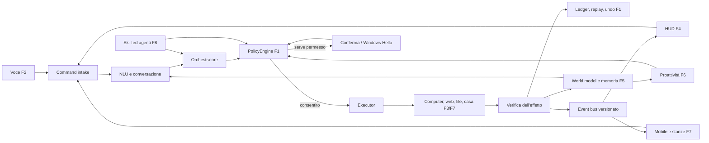
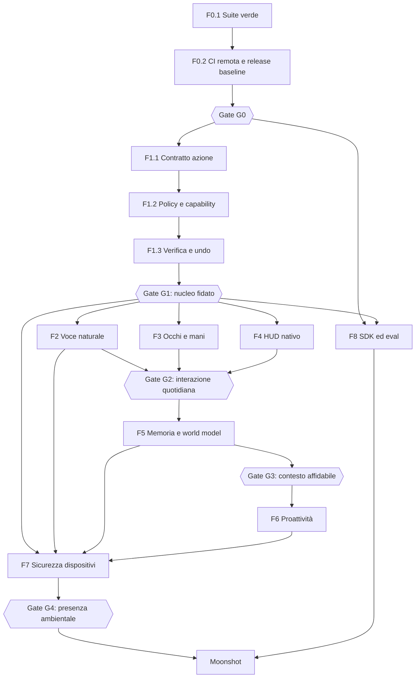

# Jake — roadmap esecutiva verso un vero Jarvis

- Versione del piano: 1.0
- Data di riferimento: 10 settembre 2026
- Fonte dello stato: codice, test, cronologia Git e [audit tecnico storico](ROADMAP.md)
- Regola: questo è il documento operativo; l'audit conserva prove, incidenti e dettagli delle sessioni.

## 1. Obiettivo finale

Jake deve diventare un assistente personale locale per Windows che:

1. ascolta e conversa in modo naturale;
2. comprende schermo, applicazioni, file, progetti, casa e dispositivi;
3. ricorda fatti, relazioni, decisioni e procedure con provenienza verificabile;
4. trasforma obiettivi in azioni concrete;
5. chiede autorizzazione in base al rischio;
6. esegue, osserva l'effetto, corregge gli errori e produce una ricevuta;
7. anticipa bisogni senza interrompere inutilmente;
8. continua la stessa attività tra PC, telefono e stanze;
9. impara capacità nuove dentro una sandbox e senza aumentare i propri privilegi;
10. continua a funzionare localmente quando internet o servizi opzionali non sono disponibili.

Il prodotto non è considerato “Jarvis” perché possiede molte skill. Lo è quando completa in
modo affidabile scenari end-to-end, mantiene il contesto nel tempo e rende ogni azione
importante controllabile dall'utente.

## 2. Regole del piano

### 2.1 Stati

| Stato | Significato |
|---|---|
| `DONE` | Codice, test, documentazione e criterio di uscita completati |
| `VERIFY` | Implementato, ma manca una verifica reale o prolungata |
| `DOING` | Lavoro iniziato e non ancora chiuso |
| `READY` | Dipendenze soddisfatte; può essere iniziato |
| `BLOCKED` | Una dipendenza o decisione impedisce il lavoro |
| `BACKLOG` | Previsto, ma non ancora pronto |
| `MOONSHOT` | Ammesso solo dopo i gate di sicurezza e affidabilità indicati |

### 2.2 Priorità

- `P0`: blocca la base, la sicurezza o qualunque fase successiva.
- `P1`: necessario per il primo Jake usabile ogni giorno.
- `P2`: trasforma un buon assistente in un assistente proattivo e ambientale.
- `P3`: ecosistema, espansioni e moonshot.

### 2.3 Definition of Ready per ogni attività

Un'attività può entrare in sviluppo solo quando:

1. ha un ID stabile (`Fase.Pacchetto.Passo`);
2. dichiara input, output e sistemi toccati;
3. elenca dipendenze e permessi richiesti;
4. definisce almeno un caso di successo, un errore e un caso di sicurezza;
5. possiede un criterio misurabile di completamento;
6. non richiede dati reali dell'utente se può essere testata con fixture temporanee;
7. specifica come degradare quando hardware, modello o rete non sono disponibili.

### 2.4 Definition of Done per ogni attività

Un'attività è `DONE` solo quando:

1. il test che riproduce il bisogno o il bug esiste e fallisce prima della correzione;
2. l'implementazione è minima, tipizzata nei confini critici e osservabile;
3. unit test e integration test relativi passano;
4. la suite completa, ruff, mypy selettivo e compileall passano;
5. gli effetti esterni sono verificati o marcati esplicitamente `unverified`;
6. rischio, permessi, log, privacy e rollback sono aggiornati;
7. README/config/esempi e questa roadmap riflettono lo stato reale;
8. il commit contiene una sola unità logica e può essere annullato senza trascinare lavori diversi;
9. il gate della fase è stato rieseguito, non soltanto il singolo test.

## 3. Stato di partenza verificato

| Area | Stato al 10/09/2026 | Conseguenza |
|---|---|---|
| Repository | Working tree pulito prima di questa roadmap; ramo locale 71 commit avanti al tracking `origin/master` | Le ultime modifiche devono ancora superare la CI remota dopo il push |
| Test Python | 1.254 test; 1 errore in `AppResolver` su una directory `PATH` non accessibile | F0 è nuovamente bloccata |
| Qualità statica | Ruff, mypy selettivo e compileall verdi | Base statica utilizzabile, copertura mypy ancora parziale |
| Smoke test | Avvio CLI, comando e chiusura riusciti | Percorso minimo reale funzionante |
| HUD nativo | CMake/Ninja verde; binario presente | Build sana, comportamento visivo non ancora verificato automaticamente |
| F0 | Quasi completata, riaperta dal nuovo errore | Chiudere F0.1 prima di espandere il prodotto |
| F1 | In corso, con ledger, policy, DPAPI, Hello, kill switch e sandbox iniziale | Completare contratti, verification/undo e capability enforcement |
| F2/F3/F4 | Fondazioni esistenti, nuove fasi non ancora iniziate in modo organico | Possono procedere in parallelo dopo F1-G1 |
| F5/F6 | Prime fette reali implementate | Non ancora abbastanza mature per autonomia ampia |
| F7 | Protocollo e token iniziali | Nessun companion mobile o handoff completo |
| F8 | Skill Forge e plugin loader esistono | Manca un ecosistema firmato, versionato e isolato |

### Blocco corrente esatto

`core/app_resolver.py::_add_path_entries()` crea un iteratore con `Path.iterdir()` dentro un
`try`, ma l'eccezione viene sollevata quando il `for` consuma l'iteratore, fuori dal `try`.
Inoltre `search_paths=[]` viene sostituito dai percorsi predefiniti perché il costruttore usa
`search_paths or defaults`. Il test che dovrebbe essere isolato finisce così per leggere il
vero `PATH` e fallisce su `WindowsApps` con `PermissionError`.

### Verifica della correzione F0.1 — 11/09/2026

- Stato: `DONE`; implementazione, gate locali e matrice CI Python 3.11/3.12 conclusi.
- Causa riprodotta prima del fix: `Path.iterdir()` restituiva un generatore e il
  `PermissionError` emergeva al primo `next()`, fuori dal `try`; il test mirato falliva con la
  stessa eccezione osservata su `WindowsApps`.
- Fix: `search_paths=[]` viene preservato e solo `None` abilita i default; la scansione del
  `PATH` è disattivabile con `include_path=False`; verifica della directory e materializzazione
  di `iterdir()` sono protette da `OSError`; un singolo file non leggibile viene ignorato.
- Fault test deterministici: directory inaccessibile durante l'iterazione, directory rimossa,
  junction non valida, file non leggibile, `PATH` vuoto, scansione `PATH` disabilitata e
  semantica distinta di `search_paths=None`/`[]`.
- Prova locale Python 3.12.6: `tests.test_app_resolver` 29/29; suite completa 1.262/1.262;
  20/20 suite complete consecutive verdi; ruff, mypy selettivo, compileall e smoke test verdi.
- Condizione residua: non segnare `DONE` e non chiudere G0 finché i job CI Windows su Python
  3.11 e 3.12 non sono entrambi verdi sul commit della correzione.
- Chiusura — 11/09/2026: run remoto `34616811238` sul commit `64303ac` (lo stesso che contiene
  questo fix e la riscrittura del test harness Tk) è verde su tutti e tre i job: `Python 3.11
  (Windows)`, `Python 3.12 (Windows)` e `HUD nativo C++/Qt6/QML - build health check`. Il criterio
  di uscita di F0.1 ("20/20 suite verdi su Python 3.12 locale e job 3.11/3.12 verde in CI") è
  quindi soddisfatto; `F0.1` passa a `DONE`.

## 4. Architettura di destinazione e collegamenti

Regola architetturale: il modello può proporre una decisione, ma non può autorizzarla. Il
`PolicyEngine` è l'unico componente che concede l'esecuzione; l'`Executor` è l'unico componente
che produce effetti; il `Verifier` è l'unico componente che li dichiara verificati.

### 4.1 Grafo delle fasi

### 4.2 Contratti condivisi che collegano tutte le fasi

| Contratto | Produttore | Consumatori | Contenuto minimo |
|---|---|---|---|
| `CommandEnvelope` | Voce, HUD, companion | NLU, orchestratore | request id, testo, sorgente, utente, dispositivo, timestamp, privacy mode |
| `ActionProposal` | Agente/planner/skill diretta | PolicyEngine | intent, parametri tipizzati, rischio, scope, precondizioni, effetto atteso |
| `AuthorizationDecision` | PolicyEngine | Executor, HUD | allow/deny/confirm/auth, motivazione, capability, scadenza |
| `ActionReceipt` | Executor/verifier | Ledger, HUD, memoria | action id, risultato, prova, durata, undo token, error taxonomy |
| `HudEvent` | Core | HUD e companion | schema version, sequence id, stato, payload, correlazione |
| `ContextSnapshot` | Context engine | NLU, agente, memoria | finestra/app/progetto/dispositivo, freshness, sensibilità, provenienza |
| `MemoryRecord` | Memory service | Retrieval, proattività | owner, tipo, valore, source, confidence, valid time, TTL, sensitivity |
| `AutomationRun` | Proactivity engine | Policy, executor | trigger, obiettivo, budget, delega, stato, prossimo wake-up |
| `SkillManifest` | SDK/Forge | Loader, policy, UI | versione, schemi, rischio, capability, dipendenze, firma, test |

Questi contratti devono vivere in moduli centrali, essere serializzabili, validati con JSON
Schema e versionati. Nessuna fase deve introdurre una variante privata dello stesso concetto.

## 5. Sequenza globale di consegna

| Onda | Risultato dimostrabile | Fasi attive | Gate finale |
|---|---|---|---|
| Onda 0 — Terra solida | Build, test e release riproducibili | F0 | G0 |
| Onda 1 — Nucleo fidato | Ogni azione ha policy, prova e ricevuta | F1 + fondazioni F8 | G1 |
| Onda 2 — Presenza sul PC | Conversazione fluida, controllo semantico, HUD nativo | F2 + F3 + F4 | G2 |
| Onda 3 — Continuità mentale | Contesto e memoria con provenienza | F5 | G3 |
| Onda 4 — Iniziativa prudente | Suggerimenti e automazioni con budget | F6 | Pilot proattività |
| Onda 5 — Jake ovunque | Companion, stanze, casa e handoff | F7 | G4 |
| Onda 6 — Evoluzione controllata | Skill e agenti aggiornabili senza perdere sicurezza | F8 | Ecosystem gate |
| Onda 7 — Moonshot | AR, robotica, digital twin e modello personale | M | Gate dedicati |

### 5.1 — Registro owner e stato dei pacchetti

Gli owner sono ruoli logici, non persone. Questo registro copre ogni pacchetto e viene aggiornato
ai gate; le note dentro i singoli pacchetti conservano l'evidenza più recente e possono
distinguere sotto-passi già verificati da ciò che manca.

| Pacchetto | Owner logico | Stato |
|---|---|---|
| `F0.1` | Platform Reliability | `DONE` |
| `F0.2` | Release Engineering | `DONE` |
| `F0.3` | Architecture | `VERIFY` |
| `F0.4` | Quality Engineering | `BLOCKED` |
| `F0.5` | Performance Engineering | `BLOCKED` |
| `F0.6` | Release Engineering | `DOING` |
| `F1.1` | Trust Core | `DOING` |
| `F1.2` | Security Architecture | `DOING` |
| `F1.3` | Execution Reliability | `DOING` |
| `F1.4` | Identity and Secrets | `DOING` |
| `F1.5` | Application Security | `DOING` |
| `F1.6` | Sandbox Runtime | `DOING` |
| `F1.7` | Observability | `DOING` |
| `F1.8` | Runtime Reliability | `DOING` |
| `F2.1` | Voice Quality | `BLOCKED` |
| `F2.2` | Speech Runtime | `BLOCKED` |
| `F2.3` | Voice Quality | `BLOCKED` |
| `F2.4` | Audio Systems | `BLOCKED` |
| `F2.5` | Speech Runtime | `BLOCKED` |
| `F2.6` | Conversation Runtime | `BLOCKED` |
| `F2.7` | Identity and Voice | `BLOCKED` |
| `F3.1` | Computer Use Quality | `BLOCKED` |
| `F3.2` | Windows Automation | `BLOCKED` |
| `F3.3` | Windows Automation | `BLOCKED` |
| `F3.4` | Execution Runtime | `BLOCKED` |
| `F3.5` | Computer Use Reliability | `BLOCKED` |
| `F3.6` | Browser Automation | `BLOCKED` |
| `F3.7` | Application Adapters | `BLOCKED` |
| `F3.8` | Demonstration Learning | `BLOCKED` |
| `F4.1` | Protocol Architecture | `VERIFY` |
| `F4.2` | Native HUD | `VERIFY` |
| `F4.3` | Native HUD | `BLOCKED` |
| `F4.4` | Interaction Design | `BLOCKED` |
| `F4.5` | Interaction Design | `BLOCKED` |
| `F4.6` | Trust UX | `BLOCKED` |
| `F4.7` | Accessibility | `BLOCKED` |
| `F4.8` | Release Engineering | `BLOCKED` |
| `F5.1` | Memory Platform | `DOING` |
| `F5.2` | Memory Platform | `DOING` |
| `F5.3` | Knowledge Model | `DOING` |
| `F5.4` | Memory Reliability | `DOING` |
| `F5.5` | Retrieval Quality | `DOING` |
| `F5.6` | Context Runtime | `DOING` |
| `F5.7` | Privacy Engineering | `BACKLOG` |
| `F6.1` | Proactivity Platform | `DOING` |
| `F6.2` | Proactivity Quality | `DOING` |
| `F6.3` | Notification UX | `BACKLOG` |
| `F6.4` | Goal Runtime | `DOING` |
| `F6.5` | Automation Runtime | `DOING` |
| `F6.6` | Meeting Experience | `BACKLOG` |
| `F6.7` | Runtime Reliability | `DOING` |
| `F7.1` | Companion Security | `DOING` |
| `F7.2` | Mobile Companion | `BACKLOG` |
| `F7.3` | Voice Devices | `BACKLOG` |
| `F7.4` | Presence Runtime | `DOING` |
| `F7.5` | Home Integration | `DOING` |
| `F7.6` | Sync and Crypto | `BACKLOG` |
| `F7.7` | Edge Devices | `BACKLOG` |
| `F8.1` | Skill Platform | `DOING` |
| `F8.2` | Supply-chain Security | `BACKLOG` |
| `F8.3` | Skill Forge | `DOING` |
| `F8.4` | Model Runtime | `BACKLOG` |
| `F8.5` | Agent Runtime | `DOING` |
| `F8.6` | Release Safety | `BACKLOG` |

## 6. F0 — Baseline verde e release riproducibile

- Stato: `DOING`
- Priorità: `P0`
- Dipendenze: nessuna
- Output: un commit e una build sono giudicabili senza conoscere la macchina dello sviluppatore.

### F0.1 — Eliminare il blocco AppResolver

Dipende da: nessuno.

1. `F0.1.1` Aggiungere un test in cui una directory del `PATH` solleva `PermissionError` durante
   l'iterazione, non durante la creazione dell'iteratore.
2. `F0.1.2` Correggere il costruttore: usare i default soltanto quando `search_paths is None`,
   preservando intenzionalmente `[]`.
3. `F0.1.3` Portare il consumo di `path.iterdir()` dentro il blocco `try/except OSError` oppure
   materializzare l'elenco dentro il `try`.
4. `F0.1.4` Decidere esplicitamente se la scansione del `PATH` è configurabile; non usarla nei
   test di alias/fuzzy matching.
5. `F0.1.5` Aggiungere test per directory rimossa durante la scansione, junction non valida,
   file non leggibile e `PATH` vuoto.
6. `F0.1.6` Eseguire il file di test isolato, poi la suite completa.
7. `F0.1.7` Eseguire la suite completa 20 volte; nessuna eccezione I/O ambientale è ammessa.
8. `F0.1.8` Aggiornare l'audit con causa, fix e prova, senza segnare F0 completa prima del gate.

Criterio di uscita: 20/20 suite verdi su Python 3.12 locale e job 3.11/3.12 verde in CI.

### F0.2 — Allineare repository locale e CI

Dipende da: F0.1.

- Stato: `DONE`; `F0.2.1`–`F0.2.7` tutti conclusi con evidenza remota.
- Verifica locale 11/09/2026: il commit F0.1 e' atomico e la storia condivisa non e' stata
  riscritta; `git ls-files` non contiene log, database, token, registrazioni, modelli, binari o
  build artifact; il lock con hash si installa; ruff, mypy, compileall, 1.262 test, smoke CLI,
  configure/build HUD e smoke del binario HUD sono verdi su Python 3.12.6.
- Diagnostica CI: il job Python conserva `unittest.log` e `summary.txt` con commit, versione
  Python, durata ed exit code tramite `actions/upload-artifact@v4` e `if: always()`; verificati
  localmente sia il log della suite sia la propagazione di un exit code di fallimento.
- Verifica remota 11/09/2026, run `34614112195`: installazione, ruff, mypy, compileall e suite
  Python sono verdi sia su 3.11 sia su 3.12; build e smoke HUD sono verdi. I due job Python sono
  risultati rossi soltanto perche' `upload-artifact@v4` esclude per default la directory nascosta
  `.ci-artifacts/`, saltando di conseguenza lo smoke CLI. La correzione locale imposta
  `include-hidden-files: true`, sposta l'upload dopo lo smoke affinche' un errore del servizio
  artifact non lo salti, ed e' protetta da `tests/test_ci_workflow.py`; baseline successiva:
  1.946/1.946 test, ruff, mypy su 75 file e compileall verdi. Lo smoke CLI completa
  avvio-risposta-chiusura in 12,9 secondi con exit code 0; lo smoke HUD resta attivo oltre tre
  secondi con ogni percorso Qt rimosso dal `PATH`.
- Verifica remota 11/09/2026, run `34615971747` su `31409cf`: Python 3.12 e HUD sono interamente
  verdi; l'upload della diagnostica passa su entrambi i job Python, chiudendo `F0.2.7`. Python
  3.11 termina invece con exit code nativo `0x80000003` durante
  `tests.test_status_panel.RunForeverTests`, con `Tcl_AsyncDelete: async handler deleted by the
  wrong thread`. Il test harness creava un nuovo interprete `Tk` per ogni test; la correzione
  locale usa un solo `Tk` di modulo e una `Toplevel` isolata per caso, mantenendo widget e
  `mainloop` reali. Il modulo passa 20/20 esecuzioni consecutive e la suite completa locale passa
  1.947/1.947 su Python 3.12.
- Sync 11/09/2026: la correzione Python 3.11 è stata pubblicata nel commit `64303ac`; il run
  remoto `34616811238` è verde su tutti e tre i job (`Python 3.11 (Windows)`,
  `Python 3.12 (Windows)`, `HUD nativo C++/Qt6/QML - build health check`), chiudendo `F0.2.5`.
- `F0.2.6` — Protezione di `master`, 11/09/2026: con autorizzazione esplicita dell'utente è stata
  configurata la branch protection su `master` (`required_status_checks.strict=true` sui tre
  contesti sopra elencati, `enforce_admins=true`, force-push e delete vietati). Poiché i required
  status checks bloccano anche i push diretti privi di un check già verde su quello SHA, da questo
  momento anche l'owner lavora via branch → PR → CI verde → merge; nessun push diretto a `master`
  è più possibile, nemmeno per l'admin.
- Verifica empirica del rifiuto — 11/09/2026: creato un branch usabile-e-getta
  (`test/branch-protection-verify`) con un test che fallisce deliberatamente
  (`tests/test_zz_branch_protection_probe.py`), aperta la PR #1 verso `master` (run remoto
  `34651548002`). Esito: `HUD nativo C++/Qt6/QML - build health check` verde, `Python 3.11
  (Windows)` e `Python 3.12 (Windows)` rossi come atteso; l'API GitHub ha riportato la PR con
  `mergeable: MERGEABLE` (nessun conflitto) ma `mergeStateStatus: BLOCKED`, cioè il merge è
  impedito esclusivamente dai required status checks falliti. Un tentativo diretto di
  `gh pr merge` è stato bloccato a monte dal sandbox dell'agente prima ancora di raggiungere
  GitHub, coerente con l'aspettativa che l'azione non sarebbe comunque riuscita. La PR è stata
  chiusa senza merge e sia il branch remoto sia quello locale sono stati cancellati subito dopo.
  Questo chiude la condizione residua di `F0.2.6` e, con essa, `KL-001`. `F0.2` passa a `DONE`.

1. `F0.2.1` Raggruppare i commit locali in una sequenza comprensibile senza riscrivere storia
   già condivisa.
2. `F0.2.2` Verificare che nessun log, database, token, registrazione, modello o build artifact
   sia tracciato.
3. `F0.2.3` Eseguire localmente gli stessi comandi della CI, nello stesso ordine.
4. `F0.2.4` Pubblicare i commit e osservare entrambi i job Windows.
5. `F0.2.5` Correggere divergenze tra ambiente locale e runner, senza disattivare test.
6. `F0.2.6` Proteggere `master`: CI richiesta, niente merge con job rossi.
7. `F0.2.7` Aggiungere artifact di test e log sintetico per diagnosticare fallimenti remoti.

Criterio di uscita: HEAD locale coincide con un commit remoto i cui job Python e HUD sono verdi.

### F0.3 — Fonte unica di verità

Dipende da: F0.1.

- Stato: `DOING`; `F0.3.1`, `F0.3.3`, `F0.3.4`, `F0.3.5` e `F0.3.6` conclusi localmente; `F0.3.2`
  resta una regola di processo permanente (non un passo da chiudere una volta sola) e attende
  comunque il gate G0 prima di essere dichiarata rispettata su una release vera.
- Fonte canonica: `config/release.json` contiene versione prodotto e protocollo. Python, CLI,
  risposta identitaria, endpoint `/status`, eventi HUD e CMake/HUD nativo la consumano; il
  changelog e' verificato da contract test contro la stessa versione.
- Prova 11/09/2026: 23 contract test mirati e 1.269 test completi verdi; ruff, mypy selettivo e
  compileall verdi; CMake ha configurato dal manifest e la build C++ e' passata dentro
  l'ambiente MSVC. `CHANGELOG.md` usa Added/Changed/Fixed/Security.
- Prova F0.3.5/F0.3.6 — 11/09/2026: 5 ADR creati in `docs/adr/` (UIA, sandbox plugin, trasporto
  companion, cifratura, storage memoria) con indice `docs/adr/README.md`; ognuno dichiara stato,
  data, contesto, decisione, alternative, conseguenze, piano di migrazione e criterio di
  revisione. Il registro owner/stato per ogni pacchetto vive in `### 5.1` di questo stesso file.
  Verificato con due nuove suite dedicate, non solo a occhio: `tests/test_architecture_decisions.py`
  (ogni ADR atteso esiste, e' indicizzato e contiene tutte le sezioni richieste) e
  `tests/test_roadmap_structure.py` (ogni intestazione `### F*.*` del piano ha esattamente una
  riga nel registro, con owner non vuoto e stato tra quelli ammessi) - un pacchetto aggiunto in
  futuro senza owner/stato o un ADR incompleto fa fallire la suite invece di passare inosservato.
  Suite completa rieseguita dopo l'aggiunta: 1.272/1.272 verdi; ruff pulito.

1. `F0.3.1` Rendere questo file il piano attivo e `ROADMAP.md` lo storico/audit.
2. `F0.3.2` Aggiornare la tabella “stato corrente” a ogni gate, non a ogni micro-commit.
3. `F0.3.3` Collegare versione, protocol version e release notes senza duplicare numeri hardcoded.
4. `F0.3.4` Creare `CHANGELOG.md` con Added/Changed/Fixed/Security.
5. `F0.3.5` Creare ADR per decisioni irreversibili: UIA, sandbox, trasporto, cifratura, memoria.
6. `F0.3.6` Inserire owner logico e stato per ogni pacchetto, anche se il progetto ha un solo autore.

Criterio di uscita: README, `--version`, `/status`, roadmap e release riportano la stessa versione.

### F0.4 — Matrice di test completa

Dipende da: F0.1.

1. `F0.4.1` Classificare i test in unit, contract, integration, end-to-end, hardware e security.
2. `F0.4.2` Etichettare quelli che toccano rete locale, GUI, audio, Ollama o hardware.
3. `F0.4.3` Separare suite veloce per commit e suite estesa/notturna.
4. `F0.4.4` Aggiungere contract test Python↔C++ per tutti gli eventi HUD.
5. `F0.4.5` Aggiungere test di fault injection: timeout, processo terminato, DB bloccato, disco
   pieno, rete assente, JSON malformato, modello indisponibile.
6. `F0.4.6` Aggiungere mutation test selettivo a policy, risk, auth e filesystem safety.
7. `F0.4.7` Pubblicare una test matrix con comando, costo, requisito e criterio di successo.

Criterio di uscita: ogni confine esterno ha almeno un test di successo, timeout e fallimento.

### F0.5 — Benchmark e budget prestazionali

Dipende da: F0.1.

1. `F0.5.1` Congelare dataset NLU con train/test separati; evitare leave-one-out sulla sola
   corsia esatta come metrica principale.
2. `F0.5.2` Creare corpus audio consensuale per wake word/STT: silenzio, TV, musica, distanza,
   accenti e microfoni differenti.
3. `F0.5.3` Creare 100 task computer-use ripetibili su app fixture.
4. `F0.5.4` Misurare cold start, warm start, p50/p95, RAM, VRAM, CPU e consumo batteria.
5. `F0.5.5` Salvare hardware, modelli, versioni e seed in ogni report.
6. `F0.5.6` Definire soglie che bloccano la CI solo dopo tre baseline stabili.
7. `F0.5.7` Mostrare trend nella dashboard locale, senza telemetria remota obbligatoria.

Criterio di uscita: ogni fase F2–F7 ha una baseline misurata prima di iniziare ottimizzazioni.

### F0.6 — Packaging e recupero

Dipende da: F0.2 e F0.3.

- Stato: `DOING` sulle fondamenta HUD; resto `BLOCKED` dalle dipendenze e dalla scelta
  dell'installer.
- Verifica 11/09/2026: CMake individua il `windeployqt` della stessa installazione usata per
  compilare ed esegue il deployment `POST_BUILD` di DLL, plugin e moduli QML. Una clean build
  ha prodotto il runtime completo e `JakeHud.exe` e' rimasto attivo oltre tre secondi con ogni
  percorso `C:\Qt` rimosso dal `PATH`, riproducendo e chiudendo l'errore "Qt6*.dll non trovata".

1. `F0.6.1` Definire installer per core Python, HUD, modelli e componenti opzionali.
2. `F0.6.2` Aggiungere preflight hardware/software e spazio disco.
3. `F0.6.3` Rendere installazione, upgrade, repair e uninstall idempotenti.
4. `F0.6.4` Preservare dati personali durante update/uninstall salvo consenso esplicito.
5. `F0.6.5` Firmare binari e pacchetti; verificare la firma prima dell'aggiornamento.
6. `F0.6.6` Usare aggiornamenti atomici con health check e rollback automatico.
7. `F0.6.7` Offrire canali stable/beta/dev e portable mode.

Criterio di uscita: installazione, update fallito e rollback passano su una VM Windows pulita.

### Gate G0 — Terra solida

G0 è superato soltanto se:

- suite completa 20 volte verde;
- CI remota verde su 3.11/3.12 e HUD;
- smoke test e build riproducibile;
- nessun segreto/artifact tracciato;
- versione e documentazione coerenti;
- issue note per ogni limite noto ancora accettato.

**Gate G0 superato — 11/09/2026.** Evidenza per ciascun criterio, raccolta sul commit `dedc2ce`
(merge di F0.1/F0.2/F0.2.6 su `master`):

- Suite completa 20 volte verde: 20/20 esecuzioni locali di `python -m unittest discover -s
  tests -q` su Python 3.12.6, ciascuna 1.947/1.947 test verdi (~35 s a run), nessuna eccezione
  I/O ambientale.
- CI remota verde su 3.11/3.12 e HUD: run `34653572407` sul commit `dedc2ce` verde su tutti e tre
  i job (`Python 3.11 (Windows)`, `Python 3.12 (Windows)`, `HUD nativo C++/Qt6/QML - build health
  check`).
- Smoke test e build riproducibile: smoke CLI e smoke HUD verdi in CI (vedi F0.2); build HUD
  riproducibile via CMake/windeployqt (vedi F0.6).
- Nessun segreto/artifact tracciato: verificato in F0.2.2 (`git ls-files` senza log, database,
  token, registrazioni, modelli o build artifact).
- Versione e documentazione coerenti: `config/release.json` come fonte unica (F0.3), verificato
  da contract test (`tests/test_roadmap_structure.py`, `tests/test_architecture_decisions.py`,
  `tests/test_ci_workflow.py`), tutti verdi.
- Issue note per ogni limite noto ancora accettato: `docs/known-limitations.md` contiene un solo
  limite registrato (`KL-001`) ed è risolto; nessun limite aperto residuo.
- Nota: `F0.4` (matrice di test completa), `F0.5` (benchmark prestazionali) e `F0.6` (packaging,
  oltre alle fondamenta HUD già verificate) restano `BACKLOG`/`DOING` come lavoro di qualità
  continuativo su F0, ma nessuno dei sei criteri espliciti del gate li richiede: non bloccano G0.
  Restano nel registro `### 5.1` con il loro stato reale e proseguono in parallelo a F1.

## 7. F1 — Trustworthy Agent Core

- Stato: `DOING`
- Priorità: `P0`
- Dipendenze: G0
- Output: nessuna azione può saltare policy, verifica, audit o limiti di autonomia.

### F1.1 — Action Contract 2.0

Dipende da: G0.

1. `F1.1.1` Inventariare tutti i percorsi: comando diretto, agente, planner legacy, workflow,
   trigger, fallback, plugin e companion.
2. `F1.1.2` Definire dataclass/schema per `ActionProposal`, `ActionContext`, `ActionReceipt`,
   `VerificationEvidence`, `UndoDescriptor` ed `ActionError`.
3. `F1.1.3` Rendere obbligatori action id, trace id, source, actor, intent, parametri validati,
   rischio, effect class e idempotency key.
4. `F1.1.4` Definire tassonomia errori: invalid input, denied, unavailable, transient, timeout,
   partial effect, verification failed, conflict, user cancelled.
5. `F1.1.5` Versionare lo schema e aggiungere migrazione/compatibilità per record precedenti.
6. `F1.1.6` Adattare prima un intent read-only, uno reversibile, uno external, uno destructive e
   uno admin.
7. `F1.1.7` Migrare tutti gli intent per dominio, impedendo payload ad-hoc nuovi.
8. `F1.1.8` Aggiungere contract test che fallisce se una skill restituisce dati non conformi.

Criterio di uscita: il 100% dei percorsi produce lo stesso `ActionReceipt` validato.

- Stato: `DOING`; `F1.1.3` (parzialmente) e `F1.1.8` conclusi con evidenza; `F1.1.1`, `F1.1.2`,
  `F1.1.4`, `F1.1.5`, `F1.1.6`, `F1.1.7` restano aperti.
- Ricognizione 11/09/2026: `ActionProposal`, `ActionContext`, `VerificationEvidence`,
  `UndoDescriptor` ed `ActionError` non esistono ancora come classi (solo prosa nella roadmap);
  esiste solo `ActionReceipt` (`core/action_ledger.py`) e `PolicyEngine`
  (`core/policy_engine.py`). Le skill restituiscono `SkillResult` (piu' sottile del contratto
  target); la ricevuta viene sintetizzata solo in 4 punti di orchestrazione
  (`JakeCore._log_action_outcome`/`_log_denied_action`, `TaskAgent._log_step`,
  `PlanExecutor._log_step`), non dalle singole skill. `core/skill_registry.py::execute()` e'
  un dispatcher senza alcun controllo di policy; i due percorsi normali passano comunque da
  `PolicyEngine` prima di chiamarlo, ma `core/execution_safety.py` invoca `registry.execute()`
  direttamente nel rollback, bypassando la policy (buco noto, non ancora richiuso).
- `F1.1.3`/`F1.1.8` — 11/09/2026: `idempotency_key` era `Optional[str] = None` pur essendo
  sempre calcolata nei 4 punti reali - resa `str` obbligatoria (non piu' opzionale) in
  `ActionReceipt`; aggiunto `schema_version` (default `ACTION_RECEIPT_SCHEMA_VERSION = 1`, F1.1.5
  resta comunque aperto: nessuna migrazione multi-versione esiste ancora, solo la versione
  corrente e' accettata). Aggiunta `validate_action_receipt()` che rifiuta campi obbligatori
  vuoti, timestamp non positivo o `schema_version` non supportata. Nuovo
  `tests/test_action_contract.py` esercita direttamente tutti e 4 i punti che oggi costruiscono
  una ricevuta e verifica che ognuno produca un `ActionReceipt` conforme; `tests/
  test_action_ledger.py` aggiornato per la nuova obbligatorietà. Prova: 1.955/1.955 test (36/36
  su `test_action_ledger`+`test_action_contract`), ruff e mypy puliti su
  `core/action_ledger.py`, compileall verde.
- Non ancora affrontato: `effect_class`/"parametri validati"/"actor" distinto da "source" come
  campi propri (`requested_by` li conflette in una sola stringa); tassonomia errori (`F1.1.4`);
  migrazione reale delle skill sul contratto (`F1.1.6`/`F1.1.7`); chiusura del bypass di policy
  nel rollback (`core/execution_safety.py`).

### F1.2 — Policy kernel e capability

Dipende da: F1.1.

1. `F1.2.1` Rendere `PolicyEngine` l'unico gate, rimuovendo decisioni duplicate dagli executor.
2. `F1.2.2` Definire capability per filesystem root, app, contatto, dominio web, device, servizio
   Home Assistant, rete e durata.
3. `F1.2.3` Intersecare permessi di utente, dispositivo, agente, skill e sessione; vince il più restrittivo.
4. `F1.2.4` Negare per default parametri o intent sconosciuti.
5. `F1.2.5` Applicare policy anche a retry, rollback, fallback e sotto-azioni generate da workflow.
6. `F1.2.6` Salvare la motivazione della decisione nel ledger senza salvare segreti.
7. `F1.2.7` Aggiungere policy simulator: mostra se e perché un'azione sarebbe permessa.
8. `F1.2.8` Costruire test di bypass per ogni percorso inventariato in F1.1.1.

Criterio di uscita: nessun executor è raggiungibile senza una decisione emessa dal PolicyEngine.

### F1.3 — Verifica degli effetti e undo

Dipende da: F1.1 e F1.2.

1. `F1.3.1` Creare registry `intent → verifier → compensation`.
2. `F1.3.2` Definire prove forti per file/processi/finestre/browser/casa e prove deboli per pixel diff.
3. `F1.3.3` Marcare sempre `verified`, `unverified` o `verification_failed`; mai inferire successo
   dall'assenza di eccezioni.
4. `F1.3.4` Salvare snapshot minimo prima dell'azione, rispettando privacy e dimensione.
5. `F1.3.5` Generare undo token con scadenza e precondizioni.
6. `F1.3.6` Impedire retry automatico per azioni non idempotenti senza chiave deduplica.
7. `F1.3.7` Gestire effetti parziali e rollback parziale con spiegazione leggibile.
8. `F1.3.8` Esporre undo e prove a HUD/companion tramite eventi versionati.

Criterio di uscita: tutte le azioni external/destructive/admin hanno prova; l'80% delle azioni
reversibili dispone di undo testato.

### F1.4 — Identità, autenticazione e segreti

Dipende da: F1.2.

1. `F1.4.1` Consolidare DPAPI in un `SecretsVault` con versione e migrazione atomica.
2. `F1.4.2` Distinguere identità Windows, profilo Jake, dispositivo e speaker profile.
3. `F1.4.3` Usare Windows Hello per admin/high-impact; mantenere fallback esplicito e auditato.
4. `F1.4.4` Aggiungere passkey/WebAuthn solo dietro adapter, senza sostituire Hello prematuramente.
5. `F1.4.5` Implementare pairing challenge/QR con chiavi per dispositivo e revoca.
6. `F1.4.6` Ruotare token e invalidare immediatamente quelli revocati.
7. `F1.4.7` Non usare speaker verification come unico fattore.
8. `F1.4.8` Testare migrazione da config in chiaro, vault corrotto, profilo Windows differente e backup.

Criterio di uscita: nessun segreto in chiaro e ogni azione admin richiede un fattore non vocale.

### F1.5 — Prompt injection e dati non fidati

Dipende da: F1.1 e F1.2.

1. `F1.5.1` Etichettare ogni input come instruction, user data, external content o tool result.
2. `F1.5.2` Propagare il taint attraverso clipboard, OCR, file, web, email e risultati di ricerca.
3. `F1.5.3` Impedire che external content crei direttamente `ActionProposal` privilegiati.
4. `F1.5.4` Mostrare all'utente la sorgente che ha suggerito un'azione sensibile.
5. `F1.5.5` Redigere segreti prima di inviare contenuti a modelli opzionali cloud.
6. `F1.5.6` Costruire un corpus d'attacco multilingue e multimodale.
7. `F1.5.7` Testare injection indiretta dentro PDF, commenti codice, testo su immagini e nomi file.
8. `F1.5.8` Bloccare escalation ottenuta concatenando più azioni innocue.

Criterio di uscita: zero bypass nel corpus security e provenienza mostrata per ogni proposta esterna.

### F1.6 — Sandbox permanente per skill

Dipende da: F1.2 e F1.4.

1. `F1.6.1` Separare sandbox di validazione dalla sandbox di esecuzione quotidiana.
2. `F1.6.2` Usare processo dedicato, token ristretto e Low Integrity come base.
3. `F1.6.3` Aggiungere Job Object per CPU, RAM, process tree e timeout.
4. `F1.6.4` Valutare AppContainer per filesystem/rete più stretti; documentare compatibilità.
5. `F1.6.5` Montare soltanto directory dichiarate nel manifest.
6. `F1.6.6` Negare rete salvo capability con domini/porte specifici.
7. `F1.6.7` Serializzare input/output; nessun oggetto core condiviso col plugin.
8. `F1.6.8` Terminare e mettere in quarantena plugin che viola limiti o protocollo.

Criterio di uscita: un plugin ostile non legge file, rete o processi non dichiarati nei test d'attacco.

### F1.7 — Ledger, replay e osservabilità

Dipende da: F1.1 e F1.3.

1. `F1.7.1` Rendere ledger append-only resistente a record parziali e arresto improvviso.
2. `F1.7.2` Collegare command, sub-step, verifica, undo e notifica con lo stesso trace id.
3. `F1.7.3` Definire retention diversa per log operativo, audit di sicurezza e memoria.
4. `F1.7.4` Aggiungere redazione strutturata per tipo di dato, non solo lunghezza stringa.
5. `F1.7.5` Rendere replay sicuro: dry-run predefinito, scope temporaneo e conferma per effetti.
6. `F1.7.6` Mostrare p50/p95, failure taxonomy, verification rate e rollback rate.
7. `F1.7.7` Esportare un bundle diagnostico redatto e ispezionabile prima della condivisione.
8. `F1.7.8` Testare modalità privata end-to-end su tutti i nuovi record.

Criterio di uscita: una failure end-to-end è ricostruibile senza esporre contenuti privati.

### F1.8 — Concorrenza, code e arresto

Dipende da: F1.1.

1. `F1.8.1` Definire ownership della sessione e una coda per azioni concorrenti.
2. `F1.8.2` Serializzare azioni che toccano lo stesso resource key; consentire letture parallele sicure.
3. `F1.8.3` Propagare cancellazione dal kill switch a modello, skill, subprocess e automazione.
4. `F1.8.4` Gestire shutdown con drain limitato, checkpoint e release dei device.
5. `F1.8.5` Aggiungere deadlock timeout e diagnosi.
6. `F1.8.6` Impedire che un client lento blocchi event bus o altri client.
7. `F1.8.7` Testare race su reminder, trigger, handoff, conferma e undo.

Criterio di uscita: fault test concorrenti non producono doppie azioni, deadlock o ledger incoerente.

### Gate G1 — Nucleo fidato

G1 è superato soltanto se:

- ogni percorso usa Action Contract 2.0 e PolicyEngine;
- tutte le azioni ad alto impatto hanno prova e audit;
- capability applicate ad agenti, skill e device;
- prompt-injection suite verde;
- plugin ostile contenuto dalla sandbox;
- kill switch interrompe attività e figli entro il budget definito;
- modalità privata non lascia contenuti nei nuovi store.

## 8. F2 — Voice Natural 3.0

- Stato: `BLOCKED` fino a G1, progettazione `READY`
- Priorità: `P1`
- Output: conversazione vocale full-duplex, rapida, correggibile e misurata.

### F2.1 — Harness audio e dataset

Dipende da: G0.

1. `F2.1.1` Definire fixture audio sintetiche e registrazioni consensuali separate dal
   repository pubblico.
2. `F2.1.2` Annotare wake word, parlato, rumore, speaker, distanza, dispositivo e ground truth.
3. `F2.1.3` Creare runner offline ripetibile per VAD, STT, wake word e barge-in.
4. `F2.1.4` Salvare soltanto metriche e hash del corpus; mai audio personale per default.
5. `F2.1.5` Stabilire baseline separate per CPU e GPU prima delle ottimizzazioni.
6. `F2.1.6` Documentare licenza, consenso, retention e procedura di cancellazione del corpus.

Criterio di uscita: report ripetibile con WER, false accept/reject, latenza e hardware.

### F2.2 — Streaming STT

Dipende da: F2.1 e G1.

1. `F2.2.1` Separare acquisizione audio, segmentazione e trascrizione.
2. `F2.2.2` Produrre partial transcript con revisioni, final transcript e confidence.
3. `F2.2.3` Non inviare partial instabili al router come comandi definitivi.
4. `F2.2.4` Supportare backpressure e perdita controllata di frame vecchi.
5. `F2.2.5` Conservare il buffer soltanto in RAM e cancellarlo dopo la finalizzazione.
6. `F2.2.6` Degradare a utterance completa se streaming non è disponibile.
7. `F2.2.7` Pubblicare eventi transcript versionati per HUD e companion.

Criterio di uscita: partial p95 < 1 s sul profilo consigliato; testo finale non duplicato.

### F2.3 — Wake word e VAD adattivi

Dipende da: F2.1 e F2.2.

1. `F2.3.1` Rendere wake word e sensibilità configurabili per dispositivo.
2. `F2.3.2` Calibrare rumore ambientale senza registrare l'ambiente.
3. `F2.3.3` Separare gli stati wake, follow-up, dictation e sleep.
4. `F2.3.4` Aggiungere cooldown e anti-replay per audio proveniente dagli altoparlanti.
5. `F2.3.5` Mostrare sempre indicatore di ascolto su ogni superficie attiva.
6. `F2.3.6` Conservare push-to-talk come fallback deterministico.
7. `F2.3.7` Gestire hotword concorrente tra PC e satelliti con device election F7.

Criterio di uscita: falso wake ≤ 1/24 ore di benchmark e miss rate entro la soglia del corpus.

### F2.4 — AEC, noise suppression e barge-in

Dipende da: F2.2 e F2.3.

1. `F2.4.1` Acquisire reference audio del TTS per acoustic echo cancellation.
2. `F2.4.2` Integrare noise suppression e AGC con bypass configurabile.
3. `F2.4.3` Rilevare voce utente mentre Jake parla.
4. `F2.4.4` Fermare TTS, preservare transcript e aprire un nuovo turno correlato.
5. `F2.4.5` Distinguere stop, correzione e nuova richiesta.
6. `F2.4.6` Testare cuffie, speaker laptop, Bluetooth e TV in sottofondo.
7. `F2.4.7` Misurare tempo stop e falsi barge-in per dispositivo.

Criterio di uscita: 95% delle interruzioni del corpus ferma il TTS senza falso comando dall'eco.

### F2.5 — TTS streaming e personalità vocale

Dipende da: F2.2.

1. `F2.5.1` Spezzare risposte per unità prosodiche senza leggere Markdown o codice in modo errato.
2. `F2.5.2` Iniziare il parlato prima della fine completa della risposta.
3. `F2.5.3` Rendere interrompibile ogni chunk e cancellare quelli accodati dopo barge-in.
4. `F2.5.4` Implementare modalità breve, dettagliata, sussurro e notte.
5. `F2.5.5` Usare voce offline durante guasti rete senza cambiare contenuto.
6. `F2.5.6` Richiedere consenso esplicito per qualunque voice cloning.
7. `F2.5.7` Adattare volume/prosodia al dispositivo senza inferire emozioni sensibili.

Criterio di uscita: prima emissione percepita < 2 s per risposta semplice e stop entro 300 ms.

### F2.6 — Dialogo naturale e correzione live

Dipende da: F2.2 e F1.1.

1. `F2.6.1` Risolvere ellissi, riferimenti multipli e cambi di intenzione.
2. `F2.6.2` Esporre “cosa ho sentito” e modifica del transcript nell'HUD.
3. `F2.6.3` Applicare correzioni senza rieseguire automaticamente azioni già concluse.
4. `F2.6.4` Separare conferma, autenticazione, risposta a chiarimento e nuovo comando.
5. `F2.6.5` Gestire code-switching italiano/inglese, nomi propri e acronimi.
6. `F2.6.6` Usare confidence per chiedere conferma soltanto quando l'impatto lo richiede.
7. `F2.6.7` Salvare correzioni come esempi soltanto dopo esito verificato.

Criterio di uscita: < 5% dei turni del benchmark richiede “no, intendevo”.

### F2.7 — Multiutente prudente

Dipende da: F1.4 e F2.1.

1. `F2.7.1` Aggiungere speaker profile opt-in e cancellabile.
2. `F2.7.2` Usarlo come indizio per selezionare profilo, mai come unico lucchetto.
3. `F2.7.3` Chiedere disambiguazione quando confidence o contesto sono insufficienti.
4. `F2.7.4` Separare cronologia, memoria, permessi e preferenze.
5. `F2.7.5` Implementare modalità ospite senza memoria persistente.
6. `F2.7.6` Testare voce registrata, speaker simile e rumore.

Criterio di uscita: nessuna contaminazione di memoria o permesso tra profili nei test.

### Gate F2

- benchmark audio pubblicato localmente;
- full-duplex e barge-in stabili su almeno tre profili hardware;
- buffer audio volatile verificato;
- fallback push-to-talk/offline funzionante;
- accessibilità via sottotitoli e testo equivalente.

## 9. F3 — Computer Use Engine 3.0

- Stato: `BLOCKED` fino a G1, spike tecnico `READY`
- Priorità: `P1`
- Output: Jake controlla Windows per semantica, verifica il risultato e usa i pixel come fallback.

### F3.1 — Benchmark controllabile

Dipende da: G0.

1. `F3.1.1` Creare una app fixture Windows con button, input, list, dialog, tree, tabs e scrolling.
2. `F3.1.2` Definire 10 task iniziali e arrivare progressivamente a 100.
3. `F3.1.3` Resettare lo stato della fixture prima di ogni task.
4. `F3.1.4` Registrare strategia scelta, azioni, latenza, retry e prova finale.
5. `F3.1.5` Aggiungere task con DPI, più monitor, finestre sovrapposte e temi diversi.
6. `F3.1.6` Includere controlli ambigui, disabilitati e dinamici.

Criterio di uscita: benchmark deterministico eseguibile senza toccare dati o app personali.

### F3.2 — Windows UI Automation adapter

Dipende da: F3.1.

1. `F3.2.1` Creare `UIAutomationAdapter` dietro interfaccia, senza legarlo alle skill.
2. `F3.2.2` Leggere control/content tree con proprietà richieste in cache.
3. `F3.2.3` Esporre role, name, automation id, bounds, enabled, selected, focused e patterns.
4. `F3.2.4` Aggiungere subscription agli eventi UIA per invalidare cache.
5. `F3.2.5` Gestire process boundary, finestre elevate e provider mancanti.
6. `F3.2.6` Limitare scope alla finestra target per prestazioni e privacy.
7. `F3.2.7` Valutare COM diretto vs helper C++ con benchmark, mantenendo l'adapter stabile.

Criterio di uscita: dump semantico stabile della fixture e di cinque app reali supportate.

### F3.3 — Selector engine

Dipende da: F3.2.

1. `F3.3.1` Definire selector con app/process, window, ancestor, control type, name e automation id.
2. `F3.3.2` Calcolare score e spiegare perché un elemento è stato scelto.
3. `F3.3.3` Rifiutare selezioni ambigue per azioni ad alto impatto.
4. `F3.3.4` Salvare selector procedurali senza coordinate assolute.
5. `F3.3.5` Invalidare selector quando struttura o versione app cambia.
6. `F3.3.6` Aggiungere inspector nell'HUD per mostrare candidato e alternative.
7. `F3.3.7` Testare localizzazione dopo resize, reorder, traduzione e tema.

Criterio di uscita: gli stessi task passano dopo resize, tema e spostamento finestra.

### F3.4 — Executor semantico

Dipende da: F3.3 e F1.3.

1. `F3.4.1` Implementare Invoke, Value, Selection, Toggle, ExpandCollapse, Scroll e Window patterns.
2. `F3.4.2` Unificare click, type, key, scroll, drag/drop e focus nel `ComputerAgent`.
3. `F3.4.3` Richiedere policy prima di upload, submit, send, delete e purchase.
4. `F3.4.4` Aggiungere precondizioni come finestra attiva e controllo enabled.
5. `F3.4.5` Produrre `ActionReceipt` con elemento target e pattern usato.
6. `F3.4.6` Evitare doppia esecuzione sui retry.
7. `F3.4.7` Gestire dialoghi modali e focus change come eventi, non sleep fissi.

Criterio di uscita: 10 task fixture completati senza coordinate pixel quando UIA è disponibile.

### F3.5 — Fallback ladder

Dipende da: F3.4.

1. `F3.5.1` Ordine obbligatorio: API/app adapter → UIA → browser DOM → OCR → vision → coordinate.
2. `F3.5.2` Registrare perché ogni strategia precedente è stata scartata.
3. `F3.5.3` Ri-osservare prima di cambiare strategia.
4. `F3.5.4` Non ricliccare una possibile azione non idempotente.
5. `F3.5.5` Usare pixel diff soltanto come evidenza debole.
6. `F3.5.6` Fermarsi con diagnosi quando un altro tentativo è troppo rischioso.
7. `F3.5.7` Conservare il resource lock durante il cambio strategia.

Criterio di uscita: ogni fallback è osservabile e non produce duplicazioni nei fault test.

### F3.6 — Browser adapter

Dipende da: F1.5 e F3.5.

1. `F3.6.1` Leggere DOM/accessibility tree della tab autorizzata.
2. `F3.6.2` Distinguere contenuto pagina, browser chrome e istruzioni utente.
3. `F3.6.3` Supportare navigazione, form, tab, download e upload con policy specifica.
4. `F3.6.4` Isolare testo web come non fidato.
5. `F3.6.5` Verificare URL, stato controllo e risposta del sito.
6. `F3.6.6` Non bypassare CAPTCHA, login o protezioni anti-automazione.
7. `F3.6.7` Redigere password e campi sensibili da log/screenshot.

Criterio di uscita: suite di siti fixture locale verde e zero injection dal contenuto pagina.

### F3.7 — Adapter applicativi

Dipende da: F3.4.

Ordine: Esplora file → Impostazioni → browser → VS Code → terminale → Office → media →
messaggistica. Per ogni adapter:

1. `F3.7.1` Definire capacità supportate e non supportate.
2. `F3.7.2` Usare API ufficiali quando disponibili.
3. `F3.7.3` Implementare osservazione e verifica specifiche.
4. `F3.7.4` Aggiungere fixture o smoke test controllato.
5. `F3.7.5` Dichiarare versioni app testate.
6. `F3.7.6` Mantenere fallback UIA generico.
7. `F3.7.7` Applicare capability per app e profilo.

Criterio di uscita: cinque workflow reali completati in tre esecuzioni consecutive ciascuno.

### F3.8 — Learn by demonstration

Dipende da: F3.3, F3.4 e F5 procedural memory.

1. `F3.8.1` Registrare azioni semantiche, non video o coordinate grezze.
2. `F3.8.2` Inferire parametri variabili e precondizioni.
3. `F3.8.3` Mostrare la procedura generalizzata all'utente.
4. `F3.8.4` Testarla in dry-run e su dati innocui.
5. `F3.8.5` Salvare versione, app target, selector e undo.
6. `F3.8.6` Rilevare drift e sospendere la routine invece di improvvisare.
7. `F3.8.7` Richiedere nuova approvazione se capability o impatto cambiano.

Criterio di uscita: una procedura dimostrata sopravvive a riavvio, resize e dati differenti.

### Gate F3

- ≥ 90% su 100 task fixture;
- 100% azioni sensibili sottoposte a policy;
- nessuna doppia azione nei retry;
- diagnosi e strategia visibili per ogni fallimento;
- almeno cinque app reali coperte con adapter o UIA verificata.

## 10. F4 — HUD Engine 2.0

- Stato: `BLOCKED` fino a G1; build prototype `VERIFY`
- Priorità: `P1`
- Output: interfaccia nativa fluida che mostra stato, prove, permessi e controllo.

### F4.1 — Protocollo e test contract

Dipende da: F1.1.

1. `F4.1.1` Versionare `HudEvent`, aggiungere sequence id, trace id e timestamp.
2. `F4.1.2` Generare o condividere lo schema tra Python e C++; niente enum mantenuti a mano.
3. `F4.1.3` Gestire reconnect, resume dall'ultimo sequence id e snapshot iniziale.
4. `F4.1.4` Aggiungere contract test per ogni evento e payload malformato.
5. `F4.1.5` Garantire che client lento non blocchi il core.
6. `F4.1.6` Definire compatibility window tra core e HUD.

Criterio di uscita: client Python finto e JakeClient C++ superano la stessa suite di fixture.

### F4.2 — Shell overlay nativa

Dipende da: F4.1.

1. `F4.2.1` Implementare trasparenza, click-through selettivo e no-activate.
2. `F4.2.2` Gestire show/hide senza rubare focus.
3. `F4.2.3` Definire comportamento Alt-Tab, desktop virtuali e fullscreen game.
4. `F4.2.4` Aggiungere fallback finestra normale quando composition non è disponibile.
5. `F4.2.5` Testare mouse, touch, tastiera e pen.
6. `F4.2.6` Rendere regioni interattive osservabili nei test.

Criterio di uscita: nessun click perso fuori dai pannelli e nessun focus rubato nei test registrati.

### F4.3 — Liquid glass e performance

Dipende da: F4.2.

1. `F4.3.1` Implementare blur/composition nativi con effetto sobrio.
2. `F4.3.2` Separare rendering decorativo da contenuto e input.
3. `F4.3.3` Profilare frame time, GPU e batteria.
4. `F4.3.4` Ridurre o fermare animazioni in background e con reduced motion.
5. `F4.3.5` Offrire qualità low/medium/high e fallback opaco.
6. `F4.3.6` Verificare contrasto su desktop chiari, scuri e ad alto dettaglio.

Criterio di uscita: 60 FPS sul profilo consigliato e input latency invariata entro il budget.

### F4.4 — State machine e Orb 2.0

Dipende da: F4.1 e F4.3.

1. `F4.4.1` Stati: hidden, idle, listening, transcribing, thinking, planning, waiting permission,
   executing, verifying, success, partial, error, paused, private e disconnected.
2. `F4.4.2` Definire transizioni valide e priorità eventi.
3. `F4.4.3` Rendere animazioni interrupt-safe.
4. `F4.4.4` Collegare forma d'onda a livelli audio reali senza conservare audio.
5. `F4.4.5` Usare colore, forma e testo: mai solo colore.
6. `F4.4.6` Ripristinare stato coerente dopo reconnect o evento fuori ordine.

Criterio di uscita: state transition test completo e nessuno stato bloccato dopo errore/reconnect.

### F4.5 — Pannelli contestuali

Dipende da: F4.1 e contratti F1.

1. `F4.5.1` Conversation/transcript con correzione.
2. `F4.5.2` Piano e passi live con stato e durata.
3. `F4.5.3` Permission card con azione, rischio, sorgente e scope.
4. `F4.5.4` Evidence card con prova verificata/non verificata.
5. `F4.5.5` File/source/browser/home/media panel specifici.
6. `F4.5.6` Coda notifiche e monitor attività lunghe.
7. `F4.5.7` Nessun contenuto sensibile nelle preview in privacy mode.

Criterio di uscita: ogni `ActionReceipt` ha una rappresentazione accessibile nell'HUD.

### F4.6 — Action center e undo

Dipende da: F1.3 e F4.5.

1. `F4.6.1` Mostrare attività correnti e recenti.
2. `F4.6.2` Consentire stop, retry sicuro, undo e “mostra dettagli”.
3. `F4.6.3` Mostrare scadenza e precondizioni dell'undo.
4. `F4.6.4` Impedire undo quando lo stato è cambiato e spiegarne il motivo.
5. `F4.6.5` Collegare kill switch visibile e scorciatoia globale.
6. `F4.6.6` Separare audit tecnico da testo user-facing.

Criterio di uscita: undo end-to-end verificato per file, finestra e workflow fixture.

### F4.7 — Accessibilità e multi-monitor

Dipende da: F4.2.

1. `F4.7.1` Navigazione completa da tastiera e screen reader.
2. `F4.7.2` High contrast, daltonismo, caption, scaling e reduced motion.
3. `F4.7.3` Multi-monitor con DPI/HDR differenti e hot-plug.
4. `F4.7.4` Layout compact/full/focus persistente per monitor.
5. `F4.7.5` Target touch adeguati e focus indicator nativo.
6. `F4.7.6` Localizzare UI senza rompere layout e shortcut.

Criterio di uscita: checklist accessibilità + test Windows e monitor matrix completati.

### F4.8 — Packaging e migrazione dal legacy

Dipende da: F4.1–F4.7 e F0.6.

1. `F4.8.1` Integrare binario, Qt runtime e config nell'installer.
2. `F4.8.2` Avviare core e HUD in ordine e gestire crash separati.
3. `F4.8.3` Mantenere HUD legacy come fallback per una release.
4. `F4.8.4` Raccogliere crash dump locale opt-in e health status.
5. `F4.8.5` Rimuovere legacy soltanto dopo 30 giorni di pilot stabile.
6. `F4.8.6` Verificare update e rollback con protocol version differente.

Criterio di uscita: uso quotidiano senza fallback e rollback installer provato.

## 11. Gate G2 — Interazione quotidiana sul PC

G2 unisce F2, F3 e F4. È superato quando i seguenti scenari passano tre volte consecutive:

1. “Apri il progetto Jake, trova l'ultimo test fallito e mostramelo.”
2. “Abbassa il volume, attiva studio e ricordami tra 40 minuti di fare una pausa.”
3. “Compila questo modulo fino all'ultimo passo, ma non inviarlo.”
4. “No, intendevo l'altra finestra”: correzione senza doppia azione.
5. Interrompere Jake a metà risposta e dare un nuovo comando.
6. Mostrare prova, policy e undo nell'HUD.
7. Completare gli stessi scenari offline quando le capacità richieste sono locali.

## 12. F5 — World Model & Memory 3.0

- Stato: `DOING` su provenienza/TTL/tempo; resto `BACKLOG`
- Priorità: `P1`
- Dipendenze: G2 per integrazione completa; parti schema possono iniziare dopo G1.

### F5.1 — Schema e migrazioni

Dipende da: G1.

1. `F5.1.1` Versionare lo schema SQLite e usare migrazioni transazionali con backup.
2. `F5.1.2` Separare record, entità, relazioni, episodi, procedure e source references.
3. `F5.1.3` Rendere owner, sensitivity, provenance, confidence, valid time, recorded time e TTL
   obbligatori oppure esplicitamente `unknown`.
4. `F5.1.4` Conservare compatibilità con memorie esistenti.
5. `F5.1.5` Testare upgrade, downgrade non supportato, interruzione e DB corrotto.
6. `F5.1.6` Aggiungere integrity check e recovery da backup.

Criterio di uscita: migrazione su copia del database reale verificata e ripristinabile.

### F5.2 — Quattro livelli di memoria

Dipende da: F5.1.

1. `F5.2.1` Working memory: stato corrente volatile e correlato alla sessione.
2. `F5.2.2` Episodic memory: eventi e decisioni con tempo e source.
3. `F5.2.3` Semantic memory: fatti consolidati e preferenze.
4. `F5.2.4` Procedural memory: workflow, selector e istruzioni apprese.
5. `F5.2.5` Definire promozione, consolidamento, decadimento e cancellazione per livello.
6. `F5.2.6` Non promuovere automaticamente contenuto sensibile o esterno non fidato.
7. `F5.2.7` Mostrare all'utente quando un'informazione passa da sessione a memoria persistente.

Criterio di uscita: test dimostra sessione→episodio→fatto/procedura con consenso e provenance.

### F5.3 — Entità e relazioni temporali

Dipende da: F5.1.

1. `F5.3.1` Entità: persona, luogo, organizzazione, progetto, file, app, device, evento,
   obiettivo e casa.
2. `F5.3.2` Alias e identity resolution con confidence.
3. `F5.3.3` Relazioni con valid_from/valid_to, non solo timestamp di scrittura.
4. `F5.3.4` Multi-hop limitato con percorso mostrato all'utente.
5. `F5.3.5` Evitare merge automatico quando entità omonime sono ambigue.
6. `F5.3.6` Collegare parser temporale a eventi e calendario quando disponibili.
7. `F5.3.7` Gestire entità cancellate senza archi orfani o riferimenti fantasma.

Criterio di uscita: query “chi lavorava a X prima di Y?” restituisce percorso e fonti.

### F5.4 — Conflitto, consolidamento e oblio

Dipende da: F5.2 e F5.3.

1. `F5.4.1` Distinguere aggiornamento legittimo, informazione aggiuntiva e conflitto.
2. `F5.4.2` Conservare entrambe le versioni con validità temporale quando opportuno.
3. `F5.4.3` Chiedere conferma sui conflitti ad alta importanza.
4. `F5.4.4` Consolidare episodi ripetitivi senza perdere provenance.
5. `F5.4.5` Applicare TTL e decadimento per categoria.
6. `F5.4.6` Escludere ricordi pinned, configurazione e record di audit dal decay automatico.
7. `F5.4.7` Rendere reversibile la consolidazione finché le sorgenti esistono.

Criterio di uscita: il corpus conflitti supera la policy review senza sovrascritture silenziose.

### F5.5 — Retrieval con citazioni locali

Dipende da: F5.2–F5.4.

1. `F5.5.1` Unire exact, semantic, temporal, graph e recency score.
2. `F5.5.2` Applicare permessi della sorgente prima del ranking.
3. `F5.5.3` Restituire snippet, file o record source, timestamp e confidence.
4. `F5.5.4` Dichiarare inferenze separatamente dai fatti recuperati.
5. `F5.5.5` Gestire “non so” quando le prove sono insufficienti.
6. `F5.5.6` Valutare precision@k, recall e citation correctness.
7. `F5.5.7` Impedire che un risultato scaduto venga usato senza etichetta.

Criterio di uscita: ogni risposta di memoria ha almeno una fonte oppure è marcata come inferenza.

### F5.6 — Context engine event-driven

Dipende da: F3 e F5.1.

1. `F5.6.1` Fonti: app/finestra, UIA focus, progetto, browser tab, clipboard, audio state,
   rete, device, calendario e Home Assistant.
2. `F5.6.2` Ogni segnale porta freshness, owner, provenance e sensitivity.
3. `F5.6.3` Preferire eventi a polling; imporre budget alle fonti che richiedono polling.
4. `F5.6.4` Non leggere contenuti se basta metadata.
5. `F5.6.5` Creare snapshot coerente per turno e non cambiare contesto a metà decisione.
6. `F5.6.6` Mostrare nell'HUD quale contesto è stato usato.
7. `F5.6.7` Scadere segnali stale invece di presentarli come stato attuale.

Criterio di uscita: riferimenti impliciti risolti senza cattura continua indiscriminata.

### F5.7 — Privacy dashboard e portabilità

Dipende da: F5.1 e F4.5.

1. `F5.7.1` Cercare, filtrare e spiegare memorie per tipo, source e sensibilità.
2. `F5.7.2` Modificare, pin, scadere, scollegare ed eliminare.
3. `F5.7.3` Mostrare chi ha creato e usato un ricordo.
4. `F5.7.4` Esportare formato leggibile e machine-readable.
5. `F5.7.5` Backup cifrato, restore selettivo e verifica integrità.
6. `F5.7.6` Purge completo con ricevuta, incluse copie e indici derivati.
7. `F5.7.7` Applicare retention diversa per profilo e categoria.

Criterio di uscita: un ricordo può essere trovato e cancellato da tutti gli indici con prova.

### Gate G3 — Contesto affidabile

- schema e migrazioni sicuri;
- zero contaminazione multiutente;
- provenance e citazioni per ogni memoria usata;
- conflitti non sovrascritti silenziosamente;
- privacy dashboard, export, backup e purge testati;
- benchmark retrieval e implicit reference sopra le soglie definite.

## 13. F6 — Proactive Intelligence & Autonomy

- Stato: `DOING` su budget/dry-run/housekeeping; resto `BACKLOG`
- Priorità: `P2`
- Dipendenze: G1 per sicurezza, G3 per proattività personalizzata.

### F6.1 — Event engine unificato

Dipende da: G1.

1. `F6.1.1` Definire `DomainEvent` versionato per tempo, todo, calendario, email, file, app,
   rete, casa e device.
2. `F6.1.2` Separare ingestione evento, regola, proposta e azione.
3. `F6.1.3` Rendere connettori opt-in e capability-scoped.
4. `F6.1.4` Deduplicare, ordinare e persistere eventi importanti.
5. `F6.1.5` Gestire eventi mancati durante shutdown senza raffiche al riavvio.
6. `F6.1.6` Osservare lag, drop e consumer lento.
7. `F6.1.7` Migrare reminder, trigger e advisor sul contratto comune gradualmente.

Criterio di uscita: reminder, trigger e advisor usano lo stesso event pipeline.

### F6.2 — Suggestion engine

Dipende da: F6.1 e F5.5.

1. `F6.2.1` Produrre suggerimento con motivo, evidenza, valore atteso e azione proposta.
2. `F6.2.2` Calcolare rischio, confidence e interruption score.
3. `F6.2.3` Mostrare suggerimento prima di trasformarlo in automazione.
4. `F6.2.4` Registrare accetta, rifiuta, snooze e mai più.
5. `F6.2.5` Non apprendere da un singolo rifiuto ambiguo.
6. `F6.2.6` Applicare cooldown e deduplica.
7. `F6.2.7` Spiegare quale evento e memoria hanno prodotto la proposta.

Criterio di uscita: nessun suggerimento si esegue senza policy e ogni suggerimento è spiegabile.

### F6.3 — Notification intelligence

Dipende da: F6.2 e F4.

1. `F6.3.1` Unificare DND, gaming, studio, meeting e sleep con priority score.
2. `F6.3.2` Aggiungere quiet hours, contatto/evento critico e device target.
3. `F6.3.3` Raggruppare in digest e rilasciare con riepilogo.
4. `F6.3.4` Aggiungere “meno notifiche come questa”.
5. `F6.3.5` Non pronunciare contenuti sensibili su speaker condivisi.
6. `F6.3.6` Misurare interruption relevance.
7. `F6.3.7` Impedire starvation permanente delle notifiche in coda.

Criterio di uscita: < 1 interruzione irrilevante al giorno nel pilot e nessun leak cross-device.

### F6.4 — Commitment e goal manager

Dipende da: F5.2 e F6.2.

1. `F6.4.1` Rilevare “devo”, “prometto” ed “entro” come proposta, non memoria automatica.
2. `F6.4.2` Chiedere se creare commitment, deadline e reminder.
3. `F6.4.3` Scomporre goal in milestone e next action modificabili.
4. `F6.4.4` Collegare prove di completamento senza dichiarare fatto ciò che non è verificato.
5. `F6.4.5` Rinegoziare scadenze invece di inviare reminder infiniti.
6. `F6.4.6` Archiviare o cancellare con controllo utente.
7. `F6.4.7` Visualizzare dipendenze e blocker nell'HUD.

Criterio di uscita: una demo attraversa creazione, blocco, revisione e completamento verificato.

### F6.5 — Routine apprese e focus assistant

Dipende da: F3.8, F5 procedural e F6.2.

1. `F6.5.1` Rilevare pattern soltanto da azioni approvate e ripetute.
2. `F6.5.2` Proporre bozza con trigger, condizioni, passi, budget e undo.
3. `F6.5.3` Eseguire dry-run e simulazione.
4. `F6.5.4` Attivare con finestra di annullamento.
5. `F6.5.5` Sospendere su drift, errore o contesto ambiguo.
6. `F6.5.6` Focus routine deve ripristinare volume, finestre e notification mode precedenti.
7. `F6.5.7` Versionare routine e richiedere consenso se cambiano capability.

Criterio di uscita: routine non parte fuori contesto e ripristina lo stato dopo stop o fallimento.

### F6.6 — Daily brief e meeting copilot

Dipende da: connettori autorizzati, F5 e F6.3.

1. `F6.6.1` Aggregare agenda, scadenze, meteo, viaggio, casa e attività lasciate aperte.
2. `F6.6.2` Mostrare fonte e freshness di ogni elemento.
3. `F6.6.3` Consentire formato breve, dettagliato o silenzioso.
4. `F6.6.4` Preparare meeting con documenti e decisioni correlate.
5. `F6.6.5` Registrare o trascrivere soltanto con consenso evidente e indicatore attivo.
6. `F6.6.6` Proporre follow-up; invio sempre policy-gated.
7. `F6.6.7` Applicare redazione a dati di partecipanti e organizzazioni.

Criterio di uscita: brief privo di dati inventati e meeting workflow conforme al consenso.

### F6.7 — Monitor e digital housekeeping

Dipende da: F6.1–F6.3.

1. `F6.7.1` Monitorare task lunghi senza notifiche ripetitive.
2. `F6.7.2` Avvisare soltanto su completamento, errore, anomalia o decisione richiesta.
3. `F6.7.3` Estendere housekeeping a duplicati, backup, update e security posture.
4. `F6.7.4` Separare suggerimento, preview e azione.
5. `F6.7.5` Vietare cancellazione autonoma di dati.
6. `F6.7.6` Applicare autonomy budget per frequenza, tempo, costo, rete e impatto.
7. `F6.7.7` Chiudere monitor completati e riprendere quelli interrotti con checkpoint.

Criterio di uscita: 30 giorni di pilot senza loop di notifica o azione distruttiva autonoma.

### Pilot F6

- almeno 30 giorni d'uso reale;
- ≥ 80% suggerimenti accettati o giudicati utili;
- < 1 interruzione irrilevante al giorno;
- zero azioni esterne non delegate;
- nessun superamento budget;
- kill switch e quiet mode sempre efficaci.

## 14. F7 — Mobile, Home e Ambient Computing

- Stato: `DOING` sulle fondamenta; prodotto `BACKLOG`
- Priorità: `P2`
- Dipendenze: F1 per trust, F2 per audio, F5 per continuità, F6 per proattività.

### F7.1 — Protocollo companion sicuro

Dipende da: F1.4 e F4.1.

1. `F7.1.1` Versionare API ed eventi e definire compatibility window.
2. `F7.1.2` Pairing locale challenge o QR con conferma sul PC.
3. `F7.1.3` Token per dispositivo con capability, scadenza, rotazione e revoca.
4. `F7.1.4` TLS locale o tunnel autenticato; vietare bind LAN non cifrato per comandi.
5. `F7.1.5` Rate limit, replay protection, body limit e input validation.
6. `F7.1.6` Audit di ogni comando remoto e device handoff.
7. `F7.1.7` Separare endpoint read-only, command, approval, file e audio.

Criterio di uscita: penetration test locale non ottiene comando senza device autorizzato.

### F7.2 — Companion mobile MVP

Dipende da: F7.1.

1. `F7.2.1` Pair/unpair e lista dispositivi.
2. `F7.2.2` Chat, transcript e stato live.
3. `F7.2.3` Quick action e permission approval con dettagli rischio.
4. `F7.2.4` Notifiche action-based: approve, deny, snooze, show evidence.
5. `F7.2.5` File share esplicito e scoped.
6. `F7.2.6` Offline queue limitata e visibile.
7. `F7.2.7` Remote wipe delle sole chiavi Jake sul device perso.

Criterio di uscita: tutti i comandi mobile attraversano lo stesso policy kernel del PC.

### F7.3 — Voce mobile e satellite

Dipende da: F2 e F7.1.

1. `F7.3.1` Capture e wake locale quando possibile.
2. `F7.3.2` Stream audio autenticato con indicatori privacy.
3. `F7.3.3` TTS sul dispositivo attivo, non su tutti.
4. `F7.3.4` Integrazione opzionale pipeline e satelliti Home Assistant.
5. `F7.3.5` Gestione latenza, perdita rete e fallback testuale.
6. `F7.3.6` Nessun audio persistito per default.
7. `F7.3.7` Audio session id correlato a command e conversation id.

Criterio di uscita: conversazione passa PC→telefono→stanza senza doppio audio o perdita turno.

### F7.4 — Handoff e presence

Dipende da: F7.2, F7.3 e F5.6.

1. `F7.4.1` Separare device noto, disponibile, presente, foreground e active responder.
2. `F7.4.2` Elezione basata su scelta esplicita, prossimità, cuffie e recency.
3. `F7.4.3` Lease con timeout; niente ownership eterna dopo crash.
4. `F7.4.4` Trasferire conversation id, pending action e permission state.
5. `F7.4.5` Impedire che un secondo device approvi un'azione fuori scope.
6. `F7.4.6` Mostrare sempre quale dispositivo sta ascoltando o parlando.
7. `F7.4.7` Riconciliare due claim simultanei in modo deterministico.

Criterio di uscita: fault test coprono crash, rete persa, claim simultanei e lease scaduto.

### F7.5 — Home Assistant profondo

Dipende da: F1.2 e F7.1.

1. `F7.5.1` Discovery di aree, device, entity, scene e capability.
2. `F7.5.2` Comandi tipizzati per luce, clima, media, sensori ed energia.
3. `F7.5.3` Policy dedicate per serrature, garage, allarmi, telecamere, forno e sicurezza.
4. `F7.5.4` Verifica stato dopo service call e gestione stato `unavailable`.
5. `F7.5.5` Scene e routine con dry-run descrittivo.
6. `F7.5.6` Matter, Zigbee e Z-Wave restano responsabilità dell'hub.
7. `F7.5.7` Applicare area e device scope ai capability token.

Criterio di uscita: simulatore HA e pilot reale negano azioni fisiche non autorizzate.

### F7.6 — Sync cifrata e continuità offline

Dipende da: F1.4 e F5.1.

1. `F7.6.1` Definire quali dati sincronizzare: config, conversazione, memoria e task, non segreti grezzi.
2. `F7.6.2` Cifrare end-to-end con chiavi device.
3. `F7.6.3` Usare change log e conflict resolution deterministica.
4. `F7.6.4` Separare profili e owner.
5. `F7.6.5` Consentire wipe remoto delle sole chiavi Jake del device perso.
6. `F7.6.6` Verificare restore e revoca offline.
7. `F7.6.7` Limitare dimensione e retention della coda offline.

Criterio di uscita: device revocato non legge nuovi dati e conflitti non perdono modifiche.

### F7.7 — Wearable e auto

Dipende da: F7.2–F7.4. Stato: `P3`.

1. `F7.7.1` Limitare interfaccia a voce, notifiche, navigazione e azioni sicure.
2. `F7.7.2` Vietare configurazioni complesse durante guida.
3. `F7.7.3` Usare glanceable UI e conferme brevi.
4. `F7.7.4` Non esporre contenuti sensibili su display condivisi.
5. `F7.7.5` Testare distrazione e fallback emergenza.

Criterio di uscita: safety review dedicata prima di qualunque pilot su strada.

### Gate G4 — Presenza ambientale

- pairing, revoca e trasporto cifrato;
- handoff senza perdita di contesto o doppio responder;
- memoria separata per owner;
- dispositivi fisici sensibili protetti da policy specifica;
- sync offline verificata;
- indicatori di ascolto e device attivo sempre visibili.

## 15. F8 — Self-Improvement ed ecosistema

- Stato: `DOING` sulle fondamenta; ecosistema `BACKLOG`
- Priorità: `P2/P3`
- Dipendenze: G0 per eval/release, G1 per sicurezza.

### F8.1 — Skill SDK e manifest

Dipende da: G1.

1. `F8.1.1` Specificare nome, id, versione, autore e provenienza.
2. `F8.1.2` Definire JSON Schema input, output ed errori.
3. `F8.1.3` Dichiarare rischio, effect class, capability, verifier e undo.
4. `F8.1.4` Dichiarare dipendenze e compatibilità Jake, Python e Windows.
5. `F8.1.5` Rendere obbligatori test e fixture.
6. `F8.1.6` Limitare migrazione e uninstall hook.
7. `F8.1.7` Generare documentazione e permission summary dal manifest.

Criterio di uscita: loader rifiuta skill incompleta, incompatibile o con capability sconosciuta.

### F8.2 — Registry e pacchetti firmati

Dipende da: F8.1 e F1.4.

1. `F8.2.1` Formato pacchetto deterministico.
2. `F8.2.2` Firma e verifica provenienza.
3. `F8.2.3` Catalogo locale con versioni, permessi e changelog.
4. `F8.2.4` Nessuna installazione automatica da contenuto web.
5. `F8.2.5` Dependency resolution senza eseguire setup arbitrario.
6. `F8.2.6` Quarantena e revoca di versioni compromesse.
7. `F8.2.7` Pin e rollback a una versione precedente.

Criterio di uscita: pacchetto alterato o firma sconosciuta viene rifiutato prima dell'import.

### F8.3 — Skill Forge 2.0

Dipende da: F8.1, F1.5 e F1.6.

1. `F8.3.1` Trasformare richiesta in specifica e casi di test.
2. `F8.3.2` Mostrare specifica per conferma prima del codice.
3. `F8.3.3` Generare implementazione e test.
4. `F8.3.4` Analisi AST, dependency/capability review e secret scan.
5. `F8.3.5` Eseguire test nella sandbox.
6. `F8.3.6` Mostrare diff, rischio e permessi.
7. `F8.3.7` Installare in canary con budget ridotto.
8. `F8.3.8` Confrontare eval prima/dopo e rollback automatico.

Criterio di uscita: una skill generata non può agire fuori manifest anche se il codice è ostile.

### F8.4 — Model router

Dipende da: G0.

1. `F8.4.1` Definire capacità: classify, reason, code, vision, embedding, STT e TTS.
2. `F8.4.2` Inventariare modelli disponibili e hardware.
3. `F8.4.3` Selezionare per qualità minima, privacy, latenza, VRAM, batteria e costo.
4. `F8.4.4` Prevedere warmup, unload e fallback.
5. `F8.4.5` Tenere provider astratto: Ollama, Windows AI/NPU e cloud opt-in.
6. `F8.4.6` Redigere dati prima di provider non locali.
7. `F8.4.7` Misurare ogni scelta con eval, non con nome o moda del modello.

Criterio di uscita: perdita del modello principale non blocca i comandi locali semplici.

### F8.5 — Agenti specializzati

Dipende da: F1 e F8.4.

1. `F8.5.1` Aggiungere un agente solo se ha strumenti, permessi, prompt ed eval distinti.
2. `F8.5.2` Definire inbox, outbox e result contract tipizzati.
3. `F8.5.3` Imporre budget di tempo, passaggi, token e azioni.
4. `F8.5.4` Nessun agente può delegare capability che non possiede.
5. `F8.5.5` Il supervisore rileva loop, duplicazioni e deadlock.
6. `F8.5.6` Partire da coding/research; calendar/comms/docs/home solo con benchmark.
7. `F8.5.7` Mostrare deleghe e risultati nell'HUD.

Criterio di uscita: routing supera il general agent sull'eval senza regressione di sicurezza.

### F8.6 — Eval, canary e aggiornamenti

Dipende da: F0.5 e F8.1.

1. `F8.6.1` Golden set per NLU, agenti, memoria, voice e computer use.
2. `F8.6.2` Security set obbligatorio.
3. `F8.6.3` Confronto release candidata contro stabile.
4. `F8.6.4` Canary locale su percentuale di task non sensibili.
5. `F8.6.5` Rollback su crash, security failure o regressione oltre soglia.
6. `F8.6.6` Canali stable, beta e dev con firme.
7. `F8.6.7` Report leggibile nell'HUD.

Criterio di uscita: una release regressiva non raggiunge stable.

## 16. Funzionalità trasversali

Questi requisiti non sono fasi separate: devono accompagnare ogni incremento.

### 16.1 Personalità

1. Profilo regolabile: tono, sintesi, umorismo, formalità e iniziativa.
2. La personalità modifica la forma, mai policy, fatti o livello di rischio.
3. Jake distingue fatto, fonte, inferenza e opinione.
4. Evitare frasi ripetitive e antropomorfismo ingannevole.
5. Preferenze separate per utente e modalità ospite neutra.
6. Risposte corte durante azioni operative e dettagli espandibili nell'HUD.

### 16.2 Accessibilità

1. Tutte le funzioni disponibili via voce hanno equivalente testo o tastiera.
2. Tutte le funzioni visive critiche hanno equivalente vocale o screen reader.
3. Caption, contrasto, scaling, reduced motion e target touch sono gate di release.
4. Computer Use privilegia UIA, utile anche alla tecnologia assistiva.
5. Errori e richieste di permesso non dipendono soltanto da colore o suono.

### 16.3 Privacy

1. Microfono, camera e screen capture sono sempre indicati.
2. Retention zero per audio e video grezzo di default.
3. Data classification precede log, memoria, sync o cloud.
4. Modalità privata si propaga a ogni componente e nuovo store.
5. Export e purge sono verificabili, incluse cache e indici.
6. Le preview nascondono segreti e contenuti di finestre sensibili.

### 16.4 Sicurezza

1. Least privilege e deny-by-default.
2. Autenticazione non vocale per high-impact.
3. Contenuto esterno mai trattato come istruzione.
4. Plugin e device sono revocabili.
5. Kill switch indipendente dal modello.
6. Audit append-only e incident response documentato.
7. Ogni nuova integrazione riceve threat model prima del codice.

### 16.5 Prestazioni e compatibilità

1. Supportare profilo CPU minimo e GPU consigliato.
2. Misurare cold e warm path separatamente.
3. Nessun polling aggressivo in idle.
4. Gestire Windows 10/11 dichiarando differenze reali.
5. Testare DPI, multi-monitor, lingua sistema, account standard e admin.
6. Esporre stato degradato invece di bloccare l'intero assistente.

## 17. Scenari end-to-end obbligatori

### Scenario S1 — Riprendere un progetto

1. Utente: “Riprendiamo Jake da ieri.”
2. F5 identifica progetto, ultimi file, decisioni e test fallito con fonti.
3. F4 mostra riepilogo e next action.
4. L'utente approva l'apertura.
5. F3 apre workspace e file corretti.
6. F1 verifica finestre e file e registra ricevuta.
7. F2 consente una correzione vocale senza ripetere il contesto.

Passa se nessun file non autorizzato viene letto e ogni ricordo è citato.

### Scenario S2 — Prepararsi a una riunione

1. F6 riceve evento calendario opt-in.
2. F5 recupera persone, decisioni e documenti autorizzati.
3. F6 propone preparazione; non parte in silenzio.
4. F1 applica scope e policy.
5. F3 apre call e documenti senza premere “Join”.
6. F4 mostra preview; F2 riceve il consenso.
7. Notification mode passa a meeting e viene ripristinata dopo.

Passa se nessuna registrazione o invio avviene senza consenso.

### Scenario S3 — Compilare senza inviare

1. F3 legge DOM o UIA.
2. F1 classifica compilazione come reversibile e submit come external.
3. Jake compila soltanto i campi autorizzati.
4. Verifier controlla i valori.
5. Jake si ferma prima del submit e mostra anteprima.
6. L'utente può modificare, annullare o autorizzare.

Passa se il retry non produce doppio submit.

### Scenario S4 — Routine “esco di casa”

1. F6 propone routine da pattern o richiesta esplicita.
2. F7 traduce dispositivi e scene Home Assistant.
3. F1 evidenzia serrature e allarme come high-impact.
4. Dry-run descrive ogni effetto.
5. Auth forte autorizza le azioni sensibili.
6. Verifier legge lo stato reale dei device.
7. Fallimenti parziali sono mostrati e non nascosti.

Passa se un device indisponibile non fa dichiarare successo totale.

### Scenario S5 — Handoff PC→telefono

1. Il telefono paired richiede il lease.
2. F7 verifica presenza e capability e trasferisce conversation id.
3. Il PC smette di parlare; il task autorizzato può continuare.
4. Eventi e permission card passano al telefono.
5. La rete cade: il telefono mostra offline e nessun comando è duplicato.
6. Al ritorno della rete, sincronizzazione e lease vengono riconciliati.

Passa se esiste un solo active responder e nessuna approvazione attraversa profili.

### Scenario S6 — Auto-miglioramento

1. L'utente chiede una capacità non esistente.
2. F8 genera specifica e test.
3. F1 assegna capability minime.
4. Forge produce codice nella sandbox.
5. Security, eval e canary passano.
6. L'HUD mostra diff e permessi.
7. L'utente installa; il ledger registra la versione.
8. Una regressione successiva causa rollback.

Passa se il plugin non può leggere una cartella non dichiarata.

### Scenario S7 — Diagnosi e recupero

1. L'utente mostra un errore sullo schermo.
2. F3 raccoglie UIA, testo, log autorizzati e screenshot redatto.
3. F5 collega il problema al progetto corrente.
4. L'agente formula ipotesi ordinate per evidenza.
5. F1 autorizza soltanto la prova meno invasiva.
6. F3 applica, osserva e verifica.
7. Se peggiora, undo ripristina lo stato e il ledger conserva le prove.

Passa se Jake non inventa il successo e lascia il sistema recuperabile.

## 18. Metriche di prodotto e gate quantitativi

| Metrica | Primo target | Target Jarvis | Fonte |
|---|---:|---:|---|
| Comandi singoli supportati | ≥ 95% | ≥ 98% | eval NLU + execution |
| Task composti | ≥ 80% | ≥ 90% | benchmark end-to-end |
| Azioni high-impact con prova/policy | 100% | 100% | ledger audit |
| Azioni reversibili con undo | ≥ 60% | ≥ 80% | verifier registry |
| Turni corretti dall'utente | < 10% | < 5% | session metric locale |
| Feedback HUD dopo wake | < 500 ms | < 300 ms | voice benchmark |
| Primo partial transcript | < 1,5 s | < 1 s | voice benchmark |
| Prima risposta semplice | < 3 s | < 2 s | e2e benchmark |
| Falsi wake | ≤ 2/24h | ≤ 1/24h | corpus hardware |
| Sessioni crash-free | ≥ 99,5% | ≥ 99,9% | health log locale |
| Suggerimenti utili | ≥ 65% | ≥ 80% | pilot feedback |
| Interruzioni irrilevanti | < 2/giorno | < 1/giorno | pilot feedback |
| Contaminazioni tra profili | 0 | 0 | security test |
| Plugin sandbox escape | 0 | 0 | attack suite |

Le soglie non vanno abbassate per far risultare verde una release. Se una metrica non è ancora
misurabile, lo stato è `VERIFY`, non `DONE`.

## 19. Piano operativo dei primi 90 giorni

Le durate sono finestre di pianificazione, non promesse. Ogni ciclo termina con un incremento
dimostrabile e può essere allungato se un gate non passa.

### Giorni 1–10 — Chiudere davvero F0

1. Correggere AppResolver e aggiungere fault test I/O.
2. Ottenere 20 suite verdi.
3. Eseguire ruff, mypy, compileall, smoke test e HUD build.
4. Allineare i commit col remoto e osservare CI.
5. Creare CHANGELOG e test matrix.
6. Aggiornare lo stato roadmap soltanto dopo CI verde.

Deliverable: tag baseline affidabile e G0 superato.

### Giorni 11–30 — Action Contract e policy

1. F1.1 schema e adapter per cinque classi di rischio.
2. F1.2 inventario percorsi e bypass test.
3. F1.3 verifier registry per filesystem, processi e finestre.
4. Collegare ledger ed eventi HUD.
5. Eseguire security regression suite.

Deliverable: primo percorso completo proposal→policy→execute→verify→receipt→undo.

### Giorni 31–45 — Chiudere G1 minimo

1. Migrare agent, planner, workflow, trigger e fallback.
2. Capability enforcement per agente, skill e device.
3. Taint tracking iniziale per web, file, clipboard e OCR.
4. Sandbox permanente con Job Object.
5. Fault, concurrency e kill-switch test.

Deliverable: G1 oppure lista esplicita dei soli blocker rimasti.

### Giorni 46–60 — Tre verticali in parallelo

- F2: harness audio e partial transcript.
- F3: fixture app, UIA tree e selector iniziale.
- F4: protocol schema condiviso e overlay click-through.

Deliverable: un comando vocale mostra il partial nell'HUD e attiva un controllo fixture via UIA.

### Giorni 61–75 — Esecuzione verificata

1. F3 executor UIA e fallback ladder.
2. F1 verifier e undo collegati a F3.
3. F4 evidence, permission e action panels.
4. F2 barge-in iniziale.
5. Portare benchmark computer-use da 10 a 30 task.

Deliverable: Scenario S3 completo sulla fixture.

### Giorni 76–90 — Primo pilot quotidiano

1. Adapter Esplora file, browser e VS Code.
2. Voice benchmark su hardware reale.
3. HUD state machine e accessibilità base.
4. Eseguire gli scenari G2 tre volte.
5. Raccogliere soltanto metriche locali approvate.
6. Decidere se entrare in F5 o prolungare la stabilizzazione.

Deliverable: release pilot “Jake Daily Alpha”; F5 non parte se G2 non passa.

## 20. Ritmo di lavoro per ogni incremento

1. Scegliere un solo ID `F*.x.y` pronto.
2. Scrivere il test o benchmark che definisce il risultato.
3. Riprodurre il fallimento.
4. Implementare la modifica minima.
5. Eseguire i test mirati.
6. Eseguire suite e quality gate proporzionati.
7. Verificare manualmente soltanto ciò che non può essere automatizzato, registrando ambiente e prova.
8. Aggiornare contratto, rischio, privacy e documentazione.
9. Aggiornare lo stato del pacchetto, non una percentuale inventata.
10. Creare commit atomico con ID e risultato.
11. Osservare CI.
12. Passare all'ID successivo soltanto dopo verde.

## 21. Decisioni da prendere prima che diventino blocchi

| Decisione | Scadenza logica | Opzioni | Raccomandazione |
|---|---|---|---|
| Sandbox runtime | Prima di F8 canary | Low Integrity + Job Object / AppContainer | Prima combinazione, poi valutare AppContainer |
| UIA binding | Prima di F3.2 | COM diretto / wrapper Python / helper C++ | Adapter isolato; benchmarkare stabilità |
| Trasporto companion | Prima di F7.1 | HTTPS+SSE / WebSocket / named pipe locale | Named pipe locale HUD; trasporto cifrato mobile |
| Packaging | Prima di F4.8 | MSIX / installer firmato / portable | Installer firmato + portable; valutare MSIX |
| Schema condiviso | Prima di F4.1 | JSON Schema generato / duplicazione manuale | JSON Schema generato |
| Cifratura memoria | Prima di F5 dati sensibili | DB cifrato / campi cifrati / volume OS | Threat model e campi sensibili + BitLocker/OS |
| Mobile stack | Prima di F7.2 | Native / cross-platform / PWA | Scegliere dopo prototipo protocollo, non prima |
| Cloud opzionale | Prima del model router | mai / opt-in / ibrido | Opt-in per capability, con redazione e indicatori |

Ogni decisione diventa un ADR con contesto, alternative, conseguenze, piano di migrazione e
condizione di revisione.

## 22. Moonshot autorizzabili solo dopo G4

### M1 — Digital twin

Simulare workspace e casa prima di routine complesse. Richiede F3 semantic actions, F5 world
model, F6 automations e F7 device state. Nessuna simulazione può essere presentata come stato
reale; il passaggio simulation→execution attraversa di nuovo F1.

### M2 — Interfaccia AR e spaziale

Pannelli e istruzioni sovrapposti all'ambiente. Richiede F4 accessibility/state model e F7
presence. Camera e spatial map sono opt-in, con zone oscurate e retention esplicita.

### M3 — Robotica

Adapter ROS 2 o Home Assistant con geofence, simulazione, velocità e forza limitate e stop
fisico. Richiede policy fisica dedicata, verifier sensori indipendenti e safety review esterna.

### M4 — Modello personale locale

Fine-tuning o adapter su correzioni approvate. Dataset esportabile e cancellabile, eval contro
regressioni e bias, nessun training silenzioso su conversazioni private.

### M5 — Mission control multi-agente

Più agenti lavorano su obiettivi lunghi con dipendenze, inbox/outbox, budget e prove. Richiede
F8.5, ledger maturo, deadlock detection e una UI che renda visibile ogni delega.

## 23. Cose vietate anche se tecnicamente possibili

- Registrazione continua nascosta di microfono, camera o schermo.
- Invio, acquisto, pubblicazione, cancellazione o apertura fisica autonoma senza delega e policy.
- Utilizzo della voce come unico fattore per operazioni sensibili.
- Esecuzione di istruzioni trovate in pagine, file, email o OCR come se fossero dell'utente.
- Plugin generati con accesso completo al processo principale.
- Dati personali inviati a provider cloud per default.
- Metriche dichiarate senza corpus, hardware e metodo riproducibili.
- Fasi marcate concluse perché “il codice esiste” senza superare il gate.
- Autonomia sanitaria, legale o finanziaria che sostituisca un professionista o nasconda incertezza.
- Personalità progettata per manipolare, fingere coscienza o scoraggiare il controllo dell'utente.

## 24. Prossima azione esatta

Aggiornato 11/09/2026: il sync di `31409cf` ha prodotto il run `34615971747`. Python 3.12 e HUD
sono completamente verdi; entrambi gli artifact diagnostici vengono pubblicati, quindi il fix
CI e `F0.2.7` sono verificati. Python 3.11 si arresta nel test GUI con il crash nativo
`Tcl_AsyncDelete` causato dai molteplici interpreti `Tk` del test harness. La correzione locale
mantiene un solo interprete Tcl e finestre `Toplevel` isolate; il modulo passa 20/20 e la baseline
locale e' 1.947/1.947, con ruff, mypy su 75 file e compileall verdi. Il repository e' pubblico e
`KL-001` e' risolto; `master` resta non protetto.

La prossima azione esatta e' sincronizzare la correzione Tcl e osservare una nuova CI reale, poi
configurare i tre check osservati come obbligatori su `master`; infine aggiornare `F0.1`, `F0.2`
e G0 in base all'esito. Codex non esegue push né modifica impostazioni GitHub: finche' il nuovo
workflow non e' verde su 3.11/3.12/HUD e `F0.2.6` non e' verificato, non dichiarare G0 superato e
non iniziare nuove feature fuori da F0.
