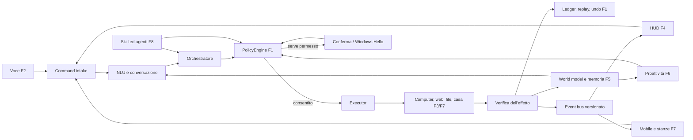
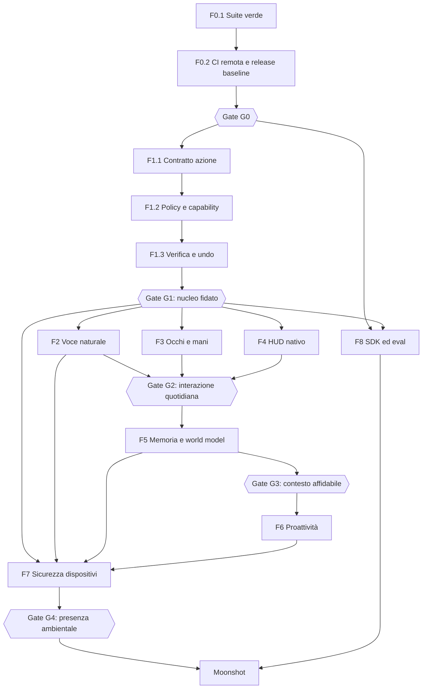

# Jake — roadmap esecutiva verso un vero Jarvis

- Versione del piano: 1.0
- Data di riferimento: 10 settembre 2026
- Fonte dello stato: codice, test, cronologia Git e [audit tecnico storico](ROADMAP.md)
- Regola: questo è il documento operativo; l'audit conserva prove, incidenti e dettagli delle sessioni.

## 1. Obiettivo finale

Jake deve diventare un assistente personale locale per Windows che:

1. ascolta e conversa in modo naturale;
2. comprende schermo, applicazioni, file, progetti, casa e dispositivi;
3. ricorda fatti, relazioni, decisioni e procedure con provenienza verificabile;
4. trasforma obiettivi in azioni concrete;
5. chiede autorizzazione in base al rischio;
6. esegue, osserva l'effetto, corregge gli errori e produce una ricevuta;
7. anticipa bisogni senza interrompere inutilmente;
8. continua la stessa attività tra PC, telefono e stanze;
9. impara capacità nuove dentro una sandbox e senza aumentare i propri privilegi;
10. continua a funzionare localmente quando internet o servizi opzionali non sono disponibili.

Il prodotto non è considerato “Jarvis” perché possiede molte skill. Lo è quando completa in
modo affidabile scenari end-to-end, mantiene il contesto nel tempo e rende ogni azione
importante controllabile dall'utente.

## 2. Regole del piano

### 2.1 Stati

| Stato | Significato |
|---|---|
| `DONE` | Codice, test, documentazione e criterio di uscita completati |
| `VERIFY` | Implementato, ma manca una verifica reale o prolungata |
| `DOING` | Lavoro iniziato e non ancora chiuso |
| `READY` | Dipendenze soddisfatte; può essere iniziato |
| `BLOCKED` | Una dipendenza o decisione impedisce il lavoro |
| `BACKLOG` | Previsto, ma non ancora pronto |
| `MOONSHOT` | Ammesso solo dopo i gate di sicurezza e affidabilità indicati |

### 2.2 Priorità

- `P0`: blocca la base, la sicurezza o qualunque fase successiva.
- `P1`: necessario per il primo Jake usabile ogni giorno.
- `P2`: trasforma un buon assistente in un assistente proattivo e ambientale.
- `P3`: ecosistema, espansioni e moonshot.

### 2.3 Definition of Ready per ogni attività

Un'attività può entrare in sviluppo solo quando:

1. ha un ID stabile (`Fase.Pacchetto.Passo`);
2. dichiara input, output e sistemi toccati;
3. elenca dipendenze e permessi richiesti;
4. definisce almeno un caso di successo, un errore e un caso di sicurezza;
5. possiede un criterio misurabile di completamento;
6. non richiede dati reali dell'utente se può essere testata con fixture temporanee;
7. specifica come degradare quando hardware, modello o rete non sono disponibili.

### 2.4 Definition of Done per ogni attività

Un'attività è `DONE` solo quando:

1. il test che riproduce il bisogno o il bug esiste e fallisce prima della correzione;
2. l'implementazione è minima, tipizzata nei confini critici e osservabile;
3. unit test e integration test relativi passano;
4. la suite completa, ruff, mypy selettivo e compileall passano;
5. gli effetti esterni sono verificati o marcati esplicitamente `unverified`;
6. rischio, permessi, log, privacy e rollback sono aggiornati;
7. README/config/esempi e questa roadmap riflettono lo stato reale;
8. il commit contiene una sola unità logica e può essere annullato senza trascinare lavori diversi;
9. il gate della fase è stato rieseguito, non soltanto il singolo test.

## 3. Stato di partenza verificato

| Area | Stato al 10/09/2026 | Conseguenza |
|---|---|---|
| Repository | Working tree pulito prima di questa roadmap; ramo locale 71 commit avanti al tracking `origin/master` | Le ultime modifiche devono ancora superare la CI remota dopo il push |
| Test Python | 1.254 test; 1 errore in `AppResolver` su una directory `PATH` non accessibile | F0 è nuovamente bloccata |
| Qualità statica | Ruff, mypy selettivo e compileall verdi | Base statica utilizzabile, copertura mypy ancora parziale |
| Smoke test | Avvio CLI, comando e chiusura riusciti | Percorso minimo reale funzionante |
| HUD nativo | CMake/Ninja verde; binario presente | Build sana, comportamento visivo non ancora verificato automaticamente |
| F0 | Quasi completata, riaperta dal nuovo errore | Chiudere F0.1 prima di espandere il prodotto |
| F1 | In corso, con ledger, policy, DPAPI, Hello, kill switch e sandbox iniziale | Completare contratti, verification/undo e capability enforcement |
| F2/F3/F4 | Fondazioni esistenti, nuove fasi non ancora iniziate in modo organico | Possono procedere in parallelo dopo F1-G1 |
| F5/F6 | Prime fette reali implementate | Non ancora abbastanza mature per autonomia ampia |
| F7 | Protocollo e token iniziali | Nessun companion mobile o handoff completo |
| F8 | Skill Forge e plugin loader esistono | Manca un ecosistema firmato, versionato e isolato |

### Blocco corrente esatto

`core/app_resolver.py::_add_path_entries()` crea un iteratore con `Path.iterdir()` dentro un
`try`, ma l'eccezione viene sollevata quando il `for` consuma l'iteratore, fuori dal `try`.
Inoltre `search_paths=[]` viene sostituito dai percorsi predefiniti perché il costruttore usa
`search_paths or defaults`. Il test che dovrebbe essere isolato finisce così per leggere il
vero `PATH` e fallisce su `WindowsApps` con `PermissionError`.

### Verifica della correzione F0.1 — 11/09/2026

- Stato: `DONE`; implementazione, gate locali e matrice CI Python 3.11/3.12 conclusi.
- Causa riprodotta prima del fix: `Path.iterdir()` restituiva un generatore e il
  `PermissionError` emergeva al primo `next()`, fuori dal `try`; il test mirato falliva con la
  stessa eccezione osservata su `WindowsApps`.
- Fix: `search_paths=[]` viene preservato e solo `None` abilita i default; la scansione del
  `PATH` è disattivabile con `include_path=False`; verifica della directory e materializzazione
  di `iterdir()` sono protette da `OSError`; un singolo file non leggibile viene ignorato.
- Fault test deterministici: directory inaccessibile durante l'iterazione, directory rimossa,
  junction non valida, file non leggibile, `PATH` vuoto, scansione `PATH` disabilitata e
  semantica distinta di `search_paths=None`/`[]`.
- Prova locale Python 3.12.6: `tests.test_app_resolver` 29/29; suite completa 1.262/1.262;
  20/20 suite complete consecutive verdi; ruff, mypy selettivo, compileall e smoke test verdi.
- Condizione residua: non segnare `DONE` e non chiudere G0 finché i job CI Windows su Python
  3.11 e 3.12 non sono entrambi verdi sul commit della correzione.
- Chiusura — 11/09/2026: run remoto `34616811238` sul commit `64303ac` (lo stesso che contiene
  questo fix e la riscrittura del test harness Tk) è verde su tutti e tre i job: `Python 3.11
  (Windows)`, `Python 3.12 (Windows)` e `HUD nativo C++/Qt6/QML - build health check`. Il criterio
  di uscita di F0.1 ("20/20 suite verdi su Python 3.12 locale e job 3.11/3.12 verde in CI") è
  quindi soddisfatto; `F0.1` passa a `DONE`.

## 4. Architettura di destinazione e collegamenti

Regola architetturale: il modello può proporre una decisione, ma non può autorizzarla. Il
`PolicyEngine` è l'unico componente che concede l'esecuzione; l'`Executor` è l'unico componente
che produce effetti; il `Verifier` è l'unico componente che li dichiara verificati.

### 4.1 Grafo delle fasi

### 4.2 Contratti condivisi che collegano tutte le fasi

| Contratto | Produttore | Consumatori | Contenuto minimo |
|---|---|---|---|
| `CommandEnvelope` | Voce, HUD, companion | NLU, orchestratore | request id, testo, sorgente, utente, dispositivo, timestamp, privacy mode |
| `ActionProposal` | Agente/planner/skill diretta | PolicyEngine | intent, parametri tipizzati, rischio, scope, precondizioni, effetto atteso |
| `AuthorizationDecision` | PolicyEngine | Executor, HUD | allow/deny/confirm/auth, motivazione, capability, scadenza |
| `ActionReceipt` | Executor/verifier | Ledger, HUD, memoria | action id, risultato, prova, durata, undo token, error taxonomy |
| `HudEvent` | Core | HUD e companion | schema version, sequence id, stato, payload, correlazione |
| `ContextSnapshot` | Context engine | NLU, agente, memoria | finestra/app/progetto/dispositivo, freshness, sensibilità, provenienza |
| `MemoryRecord` | Memory service | Retrieval, proattività | owner, tipo, valore, source, confidence, valid time, TTL, sensitivity |
| `AutomationRun` | Proactivity engine | Policy, executor | trigger, obiettivo, budget, delega, stato, prossimo wake-up |
| `SkillManifest` | SDK/Forge | Loader, policy, UI | versione, schemi, rischio, capability, dipendenze, firma, test |

Questi contratti devono vivere in moduli centrali, essere serializzabili, validati con JSON
Schema e versionati. Nessuna fase deve introdurre una variante privata dello stesso concetto.

## 5. Sequenza globale di consegna

| Onda | Risultato dimostrabile | Fasi attive | Gate finale |
|---|---|---|---|
| Onda 0 — Terra solida | Build, test e release riproducibili | F0 | G0 |
| Onda 1 — Nucleo fidato | Ogni azione ha policy, prova e ricevuta | F1 + fondazioni F8 | G1 |
| Onda 2 — Presenza sul PC | Conversazione fluida, controllo semantico, HUD nativo | F2 + F3 + F4 | G2 |
| Onda 3 — Continuità mentale | Contesto e memoria con provenienza | F5 | G3 |
| Onda 4 — Iniziativa prudente | Suggerimenti e automazioni con budget | F6 | Pilot proattività |
| Onda 5 — Jake ovunque | Companion, stanze, casa e handoff | F7 | G4 |
| Onda 6 — Evoluzione controllata | Skill e agenti aggiornabili senza perdere sicurezza | F8 | Ecosystem gate |
| Onda 7 — Moonshot | AR, robotica, digital twin e modello personale | M | Gate dedicati |

### 5.1 — Registro owner e stato dei pacchetti

Gli owner sono ruoli logici, non persone. Questo registro copre ogni pacchetto e viene aggiornato
ai gate; le note dentro i singoli pacchetti conservano l'evidenza più recente e possono
distinguere sotto-passi già verificati da ciò che manca.

| Pacchetto | Owner logico | Stato |
|---|---|---|
| `F0.1` | Platform Reliability | `DONE` |
| `F0.2` | Release Engineering | `DONE` |
| `F0.3` | Architecture | `VERIFY` |
| `F0.4` | Quality Engineering | `BLOCKED` |
| `F0.5` | Performance Engineering | `BLOCKED` |
| `F0.6` | Release Engineering | `DOING` |
| `F1.1` | Trust Core | `DOING` |
| `F1.2` | Security Architecture | `DOING` |
| `F1.3` | Execution Reliability | `DOING` |
| `F1.4` | Identity and Secrets | `DOING` |
| `F1.5` | Application Security | `DOING` |
| `F1.6` | Sandbox Runtime | `DOING` |
| `F1.7` | Observability | `DOING` |
| `F1.8` | Runtime Reliability | `DOING` |
| `F2.1` | Voice Quality | `BLOCKED` |
| `F2.2` | Speech Runtime | `BLOCKED` |
| `F2.3` | Voice Quality | `BLOCKED` |
| `F2.4` | Audio Systems | `BLOCKED` |
| `F2.5` | Speech Runtime | `BLOCKED` |
| `F2.6` | Conversation Runtime | `BLOCKED` |
| `F2.7` | Identity and Voice | `BLOCKED` |
| `F3.1` | Computer Use Quality | `BLOCKED` |
| `F3.2` | Windows Automation | `BLOCKED` |
| `F3.3` | Windows Automation | `BLOCKED` |
| `F3.4` | Execution Runtime | `BLOCKED` |
| `F3.5` | Computer Use Reliability | `BLOCKED` |
| `F3.6` | Browser Automation | `BLOCKED` |
| `F3.7` | Application Adapters | `BLOCKED` |
| `F3.8` | Demonstration Learning | `BLOCKED` |
| `F4.1` | Protocol Architecture | `VERIFY` |
| `F4.2` | Native HUD | `VERIFY` |
| `F4.3` | Native HUD | `BLOCKED` |
| `F4.4` | Interaction Design | `BLOCKED` |
| `F4.5` | Interaction Design | `BLOCKED` |
| `F4.6` | Trust UX | `BLOCKED` |
| `F4.7` | Accessibility | `BLOCKED` |
| `F4.8` | Release Engineering | `BLOCKED` |
| `F5.1` | Memory Platform | `DOING` |
| `F5.2` | Memory Platform | `DOING` |
| `F5.3` | Knowledge Model | `DOING` |
| `F5.4` | Memory Reliability | `DOING` |
| `F5.5` | Retrieval Quality | `DOING` |
| `F5.6` | Context Runtime | `DOING` |
| `F5.7` | Privacy Engineering | `BACKLOG` |
| `F6.1` | Proactivity Platform | `DOING` |
| `F6.2` | Proactivity Quality | `DOING` |
| `F6.3` | Notification UX | `BACKLOG` |
| `F6.4` | Goal Runtime | `DOING` |
| `F6.5` | Automation Runtime | `DOING` |
| `F6.6` | Meeting Experience | `BACKLOG` |
| `F6.7` | Runtime Reliability | `DOING` |
| `F7.1` | Companion Security | `DOING` |
| `F7.2` | Mobile Companion | `BACKLOG` |
| `F7.3` | Voice Devices | `BACKLOG` |
| `F7.4` | Presence Runtime | `DOING` |
| `F7.5` | Home Integration | `DOING` |
| `F7.6` | Sync and Crypto | `BACKLOG` |
| `F7.7` | Edge Devices | `BACKLOG` |
| `F8.1` | Skill Platform | `DOING` |
| `F8.2` | Supply-chain Security | `BACKLOG` |
| `F8.3` | Skill Forge | `DOING` |
| `F8.4` | Model Runtime | `BACKLOG` |
| `F8.5` | Agent Runtime | `DOING` |
| `F8.6` | Release Safety | `BACKLOG` |

## 6. F0 — Baseline verde e release riproducibile

- Stato: `DOING`
- Priorità: `P0`
- Dipendenze: nessuna
- Output: un commit e una build sono giudicabili senza conoscere la macchina dello sviluppatore.

### F0.1 — Eliminare il blocco AppResolver

Dipende da: nessuno.

1. `F0.1.1` Aggiungere un test in cui una directory del `PATH` solleva `PermissionError` durante
   l'iterazione, non durante la creazione dell'iteratore.
2. `F0.1.2` Correggere il costruttore: usare i default soltanto quando `search_paths is None`,
   preservando intenzionalmente `[]`.
3. `F0.1.3` Portare il consumo di `path.iterdir()` dentro il blocco `try/except OSError` oppure
   materializzare l'elenco dentro il `try`.
4. `F0.1.4` Decidere esplicitamente se la scansione del `PATH` è configurabile; non usarla nei
   test di alias/fuzzy matching.
5. `F0.1.5` Aggiungere test per directory rimossa durante la scansione, junction non valida,
   file non leggibile e `PATH` vuoto.
6. `F0.1.6` Eseguire il file di test isolato, poi la suite completa.
7. `F0.1.7` Eseguire la suite completa 20 volte; nessuna eccezione I/O ambientale è ammessa.
8. `F0.1.8` Aggiornare l'audit con causa, fix e prova, senza segnare F0 completa prima del gate.

Criterio di uscita: 20/20 suite verdi su Python 3.12 locale e job 3.11/3.12 verde in CI.

### F0.2 — Allineare repository locale e CI

Dipende da: F0.1.

- Stato: `DONE`; `F0.2.1`–`F0.2.7` tutti conclusi con evidenza remota.
- Verifica locale 11/09/2026: il commit F0.1 e' atomico e la storia condivisa non e' stata
  riscritta; `git ls-files` non contiene log, database, token, registrazioni, modelli, binari o
  build artifact; il lock con hash si installa; ruff, mypy, compileall, 1.262 test, smoke CLI,
  configure/build HUD e smoke del binario HUD sono verdi su Python 3.12.6.
- Diagnostica CI: il job Python conserva `unittest.log` e `summary.txt` con commit, versione
  Python, durata ed exit code tramite `actions/upload-artifact@v4` e `if: always()`; verificati
  localmente sia il log della suite sia la propagazione di un exit code di fallimento.
- Verifica remota 11/09/2026, run `34614112195`: installazione, ruff, mypy, compileall e suite
  Python sono verdi sia su 3.11 sia su 3.12; build e smoke HUD sono verdi. I due job Python sono
  risultati rossi soltanto perche' `upload-artifact@v4` esclude per default la directory nascosta
  `.ci-artifacts/`, saltando di conseguenza lo smoke CLI. La correzione locale imposta
  `include-hidden-files: true`, sposta l'upload dopo lo smoke affinche' un errore del servizio
  artifact non lo salti, ed e' protetta da `tests/test_ci_workflow.py`; baseline successiva:
  1.946/1.946 test, ruff, mypy su 75 file e compileall verdi. Lo smoke CLI completa
  avvio-risposta-chiusura in 12,9 secondi con exit code 0; lo smoke HUD resta attivo oltre tre
  secondi con ogni percorso Qt rimosso dal `PATH`.
- Verifica remota 11/09/2026, run `34615971747` su `31409cf`: Python 3.12 e HUD sono interamente
  verdi; l'upload della diagnostica passa su entrambi i job Python, chiudendo `F0.2.7`. Python
  3.11 termina invece con exit code nativo `0x80000003` durante
  `tests.test_status_panel.RunForeverTests`, con `Tcl_AsyncDelete: async handler deleted by the
  wrong thread`. Il test harness creava un nuovo interprete `Tk` per ogni test; la correzione
  locale usa un solo `Tk` di modulo e una `Toplevel` isolata per caso, mantenendo widget e
  `mainloop` reali. Il modulo passa 20/20 esecuzioni consecutive e la suite completa locale passa
  1.947/1.947 su Python 3.12.
- Sync 11/09/2026: la correzione Python 3.11 è stata pubblicata nel commit `64303ac`; il run
  remoto `34616811238` è verde su tutti e tre i job (`Python 3.11 (Windows)`,
  `Python 3.12 (Windows)`, `HUD nativo C++/Qt6/QML - build health check`), chiudendo `F0.2.5`.
- `F0.2.6` — Protezione di `master`, 11/09/2026: con autorizzazione esplicita dell'utente è stata
  configurata la branch protection su `master` (`required_status_checks.strict=true` sui tre
  contesti sopra elencati, `enforce_admins=true`, force-push e delete vietati). Poiché i required
  status checks bloccano anche i push diretti privi di un check già verde su quello SHA, da questo
  momento anche l'owner lavora via branch → PR → CI verde → merge; nessun push diretto a `master`
  è più possibile, nemmeno per l'admin.
- Verifica empirica del rifiuto — 11/09/2026: creato un branch usabile-e-getta
  (`test/branch-protection-verify`) con un test che fallisce deliberatamente
  (`tests/test_zz_branch_protection_probe.py`), aperta la PR #1 verso `master` (run remoto
  `34651548002`). Esito: `HUD nativo C++/Qt6/QML - build health check` verde, `Python 3.11
  (Windows)` e `Python 3.12 (Windows)` rossi come atteso; l'API GitHub ha riportato la PR con
  `mergeable: MERGEABLE` (nessun conflitto) ma `mergeStateStatus: BLOCKED`, cioè il merge è
  impedito esclusivamente dai required status checks falliti. Un tentativo diretto di
  `gh pr merge` è stato bloccato a monte dal sandbox dell'agente prima ancora di raggiungere
  GitHub, coerente con l'aspettativa che l'azione non sarebbe comunque riuscita. La PR è stata
  chiusa senza merge e sia il branch remoto sia quello locale sono stati cancellati subito dopo.
  Questo chiude la condizione residua di `F0.2.6` e, con essa, `KL-001`. `F0.2` passa a `DONE`.

1. `F0.2.1` Raggruppare i commit locali in una sequenza comprensibile senza riscrivere storia
   già condivisa.
2. `F0.2.2` Verificare che nessun log, database, token, registrazione, modello o build artifact
   sia tracciato.
3. `F0.2.3` Eseguire localmente gli stessi comandi della CI, nello stesso ordine.
4. `F0.2.4` Pubblicare i commit e osservare entrambi i job Windows.
5. `F0.2.5` Correggere divergenze tra ambiente locale e runner, senza disattivare test.
6. `F0.2.6` Proteggere `master`: CI richiesta, niente merge con job rossi.
7. `F0.2.7` Aggiungere artifact di test e log sintetico per diagnosticare fallimenti remoti.

Criterio di uscita: HEAD locale coincide con un commit remoto i cui job Python e HUD sono verdi.

### F0.3 — Fonte unica di verità

Dipende da: F0.1.

- Stato: `DOING`; `F0.3.1`, `F0.3.3`, `F0.3.4`, `F0.3.5` e `F0.3.6` conclusi localmente; `F0.3.2`
  resta una regola di processo permanente (non un passo da chiudere una volta sola) e attende
  comunque il gate G0 prima di essere dichiarata rispettata su una release vera.
- Fonte canonica: `config/release.json` contiene versione prodotto e protocollo. Python, CLI,
  risposta identitaria, endpoint `/status`, eventi HUD e CMake/HUD nativo la consumano; il
  changelog e' verificato da contract test contro la stessa versione.
- Prova 11/09/2026: 23 contract test mirati e 1.269 test completi verdi; ruff, mypy selettivo e
  compileall verdi; CMake ha configurato dal manifest e la build C++ e' passata dentro
  l'ambiente MSVC. `CHANGELOG.md` usa Added/Changed/Fixed/Security.
- Prova F0.3.5/F0.3.6 — 11/09/2026: 5 ADR creati in `docs/adr/` (UIA, sandbox plugin, trasporto
  companion, cifratura, storage memoria) con indice `docs/adr/README.md`; ognuno dichiara stato,
  data, contesto, decisione, alternative, conseguenze, piano di migrazione e criterio di
  revisione. Il registro owner/stato per ogni pacchetto vive in `### 5.1` di questo stesso file.
  Verificato con due nuove suite dedicate, non solo a occhio: `tests/test_architecture_decisions.py`
  (ogni ADR atteso esiste, e' indicizzato e contiene tutte le sezioni richieste) e
  `tests/test_roadmap_structure.py` (ogni intestazione `### F*.*` del piano ha esattamente una
  riga nel registro, con owner non vuoto e stato tra quelli ammessi) - un pacchetto aggiunto in
  futuro senza owner/stato o un ADR incompleto fa fallire la suite invece di passare inosservato.
  Suite completa rieseguita dopo l'aggiunta: 1.272/1.272 verdi; ruff pulito.

1. `F0.3.1` Rendere questo file il piano attivo e `ROADMAP.md` lo storico/audit.
2. `F0.3.2` Aggiornare la tabella “stato corrente” a ogni gate, non a ogni micro-commit.
3. `F0.3.3` Collegare versione, protocol version e release notes senza duplicare numeri hardcoded.
4. `F0.3.4` Creare `CHANGELOG.md` con Added/Changed/Fixed/Security.
5. `F0.3.5` Creare ADR per decisioni irreversibili: UIA, sandbox, trasporto, cifratura, memoria.
6. `F0.3.6` Inserire owner logico e stato per ogni pacchetto, anche se il progetto ha un solo autore.

Criterio di uscita: README, `--version`, `/status`, roadmap e release riportano la stessa versione.

### F0.4 — Matrice di test completa

Dipende da: F0.1.

1. `F0.4.1` Classificare i test in unit, contract, integration, end-to-end, hardware e security.
2. `F0.4.2` Etichettare quelli che toccano rete locale, GUI, audio, Ollama o hardware.
3. `F0.4.3` Separare suite veloce per commit e suite estesa/notturna.
4. `F0.4.4` Aggiungere contract test Python↔C++ per tutti gli eventi HUD.
5. `F0.4.5` Aggiungere test di fault injection: timeout, processo terminato, DB bloccato, disco
   pieno, rete assente, JSON malformato, modello indisponibile.
6. `F0.4.6` Aggiungere mutation test selettivo a policy, risk, auth e filesystem safety.
7. `F0.4.7` Pubblicare una test matrix con comando, costo, requisito e criterio di successo.

Criterio di uscita: ogni confine esterno ha almeno un test di successo, timeout e fallimento.

### F0.5 — Benchmark e budget prestazionali

Dipende da: F0.1.

1. `F0.5.1` Congelare dataset NLU con train/test separati; evitare leave-one-out sulla sola
   corsia esatta come metrica principale.
2. `F0.5.2` Creare corpus audio consensuale per wake word/STT: silenzio, TV, musica, distanza,
   accenti e microfoni differenti.
3. `F0.5.3` Creare 100 task computer-use ripetibili su app fixture.
4. `F0.5.4` Misurare cold start, warm start, p50/p95, RAM, VRAM, CPU e consumo batteria.
5. `F0.5.5` Salvare hardware, modelli, versioni e seed in ogni report.
6. `F0.5.6` Definire soglie che bloccano la CI solo dopo tre baseline stabili.
7. `F0.5.7` Mostrare trend nella dashboard locale, senza telemetria remota obbligatoria.

Criterio di uscita: ogni fase F2–F7 ha una baseline misurata prima di iniziare ottimizzazioni.

### F0.6 — Packaging e recupero

Dipende da: F0.2 e F0.3.

- Stato: `DOING` sulle fondamenta HUD; resto `BLOCKED` dalle dipendenze e dalla scelta
  dell'installer.
- Verifica 11/09/2026: CMake individua il `windeployqt` della stessa installazione usata per
  compilare ed esegue il deployment `POST_BUILD` di DLL, plugin e moduli QML. Una clean build
  ha prodotto il runtime completo e `JakeHud.exe` e' rimasto attivo oltre tre secondi con ogni
  percorso `C:\Qt` rimosso dal `PATH`, riproducendo e chiudendo l'errore "Qt6*.dll non trovata".

1. `F0.6.1` Definire installer per core Python, HUD, modelli e componenti opzionali.
2. `F0.6.2` Aggiungere preflight hardware/software e spazio disco.
3. `F0.6.3` Rendere installazione, upgrade, repair e uninstall idempotenti.
4. `F0.6.4` Preservare dati personali durante update/uninstall salvo consenso esplicito.
5. `F0.6.5` Firmare binari e pacchetti; verificare la firma prima dell'aggiornamento.
6. `F0.6.6` Usare aggiornamenti atomici con health check e rollback automatico.
7. `F0.6.7` Offrire canali stable/beta/dev e portable mode.

Criterio di uscita: installazione, update fallito e rollback passano su una VM Windows pulita.

### Gate G0 — Terra solida

G0 è superato soltanto se:

- suite completa 20 volte verde;
- CI remota verde su 3.11/3.12 e HUD;
- smoke test e build riproducibile;
- nessun segreto/artifact tracciato;
- versione e documentazione coerenti;
- issue note per ogni limite noto ancora accettato.

**Gate G0 superato — 11/09/2026.** Evidenza per ciascun criterio, raccolta sul commit `dedc2ce`
(merge di F0.1/F0.2/F0.2.6 su `master`):

- Suite completa 20 volte verde: 20/20 esecuzioni locali di `python -m unittest discover -s
  tests -q` su Python 3.12.6, ciascuna 1.947/1.947 test verdi (~35 s a run), nessuna eccezione
  I/O ambientale.
- CI remota verde su 3.11/3.12 e HUD: run `34653572407` sul commit `dedc2ce` verde su tutti e tre
  i job (`Python 3.11 (Windows)`, `Python 3.12 (Windows)`, `HUD nativo C++/Qt6/QML - build health
  check`).
- Smoke test e build riproducibile: smoke CLI e smoke HUD verdi in CI (vedi F0.2); build HUD
  riproducibile via CMake/windeployqt (vedi F0.6).
- Nessun segreto/artifact tracciato: verificato in F0.2.2 (`git ls-files` senza log, database,
  token, registrazioni, modelli o build artifact).
- Versione e documentazione coerenti: `config/release.json` come fonte unica (F0.3), verificato
  da contract test (`tests/test_roadmap_structure.py`, `tests/test_architecture_decisions.py`,
  `tests/test_ci_workflow.py`), tutti verdi.
- Issue note per ogni limite noto ancora accettato: `docs/known-limitations.md` contiene un solo
  limite registrato (`KL-001`) ed è risolto; nessun limite aperto residuo.
- Nota: `F0.4` (matrice di test completa), `F0.5` (benchmark prestazionali) e `F0.6` (packaging,
  oltre alle fondamenta HUD già verificate) restano `BACKLOG`/`DOING` come lavoro di qualità
  continuativo su F0, ma nessuno dei sei criteri espliciti del gate li richiede: non bloccano G0.
  Restano nel registro `### 5.1` con il loro stato reale e proseguono in parallelo a F1.

## 7. F1 — Trustworthy Agent Core

- Stato: `DOING`
- Priorità: `P0`
- Dipendenze: G0
- Output: nessuna azione può saltare policy, verifica, audit o limiti di autonomia.

### F1.1 — Action Contract 2.0

Dipende da: G0.

1. `F1.1.1` Inventariare tutti i percorsi: comando diretto, agente, planner legacy, workflow,
   trigger, fallback, plugin e companion.
2. `F1.1.2` Definire dataclass/schema per `ActionProposal`, `ActionContext`, `ActionReceipt`,
   `VerificationEvidence`, `UndoDescriptor` ed `ActionError`.
3. `F1.1.3` Rendere obbligatori action id, trace id, source, actor, intent, parametri validati,
   rischio, effect class e idempotency key.
4. `F1.1.4` Definire tassonomia errori: invalid input, denied, unavailable, transient, timeout,
   partial effect, verification failed, conflict, user cancelled.
5. `F1.1.5` Versionare lo schema e aggiungere migrazione/compatibilità per record precedenti.
6. `F1.1.6` Adattare prima un intent read-only, uno reversibile, uno external, uno destructive e
   uno admin.
7. `F1.1.7` Migrare tutti gli intent per dominio, impedendo payload ad-hoc nuovi.
8. `F1.1.8` Aggiungere contract test che fallisce se una skill restituisce dati non conformi.

Criterio di uscita: il 100% dei percorsi produce lo stesso `ActionReceipt` validato.

- Stato: `DOING`; `F1.1.1`, `F1.1.2`, `F1.1.3` (parzialmente), `F1.1.4`, `F1.1.6` (pilota su 5
  intent) e `F1.1.8` conclusi con evidenza; `F1.1.5`, `F1.1.7` restano aperti.
- `F1.1.6` — 12/09/2026: pilota di adozione dei contratti F1.1.2 su un intent reale per
  ciascun `RiskLevel` (letterale dalla roadmap: "un intent read-only, uno reversibile, uno
  external, uno destructive e uno admin") - `GET_TIME`, `ADD_NOTE`, `CONTROL_SMART_DEVICE`,
  `DELETE_PATH`, `SYSTEM_POWER`. A differenza di F1.1.2 (tipi definiti ma isolati), qui
  `core/jake_core.py::_resolve_and_execute` costruisce e valida DAVVERO un `ActionProposal`
  (`ActionProposal.for_intent(resolved.intent, resolved.parameters, "user")` +
  `validate_action_proposal`) prima di passare `proposal.intent`/`proposal.parameters` a
  `PolicyEngine.decide_interactive` - `proposal.parameters` e' una COPIA (vedi
  `ActionProposal.for_intent`), quindi il comando eseguito davvero piu' sotto resta
  `resolved.parameters`, l'originale: nessun cambio di comportamento, verificato sia dalla suite
  invariata (2.042/2.042 verdi PRIMA di aggiungere nuovi test) sia da un test dedicato che sporca
  `proposal.parameters` e verifica che la skill riceva comunque i parametri originali.
  `_log_action_outcome`/`_log_denied_action` costruiscono un `ActionError.from_result(result)`
  (validato da `validate_action_error`) e ne usano `.category` per `ActionReceipt.error_category`
  - stesso valore di prima (`error_category_of(result)`, F1.1.4), ma ora attraverso il tipo
  condiviso invece che dalla funzione diretta. Questo e' deliberatamente un percorso reale
  toccato (non piu' solo codice isolato come F1.1.2): rischio piu' alto, per questo limitato a
  UN chokepoint (il percorso a comando singolo/agente, "percorso 1/2" dell'inventario F1.1.1) e
  verificato con la suite completa PRIMA e DOPO la modifica, oltre a 6 nuovi test dedicati
  (`tests/test_jake_core_action_contracts.py`) che esercitano tutti e 5 i livelli di rischio
  contro il codice vero, non un doppio isolato. `TaskAgent`/`PlanExecutor` (gli altri due
  chokepoint) NON sono stati toccati in questo passo - restano su `error_category_of()` diretto,
  comportamento identico a prima, adozione rimandata a `F1.1.7`. Prova: 2.048/2.048 test,
  ruff/mypy (incluso il set selettivo di `pyproject.toml`, che include `core/jake_core.py`)/
  compileall verdi.
- `F1.1.2` — 12/09/2026: creato `core/action_contracts.py` con i cinque contratti mancanti
  (`ActionProposal`, `ActionContext`, `VerificationEvidence`, `UndoDescriptor`, `ActionError`) -
  `ActionReceipt` esisteva gia' (`core/action_ledger.py`). **Deliberatamente NON collegati** ai
  quattro chokepoint reali (`JakeCore`/`TaskAgent`/`PlanExecutor`) ne' alle ~200 skill (restano su
  `SkillResult`): quella migrazione e' F1.1.6 ("adattare prima un intent read-only, uno
  reversibile, uno external, uno destructive e uno admin") e F1.1.7 ("migrare tutti gli intent"),
  numerati separatamente nella roadmap proprio perche' un progetto a se', troppo rischioso da fare
  nello stesso commit di 5 tipi nuovi mai usati (vedi Definition of Done, punto 8: "il commit
  contiene una sola unita' logica"). Ogni tipo RIUSA una tassonomia/costante gia' esistente invece
  di introdurne una copia parallela (lo stesso principio gia' applicato in F1.1.4/F1.3.3):
  `VerificationEvidence.status` e `ActionError.category` usano le costanti gia' presenti in
  `core/action_ledger.py` (`VERIFICATION_*`, ora anche pubblico `ERROR_CATEGORIES` invece del
  precedente `_ERROR_CATEGORIES` privato, cosi' `action_contracts.py` puo' validare senza un
  secondo elenco a mano); `ActionProposal.risk` usa `core.risk.RiskLevel`; `ActionError.retryable`
  usa `execution_safety.RETRYABLE_ERRORS`. Estratto anche `normalize_result_code()` da
  `error_category_of()` (stesso comportamento, nessun cambio) perche' sia questa sia
  `ActionError.from_result()` avevano bisogno della stessa normalizzazione "error:" - una funzione
  sola, non due copie. `effect_class` (`ActionProposal`) e' volutamente un campo dichiarato dal
  chiamante, non calcolato da `risk_of()`: i due assi (rischio vs. tipo di effetto) non si
  derivano l'uno dall'altro in modo affidabile per le ~200 skill non ancora censite; resta `None`
  quando ignoto invece di un valore indovinato. `UndoDescriptor` e' distinto dal `RollbackAction`
  gia' esistente in `execution_safety.py`: quello e' il template PER CLASSE DI INTENT, questo
  l'istanza PER AZIONE GIA' ESEGUITA con parametri risolti e stato (`used`/`expires_at`) - due
  esecuzioni dello stesso intent condividono lo stesso `RollbackAction` ma hanno due
  `UndoDescriptor` diversi. Nuovo `tests/test_action_contracts.py` (33 test): copre costruzione,
  validazione e - per ogni tipo che riusa una costante condivisa - un test esplicito che il valore
  coincide con quello della fonte originale (es. `ActionError.retryable` per ogni codice REALE di
  `RETRYABLE_ERRORS`, non solo un esempio a mano). Prova: 2.042/2.042 test, ruff/mypy/compileall
  verdi su tutti i file toccati (incluso il refactor non invasivo di `error_category_of`).
- `F1.1.4` — 12/09/2026: definita la tassonomia in `core/action_ledger.py`
  (`ERROR_CATEGORY_*`: le nove categorie elencate sopra piu' due necessarie perche' non ogni
  ricevuta e' un errore - `success` e `pending` - piu' un fallback onesto `uncategorized` per i
  codici bespoke delle ~200 skill non ancora migrate). `error_category_of(result)` normalizza i
  DUE formati diversi con cui i quattro chokepoint scrivono gia' `result` (letto dal codice, non
  ipotizzato: `PlanExecutor` usa `"error:VERIFICATION_FAILED"` preservando il caso originale della
  skill, `TaskAgent` a volte usa `"missing_parameters"` gia' minuscolo e senza prefisso) verso la
  stessa categoria, mappando solo i codici gia' CENTRALIZZATI e condivisi tra piu' moduli
  (`POLICY_BLOCKED`, `CONFIRMATION_REQUIRED`/`AUTH_REQUIRED`, `OPERATION_FAILED`/
  `NETWORK_UNAVAILABLE` - le stesse due costanti di `execution_safety.RETRYABLE_ERRORS`,
  `VERIFICATION_FAILED`, `KILLED`, `OLLAMA_UNAVAILABLE`, `TIMEOUT`, `MISSING_PARAMETERS`, ...);
  un codice specifico di una singola skill (es. `PATH_NOT_FOUND`) ricade onestamente su
  `uncategorized` invece di essere forzato in una categoria a caso. Aggiunto `error_category` a
  `ActionReceipt` (default `uncategorized`, validato da `validate_action_receipt`) e collegato
  a tutti e quattro i chokepoint reali (`JakeCore._log_action_outcome`/`_log_denied_action`,
  `TaskAgent._log_step`, `PlanExecutor._log_step`) - stesso principio di `verification_status_of`
  gia' usato per `verified` (F1.3.3): calcolato dal chiamante con una funzione pura, mai un
  default implicito nella dataclass che rischi di nascondere un futuro punto che se ne
  dimenticasse. Nessun cambio di comportamento per i test esistenti (130/130 verdi senza
  modifiche); aggiunti 13 nuovi test (`tests/test_action_ledger.py::ErrorCategoryOfTests`/
  `ActionReceiptErrorCategoryValidationTests`). Non ancora affrontato: la migrazione delle ~200
  skill sulla tassonomia condivisa (`F1.1.6`/`F1.1.7`) e l'unificazione del formato di `result`
  tra i quattro chokepoint (oggi tollerata da `error_category_of`, non risolta alla radice).
  Prova: 1.995/1.995 test, ruff/mypy/compileall verdi su tutti i file toccati.
- `F1.1.1` — 11/09/2026: inventario dei 7 percorsi di esecuzione in
  [docs/action-execution-paths.md](docs/action-execution-paths.md) (comando diretto, agente a
  passi, piano automatico/RUN_WORKFLOW/trigger, companion server, registrazione skill, rollback,
  dispatch grezzo di `SkillRegistry.execute()`), con per ciascuno il punto d'ingresso esatto e se
  passa da `PolicyEngine`. `tests/test_action_paths_inventory.py` verifica che i simboli citati
  esistano ancora (incluso il buco noto e documentato di `SkillRegistry.execute()`, F1.2.1), cosi'
  un rinominamento futuro fa fallire il test invece di lasciare il documento silenziosamente
  disallineato dal codice.
- Ricognizione 11/09/2026 (superata da `F1.1.2` sopra, conservata come prova dello stato di
  partenza): `ActionProposal`, `ActionContext`, `VerificationEvidence`, `UndoDescriptor` ed
  `ActionError` non esistevano ancora come classi (solo prosa nella roadmap); esisteva solo
  `ActionReceipt` (`core/action_ledger.py`) e `PolicyEngine`
  (`core/policy_engine.py`). Le skill restituiscono `SkillResult` (piu' sottile del contratto
  target); la ricevuta viene sintetizzata solo in 4 punti di orchestrazione
  (`JakeCore._log_action_outcome`/`_log_denied_action`, `TaskAgent._log_step`,
  `PlanExecutor._log_step`), non dalle singole skill. `core/skill_registry.py::execute()` e'
  un dispatcher senza alcun controllo di policy; i due percorsi normali passano comunque da
  `PolicyEngine` prima di chiamarlo, ma `core/execution_safety.py` invoca `registry.execute()`
  direttamente nel rollback, bypassando la policy (buco noto, non ancora richiuso).
- `F1.1.3`/`F1.1.8` — 11/09/2026: `idempotency_key` era `Optional[str] = None` pur essendo
  sempre calcolata nei 4 punti reali - resa `str` obbligatoria (non piu' opzionale) in
  `ActionReceipt`; aggiunto `schema_version` (default `ACTION_RECEIPT_SCHEMA_VERSION = 1`, F1.1.5
  resta comunque aperto: nessuna migrazione multi-versione esiste ancora, solo la versione
  corrente e' accettata). Aggiunta `validate_action_receipt()` che rifiuta campi obbligatori
  vuoti, timestamp non positivo o `schema_version` non supportata. Nuovo
  `tests/test_action_contract.py` esercita direttamente tutti e 4 i punti che oggi costruiscono
  una ricevuta e verifica che ognuno produca un `ActionReceipt` conforme; `tests/
  test_action_ledger.py` aggiornato per la nuova obbligatorietà. Prova: 1.955/1.955 test (36/36
  su `test_action_ledger`+`test_action_contract`), ruff e mypy puliti su
  `core/action_ledger.py`, compileall verde.
- Non ancora affrontato: `effect_class` esiste ora come campo di `ActionProposal` (`F1.1.2`) ma
  resta dichiarato dal chiamante, non calcolato automaticamente; "parametri validati"/"actor"
  distinto da "source" come campi propri (`requested_by` li conflette in una sola stringa,
  `ActionContext` non ha ancora un campo `actor` separato); migrazione reale delle skill sul
  contratto (`F1.1.7`, dopo il pilota di `F1.1.6` su un solo chokepoint) - `TaskAgent`/
  `PlanExecutor` continuano a costruire `ActionReceipt` direttamente senza passare da un
  `ActionProposal`/`ActionError`, e nessuna delle ~200 skill costruisce ancora questi contratti
  da sola (restano su `SkillResult`). Il bypass di policy nel rollback e' stato parzialmente
  chiuso, vedi `F1.2.5`.

### F1.2 — Policy kernel e capability

Dipende da: F1.1.

1. `F1.2.1` Rendere `PolicyEngine` l'unico gate, rimuovendo decisioni duplicate dagli executor.
2. `F1.2.2` Definire capability per filesystem root, app, contatto, dominio web, device, servizio
   Home Assistant, rete e durata.
3. `F1.2.3` Intersecare permessi di utente, dispositivo, agente, skill e sessione; vince il più restrittivo.
4. `F1.2.4` Negare per default parametri o intent sconosciuti.
5. `F1.2.5` Applicare policy anche a retry, rollback, fallback e sotto-azioni generate da workflow.
6. `F1.2.6` Salvare la motivazione della decisione nel ledger senza salvare segreti.
7. `F1.2.7` Aggiungere policy simulator: mostra se e perché un'azione sarebbe permessa.
8. `F1.2.8` Costruire test di bypass per ogni percorso inventariato in F1.1.1.

Criterio di uscita: nessun executor è raggiungibile senza una decisione emessa dal PolicyEngine.

- Stato: `DOING`; `F1.2.5` parziale per rollback filesystem e ripresa del consenso (questa
  ultima verificata localmente, in attesa di CI); `F1.2.1` chiuso parzialmente
  (percorso 3, vedi sotto); `F1.2.2` chiuso parzialmente (prima capability vera - radici
  filesystem, solo percorso interattivo, solo quattro intent, vedi sotto); `F1.2.4` chiuso per
  il percorso planner (vedi sotto); `F1.2.6` e `F1.2.7` chiusi (vedi sotto); `F1.2.3`/resto
  aperto.
- `F1.2.2` (parziale, prima capability: radici filesystem) — 12/09/2026: "definire capability per
  filesystem root, app, contatto, dominio web, device, servizio Home Assistant, rete e durata" -
  la prima delle otto, scelta perche' e' l'unica gia' collegabile senza dover prima costruire
  un'infrastruttura di identita'/registrazione device separata (app/contatto/dominio web/
  device/HA/rete/durata restano tutte aperte). Non un fix di un buco preesistente (la capability
  non esisteva affatto prima), ma una FUNZIONALITA' NUOVA, scelta deliberatamente in una fetta
  verticale stretta invece di un tentativo generico: `PolicyEngine(allowed_filesystem_roots=...)`
  - opt-in, vuoto per default (comportamento identico a prima per chi non lo configura, stesso
  principio di `blocked_intents`), applicato SOLO ai quattro intent di mutazione filesystem gia'
  raggruppati altrove come naturalmente idempotenti (`CREATE_PATH`/`RENAME_PATH`/`MOVE_PATH`/
  `DELETE_PATH`, vedi `core/execution_safety.py::INTENT_SAFETY_REGISTRY`) e SOLO sul percorso
  interattivo (`decide_interactive`): `decide_automated()` non riceve affatto `parameters` oggi
  (design deliberato di F1.2, vedi il docstring del modulo - un piano automatico non deve mai
  fidarsi di segnali nei parametri), quindi estenderlo per la capability e' un cambio di firma
  piu' ampio (tocca `PlanExecutor`, `execution_safety.rollback_effect`, `RunWorkflowSkill`,
  `TriggerScheduler` e i rispettivi test) rimandato deliberatamente - `PlanExecutor`/
  `RUN_WORKFLOW`/i trigger NON rispettano ancora le radici consentite, dichiarato apertamente nel
  codice, non nascosto. Confronto per confini di directory veri (non un semplice prefisso di
  stringa: "C:\Allowed" non deve corrispondere a "C:\AllowedButNot"), `Path.resolve()` per
  neutralizzare traversal con `..` e seguire i symlink fino al bersaglio reale, `os.path.normcase`
  per il confronto case-insensitive su Windows. `MOVE_PATH` controlla sia `path` sia
  `destination`: altrimenti spostare un file FUORI da una radice consentita partendo da un
  percorso permesso sarebbe un modo banale per aggirare la capability. Aggiunta la nuova
  motivazione chiusa `POLICY_REASON_CAPABILITY_DENIED` al vocabolario di `F1.2.6` (una radice
  negata e' concettualmente diversa da un intent sempre bloccato: lo stesso intent puo' essere
  permesso o negato a seconda del parametro). Verificato anche end-to-end attraverso
  `JakeCore._resolve_and_execute` (non solo a livello di `PolicyEngine` in isolamento): un
  `DELETE_PATH` gia' `"confirmed": true` fuori da ogni radice consentita si ferma con
  `POLICY_BLOCKED` PRIMA di raggiungere la skill, la skill non viene mai chiamata. Aggiunti 12
  nuovi test in `tests/test_policy_engine.py::FilesystemCapabilityTests`. Non ancora affrontato:
  le altre sette capability elencate dalla roadmap, `F1.2.3` (intersezione permessi
  utente/dispositivo/agente/skill/sessione - qui c'e' solo un allowlist a livello utente, nessuna
  intersezione), la copertura degli intent di sola lettura (`FIND_FILE`/`GET_FILE_INFO`/
  `READ_FILE_TEXT`...) e del percorso automatico. Prova: 2.176/2.176 test, ruff/mypy/compileall
  verdi su tutti i file toccati.
- `F1.2.1` (parziale) — 12/09/2026: chiuso il buco concreto documentato in
  [docs/action-execution-paths.md](docs/action-execution-paths.md) ("Nota sul percorso 3"):
  `PlanExecutor.execute(plan, policy_engine=None, ...)` trattava l'assenza di policy_engine come
  `PolicyDecision.ALLOW` per ogni passo - un default fail-open sicuro SOLO perche' i tre
  chiamanti reali (`JakeCore._try_plan`, `RunWorkflowSkill`, `TriggerScheduler`) passano gia'
  tutti `policy_engine` esplicitamente, non perche' fosse impedito strutturalmente non farlo.
  Cambiato il default a `PolicyDecision.BLOCK` (fail-closed): un piano eseguito senza un
  `policy_engine` vero si ferma ora su ogni passo con `POLICY_BLOCKED`, incluso in `dry_run`,
  invece di eseguire silenziosamente senza alcun controllo. Verificato che nessuno dei tre
  chiamanti reali sia impattato (passano gia' tutti `self.policy_engine`, letto direttamente dal
  codice, non ipotizzato). Aggiornati i ~15 test di `tests/test_plan_executor.py` che si
  affidavano al vecchio default per passare ora un `PolicyEngine()` permissivo esplicito (stesso
  principio di "aggiornato i test per la nuova obbligatorietà" gia' usato in F1.1.3), e aggiunta
  `MissingPolicyEngineFailsClosedTests` (2 test) che riproduce esattamente il bypass: con il
  comportamento precedente questi due test avrebbero fallito (`registry.calls` non vuoto,
  errore diverso da `POLICY_BLOCKED`). Non ancora chiuso: percorso 7 (`SkillRegistry.execute()`,
  il dispatcher grezzo) resta senza controllo proprio - renderlo fail-closed richiederebbe prima
  distinguere le centinaia di test di skill in isolamento (che chiamano `execute()` apposta senza
  policy) dalle chiamate di produzione, non ancora deciso; ne' `TaskAgent`'s default `executor`
  (un fallback usato solo da test/tool, mai da `JakeCore` in produzione - verificato che
  `self.agent`/`self.coding_agent`/`self.research_agent` ricevano sempre un executor esplicito
  gia' passato attraverso `_resolve_and_execute`). Prova: 1.977/1.977 test, ruff/mypy/compileall
  verdi su `core/plan_executor.py` e `tests/test_plan_executor.py`.
- `F1.2.4` — 12/09/2026: `core/planner_provider.py::_build_output_schema()` chiedeva a Ollama
  passi con `"parameters": {"type": "object"}` SENZA alcuna restrizione sulle chiavi - la causa
  originale del bug corretto in F1.2.5 (un passo poteva arrivare gia' con `"confirmed": true`
  dentro, perche' nulla nello schema lo vietava; solo `PlanExecutor.strip_authorization_signals()`
  lo neutralizzava a runtime, dopo il fatto). Corretto su due livelli: (1) lo schema JSON ora
  applica `additionalProperties: False` sull'UNIONE dei nomi di parametro dichiarati da tutte le
  capacita' note (stessa tecnica gia' in produzione per l'agente a passi, vedi
  `TaskAgent._schema` in `core/agent.py`), rendendo strutturalmente impossibile per il modello
  produrre una chiave mai dichiarata da nessuna skill; (2) `_plan_from_payload()` aggiunge un
  controllo PER-INTENT piu' stretto (`_known_parameters_by_intent()`), che rifiuta un passo con
  una chiave dichiarata da un'ALTRA skill ma non da quella del passo stesso (l'unione da sola non
  lo vieterebbe) - difesa in profondita' anche se un backend diverso da Ollama non rispettasse lo
  schema richiesto. Non sostituisce `strip_authorization_signals()` (resta l'ultima difesa a
  runtime), la precede. Aggiunti `BuildOutputSchemaTests`/`PlanFromPayloadUnknownParameterTests`
  in `tests/test_planner_provider.py` (5 nuovi test), incluso uno che riproduce esattamente lo
  scenario storico di F1.2.5 (`DELETE_PATH` con `"confirmed": true` gia' nel payload: prima
  veniva accettato dal planner e solo fermato a runtime, ora il piano viene rifiutato alla
  costruzione). Prova: 1.982/1.982 test, ruff/mypy/compileall verdi su `core/planner_provider.py`
  e `tests/test_planner_provider.py`. Non ancora affrontato: `F1.2.2`-`F1.2.3`, `F1.2.6`-`F1.2.7`;
  lo stesso irrigidimento non e' stato applicato a `core/agent.py::TaskAgent._schema()` (gia' ha
  `additionalProperties: False` sull'unione, ma non il controllo per-intent piu' stretto).
- `F1.2.5` (parziale) — 11/09/2026: `core/execution_safety.py::rollback_effect` eseguiva sempre
  l'intent compensatorio (`DELETE_PATH`/`RENAME_PATH`/`MOVE_PATH`, con `confirmed: True`
  auto-iniettato) chiamando `registry.execute()` direttamente, bypassando `PolicyEngine` del
  tutto - un `DELETE_PATH` disabilitato dall'utente in `config.json` restava comunque eseguibile
  come "annullamento" di un `CREATE_PATH`. `rollback_effect()` accetta ora un `policy_engine`
  opzionale e rifiuta il rollback se l'intent compensatorio e' in `blocked_intents` (non passa da
  `decide_automated()`: quello richiederebbe `CONFIRM` per un intent DESTRUCTIVE/ADMIN, ma nel
  rollback nessun utente e' pronto a confermare in tempo reale - `BLOCK` resta l'unico controllo
  sensato su un'azione compensatoria). `TaskAgent` e `PlanExecutor` (i due soli punti che
  chiamano `rollback_effect`) ora ricevono/inoltrano il `policy_engine` condiviso; `JakeCore`
  collega `self.agent/coding_agent/research_agent.policy_engine` subito dopo aver creato
  `self.policy_engine`. Nuovi test in `tests/test_execution_safety.py`,
  `tests/test_agent.py`, `tests/test_plan_executor.py` verificano sia il rifiuto (intent
  compensatorio bloccato) sia che un blocco su un intent diverso non impedisca comunque il
  rollback. Prova: 1.959/1.959 test, ruff/mypy/compileall verdi su tutti i file toccati.
- `F1.2.5` (ripresa del consenso, `VERIFY` in attesa di CI) — 12/09/2026:
  input: azione pending e risposta validata; output: esecuzione del bersaglio approvato,
  diniego o nuova attesa di autenticazione. Tocca `JakeCore`/ledger e i percorsi 1/2/4, senza nuovi
  permessi, rete, provider o azioni reali sul PC nei test. `_finalize_pending_action` chiamava
  il dispatcher grezzo senza rivalutare la policy: una revoca dopo il prompt non fermava
  l'azione e i marcatori della busta venivano trattati come prove di autenticazione. Sei nuovi
  test hanno fallito prima del fix. Estratto `_authorize_command`, condiviso con il percorso
  diretto/agente: rivaluta blocco/conferma/autenticazione, anche dopo Windows Hello. La ripresa
  elimina i marcatori della busta e ricava consenso e provenienza dalla risposta verificata;
  nessun rewrite/fallback puo' cambiare il bersaglio approvato. Blocchi e nuove attese restano
  correlati al `trace_id` originale; diniego `authorization=blocked`, nessuna persistenza in
  modalita' privata. `authorization_of` normalizza i codici come la tassonomia errori: un
  `error:POLICY_BLOCKED` non diventa piu' una ricevuta autenticata solo perche' il prompt Hello
  era riuscito prima della revoca (due ulteriori test rossi prima del fix di audit).
  Le richieste di consenso della skill, anche con prefisso `error:`, sono ora `pending`
  come quelle della policy, non `none`; aggiornato il vecchio test di stripping del piano
  mantenendo la prova che il file resti intatto e nessuna autorizzazione sia stata concessa.
  Passano 13 nuovi test, inclusi file temporaneo reale preservato dopo
  revoca, pending dell'agente, passphrase con entrambi i gate e conferma a due stadi.
  Baseline dell'HEAD `0a004ba`: 2.094 test; dopo il fix: 2.107/2.107,
  ruff, mypy su 75 file e compileall verdi. Smoke CLI con Ollama irraggiungibile: avvio,
  risposta e arresto in 4,8 s, exit 0. Rimangono aperti capability, policy completa del
  rollback/workflow, dispatcher grezzo e ownership/race di sessione; G1 non e' superato.
- `F1.2.8` — 11/09/2026: audit dei test di bypass gia' esistenti per ognuno dei 7 percorsi di
  [docs/action-execution-paths.md](docs/action-execution-paths.md), integrato dove mancava un
  caso reale invece di riscrivere da zero. Percorso 1/2 (comando diretto/agente):
  `tests/test_jake_core_permissions.py::BlockedIntentsGateTests` (`blocked_intents`
  vince anche con `confirmed` gia' impostato). Percorso 3 (piano automatico):
  `tests/test_plan_executor.py::PolicyTests`. Percorso 4 (companion): nuovo test
  `test_extra_fields_cannot_smuggle_authorization_signals_to_the_handler` in
  `tests/test_companion_server.py` - il body arriva a `command_handler` come stringa nuda,
  quindi campi extra come `confirmed`/`intent`/`parameters` nel JSON non hanno alcun modo di
  raggiungere `_resolve_and_execute`. Percorso 5: N/A (solo registrazione). Percorso 6
  (rollback): gia' coperto da `F1.2.5` sopra. Percorso 7 (`SkillRegistry.execute()`): nessun test
  di bypass possibile da scrivere finche' `F1.2.1` non gli aggiunge un controllo proprio - il gap
  resta documentato, non "testato" nel senso di verificarne la chiusura.
- `F1.2.7` — 12/09/2026: aggiunto `PolicyEngine.explain(intent, parameters=None) -> dict`
  ("policy simulator": mostra se e perche' un'azione sarebbe permessa, SENZA eseguire nulla).
  Refattorizzata la logica di `decide_interactive`/`decide_automated` in due varianti private
  `_decide_*_reasoned()` che restituiscono anche il motivo (`intent_in_blocked_intents`, ...):
  `explain()` le chiama entrambe, `decide_interactive`/`decide_automated` restano identici
  all'esterno (ne scartano solo il motivo) - UNA sola fonte della logica, non una copia
  duplicata per il simulatore (esattamente il pattern di bug gia' documentato nel modulo per
  RunWorkflowSkill: due strutture quasi identiche che divergono in silenzio). Restituisce
  entrambi i verdetti (interattivo E automatico) perche' possono differire - es. `REQUIRE_AUTH`
  esiste solo per il percorso interattivo, verificato da un test dedicato. Nessun cambio di
  comportamento per `decide_interactive`/`decide_automated` (22/22 test esistenti verdi senza
  modifiche); aggiunti 5 nuovi test in `tests/test_policy_engine.py::ExplainTests`, ciascuno
  gemello di uno scenario gia' coperto per le due decisioni originali. Non ancora collegato a
  un'interfaccia reale (HUD/companion/CLI): resta una funzione di libreria pronta per un futuro
  pannello diagnostico, come dichiarato dalla roadmap stessa ("mostra se e perche'"). Prova:
  2.007/2.007 test, ruff/mypy/compileall verdi.
- `F1.2.6` (parziale) — 12/09/2026: "salvare la motivazione della decisione nel ledger senza
  salvare segreti". Estratte in `core/policy_engine.py` le quattro costanti gia' usate
  (letteralmente, come stringhe) dentro `_decide_*_reasoned()` (F1.2.7) - `POLICY_REASON_BLOCKED`/
  `_REQUIRE_AUTH`/`_CONFIRM`/`_ALLOWED` - piu' `POLICY_REASONS`, il vocabolario CHIUSO che le
  raccoglie. E' proprio la chiusura del vocabolario a rendere "senza segreti" vero per
  costruzione, non per convenzione: la motivazione non e' mai testo libero costruito da
  `intent`/`parameters` (che potrebbero contenere un token o un percorso privato), sempre una di
  quattro costanti fisse. Aggiunti i metodi pubblici `decide_interactive_with_reason`/
  `decide_automated_with_reason` (wrapper su `_decide_*_reasoned`, senza calcolare anche il
  verdetto dell'altro percorso come farebbe `explain()` - inutile per chi deve solo loggare).
  Aggiunto `ActionReceipt.policy_reason: Optional[str] = None`, validato da
  `validate_action_receipt` contro `POLICY_REASONS` quando presente. Collegato SOLO a
  `PlanExecutor._log_step` (il percorso automatico: `decide_automated_with_reason` sostituisce
  `decide_automated` nel ciclo di `execute()`, la motivazione della decisione fluisce fino alla
  ricevuta per ogni passo bloccato/da confermare/consentito - verificato con un `ActionLedger`
  vero su file temporaneo, non solo in memoria). `JakeCore._resolve_and_execute` (il percorso
  interattivo) NON e' stato toccato in questo passo: la motivazione li' richiederebbe threadare
  un valore in piu' attraverso il ritorno di `_resolve_and_execute` (oggi una tupla a 3, usata da
  3 chiamanti reali) fino al punto - diverso - che costruisce la ricevuta
  (`_log_action_outcome`), una modifica di plumbing piu' ampia rimandata deliberatamente per
  restare in un incremento verificabile. Un passo interrotto dal kill switch non ha
  `policy_reason` (resta `None`/assente dal JSON): non e' una decisione di policy, non deve
  sembrare che lo sia. Nessun cambio di comportamento (28/28 test di `test_plan_executor`
  invariati verdi); aggiunti 4+3+4 nuovi test rispettivamente in `tests/test_plan_executor.py::
  PolicyReasonInTheLedgerTests`, `tests/test_policy_engine.py::DecideWithReasonTests`,
  `tests/test_action_ledger.py::ActionReceiptPolicyReasonValidationTests`. Prova: 2.059/2.059
  test, ruff/mypy/compileall verdi su tutti i file toccati.
- `F1.2.6` (chiusura, percorso interattivo/agente) — 12/09/2026: completa la parte lasciata
  esplicitamente aperta sopra. Un commit precedente (`7a51546`, "rivaluta policy e prove dopo il
  consenso", F1.2.5) aveva gia' introdotto la ri-valutazione della policy dopo un consenso
  dell'utente; il lavoro per PORTARE la motivazione fino al ledger anche su questo percorso era
  rimasto SUL DISCO ma non committato quando la sessione precedente e' terminata (vedi la nota
  di handoff in fondo a questo file, sezione 24, "prossima azione") - **ripreso, completato e
  verificato da zero in questa sessione, non semplicemente committato cosi' com'era**. Introdotto
  `core/execution_safety.py::ActionExecution` (bersaglio effettivo, risultato, nota e motivazione
  in un solo oggetto, sostituendo la tupla a 3 restituita da `_resolve_and_execute`) e
  `execute_action_with_retry()` (variante di `execute_with_retry` che conserva `ActionExecution`
  tra i tentativi, invece del solo `SkillResult`) - `execute_with_retry` resta come wrapper sottile
  per compatibilita' con chi vuole solo il risultato. `JakeCore._authorize_command`/
  `_resolve_and_execute` restituiscono ora la motivazione insieme a comando/risultato;
  `_execute_command`, `_finalize_pending_action` e `_handle_confirmation` la propagano fino a
  `_log_action_outcome`/`_log_denied_action`, con la STESSA validazione contro `POLICY_REASONS`
  gia' usata per `PlanExecutor` (F1.2.6, sopra) - un `policy_reason` letto da un'azione in sospeso
  persistita (es. da una versione precedente, o manomessa) che non e' una delle costanti valide
  viene scartato (`None`), non propagato ciecamente. `TaskAgent` (`core/agent.py`) segue lo stesso
  schema: `AgentStep.policy_reason`, `_log_step` lo accetta e lo scrive nel ledger.
  **Buco reale trovato mentre si verificava, non solo un refactor gia' corretto**: il codice
  ereditato cambiava il tipo restituito da `_resolve_and_execute` da una tupla a 3 elementi a
  `ActionExecution`, ma **23 test esistenti** in `tests/test_jake_core_permissions.py`
  continuavano a fare `resolved, result, note = core._resolve_and_execute(...)` o
  `...[1]` per prendere solo il risultato - un `TypeError` immediato ("cannot unpack non-iterable
  ActionExecution object"), non un fallimento silenzioso, ma la suite non era MAI stata rieseguita
  dopo la modifica prima di questa sessione. Aggiornati tutti e 20 i punti di chiamata (18 unpack
  a 3 valori, 2 indicizzazioni `[1]}`) per usare `execution.command`/`.result`/`.note` invece della
  tupla. Un secondo buco distinto: `tests/test_jake_core_misc.py::ApplyCorrectionTests` costruiva
  `core.policy_engine` come un `MagicMock` generico - chiamare
  `decide_interactive_with_reason(...)` (ora invocato da `_execute_command` per il controllo
  `blocked_intents`, non piu' un confronto diretto sull'insieme) restituiva un altro `MagicMock`
  non configurato, che fallisce a spacchettarsi in due valori ("not enough values to unpack").
  Corretto sostituendo il `MagicMock` con una `PolicyEngine()` vera (insiemi vuoti, nessun
  auth_gate) - lo stesso comportamento permissivo di prima, ma un oggetto reale invece di un
  doppio che non implementa il metodo nuovo. Nuovo `tests/test_jake_core_policy_ledger.py` (26
  test, gia' presente non tracciato insieme al resto), che copre revoca a meta' flusso, Windows
  Hello, fallback su un intent diverso, retry, le tre specializzazioni dell'agente, e un test di
  sicurezza esplicito (`test_untrusted_envelope_cannot_inject_a_secret_as_policy_reason`) che
  verifica che una busta di conferma non fidata non possa iniettare un valore arbitrario come
  motivazione nel ledger. Prova (rieseguita per intero dopo le correzioni, non solo sui file
  toccati): 2.135/2.135 test, ruff/mypy/compileall verdi.
- Non ancora affrontato: il resto di `F1.2.1` (percorso 7, `SkillRegistry.execute()` resta un
  dispatcher senza controllo di policy proprio - vedi sopra); `F1.2.2`-`F1.2.3`; il resto di
  `F1.2.5` (sotto-azioni di workflow non ancora passate in rassegna allo stesso modo - il retry
  e' invece coperto separatamente da `F1.3.6`, vedi sotto).

### F1.3 — Verifica degli effetti e undo

Dipende da: F1.1 e F1.2.

1. `F1.3.1` Creare registry `intent → verifier → compensation`.
2. `F1.3.2` Definire prove forti per file/processi/finestre/browser/casa e prove deboli per pixel diff.
3. `F1.3.3` Marcare sempre `verified`, `unverified` o `verification_failed`; mai inferire successo
   dall'assenza di eccezioni.
4. `F1.3.4` Salvare snapshot minimo prima dell'azione, rispettando privacy e dimensione.
5. `F1.3.5` Generare undo token con scadenza e precondizioni.
6. `F1.3.6` Impedire retry automatico per azioni non idempotenti senza chiave deduplica.
7. `F1.3.7` Gestire effetti parziali e rollback parziale con spiegazione leggibile.
8. `F1.3.8` Esporre undo e prove a HUD/companion tramite eventi versionati.

Criterio di uscita: tutte le azioni external/destructive/admin hanno prova; l'80% delle azioni
reversibili dispone di undo testato.

- Stato: `DOING`; `F1.3.1`, `F1.3.3` e `F1.3.6` chiusi, `F1.3.2` esteso ai processi (un solo
  intent, non ancora finestre/browser/casa), resto aperto.
- `F1.3.1` — 11/09/2026: `core/execution_safety.py` aveva tre strutture parallele da tenere
  sincronizzate a mano - `VERIFIABLE_INTENTS` (insieme), l'if/elif di `verify_effect`,
  `ROLLBACK_HANDLERS` + `ROLLBACK_COMPENSATING_INTENT` (due dizionari) - esattamente il pattern
  di bug gia' documentato altrove nel progetto (`core/policy_engine.py`, il bug storico di
  RunWorkflowSkill nato da due insiemi paralleli scollegati). Unificate in un solo
  `INTENT_SAFETY_REGISTRY: dict[str, IntentSafetyEntry]` (`verifier`, `rollback` opzionali per
  intent); `VERIFIABLE_INTENTS` e' ora una `frozenset` DERIVATA dal registry (non puo' piu'
  divergere da `verify_effect`, che consulta la stessa fonte). Nessun cambio di comportamento:
  stesso identico esito per ogni intent, verificato dalla suite invariata (63/63 test di
  `test_execution_safety`/`test_agent`/`test_plan_executor` verdi senza modifiche alle
  asserzioni esistenti) piu' due nuovi test che dimostrano l'impossibilita' di disallineamento.
  Prova: 1.975/1.975 test, ruff/mypy/compileall verdi.
- `F1.3.3` — 11/09/2026: `ActionReceipt.verified` era `Optional[bool] = None`, e `to_json()`
  omette i campi `None` - una ricevuta "mai verificata" (nessun verificatore per l'intent) finiva
  nel ledger IDENTICA a una scritta da uno schema piu' vecchio senza questo campo affatto,
  violando esattamente il criterio di questo passo ("mai inferire... dall'assenza"). Il campo e'
  ora una stringa sempre presente, una delle tre costanti `VERIFICATION_VERIFIED`/
  `VERIFICATION_UNVERIFIED`/`VERIFICATION_FAILED` (default `unverified`, mai omesso). Il nuovo
  `verification_status_of(bool | None)` converte il tri-stato gia' calcolato da `TaskAgent`/
  `PlanExecutor` (via `core/execution_safety.py::verify_effect`) senza cambiarne la logica;
  `validate_action_receipt()` (F1.1.8) rifiuta ora anche un valore non riconosciuto. Ambito
  volutamente limitato al ledger F1 (`core/action_ledger.py`): `core/logger.py::log_action` (F0,
  log di debug rotante, sistema diverso per progetto - vedi il docstring di action_ledger.py) non
  e' stato toccato, resta `Optional[bool]` con la propria semantica invariata; i test che lo
  verificano (`test_non_verifiable_intent_leaves_verified_absent*`) restano corretti cosi' come
  sono. Prova: 1.973/1.973 test, ruff/mypy/compileall verdi su tutti i file toccati.
- `F1.3.6` — 12/09/2026: `core/execution_safety.py::execute_with_retry` ritentava CIECAMENTE
  qualunque intent con un errore in `RETRYABLE_ERRORS` (`OPERATION_FAILED`/`NETWORK_UNAVAILABLE`),
  senza sapere se ripetere la skill potesse produrre un EFFETTO DOPPIO - non un rischio teorico:
  verificato leggendo il codice che ~37 skill (tra cui `skills/notes.py::ADD_NOTE`,
  `skills/contacts.py`, `skills/git_control.py`) possono davvero restituire `OPERATION_FAILED`, e
  un secondo tentativo dopo che la prima scrittura era gia' andata a buon fine per un'altra
  ragione avrebbe aggiunto lo stesso appunto/contatto due volte. Nuovo
  `is_safe_to_auto_retry(intent)`: sicuro da ritentare automaticamente solo se l'intent e'
  `READ_ONLY` (nessun effetto da poter raddoppiare) oppure e' uno dei quattro intent filesystem
  in `INTENT_SAFETY_REGISTRY` (F1.3.1), naturalmente idempotenti per costruzione. Per tutti gli
  altri ~196 intent, un errore transitorio non viene piu' ritentato automaticamente (`attempts=1`,
  fallimento immediato) - coerente con "minimo privilegio"/"negare per default" (F1.2.4). **Buco
  reale trovato e corretto mentre si scriveva il test di regressione**:
  `tests/test_agent.py::RetryOnTransientErrorTests::test_transient_failure_is_retried_and_succeeds`
  usava proprio `ADD_NOTE` per testare il retry - lo stesso test che dimostrava il comportamento
  rischioso che questo passo doveva chiudere. Riscritto in due test: uno con `CREATE_PATH`
  (retry-safe, comportamento invariato) e uno nuovo con `ADD_NOTE` che dimostra `attempts=1`
  invece di 2. Aggiunti `IsSafeToAutoRetryTests`/`ExecuteWithRetryRespectsIdempotenceTests` in
  `tests/test_execution_safety.py` (7 nuovi test). Non e' ancora l'enforcement con chiave di
  idempotenza descritta in F1.1 (`idempotency_key_of`, gia' tracciata ma non applicata) - quella
  decisione di policy (rifiutare un duplicato? restituire il risultato precedente?) resta
  volutamente rimandata a una revisione dedicata, non improvvisata qui: questo passo riduce solo
  il rischio di un EFFETTO DOPPIO causato dal retry automatico stesso, un problema piu' stretto e
  senza ambiguita' di policy. Prova: 2.002/2.002 test, ruff/mypy/compileall verdi su tutti i file
  toccati.
- `F1.3.2` (esteso ai processi) — 12/09/2026: **buco reale trovato e corretto, non solo un
  verificatore aggiunto a un codice gia' corretto** - `skills/dev_tools.py::
  KillProcessByPortSkill` dichiarava `success=True` subito dopo aver chiamato
  `psutil.Process.terminate()`, senza aspettare che il processo fosse DAVVERO morto:
  `terminate()` invia solo la richiesta di terminazione, non garantisce che sia gia' avvenuta
  quando la chiamata ritorna. Corretto aggiungendo `process.wait(timeout=3)` dopo `terminate()`:
  se il processo non muore in tempo, la skill riporta onestamente `OPERATION_FAILED` invece di
  affermare un effetto mai confermato; se muore da solo proprio nella finestra tra le due
  chiamate (`psutil.NoSuchProcess`), resta comunque un successo (l'effetto voluto e' avvenuto).
  Aggiunto `data["pid"]` al risultato (assente prima), che permette un secondo controllo
  indipendente: nuova voce `KILL_PROCESS_BY_PORT` in `INTENT_SAFETY_REGISTRY`
  (`core/execution_safety.py`) con `_verify_process_terminated()` (`not psutil.pid_exists(pid)`),
  senza rollback (terminare un processo non ha un inverso naturale, come `DELETE_PATH`). Effetto
  collaterale positivo, non un accorgimento a parte: essendo ora nel registry,
  `is_safe_to_auto_retry()` (F1.3.6) lo considera automaticamente sicuro da ritentare - corretto,
  perche' ritentare una terminazione su un processo gia' morto degrada in modo pulito a
  `NOT_FOUND`, non in un doppio effetto. Nessuna suite esisteva per l'intero modulo
  `KillProcessByPortSkill`: aggiunto `tests/test_kill_process_by_port_skill.py` (8 test), inclusi
  due contro un PROCESSO VERO generato dal test stesso (non un doppio) - uno dimostra che quando
  `execute()` ritorna il processo e' gia' morto per davvero (`psutil.pid_exists` restituisce
  `False`), l'altro che un processo che rifiuta/non fa in tempo a morire produce un fallimento
  onesto, non un successo mai verificato. Prova: 2.091/2.091 test, ruff/mypy (per
  `core/execution_safety.py`, nel set selettivo)/compileall verdi su tutti i file toccati.
- `F1.3.2` (stesso buco, secondo modulo) — 12/09/2026: **lo stesso identico buco reale trovato
  poco prima in `KillProcessByPortSkill`, presente anche in `skills/process_control.py::
  CloseAppSkill`** (il ramo "termina il processo" di CLOSE_APP, usato quando l'app non ha
  finestre visibili da chiudere gentilmente) - `success=True` (con `closed`/i nomi dei processi)
  dichiarato subito dopo `process.terminate()`, senza aspettare la morte reale. Corretto con lo
  stesso rimedio: `process.wait(timeout=3)` dopo `terminate()`, un processo che non muore in
  tempo non viene piu' contato tra i "chiusi" (l'intera azione fallisce con `OPERATION_FAILED`
  se era l'unico match), uno che muore da solo nella finestra tra le due chiamate resta un
  successo. Aggiunto `data["pids"]` (lista, CLOSE_APP puo' terminare piu' processi con lo stesso
  nome filtro - a differenza di KILL_PROCESS_BY_PORT che ne termina sempre uno solo). Non
  aggiunta una voce in `INTENT_SAFETY_REGISTRY` per CLOSE_APP in questo passo: a differenza di
  KILL_PROCESS_BY_PORT (un pid singolo e stabile), qui "chiusi" puo' contenere piu' pid e la
  skill puo' anche prendere il ramo "gentile" (WM_CLOSE, nessun pid coinvolto) - un verificatore
  generico per entrambi i rami richiederebbe distinguerli nella busta dati, rimandato a un
  passo successivo dedicato invece di infilarlo di corsa qui. Aggiunti 3 nuovi test in
  `tests/test_process_control_skill.py::CloseAppVerifiedTerminationTests`, incluso uno contro un
  PROCESSO VERO (stesso principio del modulo gemello). Con questi due moduli, `F1.3.2` ha chiuso
  ogni istanza nota di "successo dichiarato subito dopo terminate(), senza aspettare" nel
  progetto; finestre/browser/casa (il resto della fase) restano senza prova indipendente. Prova:
  2.094/2.094 test, ruff/compileall verdi su tutti i file toccati.

### F1.4 — Identità, autenticazione e segreti

Dipende da: F1.2.

1. `F1.4.1` Consolidare DPAPI in un `SecretsVault` con versione e migrazione atomica.
2. `F1.4.2` Distinguere identità Windows, profilo Jake, dispositivo e speaker profile.
3. `F1.4.3` Usare Windows Hello per admin/high-impact; mantenere fallback esplicito e auditato.
4. `F1.4.4` Aggiungere passkey/WebAuthn solo dietro adapter, senza sostituire Hello prematuramente.
5. `F1.4.5` Implementare pairing challenge/QR con chiavi per dispositivo e revoca.
6. `F1.4.6` Ruotare token e invalidare immediatamente quelli revocati.
7. `F1.4.7` Non usare speaker verification come unico fattore.
8. `F1.4.8` Testare migrazione da config in chiaro, vault corrotto, profilo Windows differente e backup.

Criterio di uscita: nessun segreto in chiaro e ogni azione admin richiede un fattore non vocale.

- Stato: `DOING`; `F1.4.1` chiuso parzialmente (scrittura atomica di config/settings.json, non
  ancora una classe `SecretsVault` vera - vedi sotto); `F1.4.3` chiuso parzialmente
  (irrobustito il confronto della passphrase esistente, non ancora l'audit completo del
  fallback - vedi sotto); `F1.4.8` chiuso parzialmente (vault corrotto/profilo diverso, non
  ancora migrazione/backup end-to-end); il resto della fase non ha ancora una voce di evidenza in
  questo documento (`core/secrets_vault.py`/DPAPI, `core/windows_hello.py` esistono gia' - vedi
  l'audit storico in [ROADMAP.md](ROADMAP.md) fase F1 - ma non sono stati riletti contro l'elenco
  piu' fine `F1.4.1`-`F1.4.7` di qui).
- `F1.4.3` (parziale, irrobustimento del fallback) — 12/09/2026: "usare Windows Hello per
  admin/high-impact; mantenere fallback esplicito e auditato". Windows Hello (tentato per primo) e
  la passphrase (fallback esplicito, gia' loggato via `authorization_of()`) esistevano gia' da
  prima di questa sessione - qui si irrobustisce il fallback stesso, non lo si costruisce da zero.
  Buco reale, non solo teorico: `AuthGate.check()` confrontava la passphrase con `==`, un
  confronto stringa-per-stringa che si ferma al primo carattere diverso - un canale laterale
  temporale che permetterebbe in teoria di indovinare la passphrase amministrativa un carattere
  alla volta invece di doverla indovinare per intero. Lo STESSO identico principio (confronto a
  tempo costante per un segreto condiviso) era gia' applicato correttamente altrove in questo
  progetto - `core/companion_server.py::_is_authorized`, il token del companion server - ma non
  qui, per la protezione piu' importante del sistema (il fattore ADMIN: spegnimento, comandi da
  terminale, installazione di skill scritte da Jake stesso). Corretto con `hmac.compare_digest`.
  Aggiunto un test che verifica il confronto passi DAVVERO da `hmac.compare_digest` (non solo che
  il risultato sia giusto, che una `==` produrrebbe comunque). Non ancora affrontato: nessuna
  prova a cronometro del canale laterale (come per l'analoga difesa gia' in produzione, una prova
  di questo tipo sarebbe intrinsecamente instabile in CI - lo stesso motivo per cui
  `tests/test_companion_server.py` non ne ha una), ne' un audit piu' ampio del resto del fallback
  (rate limiting sui tentativi, lockout dopo N fallimenti - non richiesti esplicitamente da questo
  punto della roadmap, non aggiunti qui per restare in un incremento verificabile). Prova:
  2.188/2.188 test, ruff/mypy/compileall verdi su `core/auth_gate.py` e `tests/test_auth_gate.py`.
- `F1.4.1` (parziale, scrittura atomica) — 12/09/2026: "consolidare DPAPI in un SecretsVault
  con versione e migrazione atomica". Buco reale, riprodotto prima del fix, PIU' grave del suo
  gemello gia' chiuso in `F1.7.1` per il ledger - `Config._write()` usava
  `self.path.write_text(...)`, che tronca `config/settings.json` e riscrive l'INTERO file in una
  sola chiamata. Un arresto improvviso a meta' (kill, crash, mancanza di corrente) lascia il
  file troncato; a differenza del ledger (append-only: `read_all()` scarta solo la riga rotta,
  le altre restano), qui `_load()` incontra un `json.JSONDecodeError` sul file INTERO e torna
  `{}` - **perdendo OGNI valore**, non solo l'ultimo scritto: `admin_passphrase`,
  `home_assistant_token`, il modello scelto, tutto. Riprodotto per davvero: tre `set()` reali
  seguiti da un troncamento a meta' del file hanno fatto sparire tutti e tre i valori al
  riavvio. Corretto scrivendo prima su un file temporaneo (`settings.json.tmp`) nella STESSA
  directory (stesso filesystem, condizione richiesta perche' `os.replace()` sia atomico sia su
  Windows sia su POSIX) e poi rinominandolo sopra il file finale: o il file vecchio completo
  resta intatto, o il nuovo file completo prende il suo posto, mai uno stato a meta'. Non
  risolto, dichiarato onestamente: un crash tra la scrittura del temporaneo e `os.replace()`
  lascia un `.tmp` orfano ma innocuo (il file reale non viene mai toccato prima del replace),
  non ripulito automaticamente; una corruzione del file REALE per altre vie (modifica a mano,
  disco) resta comunque irrecuperabile - l'atomicita' protegge dal NOSTRO percorso di scrittura,
  non da ogni causa di corruzione (dimostrato da un test dedicato che riproduce anche questo
  caso, per onesta' sui limiti del fix). Aggiunti 3 nuovi test in
  `tests/test_config.py::AtomicWriteTests`. Non ancora affrontato: nessuna classe `SecretsVault`
  esiste ancora (`core/secrets_vault.py` resta un modulo di funzioni libere `is_protected/
  protect/unprotect`, senza versione ne' un oggetto proprio) - il resto di `F1.4.1` e tutto
  `F1.4.2`-`F1.4.7` restano aperti. Prova: 2.147/2.147 test, ruff/mypy/compileall verdi su
  `core/config.py` e `tests/test_config.py`.
- `F1.4.8` (parziale) — 12/09/2026: **buco reale trovato e corretto, non solo testato** -
  `core/secrets_vault.py::unprotect()` sollevava un'eccezione non catturata
  (`binascii.Error` per un base64 malformato, `pywintypes.error` per un blob DPAPI incompatibile)
  quando un valore protetto non era piu' decifrabile. Dato che `core/config.py::Config.get()`
  chiama `unprotect()` senza alcuna protezione e `JakeCore.__init__` chiama
  `config.get("admin_passphrase")` per costruire `AuthGate` **prima ancora che Jake risponda al
  primo comando**, un SINGOLO segreto illeggibile (vault corrotto, o cifrato su un profilo
  Windows/una macchina diversa - DPAPI lega il blob all'account che lo ha creato) faceva
  crashare l'AVVIO INTERO di Jake, non solo l'autenticazione. Riprodotto per davvero prima di
  correggere (un valore `"dpapi:non-e-decifrabile!!!"` scritto direttamente nel file, senza
  passare da `protect()`, sollevava davvero). Corretto: `unprotect()` restituisce ora `None`
  quando il valore aveva il prefisso ma non e' decifrabile (eccezione ampia deliberata, stesso
  principio di `core/execution_safety.py::rollback_effect` - nessun tipo garantito su tutte le
  versioni di pywin32); `Config.get()` tratta `None` come "segreto mai impostato" (torna il
  default) invece di propagare, e logga un avviso esplicito cosi' l'utente capisce perche' la
  passphrase/il token ha smesso di funzionare invece di scoprirlo "stranamente". `_migrate_secrets()`
  non tocca un valore gia' protetto anche se corrotto (migra solo cio' che e' in chiaro): il file
  su disco resta quello che era, verificato da un test dedicato. Aggiunti 3 test in
  `tests/test_secrets_vault.py::CorruptedVaultTests` (base64 malformato, base64 valido ma bytes
  non-DPAPI, un blob DPAPI VERO con i bit capovolti dopo la cifratura - non solo un valore mai
  stato valido) e 3 in `tests/test_config.py::CorruptedSecretTests`. Non ancora affrontato:
  "profilo Windows differente" end-to-end (richiederebbe due account Windows reali per un test
  automatico, non disponibile in questo ambiente - la parte del comportamento gia' coperta e'
  "un blob che DPAPI rifiuta", che e' esattamente cosa succede su un profilo diverso, ma non e'
  stato verificato con un secondo account Windows vero) ne' un test di migrazione/backup end-to-
  end completo. Prova: 2.065/2.065 test, ruff/mypy/compileall verdi su tutti i file toccati.

### F1.5 — Prompt injection e dati non fidati

Dipende da: F1.1 e F1.2.

1. `F1.5.1` Etichettare ogni input come instruction, user data, external content o tool result.
2. `F1.5.2` Propagare il taint attraverso clipboard, OCR, file, web, email e risultati di ricerca.
3. `F1.5.3` Impedire che external content crei direttamente `ActionProposal` privilegiati.
4. `F1.5.4` Mostrare all'utente la sorgente che ha suggerito un'azione sensibile.
5. `F1.5.5` Redigere segreti prima di inviare contenuti a modelli opzionali cloud.
6. `F1.5.6` Costruire un corpus d'attacco multilingue e multimodale.
7. `F1.5.7` Testare injection indiretta dentro PDF, commenti codice, testo su immagini e nomi file.
8. `F1.5.8` Bloccare escalation ottenuta concatenando più azioni innocue.

Criterio di uscita: zero bypass nel corpus security e provenienza mostrata per ogni proposta esterna.

### F1.6 — Sandbox permanente per skill

Dipende da: F1.2 e F1.4.

1. `F1.6.1` Separare sandbox di validazione dalla sandbox di esecuzione quotidiana.
2. `F1.6.2` Usare processo dedicato, token ristretto e Low Integrity come base.
3. `F1.6.3` Aggiungere Job Object per CPU, RAM, process tree e timeout.
4. `F1.6.4` Valutare AppContainer per filesystem/rete più stretti; documentare compatibilità.
5. `F1.6.5` Montare soltanto directory dichiarate nel manifest.
6. `F1.6.6` Negare rete salvo capability con domini/porte specifici.
7. `F1.6.7` Serializzare input/output; nessun oggetto core condiviso col plugin.
8. `F1.6.8` Terminare e mettere in quarantena plugin che viola limiti o protocollo.

Criterio di uscita: un plugin ostile non legge file, rete o processi non dichiarati nei test d'attacco.

### F1.7 — Ledger, replay e osservabilità

Dipende da: F1.1 e F1.3.

1. `F1.7.1` Rendere ledger append-only resistente a record parziali e arresto improvviso.
2. `F1.7.2` Collegare command, sub-step, verifica, undo e notifica con lo stesso trace id.
3. `F1.7.3` Definire retention diversa per log operativo, audit di sicurezza e memoria.
4. `F1.7.4` Aggiungere redazione strutturata per tipo di dato, non solo lunghezza stringa.
5. `F1.7.5` Rendere replay sicuro: dry-run predefinito, scope temporaneo e conferma per effetti.
6. `F1.7.6` Mostrare p50/p95, failure taxonomy, verification rate e rollback rate.
7. `F1.7.7` Esportare un bundle diagnostico redatto e ispezionabile prima della condivisione.
8. `F1.7.8` Testare modalità privata end-to-end su tutti i nuovi record.

Criterio di uscita: una failure end-to-end è ricostruibile senza esporre contenuti privati.

- Stato: `DOING`; `F1.7.1` chiuso; `F1.7.2` chiuso parzialmente (solo la notifica di
  un'automazione, vedi sotto); `F1.7.4` chiuso parzialmente (percorsi/URL/email per contenuto,
  ora anche parametri sensibili per NOME - password/pin/token/etc, vedi sotto);
  `F1.7.5` chiuso; `F1.7.6` chiuso parzialmente (failure taxonomy, non ancora rollback rate),
  `F1.7.7` chiuso; `F1.7.8` chiuso (i tre chokepoint - diretto, agente, automatico - tutti
  verificati end-to-end, vedi sotto); resto aperto.
- `F1.7.2` (parziale, notifica di un'automazione) — 13/09/2026: "collegare command, sub-step,
  verifica, undo e notifica con lo stesso trace id". Buco reale, non ipotizzato -
  `PlanExecutor.execute()` correla gia' ogni singolo passo alla stessa ricevuta nel ledger
  tramite `trace_id` (vedi `_log_step`), ma l'oggetto `PlanOutcome` restituito al chiamante non
  lo portava mai con se': nessun campo per leggerlo indietro. Per un piano lanciato da un comando
  diretto (`JakeCore._try_plan`) questo non si notava - l'intera richiesta resta nello stesso
  turno di conversazione, gia' correlato altrove - ma per `TriggerScheduler`, che fa partire un
  piano DA SOLO in background senza alcun turno a cui agganciarsi, la notifica finale ("Ho
  eseguito automaticamente 'X'") non aveva NESSUN modo di essere ricollegata alle ricevute nel
  ledger che quella stessa esecuzione aveva gia' prodotto - un utente (o un futuro strumento
  diagnostico) che vede la notifica non puo' risalire a "cosa e' successo passo per passo,
  esattamente". Corretto aggiungendo `PlanOutcome.trace_id` (popolato con lo stesso valore gia'
  usato per `_log_step`, generato o passato che sia) e propagandolo da
  `TriggerScheduler._fire()` (che gia' riceve `outcome` nel callback `on_trigger`, nessun cambio
  di firma necessario li') fino a `JakeCore._default_on_trigger_fired`, che lo passa a
  `notify(..., trace_id=...)` - nuovo parametro opzionale, incluso nel payload dell'`HudEvent`
  di tipo `NOTIFICATION` solo quando presente (nessuna chiave inventata per le notifiche che non
  ne hanno uno, es. un promemoria, che non produce mai una ricevuta da correlare). Deliberatamente
  NON esteso al percorso di notifica messa in coda (`NotificationCenter._queued`/`set_mode()`):
  una notifica rimandata riemerge oggi solo dentro il risultato testuale del comando
  `SET_NOTIFICATION_MODE`, mai come un secondo `HudEvent` - non c'e' un evento successivo a cui
  riattaccare il trace_id, dichiarato apertamente invece di forzare un cambio piu' ampio
  dell'API di `NotificationCenter` appena stabilizzata (F1.8.2). Aggiunti 2 nuovi test in
  `tests/test_plan_executor.py::StructuredLoggingTests`, 1 in
  `tests/test_jake_core_misc.py::DefaultNotificationCallbacksTests`, 2 in
  `tests/test_jake_core_event_bus.py::NotifyEventTests`. Prova: 2.207/2.207 test,
  ruff/mypy/compileall verdi su tutti i file toccati. Non ancora affrontato: il resto di F1.7.2
  (undo, gia' dichiarato non wired in `F1.7.6`/il docstring di `action_ledger.py` - "il rollback
  stesso non produce una ricevuta separata").
- `F1.7.4` — 13/09/2026: "aggiungere redazione strutturata per tipo di dato, non solo lunghezza
  stringa". Non un buco trovato e corretto, una funzionalita' NUOVA - `core/session_recorder.py::
  redact_value()` sostituiva OGNI stringa con lo stesso segnaposto generico `<str:N caratteri>`,
  che dice quanti caratteri aveva un valore ma non CHE FORMA (un percorso, un URL, un indirizzo
  email sono indistinguibili l'uno dall'altro nel record redatto). Prima fetta verticale,
  deliberatamente limitata a tre tipi riconoscibili con un'euristica conservativa (mai un falso
  positivo che faccia sembrare "sicuro" un testo libero, un falso negativo che ricade sul
  segnaposto generico e' innocuo): percorso (`<path:N caratteri, estensione=.pdf>` - riconosciuto
  da un backslash, un prefisso `C:\`/`\\server\`, o uno slash combinato con un'estensione file
  riconoscibile alla fine, cosi' una data "10/09/2026" o una frazione non vengono scambiate per
  un percorso), URL (`<url:N caratteri, dominio=example.com>` - il dominio passa, il resto
  dell'URL no: una query string con un token di sessione non finisce mai nel record redatto),
  email (`<email:N caratteri, dominio=example.com>` - il dominio passa, la parte locale
  (l'identita' della persona) no). Riusata da `tools/diagnostic_bundle.py` (F1.7.7) senza
  modifiche, essendo la stessa funzione pubblica. Un bare filename senza separatore (es.
  "tesi.pdf", il caso piu' comune per FIND_FILE) resta deliberatamente il segnaposto generico:
  senza un separatore di percorso non c'e' abbastanza segnale per distinguerlo da una parola
  qualsiasi che finisce per coincidenza con un'estensione. Aggiornato un test esistente che
  affermava il vecchio comportamento generico come quello desiderato (`test_string_becomes_a_
  length_placeholder`, usava proprio un percorso con estensione come esempio) e aggiunti 10 nuovi
  test in `tests/test_session_recorder.py::StructuredRedactionByTypeTests`, inclusi i casi limite
  che l'euristica deve rifiutare (una data, un "@" dentro una frase normale, un nome file senza
  separatore). Non ancora affrontato: altri tipi di dato (numero di telefono, indirizzo IP,
  identificatore di dispositivo...), e la classificazione resta basata sul CONTENUTO della
  stringa, non sul nome del parametro (un cambio piu' ampio, richiederebbe passare il nome della
  chiave fino a `redact_value()`, oggi puramente ricorsivo su valori). Prova: 2.217/2.217 test,
  ruff/mypy/compileall verdi su tutti i file toccati.
- `F1.7.4` (seconda fetta, redazione per nome del parametro) — 13/09/2026: colma esattamente il
  gap lasciato aperto sopra. Buco reale, non ipotetico: `skills/security_utils.py::
  CheckPasswordStrengthSkill` (intent `CHECK_PASSWORD_STRENGTH`) prende un parametro `password`
  che di solito non somiglia a un percorso/URL/email, quindi un suo fallimento con la
  registrazione sessioni attiva finiva nel segnaposto generico `<str:N caratteri>` - la LUNGHEZZA
  ESATTA della password dell'utente scritta su disco, un'informazione che restringe lo spazio di
  ricerca di un eventuale attacco a forza bruta. Peggio: se un futuro parametro sensibile fosse
  tipizzato non-stringa (es. un PIN numerico), `redact_value()` lo lasciava passare COMPLETAMENTE
  INVARIATO (il ramo bool/int/float/None non applicava nessuna redazione). Corretto con un
  controllo per SOSTANTIVO del nome della chiave (non un nome esatto come
  `core/config.py::SECRET_KEYS`, un dominio diverso - le credenziali di Config, non i parametri di
  una skill): un elenco esplicito e deliberatamente enumerato (`password`, `passphrase`, `secret`,
  `token`, `pin`, `otp`, `api_key`, `apikey`, `credential`, verificato come sottostringa del nome
  normalizzato, cosi' `admin_password`/`wifi_password` sono protetti allo stesso modo, non solo il
  nome esatto `password`), applicato PRIMA del controllo di tipo cosi' anche un valore non-stringa
  ottiene il placeholder fisso `<redatto: parametro sensibile per nome, valore mai scritto>` (mai
  una lunghezza, mai il valore vero). Riusato automaticamente da `tools/diagnostic_bundle.py`
  (stessa funzione pubblica, nessuna modifica li' necessaria). Aggiunti 6 nuovi test in
  `tests/test_session_recorder.py::RedactionByParameterNameTests` (nome esatto, sottostringa,
  case-insensitivity, valore non-stringa, nome non correlato non impattato, nidificato dentro un
  altro dict). Non ancora affrontato: altri tipi di dato per CONTENUTO (numero di telefono,
  indirizzo IP, identificatore di dispositivo - il gap gia' noto lasciato dalla prima fetta).
  Prova: 2.233/2.233 test, ruff/mypy/compileall verdi su tutti i file toccati.
- `F1.7.5` — 12/09/2026: "rendere replay sicuro: dry-run predefinito, scope temporaneo e conferma
  per effetti". Buco reale, riprodotto prima del fix - **un bypass completo dell'intera
  architettura di autorizzazione costruita in questa sessione, in uno strumento di debug**.
  `tools/replay_session.py::replay_one()` rieseguiva un fallimento verbatim chiamando
  `SkillRegistry.execute()` DIRETTAMENTE - lo stesso "percorso 7" (dispatcher grezzo) gia'
  documentato come privo di controllo di policy proprio (`docs/action-execution-paths.md`,
  `F1.2.1`). Un record verbatim salva i parametri ESATTI passati all'epoca, inclusi eventuali
  `"confirmed": true`/`"authenticated": true` - del tutto plausibile per un'azione CONFERMATA che
  e' comunque fallita dopo (permesso negato, disco pieno, file bloccato...) e finisce comunque
  registrata come fallimento. Riprodotto per davvero, non ipotizzato: un record
  `{"intent": "DELETE_PATH", "parameters": {"path": "<file vero>", "confirmed": true}}` rilanciato
  con `replay_one()` sulla vecchia implementazione ha CANCELLATO DAVVERO il file sul disco, senza
  alcuna richiesta di conferma - un utente che esegue `--replay` per verificare un fix su un
  fallimento storico poteva ririeseguire inconsapevolmente un'azione distruttiva gia' "autorizzata"
  nel passato. Corretto su due livelli indipendenti, entrambi necessari (dimostrato dai test): (1)
  `strip_authorization_signals()` (lo stesso di `PlanExecutor`, F1.2) toglie `confirmed`/
  `authenticated` dai parametri prima di eseguire - un record non puo' auto-autorizzarsi piu' di
  quanto potrebbe un piano automatico, e per gli intent "self-confirming" (`DELETE_PATH`,
  `RUN_COMMAND`... - vedi `core/risk.py::SELF_CONFIRMING_INTENTS`) questo da solo forza la skill a
  richiedere una conferma che nessuno puo' dare in un replay batch, fermandola onestamente; (2)
  `PolicyEngine.decide_automated(intent)` (nessun utente presente per confermare durante un replay
  batch, esattamente come per `PlanExecutor`) blocca comunque gli intent DESTRUCTIVE/ADMIN
  centralmente gestiti (non self-confirming, es. `DELETE_TODO`/`FORGET`) PRIMA di toccare
  `SkillRegistry.execute()`, restituendo un messaggio onesto invece di un silenzio. Un intent
  `READ_ONLY` (es. `GET_TIME`) resta rieseguibile per davvero, altrimenti lo strumento
  perderebbe il suo scopo. `policy_engine`/`registry` sono ora iniettabili in `replay_one()`
  (default `None`, costruiti da una configurazione vera se assenti) per permettere test isolati
  senza dipendere dal vero `config/settings.json` su disco. Nessuna suite esisteva per l'intero
  modulo: aggiunto `tests/test_replay_session.py` (14 test), incluso uno contro un FILE VERO che
  dimostra che `DELETE_PATH` gia' "confermato" nel record non cancella piu' nulla. Prova:
  2.161/2.161 test, ruff/compileall verdi (il file non e' nel set selettivo di mypy).
- `F1.7.1` — 12/09/2026: "rendere ledger append-only resistente a record parziali e arresto
  improvviso". Buco reale, non solo teorico - riprodotto prima di correggerlo:
  `ActionLedger.record()` apriva sempre il file in append e scriveva la riga cosi' com'era, senza
  mai controllare se l'ultimo byte gia' su disco fosse un newline. Un arresto improvviso (kill,
  crash, mancanza di corrente) a meta' di una `write()` precedente lascia sul disco un ultimo
  record TRONCATO, senza newline finale; alla ripartenza, la prossima chiamata a `record()` si
  concatenava sulla STESSA riga fisica del record troncato, producendo un'unica riga JSON non
  valida che `read_all()` scarta per intero (gia' tollerava righe corrotte, ma un'intera riga alla
  volta) - perdendo cosi' non solo il record vecchio (gia' irrimediabilmente perso, inevitabile)
  ma anche quello NUOVO, scritto con successo subito dopo il riavvio. Riprodotto con un
  troncamento vero (scrittura diretta di un frammento JSON senza `\n` finale) seguito da un
  `record()` reale: il record nuovo spariva da `read_all()` prima del fix. Corretto aggiungendo
  `ActionLedger._last_write_was_truncated()` (apre il file in lettura binaria, legge solo l'ultimo
  byte) chiamato DENTRO `self._write_lock` prima di ogni scrittura: se il file esiste, non e'
  vuoto e non termina in `\n`, un newline di separazione viene scritto prima della riga nuova,
  isolando il danno al solo record troncato invece di farlo propagare a quello successivo. Nessun
  cambio per il caso normale (file gia' terminato in `\n`, o file nuovo/vuoto): verificato con
  test dedicati che non compare alcuna riga vuota extra. Aggiunti 4 nuovi test in
  `tests/test_action_ledger.py::TruncatedLastLineTests`. Prova: 2.139/2.139 test (56/56 su
  `test_action_ledger`), ruff/mypy/compileall verdi su `core/action_ledger.py` e
  `tests/test_action_ledger.py`. Non ancora affrontato: il resto di F1.7 (trace id condiviso con
  undo/notifica, retention differenziata, redazione strutturata per tipo di dato, replay sicuro).
- `F1.7.6` (parziale) — 12/09/2026: `tools/dashboard.py` (F0, gia' mostrava p50/p95 per skill e
  overall e verification rate) mostra ora anche la "failure taxonomy": una nuova sezione
  "Categoria di errore" che applica la STESSA `error_category_of()` gia' introdotta per l'action
  ledger (F1.1.4) al campo `result` di `data/jake_actions.jsonl` - stesso formato in entrambi i
  log (verificato leggendo il codice: `core/logger.log_action` riceve il `result` gia' calcolato
  dagli stessi quattro chokepoint prima di scriverlo sia li' sia nel ledger), quindi la stessa
  funzione pura si riusa senza adattamenti. "rollback rate" resta esplicitamente NON mostrato:
  ne' `core/logger.log_action` ne' `core/action_ledger.py` producono oggi un evento distinto per
  un rollback (vedi il docstring di `action_ledger.py`, "il rollback stesso non produce una
  ricevuta separata" - F1.7.2 dovrebbe risolvere questo prima), quindi calcolarlo produrrebbe un
  numero inventato invece di una metrica vera - dichiarato onestamente nella dashboard stessa
  invece di stimarlo. Aggiunti 2 nuovi test in `tests/test_dashboard.py`. Prova: 2.009/2.009
  test, ruff/compileall verdi; `mypy tools/dashboard.py` ha 8 errori di tipizzazione preesistenti
  e indipendenti da questa modifica (verificato confrontando col file prima della modifica,
  stesso numero di errori) - il file non fa parte del set coperto da "mypy selettivo" in CI,
  dichiarato qui invece di essere ignorato silenziosamente.
- `F1.7.7` — 12/09/2026: nuovo `tools/diagnostic_bundle.py`, un bundle diagnostico in un solo
  file JSON locale (le ultime N righe di `data/jake_actions.jsonl`, `data/jake_ledger.jsonl` e
  `data/jake_sessions.jsonl`, piu' versione Jake/Python/piattaforma) - stesso principio "local-
  first" della dashboard (F0): nessun invio automatico, solo un file da APRIRE E LEGGERE prima di
  condividerlo con chiunque. Le prime due fonti non contengono mai parametri veri per costruzione
  (`ActionReceipt`/i record di `log_action` portano intent/skill/rischio/esito/durata, non i
  valori passati alla skill), quindi passano nel bundle senza modifiche; `jake_sessions.jsonl`
  invece PUO' contenere parametri verbatim (`session_recording_verbatim`, una scelta locale di
  debug - vedi `core/session_recorder.py`) - ogni record di sessione viene ora ri-redatto
  incondizionatamente prima di finire nel bundle, indipendentemente dal flag `verbatim` gia'
  scritto nel record originale, salvo l'opt-in esplicito `--include-verbatim-sessions`: un bundle
  pensato per la condivisione non deve propagare una scelta di debug locale a chi lo riceve senza
  che l'utente lo chieda esplicitamente. Riusa `core.session_recorder.redact_value()` (rinominata
  da `_redact`, ora pubblica) invece di una seconda funzione di redazione con una convenzione
  magari leggermente diversa - stesso principio applicato ripetutamente in questa sessione.
  Aggiunti `tests/test_diagnostic_bundle.py` (10 test, incluso uno che dimostra la ri-redazione
  di un record gia' marcato `verbatim: true`) e aggiornato `tests/test_session_recorder.py` per
  il nuovo nome pubblico (comportamento invariato). Non ancora affrontato: nessuna interfaccia
  per condividere il bundle (resta intenzionalmente cosi', vedi sopra), ne' un formato compresso
  per bundle molto grandi. Prova: 2.075/2.075 test, ruff/mypy/compileall verdi su tutti i file
  toccati.
- `F1.7.8` (chiusura) — 13/09/2026: "testare modalita' privata end-to-end su tutti i nuovi
  record". Verifica, non un fix - `ActionLedger.record()`/`SessionRecorder.record_failure()`
  gia' ritornano subito quando `private=True`, indipendentemente da COSA contenga la ricevuta
  (comportamento corretto per costruzione), ma nessun test lo dimostrava con un
  `ActionLedger`/`SessionRecorder` VERI (file temporanei reali) DOPO le aggiunte di questa
  sessione (`policy_reason`, F1.2.6) per due dei tre chokepoint che scrivono ricevute. Il
  percorso interattivo (`JakeCore._handle_confirmation`) aveva gia' questa prova end-to-end
  (`tests/test_jake_core_permissions.py::test_private_mode_does_not_persist_revoked_action`,
  scritta durante il lavoro su F1.2.6) - non toccato, gia' a posto. Il percorso automatico
  (`PlanExecutor`, primo passo di questa voce) e l'agente a passi (`core/agent.py::TaskAgent`,
  secondo passo) avevano invece solo prove indirette: le suite esistenti verificavano che
  `record()`/`log_action` venissero CHIAMATI con `private=True` su un `Mock`, non che il file su
  disco restasse vuoto per davvero con un intent BLOCCATO che avrebbe popolato `policy_reason`
  se non fosse stato privato. Aggiunti 2 nuovi test in
  `tests/test_plan_executor.py::PrivateModeEndToEndTests` (con una prova di controllo che lo
  stesso scenario SENZA `private=True` scrive davvero, a dimostrare che il primo test non passa
  solo perche' non c'era nulla da scrivere) e 1 in
  `tests/test_jake_core_policy_ledger.py::PolicyLedgerTests` (che aveva gia' tutti i fixture
  giusti - `AgentRegistry`, ledger su file reale - per il percorso agente, bastava aggiungere il
  caso; il test gemello `test_agent_block_records_the_reason`, gia' esistente e senza
  `private=True`, funge da prova di controllo). Con questo, tutti e tre i chokepoint che scrivono
  una `ActionReceipt` hanno una prova end-to-end reale che la modalita' privata sospende
  davvero la scrittura, non solo che il flag venga passato. Prova: 2.220/2.220 test,
  ruff/compileall verdi (solo test, nessun file di produzione toccato).

### F1.8 — Concorrenza, code e arresto

Dipende da: F1.1.

1. `F1.8.1` Definire ownership della sessione e una coda per azioni concorrenti.
2. `F1.8.2` Serializzare azioni che toccano lo stesso resource key; consentire letture parallele sicure.
3. `F1.8.3` Propagare cancellazione dal kill switch a modello, skill, subprocess e automazione.
4. `F1.8.4` Gestire shutdown con drain limitato, checkpoint e release dei device.
5. `F1.8.5` Aggiungere deadlock timeout e diagnosi.
6. `F1.8.6` Impedire che un client lento blocchi event bus o altri client.
7. `F1.8.7` Testare race su reminder, trigger, handoff, conferma e undo.

Criterio di uscita: fault test concorrenti non producono doppie azioni, deadlock o ledger incoerente.

- Stato: `DOING`; `F1.8.1` chiuso parzialmente (la forma piu' grave del buco - doppia esecuzione
  della stessa azione in sospeso - chiusa, non l'intera ownership di sessione, vedi sotto);
  `F1.8.2` chiuso per tutti i registri/store condivisi tra thread (ledger, promemoria, todo,
  memoria a lungo termine, centro notifiche, elenco skill registrate, archivio esempi
  frase->intent, registro dispositivi/handoff); `F1.8.3` chiuso per RUN_COMMAND (il solo subprocess
  bloccante abbastanza lungo da essere rilevante, vedi sotto); `F1.8.4` chiuso parzialmente
  (visibilita' dei fallimenti di shutdown, non ancora drain/checkpoint veri); `F1.8.5` chiuso
  parzialmente (diagnosi di un thread che non si ferma in tempo per i quattro scheduler in
  background, non ancora deadlock su lock applicativi, vedi sotto); `F1.8.6` chiuso (verificato,
  vedi sotto); `F1.8.7` chiuso parzialmente (race su handoff device e su trigger trovate e
  corrette, vedi sotto; reminder e conferma gia' al sicuro, undo non ancora testabile - vedi
  sotto).
- `F1.8.1` (parziale, doppia esecuzione via conferma concorrente) — 12/09/2026: "definire
  ownership della sessione... e una coda per azioni concorrenti". Buco reale, riprodotto per
  davvero prima del fix - `JakeCore.answer()` e' l'UNICO ingresso condiviso sia dal loop voce
  (thread principale) sia da `core/companion_server.py` (un `ThreadingHTTPServer`: OGNI richiesta
  HTTP gira sul PROPRIO thread), quindi due turni possono arrivare davvero in concorrenza sulla
  STESSA istanza di `JakeCore` - non un caso ipotetico. Il controllo di un'azione in sospeso era
  tre chiamate SEPARATE su `ConversationStateManager` (`has_pending_action()`,
  `get_pending_action()`, `clear_pending_action()`) senza alcuna sincronizzazione tra loro: due
  thread potevano osservare ENTRAMBI la stessa azione DESTRUCTIVE/ADMIN ancora in sospeso prima
  che uno dei due la ripulisse, ed eseguirla DUE VOLTE (una per canale). Riprodotto con due thread
  reali in corsa su una stessa azione pendente (finestra di gara forzata con un piccolo sleep tra
  lettura e pulizia, esattamente cio' che un `_finalize_pending_action` piu' lento - una skill
  lenta, un modello da interrogare per un passo aggiuntivo - allargherebbe naturalmente). Corretto
  aggiungendo `ConversationStateManager.take_pending_action()`: legge E cancella l'azione in
  UN'UNICA operazione atomica sotto lock, invece delle tre chiamate separate. `JakeCore._process()`
  la usa per decidere se c'e' una conferma da gestire (invece di `has_pending_action()` seguito da
  `_handle_confirmation()` che la rileggeva da sola), e passa l'azione GIA' presa direttamente a
  `_handle_confirmation(text, action)` (nuovo secondo parametro opzionale, `None` di default per
  compatibilita' con le chiamate dirette gia' esistenti nei test) - cosi' al massimo UN chiamante
  concorrente puo' mai "vincere" una data azione in sospeso; gli altri la vedono gia' consumata
  (`None`) e procedono come un comando nuovo, mai come una doppia conferma. Deliberatamente NON
  una soluzione a `_process()`/`answer()` interamente serializzati con un lock unico: bloccare
  l'intero turno impedirebbe al kill switch di restare raggiungibile da un canale diverso mentre
  un altro turno (lento) e' in corso - esattamente l'opposto di quanto richiesto da F1 ("il kill
  switch deve restare raggiungibile"). Il lock qui protegge SOLO il controllo/consumo istantaneo
  dell'azione in sospeso, mai l'esecuzione (potenzialmente lenta) che segue. Non risolve l'intera
  fase F1.8.1: due canali che hanno CIASCUNO bisogno di una propria conferma nello stesso istante
  si sovrascrivono ancora a vicenda (l'ultimo `set_pending_action()` vince) - servirebbe
  un'identita' di canale/sessione vera per una coda multi-sessione completa, non ancora
  modellata; ne' una coda generale per azioni concorrenti non legate a una conferma. Aggiunto
  nuovo `tests/test_conversation_state.py` (6 test, incluso uno che dimostra come il VECCHIO
  pattern a tre chiamate resti racy anche bloccando ciascuna chiamata singolarmente - la prova che
  serviva davvero un'operazione atomica, non solo tre metodi piu' sicuri presi separatamente) e un
  test di integrazione in `tests/test_jake_core_pipeline.py::ConcurrentPendingActionConfirmationTests`.
  Prova: 2.199/2.199 test, ruff/mypy/compileall verdi su tutti i file toccati.
- `F1.8.4` (parziale, continuazione - stessa visibilita' dei fallimenti, secondo punto) —
  12/09/2026: stesso identico principio della voce precedente (fallimenti silenziosi durante uno
  shutdown/una notifica non devono sparire senza log), trovato in un secondo punto:
  `core/agent.py::TaskAgent.run()` chiamava `self.on_step(...)` (la notifica verso l'esterno che
  aggiorna HUD/companion a ogni passo, vedi `JakeCore._on_agent_step`) dentro un
  `except Exception: pass` - corretto che il passo dell'agente non debba MAI fermarsi per un hook
  UI rotto, ma prima l'eccezione spariva senza lasciare traccia: un HUD bloccato su "sto
  pensando..." per un bug nel proprio aggiornamento sarebbe stato indebuggabile. Corretto
  aggiungendo `self.logger.exception(...)` prima di continuare, stesso principio gia' applicato a
  `JakeCore.shutdown()`. Non un audit esaustivo di tutti gli `except Exception: pass` del
  progetto (una ricerca mirata ne ha trovati altri ~9, nella maggior parte dei casi
  deliberatamente "best effort non critico" - es. arricchire un messaggio d'errore con il body
  HTTP, un refresh di cache best-effort dopo `forget_intent` - non toccati perche' fallire li' non
  nasconde un bug rilevante, a differenza di una notifica UI o di uno shutdown). Aggiunti 2 nuovi
  test in `tests/test_agent.py::OnStepCallbackFailureTests`. Prova: 2.190/2.190 test,
  ruff/mypy/compileall verdi su `core/agent.py` e `tests/test_agent.py`.
- `F1.8.4` (parziale, continuazione - terzo punto: chiusura del HUD) — 12/09/2026: stesso
  principio, terzo punto trovato - `core/gui/hud/app.py::JarvisApp._cleanup()` (chiamato alla
  chiusura di Jake) racchiudeva l'arresto della sessione voce, `core.shutdown()` E la rimozione
  degli hotkey globali in tre `except Exception: pass` distinti, senza alcun log. Un utente che
  chiude Jake e nota l'hotkey globale ancora attivo (non rimosso), o che una cache non e' stata
  salvata (`core.shutdown()` fallito nel proprio ciclo, non solo per un singolo componente - gia'
  reso robusto da quello, F1.8.4 sopra), non avrebbe avuto modo di scoprire perche'. Corretto
  aggiungendo `self.logger.exception(...)` a ciascuno dei tre passi, senza cambiare il
  comportamento (nessuno dei tre deve MAI impedire agli altri di essere tentati - verificato con
  un test dedicato che un `session.stop()` rotto non impedisce comunque a `core.shutdown()` di
  essere chiamato). Aggiunti 2 nuovi test in
  `tests/test_hud_app.py::OpenSettingsAndCleanupTests`. Prova: 2.192/2.192 test,
  ruff/compileall verdi (il file non e' nel set selettivo di mypy - stub PySide6 incompleti).
- `F1.8.6` — 12/09/2026: "impedire che un client lento blocchi event bus o altri client".
  Diverso dal resto di questa sezione: non un buco trovato e corretto, ma una VERIFICA - il
  codice di `core/event_bus.py::EventBus.publish()` sembrava gia' corretto per costruzione (coda
  `queue.Queue(maxsize=...)` per iscritto, `put_nowait`/`get_nowait`, mai un `put()` bloccante,
  scarto del piu' vecchio su coda piena), ma nessuna suite dedicata esisteva per dimostrarlo con
  un test vero (solo `tests/test_jake_core_event_bus.py`, che verifica come JakeCore lo USA, non
  il comportamento di `EventBus` stesso in isolamento). Scritta una suite con una prova A
  CRONOMETRO, non solo a codice letto: 2000 `publish()` verso un iscritto che non legge mai
  restano sotto 1 secondo in totale (se `publish()` bloccasse anche solo con un timeout su quell'
  iscritto, il tempo totale esploderebbe), e un secondo iscritto sano continua a ricevere tutti i
  propri eventi, in ordine, senza ritardi, mentre il primo e' saturo - le code sono indipendenti
  per costruzione, verificato non assunto. Un banco di prova per errore trovato SCRIVENDO il test
  (non nel codice sotto test): la prima versione usava una coda troppo piccola (maxsize=5) anche
  per l'iscritto "sano", che perdeva eventi per la propria lentezza di schedulazione del thread,
  non per colpa del gemello bloccato - corretto isolando la variabile sotto test con una coda
  ampiamente sopra la raffica pubblicata. Aggiunta anche una prova di concorrenza reale (publish/
  subscribe/unsubscribe da piu' thread contemporaneamente, nessun crash, lista iscritti coerente
  alla fine). Nuovo `tests/test_event_bus.py` (11 test). Prova: 2.187/2.187 test,
  ruff/mypy/compileall verdi.
- `F1.8.4` (parziale, visibilita') — 12/09/2026: "gestire shutdown con drain limitato, checkpoint
  e release dei device". Buco reale, non solo teorico - `JakeCore.shutdown()` racchiudeva ogni
  `component.stop()` (scheduler, trigger_scheduler, system_advisor, desktop_context,
  companion_server) e il salvataggio delle cache degli indici semantici in un
  `except Exception: pass` SENZA ALCUN LOG: un componente che non si chiude bene (una connessione
  companion non rilasciata, un hook desktop_context non rimosso) o un salvataggio di cache fallito
  (disco pieno, permessi negati) sparivano senza lasciare traccia in nessun log - un utente che si
  accorge che NEST "dimentica" la cache dopo un riavvio, o che una porta resta occupata dopo aver
  chiuso Jake, non avrebbe avuto modo di scoprire perche'. Corretto: ogni fallimento viene ora
  loggato con `self.logger.exception(...)` (nome del componente per i cinque `component.stop()`,
  un messaggio dedicato per il salvataggio cache) PRIMA di continuare con gli altri passi - lo
  shutdown non si ferma su un componente rotto, semplicemente non lo nasconde piu'. Non ancora
  affrontato (il resto, piu' ampio, di F1.8.4): nessun drain limitato di un'azione ancora in corso
  (un `TaskAgent.run()` a meta' non viene ne' atteso ne' interrotto dallo shutdown), nessun
  checkpoint vero da cui riprendere, nessun rilascio esplicito di device audio (TTS/STT). Aggiunti
  2 nuovi test in `tests/test_jake_core_pipeline.py::ShutdownTests` (arricchito anche `FakeLogger`
  di test per registrare le chiamate a `.exception()`, prima un no-op silenzioso). Prova:
  2.163/2.163 test, ruff/mypy/compileall verdi su tutti i file toccati.
- `F1.8.3` (parziale, RUN_COMMAND) — 12/09/2026: "propagare cancellazione dal kill switch a...
  subprocess". Buco reale, riprodotto prima del fix: `kill_switch.is_active()` viene controllato
  solo TRA un passo e il successivo da `TaskAgent`/`PlanExecutor` (vedi `core/kill_switch.py`),
  ma `skills/run_command.py::RunCommandSkill.execute()` chiamava `subprocess.run(...,
  timeout=30)`, una singola chiamata bloccante dentro UN SOLO passo - nessun punto tra i due mai
  controllato durante quella chiamata. Riprodotto con un comando reale che dorme 3s: attivando il
  kill switch dopo 0.3s, il comando continuava comunque fino alla fine (~3.08s), ignorando
  completamente il kill switch. Corretto iniettando `self.kill_switch` nella skill DOPO la
  creazione (stesso pattern gia' usato per `plan_executor.kill_switch`, vedi
  `JakeCore.__init__`): quando presente, il comando gira su un `Popen` sondato ogni 0.2s via
  `communicate(timeout=...)` invece di un `subprocess.run` bloccante; se il kill switch scatta
  durante l'attesa, il processo viene terminato e la skill risponde `KILLED`. Nessun cambio
  quando `kill_switch` e' `None` (default, ogni test/percorso che non lo inietta): stesso
  `subprocess.run` bloccante di prima. **Due buchi reali in piu' trovati DURANTE la verifica del
  fix stesso, non solo nel codice originale** - la prima versione del fix chiamava
  `process.communicate()` dopo `process.kill()` per raccogliere l'output: restava bloccata per
  l'intera durata del comando lo stesso, perche' `communicate()` aspetta che le pipe si chiudano
  e un comando come `python -c "..."` gira come NIPOTE di `cmd.exe` (per `shell=True`), non
  figlio diretto - `kill()` termina solo `cmd.exe`, il nipote orfano resta vivo e tiene le pipe
  aperte. Sostituita con `process.wait()` (aspetta solo che `cmd.exe` termini, veloce) piu' una
  chiusura esplicita delle pipe: ANCORA bloccata altrettanto a lungo, perche' `communicate(timeout=...)`
  usato nel ciclo di polling avvia thread lettori in background che restano bloccati in `read()`
  fino alla stessa chiusura reale delle pipe - chiudere lo stream dal thread principale contende
  sullo stesso lock interno e blocca identicamente. Risolto abbandonando le pipe dopo un kill
  invece di toccarle di nuovo (nessun output serve comunque quando il risultato e' `KILLED`/
  `TIMEOUT`). Limite noto e dichiarato, non risolto qui: nessun kill dell'intero process tree
  (richiederebbe un Job Object, `F1.6.3`, sandbox permanente per skill forgiate - deliberatamente
  fuori scope). `F1.8.3` resta aperto per le altre tre superfici elencate dalla roadmap (modello,
  skill diverse da RUN_COMMAND, automazione): nessun'altra skill ha oggi un subprocess bloccante
  abbastanza lungo da rendere il controllo "solo tra un passo e il successivo" insufficiente
  (verificato: le altre skill con subprocess usano timeout brevi o processi che ritornano subito).
  Aggiunti 5 nuovi test in `tests/test_run_command_skill.py::KillSwitchCancellationTests`, tutti
  contro processi VERI (nessun mock di subprocess). Prova: 2.144/2.144 test, ruff/mypy (per
  `core/jake_core.py`, nel set selettivo)/compileall verdi su tutti i file toccati.
- `F1.8.2` (parziale) — 12/09/2026: **buco reale trovato e corretto, riprodotto per davvero**
  (non solo ipotizzato) - `core/action_ledger.py::ActionLedger.record()` apriva il file con un
  `open()` grezzo a ogni chiamata, senza alcuna sincronizzazione tra thread. A differenza di
  `core/logger.log_action` e `core/session_recorder.SessionRecorder` (entrambi basati su
  `logging.Logger`/`RotatingFileHandler`, gia' thread-safe per costruzione della libreria
  standard), il ledger non aveva questa protezione. `ActionLedger` e' condivisa PER RIFERIMENTO
  tra `JakeCore`, `TaskAgent`, `PlanExecutor` e `TriggerScheduler` (quest'ultimo su un thread
  separato dal principale, vedi `core/trigger_scheduler.py`): un'automazione partita da sola
  mentre il thread principale registra un comando diretto potevano intrecciare le loro scritture
  nello stesso file. **Riprodotto per davvero, non a tavolino**: 20 thread x 20 scritture
  concorrenti sulla vecchia implementazione hanno prodotto 394 righe su disco invece di 400 (6
  perse) e solo 391 righe erano JSON valido (3 ulteriori corrotte da un'interlacciatura parziale)
  - un registro che per design non deve mai perdere ne' corrompere una voce (vedi il docstring
  del modulo) falliva silenziosamente sotto carico concorrente reale. Corretto aggiungendo
  `threading.Lock()` per istanza, che serializza la sezione critica (apertura+scrittura) senza
  toccare i lettori (`read_all`/`by_*`, che non mutano nulla e restano sicuri in lettura
  parallela). Aggiunti 2 test in `tests/test_action_ledger.py::ConcurrentWritesTests`: uno stress
  reale su file vero (20x20 scritture concorrenti, verifica che tutte le 400 righe siano presenti
  e valide) e uno deterministico che sostituisce il lock con uno che rileva se due thread sono
  MAI stati dentro la sezione critica insieme, cosi' da dimostrare l'invariante (mutua esclusione)
  invece di affidarsi al caso del timing.
- `F1.8.2` (parziale, continuazione) — 12/09/2026: stesso buco, stessa causa, in altri due
  moduli che condividono lo stesso pattern - connessione SQLite `check_same_thread=False`
  (necessaria perche' `ReminderScheduler`/`SystemAdvisor`, entrambi su thread separati dal
  principale, leggono `due_reminders()`/`list_stale_pending()` periodicamente) ma NESSUNA
  sincronizzazione propria, contro l'avvertenza esplicita della documentazione di `sqlite3`
  ("disattivare check_same_thread sposta la responsabilita' di serializzare l'accesso su chi
  chiama"). **Riprodotto in modo ancora piu' netto del ledger, non solo per analogia**: lo stesso
  scenario di `TodoManager.complete_matching()` (una SELECT poi una UPDATE sullo stesso id - una
  finestra TOCTOU, non solo una scrittura grezza non sincronizzata) provato senza lock ha fatto
  credere a **6 thread su 10** di aver completato lo STESSO identico task unico, con in piu'
  `sqlite3.InterfaceError: bad parameter or other API misuse` sollevato da piu' thread - non un
  doppio conteggio benigno, un errore vero e proprio dalla libreria standard per accesso
  concorrente non sincronizzato alla stessa connessione. Corretto aggiungendo un
  `threading.RLock()` per istanza a `core/reminder_manager.py::ReminderManager` e
  `core/todo_manager.py::TodoManager`, avvolgendo l'INTERO corpo di ogni metodo pubblico (non
  solo la singola query): `RLock`, non un `Lock` semplice, perche' `delete_matching`/
  `snooze_matching`/`complete_matching` chiamano al proprio interno un altro metodo che vuole
  anch'esso il lock (`find_matching`, o la stessa SELECT inline) - un lock non rientrante si
  bloccherebbe per sempre nello stesso thread. Aggiunti 4 nuovi test (2 per modulo): uno stress
  su molte `add()` concorrenti (nessuna riga persa/duplicata) e uno che forza piu' thread a
  contendersi lo STESSO record con `complete_matching`/`delete_matching`, verificando che
  esattamente uno solo lo trovi/gestisca. Prova: 2.081/2.081 test, ruff/mypy/compileall verdi su
  tutti i file toccati.
- `F1.8.2` (chiusura) — 12/09/2026: ultimo store rimasto, `core/memory_manager.py` (432 righe,
  condivisa da `WorkflowManager`/`TriggerManager` oltre che da REMEMBER/RECALL diretti - vedi
  sopra "non ancora affrontato" nella voce precedente). Stesso pattern, stessa causa
  (`check_same_thread=False` per `TriggerScheduler`, nessun lock proprio), stesso rimedio: un
  `threading.RLock()` per istanza attorno al corpo di ognuno dei 15 metodi pubblici (`remember`,
  `recall`, `semantic_recall`, `purge_expired`, `forget`, `count_memories`, `link`, `unlink`,
  `related`, `log_turn`, `get_recent_history`, `summarize_old_history`,
  `purge_history_older_than`, `close`; `set_preference`/`get_preference` restano senza un lock
  proprio perche' delegano per intero a `remember`/`recall`, gia' protetti). `RLock` necessario
  qui piu' che altrove: `related()` chiama `recall()`, `summarize_old_history()` chiama
  `remember()`, entrambi internamente - un lock non rientrante si sarebbe bloccato per sempre.
  **Riprodotto per davvero anche qui**: lo stesso scenario di `log_turn()` (un INSERT seguito da
  una DELETE di pulizia, il pattern piu' simile a `due_reminders()`) provato senza lock con 10
  thread x 10 chiamate ha lasciato solo 23 righe su 100 attese, con 9 thread che sollevavano
  `sqlite3.InterfaceError: bad parameter or other API misuse`. Aggiunti 2 nuovi test in
  `tests/test_memory_manager.py::ConcurrentAccessTests` (molte `remember()` concorrenti su chiavi
  diverse, molte `log_turn()` concorrenti). Con questo, `F1.8.2` copriva tutti e quattro gli
  store SQLite-backed condivisi tra thread del progetto (ledger, promemoria, todo, memoria a
  lungo termine) individuati fino a quel momento - un quinto store condiviso (non SQLite,
  vedi sotto) e' stato trovato in una sessione successiva. Prova: 2.083/2.083 test,
  ruff/mypy/compileall verdi su tutti i file toccati.
- `F1.8.2` (continuazione, quinto store: centro notifiche) — 12/09/2026: stesso pattern, causa
  diversa - `core/notification_center.py::NotificationCenter` e' condivisa PER RIFERIMENTO tra
  `JakeCore.notify()` (chiamato dai thread separati di `TriggerScheduler`/`ReminderScheduler`/
  `SystemAdvisor`) e `SetNotificationModeSkill`/`GetNotificationModeSkill` (voce/companion
  server, altri thread), ma non e' basata su SQLite: `gate()`/`set_mode()` mutavano una lista
  Python in RAM senza alcuna sincronizzazione. `set_mode()` era il piu' pericoloso dei due:
  leggeva e riscriveva `self._queued` in DUE passaggi separati (prima calcola i messaggi
  rilasciati filtrando la coda, poi la riassegna filtrata di nuovo) - un `gate()` concorrente che
  arrivava esattamente tra i due passaggi spariva per sempre, ne' rilasciato ne' rimasto in coda.
  **Riprodotto con una severita' insolita anche per questa sessione**: con `sys.setswitchinterval()`
  abbassato per forzare la sovrapposizione reale (il caso normale di `pytest`/produzione non la
  garantisce sempre, ma lo scenario - l'utente esce da una modalita' ristretta proprio mentre uno
  scheduler in background mette in coda un nuovo avviso - e' realistico, non di laboratorio), su
  30 prove con 500 `gate()` concorrenti a un `set_mode()` in media OLTRE IL 98% delle notifiche
  spariva senza lasciare traccia. Corretto con un `threading.Lock()` per istanza: `set_mode()`
  filtra la coda in UNA sola passata sotto lock invece di due liste separate, cosi' un `gate()`
  concorrente non puo' piu' infilarsi nella finestra tra le due. Aggiunto
  `tests/test_notification_center.py::ConcurrentAccessTests` (stessa tecnica di riproduzione
  forzata, verificato che fallisce contro il codice precedente). Con questo, `F1.8.2` copre ora
  cinque strutture condivise tra thread (i quattro store SQLite-backed sopra, piu' il centro
  notifiche in RAM) - il resto di F1.8 (coda per azioni concorrenti, drain allo shutdown,
  deadlock timeout, test di race su trigger/handoff/undo) resta comunque da fare. Prova:
  2.200/2.200 test, ruff/mypy/compileall verdi su tutti i file toccati.
- `F1.8.2` (continuazione, sesta struttura: `SkillRegistry.skills`) — 12/09/2026: causa
  leggermente diversa dalle precedenti - non una scrittura senza lock, ma un'ITERAZIONE senza
  snapshot. `SkillRegistry.list_capabilities()` iterava `self.skills` (un dict popolato una volta
  in `__init__`, poi mutato a runtime da `register_skill()` - il punto d'ingresso di plugin/Skill
  Forge, raggiungibile da un comando voce/companion) con
  `for intent, skill in self.skills.items():` DIRETTO sul dict live. Un ciclo `for` su un dict e'
  un punto di cambio thread naturale a ogni singola iterazione (a differenza di un'operazione
  atomica in un'unica chiamata C): se `register_skill()` cambia la dimensione del dict mentre
  `list_capabilities()` e' a meta' del proprio ciclo (es. durante il retrieval semantico di un
  intent per un'altra richiesta concorrente), Python solleva
  `RuntimeError: dictionary changed size during iteration`, facendo fallire l'INTERA richiesta in
  corso con un errore imprevisto invece di un dato perso silenziosamente - un guasto piu' rumoroso
  dei precedenti in questa sessione, ma comunque un fallimento reale e riproducibile. Riprodotto
  con `sys.setswitchinterval()` abbassato per forzare la sovrapposizione. Corretto iterando su
  `list(self.skills.items())`, uno snapshot preso in un'unica chiamata atomica invece del dict
  live - nessun lock necessario qui: la lettura non deve restare coerente con scritture future,
  solo non essere interrotta a meta' da una che avviene mentre gia' itera. Aggiunto
  `tests/test_skill_registry.py::ConcurrentListCapabilitiesTests` (stessa tecnica di riproduzione
  forzata, verificato che fallisce - 50/50 iterazioni sollevavano - contro il codice precedente).
  Prova: 2.201/2.201 test, ruff/mypy/compileall verdi su tutti i file toccati.
- `F1.8.2` (continuazione, settima struttura: `ExampleStore`) — 13/09/2026: stesso pattern delle
  prime cinque strutture (scrittura senza lock, non un'iterazione), causa e severita' identiche
  al centro notifiche. `core/nlu/examples.py::ExampleStore` e' condivisa PER RIFERIMENTO tra
  tutto cio' che passa da `JakeCore._process()` (comando insegnato, apprendimento automatico di
  un comando riuscito), raggiungibile sia dal loop voce sia dal `ThreadingHTTPServer` del
  companion server (vedi F1.8.1). Le mutazioni (`add_learned`/`remove_learned`/
  `remove_learned_by_intent`/`load`) erano una sequenza di piu' passi non atomica (filtra la
  lista, aggiungi/rimuovi, ricostruisci l'indice, salva su disco) senza alcuna sincronizzazione -
  due thread che imparano esempi diversi contemporaneamente potevano perdere l'uno
  l'apprendimento dell'altro. Riprodotto con `sys.setswitchinterval()` abbassato: 10 thread x 20
  `add_learned()` concorrenti hanno lasciato solo 68 esempi su 200 attesi, sia in memoria sia sul
  file salvato su disco. Corretto con un `threading.Lock()` per istanza attorno al corpo di
  ognuno dei quattro metodi che mutano lo stato. Non risolto qui, dichiarato: `_save_learned()`
  scrive con `Path.write_text()` non atomico (stesso identico buco, causa diversa - un crash a
  meta' scrittura, non concorrenza - gia' corretto per `config/settings.json` in `F1.4.1` e per
  il ledger in `F1.7.1`; qui il lock elimina il rischio di INTERLEAVING concorrente ma non quello
  di un crash a meta' della singola scrittura, lasciato esplicitamente aperto). Aggiunto
  `tests/test_nlu.py::ExampleStoreConcurrentAccessTests` (stessa tecnica di riproduzione forzata,
  verificato che fallisce - 75/200 esempi sopravvivevano - contro il codice precedente). Prova:
  2.202/2.202 test, ruff/mypy/compileall verdi su tutti i file toccati.
- `F1.8.5` (parziale, thread bloccati nei quattro scheduler in background) — 13/09/2026:
  "aggiungere deadlock timeout e diagnosi". Buco reale, riprodotto per davvero prima del fix - i
  quattro scheduler in background (`ReminderScheduler`, `TriggerScheduler`, `SystemAdvisor`,
  `DesktopContextTracker`) fermano il proprio thread con `self._thread.join(timeout=2)`: se il
  ciclo era bloccato (una query lenta, un callback che non ritorna) oltre quei 2 secondi, `join()`
  tornava comunque, SILENZIOSAMENTE, senza dire che il thread era ANCORA vivo. Chi chiama `stop()`
  (`JakeCore.shutdown()`, gia' reso rumoroso sui propri fallimenti in questa sessione - F1.8.4)
  non aveva modo di scoprire che uno scheduler non si era davvero fermato: nessuna eccezione,
  nessun log, solo un thread abbandonato (non duplicato pero' - `start()` controlla gia'
  `is_alive()`, quindi un riavvio non ne crea un secondo, ma nemmeno segnala che il vecchio e'
  ancora li'). Riprodotto per davvero con una dipendenza mockata che dorme piu' a lungo del
  timeout: `stop()` tornava dopo esattamente 2s con `_thread.is_alive() == True` e nessuna
  traccia in nessun log. Corretto controllando `is_alive()` DOPO il `join()` in tutti e quattro:
  se il thread e' ancora vivo, un `logger.warning(...)` lo dice esplicitamente invece di
  restare in silenzio (`DesktopContextTracker` non aveva nemmeno un proprio logger - aggiunto).
  Il timeout di 2s (`stop_timeout_seconds`, nuovo parametro opzionale sui quattro costruttori,
  default invariato) e' stato reso configurabile SOLO per permettere ai test di verificare lo
  scenario senza dover davvero aspettare 2 secondi reali per prova - il comportamento di
  produzione non cambia per chi non lo passa. Aggiunti 5 nuovi test (uno per scheduler, piu' uno
  di controllo che verifica che un thread che si ferma normalmente NON produca un avviso), incluso
  un nuovo `tests/test_scheduler.py` (nessuna suite esisteva ancora per `ReminderScheduler`).
  Non ancora affrontato: "diagnosi" per un DEADLOCK vero e proprio su un lock applicativo (es. due
  thread che si aspettano a vicenda sui lock introdotti quest'anno per `F1.8.2`) - qui si tratta
  di un thread lento/bloccato su un'operazione esterna (I/O, una chiamata di sistema), non di uno
  stallo tra due lock del progetto; nessun caso del genere e' stato trovato o riprodotto. Prova:
  2.225/2.225 test, ruff/mypy/compileall verdi su tutti i file toccati.
- `F1.8.7` (parziale, race su handoff device) — 13/09/2026: "testare race su reminder, trigger,
  handoff, conferma e undo". `core/device_registry.py::DeviceRegistry` (v5.9 Ambient Computing,
  handoff multi-dispositivo) e' condiviso e SENZA alcun lock tra i thread di
  `core/companion_server.py` (`ThreadingHTTPServer`: `claim()`/`release()` chiamati direttamente
  da un handler HTTP per richiesta). `claim()` legge e scrive `_active_device_id` in due passi
  separati (non atomici). Con la tecnica di riproduzione forzata standard di questa sessione
  (`sys.setswitchinterval()` + `threading.Barrier`) la corsa NON si riproduceva - 0 perdite su 500
  prove isolate e su uno stress da 20 esecuzioni x 5000 iterazioni: a differenza degli altri buchi
  trovati quest'anno (`NotificationCenter`, `ExampleStore`, `SkillRegistry`), qui non c'e' nessuna
  chiamata o ciclo intermedio tra lettura e scrittura in cui il GIL possa infilarsi, quindi la
  finestra e' troppo stretta perche' lo scheduler standard ci arrivi quasi mai. Allargando
  ARTIFICIALMENTE quella finestra (stesso espediente gia' usato per la regressione di
  `ConversationStateManager`) la corsa si riproduce SEMPRE (20/20): due `claim()` concorrenti
  vedono lo stesso "previous" e una notifica di handoff (`EventType.DEVICE_HANDOFF`) andrebbe
  persa - non un'ipotesi, ma un vero check-then-act non atomico su stato raggiungibile da piu'
  thread reali, solo a bassa probabilita' pratica con lo scheduler di default. Corretto con lo
  stesso schema di lock gia' applicato ad altri store condivisi quest'anno: `threading.Lock()`
  sull'istanza, avvolgendo `register()`, `claim()`, `release()`, la property `active_device_id` e
  `list_devices()` (quest'ultima iterava `_known_devices.items()` senza protezione, stesso rischio
  di crash-su-mutazione-concorrente gia' trovato e corretto in `SkillRegistry.list_capabilities()`
  in questa sessione). Aggiunto `tests/test_device_registry.py::ConcurrentClaimTests` che allarga
  deliberatamente la finestra reale (tra lettura e scrittura, non prima - un ritardo messo prima
  non prova nulla sulla corsa vera) tramite un nuovo seam privato `_swap_active_device_locked()`,
  verificato che fallisce (`AttributeError`, il seam non esiste) contro il codice precedente e
  passa in modo deterministico contro il fix. Non ancora affrontato: race su reminder, trigger,
  conferma e undo (il resto del testo di `F1.8.7`) - qui era gia' in corso un'indagine mirata
  sull'handoff, non ancora estesa agli altri quattro. Prova: 2.226/2.226 test, ruff/compileall
  verdi su tutti i file toccati.
- `F1.8.7` (parziale, race su trigger) — 13/09/2026: seconda meta' della stessa indagine, ora su
  "trigger". `core/reminder_manager.py` era gia' chiuso (RLock su ogni metodo, gia' in una sessione
  precedente) e nessun endpoint di `companion_server.py` tocca reminder o trigger - il secondo
  canale concorrente qui e' sempre il thread principale (voce/agente) contro il thread di
  `TriggerScheduler`, non `ThreadingHTTPServer`. `TriggerManager.mark_fired()` invece faceva
  `_load_raw()` (una `recall()`) e poi `remember()` come DUE chiamate separate a `MemoryManager`:
  ciascuna e' bloccata singolarmente al proprio interno, ma la sequenza letta-poi-scritta nel suo
  complesso no - se l'utente ridefinisce lo stesso trigger con `SET_TRIGGER` esattamente in mezzo
  (thread principale) mentre lo scheduler lo marca scattato (il suo thread), `mark_fired()`
  riscriveva sopra la modifica dell'utente con il record VECCHIO gia' letto, cancellandola in
  silenzio - stesso identico difetto strutturale gia' corretto in `ConversationStateManager`
  quest'anno (un check-then-act a due chiamate invece di una sola operazione atomica), qui a
  livello di `MemoryManager` invece che di attributi d'istanza. Riprodotto per davvero con
  `sys.setswitchinterval()` + `threading.Barrier` (1 perdita su 15 prove, incostante come
  `DeviceRegistry` - finestra stretta), poi reso deterministico con due `threading.Event` che
  forzano l'esatto intreccio (lettura -> modifica esterna -> scrittura). Corretto SENZA introdurre
  un nuovo lock: `MemoryManager` ne ha gia' uno (`RLock`, rientrante) usato da ogni suo metodo
  pubblico - aggiunta una property `MemoryManager.lock` che lo espone a chi ha bisogno di
  allargare la sezione critica su piu' chiamate, e `mark_fired()` ora avvolge l'intera sequenza
  `_load_raw()`+`remember()` in un unico `with self.memory_manager.lock:`. Aggiunto
  `tests/test_trigger_manager.py::ConcurrentMarkFiredTests`, verificato che fallisce contro il
  codice precedente (il record vecchio sovrascriveva quello nuovo) e passa in modo deterministico
  contro il fix. Con questo, `F1.8.7` ha esaminato handoff e trigger; restano reminder (gia' al
  sicuro, nessun fix necessario), conferma (gia' chiusa in `F1.8.1`) e undo (non ancora possibile
  da testare per race: `UndoDescriptor` - F1.3.5 - e' solo un contratto dati, non esiste ancora
  nessuno store con stato condiviso da annullare, vedi `F1.7.2`). Prova: 2.227/2.227 test,
  ruff/compileall verdi su tutti i file toccati.

### Gate G1 — Nucleo fidato

G1 è superato soltanto se:

- ogni percorso usa Action Contract 2.0 e PolicyEngine;
- tutte le azioni ad alto impatto hanno prova e audit;
- capability applicate ad agenti, skill e device;
- prompt-injection suite verde;
- plugin ostile contenuto dalla sandbox;
- kill switch interrompe attività e figli entro il budget definito;
- modalità privata non lascia contenuti nei nuovi store.

## 8. F2 — Voice Natural 3.0

- Stato: `BLOCKED` fino a G1, progettazione `READY`
- Priorità: `P1`
- Output: conversazione vocale full-duplex, rapida, correggibile e misurata.

### F2.1 — Harness audio e dataset

Dipende da: G0.

1. `F2.1.1` Definire fixture audio sintetiche e registrazioni consensuali separate dal
   repository pubblico.
2. `F2.1.2` Annotare wake word, parlato, rumore, speaker, distanza, dispositivo e ground truth.
3. `F2.1.3` Creare runner offline ripetibile per VAD, STT, wake word e barge-in.
4. `F2.1.4` Salvare soltanto metriche e hash del corpus; mai audio personale per default.
5. `F2.1.5` Stabilire baseline separate per CPU e GPU prima delle ottimizzazioni.
6. `F2.1.6` Documentare licenza, consenso, retention e procedura di cancellazione del corpus.

Criterio di uscita: report ripetibile con WER, false accept/reject, latenza e hardware.

### F2.2 — Streaming STT

Dipende da: F2.1 e G1.

1. `F2.2.1` Separare acquisizione audio, segmentazione e trascrizione.
2. `F2.2.2` Produrre partial transcript con revisioni, final transcript e confidence.
3. `F2.2.3` Non inviare partial instabili al router come comandi definitivi.
4. `F2.2.4` Supportare backpressure e perdita controllata di frame vecchi.
5. `F2.2.5` Conservare il buffer soltanto in RAM e cancellarlo dopo la finalizzazione.
6. `F2.2.6` Degradare a utterance completa se streaming non è disponibile.
7. `F2.2.7` Pubblicare eventi transcript versionati per HUD e companion.

Criterio di uscita: partial p95 < 1 s sul profilo consigliato; testo finale non duplicato.

### F2.3 — Wake word e VAD adattivi

Dipende da: F2.1 e F2.2.

1. `F2.3.1` Rendere wake word e sensibilità configurabili per dispositivo.
2. `F2.3.2` Calibrare rumore ambientale senza registrare l'ambiente.
3. `F2.3.3` Separare gli stati wake, follow-up, dictation e sleep.
4. `F2.3.4` Aggiungere cooldown e anti-replay per audio proveniente dagli altoparlanti.
5. `F2.3.5` Mostrare sempre indicatore di ascolto su ogni superficie attiva.
6. `F2.3.6` Conservare push-to-talk come fallback deterministico.
7. `F2.3.7` Gestire hotword concorrente tra PC e satelliti con device election F7.

Criterio di uscita: falso wake ≤ 1/24 ore di benchmark e miss rate entro la soglia del corpus.

### F2.4 — AEC, noise suppression e barge-in

Dipende da: F2.2 e F2.3.

1. `F2.4.1` Acquisire reference audio del TTS per acoustic echo cancellation.
2. `F2.4.2` Integrare noise suppression e AGC con bypass configurabile.
3. `F2.4.3` Rilevare voce utente mentre Jake parla.
4. `F2.4.4` Fermare TTS, preservare transcript e aprire un nuovo turno correlato.
5. `F2.4.5` Distinguere stop, correzione e nuova richiesta.
6. `F2.4.6` Testare cuffie, speaker laptop, Bluetooth e TV in sottofondo.
7. `F2.4.7` Misurare tempo stop e falsi barge-in per dispositivo.

Criterio di uscita: 95% delle interruzioni del corpus ferma il TTS senza falso comando dall'eco.

### F2.5 — TTS streaming e personalità vocale

Dipende da: F2.2.

1. `F2.5.1` Spezzare risposte per unità prosodiche senza leggere Markdown o codice in modo errato.
2. `F2.5.2` Iniziare il parlato prima della fine completa della risposta.
3. `F2.5.3` Rendere interrompibile ogni chunk e cancellare quelli accodati dopo barge-in.
4. `F2.5.4` Implementare modalità breve, dettagliata, sussurro e notte.
5. `F2.5.5` Usare voce offline durante guasti rete senza cambiare contenuto.
6. `F2.5.6` Richiedere consenso esplicito per qualunque voice cloning.
7. `F2.5.7` Adattare volume/prosodia al dispositivo senza inferire emozioni sensibili.

Criterio di uscita: prima emissione percepita < 2 s per risposta semplice e stop entro 300 ms.

### F2.6 — Dialogo naturale e correzione live

Dipende da: F2.2 e F1.1.

1. `F2.6.1` Risolvere ellissi, riferimenti multipli e cambi di intenzione.
2. `F2.6.2` Esporre “cosa ho sentito” e modifica del transcript nell'HUD.
3. `F2.6.3` Applicare correzioni senza rieseguire automaticamente azioni già concluse.
4. `F2.6.4` Separare conferma, autenticazione, risposta a chiarimento e nuovo comando.
5. `F2.6.5` Gestire code-switching italiano/inglese, nomi propri e acronimi.
6. `F2.6.6` Usare confidence per chiedere conferma soltanto quando l'impatto lo richiede.
7. `F2.6.7` Salvare correzioni come esempi soltanto dopo esito verificato.

Criterio di uscita: < 5% dei turni del benchmark richiede “no, intendevo”.

### F2.7 — Multiutente prudente

Dipende da: F1.4 e F2.1.

1. `F2.7.1` Aggiungere speaker profile opt-in e cancellabile.
2. `F2.7.2` Usarlo come indizio per selezionare profilo, mai come unico lucchetto.
3. `F2.7.3` Chiedere disambiguazione quando confidence o contesto sono insufficienti.
4. `F2.7.4` Separare cronologia, memoria, permessi e preferenze.
5. `F2.7.5` Implementare modalità ospite senza memoria persistente.
6. `F2.7.6` Testare voce registrata, speaker simile e rumore.

Criterio di uscita: nessuna contaminazione di memoria o permesso tra profili nei test.

### Gate F2

- benchmark audio pubblicato localmente;
- full-duplex e barge-in stabili su almeno tre profili hardware;
- buffer audio volatile verificato;
- fallback push-to-talk/offline funzionante;
- accessibilità via sottotitoli e testo equivalente.

## 9. F3 — Computer Use Engine 3.0

- Stato: `BLOCKED` fino a G1, spike tecnico `READY`
- Priorità: `P1`
- Output: Jake controlla Windows per semantica, verifica il risultato e usa i pixel come fallback.

### F3.1 — Benchmark controllabile

Dipende da: G0.

1. `F3.1.1` Creare una app fixture Windows con button, input, list, dialog, tree, tabs e scrolling.
2. `F3.1.2` Definire 10 task iniziali e arrivare progressivamente a 100.
3. `F3.1.3` Resettare lo stato della fixture prima di ogni task.
4. `F3.1.4` Registrare strategia scelta, azioni, latenza, retry e prova finale.
5. `F3.1.5` Aggiungere task con DPI, più monitor, finestre sovrapposte e temi diversi.
6. `F3.1.6` Includere controlli ambigui, disabilitati e dinamici.

Criterio di uscita: benchmark deterministico eseguibile senza toccare dati o app personali.

### F3.2 — Windows UI Automation adapter

Dipende da: F3.1.

1. `F3.2.1` Creare `UIAutomationAdapter` dietro interfaccia, senza legarlo alle skill.
2. `F3.2.2` Leggere control/content tree con proprietà richieste in cache.
3. `F3.2.3` Esporre role, name, automation id, bounds, enabled, selected, focused e patterns.
4. `F3.2.4` Aggiungere subscription agli eventi UIA per invalidare cache.
5. `F3.2.5` Gestire process boundary, finestre elevate e provider mancanti.
6. `F3.2.6` Limitare scope alla finestra target per prestazioni e privacy.
7. `F3.2.7` Valutare COM diretto vs helper C++ con benchmark, mantenendo l'adapter stabile.

Criterio di uscita: dump semantico stabile della fixture e di cinque app reali supportate.

### F3.3 — Selector engine

Dipende da: F3.2.

1. `F3.3.1` Definire selector con app/process, window, ancestor, control type, name e automation id.
2. `F3.3.2` Calcolare score e spiegare perché un elemento è stato scelto.
3. `F3.3.3` Rifiutare selezioni ambigue per azioni ad alto impatto.
4. `F3.3.4` Salvare selector procedurali senza coordinate assolute.
5. `F3.3.5` Invalidare selector quando struttura o versione app cambia.
6. `F3.3.6` Aggiungere inspector nell'HUD per mostrare candidato e alternative.
7. `F3.3.7` Testare localizzazione dopo resize, reorder, traduzione e tema.

Criterio di uscita: gli stessi task passano dopo resize, tema e spostamento finestra.

### F3.4 — Executor semantico

Dipende da: F3.3 e F1.3.

1. `F3.4.1` Implementare Invoke, Value, Selection, Toggle, ExpandCollapse, Scroll e Window patterns.
2. `F3.4.2` Unificare click, type, key, scroll, drag/drop e focus nel `ComputerAgent`.
3. `F3.4.3` Richiedere policy prima di upload, submit, send, delete e purchase.
4. `F3.4.4` Aggiungere precondizioni come finestra attiva e controllo enabled.
5. `F3.4.5` Produrre `ActionReceipt` con elemento target e pattern usato.
6. `F3.4.6` Evitare doppia esecuzione sui retry.
7. `F3.4.7` Gestire dialoghi modali e focus change come eventi, non sleep fissi.

Criterio di uscita: 10 task fixture completati senza coordinate pixel quando UIA è disponibile.

### F3.5 — Fallback ladder

Dipende da: F3.4.

1. `F3.5.1` Ordine obbligatorio: API/app adapter → UIA → browser DOM → OCR → vision → coordinate.
2. `F3.5.2` Registrare perché ogni strategia precedente è stata scartata.
3. `F3.5.3` Ri-osservare prima di cambiare strategia.
4. `F3.5.4` Non ricliccare una possibile azione non idempotente.
5. `F3.5.5` Usare pixel diff soltanto come evidenza debole.
6. `F3.5.6` Fermarsi con diagnosi quando un altro tentativo è troppo rischioso.
7. `F3.5.7` Conservare il resource lock durante il cambio strategia.

Criterio di uscita: ogni fallback è osservabile e non produce duplicazioni nei fault test.

### F3.6 — Browser adapter

Dipende da: F1.5 e F3.5.

1. `F3.6.1` Leggere DOM/accessibility tree della tab autorizzata.
2. `F3.6.2` Distinguere contenuto pagina, browser chrome e istruzioni utente.
3. `F3.6.3` Supportare navigazione, form, tab, download e upload con policy specifica.
4. `F3.6.4` Isolare testo web come non fidato.
5. `F3.6.5` Verificare URL, stato controllo e risposta del sito.
6. `F3.6.6` Non bypassare CAPTCHA, login o protezioni anti-automazione.
7. `F3.6.7` Redigere password e campi sensibili da log/screenshot.

Criterio di uscita: suite di siti fixture locale verde e zero injection dal contenuto pagina.

### F3.7 — Adapter applicativi

Dipende da: F3.4.

Ordine: Esplora file → Impostazioni → browser → VS Code → terminale → Office → media →
messaggistica. Per ogni adapter:

1. `F3.7.1` Definire capacità supportate e non supportate.
2. `F3.7.2` Usare API ufficiali quando disponibili.
3. `F3.7.3` Implementare osservazione e verifica specifiche.
4. `F3.7.4` Aggiungere fixture o smoke test controllato.
5. `F3.7.5` Dichiarare versioni app testate.
6. `F3.7.6` Mantenere fallback UIA generico.
7. `F3.7.7` Applicare capability per app e profilo.

Criterio di uscita: cinque workflow reali completati in tre esecuzioni consecutive ciascuno.

### F3.8 — Learn by demonstration

Dipende da: F3.3, F3.4 e F5 procedural memory.

1. `F3.8.1` Registrare azioni semantiche, non video o coordinate grezze.
2. `F3.8.2` Inferire parametri variabili e precondizioni.
3. `F3.8.3` Mostrare la procedura generalizzata all'utente.
4. `F3.8.4` Testarla in dry-run e su dati innocui.
5. `F3.8.5` Salvare versione, app target, selector e undo.
6. `F3.8.6` Rilevare drift e sospendere la routine invece di improvvisare.
7. `F3.8.7` Richiedere nuova approvazione se capability o impatto cambiano.

Criterio di uscita: una procedura dimostrata sopravvive a riavvio, resize e dati differenti.

### Gate F3

- ≥ 90% su 100 task fixture;
- 100% azioni sensibili sottoposte a policy;
- nessuna doppia azione nei retry;
- diagnosi e strategia visibili per ogni fallimento;
- almeno cinque app reali coperte con adapter o UIA verificata.

## 10. F4 — HUD Engine 2.0

- Stato: `BLOCKED` fino a G1; build prototype `VERIFY`
- Priorità: `P1`
- Output: interfaccia nativa fluida che mostra stato, prove, permessi e controllo.

### F4.1 — Protocollo e test contract

Dipende da: F1.1.

1. `F4.1.1` Versionare `HudEvent`, aggiungere sequence id, trace id e timestamp.
2. `F4.1.2` Generare o condividere lo schema tra Python e C++; niente enum mantenuti a mano.
3. `F4.1.3` Gestire reconnect, resume dall'ultimo sequence id e snapshot iniziale.
4. `F4.1.4` Aggiungere contract test per ogni evento e payload malformato.
5. `F4.1.5` Garantire che client lento non blocchi il core.
6. `F4.1.6` Definire compatibility window tra core e HUD.

Criterio di uscita: client Python finto e JakeClient C++ superano la stessa suite di fixture.

### F4.2 — Shell overlay nativa

Dipende da: F4.1.

1. `F4.2.1` Implementare trasparenza, click-through selettivo e no-activate.
2. `F4.2.2` Gestire show/hide senza rubare focus.
3. `F4.2.3` Definire comportamento Alt-Tab, desktop virtuali e fullscreen game.
4. `F4.2.4` Aggiungere fallback finestra normale quando composition non è disponibile.
5. `F4.2.5` Testare mouse, touch, tastiera e pen.
6. `F4.2.6` Rendere regioni interattive osservabili nei test.

Criterio di uscita: nessun click perso fuori dai pannelli e nessun focus rubato nei test registrati.

### F4.3 — Liquid glass e performance

Dipende da: F4.2.

1. `F4.3.1` Implementare blur/composition nativi con effetto sobrio.
2. `F4.3.2` Separare rendering decorativo da contenuto e input.
3. `F4.3.3` Profilare frame time, GPU e batteria.
4. `F4.3.4` Ridurre o fermare animazioni in background e con reduced motion.
5. `F4.3.5` Offrire qualità low/medium/high e fallback opaco.
6. `F4.3.6` Verificare contrasto su desktop chiari, scuri e ad alto dettaglio.

Criterio di uscita: 60 FPS sul profilo consigliato e input latency invariata entro il budget.

### F4.4 — State machine e Orb 2.0

Dipende da: F4.1 e F4.3.

1. `F4.4.1` Stati: hidden, idle, listening, transcribing, thinking, planning, waiting permission,
   executing, verifying, success, partial, error, paused, private e disconnected.
2. `F4.4.2` Definire transizioni valide e priorità eventi.
3. `F4.4.3` Rendere animazioni interrupt-safe.
4. `F4.4.4` Collegare forma d'onda a livelli audio reali senza conservare audio.
5. `F4.4.5` Usare colore, forma e testo: mai solo colore.
6. `F4.4.6` Ripristinare stato coerente dopo reconnect o evento fuori ordine.

Criterio di uscita: state transition test completo e nessuno stato bloccato dopo errore/reconnect.

### F4.5 — Pannelli contestuali

Dipende da: F4.1 e contratti F1.

1. `F4.5.1` Conversation/transcript con correzione.
2. `F4.5.2` Piano e passi live con stato e durata.
3. `F4.5.3` Permission card con azione, rischio, sorgente e scope.
4. `F4.5.4` Evidence card con prova verificata/non verificata.
5. `F4.5.5` File/source/browser/home/media panel specifici.
6. `F4.5.6` Coda notifiche e monitor attività lunghe.
7. `F4.5.7` Nessun contenuto sensibile nelle preview in privacy mode.

Criterio di uscita: ogni `ActionReceipt` ha una rappresentazione accessibile nell'HUD.

### F4.6 — Action center e undo

Dipende da: F1.3 e F4.5.

1. `F4.6.1` Mostrare attività correnti e recenti.
2. `F4.6.2` Consentire stop, retry sicuro, undo e “mostra dettagli”.
3. `F4.6.3` Mostrare scadenza e precondizioni dell'undo.
4. `F4.6.4` Impedire undo quando lo stato è cambiato e spiegarne il motivo.
5. `F4.6.5` Collegare kill switch visibile e scorciatoia globale.
6. `F4.6.6` Separare audit tecnico da testo user-facing.

Criterio di uscita: undo end-to-end verificato per file, finestra e workflow fixture.

### F4.7 — Accessibilità e multi-monitor

Dipende da: F4.2.

1. `F4.7.1` Navigazione completa da tastiera e screen reader.
2. `F4.7.2` High contrast, daltonismo, caption, scaling e reduced motion.
3. `F4.7.3` Multi-monitor con DPI/HDR differenti e hot-plug.
4. `F4.7.4` Layout compact/full/focus persistente per monitor.
5. `F4.7.5` Target touch adeguati e focus indicator nativo.
6. `F4.7.6` Localizzare UI senza rompere layout e shortcut.

Criterio di uscita: checklist accessibilità + test Windows e monitor matrix completati.

### F4.8 — Packaging e migrazione dal legacy

Dipende da: F4.1–F4.7 e F0.6.

1. `F4.8.1` Integrare binario, Qt runtime e config nell'installer.
2. `F4.8.2` Avviare core e HUD in ordine e gestire crash separati.
3. `F4.8.3` Mantenere HUD legacy come fallback per una release.
4. `F4.8.4` Raccogliere crash dump locale opt-in e health status.
5. `F4.8.5` Rimuovere legacy soltanto dopo 30 giorni di pilot stabile.
6. `F4.8.6` Verificare update e rollback con protocol version differente.

Criterio di uscita: uso quotidiano senza fallback e rollback installer provato.

## 11. Gate G2 — Interazione quotidiana sul PC

G2 unisce F2, F3 e F4. È superato quando i seguenti scenari passano tre volte consecutive:

1. “Apri il progetto Jake, trova l'ultimo test fallito e mostramelo.”
2. “Abbassa il volume, attiva studio e ricordami tra 40 minuti di fare una pausa.”
3. “Compila questo modulo fino all'ultimo passo, ma non inviarlo.”
4. “No, intendevo l'altra finestra”: correzione senza doppia azione.
5. Interrompere Jake a metà risposta e dare un nuovo comando.
6. Mostrare prova, policy e undo nell'HUD.
7. Completare gli stessi scenari offline quando le capacità richieste sono locali.

## 12. F5 — World Model & Memory 3.0

- Stato: `DOING` su provenienza/TTL/tempo; resto `BACKLOG`
- Priorità: `P1`
- Dipendenze: G2 per integrazione completa; parti schema possono iniziare dopo G1.

### F5.1 — Schema e migrazioni

Dipende da: G1.

1. `F5.1.1` Versionare lo schema SQLite e usare migrazioni transazionali con backup.
2. `F5.1.2` Separare record, entità, relazioni, episodi, procedure e source references.
3. `F5.1.3` Rendere owner, sensitivity, provenance, confidence, valid time, recorded time e TTL
   obbligatori oppure esplicitamente `unknown`.
4. `F5.1.4` Conservare compatibilità con memorie esistenti.
5. `F5.1.5` Testare upgrade, downgrade non supportato, interruzione e DB corrotto.
6. `F5.1.6` Aggiungere integrity check e recovery da backup.

Criterio di uscita: migrazione su copia del database reale verificata e ripristinabile.

### F5.2 — Quattro livelli di memoria

Dipende da: F5.1.

1. `F5.2.1` Working memory: stato corrente volatile e correlato alla sessione.
2. `F5.2.2` Episodic memory: eventi e decisioni con tempo e source.
3. `F5.2.3` Semantic memory: fatti consolidati e preferenze.
4. `F5.2.4` Procedural memory: workflow, selector e istruzioni apprese.
5. `F5.2.5` Definire promozione, consolidamento, decadimento e cancellazione per livello.
6. `F5.2.6` Non promuovere automaticamente contenuto sensibile o esterno non fidato.
7. `F5.2.7` Mostrare all'utente quando un'informazione passa da sessione a memoria persistente.

Criterio di uscita: test dimostra sessione→episodio→fatto/procedura con consenso e provenance.

### F5.3 — Entità e relazioni temporali

Dipende da: F5.1.

1. `F5.3.1` Entità: persona, luogo, organizzazione, progetto, file, app, device, evento,
   obiettivo e casa.
2. `F5.3.2` Alias e identity resolution con confidence.
3. `F5.3.3` Relazioni con valid_from/valid_to, non solo timestamp di scrittura.
4. `F5.3.4` Multi-hop limitato con percorso mostrato all'utente.
5. `F5.3.5` Evitare merge automatico quando entità omonime sono ambigue.
6. `F5.3.6` Collegare parser temporale a eventi e calendario quando disponibili.
7. `F5.3.7` Gestire entità cancellate senza archi orfani o riferimenti fantasma.

Criterio di uscita: query “chi lavorava a X prima di Y?” restituisce percorso e fonti.

### F5.4 — Conflitto, consolidamento e oblio

Dipende da: F5.2 e F5.3.

1. `F5.4.1` Distinguere aggiornamento legittimo, informazione aggiuntiva e conflitto.
2. `F5.4.2` Conservare entrambe le versioni con validità temporale quando opportuno.
3. `F5.4.3` Chiedere conferma sui conflitti ad alta importanza.
4. `F5.4.4` Consolidare episodi ripetitivi senza perdere provenance.
5. `F5.4.5` Applicare TTL e decadimento per categoria.
6. `F5.4.6` Escludere ricordi pinned, configurazione e record di audit dal decay automatico.
7. `F5.4.7` Rendere reversibile la consolidazione finché le sorgenti esistono.

Criterio di uscita: il corpus conflitti supera la policy review senza sovrascritture silenziose.

### F5.5 — Retrieval con citazioni locali

Dipende da: F5.2–F5.4.

1. `F5.5.1` Unire exact, semantic, temporal, graph e recency score.
2. `F5.5.2` Applicare permessi della sorgente prima del ranking.
3. `F5.5.3` Restituire snippet, file o record source, timestamp e confidence.
4. `F5.5.4` Dichiarare inferenze separatamente dai fatti recuperati.
5. `F5.5.5` Gestire “non so” quando le prove sono insufficienti.
6. `F5.5.6` Valutare precision@k, recall e citation correctness.
7. `F5.5.7` Impedire che un risultato scaduto venga usato senza etichetta.

Criterio di uscita: ogni risposta di memoria ha almeno una fonte oppure è marcata come inferenza.

### F5.6 — Context engine event-driven

Dipende da: F3 e F5.1.

1. `F5.6.1` Fonti: app/finestra, UIA focus, progetto, browser tab, clipboard, audio state,
   rete, device, calendario e Home Assistant.
2. `F5.6.2` Ogni segnale porta freshness, owner, provenance e sensitivity.
3. `F5.6.3` Preferire eventi a polling; imporre budget alle fonti che richiedono polling.
4. `F5.6.4` Non leggere contenuti se basta metadata.
5. `F5.6.5` Creare snapshot coerente per turno e non cambiare contesto a metà decisione.
6. `F5.6.6` Mostrare nell'HUD quale contesto è stato usato.
7. `F5.6.7` Scadere segnali stale invece di presentarli come stato attuale.

Criterio di uscita: riferimenti impliciti risolti senza cattura continua indiscriminata.

### F5.7 — Privacy dashboard e portabilità

Dipende da: F5.1 e F4.5.

1. `F5.7.1` Cercare, filtrare e spiegare memorie per tipo, source e sensibilità.
2. `F5.7.2` Modificare, pin, scadere, scollegare ed eliminare.
3. `F5.7.3` Mostrare chi ha creato e usato un ricordo.
4. `F5.7.4` Esportare formato leggibile e machine-readable.
5. `F5.7.5` Backup cifrato, restore selettivo e verifica integrità.
6. `F5.7.6` Purge completo con ricevuta, incluse copie e indici derivati.
7. `F5.7.7` Applicare retention diversa per profilo e categoria.

Criterio di uscita: un ricordo può essere trovato e cancellato da tutti gli indici con prova.

### Gate G3 — Contesto affidabile

- schema e migrazioni sicuri;
- zero contaminazione multiutente;
- provenance e citazioni per ogni memoria usata;
- conflitti non sovrascritti silenziosamente;
- privacy dashboard, export, backup e purge testati;
- benchmark retrieval e implicit reference sopra le soglie definite.

## 13. F6 — Proactive Intelligence & Autonomy

- Stato: `DOING` su budget/dry-run/housekeeping; resto `BACKLOG`
- Priorità: `P2`
- Dipendenze: G1 per sicurezza, G3 per proattività personalizzata.

### F6.1 — Event engine unificato

Dipende da: G1.

1. `F6.1.1` Definire `DomainEvent` versionato per tempo, todo, calendario, email, file, app,
   rete, casa e device.
2. `F6.1.2` Separare ingestione evento, regola, proposta e azione.
3. `F6.1.3` Rendere connettori opt-in e capability-scoped.
4. `F6.1.4` Deduplicare, ordinare e persistere eventi importanti.
5. `F6.1.5` Gestire eventi mancati durante shutdown senza raffiche al riavvio.
6. `F6.1.6` Osservare lag, drop e consumer lento.
7. `F6.1.7` Migrare reminder, trigger e advisor sul contratto comune gradualmente.

Criterio di uscita: reminder, trigger e advisor usano lo stesso event pipeline.

### F6.2 — Suggestion engine

Dipende da: F6.1 e F5.5.

1. `F6.2.1` Produrre suggerimento con motivo, evidenza, valore atteso e azione proposta.
2. `F6.2.2` Calcolare rischio, confidence e interruption score.
3. `F6.2.3` Mostrare suggerimento prima di trasformarlo in automazione.
4. `F6.2.4` Registrare accetta, rifiuta, snooze e mai più.
5. `F6.2.5` Non apprendere da un singolo rifiuto ambiguo.
6. `F6.2.6` Applicare cooldown e deduplica.
7. `F6.2.7` Spiegare quale evento e memoria hanno prodotto la proposta.

Criterio di uscita: nessun suggerimento si esegue senza policy e ogni suggerimento è spiegabile.

### F6.3 — Notification intelligence

Dipende da: F6.2 e F4.

1. `F6.3.1` Unificare DND, gaming, studio, meeting e sleep con priority score.
2. `F6.3.2` Aggiungere quiet hours, contatto/evento critico e device target.
3. `F6.3.3` Raggruppare in digest e rilasciare con riepilogo.
4. `F6.3.4` Aggiungere “meno notifiche come questa”.
5. `F6.3.5` Non pronunciare contenuti sensibili su speaker condivisi.
6. `F6.3.6` Misurare interruption relevance.
7. `F6.3.7` Impedire starvation permanente delle notifiche in coda.

Criterio di uscita: < 1 interruzione irrilevante al giorno nel pilot e nessun leak cross-device.

### F6.4 — Commitment e goal manager

Dipende da: F5.2 e F6.2.

1. `F6.4.1` Rilevare “devo”, “prometto” ed “entro” come proposta, non memoria automatica.
2. `F6.4.2` Chiedere se creare commitment, deadline e reminder.
3. `F6.4.3` Scomporre goal in milestone e next action modificabili.
4. `F6.4.4` Collegare prove di completamento senza dichiarare fatto ciò che non è verificato.
5. `F6.4.5` Rinegoziare scadenze invece di inviare reminder infiniti.
6. `F6.4.6` Archiviare o cancellare con controllo utente.
7. `F6.4.7` Visualizzare dipendenze e blocker nell'HUD.

Criterio di uscita: una demo attraversa creazione, blocco, revisione e completamento verificato.

### F6.5 — Routine apprese e focus assistant

Dipende da: F3.8, F5 procedural e F6.2.

1. `F6.5.1` Rilevare pattern soltanto da azioni approvate e ripetute.
2. `F6.5.2` Proporre bozza con trigger, condizioni, passi, budget e undo.
3. `F6.5.3` Eseguire dry-run e simulazione.
4. `F6.5.4` Attivare con finestra di annullamento.
5. `F6.5.5` Sospendere su drift, errore o contesto ambiguo.
6. `F6.5.6` Focus routine deve ripristinare volume, finestre e notification mode precedenti.
7. `F6.5.7` Versionare routine e richiedere consenso se cambiano capability.

Criterio di uscita: routine non parte fuori contesto e ripristina lo stato dopo stop o fallimento.

### F6.6 — Daily brief e meeting copilot

Dipende da: connettori autorizzati, F5 e F6.3.

1. `F6.6.1` Aggregare agenda, scadenze, meteo, viaggio, casa e attività lasciate aperte.
2. `F6.6.2` Mostrare fonte e freshness di ogni elemento.
3. `F6.6.3` Consentire formato breve, dettagliato o silenzioso.
4. `F6.6.4` Preparare meeting con documenti e decisioni correlate.
5. `F6.6.5` Registrare o trascrivere soltanto con consenso evidente e indicatore attivo.
6. `F6.6.6` Proporre follow-up; invio sempre policy-gated.
7. `F6.6.7` Applicare redazione a dati di partecipanti e organizzazioni.

Criterio di uscita: brief privo di dati inventati e meeting workflow conforme al consenso.

### F6.7 — Monitor e digital housekeeping

Dipende da: F6.1–F6.3.

1. `F6.7.1` Monitorare task lunghi senza notifiche ripetitive.
2. `F6.7.2` Avvisare soltanto su completamento, errore, anomalia o decisione richiesta.
3. `F6.7.3` Estendere housekeeping a duplicati, backup, update e security posture.
4. `F6.7.4` Separare suggerimento, preview e azione.
5. `F6.7.5` Vietare cancellazione autonoma di dati.
6. `F6.7.6` Applicare autonomy budget per frequenza, tempo, costo, rete e impatto.
7. `F6.7.7` Chiudere monitor completati e riprendere quelli interrotti con checkpoint.

Criterio di uscita: 30 giorni di pilot senza loop di notifica o azione distruttiva autonoma.

### Pilot F6

- almeno 30 giorni d'uso reale;
- ≥ 80% suggerimenti accettati o giudicati utili;
- < 1 interruzione irrilevante al giorno;
- zero azioni esterne non delegate;
- nessun superamento budget;
- kill switch e quiet mode sempre efficaci.

## 14. F7 — Mobile, Home e Ambient Computing

- Stato: `DOING` sulle fondamenta; prodotto `BACKLOG`
- Priorità: `P2`
- Dipendenze: F1 per trust, F2 per audio, F5 per continuità, F6 per proattività.

### F7.1 — Protocollo companion sicuro

Dipende da: F1.4 e F4.1.

1. `F7.1.1` Versionare API ed eventi e definire compatibility window.
2. `F7.1.2` Pairing locale challenge o QR con conferma sul PC.
3. `F7.1.3` Token per dispositivo con capability, scadenza, rotazione e revoca.
4. `F7.1.4` TLS locale o tunnel autenticato; vietare bind LAN non cifrato per comandi.
5. `F7.1.5` Rate limit, replay protection, body limit e input validation.
6. `F7.1.6` Audit di ogni comando remoto e device handoff.
7. `F7.1.7` Separare endpoint read-only, command, approval, file e audio.

Criterio di uscita: penetration test locale non ottiene comando senza device autorizzato.

### F7.2 — Companion mobile MVP

Dipende da: F7.1.

1. `F7.2.1` Pair/unpair e lista dispositivi.
2. `F7.2.2` Chat, transcript e stato live.
3. `F7.2.3` Quick action e permission approval con dettagli rischio.
4. `F7.2.4` Notifiche action-based: approve, deny, snooze, show evidence.
5. `F7.2.5` File share esplicito e scoped.
6. `F7.2.6` Offline queue limitata e visibile.
7. `F7.2.7` Remote wipe delle sole chiavi Jake sul device perso.

Criterio di uscita: tutti i comandi mobile attraversano lo stesso policy kernel del PC.

### F7.3 — Voce mobile e satellite

Dipende da: F2 e F7.1.

1. `F7.3.1` Capture e wake locale quando possibile.
2. `F7.3.2` Stream audio autenticato con indicatori privacy.
3. `F7.3.3` TTS sul dispositivo attivo, non su tutti.
4. `F7.3.4` Integrazione opzionale pipeline e satelliti Home Assistant.
5. `F7.3.5` Gestione latenza, perdita rete e fallback testuale.
6. `F7.3.6` Nessun audio persistito per default.
7. `F7.3.7` Audio session id correlato a command e conversation id.

Criterio di uscita: conversazione passa PC→telefono→stanza senza doppio audio o perdita turno.

### F7.4 — Handoff e presence

Dipende da: F7.2, F7.3 e F5.6.

1. `F7.4.1` Separare device noto, disponibile, presente, foreground e active responder.
2. `F7.4.2` Elezione basata su scelta esplicita, prossimità, cuffie e recency.
3. `F7.4.3` Lease con timeout; niente ownership eterna dopo crash.
4. `F7.4.4` Trasferire conversation id, pending action e permission state.
5. `F7.4.5` Impedire che un secondo device approvi un'azione fuori scope.
6. `F7.4.6` Mostrare sempre quale dispositivo sta ascoltando o parlando.
7. `F7.4.7` Riconciliare due claim simultanei in modo deterministico.

Criterio di uscita: fault test coprono crash, rete persa, claim simultanei e lease scaduto.

### F7.5 — Home Assistant profondo

Dipende da: F1.2 e F7.1.

1. `F7.5.1` Discovery di aree, device, entity, scene e capability.
2. `F7.5.2` Comandi tipizzati per luce, clima, media, sensori ed energia.
3. `F7.5.3` Policy dedicate per serrature, garage, allarmi, telecamere, forno e sicurezza.
4. `F7.5.4` Verifica stato dopo service call e gestione stato `unavailable`.
5. `F7.5.5` Scene e routine con dry-run descrittivo.
6. `F7.5.6` Matter, Zigbee e Z-Wave restano responsabilità dell'hub.
7. `F7.5.7` Applicare area e device scope ai capability token.

Criterio di uscita: simulatore HA e pilot reale negano azioni fisiche non autorizzate.

### F7.6 — Sync cifrata e continuità offline

Dipende da: F1.4 e F5.1.

1. `F7.6.1` Definire quali dati sincronizzare: config, conversazione, memoria e task, non segreti grezzi.
2. `F7.6.2` Cifrare end-to-end con chiavi device.
3. `F7.6.3` Usare change log e conflict resolution deterministica.
4. `F7.6.4` Separare profili e owner.
5. `F7.6.5` Consentire wipe remoto delle sole chiavi Jake del device perso.
6. `F7.6.6` Verificare restore e revoca offline.
7. `F7.6.7` Limitare dimensione e retention della coda offline.

Criterio di uscita: device revocato non legge nuovi dati e conflitti non perdono modifiche.

### F7.7 — Wearable e auto

Dipende da: F7.2–F7.4. Stato: `P3`.

1. `F7.7.1` Limitare interfaccia a voce, notifiche, navigazione e azioni sicure.
2. `F7.7.2` Vietare configurazioni complesse durante guida.
3. `F7.7.3` Usare glanceable UI e conferme brevi.
4. `F7.7.4` Non esporre contenuti sensibili su display condivisi.
5. `F7.7.5` Testare distrazione e fallback emergenza.

Criterio di uscita: safety review dedicata prima di qualunque pilot su strada.

### Gate G4 — Presenza ambientale

- pairing, revoca e trasporto cifrato;
- handoff senza perdita di contesto o doppio responder;
- memoria separata per owner;
- dispositivi fisici sensibili protetti da policy specifica;
- sync offline verificata;
- indicatori di ascolto e device attivo sempre visibili.

## 15. F8 — Self-Improvement ed ecosistema

- Stato: `DOING` sulle fondamenta; ecosistema `BACKLOG`
- Priorità: `P2/P3`
- Dipendenze: G0 per eval/release, G1 per sicurezza.

### F8.1 — Skill SDK e manifest

Dipende da: G1.

1. `F8.1.1` Specificare nome, id, versione, autore e provenienza.
2. `F8.1.2` Definire JSON Schema input, output ed errori.
3. `F8.1.3` Dichiarare rischio, effect class, capability, verifier e undo.
4. `F8.1.4` Dichiarare dipendenze e compatibilità Jake, Python e Windows.
5. `F8.1.5` Rendere obbligatori test e fixture.
6. `F8.1.6` Limitare migrazione e uninstall hook.
7. `F8.1.7` Generare documentazione e permission summary dal manifest.

Criterio di uscita: loader rifiuta skill incompleta, incompatibile o con capability sconosciuta.

### F8.2 — Registry e pacchetti firmati

Dipende da: F8.1 e F1.4.

1. `F8.2.1` Formato pacchetto deterministico.
2. `F8.2.2` Firma e verifica provenienza.
3. `F8.2.3` Catalogo locale con versioni, permessi e changelog.
4. `F8.2.4` Nessuna installazione automatica da contenuto web.
5. `F8.2.5` Dependency resolution senza eseguire setup arbitrario.
6. `F8.2.6` Quarantena e revoca di versioni compromesse.
7. `F8.2.7` Pin e rollback a una versione precedente.

Criterio di uscita: pacchetto alterato o firma sconosciuta viene rifiutato prima dell'import.

### F8.3 — Skill Forge 2.0

Dipende da: F8.1, F1.5 e F1.6.

1. `F8.3.1` Trasformare richiesta in specifica e casi di test.
2. `F8.3.2` Mostrare specifica per conferma prima del codice.
3. `F8.3.3` Generare implementazione e test.
4. `F8.3.4` Analisi AST, dependency/capability review e secret scan.
5. `F8.3.5` Eseguire test nella sandbox.
6. `F8.3.6` Mostrare diff, rischio e permessi.
7. `F8.3.7` Installare in canary con budget ridotto.
8. `F8.3.8` Confrontare eval prima/dopo e rollback automatico.

Criterio di uscita: una skill generata non può agire fuori manifest anche se il codice è ostile.

### F8.4 — Model router

Dipende da: G0.

1. `F8.4.1` Definire capacità: classify, reason, code, vision, embedding, STT e TTS.
2. `F8.4.2` Inventariare modelli disponibili e hardware.
3. `F8.4.3` Selezionare per qualità minima, privacy, latenza, VRAM, batteria e costo.
4. `F8.4.4` Prevedere warmup, unload e fallback.
5. `F8.4.5` Tenere provider astratto: Ollama, Windows AI/NPU e cloud opt-in.
6. `F8.4.6` Redigere dati prima di provider non locali.
7. `F8.4.7` Misurare ogni scelta con eval, non con nome o moda del modello.

Criterio di uscita: perdita del modello principale non blocca i comandi locali semplici.

### F8.5 — Agenti specializzati

Dipende da: F1 e F8.4.

1. `F8.5.1` Aggiungere un agente solo se ha strumenti, permessi, prompt ed eval distinti.
2. `F8.5.2` Definire inbox, outbox e result contract tipizzati.
3. `F8.5.3` Imporre budget di tempo, passaggi, token e azioni.
4. `F8.5.4` Nessun agente può delegare capability che non possiede.
5. `F8.5.5` Il supervisore rileva loop, duplicazioni e deadlock.
6. `F8.5.6` Partire da coding/research; calendar/comms/docs/home solo con benchmark.
7. `F8.5.7` Mostrare deleghe e risultati nell'HUD.

Criterio di uscita: routing supera il general agent sull'eval senza regressione di sicurezza.

### F8.6 — Eval, canary e aggiornamenti

Dipende da: F0.5 e F8.1.

1. `F8.6.1` Golden set per NLU, agenti, memoria, voice e computer use.
2. `F8.6.2` Security set obbligatorio.
3. `F8.6.3` Confronto release candidata contro stabile.
4. `F8.6.4` Canary locale su percentuale di task non sensibili.
5. `F8.6.5` Rollback su crash, security failure o regressione oltre soglia.
6. `F8.6.6` Canali stable, beta e dev con firme.
7. `F8.6.7` Report leggibile nell'HUD.

Criterio di uscita: una release regressiva non raggiunge stable.

## 16. Funzionalità trasversali

Questi requisiti non sono fasi separate: devono accompagnare ogni incremento.

### 16.1 Personalità

1. Profilo regolabile: tono, sintesi, umorismo, formalità e iniziativa.
2. La personalità modifica la forma, mai policy, fatti o livello di rischio.
3. Jake distingue fatto, fonte, inferenza e opinione.
4. Evitare frasi ripetitive e antropomorfismo ingannevole.
5. Preferenze separate per utente e modalità ospite neutra.
6. Risposte corte durante azioni operative e dettagli espandibili nell'HUD.

### 16.2 Accessibilità

1. Tutte le funzioni disponibili via voce hanno equivalente testo o tastiera.
2. Tutte le funzioni visive critiche hanno equivalente vocale o screen reader.
3. Caption, contrasto, scaling, reduced motion e target touch sono gate di release.
4. Computer Use privilegia UIA, utile anche alla tecnologia assistiva.
5. Errori e richieste di permesso non dipendono soltanto da colore o suono.

### 16.3 Privacy

1. Microfono, camera e screen capture sono sempre indicati.
2. Retention zero per audio e video grezzo di default.
3. Data classification precede log, memoria, sync o cloud.
4. Modalità privata si propaga a ogni componente e nuovo store.
5. Export e purge sono verificabili, incluse cache e indici.
6. Le preview nascondono segreti e contenuti di finestre sensibili.

### 16.4 Sicurezza

1. Least privilege e deny-by-default.
2. Autenticazione non vocale per high-impact.
3. Contenuto esterno mai trattato come istruzione.
4. Plugin e device sono revocabili.
5. Kill switch indipendente dal modello.
6. Audit append-only e incident response documentato.
7. Ogni nuova integrazione riceve threat model prima del codice.

### 16.5 Prestazioni e compatibilità

1. Supportare profilo CPU minimo e GPU consigliato.
2. Misurare cold e warm path separatamente.
3. Nessun polling aggressivo in idle.
4. Gestire Windows 10/11 dichiarando differenze reali.
5. Testare DPI, multi-monitor, lingua sistema, account standard e admin.
6. Esporre stato degradato invece di bloccare l'intero assistente.

## 17. Scenari end-to-end obbligatori

### Scenario S1 — Riprendere un progetto

1. Utente: “Riprendiamo Jake da ieri.”
2. F5 identifica progetto, ultimi file, decisioni e test fallito con fonti.
3. F4 mostra riepilogo e next action.
4. L'utente approva l'apertura.
5. F3 apre workspace e file corretti.
6. F1 verifica finestre e file e registra ricevuta.
7. F2 consente una correzione vocale senza ripetere il contesto.

Passa se nessun file non autorizzato viene letto e ogni ricordo è citato.

### Scenario S2 — Prepararsi a una riunione

1. F6 riceve evento calendario opt-in.
2. F5 recupera persone, decisioni e documenti autorizzati.
3. F6 propone preparazione; non parte in silenzio.
4. F1 applica scope e policy.
5. F3 apre call e documenti senza premere “Join”.
6. F4 mostra preview; F2 riceve il consenso.
7. Notification mode passa a meeting e viene ripristinata dopo.

Passa se nessuna registrazione o invio avviene senza consenso.

### Scenario S3 — Compilare senza inviare

1. F3 legge DOM o UIA.
2. F1 classifica compilazione come reversibile e submit come external.
3. Jake compila soltanto i campi autorizzati.
4. Verifier controlla i valori.
5. Jake si ferma prima del submit e mostra anteprima.
6. L'utente può modificare, annullare o autorizzare.

Passa se il retry non produce doppio submit.

### Scenario S4 — Routine “esco di casa”

1. F6 propone routine da pattern o richiesta esplicita.
2. F7 traduce dispositivi e scene Home Assistant.
3. F1 evidenzia serrature e allarme come high-impact.
4. Dry-run descrive ogni effetto.
5. Auth forte autorizza le azioni sensibili.
6. Verifier legge lo stato reale dei device.
7. Fallimenti parziali sono mostrati e non nascosti.

Passa se un device indisponibile non fa dichiarare successo totale.

### Scenario S5 — Handoff PC→telefono

1. Il telefono paired richiede il lease.
2. F7 verifica presenza e capability e trasferisce conversation id.
3. Il PC smette di parlare; il task autorizzato può continuare.
4. Eventi e permission card passano al telefono.
5. La rete cade: il telefono mostra offline e nessun comando è duplicato.
6. Al ritorno della rete, sincronizzazione e lease vengono riconciliati.

Passa se esiste un solo active responder e nessuna approvazione attraversa profili.

### Scenario S6 — Auto-miglioramento

1. L'utente chiede una capacità non esistente.
2. F8 genera specifica e test.
3. F1 assegna capability minime.
4. Forge produce codice nella sandbox.
5. Security, eval e canary passano.
6. L'HUD mostra diff e permessi.
7. L'utente installa; il ledger registra la versione.
8. Una regressione successiva causa rollback.

Passa se il plugin non può leggere una cartella non dichiarata.

### Scenario S7 — Diagnosi e recupero

1. L'utente mostra un errore sullo schermo.
2. F3 raccoglie UIA, testo, log autorizzati e screenshot redatto.
3. F5 collega il problema al progetto corrente.
4. L'agente formula ipotesi ordinate per evidenza.
5. F1 autorizza soltanto la prova meno invasiva.
6. F3 applica, osserva e verifica.
7. Se peggiora, undo ripristina lo stato e il ledger conserva le prove.

Passa se Jake non inventa il successo e lascia il sistema recuperabile.

## 18. Metriche di prodotto e gate quantitativi

| Metrica | Primo target | Target Jarvis | Fonte |
|---|---:|---:|---|
| Comandi singoli supportati | ≥ 95% | ≥ 98% | eval NLU + execution |
| Task composti | ≥ 80% | ≥ 90% | benchmark end-to-end |
| Azioni high-impact con prova/policy | 100% | 100% | ledger audit |
| Azioni reversibili con undo | ≥ 60% | ≥ 80% | verifier registry |
| Turni corretti dall'utente | < 10% | < 5% | session metric locale |
| Feedback HUD dopo wake | < 500 ms | < 300 ms | voice benchmark |
| Primo partial transcript | < 1,5 s | < 1 s | voice benchmark |
| Prima risposta semplice | < 3 s | < 2 s | e2e benchmark |
| Falsi wake | ≤ 2/24h | ≤ 1/24h | corpus hardware |
| Sessioni crash-free | ≥ 99,5% | ≥ 99,9% | health log locale |
| Suggerimenti utili | ≥ 65% | ≥ 80% | pilot feedback |
| Interruzioni irrilevanti | < 2/giorno | < 1/giorno | pilot feedback |
| Contaminazioni tra profili | 0 | 0 | security test |
| Plugin sandbox escape | 0 | 0 | attack suite |

Le soglie non vanno abbassate per far risultare verde una release. Se una metrica non è ancora
misurabile, lo stato è `VERIFY`, non `DONE`.

## 19. Piano operativo dei primi 90 giorni

Le durate sono finestre di pianificazione, non promesse. Ogni ciclo termina con un incremento
dimostrabile e può essere allungato se un gate non passa.

### Giorni 1–10 — Chiudere davvero F0

1. Correggere AppResolver e aggiungere fault test I/O.
2. Ottenere 20 suite verdi.
3. Eseguire ruff, mypy, compileall, smoke test e HUD build.
4. Allineare i commit col remoto e osservare CI.
5. Creare CHANGELOG e test matrix.
6. Aggiornare lo stato roadmap soltanto dopo CI verde.

Deliverable: tag baseline affidabile e G0 superato.

### Giorni 11–30 — Action Contract e policy

1. F1.1 schema e adapter per cinque classi di rischio.
2. F1.2 inventario percorsi e bypass test.
3. F1.3 verifier registry per filesystem, processi e finestre.
4. Collegare ledger ed eventi HUD.
5. Eseguire security regression suite.

Deliverable: primo percorso completo proposal→policy→execute→verify→receipt→undo.

### Giorni 31–45 — Chiudere G1 minimo

1. Migrare agent, planner, workflow, trigger e fallback.
2. Capability enforcement per agente, skill e device.
3. Taint tracking iniziale per web, file, clipboard e OCR.
4. Sandbox permanente con Job Object.
5. Fault, concurrency e kill-switch test.

Deliverable: G1 oppure lista esplicita dei soli blocker rimasti.

### Giorni 46–60 — Tre verticali in parallelo

- F2: harness audio e partial transcript.
- F3: fixture app, UIA tree e selector iniziale.
- F4: protocol schema condiviso e overlay click-through.

Deliverable: un comando vocale mostra il partial nell'HUD e attiva un controllo fixture via UIA.

### Giorni 61–75 — Esecuzione verificata

1. F3 executor UIA e fallback ladder.
2. F1 verifier e undo collegati a F3.
3. F4 evidence, permission e action panels.
4. F2 barge-in iniziale.
5. Portare benchmark computer-use da 10 a 30 task.

Deliverable: Scenario S3 completo sulla fixture.

### Giorni 76–90 — Primo pilot quotidiano

1. Adapter Esplora file, browser e VS Code.
2. Voice benchmark su hardware reale.
3. HUD state machine e accessibilità base.
4. Eseguire gli scenari G2 tre volte.
5. Raccogliere soltanto metriche locali approvate.
6. Decidere se entrare in F5 o prolungare la stabilizzazione.

Deliverable: release pilot “Jake Daily Alpha”; F5 non parte se G2 non passa.

## 20. Ritmo di lavoro per ogni incremento

1. Scegliere un solo ID `F*.x.y` pronto.
2. Scrivere il test o benchmark che definisce il risultato.
3. Riprodurre il fallimento.
4. Implementare la modifica minima.
5. Eseguire i test mirati.
6. Eseguire suite e quality gate proporzionati.
7. Verificare manualmente soltanto ciò che non può essere automatizzato, registrando ambiente e prova.
8. Aggiornare contratto, rischio, privacy e documentazione.
9. Aggiornare lo stato del pacchetto, non una percentuale inventata.
10. Creare commit atomico con ID e risultato.
11. Osservare CI.
12. Passare all'ID successivo soltanto dopo verde.

## 21. Decisioni da prendere prima che diventino blocchi

| Decisione | Scadenza logica | Opzioni | Raccomandazione |
|---|---|---|---|
| Sandbox runtime | Prima di F8 canary | Low Integrity + Job Object / AppContainer | Prima combinazione, poi valutare AppContainer |
| UIA binding | Prima di F3.2 | COM diretto / wrapper Python / helper C++ | Adapter isolato; benchmarkare stabilità |
| Trasporto companion | Prima di F7.1 | HTTPS+SSE / WebSocket / named pipe locale | Named pipe locale HUD; trasporto cifrato mobile |
| Packaging | Prima di F4.8 | MSIX / installer firmato / portable | Installer firmato + portable; valutare MSIX |
| Schema condiviso | Prima di F4.1 | JSON Schema generato / duplicazione manuale | JSON Schema generato |
| Cifratura memoria | Prima di F5 dati sensibili | DB cifrato / campi cifrati / volume OS | Threat model e campi sensibili + BitLocker/OS |
| Mobile stack | Prima di F7.2 | Native / cross-platform / PWA | Scegliere dopo prototipo protocollo, non prima |
| Cloud opzionale | Prima del model router | mai / opt-in / ibrido | Opt-in per capability, con redazione e indicatori |

Ogni decisione diventa un ADR con contesto, alternative, conseguenze, piano di migrazione e
condizione di revisione.

## 22. Moonshot autorizzabili solo dopo G4

### M1 — Digital twin

Simulare workspace e casa prima di routine complesse. Richiede F3 semantic actions, F5 world
model, F6 automations e F7 device state. Nessuna simulazione può essere presentata come stato
reale; il passaggio simulation→execution attraversa di nuovo F1.

### M2 — Interfaccia AR e spaziale

Pannelli e istruzioni sovrapposti all'ambiente. Richiede F4 accessibility/state model e F7
presence. Camera e spatial map sono opt-in, con zone oscurate e retention esplicita.

### M3 — Robotica

Adapter ROS 2 o Home Assistant con geofence, simulazione, velocità e forza limitate e stop
fisico. Richiede policy fisica dedicata, verifier sensori indipendenti e safety review esterna.

### M4 — Modello personale locale

Fine-tuning o adapter su correzioni approvate. Dataset esportabile e cancellabile, eval contro
regressioni e bias, nessun training silenzioso su conversazioni private.

### M5 — Mission control multi-agente

Più agenti lavorano su obiettivi lunghi con dipendenze, inbox/outbox, budget e prove. Richiede
F8.5, ledger maturo, deadlock detection e una UI che renda visibile ogni delega.

## 23. Cose vietate anche se tecnicamente possibili

- Registrazione continua nascosta di microfono, camera o schermo.
- Invio, acquisto, pubblicazione, cancellazione o apertura fisica autonoma senza delega e policy.
- Utilizzo della voce come unico fattore per operazioni sensibili.
- Esecuzione di istruzioni trovate in pagine, file, email o OCR come se fossero dell'utente.
- Plugin generati con accesso completo al processo principale.
- Dati personali inviati a provider cloud per default.
- Metriche dichiarate senza corpus, hardware e metodo riproducibili.
- Fasi marcate concluse perché “il codice esiste” senza superare il gate.
- Autonomia sanitaria, legale o finanziaria che sostituisca un professionista o nasconda incertezza.
- Personalità progettata per manipolare, fingere coscienza o scoraggiare il controllo dell'utente.

## 24. Prossima azione esatta

Aggiornato 13/09/2026. Sessione lunga con 23 incrementi completati e verificati (PR #28-#50), la
maggior parte buchi reali riprodotti empiricamente prima del fix (non ipotizzati leggendo il
codice), un paio funzionalita' NUOVE scelte come fette verticali strette, un paio VERIFICHE (non
fix - il codice era gia' corretto, mancava solo la prova) - vedi le singole voci datate
12-13/09/2026 nelle rispettive sezioni F1.2/F1.4/F1.7/F1.8 per i dettagli completi di ciascuno. I
piu' rilevanti: `F1.8.1` (doppia esecuzione di un'azione DESTRUCTIVE/ADMIN in sospeso da due
canali concorrenti - voce + companion server), `F1.8.2` (QUATTRO strutture condivise tra thread
senza sincronizzazione: centro notifiche con oltre il 98% di notifiche perse, crash riproducibile
in `SkillRegistry.list_capabilities()`, `ExampleStore` con oltre il 60% di esempi imparati persi),
`F1.7.5` (bypass completo dell'autorizzazione in `tools/replay_session.py --replay`),
`F1.4.1`/`F1.7.1` (scritture non atomiche - config e ledger - che un crash a meta' avrebbe potuto
corrompere), `F1.4.3` (canale laterale temporale sulla passphrase admin), `F1.8.5` (i quattro
scheduler in background non segnalavano MAI se il proprio thread restava bloccato oltre il
timeout di arresto), `F1.8.7` (due buchi da check-then-act non atomico su piu' chiamate:
`DeviceRegistry.claim()` senza lock e `TriggerManager.mark_fired()` con lettura e scrittura come
due chiamate separate a `MemoryManager` - entrambi corsa reale ma a bassa probabilita' con lo
scheduler standard, riprodotti in modo affidabile solo forzando deliberatamente l'intreccio esatto
tra lettura e scrittura). Le tre funzionalita' nuove: `F1.2.2` (prima capability vera - radici filesystem
consentite), `F1.7.4` prima fetta (redazione strutturata per tipo di dato - percorso/URL/email invece del
generico "<str:N caratteri>") e `F1.7.4` seconda fetta (redazione per NOME del parametro - un
parametro `password`/`pin`/`token`/etc ora ottiene sempre un placeholder fisso senza lunghezza ne'
valore, chiudendo anche il caso di un valore non-stringa che prima passava invariato). Il resto:
`F1.2.6` (percorso interattivo/agente, ripreso da lavoro
non committato), `F1.8.3` (kill switch propagato a RUN_COMMAND, con due buchi ulteriori trovati
verificando il fix), `F1.8.4` (tre punti di visibilita' sui fallimenti: shutdown, `on_step`
dell'agente, chiusura HUD), `F1.8.6` (verifica, non un fix), `F1.7.2` (parziale - la notifica di
un'automazione ora porta lo stesso trace_id delle ricevute che l'ha prodotta), `F1.7.8` (CHIUSO -
verifica end-to-end che la modalita' privata non scrive nulla in nessuno dei tre chokepoint).
`master` e' pulito, 2.233/2.233 test, ruff/mypy/compileall verdi. `G1` resta aperto.

Nota di metodo da `F1.8.7` (`DeviceRegistry` e `TriggerManager`): la tecnica standard di questa
sessione (`sys.setswitchinterval()` abbassato + `threading.Barrier`, senza altro aiuto) NON
riproduce ogni race reale in modo affidabile - solo quelle con una finestra abbastanza larga da
contenere una chiamata o un ciclo intermedio in cui il GIL possa cedere il controllo. Un
check-then-act di poche istruzioni/chiamate adiacenti puo' restare a 0 (o quasi 0) riproduzioni su
centinaia di prove pur essendo comunque un vero buco: va confermato o forzando artificialmente un
ritardo tra le due meta' dell'operazione (un `time.sleep()` breve iniettato via un seam privato
dedicato o monkeypatching mirato, come per `DeviceRegistry`), o - meglio quando possibile, perche'
deterministico invece di probabilistico - orchestrando l'esatto intreccio con due
`threading.Event` (uno che segnala "letto", uno che sblocca "procedi a scrivere"), come per
`TriggerManager.mark_fired()`. Un risultato negativo con la sola tecnica standard non e' prova
sufficiente di sicurezza su finestre strette.

Restano fuori discussione, senza un nuovo via libera esplicito, i due lavori grandi gia' proposti
e rifiutati: `F1.6` (sandbox permanente per le skill forgiate - Job Object/AppContainer) e
`F1.1.7` (migrazione delle ~200 skill da `SkillResult` ad `ActionProposal`/`ActionError`). Ritmo
per chi riprende: un incremento alla volta, ciascuno con test reali (non solo letti a tavolino),
riprova empirica quando possibile (riprodurre il buco con il codice vecchio prima di dichiararlo
risolto, idealmente con una tecnica di forzatura reale come `sys.setswitchinterval()` abbassato o
una `threading.Barrier` - molti buchi di questa sessione non si manifestavano affatto senza),
aggiornamento di questo file, e commit/PR separati invece di un unico commit enorme.

Candidati piccoli ancora aperti in F1: il resto di `F1.2.1` (percorso 7,
`SkillRegistry.execute()`), il resto di `F1.2.2` (le altre sette capability - app/contatto/
dominio web/device/HA/rete/durata; estendere le radici filesystem al percorso automatico e agli
intent di sola lettura), `F1.2.3` (intersezione permessi utente/dispositivo/agente/skill/
sessione - oggi solo un allowlist utente, nessuna intersezione), il resto di `F1.4` (una vera
classe `SecretsVault` versionata, `F1.4.2`-`F1.4.7`), il resto di `F1.7` (il resto di `F1.7.2` -
undo, mai wired a una ricevuta propria; `F1.7.3` retention differenziata; il resto di `F1.7.4` -
altri tipi di dato per contenuto (telefono, IP, id dispositivo) - la classificazione per nome del
parametro e' ora chiusa; `F1.7.8` e' chiuso), il resto di `F1.8` (il resto di `F1.8.1` - identita' di canale/sessione vera per due
conferme concorrenti distinte, coda generale per azioni concorrenti non legate a una conferma;
il resto di `F1.8.4` - drain limitato di un'azione in corso, checkpoint vero, release device
audio; il resto di `F1.8.5` - diagnosi di un deadlock vero su un lock applicativo, non solo un
thread esterno lento; il resto di `F1.8.7` - undo, non ancora testabile per race finche' non
esiste uno store con stato condiviso da annullare, vedi `F1.7.2`; reminder e conferma gia'
verificati al sicuro, handoff e trigger gia' corretti). Vale la pena anche un altro giro di ricerca mirata di race
condition non ancora trovate in strutture condivise tra thread non ancora esaminate (es.
`core/learning_manager.py` - trovato un `_pending` a slot singolo con lo stesso pattern, ma
l'effetto peggiore e' un doppio apprendimento innocuo, non una perdita/corruzione - deciso di non
aprire un incremento dedicato solo per quello), visto quante ne sono emerse in questa sola
sessione con la stessa tecnica (`sys.setswitchinterval()` abbassato per forzare la
sovrapposizione reale).
